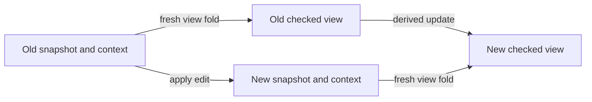
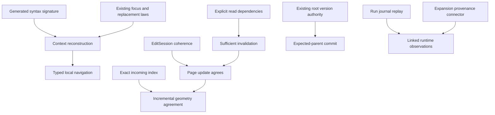

# Program graphs, live edits, and session observations

Status: research and implementation design. Base: `9389e543`.
The primary implementation checkpoint is `a2b589de`, with Claude's later scope work still uncommitted when inspected.
The files under each slice record measured results and exact source hashes.
This note proposes no new program representation.

## 1. Keep the objects separate

| Object | Existing carrier | What its edges mean |
| --- | --- | --- |
| Program syntax | `Eff`, generated `LayerView`, `Node.addresses` | A constructor contains a child at an address. |
| Checked authoring state | `EditSession`, `Sketch`, `Table.Entry` | A focus depends on its signature, environment, and enclosing construct. |
| Drawing | `Tools.View.Graph`, `Tools.View.Flow` | A geometric constraint, displayed flow, or selected explanation. |
| Running program | `Run`, machine points, fibers, explicit commands | One accepted input changes the machine. |
| Proof graph | Registry claims and Lean declaration dependencies | A proof uses another declaration or an open goal. |

An address identifies an occurrence within one program snapshot.
Equal subtrees at different addresses remain different occurrences.
A shared digest can identify equal content, but cannot identify its binding context.
A runtime point additionally retains its environment and parameter stack.
One source occurrence can therefore have many runtime occurrences.

Do not merge these graphs into one edge alphabet.
Reuse the algorithms over each consumer's own edge alphabet and endpoint function.
`Tools.Graph.Walk` already takes this form.
The incoming index follows the same rule: it retains edge payloads, order, and repeated occurrences.

## 2. A cache key must name everything the calculation reads

A pure subtree fold needs only its input subtree and algebra parameters.
A checked subtree also reads its signature, environment, holes, and definition scope.
A rendered subtree additionally reads labels, widths, fonts, and layout choices.
A cached answer requires equality of those inputs, or a proved restriction that makes their differences irrelevant.

The prepared run view binds its cached lines and code panel to `Api.Built`.
That value supplies the actual program and row table.
The snapshot tool fixes the application profile to the empty application.
It compares both canonical byte strings, including the hole table.
It assumes no injectivity property of a digest.

The cache stores the opened input session.
It does not adopt the previous preview's output as implicit input.
Two clients can alternate explicit snapshots without borrowing each other's context.
The generic resolver law compares the whole resolved session with fresh resolution.

A future persistent cache should expose one operation: resolve every context input and the snapshot.
Its caller should not supply independently replaceable source, type, and layout caches.
The implementation can split those internally after proving their dependency boundaries.

## 3. Incremental editing has a commuting square

For a calculation `F`, an input edit `e`, and a derived update `D`, require:

`D(F(s), e) = F(apply(s, e))`.

The observation must be named.
Equality of displayed lines is weaker than equality of checked tables.
Equality of checked tables establishes no equality of execution histories.

`Sketch.table_fill` and `EditSession.feed_repaint` already support the table square.
A spliced delta lists new addresses only.
A client must replace the whole subtree region at the edited path.
Appending those entries would retain deleted addresses.

The next rendering square should observe lines, annotations, and stable source keys.
Geometry can remain a separate recalculation until its own dependency law exists.
A type change can affect an ancestor's label, downstream binder types, and sibling layout constraints.
Local text replacement alone therefore does not justify local geometric repair.

## 4. Index first, then make updates incremental

The indexed candidate answers the existing placement calculation exactly.
It prepares incoming edge occurrences once and consumes the corresponding bucket at each assigned item.
The specification remains the old full-edge fold.
This removes repeated unrelated edge tests without changing the layout policy.

Sparse natural keys matter.
The current placement theorem permits positions outside the displayed item range and repeated assignments.
A bounded array that silently drops those positions would change the theorem's domain.
The index also retains duplicate edges and negative padding.

This optimization does not remove list costs in `heightAt`, item-height lookup, or topological preparation.
Measurements must separate relaxation, placement, and whole layout.
This packet measures assignment only.
A reduced edge count alone is not an end-to-end speed measurement.

The next algorithm should retain reverse dependencies between prepared drawing constraints.
On an edit, seed the changed heights and propagate only changed values through those dependencies.
Acyclic constraints permit ordered propagation.
Cyclic waits keep the existing refusal or separate-lane policy.
Do not use a bounded failed search as a proof of unreachability.

For rank propagation, require an old-rank agreement law before changing queue order.
For layout, retain the current tie-breaking order before changing data structures.
For keyed lookups, prove key uniqueness or retain first-match behavior.
The current drawing has first-match searches and last-write map positions in different places.
A universal key cache would otherwise change behavior on duplicate keys.

## 5. Contexts and zippers reduce authoring work

The generated syntax signature already names constructors, child sorts, and argument sorts.
A useful zipper derives one context constructor for each child position.
Its reconstruction returns the existing `Eff` tree.
It does not store a second program language.

The required operations are focus, replace, ascend, and reconstruct.
The primary connector is reconstruction after focusing equals the original tree.
The replacement connector agrees with existing `replaceAt` at the reconstructed path.
Typing then uses the existing focus and typed-replacement laws.

A context must retain the binding information of the chosen child.
It must not infer that information from a displayed depth.
Definition bodies, passed programs, handlers, loop bodies, and finalizers have different environment rules.
Claude's scope work owns those rules.
The editor should consume them after their shared representation settles.

For variadic lists, moving upward may rebuild a sibling prefix.
Constant-time movement requires a bounded constructor arity or a suitable retained sibling structure.
A measured persistent sequence can improve splitting and concatenation later.
It should replace the existing list through an agreement connector and a concrete consumer.

## 6. Authoring and execution share interaction structure

An authoring session consumes edit commands and emits checked observations.
A running session consumes admitted commands, decisions, and host replies and emits runtime observations.
Both can expose a labelled transition interface.
Their event types, admissibility judgments, and observations remain different.

The program supplies operations through its algebraic meaning.
The host supplies state transitions for those operations through the existing comodel interpretation.
Their interaction is operational meaning; drawing the two objects does not create that interpretation.

Use the existing comodel route and its composition laws.
A reply program can itself request further operations when the handler interpretation supplies that structure.
The host boundary remains explicit at each unmatched operation.
Unanswered choices and exhausted budgets remain live frontiers.
Finalization sees the state produced before failure.

`sessionSystem_finished` and `sessionSystem_finishes` in `Laws/Api/HostDrive.lean` remain fragment-bound.
They require reached, funded, resting, host-driven, finished `StraightRows` runs and matching answer evidence.
Neither proves a claim about every unfinished session graph.
The wider host-meaning packet records the separate loop and scope obligations.

A live editor must therefore display at least two identities.
One identifies the editable snapshot; another identifies the run and its fixed built program.
An edit creates a new snapshot.
It does not silently replace the program underneath a live point.
Such replacement would require a state migration relation covering environments, stacks, fibers, finalizers, and outstanding calls.
No law in this slice supplies that relation.

## 7. Cross-graph links should carry evidence

Represent a link as a relation between typed endpoints, with its justification.
Avoid assuming every relation is a single-valued map.

| Link | Available evidence | Remaining limit |
| --- | --- | --- |
| Source address to checked entry | Address table and focus laws | The signature and snapshot must agree. |
| Source address to rendered line | `Tools.View.Program.lines_at` | Not every source construct has a Flow node. |
| Fork record to creation site | Recorded fork site | It is not every fiber's current execution location. |
| Host call to expanded address | `HostSession.callTable` | Original-source correspondence needs the expansion connector. |
| Journal prefix to runtime observation | `Run.journal_replays` | Fixed built program, configuration, and accepted commands. |
| Claim to proof dependencies | Registry pointer and dependency walk | A dependency cycle in a picture says nothing about runtime deadlock. |

A useful future API returns a link kind, endpoints, and evidence status together.
Unknown correspondence stays absent or explicitly proposed.
The renderer must never invent a source location to fill a picture.

## 8. Proof obligations for the next slices

These are proposed obligations, not proved declarations.
Each includes the five placement points from `AGENTS.md`.

| Obligation | Concept and required property | Question, role, and consumer | Reach and premises | Does not establish | Unlock |
| --- | --- | --- | --- | --- | --- |
| Incremental page agrees | `initial-algebras-folds`; retained folds agree with fresh calculation | Proposed `page-update-agrees`, compatibility; live page updater | Coherent sessions; admitted edit; fixed rendering parameters; line and annotation observation | Layout speed, runtime meaning, or root publication | R14 live authoring |
| Context reconstruction | `initial-algebras-folds`; generated context reconstructs syntax | Proposed helper of `typed-replacement`; focus navigator consumes it | Existing signature and child sorts; successful focus | Substitution under arbitrary contexts or variable capture repair | R14 local navigation |
| Invalidated set is sufficient | `initial-algebras-folds`; unchanged dependencies retain fold values | Proposed `view-dependencies-sufficient`, preservation; incremental layout consumes it | Explicit read dependencies; unchanged external parameters; fixed layout policy | Minimal invalidation, amortized cost, or scheduler progress | R14 cheaper edits |
| Expanded call corresponds | `translation-simulation`; source and expanded calls have a named observation | Existing open expansion-to-source connection; host call navigator consumes it | Admitted program and row table; expansion provenance; matching call instance | Equal raw paths or current fiber location | R13 and R14 linked run views |
| Published edit has expected parent | `exact-codecs`; root moves retain expected version | Helper of the MCP commit claim; commit operation consumes `Store.putRoot` | Valid stored nodes, exact parent identity, next resident version | Automatic rebase or disjoint edit commutation | R14 multiple authors |

## 9. Order of work

1. Land exact indexing, route validation, prepared run views, and explicit snapshot previews.
2. Reuse Claude's settled child-environment and scope data in generated context navigation.
3. Prove the page update square for line and annotation observations.
4. Add reverse dependencies and measured propagation while retaining full recalculation as the specification.
5. Connect immutable snapshots to stored roots through existing version checks.
6. Add source/runtime correspondence only after the expanded-call connector is available.

The first step is this packet's implementation scope.
The later steps require separate plans and measured workloads.
