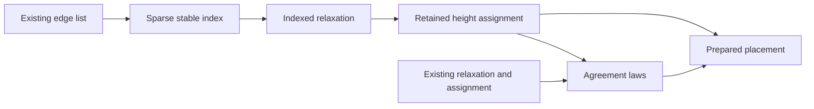

# Incoming edge index

Base: `9389e543`.
Work only in the managed `live-graph-index` worktree.
Keep the existing relaxation and assignment as the specification.

## Finishing criteria

Retain each incoming edge occurrence in its original order.
Answer at every natural position without a dense allocation bound.
Prepare the index once before the height recurrence.
Prove the recurrence answers the existing specification.
Check duplicate edges, repeated assignments, negative values and sparse positions.
Build the changed modules and their direct consumers.
Audit the new declarations and changed laws with the cycle-aware axiom gate.
Measure the actual Lean calculation and record its remaining list costs.

## Representation and arrows

`Tools.Graph.Index` is a sparse binary trie from natural keys to lists of existing values.
Zero reads the current bucket.
A positive key selects a child by parity and continues at half its predecessor.
The path allocates only the bits of keys that occur.
Its constructor folds the existing list into stable buckets.
Its query retains occurrences and their order.
It introduces no program representation.
The Flow consumer selects the target position as the key.

## Five-point proof placement

1. Concept: `initial-algebras-folds`, concept 7 in `docs/core/semantics.md`.
   Property: a retained calculation answers its existing fold.
2. Question and role: indexed relaxation and height assignment have compatibility laws.
   These are named tool laws under decisions row 336, point 8.
   The program graph design places these laws outside registry claims.
   `preparePlacement_height` consumes assignment agreement.
   `place_placed`, `place_descends` and `place_apart` consume that connector.
3. Reach: every natural position, edge list, order, initial height table and fallback.
   Keep duplicate occurrences, original order, repeated assignments and negative integers.
   No formation premise bounds positions by the item count.
4. Exclusions: no scheduler property, program admission or unbounded reachability result.
   No whole-renderer complexity theorem follows.
   Item heights and retained heights still use list lookup.
5. Unlock: cheaper program graph placement and reusable incoming-edge inspection.
   The laws support R14 navigation and advance no machine progress requirement.

Every helper serves the compatibility connector above.
No core source, register, root import or Lake configuration changes.

