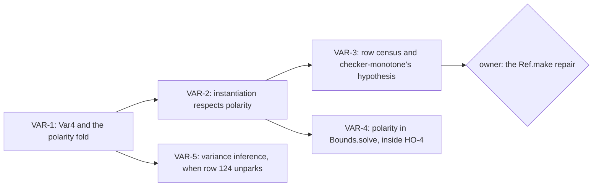

# Brief: one polarity algebra for the type language (slices VAR-1 to VAR-5)

**The one thing.** Land VAR-1 to VAR-3 as laws and a census, with no change of checker behaviour.
The `Ref.make` refusal of `README.md` §4.5 needs an owner ruling before any rule changes.

The evidence is `README.md` and the probes in `probes/`, beside this brief. Start from the base
the coordinator names, in your own worktree. Commit by explicit paths.

## The slices

### VAR-1: `Var4` and one polarity fold

- **Files.** `src/Effect4/Program/Polarity.lean` (a new core module: `module`, `public import`,
  `@[expose] public section`). `src/Effect4/Laws/Program/Polarity.lean` for its laws.
- **Content.** `Var4` with join, composition, order and the Boolean reading `select4`, taken
  from `probes/Variance4.lean` §1–2. `Ty.Variance.toVar4`. The polarity of a parameter as an
  algebra of the generated `TyAlgebra`, folded by `cata_ty`. It takes two readings of the
  heads: `Ty.sub`'s, and membership's (`Ty.valueVarsAlg`'s).
- **Connectors.** `Bounds.comp` is composition on the image of `toVar4`. `Ty.Variance.select`
  is `select4` there. `Ty.valueVars t` holds exactly when every parameter's membership polarity
  is at most co. The first two are the `#guard`s of `probes/RowPolarity.lean`, as theorems.
- **Placement.** Concept `subtyping-algebra`. A new claim `variance-semiring`, role groundwork,
  consumed by VAR-2 and by `Bounds`. Reach: the four variances and the two readings. It
  establishes no subtyping fact of `Ty`. It unlocks VAR-2.
- **Do not** edit `src/Effect4/Program/TyVariance.lean`: it is generated. `Ty.Variance` stays
  the declared alphabet, and `Var4` is the polarity carrier.

### VAR-2: instantiation respects polarity

- **Statement.** If every parameter's two bindings are related by `Ty.sub` at the parameter's
  polarity in `t`, then `Ty.sub (instantiate σ t) (instantiate σ' t)`. This is `eval_respects`
  (`probes/Variance4.lean`) at the model of `Ty`.
- **Route.** One unary lemma per head of `Ty.sub`, then `Model.chain`'s argument. Raw `sub` is
  a preorder (`sub_refl`, `sub_trans`). The union head is covariant in both arguments. A record
  keeps its canonical order when only field types change.
- **Expected friction.** `Bounds.matchArgsB_monotone` relates bindings in `subN`, on normal
  forms. Bridge with `Ty.normalize_instantiate_congr` (`src/Effect4/Laws/Program/Template.lean`).
- **Corollary.** A template whose answer reads each parameter at co or bi gives a smaller answer
  at a smaller request. Combine `Bounds.matchArgsB_monotone` with the statement.
- **Placement.** Concept `subtyping-algebra`. A new claim `instantiate-respects-polarity`,
  consumed by `checker-monotone` (its row share) and by HO-4's `invoke-typed`. Reach: raw
  `Ty.sub` and `Ty.instantiate`. It establishes no semantic variance and nothing of tsgo. It
  unlocks HO-4 (R10) and part of R14.

### VAR-3: the row census and `checker-monotone`'s hypothesis

- **Files.** `Test/Program/RowPolarity.lean`, from `probes/RowPolarity.lean`.
- **Lines.** A finite evaluation: the templates whose answer reads a parameter at a polarity
  above co are exactly `refMake` and `refSet`. Controls: the six verdicts of `pWrite`, and
  `pAtoms` refused at path `[1]`.
- **The registry claim.** Restate `checker-monotone` (`tools/ProofGraph/Registry.lean`) with the
  hypothesis `row-answer-polarity`. Every row and atom scheme that the program reaches reads
  each parameter at answer polarity co or bi.
- **Propose, in your receipt.** A register entry for the `pWrite` witness under
  `Test/Counterexamples/REGISTER.md`. A decisions row for the owner's choice among the three
  repairs of `README.md` §4.5.
- **Placement.** Concept `subtyping-algebra`. Claim `row-answer-polarity`, a premise of
  `checker-monotone`. Reach: the built-in rows and atom schemes. It establishes nothing at a
  supplied row table or a definition block. It unlocks the exact statement of `checker-monotone`.

### VAR-4 (inside HO-4) and VAR-5 (parked)

- **VAR-4.** `Bounds.solve` reads the answer's polarity of each parameter. At co or bi, it takes
  the join of the lower bounds, as today. At contra, it takes an upper bound below all the
  others, or refuses with a request for the type argument. At inv, it follows the ruling of VAR-3.
- **VAR-5.** When row 124 unparks: variance inference by Kleene iteration, and the odd-cycle
  refusal of a structural meaning. `probes/Variance4.lean` §8 holds both, with eight examples.

## Commands

1. Build each new module narrowly: `LEAN_NUM_THREADS=3 lake build Effect4.Program.Polarity`.
2. Build its laws: `LEAN_NUM_THREADS=3 lake build Effect4.Laws.Program.Polarity`.
3. Run the battery: `lake env lean Test/Program/RowPolarity.lean`.
4. Audit the landing: `#axiom_audit Effect4.Program.Polarity Effect4.Laws.Program.Polarity`.
5. Add the imports beside `Effect4.Program.Bounds` in `src/Effect4.lean`.
6. Add the laws beside `Effect4.Laws.Program.Bounds` in `src/Effect4/Laws.lean`.
7. Add the battery beside `Test.Program.BoundsControls` in `Test/All.lean`.

No behaviour gate is owed while the checker's answers stay the same. A ruled repair of VAR-3
changes them, and then owes `check-target`, `check-truth`, `check-corpus` and `check-ts-reader`.

## Proof style

Write `simp only`, never `simp_all`, `first` or `try`. Prove `Var4` facts by cases on the two
Booleans. A searched proof uses a bank of `src/Effect4/Laws/Auto/RuleSets.lean`.
