<!-- GENERATED by tools/Drivers/Semantics.lean (make gen-semantics); do not edit
format: effect4-semantics-report v6
command: make gen-semantics
inputs: tools/Tools/SemanticsRegistry.lean, tools/Tools/Semantics.lean, tools/Drivers/Semantics.lean, tools/Tools/SemanticsDisplay.lean, src/Effect4/Laws/Auto/Semantics.lean, Test/Counterexamples/REGISTER.md, docs/core/decisions.md, lean-toolchain
-->
# Semantics evidence

Selected evidence only. English associations are authored; inherited placement is provisional. The semantic axiom ceiling is not a whole-library gate verdict.

## store-typing

Store Typing: World-indexed semantic value membership (Fits) and store typings

| Claim | Role | Status | Evidence | Evidence at the ceiling | Contested by |
| --- | --- | --- | --- | --- | --- |
| fits-mono | monotonicity | proved | Effect4.Program.Typed.fits_mono | yes |  |
| fits-subn | preservation | proved | Effect4.Program.Typed.fits_subN | yes |  |
| fits-normalize | compatibility | proved | Effect4.Program.Typed.fits_normalize | yes |  |
| fits-scope-inv | inversion | proved | Effect4.Program.Typed.fits_scope_inv | yes |  |
| term-maps-mono | monotonicity | proved | Effect4.Program.Typed.TermMaps.mono | yes |  |
| store-safety | progress | absent | Machine safety is established by inductive configuration typing rather than operational progress (decisions row 139) | — |  |

### Printed statements

**fits-mono**

```lean
∀ {w w' : Effect4.Program.Typed.World},
  w.leHost w' →
    ∀ {ty : Effect4.Program.Ty} {v : Effect4.Machine.Val},
      Effect4.Program.Typed.Fits w v ty → Effect4.Program.Typed.Fits w' v ty
```

Literature: TAPL, §13.5, pp. 165–169 — proofTechnique

Literature: Ahmed2004, audit P1 — adaptedResult

**fits-subn**

```lean
∀ (w : Effect4.Program.Typed.World) {a b : Effect4.Program.Ty},
  Eq (a.subN b) Bool.true →
    ∀ (v : Effect4.Machine.Val), Effect4.Program.Typed.Fits w v a → Effect4.Program.Typed.Fits w v b
```

Literature: TAPL, §15.1, p. 181 — definitionUsed

**fits-normalize**

```lean
∀ (w : Effect4.Program.Typed.World) (t : Effect4.Program.Ty) (v : Effect4.Machine.Val),
  Iff (Effect4.Program.Typed.Fits w v t.normalize) (Effect4.Program.Typed.Fits w v t)
```

Literature: Castagna2024, audit P6 — adaptedResult

**fits-scope-inv**

```lean
∀ {w : Effect4.Program.Typed.World} {v : Effect4.Machine.Val},
  Effect4.Program.Typed.Fits w v Effect4.Program.Ty.scope →
    Exists fun sc =>
      And (Eq v (Effect4.Machine.Val.scopeHandle sc)) (Effect4.Program.Typed.ScopeLive w sc)
```

Literature: ATTAPL, ch. 3, pp. 87–136 — analogy

**term-maps-mono**

```lean
∀ {w w' : Effect4.Program.Typed.World} {f : Effect4.Program.Term} {env : List Effect4.Machine.Val}
  {A R : Effect4.Program.Ty},
  w.leHost w' →
    Effect4.Program.Typed.TermMaps w f env A R → Effect4.Program.Typed.TermMaps w' f env A R
```

Literature: Ahmed2004, audit P1 — adaptedResult

Literature: TAPL, §13.5, pp. 165–169 — excludedFeature

## residual-program-typing

Residual Program Typing: TypedProg, the protocol-indexed judgment on residual programs

| Claim | Role | Status | Evidence | Evidence at the ceiling | Contested by |
| --- | --- | --- | --- | --- | --- |
| instantiated-formation | compatibility | proved | Effect4.Program.rowTy_instantiated_formed | yes |  |
| seq-typed | compatibility | proved | Effect4.Program.Typed.seq_typed | yes |  |
| close-typed | preservation | proved | Effect4.Program.Typed.close_typed | yes |  |
| sound-at-app-signature | compatibility | proved | Effect4.Program.Denote.run_typed_app | yes |  |
| straight-meaning-typed | fundamentalProperty | proved | Effect4.Program.Denote.meaning_typed | yes |  |
| denote-typed | fundamentalProperty | proved | Effect4.Program.Typed.denotesTyped | yes | E4-TYPED-CE-020, E4-TYPED-CE-021, E4-TYPED-CE-022, E4-TYPED-CE-023, E4-TYPED-CE-031 |
| rebuild-admission | compatibility | proved | Effect4.Program.Authoring.rebuild_spec | yes |  |
| denote-typed-layer-free | fundamentalProperty | proved | Effect4.Program.Typed.denotesTyped_of_layerFree | yes |  |
| load-typed-layer-free | preservation | proved | Effect4.Program.Typed.loadsTyped_of_layerFree | yes |  |
| provide-layer-arm | compatibility | proved | Effect4.Program.Typed.provideLayerArm | yes | E4-TYPED-CE-023, E4-TYPED-CE-031 |
| load-typed | preservation | proved | Effect4.Program.Typed.loadsTyped | yes |  |
| load-typed-checked | preservation | proved | Effect4.Program.Typed.load_typed | yes |  |
| bind-closed | compatibility | refuted | Test.Program.TypedProgBindRed.typedProg_not_bind_closed | yes |  |
| guard-bind-typed | compatibility | proved | Effect4.Program.Typed.guardBind_typed | yes |  |
| on-failure-typed | compatibility | proved | Effect4.Program.Typed.catchGuard_typed | yes |  |
| all-guard-typed | compatibility | proved | Effect4.Program.Typed.allGuard_typed | yes |  |
| on-exit-typed | compatibility | proved | Effect4.Program.Typed.onExit_typed | yes |  |
| admitted-source-lawful | compatibility | proved | Effect4.Program.Typed.lawfulSig_of_admitted | yes | E4-TYPED-CE-041 |

### Printed statements

**instantiated-formation**

```lean
∀ {row : Effect4.Program.Row} {request : Effect4.Program.Ty} {ty : Effect4.Program.EffTy},
  Eq (Effect4.Program.rowTy row request) (Option.some ty) →
    Exists fun bindings =>
      And
        (Eq (Effect4.Program.Ty.matchTemplate List.nil row.request.normalize request.normalize)
          (Option.some bindings))
        (Effect4.Program.Formation.Formed
          (Effect4.Program.Formation.instantiatedSites row bindings))
```

**seq-typed**

```lean
∀ (root : Effect4.Program.Typed.ProgramSource) {w : Effect4.Program.Typed.World}
  {mid ty : Effect4.Program.EffTy} {a : Effect4.Program.Sched.RProgram}
  {k : Effect4.Machine.Val → Effect4.Program.Sched.RProgram},
  Effect4.Program.Typed.TypedProg root w mid a →
    (∀ (w' : Effect4.Program.Typed.World),
        w.leHost w' →
          ∀ (v : Effect4.Machine.Val),
            Effect4.Program.Typed.Fits w' v mid.answer →
              Effect4.Program.Typed.TypedProg root w' ty (k v)) →
      Eq mid.error ty.error →
        Effect4.Program.Typed.TypedProg root w ty
          (Effects.Program.bind
            (Effect4.Program.Sched.guardR Effect4.Program.Sched.GuardKind.onSuccess a)
            (Effect4.Program.Sched.seqR k))
```

Literature: ATTAPL, ch. 3, pp. 87–136 — adaptedResult

**close-typed**

```lean
∀ (root : Effect4.Program.Typed.ProgramSource) {w : Effect4.Program.Typed.World}
  {T : Effect4.Program.EffTy} {a : Effect4.Program.Sched.RProgram},
  Effect4.Program.Typed.TypedProg root w T a →
    ∀ (g : Effect4.Machine.ExitV → Effect4.Program.Sched.RProgram),
      Effect4.Program.Typed.TypedProg root w T
        (Effects.Program.bind a fun ex =>
          Effects.Program.vis (Sum.inr (Effect4.Program.Sched.FiberOp.unguard ex)) g)
```

Literature: deVilhenaPottier2021, audit P8 — proofTechnique

**sound-at-app-signature**

```lean
∀ (t : Effect4.Program.RowTable) (s : List (Prod Effect4.ServiceKey Effect4.Program.Ty)),
  (∀ (entry : Prod Effect4.ServiceKey Effect4.Program.Ty),
      List.instMembership.mem s entry → { rows := t }.FreshCode entry) →
    ∀ (e : Effect4.Program.NativeEff) (ty : Effect4.Program.EffTy) (fuel : Nat),
      Eq (Effect4.Program.Denote.Straight e) Bool.true →
        Eq (Effect4.Program.effTy { rows := t, services := s }.signature List.nil e)
            (Option.some ty) →
          instLENat.le (Effect4.Program.Agreement.depth e) fuel →
            instLENat.le (instHAdd.hAdd (instHMul.hMul 2 (Effect4.Program.Agreement.steps e)) 6)
                fuel →
              And (Eq (Effect4.Api.run e fuel).outcome Effect4.Api.Outcome.finished)
                (Exists fun ex =>
                  And (Eq (Effect4.Api.run e fuel).exit (Option.some ex))
                    (Effect4.Program.Denote.ExitHasTy ty.answer ty.error
                      (Effect4.Api.run e fuel).stores ex))
```

**straight-meaning-typed**

```lean
∀ (e : Effect4.Program.NativeEff) (t : Effect4.Program.EffTy),
  Eq (Effect4.Program.Denote.Straight e) Bool.true →
    Eq (Effect4.Program.effTy Effect4.Program.nativeSignature List.nil e) (Option.some t) →
      Effect4.Program.Denote.ExitHasTy t.answer t.error
        (Effect4.Program.Denote.meaning e List.nil Effect4.Machine.Stores.empty).snd
        (Effect4.Program.Denote.meaning e List.nil Effect4.Machine.Stores.empty).fst
```

**denote-typed**

```lean
∀ (root : Effect4.Program.Typed.ProgramSource), Effect4.Program.Typed.DenotesTyped root
```

Literature: XiaEtAl2020, audit P37 — definitionUsed

**rebuild-admission**

```lean
∀ {before after : Effect4.Api.Built} {candidate : Effect4.Api.Program},
  Eq (before.rebuild candidate) (Except.ok after) →
    And (Eq after.program candidate)
      (And (Eq after.table before.table) (Eq after.rowNames before.rowNames))
```

**denote-typed-layer-free**

```lean
∀ (root : Effect4.Program.Typed.ProgramSource),
  Effect4.Program.Typed.LayerFree root.program → Effect4.Program.Typed.DenotesTyped root
```

Literature: XiaEtAl2020, audit P37 — definitionUsed

**load-typed-layer-free**

```lean
∀ (root : Effect4.Program.Typed.ProgramSource) (rootTy : Effect4.Program.EffTy)
  (fuel compileFuel : Nat),
  Effect4.Program.Typed.LayerFree root.program →
    Effect4.Program.Typed.LoadsTyped root rootTy fuel compileFuel
```

**provide-layer-arm**

```lean
∀ (root : Effect4.Program.Typed.ProgramSource), Effect4.Program.Typed.ProvideLayerArm root
```

**load-typed**

```lean
∀ (root : Effect4.Program.Typed.ProgramSource) (rootTy : Effect4.Program.EffTy)
  (fuel compileFuel : Nat), Effect4.Program.Typed.LoadsTyped root rootTy fuel compileFuel
```

**load-typed-checked**

```lean
∀ (root : Effect4.Program.Typed.ProgramSource) (rootTy : Effect4.Program.EffTy)
  (fuel compileFuel : Nat),
  Eq (Effect4.Program.typeOfProgram root.signature root.program) (Option.some rootTy) →
    Exists fun w =>
      Effect4.Program.Typed.MachineTyped root rootTy w
        (Effect4.Program.Sched.loadR root.program fuel compileFuel)
```

**bind-closed**

```lean
∀ (root : Effect4.Program.Typed.ProgramSource) (w : Effect4.Program.Typed.World),
  Exists fun mid =>
    Exists fun ty =>
      Exists fun p =>
        Exists fun k =>
          And (Effect4.Program.Typed.TypedProg root w mid p)
            (And
              (∀ (w' : Effect4.Program.Typed.World),
                w.leHost w' →
                  ∀ (ex : Effect4.Machine.ExitV),
                    Effect4.Program.Typed.ExitOk w' mid ex →
                      Effect4.Program.Typed.TypedProg root w' ty (k ex))
              (Not (Effect4.Program.Typed.TypedProg root w ty (Effects.Program.bind p k))))
```

Literature: deVilhenaPottier2021, audit P8 — excludedFeature

**guard-bind-typed**

```lean
∀ (root : Effect4.Program.Typed.ProgramSource) {w : Effect4.Program.Typed.World}
  {mid ty : Effect4.Program.EffTy} {kind : Effect4.Program.Sched.GuardKind}
  {a : Effect4.Program.Sched.RProgram} {K : Effect4.Machine.ExitV → Effect4.Program.Sched.RProgram},
  Effect4.Program.Typed.TypedProg root w mid a →
    (∀ (w' : Effect4.Program.Typed.World),
        w.leHost w' →
          ∀ (ex : Effect4.Machine.ExitV),
            Eq (kind.hasExitArm ex) Bool.true →
              Effect4.Program.Typed.ExitOk w' mid ex →
                Effect4.Program.Typed.TypedProg root w' ty (K ex)) →
      (∀ (w' : Effect4.Program.Typed.World),
          w.leHost w' →
            ∀ (ex : Effect4.Machine.ExitV),
              Effect4.Program.Typed.ExitOk w' mid ex →
                Eq (kind.hasExitArm ex) Bool.false → Effect4.Program.Typed.ExitOk w' ty ex) →
        Effect4.Program.Typed.TypedProg root w ty
          (Effects.Program.bind (Effect4.Program.Sched.guardR kind a) K)
```

**on-failure-typed**

```lean
∀ (root : Effect4.Program.Typed.ProgramSource) {w : Effect4.Program.Typed.World}
  {mid ty : Effect4.Program.EffTy} {a : Effect4.Program.Sched.RProgram}
  {K : Effect4.Machine.ExitV → Effect4.Program.Sched.RProgram},
  Effect4.Program.Typed.TypedProg root w mid a →
    Eq (mid.answer.subN ty.answer) Bool.true →
      (∀ (w' : Effect4.Program.Typed.World),
          w.leHost w' →
            ∀
              (c :
                Effect4.Cause Effect4.Machine.Err Effect4.Machine.Defect Effect4.FiberId
                  Effect4.Machine.Ann),
              Effect4.Program.Typed.ExitOk w' mid (Effect4.Exit.failure c) →
                Effect4.Program.Typed.TypedProg root w' ty (K (Effect4.Exit.failure c))) →
        Effect4.Program.Typed.TypedProg root w ty
          (Effects.Program.bind
            (Effect4.Program.Sched.guardR Effect4.Program.Sched.GuardKind.onFailure a) K)
```

**all-guard-typed**

```lean
∀ (root : Effect4.Program.Typed.ProgramSource) {w : Effect4.Program.Typed.World}
  {mid ty : Effect4.Program.EffTy} {kind : Effect4.Program.Sched.GuardKind},
  (∀ (ex : Effect4.Machine.ExitV), Eq (kind.hasExitArm ex) Bool.true) →
    ∀ {a : Effect4.Program.Sched.RProgram}
      {K : Effect4.Machine.ExitV → Effect4.Program.Sched.RProgram},
      Effect4.Program.Typed.TypedProg root w mid a →
        (∀ (w' : Effect4.Program.Typed.World),
            w.leHost w' →
              ∀ (ex : Effect4.Machine.ExitV),
                Effect4.Program.Typed.ExitOk w' mid ex →
                  Effect4.Program.Typed.TypedProg root w' ty (K ex)) →
          Effect4.Program.Typed.TypedProg root w ty
            (Effects.Program.bind (Effect4.Program.Sched.guardR kind a) K)
```

**on-exit-typed**

```lean
∀ (root : Effect4.Program.Typed.ProgramSource) {w : Effect4.Program.Typed.World}
  {b f ty : Effect4.Program.EffTy} {body : Effect4.Program.Sched.RProgram}
  {fin : Effect4.Machine.ExitV → Effect4.Program.Sched.RProgram} {flag : Bool},
  Eq (b.answer.subN ty.answer) Bool.true →
    Eq (b.error.subN ty.error) Bool.true →
      Eq (f.error.subN ty.error) Bool.true →
        Effect4.Program.Typed.TypedProg root w b body →
          (∀ (w' : Effect4.Program.Typed.World),
              w.leHost w' →
                ∀ (ex : Effect4.Machine.ExitV),
                  Effect4.Program.Typed.ExitOk w' b ex →
                    Effect4.Program.Typed.TypedProg root w' f (fin ex)) →
            Effect4.Program.Typed.TypedProg root w ty (Effect4.Program.Sched.onExitR body fin flag)
```

**admitted-source-lawful**

```lean
∀ {program : Effect4.Program.NativeEff} {app : Effect4.Program.SigApp}
  (a : Effect4.Program.AdmittedProgram program app), Effect4.Program.LawfulSig app
```

## scope-lifetime-finalization

Scope Lifetime & Finalization: Lifetimes, finalizer registration, and LIFO unwinding

| Claim | Role | Status | Evidence | Evidence at the ceiling | Contested by |
| --- | --- | --- | --- | --- | --- |
| close-idempotent | preservation | proved | Effect4.Scope.close_idempotent | yes |  |
| close-twice | preservation | proved | Effect4.Scope.close_twice | yes |  |
| close-order-eq | inversion | proved | Effect4.Scope.closeOrder_eq | yes |  |
| close-reentrant-add | preservation | proved | Effect4.Scope.close_reentrant_add | yes |  |
| close-seq-protocol | fundamentalProperty | proved | Test.Program.ProtocolPosts.CloseIter.closeSeq_protocol | yes |  |

### Printed statements

**close-idempotent**

```lean
∀ {κ φ : Type u} {β : Type v} {ε δ ι α : Type u}
  (run : φ → Effect4.Exit β ε δ ι α → Effect4.Exit Unit ε δ ι α)
  (self : Effect4.Scope κ φ β ε δ ι α) (exit : Effect4.Exit β ε δ ι α),
  Eq self.isClosed Bool.true →
    Eq (Effect4.Scope.close run self exit) { fst := self, snd := Effect4.Exit.void }
```

Literature: PFPL, ch. 28, §28.1, p. 261 — adaptedResult

**close-twice**

```lean
∀ {κ φ : Type u} {β : Type v} {ε δ ι α : Type u}
  (run : φ → Effect4.Exit β ε δ ι α → Effect4.Exit Unit ε δ ι α)
  (self : Effect4.Scope κ φ β ε δ ι α) (first second : Effect4.Exit β ε δ ι α),
  Eq (Effect4.Scope.close run (Effect4.Scope.close run self first).fst second)
    { fst := (Effect4.Scope.close run self first).fst, snd := Effect4.Exit.void }
```

**close-order-eq**

```lean
∀ {κ φ : Type u} {β : Type v} {ε δ ι α : Type u} (self : Effect4.Scope κ φ β ε δ ι α),
  Eq self.closeOrder (List.map Prod.snd self.finalizers).reverse
```

Literature: ATTAPL, ch. 3, pp. 87–136 — analogy

**close-reentrant-add**

```lean
∀ {κ φ : Type u} {β : Type v} {ε δ ι α : Type u} [inst : DecidableEq κ]
  (run : φ → Effect4.Exit β ε δ ι α → Effect4.Exit Unit ε δ ι α)
  (self : Effect4.Scope κ φ β ε δ ι α) (exit : Effect4.Exit β ε δ ι α) (key : κ) (finalizer : φ),
  Eq self.isClosed Bool.false →
    Eq (Effect4.Scope.addExit run (self.closeState exit) key finalizer)
      { fst := self.closeState exit, snd := run finalizer exit }
```

**close-seq-protocol**

```lean
∀ (root : Effect4.Program.Typed.ProgramSource) (ex : Effect4.Machine.ExitV)
  (remaining : List Effect4.Machine.FinName)
  (captured :
    List
      (Effect4.Reason Effect4.Machine.Err Effect4.Machine.Defect Effect4.FiberId
        Effect4.Machine.Ann))
  (w : Test.Program.ProtocolPosts.W),
  Test.Program.ProtocolPosts.CloseIter.CapturedOk captured →
    (∀ (w' : Effect4.Program.Typed.World),
        Effect4.Program.Typed.World.leHost w w' →
          ∀ (fin : Effect4.Machine.FinName),
            List.instMembership.mem remaining fin →
              Effect4.Program.Typed.TypedProg root w'
                (Effect4.Program.EffTy.pure Effect4.Program.Ty.unit)
                (Effect4.Program.Sched.denoteFin fin ex)) →
      Effect4.Program.Typed.IteratorProtocol root w
        (Effect4.Program.EffTy.pure (Effect4.Program.Ty.unit.exitOf Effect4.Program.Ty.never))
        (Effect4.Program.EffTy.pure Effect4.Program.Ty.unit)
        (Effect4.Program.EffName.store (Effect4.Machine.Name.closeSeq remaining ex captured))
```

Literature: deVilhenaPottier2021, audit P8 — adaptedResult

## reactive-scheduling

Reactive Scheduling: Multi-fiber execution, decision steps, and configuration invariants

| Claim | Role | Status | Evidence | Evidence at the ceiling | Contested by |
| --- | --- | --- | --- | --- | --- |
| machine-typed-not-halted | inversion | proved | Effect4.Program.Typed.machineTyped_not_halted | yes |  |
| flush-fair | fundamentalProperty | proved | Effect4.Machine.Scheduling.flush_fair | yes |  |
| step-loop-preserves | preservation | proved | Effect4.Program.Typed.loop_preserves | yes | E4-TYPED-CE-012, E4-TYPED-CE-025 |
| step-deliver-preserves | preservation | proved | Effect4.Program.Typed.deliver_preserves | yes | E4-TYPED-CE-025 |
| store-frame-typing | preservation | proved | Effect4.Program.Typed.configTyped_frame | yes |  |
| waiter-completion-typing | preservation | proved | Effect4.Program.Typed.completionStrong_await | yes |  |
| step-wake-preserves | preservation | proved | Effect4.Program.Typed.wake_preserves | yes | E4-TYPED-CE-026 |
| step-launch-preserves | preservation | proved | Effect4.Program.Typed.launch_preserves | yes | E4-TYPED-CE-029 |
| step-registration-done-preserves | preservation | proved | Effect4.Program.Typed.registrationDone_preserves | yes | E4-TYPED-CE-028 |
| drivestate-lift | simulation | proved | Effect4.Machine.Lift.driveState_lift | yes |  |
| typed-state-admitted | preservation | proved | Effect4.Program.Typed.reachable_typed | yes |  |
| run-work-selection | compatibility | proved | Effect4.Run.nextControl_spec | yes |  |
| scheduler-progress | progress | absent | Operational progress is an open obligation; machineTyped_not_halted provides an invariant consequence (stuck = none) without successor existence | — |  |
| fair-tape-drains-armed | adequacy | proved | Effect4.Machine.Scheduling.fairTape_unarmed | yes |  |
| frontier-names-work | inversion | proved | Effect4.Api.frontier_empty_iff_deadlocked | yes |  |
| decision-keeps-typed | preservation | proved | Effect4.Program.Typed.decision_preserves | yes |  |
| fair-scheduling | adequacy | absent | Weak fairness progress is open (R12; decisions row 86) | — |  |

### Printed statements

**machine-typed-not-halted**

```lean
∀ (root : Effect4.Program.Typed.ProgramSource) (rootTy : Effect4.Program.EffTy)
  (w : Effect4.Program.Typed.World) (m : Effect4.Program.Sched.RState)
  (why : Effect4.Machine.Stuck),
  Not (Effect4.Program.Typed.MachineTyped root rootTy w (Effect4.Machine.RunMachine.halt m why))
```

Literature: PFPL, ch. 28, §28.2, p. 263 — adaptedResult

**flush-fair**

```lean
∀ {ν σ : Type u} {β : Type v} {ε δ ι α χ : Type u} {St : Type (max u v)} [inst : DecidableEq ε]
  [inst_1 : DecidableEq δ] [inst_2 : DecidableEq ι] [inst_3 : DecidableEq α]
  (interp : Effect4.Machine.RunInterp ν σ β ε δ ι α χ St) (fuel rounds : Nat)
  (m : Effect4.Machine.RunMachine ν σ β ε δ ι α χ St),
  (m.armed (Effect4.Prim ν σ β ε δ ι α) (Effect4.FrameFiber ν σ β ε δ ι α)
        (Effect4.FrameEvent ν σ β ε δ ι α)).Nodup →
    Eq
        (Effect4.Machine.Scheduling.FlushReady interp fuel
          (m.armed (Effect4.Prim ν σ β ε δ ι α) (Effect4.FrameFiber ν σ β ε δ ι α)
              (Effect4.FrameEvent ν σ β ε δ ι α)).length
          m)
        Bool.true →
      instLENat.le
          (m.armed (Effect4.Prim ν σ β ε δ ι α) (Effect4.FrameFiber ν σ β ε δ ι α)
              (Effect4.FrameEvent ν σ β ε δ ι α)).length
          rounds →
        ∀ (owner : Effect4.FiberId),
          List.instMembership.mem
              (m.armed (Effect4.Prim ν σ β ε δ ι α) (Effect4.FrameFiber ν σ β ε δ ι α)
                (Effect4.FrameEvent ν σ β ε δ ι α))
              owner →
            Eq (Effect4.Machine.Scheduling.FiredWithin interp fuel rounds m owner) Bool.true
```

Literature: LynchVaandrager1995, audit C4 — proofTechnique

**step-loop-preserves**

```lean
∀ (root : Effect4.Program.Typed.ProgramSource) (rootTy : Effect4.Program.EffTy)
  (id : Effect4.FiberId) (y : Bool),
  Effect4.Program.Typed.StepPreserves root rootTy (Effect4.Machine.Cmd.loop id y)
```

Literature: WrightFelleisen1994, audit P36 — adaptedResult

**step-deliver-preserves**

```lean
∀ (root : Effect4.Program.Typed.ProgramSource) (rootTy : Effect4.Program.EffTy)
  (id : Effect4.FiberId) (y : Bool),
  Effect4.Program.Typed.StepPreserves root rootTy (Effect4.Machine.Cmd.deliver id y)
```

**store-frame-typing**

```lean
∀ {root : Effect4.Program.Typed.ProgramSource} {rootTy : Effect4.Program.EffTy}
  {w : Effect4.Program.Typed.World} {m : Effect4.Program.Sched.RState}
  {q : List Effect4.Program.Sched.RCmd},
  Effect4.Program.Typed.ConfigTyped root rootTy w m q →
    ∀ {s : Effect4.Machine.Stores},
      Effect4.Program.Typed.StoreFrame m.state s →
        s.WF →
          Effect4.Program.Typed.StoresOk (Effect4.Program.Typed.preds root)
              { ids := w.ids, state := s, Γ := w.Γ, «Π» := w.«Π», Ρ := w.Ρ, Θ := w.Θ,
                serviceTy := w.serviceTy }
              Effect4.Program.Typed.Expect.root s →
            List.instHasSubset.Subset
                (Effect4.Program.Guard.internalKeys
                  { fibers := m.fibers, races := m.races, nextId := m.nextId,
                    nextToken := m.nextToken, nextRace := m.nextRace,
                    middlewareInstalled := m.middlewareInstalled, armed := m.armed, state := s,
                    trace := m.trace, stuck := m.stuck, forks := m.forks })
                (Effect4.Program.Guard.internalKeys m) →
              (∀
                  (o :
                    Effect4.Machine.Owed
                      (Effect4.Machine.Completion Effect4.Machine.Val Effect4.Machine.Err
                        Effect4.Machine.Defect Effect4.FiberId Effect4.Machine.Ann)),
                  List.instMembership.mem
                      (s.deferreds.due
                        (Effect4.Machine.Completion Effect4.Machine.Val Effect4.Machine.Err
                          Effect4.Machine.Defect Effect4.FiberId Effect4.Machine.Ann))
                      o →
                    ∀ (owner : Effect4.FiberId) (priority : Nat),
                      Eq o.mode (Effect4.Machine.WakeMode.scheduled owner priority) →
                        Eq (Effect4.Machine.RunMachine.fiber? m owner).isSome Bool.true) →
                And
                  (w.leHost
                    { ids := w.ids, state := s, Γ := w.Γ, «Π» := w.«Π», Ρ := w.Ρ, Θ := w.Θ,
                      serviceTy := w.serviceTy })
                  (Effect4.Program.Typed.ConfigTyped root rootTy
                    { ids := w.ids, state := s, Γ := w.Γ, «Π» := w.«Π», Ρ := w.Ρ, Θ := w.Θ,
                      serviceTy := w.serviceTy }
                    { fibers := m.fibers, races := m.races, nextId := m.nextId,
                      nextToken := m.nextToken, nextRace := m.nextRace,
                      middlewareInstalled := m.middlewareInstalled, armed := m.armed, state := s,
                      trace := m.trace, stuck := m.stuck, forks := m.forks }
                    q)
```

Literature: deVilhenaPottier2021, §4.2.4 (frame rule); audit P8 — analogy

**waiter-completion-typing**

```lean
∀ {w : Effect4.Program.Typed.World} {a e : Effect4.Program.Ty} {ty : Effect4.Program.EffTy}
  {c :
    Effect4.Machine.Completion Effect4.Machine.Val Effect4.Machine.Err Effect4.Machine.Defect
      Effect4.FiberId Effect4.Machine.Ann},
  Effect4.Program.Typed.AwaitDemand a e ty →
    Effect4.Program.Typed.CompletionStrong w
        { answer := a, error := e, requires := Effect4.Machine.Env.Requirement.empty } c →
      Effect4.Program.Typed.CompletionStrong w ty c
```

Literature: deVilhenaPottier2021, §3.3 (protocol subsumption); audit P8 — proofTechnique

**step-wake-preserves**

```lean
∀ (root : Effect4.Program.Typed.ProgramSource) (rootTy : Effect4.Program.EffTy)
  (list : Effect4.Machine.WakeKey) (phase : Effect4.Machine.WakePhase),
  Effect4.Program.Typed.StepPreserves root rootTy (Effect4.Machine.Cmd.wake list phase)
```

Literature: LynchVaandrager1995, §6 (invariants); audit C4 — proofTechnique

**step-launch-preserves**

```lean
∀ (root : Effect4.Program.Typed.ProgramSource) (rootTy : Effect4.Program.EffTy) (raceId : Nat),
  Effect4.Program.Typed.StepPreserves root rootTy (Effect4.Machine.Cmd.launch raceId)
```

**step-registration-done-preserves**

```lean
∀ (root : Effect4.Program.Typed.ProgramSource) (rootTy : Effect4.Program.EffTy) (raceId : Nat)
  (yielding : Bool),
  Effect4.Program.Typed.StepPreserves root rootTy
    (Effect4.Machine.Cmd.registrationDone raceId yielding)
```

**drivestate-lift**

```lean
∀ {ν σ : Type u} {β : Type v} {ε δ ι α χ : Type u} {St : Type (max u v)} [inst : DecidableEq ε]
  [inst_1 : DecidableEq δ] [inst_2 : DecidableEq ι] [inst_3 : DecidableEq α]
  {κ φ η : Type (max u v)} [inst_4 : Effect4.Machine.FiberCore ν β ε δ ι α κ φ]
  [inst_5 : Effect4.Machine.FiberEvaluator ν σ β ε δ ι α χ St κ φ η] {W : Type w}
  (o : Effect4.Laws.Effects.WorldOrder W) (interp : Effect4.Machine.RunInterp ν σ β ε δ ι α χ St κ)
  (I :
    W →
      Effect4.Machine.RunMachine ν σ β ε δ ι α χ St κ φ η →
        List (Effect4.Machine.Cmd ν σ β ε δ ι α κ) → Prop),
  Effect4.Machine.Lift.StepKeeps o interp I →
    ∀ (fuel : Nat) (w : W) (m : Effect4.Machine.RunMachine ν σ β ε δ ι α χ St κ φ η)
      (cmds : List (Effect4.Machine.Cmd ν σ β ε δ ι α κ)),
      I w m cmds →
        Exists fun w' =>
          And (o.le w w')
            (I w' (Effect4.Machine.driveState interp fuel m cmds).fst
              (Effect4.Machine.driveState interp fuel m cmds).snd)
```

Literature: PFPL, ch. 28, pp. 261–268 — proofTechnique

**typed-state-admitted**

```lean
∀ (root : Effect4.Program.Typed.ProgramSource) (rootTy : Effect4.Program.EffTy) (fuel : Nat),
  Eq (Effect4.Program.typeOfProgram root.signature root.program) (Option.some rootTy) →
    ∀ (tape : List Effect4.Api.Decision),
      Effect4.Program.Typed.AdmittedTape root rootTy fuel tape →
        Exists fun w =>
          Effect4.Program.Typed.MachineTyped root rootTy w
            (Effect4.Machine.ReplayResult.machine
              (Effect4.Program.Sched.replayR root.program fuel tape))
```

**run-work-selection**

```lean
∀ (s : Effect4.Run) (decision : Effect4.Api.Decision),
  Iff (Eq s.nextControl (Option.some decision))
    (And
      (Eq
        (s.machine.stuck
          (Effect4.Prim Effect4.Program.EffName Effect4.Program.EffThunk Effect4.Machine.Val
            Effect4.Machine.Err Effect4.Machine.Defect Effect4.FiberId Effect4.Machine.Ann)
          (Effect4.FrameFiber Effect4.Program.EffName Effect4.Program.EffThunk Effect4.Machine.Val
            Effect4.Machine.Err Effect4.Machine.Defect Effect4.FiberId Effect4.Machine.Ann)
          (Effect4.FrameEvent Effect4.Program.EffName Effect4.Program.EffThunk Effect4.Machine.Val
            Effect4.Machine.Err Effect4.Machine.Defect Effect4.FiberId Effect4.Machine.Ann))
        Option.none)
      (Or (And (Eq decision Effect4.Api.flush) (Ne s.work.queued List.nil))
        (Exists fun fiber =>
          And (Eq decision (Effect4.Machine.RunDecision.evaluate fiber))
            (And (Eq s.work.queued List.nil) (Eq s.work.runnable.head? (Option.some fiber))))))
```

**fair-tape-drains-armed**

```lean
∀ {ν σ : Type u} {β : Type v} {ε δ ι α χ : Type u} {St : Type (max u v)} [inst : DecidableEq ε]
  [inst_1 : DecidableEq δ] [inst_2 : DecidableEq ι] [inst_3 : DecidableEq α]
  (interp : Effect4.Machine.RunInterp ν σ β ε δ ι α χ St) (fuel : Nat)
  (m : Effect4.Machine.RunMachine ν σ β ε δ ι α χ St)
  (tape : List (Effect4.Machine.RunDecision ν σ β ε δ ι α)),
  Effect4.Machine.Scheduling.FairTape interp fuel m tape →
    Eq (Effect4.Machine.Suffices interp fuel tape m) Bool.true →
      Eq
          ((Effect4.Machine.replayEval interp fuel tape m).machine.stuck
            (Effect4.Prim ν σ β ε δ ι α) (Effect4.FrameFiber ν σ β ε δ ι α)
            (Effect4.FrameEvent ν σ β ε δ ι α))
          Option.none →
        Eq
          ((Effect4.Machine.replayEval interp fuel tape m).machine.armed
            (Effect4.Prim ν σ β ε δ ι α) (Effect4.FrameFiber ν σ β ε δ ι α)
            (Effect4.FrameEvent ν σ β ε δ ι α))
          List.nil
```

**frontier-names-work**

```lean
∀ (m : Effect4.Program.NativeMachine),
  Eq
      (m.stuck
        (Effect4.Prim Effect4.Program.EffName Effect4.Program.EffThunk Effect4.Machine.Val
          Effect4.Machine.Err Effect4.Machine.Defect Effect4.FiberId Effect4.Machine.Ann)
        (Effect4.FrameFiber Effect4.Program.EffName Effect4.Program.EffThunk Effect4.Machine.Val
          Effect4.Machine.Err Effect4.Machine.Defect Effect4.FiberId Effect4.Machine.Ann)
        (Effect4.FrameEvent Effect4.Program.EffName Effect4.Program.EffThunk Effect4.Machine.Val
          Effect4.Machine.Err Effect4.Machine.Defect Effect4.FiberId Effect4.Machine.Ann))
      Option.none →
    Eq (Effect4.Machine.RunMachine.finished m) Bool.false →
      Iff (Eq (Effect4.Api.frontierReasons Effect4.Machine.Exhaustion.tape m) List.nil)
        (Effect4.Api.Deadlocked m)
```

**decision-keeps-typed**

```lean
∀ (root : Effect4.Program.Typed.ProgramSource) (rootTy : Effect4.Program.EffTy) (fuel : Nat)
  (d : Effect4.Api.Decision), Effect4.Program.Typed.DecisionKeeps root rootTy fuel d
```

Literature: PFPL, chs. 39–41, pp. 371–406 — excludedFeature

## exact-codecs

Exact Codecs: Invertible embeddings for JSON and Schema representations

| Claim | Role | Status | Evidence | Evidence at the ceiling | Contested by |
| --- | --- | --- | --- | --- | --- |
| type-metadata-exact | compatibility | proved | Effect4.Codegen.Metadata.type_metadata_exact | yes |  |
| decode-iff | decidability | proved | Effect4.Schema.decode_iff | yes |  |
| decode-encode | compatibility | proved | Effect4.Schema.decode_encode | yes |  |
| of-schema-exact | compatibility | proved | Effect4.Schema.Bridge.ofSchema_exact | yes |  |
| of-schema-schema | compatibility | proved | Effect4.Schema.Bridge.ofSchema_schema | yes |  |
| collection-term-print-read | compatibility | proved | Effect4.Program.readTerm_printTerm | yes |  |
| record-codec-layout | compatibility | proved | Effect4.Schema.decode_iff | yes |  |
| service-identifier-injective | compatibility | proved | Effect4.Program.keyIdentifier_injective | yes |  |
| error-payload-exact | compatibility | proved | Effect4.Program.errOf_valOfErr | yes |  |
| payload-class-decl-exact | compatibility | proved | Effect4.Codegen.admitModule_classDecls | yes |  |

### Printed statements

**type-metadata-exact**

```lean
And
  (∀ (t : Effect4.Program.Ty),
    Eq (Effect4.Codegen.Metadata.readTy (Effect4.Codegen.Metadata.writeTy t)) (Option.some t))
  (∀ (e : TypeScript.Expr) (t : Effect4.Program.Ty),
    Eq (Effect4.Codegen.Metadata.readTy e) (Option.some t) →
      Eq (Effect4.Codegen.Metadata.writeTy t) e)
```

**decode-iff**

```lean
∀ {t : Effect4.Program.Ty} {j : Effect4.Json} {v : Effect4.Machine.Val},
  Iff (Eq (Effect4.Schema.decode t j) (Option.some v))
    (Exists fun j' =>
      And (Eq (Effect4.Schema.encode t v) (Option.some j'))
        (Eq (Effect4.Schema.Codec.normJ j') (Effect4.Schema.Codec.normJ j)))
```

Literature: RendelOstermann2010, audit P32 — definitionUsed

**decode-encode**

```lean
∀ {t : Effect4.Program.CTy} {v : Effect4.Machine.Val},
  Eq (Effect4.Program.Val.hasTy v t.toRaw) Bool.true →
    Eq (t.toRaw.isCodecValue v) Bool.true →
      Eq ((Effect4.Schema.encode t.toRaw v).bind (Effect4.Schema.decode t.toRaw)) (Option.some v)
```

Literature: FosterEtAl2007, audit P11 — adaptedResult

**of-schema-exact**

```lean
∀ (r : Effect4.Representation) (t : Effect4.Program.Ty),
  Eq (Effect4.Schema.Bridge.ofSchema r) (Option.some t) →
    Eq (Effect4.Schema.Bridge.normS r) (Effect4.Schema.Bridge.schema t)
```

Literature: RendelOstermann2010, audit P32 — adaptedResult

**of-schema-schema**

```lean
∀ (t : Effect4.Program.Ty),
  Eq t.closed Bool.true →
    Eq (Effect4.Schema.Bridge.reservedFree t) Bool.true →
      Eq (Effect4.Schema.Bridge.ofSchema (Effect4.Schema.Bridge.schema t)) (Option.some t)
```

**collection-term-print-read**

```lean
∀ {classes : Effect4.Codegen.Classes.Classes} {n : Nat} (t : Effect4.Program.Term),
  Eq (Effect4.Program.Term.scoped n t) Bool.true →
    Eq (Effect4.Program.Term.covers classes t) Bool.true →
      Eq (Effect4.Program.readTerm classes n (Effect4.Program.printTerm t)) (Except.ok t)
```

**record-codec-layout**

```lean
∀ {t : Effect4.Program.Ty} {j : Effect4.Json} {v : Effect4.Machine.Val},
  Iff (Eq (Effect4.Schema.decode t j) (Option.some v))
    (Exists fun j' =>
      And (Eq (Effect4.Schema.encode t v) (Option.some j'))
        (Eq (Effect4.Schema.Codec.normJ j') (Effect4.Schema.Codec.normJ j)))
```

**service-identifier-injective**

```lean
∀ (scopeKey : Effect4.ServiceKey), Function.Injective (Effect4.Program.keyIdentifier scopeKey)
```

**error-payload-exact**

```lean
∀ (e : Effect4.Machine.Err) (v : Effect4.Machine.Val),
  Eq (Effect4.Program.valOfErr e) (Option.some v) → Eq (Effect4.Program.errOf v) e
```

**payload-class-decl-exact**

```lean
∀ {table : Effect4.Program.RowTable} {name : String}
  {allowed : List Effect4.Codegen.Bindings.Origin} {ambient : List TypeScript.Import}
  {module : TypeScript.Module} {r : Effect4.Codegen.ModuleReading table name allowed ambient},
  Eq (Effect4.Codegen.admitModule name module table allowed ambient) (Except.ok r) →
    Eq (Effect4.Program.splitClasses module.decls).fst r.classDecls
```

## subtyping-algebra

Subtyping Algebra: Preorder laws, normalization, and join-semilattice on CTy

| Claim | Role | Status | Evidence | Evidence at the ceiling | Contested by |
| --- | --- | --- | --- | --- | --- |
| raw-formation | decidability | proved | Effect4.Program.Formation.checkInput_eq_none_iff | yes |  |
| subn-refl | compatibility | proved | Effect4.Program.Ty.subN_refl | yes |  |
| subn-trans | transitivity | proved | Effect4.Program.Ty.subN_trans | yes |  |
| subn-equiv-iff | decidability | proved | Effect4.Program.Ty.subN_equiv_iff | yes |  |
| normalize-idem | compatibility | proved | Effect4.Program.Ty.normalize_idem | yes |  |
| sub-antisymm-canonical | antisymmetry | proved | Effect4.Program.Ty.sub_antisymm_canonical | yes |  |
| template-match-anchored | decidability | proved | Effect4.Program.Ty.matchTemplate_complete_anchored | yes |  |

### Printed statements

**raw-formation**

```lean
∀ {Op : Type} (program : Effect4.Program.Eff Op) (table : List Effect4.Program.Row),
  Iff (Eq (Effect4.Program.Formation.checkInput program table) Option.none)
    (Effect4.Program.Formation.InputFormed program table)
```

**subn-refl**

```lean
∀ (a : Effect4.Program.Ty), Eq (a.subN a) Bool.true
```

Literature: TAPL, §15.2, p. 182 — definitionUsed

**subn-trans**

```lean
∀ {a b c : Effect4.Program.Ty},
  Eq (a.subN b) Bool.true → Eq (b.subN c) Bool.true → Eq (a.subN c) Bool.true
```

Literature: TAPL, §15.2, p. 182 — proofTechnique

**subn-equiv-iff**

```lean
∀ (a b : Effect4.Program.Ty),
  Iff (And (Eq (a.subN b) Bool.true) (Eq (b.subN a) Bool.true)) (Eq a.normalize b.normalize)
```

Literature: TAPL, §16.3, p. 218 — adaptedResult

**normalize-idem**

```lean
∀ (t : Effect4.Program.Ty), Eq t.normalize.normalize t.normalize
```

**sub-antisymm-canonical**

```lean
∀ (a b : Effect4.Program.CTy),
  Eq (a.toRaw.sub b.toRaw) Bool.true → Eq (b.toRaw.sub a.toRaw) Bool.true → Eq a b
```

Literature: Castagna2024, audit P6 — adaptedResult

**template-match-anchored**

```lean
∀ {t r : Effect4.Program.Ty} {τ : Effect4.Program.Ty.Subst},
  t.Normal →
    Eq t.templateAdmissible Bool.true →
      Eq t.anchored Bool.true →
        r.Normal →
          Eq r.bottomFree Bool.true →
            Eq (r.normalize.sub (Effect4.Program.Ty.instantiate τ t).normalize) Bool.true →
              Exists fun σ => Eq (Effect4.Program.Ty.matchTemplate List.nil t r) (Option.some σ)
```

## initial-algebras-folds

Initial Algebras & Folds: Free syntax objects, catamorphisms, and fold uniqueness

| Claim | Role | Status | Evidence | Evidence at the ceiling | Contested by |
| --- | --- | --- | --- | --- | --- |
| hom-eq-cata-eff | fundamentalProperty | proved | Effect4.Program.hom_eq_cata_eff | yes |  |
| inhabited-iff-fits | decidability | proved | Effect4.Program.Typed.inhabited_iff_fits | yes |  |
| cata-eff-congr-on | compatibility | proved | Effect4.Program.cata_eff_congr_on | yes |  |
| addressed-replacement | compatibility | proved | Effect4.Program.Node.replaceAt_spec | yes |  |
| operation-data-scoped | decidability | proved | Effect4.Program.Eff.perform_scoped_iff | yes |  |

### Printed statements

**hom-eq-cata-eff**

```lean
∀ {Op : Type} {R : Effect4.Program.EffFam → Type u} {alg : Effect4.Program.EffAlgebra Op R}
  (hom : Effect4.Program.EffHom alg) (node : Effect4.Program.Eff Op),
  Eq (hom.f_eff node) (Effect4.Program.cata_eff alg node)
```

Literature: MeijerFokkingaPaterson1991, audit P24 — definitionUsed

Literature: Gibbons2002, audit P12 — proofTechnique

**inhabited-iff-fits**

```lean
∀ (t : Effect4.Program.Ty),
  Iff (Eq (Effect4.Program.inhabited t) Bool.true)
    (Exists fun w => Exists fun v => Effect4.Program.Typed.Fits w v t)
```

Literature: TAPL, §16.1, p. 210 — adaptedResult

**cata-eff-congr-on**

```lean
∀ {Op : Type} {R : Effect4.Program.EffFam → Type u} {alg₁ alg₂ : Effect4.Program.EffAlgebra Op R}
  {okOp : Op → Prop} {okKey : Effect4.ServiceKey → Prop},
  alg₁.AgreeOn alg₂ okOp okKey →
    ∀ (e : Effect4.Program.Eff Op),
      Effect4.Program.cata_eff (Effect4.Program.readsAlg okOp okKey) e →
        Eq (Effect4.Program.cata_eff alg₁ e) (Effect4.Program.cata_eff alg₂ e)
```

**addressed-replacement**

```lean
∀ {Op : Type} {node result replacement : Effect4.Program.Node Op} {path : List Nat},
  Eq (node.replaceAt path replacement) (Option.some result) →
    And (Eq (result.at_ path) (Option.some replacement))
      (And (Eq result.ctorIdx node.ctorIdx)
        (∀ (old : Effect4.Program.Node Op),
          Eq (node.at_ path) (Option.some old) → Eq (result.replaceAt path old) (Option.some node)))
```

**operation-data-scoped**

```lean
∀ {Op : Type} [inst : Effect4.Program.ScopedOp Op] (n : Nat) (op : Op) (arg : Effect4.Program.Term),
  Iff (Eq (Effect4.Program.Eff.scopedAt n (Effect4.Program.Eff.perform op arg)) Bool.true)
    (And (Eq (inst.scopedAt op n) Bool.true) (Eq (Effect4.Program.Term.scoped n arg) Bool.true))
```

## context-requirements

Context Requirements: Graded coeffects, requirement rows, and layer discharge

| Claim | Role | Status | Evidence | Evidence at the ceiling | Contested by |
| --- | --- | --- | --- | --- | --- |
| satisfies-empty | compatibility | proved | Effect4.Machine.Env.Context.satisfies_empty | yes |  |
| satisfies-single | inversion | proved | Effect4.Machine.Env.Context.satisfies_single | yes |  |
| satisfies-union | compatibility | proved | Effect4.Machine.Env.Context.satisfies_union | yes |  |
| satisfies-weaken | weakening | proved | Effect4.Machine.Env.Context.satisfies_weaken | yes |  |
| emission-requirements-complete | compatibility | proved | Effect4.Codegen.ModuleEmission.annotation_complete | yes |  |
| provide-discharges | preservation | proved | Effect4.Program.Provision.LayerTy.provide_discharges | yes |  |
| provide-closed | fundamentalProperty | proved | Effect4.Program.Provision.LayerTy.provide_closed | yes |  |
| build-total | progress | proved | Effect4.Program.Provision.build_total | yes |  |

### Printed statements

**satisfies-empty**

```lean
∀ {U : Effect4.ServiceUniverse} (self : Effect4.Machine.Env.Context U),
  self.Satisfies Effect4.Machine.Env.Requirement.empty
```

Literature: PetricekOrchardMycroft2014, audit C8 — analogy

**satisfies-single**

```lean
∀ {U : Effect4.ServiceUniverse} (self : Effect4.Machine.Env.Context U) (key : Effect4.ServiceKey),
  Iff (self.Satisfies (Effect4.Machine.Env.Requirement.single key))
    (Eq (self.get? key).isSome Bool.true)
```

**satisfies-union**

```lean
∀ {U : Effect4.ServiceUniverse} (self : Effect4.Machine.Env.Context U)
  (r s : Effect4.Machine.Env.Requirement),
  Iff (self.Satisfies (r.union s)) (And (self.Satisfies r) (self.Satisfies s))
```

**satisfies-weaken**

```lean
∀ {U : Effect4.ServiceUniverse} (self : Effect4.Machine.Env.Context U)
  {r s : Effect4.Machine.Env.Requirement},
  self.Satisfies s → Effect4.Row.Subset r s → self.Satisfies r
```

**emission-requirements-complete**

```lean
∀ {program : Effect4.Program.NativeEff} {table : Effect4.Program.RowTable} {name : String}
  (emission : Effect4.Codegen.ModuleEmission program table name),
  Exists fun layers =>
    Exists fun main =>
      Exists fun body =>
        Exists fun answer =>
          Exists fun error =>
            And
              (Eq emission.declarations
                (instHAppendOfAppend.hAppend layers (List.cons main List.nil)))
              (And
                (Eq
                  (Effect4.Program.printDecl name emission.typing.ty body
                    Effect4.Program.nativeScopeKey)
                  (Except.ok main))
                (Eq main.type
                  (Option.some
                    (TypeScript.TypeRef.name (List.cons "Effect" (List.cons "Effect" List.nil))
                      (List.cons answer
                        (List.cons error
                          (List.cons
                            (Effect4.Program.requirementType Effect4.Program.nativeScopeKey
                              emission.typing.ty.requires)
                            List.nil)))))))
```

**provide-discharges**

```lean
∀ (s t : Effect4.Program.LayerTy) (key : Effect4.ServiceKey),
  Effect4.Row.instMembership.mem t.out key →
    Not (Effect4.Row.instMembership.mem t.requires key) →
      Not (Effect4.Row.instMembership.mem (s.provide t).requires key)
```

Literature: Leijen2014, audit P22 — adaptedResult

**provide-closed**

```lean
∀ (s t : Effect4.Program.LayerTy),
  t.Closed → Effect4.Row.Subset s.requires t.out → (s.provide t).Closed
```

**build-total**

```lean
∀ {Op : Type} (sig : Effect4.Program.Signature Op) (sem : Effect4.Program.Provision.LeafSem Op),
  Effect4.Program.Provision.LeafSem.Typed sig sem →
    ∀ (l : Effect4.Program.LayerTerm Op) (t : Effect4.Program.LayerTy)
      (ctx : Effect4.Machine.Env.Ctx),
      Eq (Effect4.Program.layerTy sig l) (Option.some t) →
        Effect4.Machine.Env.Context.Satisfies ctx t.requires →
          Exists fun out =>
            And (Eq (Effect4.Program.Provision.build sem l ctx) (Option.some out))
              (Effect4.Machine.Env.Context.Satisfies out t.out)
```

## host-session-protocol

Host Session Protocol: Session automaton, external reply ingestion, and boundary capabilities

| Claim | Role | Status | Evidence | Evidence at the ceiling | Contested by |
| --- | --- | --- | --- | --- | --- |
| allows-answer | preservation | proved | Effect4.Run.allows_answer | yes |  |
| reply-commute | compatibility | proved | Effect4.Api.HostSession.reply_commute | yes |  |
| session-success-prepared-membership | preservation | proved | Effect4.Api.HostSession.preflight_success_prepared_fits | yes |  |
| session-failure-shape-free | preservation | proved | Effect4.Api.HostSession.preflight_failure_noShapeDefect | yes | E4-HOST-CE-008 |
| frontier-awaithost | inversion | proved | Effect4.Api.observe_awaitingAsync_iff | yes |  |
| host-progress | progress | assumed | Host session progress is subject to external driver execution; outside closed runtime | — |  |

### Printed statements

**allows-answer**

```lean
∀ (key : Effect4.Api.HostSession.Key) (target : Effect4.Api.HostProtocol.State),
  Eq
    (Effect4.Api.HostProtocol.allows Effect4.Api.HostProtocol.State.awaitingAsync
      (Effect4.Api.HostProtocol.Label.answer key) target)
    Bool.true
```

Literature: Wadler2012, audit P35 — adaptedResult

**reply-commute**

```lean
∀ {program : Effect4.Api.Program} {table : Effect4.Program.RowTable}
  (s : Effect4.Api.HostSession.Session program table) (a b : Effect4.Api.HostSession.Reply),
  Ne a.key b.key →
    Eq (Effect4.Api.HostSession.submit s a).phase Effect4.Api.HostSession.Phase.preflight →
      Eq (Effect4.Api.HostSession.submit s b).phase Effect4.Api.HostSession.Phase.preflight →
        Eq (Effect4.Api.HostSession.submit (Effect4.Api.HostSession.submit s a).session b).session
          (Effect4.Api.HostSession.submit (Effect4.Api.HostSession.submit s b).session a).session
```

Literature: LynchVaandrager1995, audit C4 — analogy

**session-success-prepared-membership**

```lean
∀ {program : Effect4.Api.Program} {table : Effect4.Program.RowTable}
  (s : Effect4.Api.HostSession.Session program table) (reply : Effect4.Api.HostSession.Reply)
  (decision : Effect4.Program.NativeDecision) (value : Effect4.Machine.Val),
  Eq
      (s.machine.stuck
        (Effect4.Prim Effect4.Program.EffName Effect4.Program.EffThunk Effect4.Machine.Val
          Effect4.Machine.Err Effect4.Machine.Defect Effect4.FiberId Effect4.Machine.Ann)
        (Effect4.FrameFiber Effect4.Program.EffName Effect4.Program.EffThunk Effect4.Machine.Val
          Effect4.Machine.Err Effect4.Machine.Defect Effect4.FiberId Effect4.Machine.Ann)
        (Effect4.FrameEvent Effect4.Program.EffName Effect4.Program.EffThunk Effect4.Machine.Val
          Effect4.Machine.Err Effect4.Machine.Defect Effect4.FiberId Effect4.Machine.Ann))
      Option.none →
    Eq reply.completion (Effect4.Machine.Completion.ofExit (Effect4.Exit.success value)) →
      Eq (Effect4.Api.HostSession.preflight s reply) (Except.ok decision) →
        Effect4.Api.HostSession.PreparedSuccess s reply decision
```

**session-failure-shape-free**

```lean
∀ {program : Effect4.Api.Program} {table : Effect4.Program.RowTable}
  (s : Effect4.Api.HostSession.Session program table) (reply : Effect4.Api.HostSession.Reply)
  (decision : Effect4.Program.NativeDecision) (c : Effect4.Machine.CauseV),
  Eq reply.completion (Effect4.Machine.Completion.ofExit (Effect4.Exit.failure c)) →
    Eq (Effect4.Api.HostSession.preflight s reply) (Except.ok decision) →
      ∀ (ty : Effect4.Program.EffTy),
        Effect4.Program.Typed.NoShapeDefect ty (Effect4.Exit.failure c)
```

**frontier-awaithost**

```lean
∀ (why : Effect4.Machine.Exhaustion) (m : Effect4.Program.NativeMachine),
  Iff (Eq (Effect4.Api.HostProtocol.observe m) Effect4.Api.HostProtocol.State.awaitingAsync)
    (Exists fun key =>
      List.instMembership.mem (Effect4.Api.frontierReasons why m)
        (Effect4.Api.FrontierReason.awaitHost key))
```

## translation-simulation

Translation & Simulation: Semantic preservation, replay relations, and capstone M7

| Claim | Role | Status | Evidence | Evidence at the ceiling | Contested by |
| --- | --- | --- | --- | --- | --- |
| run-eq-meaning | simulation | proved | Effect4.Program.Agreement.run_eq_meaning | yes |  |
| loop-agreement | simulation | proved | Effect4.Program.Agreement.loopAgreement | yes |  |
| run-eq-ref | simulation | proved | Effect4.Program.Sched.run_eq_ref | yes |  |
| m7-route | fundamentalProperty | proved | Effect4.Program.Typed.m7_of_ledger | yes |  |
| m7-exits-typed | adequacy | proved | Effect4.Program.Typed.m7_proved | yes |  |
| m7-stores-typed | adequacy | proved | Effect4.Program.Typed.m7_proved | yes |  |
| m7-never-halts | progress | proved | Effect4.Program.Typed.m7_proved | yes |  |
| m7-admitted | fundamentalProperty | proved | Effect4.Program.Typed.m7_admitted | yes |  |
| m7-exit-handles-valid | preservation | proved | Effect4.Program.Typed.exitHandles_valid | yes |  |
| obs-typed-admitted | adequacy | proved | Effect4.Program.Typed.obs_typed | yes |  |
| m7-results-exit-hasty | adequacy | proved | Effect4.Program.Typed.exits_hasTy | yes |  |
| replay-externals | preservation | proved | Effect4.Program.Sched.replay_externals | yes |  |
| run-controls-replay | simulation | proved | Effect4.Run.play_controls_eq_replay | yes |  |
| straight-composition-agreement | simulation | proved | Effect4.Program.Denote.StraightEq.run_agrees | yes |  |

### Printed statements

**run-eq-meaning**

```lean
∀ (e : Effect4.Program.NativeEff) (fuel : Nat),
  Eq (Effect4.Program.Denote.Straight e) Bool.true →
    instLENat.le (Effect4.Program.Agreement.depth e) fuel →
      instLENat.le (instHAdd.hAdd (instHMul.hMul 2 (Effect4.Program.Agreement.steps e)) 6) fuel →
        And (Eq (Effect4.Api.run e fuel).outcome Effect4.Api.Outcome.finished)
          (And
            (Eq (Effect4.Api.run e fuel).exit
              (Option.some
                (Effect4.Program.Denote.meaning e List.nil Effect4.Machine.Stores.empty).fst))
            (Eq (Effect4.Api.run e fuel).stores
              (Effect4.Program.Denote.meaning e List.nil Effect4.Machine.Stores.empty).snd))
```

Literature: Leroy2009, audit C10 — analogy

**loop-agreement**

```lean
∀ (e : Effect4.Program.NativeEff),
  Eq (Effect4.Program.Denote.Looped e) Bool.true → Effect4.Program.Agreement.LoopAgreement e
```

**run-eq-ref**

```lean
∀ (e : Effect4.Program.NativeEff) (fuel : Nat) (tape : List Effect4.Api.Decision),
  And
    (Eq (Effect4.Api.replay e fuel tape).outcome
      (Effect4.Program.Sched.classify (Effect4.Program.Sched.replayR e fuel tape)))
    (Eq (Effect4.Machine.obs (Effect4.Api.replay e fuel tape).machine)
      (Effect4.Program.Sched.obsR
        (Effect4.Machine.ReplayResult.machine (Effect4.Program.Sched.replayR e fuel tape))))
```

Literature: LynchVaandrager1995, audit C4 — proofTechnique

**m7-route**

```lean
∀ (root : Effect4.Program.Typed.ProgramSource) (rootTy : Effect4.Program.EffTy) (fuel : Nat)
  (tape : List Effect4.Api.Decision),
  Effect4.Program.Typed.LoadsTyped root rootTy fuel fuel →
    (∀ (d : Effect4.Api.Decision), Effect4.Program.Typed.DecisionKeeps root rootTy fuel d) →
      And (Effect4.Program.Typed.M7Exits root rootTy fuel tape)
        (And (Effect4.Program.Typed.M7Stores root rootTy fuel tape)
          (Effect4.Program.Typed.M7NoHalt root rootTy fuel tape))
```

Literature: WrightFelleisen1994, audit P36 — analogy

**m7-exits-typed**

```lean
∀ (root : Effect4.Program.Typed.ProgramSource) (rootTy : Effect4.Program.EffTy) (fuel : Nat)
  (tape : List Effect4.Api.Decision),
  And (Effect4.Program.Typed.M7Exits root rootTy fuel tape)
    (And (Effect4.Program.Typed.M7Stores root rootTy fuel tape)
      (Effect4.Program.Typed.M7NoHalt root rootTy fuel tape))
```

Literature: WrightFelleisen1994, audit P36 — analogy

**m7-stores-typed**

```lean
∀ (root : Effect4.Program.Typed.ProgramSource) (rootTy : Effect4.Program.EffTy) (fuel : Nat)
  (tape : List Effect4.Api.Decision),
  And (Effect4.Program.Typed.M7Exits root rootTy fuel tape)
    (And (Effect4.Program.Typed.M7Stores root rootTy fuel tape)
      (Effect4.Program.Typed.M7NoHalt root rootTy fuel tape))
```

**m7-never-halts**

```lean
∀ (root : Effect4.Program.Typed.ProgramSource) (rootTy : Effect4.Program.EffTy) (fuel : Nat)
  (tape : List Effect4.Api.Decision),
  And (Effect4.Program.Typed.M7Exits root rootTy fuel tape)
    (And (Effect4.Program.Typed.M7Stores root rootTy fuel tape)
      (Effect4.Program.Typed.M7NoHalt root rootTy fuel tape))
```

**m7-admitted**

```lean
∀ {program : Effect4.Program.NativeEff} {app : Effect4.Program.SigApp}
  (a : Effect4.Program.AdmittedProgram program app),
  Eq app.rows List.nil →
    ∀ (fuel : Nat) (tape : List Effect4.Api.Decision),
      Eq a.ty.requires Effect4.Machine.Env.Requirement.empty →
        (∀ (d : Effect4.Api.Decision),
            List.instMembership.mem tape d → Effect4.Program.Typed.NoHostAnswer d) →
          And (Effect4.Program.Typed.M7Exits a.source a.ty fuel tape)
            (And (Effect4.Program.Typed.M7Stores a.source a.ty fuel tape)
              (Effect4.Program.Typed.M7NoHalt a.source a.ty fuel tape))
```

**m7-exit-handles-valid**

```lean
∀ (root : Effect4.Program.Typed.ProgramSource) (rootTy : Effect4.Program.EffTy) (fuel : Nat)
  (m : Effect4.Program.Sched.RState), Effect4.Program.Typed.ExitHandlesValid root rootTy fuel m
```

**obs-typed-admitted**

```lean
∀ (root : Effect4.Program.Typed.ProgramSource) (rootTy : Effect4.Program.EffTy) (fuel : Nat)
  (tape : List Effect4.Api.Decision),
  Eq (Effect4.Program.typeOfProgram root.signature root.program) (Option.some rootTy) →
    Effect4.Program.Typed.AdmittedTape root rootTy fuel tape →
      Exists fun w =>
        And
          (Effect4.Program.Typed.MachineTyped root rootTy w
            (Effect4.Machine.ReplayResult.machine
              (Effect4.Program.Sched.replayR root.program fuel tape)))
          (And
            (Effect4.Program.Typed.ExitsFit rootTy w
              (Effect4.Machine.obs (Effect4.Api.replay root.program fuel tape).machine))
            (And
              (Effect4.Program.Typed.StoresFit root w
                (Effect4.Machine.obs (Effect4.Api.replay root.program fuel tape).machine).stores)
              (Eq
                ((Effect4.Api.replay root.program fuel tape).machine.stuck
                  (Effect4.Prim Effect4.Program.EffName Effect4.Program.EffThunk Effect4.Machine.Val
                    Effect4.Machine.Err Effect4.Machine.Defect Effect4.FiberId Effect4.Machine.Ann)
                  (Effect4.FrameFiber Effect4.Program.EffName Effect4.Program.EffThunk
                    Effect4.Machine.Val Effect4.Machine.Err Effect4.Machine.Defect Effect4.FiberId
                    Effect4.Machine.Ann)
                  (Effect4.FrameEvent Effect4.Program.EffName Effect4.Program.EffThunk
                    Effect4.Machine.Val Effect4.Machine.Err Effect4.Machine.Defect Effect4.FiberId
                    Effect4.Machine.Ann))
                Option.none)))
```

**m7-results-exit-hasty**

```lean
∀ (root : Effect4.Program.Typed.ProgramSource) (rootTy : Effect4.Program.EffTy) (fuel : Nat)
  (tape : List Effect4.Api.Decision),
  Eq (Effect4.Program.typeOfProgram root.signature root.program) (Option.some rootTy) →
    Effect4.Program.Typed.AdmittedTape root rootTy fuel tape →
      Exists fun Γ =>
        And (Eq (Γ Effect4.Api.root) (Option.some rootTy))
          (∀ (id : Effect4.FiberId) (ex : Effect4.Machine.ExitV),
            List.instMembership.mem
                (Effect4.Machine.obs (Effect4.Api.replay root.program fuel tape).machine).exits
                { fst := id, snd := Option.some ex } →
              Exists fun ty =>
                And (Eq (Γ id) (Option.some ty))
                  (Effect4.Program.Denote.ExitHasTy ty.answer ty.error
                    (Effect4.Machine.obs (Effect4.Api.replay root.program fuel tape).machine).stores
                    ex))
```

**replay-externals**

```lean
∀ (e : Effect4.Program.NativeEff) (fuel : Nat) (tape : List Effect4.Api.Decision),
  Eq
    ((Effect4.Api.replay e fuel tape).machine.state
          (Effect4.Prim Effect4.Program.EffName Effect4.Program.EffThunk Effect4.Machine.Val
            Effect4.Machine.Err Effect4.Machine.Defect Effect4.FiberId Effect4.Machine.Ann)
          (Effect4.FrameFiber Effect4.Program.EffName Effect4.Program.EffThunk Effect4.Machine.Val
            Effect4.Machine.Err Effect4.Machine.Defect Effect4.FiberId Effect4.Machine.Ann)
          (Effect4.FrameEvent Effect4.Program.EffName Effect4.Program.EffThunk Effect4.Machine.Val
            Effect4.Machine.Err Effect4.Machine.Defect Effect4.FiberId
            Effect4.Machine.Ann)).externals.allocated
    List.nil
```

**run-controls-replay**

```lean
∀ (s : Effect4.Run) (tape : List Effect4.Api.Decision),
  Eq (s.play (Effect4.Rows.tape tape)).phases
      (instHAppendOfAppend.hAppend s.phases
        (List.replicate tape.length Effect4.Api.HostSession.Phase.progressed)) →
    Eq (s.play (Effect4.Rows.tape tape)).machine
      (Effect4.Run.machineOf
        (Effect4.Run.replayFrom s.built.program s.built.table s.budget.fuel tape s.machine))
```

**straight-composition-agreement**

```lean
∀ {a b : Effect4.Program.NativeEff},
  Effect4.Program.Denote.StraightEq a b →
    ∀ (fa fb : Nat),
      instLENat.le (Effect4.Program.Agreement.depth a) fa →
        instLENat.le (instHAdd.hAdd (instHMul.hMul 2 (Effect4.Program.Agreement.steps a)) 6) fa →
          instLENat.le (Effect4.Program.Agreement.depth b) fb →
            instLENat.le (instHAdd.hAdd (instHMul.hMul 2 (Effect4.Program.Agreement.steps b)) 6)
                fb →
              And (Eq (Effect4.Api.run a fa).outcome Effect4.Api.Outcome.finished)
                (And (Eq (Effect4.Api.run b fb).outcome Effect4.Api.Outcome.finished)
                  (And (Eq (Effect4.Api.run a fa).exit (Effect4.Api.run b fb).exit)
                    (Eq (Effect4.Api.run a fa).stores (Effect4.Api.run b fb).stores)))
```

## Register context

These are authored links to historical attacks. Read each full row: a leading status word may coexist with a later repair. It does not by itself refute the currently printed proposition. Source: [counterexample register](../Test/Counterexamples/REGISTER.md).

**denote-typed: E4-TYPED-CE-020**

```text
| `E4-TYPED-CE-020` | REPAIRED 2026-10-01 (seat D2, merged `aabb1b5e`: `DenotesTyped` takes row 170's premise `layerRefsWF`, discharged at the load by `layerRefsWF_of_typeOf`); SEEDED 2026-10-01 (seat D2) | `DenotesTyped` is false at a root whose layer reference targets a reference | Codex's candidate (`docs/research/2026-10-01-landing/codex-second-eyes/2016-d1-review.md`): three `provideLayer`s of `Test.Program.TypedSplit.key` with unit bodies, the last `.ref [1,0,0]` to `.ref [0,0]`; the point `[1,1]` is `PointTyped` at `pure unit` through `Eff.expandIn`, the run's `.ref` arm answers `badShapeExit` (reading, not compiled) | decisions row 170: the premise `layerRefsWF` on `DenotesTyped`, discharged at the load from `typeOfProgram` |
```

**denote-typed: E4-TYPED-CE-021**

```text
| `E4-TYPED-CE-021` | REPAIRED 2026-10-01 (seat D2, merged `aabb1b5e`: `PointTyped` carries the completed view, row 175 (a)); SEEDED 2026-10-01 (seat D2) | `DenotesTyped` is false at a point whose completed view holds an exit the world refuses, because `PointTyped` never reads `point.completed` | seat D2's witness: the corpus program `awaitFiber.value`, point `[1]`, env `[fiber 1]`, completed `[(1, success "x")]`, world `Γ 1 = pure nat`; `PointTyped` at `pure (exitOf nat never)`, the denotation `.pure (success (exitOk "x"))` refused | decisions row 175 (ruled): `PointTyped` carries the completed view |
```

**denote-typed: E4-TYPED-CE-022**

```text
| `E4-TYPED-CE-022` | REPAIRED 2026-10-01 (seat D2, merged `aabb1b5e`: `DenotesTyped` ranges over worlds whose service table is the source's, row 175); SEEDED 2026-10-01 (seat D2) | `DenotesTyped` is false at a world whose service table differs from the checker's | seat D2's witness: `.service ⟨4,4⟩` (native carrier `nat`) at a world with `serviceTy := fun _ => none` and a context holding `str "x"` under the key | decisions row 175 (ruled): `DenotesTyped` ranges over worlds whose service table is the source's |
```

**denote-typed: E4-TYPED-CE-023**

```text
| `E4-TYPED-CE-023` | REPAIRED 2026-10-02 (seat L: built layers answer the fiber-context image, decisions row 176 (b), `f8571cf0`, merged `9a2b7651`; the layer family's arm proved at every source, `provideLayerArm`, `8c9464b6`, merged `71b1c9c1`); SEEDED 2026-10-02 (seat L, `c1c05314`, merged `3f9c2a77`; D2's reserved id) | `DenotesTyped` holds at a typed `provideLayer` point whose memo lookup hits | `memoSrc`, `provideLayer (effect K (succeed 7)) false (succeed unit)` checked at `pure unit`: the hit answers a fiber-context image, which fits `Ty.context` and which the build's reader `Env.decode` refuses, so `addCurrentMemoMapR` answers `badShapeExit`; `old_memo_refuted : ¬ DenotesTyped memoSrc`, kernel-checked at `c1c05314` over the old helpers (`Test/Program/LayerDenotation.lean`; the history control `hit_image_refused_old` stays) | decisions row 176 (b) (ruled): a build answers `builtContext`, every reader is `Val.context?`; row 187 types the memo rows so a guard keeps the hit's type |
```

**denote-typed: E4-TYPED-CE-031**

```text
| `E4-TYPED-CE-031` | REPAIRED 2026-10-02 (seat L, L1 `569d3d69`, merged `71b1c9c1`: `orDie` resolves its inner layer on both machines, `resolveLayerWith` and `denoteLayerWith`'s `orDie` arm; the controls `orDie_runs`, `chain_runs` and their reference twins); SEEDED 2026-10-02 (seat L, `c1c05314`, merged `3f9c2a77`) | `ProvideLayerArm` and `DenotesTyped` hold at a well-formed program with a layer reference under `orDie` | `orDieSrc`: `layerRefsWF` admits `orDie (ref t)` and the checker types the expansion, where the reference is its target's term, while the run compiled `orDie`'s inner term directly, the wrong shape at every fuel; `orDie_arm_refuted : ¬ ProvideLayerArm orDieSrc`, `orDie_denotes_refuted`, kernel-checked at `c1c05314` over the old arms | decisions row 185 (owner, 2026-10-02): `orDie` builds its inner layer as it resolves (`Layer.ts:3327-3328`, `self.build(memoMap, scope)`) |
```

**provide-layer-arm: E4-TYPED-CE-023**

```text
| `E4-TYPED-CE-023` | REPAIRED 2026-10-02 (seat L: built layers answer the fiber-context image, decisions row 176 (b), `f8571cf0`, merged `9a2b7651`; the layer family's arm proved at every source, `provideLayerArm`, `8c9464b6`, merged `71b1c9c1`); SEEDED 2026-10-02 (seat L, `c1c05314`, merged `3f9c2a77`; D2's reserved id) | `DenotesTyped` holds at a typed `provideLayer` point whose memo lookup hits | `memoSrc`, `provideLayer (effect K (succeed 7)) false (succeed unit)` checked at `pure unit`: the hit answers a fiber-context image, which fits `Ty.context` and which the build's reader `Env.decode` refuses, so `addCurrentMemoMapR` answers `badShapeExit`; `old_memo_refuted : ¬ DenotesTyped memoSrc`, kernel-checked at `c1c05314` over the old helpers (`Test/Program/LayerDenotation.lean`; the history control `hit_image_refused_old` stays) | decisions row 176 (b) (ruled): a build answers `builtContext`, every reader is `Val.context?`; row 187 types the memo rows so a guard keeps the hit's type |
```

**provide-layer-arm: E4-TYPED-CE-031**

```text
| `E4-TYPED-CE-031` | REPAIRED 2026-10-02 (seat L, L1 `569d3d69`, merged `71b1c9c1`: `orDie` resolves its inner layer on both machines, `resolveLayerWith` and `denoteLayerWith`'s `orDie` arm; the controls `orDie_runs`, `chain_runs` and their reference twins); SEEDED 2026-10-02 (seat L, `c1c05314`, merged `3f9c2a77`) | `ProvideLayerArm` and `DenotesTyped` hold at a well-formed program with a layer reference under `orDie` | `orDieSrc`: `layerRefsWF` admits `orDie (ref t)` and the checker types the expansion, where the reference is its target's term, while the run compiled `orDie`'s inner term directly, the wrong shape at every fuel; `orDie_arm_refuted : ¬ ProvideLayerArm orDieSrc`, `orDie_denotes_refuted`, kernel-checked at `c1c05314` over the old arms | decisions row 185 (owner, 2026-10-02): `orDie` builds its inner layer as it resolves (`Layer.ts:3327-3328`, `self.build(memoMap, scope)`) |
```

**bind-closed: E4-TYPED-CE-030**

```text
| `E4-TYPED-CE-030` | REPAIRED 2026-10-01 (seat D2, merged `aabb1b5e`: every guard shape has its compatibility lemma); SEEDED 2026-10-01 (coordinator; the red controls landed with decisions row 148, in the battery under the gate's ceiling) | `TypedProg` is closed under bind: a program typed at `mid` and a continuation typed at `ty` at every later world on every exit `ExitOk` admits at `mid` make a sequence typed at `ty` | `Test/Program/TypedProgBindRed.lean`: `typedProg_not_bind_closed` (`:32`; a closing marker's exit must fit the current type), `bind_not_typed` and `guard_bind_not_closed` (a first program whose only closing marker sits inside a guard body does not bind either); green control `seq_sample` | no bind rule: M5 sequences per construct (`seq_typed`, `src/Effect4/Laws/Program/Typed/Seq.lean:59`, with `close_typed`); the `onFailure`, `all` and `onExit` shapes beside it, landed by seat D2 (`catchGuard_typed`, `allGuard_typed`, `onExit_typed`, the general `guardBind_typed`; decisions row 148) |
```

**step-loop-preserves: E4-TYPED-CE-012**

```text
| `E4-TYPED-CE-012` | REPAIRED 2026-10-01 (seat B, `074f03ff`); SEEDED 2026-10-01 | Saved stacks transport along world growth (`M6Ledger.step_loop` as declared) | `Test/Program/FramesNotKripke.lean`: `stackAccepts_not_mono`, `step_loop_refuted`, `hookLawsX_old`, `output_typed_one_world` (historical, over `Old.*`); `bad_not_kripke_initial`, `bad_not_kripke_by_transport`, `hookLawsX_refused` (the closed judgment refuses the frame); `output_not_kripke` (wrapping at the frame, refuted); `evaluate_keeps`, `step_loop_good`, `good_stack_transports` (green); at the union (seat I, `4a08dd1b`, `6a477f47`): `step_loop_refuted` compiles over `Old.*`, `step_loop_good` is restated over `I` (`good_config`, `afterGood_config`), the laws are `M3bWorld`'s (`M6Stack` deleted) | seat B: `FrameAccepts`'s arms and the hook protocols (`IteratorProtocol`, `LoopProtocol`, the async finalizer clause) quantified over later worlds; the walk restated over Kripke stacks; `savedOk_mono`, `stackAccepts_mono`, `typedProg_mono` in `M3bWorld` |
```

**step-loop-preserves: E4-TYPED-CE-025**

```text
| `E4-TYPED-CE-025` | REPAIRED 2026-10-03 (row 134 (b), the waiter column `MachineWide.waiters`; the refuted goals `M6Ledger.step_loop` and `step_deliver` are proved over it: `loop_preserves`, `deliver_preserves`, `Typed/Commands/Clauses/All.lean`, `053aa3d9`, `[propext, Quot.sound]`); SEEDED 2026-10-01 (seat D3, `5789df56`, merged `7d50cfe6`; kernel-checked at `[propext, Quot.sound]`) | `StepPreserves` for `loop` and `deliver` is false: completing a Deferred owes its waiters the completion at tokens no clause relates to the cell | `docs/research/2026-10-01-landing/seat-D3/probes/LoopDeliver.lean`: `loop_false`, `deliver_false` | row 134 (b): a waiter column in `J` (ruled; seat D5) |
```

**step-deliver-preserves: E4-TYPED-CE-025**

```text
| `E4-TYPED-CE-025` | REPAIRED 2026-10-03 (row 134 (b), the waiter column `MachineWide.waiters`; the refuted goals `M6Ledger.step_loop` and `step_deliver` are proved over it: `loop_preserves`, `deliver_preserves`, `Typed/Commands/Clauses/All.lean`, `053aa3d9`, `[propext, Quot.sound]`); SEEDED 2026-10-01 (seat D3, `5789df56`, merged `7d50cfe6`; kernel-checked at `[propext, Quot.sound]`) | `StepPreserves` for `loop` and `deliver` is false: completing a Deferred owes its waiters the completion at tokens no clause relates to the cell | `docs/research/2026-10-01-landing/seat-D3/probes/LoopDeliver.lean`: `loop_false`, `deliver_false` | row 134 (b): a waiter column in `J` (ruled; seat D5) |
```

**step-wake-preserves: E4-TYPED-CE-026**

```text
| `E4-TYPED-CE-026` | REPAIRED 2026-10-02 (row 134 (b), `a7294954`; general `wake_preserves`, `a8767806`; Codex lead control battery; `[propext, Quot.sound]`) | Historically `StepPreserves` for `wake` was false: a batch could owe a completion at the wrong waiter type. `WorldValid.waiters` now relates every pending/batched waiter to its cell's columns; the actual wake step is proved. | Historical refutation unchanged: `docs/research/2026-10-01-landing/seat-D3/probes/Wake.lean`, `wake_false`. Current controls: `Test/Program/WaiterColumn.lean`, `natWorld_refused`, `config_typed`, `result_typed`, `result_due`, `uncompleted_rejoins`, `repeated_wake_no_new_due`; missing cells are inert, Deferred stamps remain deliberately ignored. | row 134 (b); general invariant theorem plus bounded reference-machine controls, not progress or host/target execution |
```

**step-launch-preserves: E4-TYPED-CE-029**

```text
| `E4-TYPED-CE-029` | REPAIRED 2026-10-03 (row 134 (e), fresh-bounded fiber ids; the refuted goal `M6Ledger.step_launch` is proved over it: `launch_preserves`, `Typed/Commands/Launch.lean`); SEEDED 2026-10-01 (seat D3, `5789df56`, merged `7d50cfe6`; kernel-checked at `[propext, Quot.sound]`) | `StepPreserves` for `launch` is false: a race's live set may name the next fiber id | `docs/research/2026-10-01-landing/seat-D3/probes/Races.lean`: `Launch.launch_false` | row 134 (e): fresh-bounded fiber ids (ruled; seat D5) |
```

**step-registration-done-preserves: E4-TYPED-CE-028**

```text
| `E4-TYPED-CE-028` | REPAIRED 2026-10-02 (row 134(d), `a7294954`; general `registrationDone_preserves` and Codex lead control battery; `[propext, Quot.sound]`) | Historically `StepPreserves` for `registrationDone` was false: a stored countdown observer on the race's key read the park's `void` record. Stored and queued observer exclusion now supports the unchanged command theorem. | Historical refutation unchanged: `docs/research/2026-10-01-landing/seat-D3/probes/Races.lean`, `Registration.registrationDone_false`. Current controls: `Test/Program/RegistrationColumn.lean`, `historical_scheduler_refused`, `historical_config_refused`, `only_countdown_removed`, `config_typed`, `result_typed`, `parked`, `registration_flag_cleared`, `historical_parked`. | row 134(d); the number-typed token is unchanged, only the countdown is removed in the positive control. General configuration preservation plus finite machine controls; no reachability, progress, fairness or host/target claim. |
```

**session-failure-shape-free: E4-HOST-CE-008**

```text
| `E4-HOST-CE-008` | REPAIRED 2026-10-03 (decisions row 191: `admit` and `externalAdmits` refuse a host failure carrying `badName` or `notImplemented`, `Refusal.reservedDefect`; `preflight_failure_noShapeDefect`, `Laws/Api/HostSession.lean`, `[propext, Quot.sound]`); SEEDED 2026-10-03 (Codex, `docs/research/2026-10-03-session-work/t4-audit.lean`; registered by Claude) | Executable admission is at least as strict as the typed exit judgment on failures: `admit = none` on a failing reply gives `CompletionStrong`, the failure half of `admit_sound` (T4) | `Test/Counterexamples/Machine/Runtime/HostReservedDefect.lean`: the session accepted `die badName` (`preflight` returned the answer decision, `admit` no refusal, `externalAdmits` true) while `ExitOk` refuses it at every world (`NoShapeDefect`, row 152) | Admission refuses the two reserved defects before reading the error column, on the decision path and the oracle path; ordinary defects and interrupts stay admitted at every error column. The value half of admission (row 97) is unchanged. |
```

**admitted-source-lawful: E4-TYPED-CE-041**

```text
| `E4-TYPED-CE-041` | REPAIRED 2026-10-04 (seat S, branch `seat/sigapp`: decisions row 21's slice, step 2; `lawfulSig_of_admitted` has no premise, `[propext, Quot.sound]`); SEEDED 2026-10-04 (Claude, the Σ_app slice survey; kernel-checked by `decide +kernel`) | A program the API admits denotes a lawful source: `AdmittedProgram program table` implies `LawfulSig ⟨table, []⟩`, the premise of M5–M7 (`ProgramSource.lawful`) | `Test/Counterexamples/Program/AdmissionUnserved.lean`, one witness per clause the API did not check: a row requiring the key at service code 30, which no built-in carrier serves, performed by the program; a row whose answer mentions an unbound parameter; a parameter under a union head. Each was admitted by `admitProgram` and refused by `admitSig`. Repaired: `admitProgram` refuses each with the refusal `admitSig` gives (`refused`: `.signature (.unservedKey 0 appKey)`; `refused_unscoped`: `.signature (.row 0 .notWellScoped)`; `refused_union`: `.signature (.row 0 (.templateNotAdmissible "request"))`; `decide +kernel`), `not_lawful` stays, and each old acceptance is a red control under `#guard_msgs (error)`; the green controls admit clause 1's program once the application declares the key's carrier (`admitted_served`) and type a read of the declared service at its carrier (`admitted_reads_declared`, against `refused_reads_undeclared`) | decisions row 21's slice, step 2 (`docs/research/2026-10-04-claude-lead/sigapp-slice-plan.md`): program admission runs the signature's located refusal (`admitSig`, `src/Effect4/Program/SigApp.lean`) at `AdmittedProgram program app`, whose certificate holds `admitSig app = .ok ()`; the bridge `lawfulSig_of_admitted` is `admitSig_ok_iff` read off that field, and the premise `AdmissionGap` is deleted |
```

## Applicability decisions

| Concept | Row | Who | Excluded |
| --- | --- | --- | --- |
| store-typing | 163 | owner | function values and closures in Val: Fits contains no arrow clause |
| store-typing | 96 | owner | raw subtyping in handle arms: comparisons use Equiv under Ty.subN |
| store-typing | 156 | owner | dangling scope handles: ScopeLive presence required at Ty.scope |
| residual-program-typing | 163 | owner | stored function values and closures: stored Eff syntax uses first-order program trees, while proof-side RProgram carries Lean function continuations at visible operations |
| residual-program-typing | 117 | owner | open root requirement rows: M5, M6c and M7 take the premise rootTy.requires = empty |
| residual-program-typing | 148 | coordinator | general bind closure: sequencing is proved per construct via compatibility lemmas |
| scope-lifetime-finalization | 156 | owner | closure or exit of absent scopes: ScopeLive required |
| scope-lifetime-finalization | 152 | owner | badName and notImplemented defect transmission during close walk |
| reactive-scheduling | 106 | owner | unbounded token indices: QueueOk enforces GuardState.keysBelow |
| reactive-scheduling | 107 | owner | defect-bearing exit boundaries: ExitOk requires NoShapeDefect |
| reactive-scheduling | 134 | owner | untyped timer and race columns in configuration typing |
| exact-codecs | 128 | owner | arbitrary syntactic equality: embeddings are exact modulo normJ and normS |
| exact-codecs | 179 | coordinator | unconditional metadata preservation: normS erases only nine approved keys |
| subtyping-algebra | 137 | owner | raw subtyping for checker comparisons: subN normalizes both sides first |
| subtyping-algebra | 163 | owner | arrow subtyping: Ty contains no function constructor |
| initial-algebras-folds | 127 | owner | recursive-type unfolding in inhabited: inhabited is a fold over finite syntax |
| context-requirements | 117 | owner | open root requirement rows: M5, M6c and M7 require rootTy.requires = empty |
| context-requirements | 104 | owner | lexical environment capture in layers: layers build at closed points |
| context-requirements | 105 | owner | mismatched layer values: layer value must fit declared service type |
| host-session-protocol | 122 | owner | in-engine boundary decoding: Decision 12 adopts Route A typed membership |
| host-session-protocol | 97 | owner | internal handle kinds at host boundary: cells, promises, fibers, scopes refused |
| translation-simulation | 138 | owner | non-empty host tables in M7: M7 is stated strictly on M7Fragment with root.table = [] |
| translation-simulation | 95 | owner | host answers on decision tapes: M6 and M7 quantify over answer-free tapes |
| translation-simulation | 117 | owner | open requirement rows: M7Fragment enforces rootTy.requires = empty |

## Placement

theorems of the registry's concept-named modules; auxiliary names and planned goals excluded

Tagged: 4; inherited (provisional): 1370; unplaced: 0.

## Plan

The requirements and their nodes. A node is a planned goal (a theorem whose body is `sorry`, declared by `proof_goal`) or a theorem a requirement names. Its status is derived from its proof, with goals as leaves (`tools/ProofGraph/Plan.lean`, decisions row 203): goal, modulo (proved from the goals it rests on), or proved. An edge goes from a node to the nodes its proof reaches first.

A requirement's nodes are its top nodes, named by the registry, and the declarations placed at it (`@[semantics "concept" (requirement := Rn)]`, decisions row 207). A requirement is proved when every node is proved and no open part remains. An open part is one not yet stated as a goal.

| Requirement | Status | Top nodes | Placed nodes | Next goals |
| --- | --- | --- | --- | --- |
| R1 | open | `check_sound` (proved), `check_complete` (proved), `admitSig_ok_iff` (proved), `meaning_typed_app` (proved), `run_typed_app` (proved), `meaningB_typed_app` (proved), `reachable_typed_admitted` (proved) | — | — |
| R2 | open | `check_ext` (proved), `check_restrict` (proved), `lawful_append` (proved) | — | — |
| R3 | open | `checkInput_eq_none_iff` (proved), `fits_normalize` (proved), `fits_subN` (proved), `inhabited_iff_fits` (proved), `hom_eq_cata_ty` (proved), `decode_iff` (proved), `ofSchema_exact` (proved), `readTerm_printTerm` (proved), `type_metadata_exact` (proved), `errOf_valOfErr` (proved) | `admitModule_classDecls` (proved), `errOf_ne_boom_of_supported` (proved), `errOf_payload` (proved), `isPayload_of_hasTy_record` (proved) | — |
| R4 | open | `order_refl` (proved), `order_trans` (proved), `refMake_extension` (proved), `deferredMake_extension` (proved), `memoBuild_extension` (proved) | `perform_scoped_iff` (proved), `matchTemplate_complete_anchored` (proved), `mono` (proved), `kernel_term_agrees` (proved) | — |
| R5 | open | `build_total` (proved) | — | — |
| R6 | open | `reachable_typed` (proved), `preflight_success_prepared_fits` (proved), `preflight_failure_noShapeDefect` (proved) | `handles_of_payloadFieldTy` (proved) | — |
| R7 | open | — | — | — |
| R8 | open | `read_print` (proved), `read_exact` (proved), `run_eq_meaning` (proved), `loopAgreement` (proved), `run_eq_ref` (proved) | — | — |
| R9 | open | `m7_proved` (proved), `m7_admitted` (proved) | — | — |
| R10 | open | `andThenEffect_typed` (proved), `andThenContinuation_typed` (proved), `andThenThunk_typed` (proved), `as_typed` (proved), `asVoid_typed` (proved), `tapContinuation_typed` (proved), `tapEffect_typed` (proved), `ensuring_typed` (proved), `void_typed` (proved), `die_typed` (proved), `yieldKey_typed` (proved), `matchCause_typed` (proved), `matchCauseEffect_typed` (proved), `yieldNow_typed` (proved), `forkChildDefault_typed` (proved), `forkDetachDefault_typed` (proved), `forkInDefault_typed` (proved), `forkScopedDefault_typed` (proved), `releaseOne_typed` (proved) | `tagHit_record` (proved) | — |
| R11 | open | `runState_complete` (proved), `runState_restore` (proved), `runState_prefix` (proved), `close_twice` (proved), `close_reentrant_add` (proved), `closeOrder_eq` (proved) | — | — |
| R12 | open | `fairTape_unarmed` (proved), `frontier_empty_iff_deadlocked` (proved) | — | — |
| R13 | open | `journal_replays` (proved) | — | — |

**Next goals** (0): —

### R1: The signature is a parameter: one located refusal admits Σ_app, and every milestone statement takes it

- Open: program admission at declared services is reached by tests only: authoring, Built, the session and Run.open admit at the table's own signature ⟨table, []⟩, and code generation's admission check is at nativeSignature table (decisions row 21; the slice plan's steps 3 and 4, docs/research/2026-10-04-claude-lead/sigapp-slice-plan.md)
- Open: the faces (22 lines) pinned to the built-in signature: Laws/Codegen/Admit, Laws/Codegen/Checked and Laws/Api/ModuleReadable take nativeSignature table (the Σ_app slice; C7, conditional on decisions row 115)
- Open: meaning, loop and run soundness at service declarations that rebind a code: restored 2026-10-04 at fresh codes only (SoundAnySignature.lean)
- Open: structured service carriers: LawfulSig admits flat carriers only (decisions row 118, open: waits on a program that needs one)

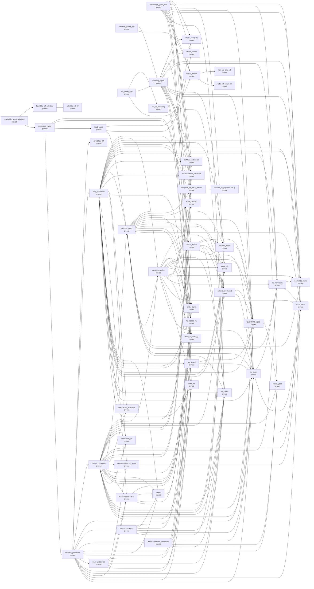

| Node | Status | Rests on | Nearest nodes | Lemmas | Definitions |
| --- | --- | --- | --- | --- | --- |
| `check_sound` | proved | — | — | 133 | 224 |
| `check_complete` | proved | — | — | 68 | 227 |
| `admitSig_ok_iff` | proved | — | — | 44 | 147 |
| `meaning_typed_app` | proved | — | `check_restrict`, `meaning_typed` | 75 | 334 |
| `run_typed_app` | proved | — | `check_restrict`, `meaning_typed`, `run_eq_meaning` | 103 | 1112 |
| `meaningB_typed_app` | proved | — | `check_restrict`, `order_refl`, `fits_mono`, `hom_eq_cata_ty`, `deferredMake_extension`, `refMake_extension`, `errOf_payload`, `isPayload_of_hasTy_record`, `normalize_idem`, `fits_subN`, `subN_refl`, `fits_normalize`, `subN_trans`, `check_sound`, `check_complete`, `order_trans` | 812 | 887 |
| `reachable_typed_admitted` | proved | — | `reachable_typed`, `lawfulSig_of_admitted` | 80 | 1197 |
| `check_restrict` | proved | — | `cata_eff_congr_on`, `hom_eq_cata_eff` | 70 | 289 |
| `meaning_typed` | proved | — | `order_refl`, `fits_mono`, `hom_eq_cata_ty`, `deferredMake_extension`, `refMake_extension`, `errOf_payload`, `isPayload_of_hasTy_record`, `normalize_idem`, `fits_subN`, `subN_refl`, `fits_normalize`, `subN_trans`, `check_sound`, `check_complete`, `order_trans` | 770 | 872 |
| `run_eq_meaning` | proved | — | — | 310 | 905 |
| `order_refl` | proved | — | — | 57 | 200 |
| `fits_mono` | proved | — | — | 80 | 230 |
| `hom_eq_cata_ty` | proved | — | — | 28 | 35 |
| `deferredMake_extension` | proved | — | — | 112 | 335 |
| `refMake_extension` | proved | — | — | 113 | 335 |
| `errOf_payload` | proved | — | — | 8 | 15 |
| `isPayload_of_hasTy_record` | proved | — | `handles_of_payloadFieldTy` | 45 | 127 |
| `normalize_idem` | proved | — | — | 77 | 51 |
| `fits_subN` | proved | — | `subN_trans`, `fits_normalize` | 247 | 224 |
| `subN_refl` | proved | — | — | 38 | 44 |
| `fits_normalize` | proved | — | `subN_trans`, `normalize_idem` | 264 | 224 |
| `subN_trans` | proved | — | — | 96 | 53 |
| `order_trans` | proved | — | — | 57 | 201 |
| `reachable_typed` | proved | — | `decision_preserves`, `load_typed`, `order_trans`, `order_refl` | 86 | 1218 |
| `lawfulSig_of_admitted` | proved | — | `admitSig_ok_iff` | 41 | 148 |
| `cata_eff_congr_on` | proved | — | — | 63 | 71 |
| `hom_eq_cata_eff` | proved | — | — | 63 | 77 |
| `handles_of_payloadFieldTy` | proved | — | — | 44 | 130 |
| `decision_preserves` | proved | — | `fits_subN`, `order_refl`, `subN_trans`, `configTyped_frame`, `fits_mono`, `hom_eq_cata_ty`, `wake_preserves`, `order_trans`, `mono`, `close_typed`, `registrationDone_preserves`, `launch_preserves`, `guardBind_typed`, `deliver_preserves`, `loop_preserves`, `driveState_lift` | 1050 | 1511 |
| `load_typed` | proved | — | `denotesTyped`, `check_sound`, `check_complete` | 106 | 1142 |
| `configTyped_frame` | proved | — | `fits_mono`, `order_trans`, `mono`, `hom_eq_cata_ty` | 334 | 1193 |
| `wake_preserves` | proved | — | `order_refl`, `configTyped_frame`, `fits_mono`, `completionStrong_await`, `hom_eq_cata_ty` | 237 | 1336 |
| `mono` | proved | — | `order_trans` | 57 | 266 |
| `close_typed` | proved | — | — | 72 | 597 |
| `registrationDone_preserves` | proved | — | `fits_mono`, `close_typed`, `fits_subN`, `order_refl` | 326 | 1300 |
| `launch_preserves` | proved | — | `subN_refl`, `fits_subN`, `fits_mono`, `order_trans`, `mono`, `order_refl` | 361 | 1319 |
| `guardBind_typed` | proved | — | `close_typed` | 54 | 250 |
| `deliver_preserves` | proved | — | `order_refl`, `fits_subN`, `fits_mono`, `catchGuard_typed`, `subN_refl`, `guardBind_typed`, `closeOrder_eq`, `fits_scope_inv`, `order_trans`, `seq_typed`, `mono`, `configTyped_frame`, `hom_eq_cata_ty`, `completionStrong_await`, `memoBuild_extension`, `deferredMake_extension`, `refMake_extension`, `denotesTyped`, `fits_normalize`, `normalize_idem`, `subN_trans`, `errOf_payload`, `isPayload_of_hasTy_record`, `allGuard_typed`, `close_typed`, `provideLayerArm`, `onExit_typed` | 1984 | 1561 |
| `loop_preserves` | proved | — | `order_refl`, `fits_subN`, `fits_mono`, `catchGuard_typed`, `subN_refl`, `guardBind_typed`, `closeOrder_eq`, `fits_scope_inv`, `order_trans`, `seq_typed`, `mono`, `configTyped_frame`, `hom_eq_cata_ty`, `completionStrong_await`, `memoBuild_extension`, `deferredMake_extension`, `refMake_extension`, `denotesTyped`, `fits_normalize`, `normalize_idem`, `subN_trans`, `errOf_payload`, `isPayload_of_hasTy_record`, `allGuard_typed`, `close_typed`, `provideLayerArm`, `onExit_typed` | 1991 | 1561 |
| `driveState_lift` | proved | — | — | 7 | 170 |
| `denotesTyped` | proved | — | `provideLayerArm`, `fits_mono`, `fits_subN`, `fits_normalize`, `normalize_idem`, `subN_trans`, `hom_eq_cata_ty`, `order_trans`, `subN_refl`, `catchGuard_typed`, `onExit_typed`, `guardBind_typed`, `fits_scope_inv`, `errOf_payload`, `isPayload_of_hasTy_record`, `allGuard_typed` | 785 | 856 |
| `completionStrong_await` | proved | — | `subN_trans` | 250 | 237 |
| `catchGuard_typed` | proved | — | `fits_subN`, `guardBind_typed` | 56 | 241 |
| `closeOrder_eq` | proved | — | — | 0 | 4 |
| `fits_scope_inv` | proved | — | — | 54 | 199 |
| `seq_typed` | proved | — | `subN_refl`, `fits_subN`, `guardBind_typed` | 58 | 244 |
| `memoBuild_extension` | proved | — | — | 111 | 335 |
| `allGuard_typed` | proved | — | `guardBind_typed` | 54 | 241 |
| `provideLayerArm` | proved | — | `fits_subN`, `order_refl`, `subN_trans`, `fits_normalize`, `hom_eq_cata_ty`, `errOf_payload`, `isPayload_of_hasTy_record`, `normalize_idem`, `subN_refl`, `order_trans`, `onExit_typed`, `guardBind_typed`, `fits_mono`, `fits_scope_inv`, `seq_typed`, `catchGuard_typed` | 821 | 898 |
| `onExit_typed` | proved | — | `fits_subN`, `fits_mono`, `catchGuard_typed`, `subN_refl`, `guardBind_typed`, `allGuard_typed` | 89 | 624 |

### R2: Extension is conservative: C1–C8 over DI-47's relation on Σ_app

- Open: C2 for host rows: operational until DI-69's row meaning lands
- Open: C4 for TypedProg (the generic judgment is proved both ways)
- Open: C5: the world projection with its back condition (its red controls are proved)
- Open: C7: conditional on decisions row 115
- Open: C8: per form

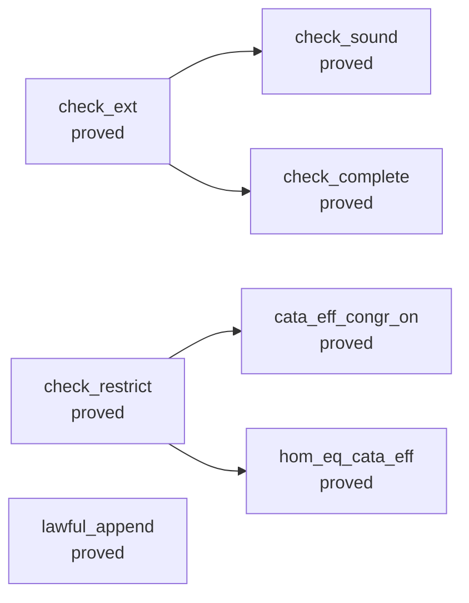

| Node | Status | Rests on | Nearest nodes | Lemmas | Definitions |
| --- | --- | --- | --- | --- | --- |
| `check_ext` | proved | — | `check_sound`, `check_complete` | 65 | 217 |
| `check_restrict` | proved | — | `cata_eff_congr_on`, `hom_eq_cata_eff` | 70 | 289 |
| `lawful_append` | proved | — | — | 40 | 142 |
| `check_sound` | proved | — | — | 133 | 224 |
| `check_complete` | proved | — | — | 68 | 227 |
| `cata_eff_congr_on` | proved | — | — | 63 | 71 |
| `hom_eq_cata_eff` | proved | — | — | 63 | 77 |

### R3: Data: the type language closed under records and variants as Ty growth

- Open: variants: the tag select over records landed (decisions row 195 (d)); catchTag's residual, the caught tag subtracted from the error column, waits on decisions row 130
- Open: recursive types are row 124 (open): nominal Σ_app declarations through Ty.app
- Open: error payloads: the carrier (decisions row 120, part E1) and the face (part E2: one Data.TaggedError class per tag, printed and read back) landed; open: catchTag's residual over records (decisions row 130), int and number fields (row 121; a number field is refused by name as unreadable), a field typed by another class (refused by name), a record update of a class instance (it answers a structural object), and a host row answering a payload (R6, parked)
- Open: int inhabited inside row 108's profile: ruled 2026-10-02 (decisions row 121), not landed; the admission's int scan still refuses it
- Open: the Schema and JSON images of app, null, undefined, number and bytes: unlowered or refused by name (decisions rows 121, 158, 160, 161)
- Open: equality at records: eq stays refused at records until a program compares them (decisions row 126)

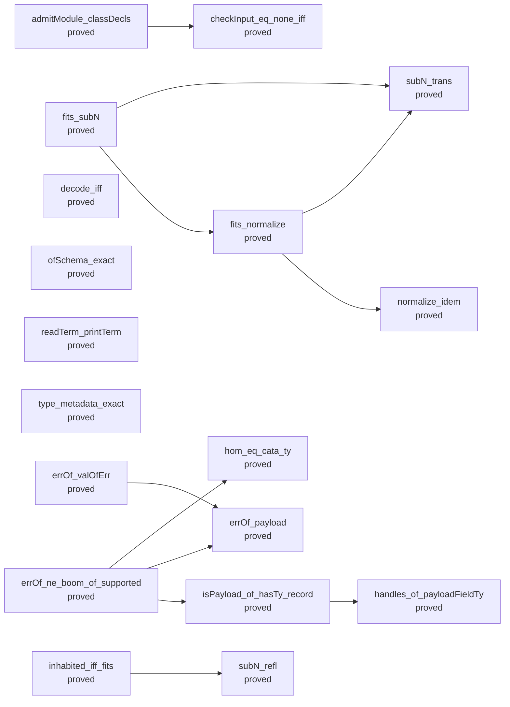

| Node | Status | Rests on | Nearest nodes | Lemmas | Definitions |
| --- | --- | --- | --- | --- | --- |
| `checkInput_eq_none_iff` | proved | — | — | 38 | 97 |
| `fits_normalize` | proved | — | `subN_trans`, `normalize_idem` | 264 | 224 |
| `fits_subN` | proved | — | `subN_trans`, `fits_normalize` | 247 | 224 |
| `inhabited_iff_fits` | proved | — | `subN_refl` | 155 | 319 |
| `hom_eq_cata_ty` | proved | — | — | 28 | 35 |
| `decode_iff` | proved | — | — | 185 | 291 |
| `ofSchema_exact` | proved | — | — | 41 | 144 |
| `readTerm_printTerm` | proved | — | — | 149 | 194 |
| `type_metadata_exact` | proved | — | — | 61 | 86 |
| `errOf_valOfErr` | proved | — | `errOf_payload` | 4 | 16 |
| `admitModule_classDecls` | proved | — | `checkInput_eq_none_iff` | 140 | 685 |
| `errOf_ne_boom_of_supported` | proved | — | `hom_eq_cata_ty`, `errOf_payload`, `isPayload_of_hasTy_record` | 230 | 225 |
| `errOf_payload` | proved | — | — | 8 | 15 |
| `isPayload_of_hasTy_record` | proved | — | `handles_of_payloadFieldTy` | 45 | 127 |
| `subN_trans` | proved | — | — | 96 | 53 |
| `normalize_idem` | proved | — | — | 77 | 51 |
| `subN_refl` | proved | — | — | 38 | 44 |
| `handles_of_payloadFieldTy` | proved | — | — | 44 | 130 |

### R4: State: the world types every cell at any type, with rows as templates

- Open: FnName retires: the store runs binder terms since T2, and a NativeOp row hands it its name's lowering, which runs the name's kernel on every number (kernel_term_agrees); the rows carry terms at T3b (decisions row 43; state plan T3b)
- Open: the read-modify-write rows as templates: the eight rows stay at refOf nat, and modify answering B while storing A, until their binder terms land (decisions rows 42–43; state plan T3b); the Ref and Deferred rows are templates and Deferred.make carries its type arguments since T3a
- Open: the faces of Ref<A> and Deferred<A, E>: Ref.make<A> and Deferred.make<A, E> printed and read at every instance (the faces spell Deferred.make at Deferred<number, number> and refuse another instance by name), the TypeScript profile and OCaml at instances, binder terms printed (decisions rows 42–43, step 5; state plan T5)
- Open: fold-typed-atomic-update (proposed claim; store-typing): the pure list fold with two binders, the accumulator and the element, at any types; listTake and listDrop only for a demonstrated consumer, and no counted loop: typing, scoping, capture, compilation, printing and exact reading, with Ref.modify one step that answers B and stores A; its first consumer is the Queue's service pass (decisions row 228; after T3b)
- Open: handle-identity-laws (proposed claim; store-typing): the identity of a handle in a term: equality of two Ref handles or two Deferred handles of one kind by identity, never by payload; a cell that holds a list of handles, with membership, fresh allocation and world extension laws, and the identity correspondence in each target's relation (decisions row 229)
- Open: atomic-attempt-isolation (proposed claim; store-typing and reactive-scheduling): an admitted atomic body's ordered dynamic reads and writes, the exact state that a failure or a retry restores, and no step of another fiber between its first access and its commit (decisions rows 80, 223; waits on the body profile's grammar and on row 226's budget or suspension)
- Open: scoped-body-substitution-boundary (proposed claim; residual-program-typing): for the first new scoped constructor, the code after a scope runs only after the scope, and substitution neither captures it nor copies it into a child body (decisions rows 225, 227)

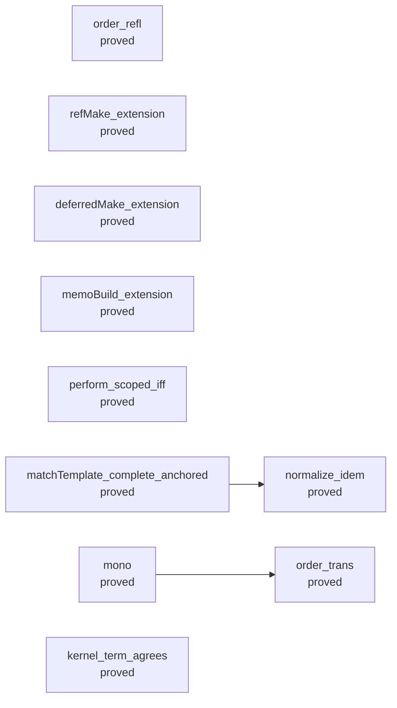

| Node | Status | Rests on | Nearest nodes | Lemmas | Definitions |
| --- | --- | --- | --- | --- | --- |
| `order_refl` | proved | — | — | 57 | 200 |
| `order_trans` | proved | — | — | 57 | 201 |
| `refMake_extension` | proved | — | — | 113 | 335 |
| `deferredMake_extension` | proved | — | — | 112 | 335 |
| `memoBuild_extension` | proved | — | — | 111 | 335 |
| `perform_scoped_iff` | proved | — | — | 0 | 71 |
| `matchTemplate_complete_anchored` | proved | — | `normalize_idem` | 233 | 124 |
| `mono` | proved | — | `order_trans` | 57 | 266 |
| `kernel_term_agrees` | proved | — | — | 13 | 124 |
| `normalize_idem` | proved | — | — | 77 | 51 |

### R5: Services: the service table, layers and provision

- Open: lower_refines_build: the machine's build of a layer refines `build` (decisions row 147)
- Open: reference keys, Config, minted keys, and context validation at any runtime bridge (system map §8, R5)

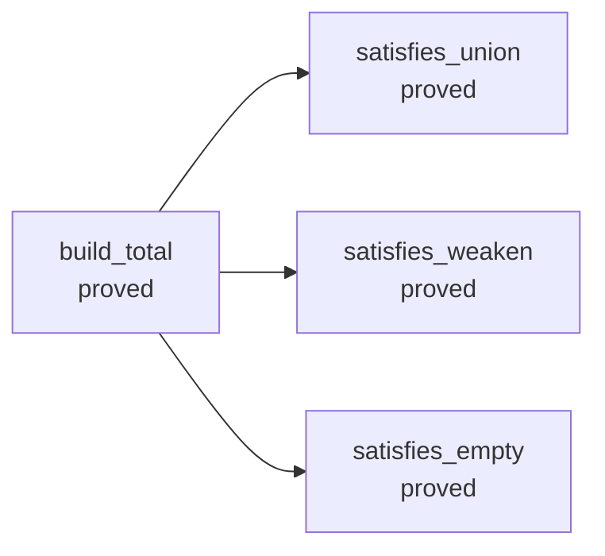

| Node | Status | Rests on | Nearest nodes | Lemmas | Definitions |
| --- | --- | --- | --- | --- | --- |
| `build_total` | proved | — | `satisfies_union`, `satisfies_weaken`, `satisfies_empty` | 170 | 249 |
| `satisfies_union` | proved | — | — | 20 | 33 |
| `satisfies_weaken` | proved | — | — | 0 | 25 |
| `satisfies_empty` | proved | — | — | 2 | 26 |

### R6: The host: a lawful HostSpec, receipt and application, DI-57's table-aware reference

- Open: admit_sound's value half: executable admission implies the ghost AnswerOk on success values (waits on decisions row 97's handle declarations)
- Open: DI-57's table-aware reference relation: run_eq_ref holds at the empty table only (parked by the owner, 2026-09-30)
- Open: DI-69: the row table's meaning in code
- Open: H related to the machine: M6's premise is a predicate on tapes (decisions row 95), not a host relation
- Open: receipt and application on the keyed lifecycle, and their converse (host-boundary §4.5; decisions rows 98–100, parked by the owner, 2026-09-30)
- Open: a world extension meeting C5, a retirement edge, per-row cancellation, one root (DI-58, DI-65)
- Open: the public typed guarantee for programs using host services (decisions row 99)

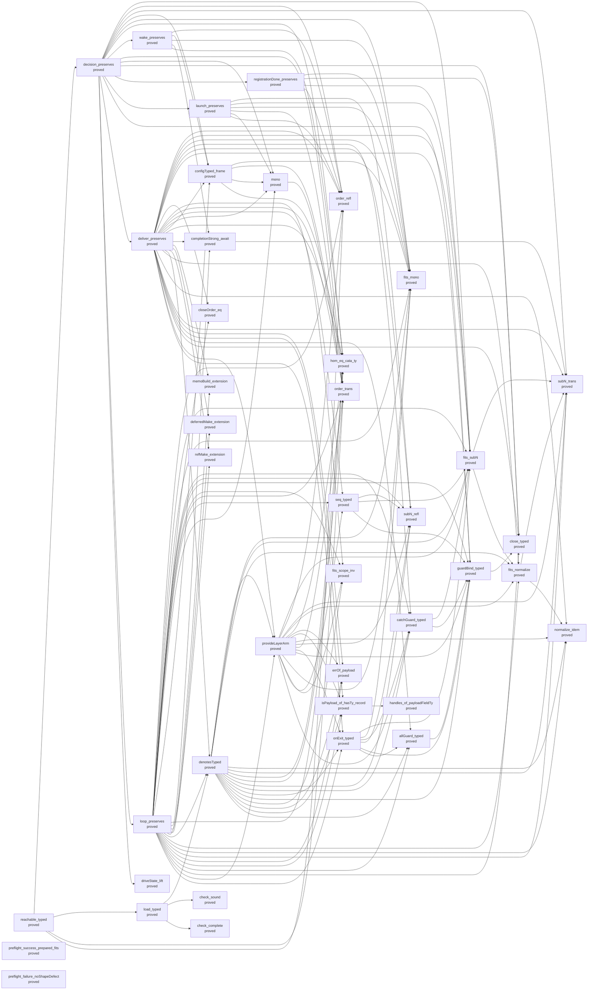

| Node | Status | Rests on | Nearest nodes | Lemmas | Definitions |
| --- | --- | --- | --- | --- | --- |
| `reachable_typed` | proved | — | `decision_preserves`, `load_typed`, `order_trans`, `order_refl` | 86 | 1218 |
| `preflight_success_prepared_fits` | proved | — | — | 101 | 748 |
| `preflight_failure_noShapeDefect` | proved | — | — | 66 | 273 |
| `handles_of_payloadFieldTy` | proved | — | — | 44 | 130 |
| `decision_preserves` | proved | — | `fits_subN`, `order_refl`, `subN_trans`, `configTyped_frame`, `fits_mono`, `hom_eq_cata_ty`, `wake_preserves`, `order_trans`, `mono`, `close_typed`, `registrationDone_preserves`, `launch_preserves`, `guardBind_typed`, `deliver_preserves`, `loop_preserves`, `driveState_lift` | 1050 | 1511 |
| `load_typed` | proved | — | `denotesTyped`, `check_sound`, `check_complete` | 106 | 1142 |
| `order_trans` | proved | — | — | 57 | 201 |
| `order_refl` | proved | — | — | 57 | 200 |
| `fits_subN` | proved | — | `subN_trans`, `fits_normalize` | 247 | 224 |
| `subN_trans` | proved | — | — | 96 | 53 |
| `configTyped_frame` | proved | — | `fits_mono`, `order_trans`, `mono`, `hom_eq_cata_ty` | 334 | 1193 |
| `fits_mono` | proved | — | — | 80 | 230 |
| `hom_eq_cata_ty` | proved | — | — | 28 | 35 |
| `wake_preserves` | proved | — | `order_refl`, `configTyped_frame`, `fits_mono`, `completionStrong_await`, `hom_eq_cata_ty` | 237 | 1336 |
| `mono` | proved | — | `order_trans` | 57 | 266 |
| `close_typed` | proved | — | — | 72 | 597 |
| `registrationDone_preserves` | proved | — | `fits_mono`, `close_typed`, `fits_subN`, `order_refl` | 326 | 1300 |
| `launch_preserves` | proved | — | `subN_refl`, `fits_subN`, `fits_mono`, `order_trans`, `mono`, `order_refl` | 361 | 1319 |
| `guardBind_typed` | proved | — | `close_typed` | 54 | 250 |
| `deliver_preserves` | proved | — | `order_refl`, `fits_subN`, `fits_mono`, `catchGuard_typed`, `subN_refl`, `guardBind_typed`, `closeOrder_eq`, `fits_scope_inv`, `order_trans`, `seq_typed`, `mono`, `configTyped_frame`, `hom_eq_cata_ty`, `completionStrong_await`, `memoBuild_extension`, `deferredMake_extension`, `refMake_extension`, `denotesTyped`, `fits_normalize`, `normalize_idem`, `subN_trans`, `errOf_payload`, `isPayload_of_hasTy_record`, `allGuard_typed`, `close_typed`, `provideLayerArm`, `onExit_typed` | 1984 | 1561 |
| `loop_preserves` | proved | — | `order_refl`, `fits_subN`, `fits_mono`, `catchGuard_typed`, `subN_refl`, `guardBind_typed`, `closeOrder_eq`, `fits_scope_inv`, `order_trans`, `seq_typed`, `mono`, `configTyped_frame`, `hom_eq_cata_ty`, `completionStrong_await`, `memoBuild_extension`, `deferredMake_extension`, `refMake_extension`, `denotesTyped`, `fits_normalize`, `normalize_idem`, `subN_trans`, `errOf_payload`, `isPayload_of_hasTy_record`, `allGuard_typed`, `close_typed`, `provideLayerArm`, `onExit_typed` | 1991 | 1561 |
| `driveState_lift` | proved | — | — | 7 | 170 |
| `denotesTyped` | proved | — | `provideLayerArm`, `fits_mono`, `fits_subN`, `fits_normalize`, `normalize_idem`, `subN_trans`, `hom_eq_cata_ty`, `order_trans`, `subN_refl`, `catchGuard_typed`, `onExit_typed`, `guardBind_typed`, `fits_scope_inv`, `errOf_payload`, `isPayload_of_hasTy_record`, `allGuard_typed` | 785 | 856 |
| `check_sound` | proved | — | — | 133 | 224 |
| `check_complete` | proved | — | — | 68 | 227 |
| `fits_normalize` | proved | — | `subN_trans`, `normalize_idem` | 264 | 224 |
| `completionStrong_await` | proved | — | `subN_trans` | 250 | 237 |
| `subN_refl` | proved | — | — | 38 | 44 |
| `catchGuard_typed` | proved | — | `fits_subN`, `guardBind_typed` | 56 | 241 |
| `closeOrder_eq` | proved | — | — | 0 | 4 |
| `fits_scope_inv` | proved | — | — | 54 | 199 |
| `seq_typed` | proved | — | `subN_refl`, `fits_subN`, `guardBind_typed` | 58 | 244 |
| `memoBuild_extension` | proved | — | — | 111 | 335 |
| `deferredMake_extension` | proved | — | — | 112 | 335 |
| `refMake_extension` | proved | — | — | 113 | 335 |
| `normalize_idem` | proved | — | — | 77 | 51 |
| `errOf_payload` | proved | — | — | 8 | 15 |
| `isPayload_of_hasTy_record` | proved | — | `handles_of_payloadFieldTy` | 45 | 127 |
| `allGuard_typed` | proved | — | `guardBind_typed` | 54 | 241 |
| `provideLayerArm` | proved | — | `fits_subN`, `order_refl`, `subN_trans`, `fits_normalize`, `hom_eq_cata_ty`, `errOf_payload`, `isPayload_of_hasTy_record`, `normalize_idem`, `subN_refl`, `order_trans`, `onExit_typed`, `guardBind_typed`, `fits_mono`, `fits_scope_inv`, `seq_typed`, `catchGuard_typed` | 821 | 898 |
| `onExit_typed` | proved | — | `fits_subN`, `fits_mono`, `catchGuard_typed`, `subN_refl`, `guardBind_typed`, `allGuard_typed` | 89 | 624 |

### R7: Retained behaviour: a resolved code entry is typed at its reference's type

- Open: resolve_typed: a resolved code entry is typed at its reference's type, with capture layout fixed at resolution and identity by allocation or structure (decisions row 82, open)
- Open: code-valued services with a capture law, R5's through R7 (decisions row 82)
- Open: the reserved contract of a retained behaviour: its entry, captures, invocation context and lifetime, designed now for the planned Cache, Pool and callback modules; the value form and its evaluator wait for the first of them (decisions row 234)
- Open: posted-body-entry-typed (proposed claim; residual-program-typing): a checked Eff body supplied at a posting site, with its resolved entry, typed lexical environment and selected service policy, stays typed under world extension (decisions rows 82, 225)

```mermaid
flowchart LR
```

| Node | Status | Rests on | Nearest nodes | Lemmas | Definitions |
| --- | --- | --- | --- | --- | --- |

### R8: Runs and faces as named connections: equal to the reference inside a profile, refused outside it

- Open: typed lowering open: what verified lowering means (decisions row 28); the OCaml engine is outside M7 until it is ruled
- Open: numbers open (decisions row 108): each face equal to the reference inside its bounded profile and refusing outside it, intermediates included (DI-56)
- Open: K2 holds on the readable domain, which excludes annotated loops (DI-91; its fallback (a) is unscheduled)
- Open: one identity bijection across faces: the fiber identity carrier is ruled, not landed (DI-81)
- Open: the TypeScript face against rc.112: finite truth-harness checks only (DI-49)
- Open: the profile as data, named by each face's law (decisions row 79, R79.5)

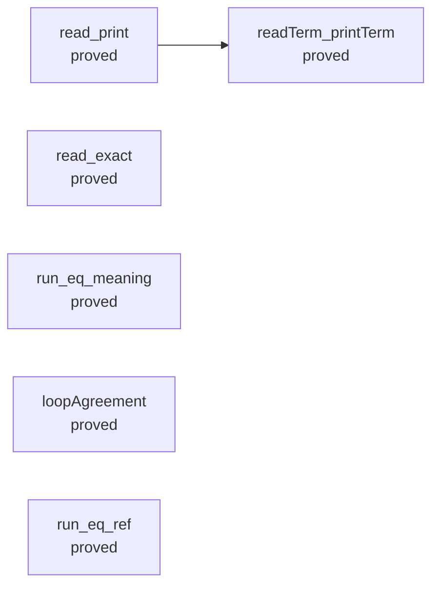

| Node | Status | Rests on | Nearest nodes | Lemmas | Definitions |
| --- | --- | --- | --- | --- | --- |
| `read_print` | proved | — | `readTerm_printTerm` | 284 | 512 |
| `read_exact` | proved | — | — | 227 | 467 |
| `run_eq_meaning` | proved | — | — | 310 | 905 |
| `loopAgreement` | proved | — | — | 339 | 916 |
| `run_eq_ref` | proved | — | — | 877 | 1058 |
| `readTerm_printTerm` | proved | — | — | 149 | 194 |

### R9: Never goes wrong: M7a–c on M7Fragment (the empty host table, answer-free tapes)

- Open: part two: a saved frame transports missingService across a change in the requirement row (decisions row 117)

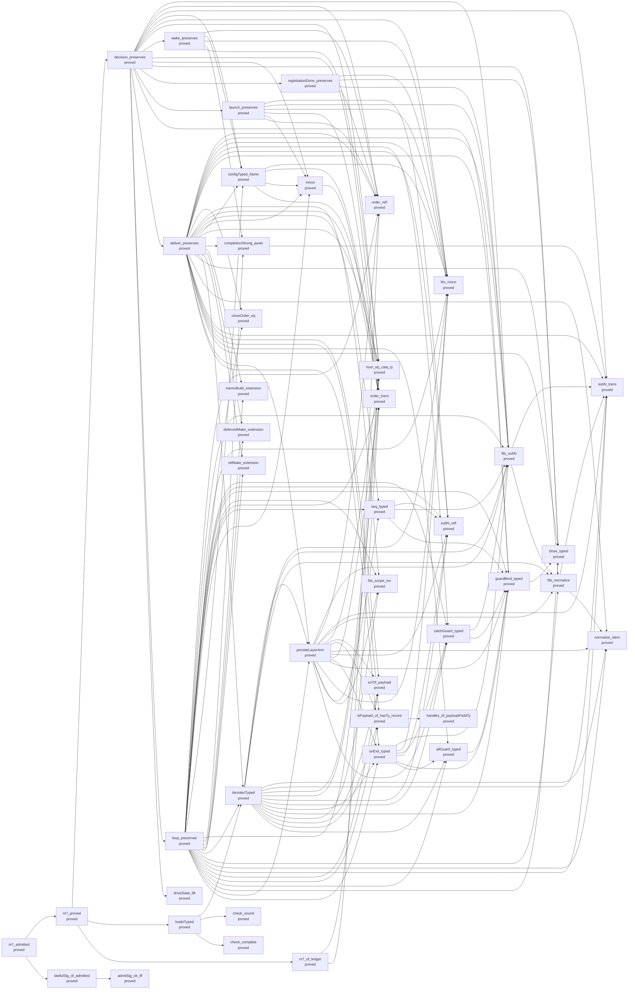

| Node | Status | Rests on | Nearest nodes | Lemmas | Definitions |
| --- | --- | --- | --- | --- | --- |
| `m7_proved` | proved | — | `decision_preserves`, `loadsTyped`, `m7_of_ledger` | 0 | 3 |
| `m7_admitted` | proved | — | `m7_proved`, `lawfulSig_of_admitted` | 54 | 357 |
| `decision_preserves` | proved | — | `fits_subN`, `order_refl`, `subN_trans`, `configTyped_frame`, `fits_mono`, `hom_eq_cata_ty`, `wake_preserves`, `order_trans`, `mono`, `close_typed`, `registrationDone_preserves`, `launch_preserves`, `guardBind_typed`, `deliver_preserves`, `loop_preserves`, `driveState_lift` | 1050 | 1511 |
| `loadsTyped` | proved | — | `denotesTyped`, `check_sound`, `check_complete` | 107 | 1144 |
| `m7_of_ledger` | proved | — | `order_trans`, `order_refl` | 918 | 1414 |
| `lawfulSig_of_admitted` | proved | — | `admitSig_ok_iff` | 41 | 148 |
| `fits_subN` | proved | — | `subN_trans`, `fits_normalize` | 247 | 224 |
| `order_refl` | proved | — | — | 57 | 200 |
| `subN_trans` | proved | — | — | 96 | 53 |
| `configTyped_frame` | proved | — | `fits_mono`, `order_trans`, `mono`, `hom_eq_cata_ty` | 334 | 1193 |
| `fits_mono` | proved | — | — | 80 | 230 |
| `hom_eq_cata_ty` | proved | — | — | 28 | 35 |
| `wake_preserves` | proved | — | `order_refl`, `configTyped_frame`, `fits_mono`, `completionStrong_await`, `hom_eq_cata_ty` | 237 | 1336 |
| `order_trans` | proved | — | — | 57 | 201 |
| `mono` | proved | — | `order_trans` | 57 | 266 |
| `close_typed` | proved | — | — | 72 | 597 |
| `registrationDone_preserves` | proved | — | `fits_mono`, `close_typed`, `fits_subN`, `order_refl` | 326 | 1300 |
| `launch_preserves` | proved | — | `subN_refl`, `fits_subN`, `fits_mono`, `order_trans`, `mono`, `order_refl` | 361 | 1319 |
| `guardBind_typed` | proved | — | `close_typed` | 54 | 250 |
| `deliver_preserves` | proved | — | `order_refl`, `fits_subN`, `fits_mono`, `catchGuard_typed`, `subN_refl`, `guardBind_typed`, `closeOrder_eq`, `fits_scope_inv`, `order_trans`, `seq_typed`, `mono`, `configTyped_frame`, `hom_eq_cata_ty`, `completionStrong_await`, `memoBuild_extension`, `deferredMake_extension`, `refMake_extension`, `denotesTyped`, `fits_normalize`, `normalize_idem`, `subN_trans`, `errOf_payload`, `isPayload_of_hasTy_record`, `allGuard_typed`, `close_typed`, `provideLayerArm`, `onExit_typed` | 1984 | 1561 |
| `loop_preserves` | proved | — | `order_refl`, `fits_subN`, `fits_mono`, `catchGuard_typed`, `subN_refl`, `guardBind_typed`, `closeOrder_eq`, `fits_scope_inv`, `order_trans`, `seq_typed`, `mono`, `configTyped_frame`, `hom_eq_cata_ty`, `completionStrong_await`, `memoBuild_extension`, `deferredMake_extension`, `refMake_extension`, `denotesTyped`, `fits_normalize`, `normalize_idem`, `subN_trans`, `errOf_payload`, `isPayload_of_hasTy_record`, `allGuard_typed`, `close_typed`, `provideLayerArm`, `onExit_typed` | 1991 | 1561 |
| `driveState_lift` | proved | — | — | 7 | 170 |
| `denotesTyped` | proved | — | `provideLayerArm`, `fits_mono`, `fits_subN`, `fits_normalize`, `normalize_idem`, `subN_trans`, `hom_eq_cata_ty`, `order_trans`, `subN_refl`, `catchGuard_typed`, `onExit_typed`, `guardBind_typed`, `fits_scope_inv`, `errOf_payload`, `isPayload_of_hasTy_record`, `allGuard_typed` | 785 | 856 |
| `check_sound` | proved | — | — | 133 | 224 |
| `check_complete` | proved | — | — | 68 | 227 |
| `admitSig_ok_iff` | proved | — | — | 44 | 147 |
| `fits_normalize` | proved | — | `subN_trans`, `normalize_idem` | 264 | 224 |
| `completionStrong_await` | proved | — | `subN_trans` | 250 | 237 |
| `subN_refl` | proved | — | — | 38 | 44 |
| `catchGuard_typed` | proved | — | `fits_subN`, `guardBind_typed` | 56 | 241 |
| `closeOrder_eq` | proved | — | — | 0 | 4 |
| `fits_scope_inv` | proved | — | — | 54 | 199 |
| `seq_typed` | proved | — | `subN_refl`, `fits_subN`, `guardBind_typed` | 58 | 244 |
| `memoBuild_extension` | proved | — | — | 111 | 335 |
| `deferredMake_extension` | proved | — | — | 112 | 335 |
| `refMake_extension` | proved | — | — | 113 | 335 |
| `normalize_idem` | proved | — | — | 77 | 51 |
| `errOf_payload` | proved | — | — | 8 | 15 |
| `isPayload_of_hasTy_record` | proved | — | `handles_of_payloadFieldTy` | 45 | 127 |
| `allGuard_typed` | proved | — | `guardBind_typed` | 54 | 241 |
| `provideLayerArm` | proved | — | `fits_subN`, `order_refl`, `subN_trans`, `fits_normalize`, `hom_eq_cata_ty`, `errOf_payload`, `isPayload_of_hasTy_record`, `normalize_idem`, `subN_refl`, `order_trans`, `onExit_typed`, `guardBind_typed`, `fits_mono`, `fits_scope_inv`, `seq_typed`, `catchGuard_typed` | 821 | 898 |
| `onExit_typed` | proved | — | `fits_subN`, `fits_mono`, `catchGuard_typed`, `subN_refl`, `guardBind_typed`, `allGuard_typed` | 89 | 624 |
| `handles_of_payloadFieldTy` | proved | — | — | 44 | 130 |

### R10: Library code inherits theorems: a composed module's law is Agrees profile module expansion

- Open: a composed module's law, Agrees profile module expansion (decisions row 79, R79.5; DI-89)
- Open: no form has a behaviour law (DI-89)
- Open: none of DI-89's named forms exists: retry, catchTag, forEach, all, Schedule over iterate, the option and result eliminators
- Open: per form: reader admission, a readable expansion (C8) and a stable identity (DI-89; the model probe's D9, unruled)
- Open: DI-39's six rows not landed
- Open: a composite's contract by a stuttering route (post-Phase C §11.4)
- Open: queue-expansion-agrees (proposed claim; translation-simulation): the Queue's expansion agrees with its application-signature clients on the Queue's profile, which defines the public requests, commits, replies, interruptions and terminations before it hides a private cell or a helper identity (decisions rows 79, 219 to 222, 230)
- Open: posted-wake-profile-agrees (proposed claim; translation-simulation): one producer's posted delivery, with its dispatch owner, priority, receiver and token, capture time, coalescing and cancellation, agrees with its module expansion; the Queue's producer is first (decisions rows 81, 220, 225; DB-13)
- Open: atomic-attempt-agreement (proposed claim; translation-simulation): the restricted transaction profile against the named release, with flat nesting, immutable payloads and explicit retry; then tx-choice-rollback-union for the retry-only alternative (decisions rows 80, 84, 223, 224)
- Open: fair composition of tickets that are enrolled apart is outside the first profile: the opposing-ticket cycle stays a refused case until an enrolment protocol resolves it (decisions row 223)

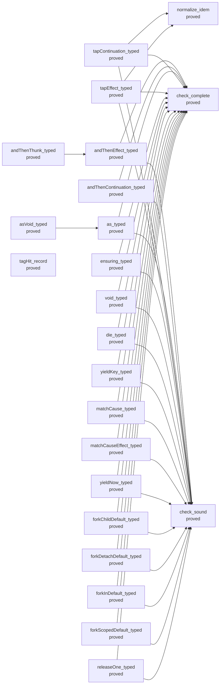

| Node | Status | Rests on | Nearest nodes | Lemmas | Definitions |
| --- | --- | --- | --- | --- | --- |
| `andThenEffect_typed` | proved | — | `check_sound`, `check_complete` | 72 | 237 |
| `andThenContinuation_typed` | proved | — | `check_sound`, `check_complete` | 57 | 227 |
| `andThenThunk_typed` | proved | — | `andThenEffect_typed` | 53 | 213 |
| `as_typed` | proved | — | `check_sound`, `check_complete` | 99 | 233 |
| `asVoid_typed` | proved | — | `as_typed` | 53 | 213 |
| `tapContinuation_typed` | proved | — | `normalize_idem`, `check_sound`, `check_complete` | 165 | 240 |
| `tapEffect_typed` | proved | — | `normalize_idem`, `check_sound`, `check_complete` | 179 | 250 |
| `ensuring_typed` | proved | — | `check_sound`, `check_complete` | 72 | 237 |
| `void_typed` | proved | — | `check_complete`, `check_sound` | 57 | 227 |
| `die_typed` | proved | — | `check_complete`, `check_sound` | 57 | 227 |
| `yieldKey_typed` | proved | — | `check_complete`, `check_sound` | 57 | 227 |
| `matchCause_typed` | proved | — | `check_sound`, `check_complete` | 59 | 228 |
| `matchCauseEffect_typed` | proved | — | `check_sound`, `check_complete` | 59 | 228 |
| `yieldNow_typed` | proved | — | `check_complete`, `check_sound` | 57 | 227 |
| `forkChildDefault_typed` | proved | — | `check_sound`, `check_complete` | 59 | 227 |
| `forkDetachDefault_typed` | proved | — | `check_sound`, `check_complete` | 59 | 227 |
| `forkInDefault_typed` | proved | — | `check_sound`, `check_complete` | 59 | 227 |
| `forkScopedDefault_typed` | proved | — | `check_sound`, `check_complete` | 59 | 227 |
| `releaseOne_typed` | proved | — | `check_sound`, `check_complete` | 75 | 237 |
| `tagHit_record` | proved | — | — | 47 | 130 |
| `check_sound` | proved | — | — | 133 | 224 |
| `check_complete` | proved | — | — | 68 | 227 |
| `normalize_idem` | proved | — | — | 77 | 51 |

### R11: Resources are released: at most once per registration, exactly once in close order

- Open: the whole run open: release at most once per registration, counted by identity (DB-07)
- Open: the whole run open: exactly once in close order over closed scopes and structured regions, with a completed-cleanup receipt (DB-07, DI-65)
- Open: state retained at a frontier, open scopes closed only by an explicit abandon (the owner's ruling of 2026-09-07)
- Open: a scope a finished run leaves open is an observation, as in rc.112 (the model probe's D8, unruled per DB-07)
- Open: saved-mask-restoration (proposed claim; scope-lifetime-finalization): restore reinstates its mask's saved incoming interruptibility on success, failure, interruption and nested entry, and is the identity under a masked caller; cleanup is installed before an interruption can observe an acquired resource or a committed registration (decisions row 227)
- Open: waiting-request-obligation-preserved (proposed claim; reactive-scheduling, serving R10 to R12): a selected request's notification stays in store debt, queued commands, dispatcher work or the receiver's accepted continuation until it is discharged; when cancellation wins and withdraws the request before consumption, the operation consumes nothing; a completed commit stays committed, even when the caller is interrupted before its continuation; an interruption that is only requested, and stays pending under a mask, withdraws nothing; an old token is inert after rearming (decisions rows 221, 222)

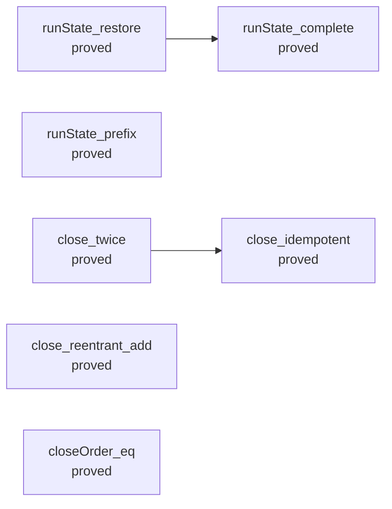

| Node | Status | Rests on | Nearest nodes | Lemmas | Definitions |
| --- | --- | --- | --- | --- | --- |
| `runState_complete` | proved | — | — | 0 | 15 |
| `runState_restore` | proved | — | `runState_complete` | 0 | 33 |
| `runState_prefix` | proved | — | — | 0 | 16 |
| `close_twice` | proved | — | `close_idempotent` | 1 | 15 |
| `close_reentrant_add` | proved | — | — | 2 | 11 |
| `closeOrder_eq` | proved | — | — | 0 | 4 |
| `close_idempotent` | proved | — | — | 1 | 15 |

### R12: Frontiers name what they await

- Open: R12-c: liveness on infinite tapes under FairTape (waits on a ruling on infinite tapes)
- Open: stability over the allowed internal decisions, with a named progress observation (not stated)
- Open: divergence by compatible prefixes (DB-03; not stated)
- Open: driver-continuation-split and driver-suspension-keeps-typed (proposed claims; reactive-scheduling, extending drivestate-lift): a retained driver suspension keeps the commands, the remaining dispatcher tasks, the enclosing flush or clock phase and any atomic owner, and continuing it with budgets n and k equals one run with n + k; until then an owned operation runs under a proved embedded budget (decisions rows 84, 226)
- Open: wait-registration-no-gap (proposed claim; reactive-scheduling): the decision to wait and the registration are one transition, so each eligible waiter is retrying or owns a notification (decisions rows 221, 223; finite controls in docs/research/2026-10-05-claude-lead/tx-probes/TxModel.lean)
- Open: posted-task-decision-preserves (proposed claim; reactive-scheduling): a posted task keeps the typed state, with its execution identity, its owner, its receiver's token and a stale delivery (decisions row 225)
- Open: posted-wake-debt-progress and a module's request progress: separate claims under named fairness, body-progress and budget premises; dispatcher service (flush_fair) does not give them (decisions rows 220, 225, 230)

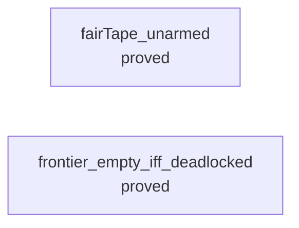

| Node | Status | Rests on | Nearest nodes | Lemmas | Definitions |
| --- | --- | --- | --- | --- | --- |
| `fairTape_unarmed` | proved | — | — | 3 | 284 |
| `frontier_empty_iff_deadlocked` | proved | — | — | 1 | 42 |

### R13: A run's inputs are data: equal recorded inputs give equal replay observations

- Open: load inputs, the environment snapshot and the seed: designed (the 2026-09-10 Config route B), not implemented (decisions rows 51, 83)
- Open: supplied values fit the admitted load requirements: restates M5 (loadsTyped, the retired ledger's typedState_load) when Config lands
- Open: the service half of the signature as a recorded input: Built carries the row table only (decisions row 21)
- Open: clock-unit-compatibility (proposed claim; translation-simulation): exact nanoseconds inside, with every recorded millisecond input kept in meaning by an explicit conversion; public nanosecond readings wait for the target's bigint contract (decisions rows 83, 231)

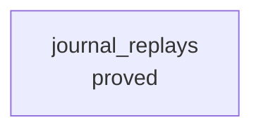

| Node | Status | Rests on | Nearest nodes | Lemmas | Definitions |
| --- | --- | --- | --- | --- | --- |
| `journal_replays` | proved | — | — | 78 | 931 |

## Acceptance programs

The rc.112 probe programs as acceptance tests (decisions row 206; `Test/Dogfood/README.md`). Each row is the `stage` its battery declares, which a guard ties to the battery's own measurement, and the requirements it `waitsOn`. A slice that moves a program edits both.

| Program | Admitted | Answer | Printed | Read back | Refused parts | Waits on |
| --- | --- | --- | --- | --- | --- | --- |
| `P1HttpCache` | yes | differs | yes | no | a Quote record in the key-value cache (typing: requestNotSubtype) | R3, R6, R7, R10 |
| `P2HandlerLayers` | yes | rc112 | yes | yes | AppConfig as a string service (serviceCarrier: signature none); CurrentUser as a record service (serviceCarrier: signature none); a number in a template string (typing: term) | R3, R5, R7, R10, R13 |
| `P3WorkerQueue` | yes | differs | yes | yes | the log's append at Ref<never[]> (typing: requestNotSubtype); the gate as Deferred<void> in TypeScript (refused: typeSpelling Deferred.make) | R3, R4, R10, R11 |
| `P4RateLimiter` | yes | rc112 | yes | yes | — | R4, R10 |
| `P5LedgerService` | no | notRun | no | no | a signed number (admission) | R3, R4, R6, R7, R10 |

The programs each requirement keeps waiting:

- R3: `P1HttpCache`, `P2HandlerLayers`, `P3WorkerQueue`, `P5LedgerService`
- R4: `P3WorkerQueue`, `P4RateLimiter`, `P5LedgerService`
- R5: `P2HandlerLayers`
- R6: `P1HttpCache`, `P5LedgerService`
- R7: `P1HttpCache`, `P2HandlerLayers`, `P5LedgerService`
- R10: `P1HttpCache`, `P2HandlerLayers`, `P3WorkerQueue`, `P4RateLimiter`, `P5LedgerService`
- R11: `P3WorkerQueue`
- R13: `P2HandlerLayers`
