<!-- GENERATED by tools/Drivers/Semantics.lean (make gen-semantics); do not edit
format: effect4-semantics-report v6
command: make gen-semantics
inputs: tools/Tools/SemanticsRegistry.lean, tools/Tools/Semantics.lean, tools/Drivers/Semantics.lean, tools/Tools/SemanticsDisplay.lean, src/Effect4/Laws/Auto/Semantics.lean, Test/Counterexamples/REGISTER.md, docs/core/decisions.md, lean-toolchain
-->
# Semantics evidence

Selected evidence only. English associations are authored; inherited placement is provisional. The semantic axiom ceiling is not a whole-library gate verdict.

## store-typing

Store Typing: World-indexed semantic value membership (Fits) and store typings

| Claim | Role | Status | Evidence | Evidence at the ceiling | Contested by |
| --- | --- | --- | --- | --- | --- |
| fits-mono | monotonicity | proved | Effect4.Program.Typed.fits_mono | yes |  |
| fits-subn | preservation | proved | Effect4.Program.Typed.fits_subN | yes |  |
| fits-normalize | compatibility | proved | Effect4.Program.Typed.fits_normalize | yes |  |
| fits-scope-inv | inversion | proved | Effect4.Program.Typed.fits_scope_inv | yes |  |
| term-maps-mono | monotonicity | proved | Effect4.Program.Typed.TermMaps.mono | yes |  |
| term-typed-maps | fundamentalProperty | proved | Effect4.Program.Typed.termMaps_of_typed | yes |  |
| fold-typed-atomic-update | compatibility | proved | Effect4.Program.Typed.fold_typed_atomic_update | yes |  |
| handle-identity-laws | canonicalForms | proved | Effect4.Program.Typed.handle_identity_laws | yes |  |
| saved-mask-image-membership | canonicalForms | proved | Effect4.Program.Typed.saved_mask_image_membership | yes |  |
| store-safety | progress | absent | Machine safety is established by inductive configuration typing rather than operational progress (decisions row 139) | — |  |
| semaphore-profile-closed | preservation | proved | Effect4.Semaphore.Model.profile_closed | yes |  |
| waiting-wrapper-typed | compatibility | proved | Effect4.Modules.waitRetryAt_answers | yes |  |
| protected-form-typed | compatibility | proved | Effect4.Modules.protectedBy_has | yes |  |
| pool-use-typed | compatibility | proved | Effect4.Pool.use_types | yes |  |
| pool-make-typed | compatibility | proved | Effect4.Pool.make_types | yes |  |
| pool-close-typed | compatibility | proved | Effect4.Pool.close_answers | yes |  |
| pool-profile-closed | preservation | proved | Effect4.Pool.Model.profile_closed | yes |  |
| pool-lease-enrols | inversion | proved | Effect4.Pool.Model.lease_enrols_iff | yes |  |

### Printed statements

**fits-mono**

```lean
∀ {w w' : Effect4.Program.Typed.World},
  w.leHost w' →
    ∀ {ty : Effect4.Program.Ty} {v : Effect4.Machine.Val},
      Effect4.Program.Typed.Fits w v ty → Effect4.Program.Typed.Fits w' v ty
```

Literature: TAPL, §13.5, pp. 165–169 — proofTechnique

Literature: Ahmed2004, audit P1 — adaptedResult

**fits-subn**

```lean
∀ (w : Effect4.Program.Typed.World) {a b : Effect4.Program.Ty},
  Eq (a.subN b) Bool.true →
    ∀ (v : Effect4.Machine.Val), Effect4.Program.Typed.Fits w v a → Effect4.Program.Typed.Fits w v b
```

Literature: TAPL, §15.1, p. 181 — definitionUsed

**fits-normalize**

```lean
∀ (w : Effect4.Program.Typed.World) (t : Effect4.Program.Ty) (v : Effect4.Machine.Val),
  Iff (Effect4.Program.Typed.Fits w v t.normalize) (Effect4.Program.Typed.Fits w v t)
```

Literature: Castagna2024, audit P6 — adaptedResult

**fits-scope-inv**

```lean
∀ {w : Effect4.Program.Typed.World} {v : Effect4.Machine.Val},
  Effect4.Program.Typed.Fits w v Effect4.Program.Ty.scope →
    Exists fun sc =>
      And (Eq v (Effect4.Machine.Val.scopeHandle sc)) (Effect4.Program.Typed.ScopeLive w sc)
```

Literature: ATTAPL, ch. 3, pp. 87–136 — analogy

**term-maps-mono**

```lean
∀ {w w' : Effect4.Program.Typed.World} {f : Effect4.Program.Term} {env : List Effect4.Machine.Val}
  {A R : Effect4.Program.Ty},
  w.leHost w' →
    Effect4.Program.Typed.TermMaps w f env A R → Effect4.Program.Typed.TermMaps w' f env A R
```

Literature: Ahmed2004, audit P1 — adaptedResult

**term-typed-maps**

```lean
∀ {sig : Effect4.Program.Signature Effect4.Program.NativeOp},
  Eq sig.atomOf Effect4.Program.nativeAtomTy →
    ∀ {w : Effect4.Program.Typed.World} {tys : Effect4.Program.TyEnv}
      {env : List Effect4.Machine.Val},
      Effect4.Program.Typed.EnvTyped w tys env →
        ∀ {f : Effect4.Program.Term} {A R : Effect4.Program.Ty},
          Eq (Effect4.Program.termTy sig (instHAppendOfAppend.hAppend tys (List.cons A List.nil)) f)
              (Option.some R) →
            Effect4.Program.Typed.TermMaps w f env A R
```

Literature: Ahmed2004, audit P1 — adaptedResult

**fold-typed-atomic-update**

```lean
∀ (sig : Effect4.Program.Signature Effect4.Program.NativeOp),
  Effect4.Program.Typed.ListFoldRules sig
```

Literature: Ahmed2004, audit P1 — adaptedResult

**handle-identity-laws**

```lean
Effect4.Program.Typed.HandleIdentityLaws
```

Literature: Ahmed2004, audit P1 — analogy

**saved-mask-image-membership**

```lean
Effect4.Program.Typed.SavedMaskImage
```

Literature: TAPL, §13.5, pp. 165–169 — excludedFeature

**semaphore-profile-closed**

```lean
∀ (s : Effect4.Semaphore.Model.State) (op : Effect4.Semaphore.Model.Op),
  Effect4.Semaphore.Model.Profile s →
    Effect4.Semaphore.Model.Profile (Effect4.Semaphore.Model.step s op)
```

**waiting-wrapper-typed**

```lean
∀ {table : Effect4.Program.RowTable}
  {restore :
    Effect4.Program.Authoring.Src Effect4.Program.NativeOp →
      Effect4.Program.Authoring.Src Effect4.Program.NativeOp}
  {result : Effect4.Program.Ty} {ended : String} {w : Effect4.Modules.Waiter}
  {s : Effect4.Modules.TypedScope} {F : Effect4.Program.Ty},
  Eq result.normalize result →
    (∀ (t : Effect4.Modules.TypedScope)
        (inner : Effect4.Program.Authoring.Src Effect4.Program.NativeOp) (Y : Effect4.Program.Ty),
        s.Reaches t →
          Effect4.Modules.Answers (Effect4.Program.nativeSignature table) inner t Y →
            Effect4.Modules.Answers (Effect4.Program.nativeSignature table) (restore inner) t Y) →
      Effect4.Modules.Waiter.Typed table w s result F →
        Effect4.Modules.Answers (Effect4.Program.nativeSignature table)
          (Effect4.Modules.waitRetryAt restore result ended w) s result
```

**protected-form-typed**

```lean
∀ {table : Effect4.Program.RowTable}
  {acquire :
    (Effect4.Program.Authoring.Src Effect4.Program.NativeOp →
        Effect4.Program.Authoring.Src Effect4.Program.NativeOp) →
      Effect4.Program.Authoring.Src Effect4.Program.NativeOp}
  {release body :
    Effect4.Program.Authoring.TermSrc → Effect4.Program.Authoring.Src Effect4.Program.NativeOp}
  {s : Effect4.Modules.TypedScope} {G F : Effect4.Program.Ty} {b : Effect4.Program.EffTy},
  (∀
      (restore :
        Effect4.Program.Authoring.Src Effect4.Program.NativeOp →
          Effect4.Program.Authoring.Src Effect4.Program.NativeOp),
      (∀ (t : Effect4.Modules.TypedScope)
          (inner : Effect4.Program.Authoring.Src Effect4.Program.NativeOp) (Y : Effect4.Program.Ty),
          (s.push Effect4.Modules.Stem.restore Effect4.Program.Ty.maskRestore).Reaches t →
            Effect4.Modules.Answers (Effect4.Program.nativeSignature table) inner t Y →
              Effect4.Modules.Answers (Effect4.Program.nativeSignature table) (restore inner) t Y) →
        Effect4.Modules.Answers (Effect4.Program.nativeSignature table) (acquire restore)
          (s.push Effect4.Modules.Stem.restore Effect4.Program.Ty.maskRestore) G) →
    (∀ (got : Effect4.Program.Authoring.TermSrc),
        Effect4.Modules.Kept (Effect4.Program.nativeSignature table) got
            ((s.push Effect4.Modules.Stem.restore Effect4.Program.Ty.maskRestore).push
              Effect4.Modules.Stem.answer G)
            G →
          Effect4.Modules.Has (Effect4.Program.nativeSignature table) (body got)
            ((s.push Effect4.Modules.Stem.restore Effect4.Program.Ty.maskRestore).push
              Effect4.Modules.Stem.answer G)
            b) →
      (∀ (got : Effect4.Program.Authoring.TermSrc),
          Effect4.Modules.Kept (Effect4.Program.nativeSignature table) got
              ((s.push Effect4.Modules.Stem.restore Effect4.Program.Ty.maskRestore).push
                Effect4.Modules.Stem.answer G)
              G →
            Effect4.Modules.Answers (Effect4.Program.nativeSignature table) (release got)
              (((s.push Effect4.Modules.Stem.restore Effect4.Program.Ty.maskRestore).push
                    Effect4.Modules.Stem.answer G).push
                Effect4.Modules.Stem.exit (b.answer.exitOf b.error))
              F) →
        Effect4.Modules.Has (Effect4.Program.nativeSignature table)
          (Effect4.Modules.protectedBy acquire release body) s
          { answer := b.answer, error := b.error.normalize, requires := b.requires }
```

**pool-use-typed**

```lean
∀ {table : Effect4.Program.RowTable} {A : Effect4.Program.Ty},
  Effect4.Pool.Model.ResourceTy A →
    ∀ {pool : Effect4.Program.Authoring.TermSrc}
      {body :
        Effect4.Program.Authoring.TermSrc → Effect4.Program.Authoring.Src Effect4.Program.NativeOp}
      {s : Effect4.Modules.TypedScope} {b : Effect4.Program.EffTy},
      Effect4.Modules.Kept (Effect4.Program.nativeSignature table) pool s
          (Effect4.Pool.cellTy A).refOf →
        (∀ (t : Effect4.Modules.TypedScope) (r : Effect4.Program.Authoring.TermSrc),
            s.Reaches t →
              Effect4.Modules.Kept (Effect4.Program.nativeSignature table) r t A →
                Effect4.Modules.Has (Effect4.Program.nativeSignature table) (body r) t b) →
          Effect4.Modules.Has (Effect4.Program.nativeSignature table) (Effect4.Pool.use A pool body)
            s { answer := b.answer, error := b.error.normalize, requires := b.requires }
```

**pool-make-typed**

```lean
∀ {table : Effect4.Program.RowTable} {A : Effect4.Program.Ty},
  Effect4.Pool.Model.ResourceTy A →
    ∀ (size : Nat) (positive : instLTNat.lt 0 size)
      {acquire : Effect4.Program.Authoring.Src Effect4.Program.NativeOp}
      {s : Effect4.Modules.TypedScope} {a : Effect4.Program.EffTy},
      Eq a.answer A →
        (∀ (t : Effect4.Modules.TypedScope),
            s.Reaches t → Effect4.Modules.Has (Effect4.Program.nativeSignature table) acquire t a) →
          Effect4.Modules.Has (Effect4.Program.nativeSignature table)
            (Effect4.Pool.make A size acquire positive) s
            { answer := (Effect4.Pool.cellTy A).refOf, error := a.error.normalize,
              requires :=
                a.requires.union
                  (Effect4.Machine.Env.Requirement.single
                    (Effect4.Program.nativeSignature table).scopeKey) }
```

**pool-close-typed**

```lean
∀ {table : Effect4.Program.RowTable} {A : Effect4.Program.Ty},
  Effect4.Pool.Model.ResourceTy A →
    ∀ {pool : Effect4.Program.Authoring.TermSrc} {s : Effect4.Modules.TypedScope},
      Effect4.Modules.Kept (Effect4.Program.nativeSignature table) pool s
          (Effect4.Pool.cellTy A).refOf →
        Effect4.Modules.Answers (Effect4.Program.nativeSignature table) (Effect4.Pool.close pool) s
          Effect4.Program.Ty.unit
```

**pool-profile-closed**

```lean
∀ (s : Effect4.Pool.Model.State) (op : Effect4.Pool.Model.Op),
  Effect4.Pool.Model.Profile s → Effect4.Pool.Model.Profile (Effect4.Pool.Model.step s op)
```

**pool-lease-enrols**

```lean
∀ {s : Effect4.Pool.Model.State},
  Effect4.Pool.Model.Profile s →
    ∀ (id : Nat),
      Iff (List.instMembership.mem (Effect4.Pool.Model.lease s id).fst.waiters id)
        (And (Eq s.closing Bool.false)
          (∀ (it : Effect4.Pool.Model.Item),
            List.instMembership.mem s.items it → Eq it.borrowed Bool.true))
```

## residual-program-typing

Residual Program Typing: TypedProg, the protocol-indexed judgment on residual programs

| Claim | Role | Status | Evidence | Evidence at the ceiling | Contested by |
| --- | --- | --- | --- | --- | --- |
| instantiated-formation | compatibility | proved | Effect4.Program.rowTy_instantiated_formed | yes |  |
| seq-typed | compatibility | proved | Effect4.Program.Typed.seq_typed | yes |  |
| close-typed | preservation | proved | Effect4.Program.Typed.close_typed | yes |  |
| sound-at-app-signature | compatibility | proved | Effect4.Program.Denote.run_typed_app | yes |  |
| straight-meaning-typed | fundamentalProperty | proved | Effect4.Program.Denote.meaning_typed | yes |  |
| denote-typed | fundamentalProperty | proved | Effect4.Program.Typed.denotesTyped | yes | E4-TYPED-CE-020, E4-TYPED-CE-021, E4-TYPED-CE-022, E4-TYPED-CE-023, E4-TYPED-CE-031 |
| rebuild-admission | compatibility | proved | Effect4.Program.Authoring.rebuild_spec | yes |  |
| denote-typed-layer-free | fundamentalProperty | proved | Effect4.Program.Typed.denotesTyped_of_layerFree | yes |  |
| load-typed-layer-free | preservation | proved | Effect4.Program.Typed.loadsTyped_of_layerFree | yes |  |
| provide-layer-arm | compatibility | proved | Effect4.Program.Typed.provideLayerArm | yes | E4-TYPED-CE-023, E4-TYPED-CE-031 |
| load-typed | preservation | proved | Effect4.Program.Typed.loadsTyped | yes |  |
| load-typed-checked | preservation | proved | Effect4.Program.Typed.load_typed | yes |  |
| bind-closed | compatibility | refuted | Test.Program.TypedProgBindRed.typedProg_not_bind_closed | yes |  |
| guard-bind-typed | compatibility | proved | Effect4.Program.Typed.guardBind_typed | yes |  |
| on-failure-typed | compatibility | proved | Effect4.Program.Typed.catchGuard_typed | yes |  |
| all-guard-typed | compatibility | proved | Effect4.Program.Typed.allGuard_typed | yes |  |
| on-exit-typed | compatibility | proved | Effect4.Program.Typed.onExit_typed | yes |  |
| scoped-body-substitution-boundary | compatibility | proved | Effect4.Program.Typed.scoped_body_substitution_boundary | yes |  |
| admitted-source-lawful | compatibility | proved | Effect4.Program.Typed.lawfulSig_of_admitted | yes | E4-TYPED-CE-041 |

### Printed statements

**instantiated-formation**

```lean
∀ {row : Effect4.Program.Row} {request : Effect4.Program.Ty} {use : Option Effect4.Program.TermUse}
  {ty : Effect4.Program.EffTy},
  Eq (Effect4.Program.rowTy row request use) (Option.some ty) →
    Exists fun σ =>
      Exists fun bindings =>
        And
          (Eq (Effect4.Program.Bounds.matchB List.nil row.request.normalize request.normalize)
            (Option.some σ))
          (And (Eq (Effect4.Program.bindTerm σ use) (Except.ok bindings))
            (Effect4.Program.Formation.Formed
              (Effect4.Program.Formation.instantiatedSites row bindings)))
```

**seq-typed**

```lean
∀ (root : Effect4.Program.Typed.ProgramSource) {w : Effect4.Program.Typed.World}
  {mid ty : Effect4.Program.EffTy} {a : Effect4.Program.Sched.RProgram}
  {k : Effect4.Machine.Val → Effect4.Program.Sched.RProgram},
  Effect4.Program.Typed.TypedProg root w mid a →
    (∀ (w' : Effect4.Program.Typed.World),
        w.leHost w' →
          ∀ (v : Effect4.Machine.Val),
            Effect4.Program.Typed.Fits w' v mid.answer →
              Effect4.Program.Typed.TypedProg root w' ty (k v)) →
      Eq mid.error ty.error →
        Effect4.Program.Typed.TypedProg root w ty
          (Effects.Program.bind
            (Effect4.Program.Sched.guardR Effect4.Program.Sched.GuardKind.onSuccess a)
            (Effect4.Program.Sched.seqR k))
```

Literature: ATTAPL, ch. 3, pp. 87–136 — adaptedResult

**close-typed**

```lean
∀ (root : Effect4.Program.Typed.ProgramSource) {w : Effect4.Program.Typed.World}
  {T : Effect4.Program.EffTy} {a : Effect4.Program.Sched.RProgram},
  Effect4.Program.Typed.TypedProg root w T a →
    ∀ (g : Effect4.Machine.ExitV → Effect4.Program.Sched.RProgram),
      Effect4.Program.Typed.TypedProg root w T
        (Effects.Program.bind a fun ex =>
          Effects.Program.vis (Sum.inr (Effect4.Program.Sched.FiberOp.unguard ex)) g)
```

Literature: deVilhenaPottier2021, audit P8 — proofTechnique

**sound-at-app-signature**

```lean
∀ (t : Effect4.Program.RowTable) (s : List (Prod Effect4.ServiceKey Effect4.Program.Ty)),
  (∀ (entry : Prod Effect4.ServiceKey Effect4.Program.Ty),
      List.instMembership.mem s entry → { rows := t }.FreshCode entry) →
    ∀ (e : Effect4.Program.NativeEff) (ty : Effect4.Program.EffTy) (fuel : Nat),
      Eq (Effect4.Program.Denote.Straight e) Bool.true →
        Eq (Effect4.Program.effTy { rows := t, services := s }.signature List.nil e)
            (Option.some ty) →
          instLENat.le (Effect4.Program.Agreement.depth e) fuel →
            instLENat.le (instHAdd.hAdd (instHMul.hMul 2 (Effect4.Program.Agreement.steps e)) 6)
                fuel →
              And (Eq (Effect4.Api.run e fuel).outcome Effect4.Api.Outcome.finished)
                (Exists fun ex =>
                  And (Eq (Effect4.Api.run e fuel).exit (Option.some ex))
                    (Effect4.Program.Denote.ExitHasTy ty.answer ty.error
                      (Effect4.Api.run e fuel).stores ex))
```

**straight-meaning-typed**

```lean
∀ (e : Effect4.Program.NativeEff) (t : Effect4.Program.EffTy),
  Eq (Effect4.Program.Denote.Straight e) Bool.true →
    Eq (Effect4.Program.effTy Effect4.Program.nativeSignature List.nil e) (Option.some t) →
      Effect4.Program.Denote.ExitHasTy t.answer t.error
        (Effect4.Program.Denote.meaning e List.nil Effect4.Machine.Stores.empty).snd
        (Effect4.Program.Denote.meaning e List.nil Effect4.Machine.Stores.empty).fst
```

**denote-typed**

```lean
∀ (root : Effect4.Program.Typed.ProgramSource), Effect4.Program.Typed.DenotesTyped root
```

Literature: XiaEtAl2020, audit P37 — definitionUsed

**rebuild-admission**

```lean
∀ {before after : Effect4.Api.Built} {candidate : Effect4.Api.Program},
  Eq (before.rebuild candidate) (Except.ok after) →
    And (Eq after.program candidate)
      (And (Eq after.table before.table) (Eq after.rowNames before.rowNames))
```

**denote-typed-layer-free**

```lean
∀ (root : Effect4.Program.Typed.ProgramSource),
  Effect4.Program.Typed.LayerFree root.program → Effect4.Program.Typed.DenotesTyped root
```

Literature: XiaEtAl2020, audit P37 — definitionUsed

**load-typed-layer-free**

```lean
∀ (root : Effect4.Program.Typed.ProgramSource) (rootTy : Effect4.Program.EffTy)
  (fuel compileFuel : Nat),
  Effect4.Program.Typed.LayerFree root.program →
    Effect4.Program.Typed.LoadsTyped root rootTy fuel compileFuel
```

**provide-layer-arm**

```lean
∀ (root : Effect4.Program.Typed.ProgramSource), Effect4.Program.Typed.ProvideLayerArm root
```

**load-typed**

```lean
∀ (root : Effect4.Program.Typed.ProgramSource) (rootTy : Effect4.Program.EffTy)
  (fuel compileFuel : Nat), Effect4.Program.Typed.LoadsTyped root rootTy fuel compileFuel
```

**load-typed-checked**

```lean
∀ (root : Effect4.Program.Typed.ProgramSource) (rootTy : Effect4.Program.EffTy)
  (fuel compileFuel : Nat),
  Eq (Effect4.Program.typeOfProgram root.signature root.program) (Option.some rootTy) →
    Exists fun w =>
      Effect4.Program.Typed.MachineTyped root rootTy w
        (Effect4.Program.Sched.loadR root.program fuel compileFuel)
```

**bind-closed**

```lean
∀ (root : Effect4.Program.Typed.ProgramSource) (w : Effect4.Program.Typed.World),
  Exists fun mid =>
    Exists fun ty =>
      Exists fun p =>
        Exists fun k =>
          And (Effect4.Program.Typed.TypedProg root w mid p)
            (And
              (∀ (w' : Effect4.Program.Typed.World),
                w.leHost w' →
                  ∀ (ex : Effect4.Machine.ExitV),
                    Effect4.Program.Typed.ExitOk w' mid ex →
                      Effect4.Program.Typed.TypedProg root w' ty (k ex))
              (Not (Effect4.Program.Typed.TypedProg root w ty (Effects.Program.bind p k))))
```

Literature: deVilhenaPottier2021, audit P8 — excludedFeature

**guard-bind-typed**

```lean
∀ (root : Effect4.Program.Typed.ProgramSource) {w : Effect4.Program.Typed.World}
  {mid ty : Effect4.Program.EffTy} {kind : Effect4.Program.Sched.GuardKind}
  {a : Effect4.Program.Sched.RProgram} {K : Effect4.Machine.ExitV → Effect4.Program.Sched.RProgram},
  Effect4.Program.Typed.TypedProg root w mid a →
    (∀ (w' : Effect4.Program.Typed.World),
        w.leHost w' →
          ∀ (ex : Effect4.Machine.ExitV),
            Eq (kind.hasExitArm ex) Bool.true →
              Effect4.Program.Typed.ExitOk w' mid ex →
                Effect4.Program.Typed.TypedProg root w' ty (K ex)) →
      (∀ (w' : Effect4.Program.Typed.World),
          w.leHost w' →
            ∀ (ex : Effect4.Machine.ExitV),
              Effect4.Program.Typed.ExitOk w' mid ex →
                Eq (kind.hasExitArm ex) Bool.false → Effect4.Program.Typed.ExitOk w' ty ex) →
        Effect4.Program.Typed.TypedProg root w ty
          (Effects.Program.bind (Effect4.Program.Sched.guardR kind a) K)
```

**on-failure-typed**

```lean
∀ (root : Effect4.Program.Typed.ProgramSource) {w : Effect4.Program.Typed.World}
  {mid ty : Effect4.Program.EffTy} {a : Effect4.Program.Sched.RProgram}
  {K : Effect4.Machine.ExitV → Effect4.Program.Sched.RProgram},
  Effect4.Program.Typed.TypedProg root w mid a →
    Eq (mid.answer.subN ty.answer) Bool.true →
      (∀ (w' : Effect4.Program.Typed.World),
          w.leHost w' →
            ∀
              (c :
                Effect4.Cause Effect4.Machine.Err Effect4.Machine.Defect Effect4.FiberId
                  Effect4.Machine.Ann),
              Effect4.Program.Typed.ExitOk w' mid (Effect4.Exit.failure c) →
                Effect4.Program.Typed.TypedProg root w' ty (K (Effect4.Exit.failure c))) →
        Effect4.Program.Typed.TypedProg root w ty
          (Effects.Program.bind
            (Effect4.Program.Sched.guardR Effect4.Program.Sched.GuardKind.onFailure a) K)
```

**all-guard-typed**

```lean
∀ (root : Effect4.Program.Typed.ProgramSource) {w : Effect4.Program.Typed.World}
  {mid ty : Effect4.Program.EffTy} {kind : Effect4.Program.Sched.GuardKind},
  (∀ (ex : Effect4.Machine.ExitV), Eq (kind.hasExitArm ex) Bool.true) →
    ∀ {a : Effect4.Program.Sched.RProgram}
      {K : Effect4.Machine.ExitV → Effect4.Program.Sched.RProgram},
      Effect4.Program.Typed.TypedProg root w mid a →
        (∀ (w' : Effect4.Program.Typed.World),
            w.leHost w' →
              ∀ (ex : Effect4.Machine.ExitV),
                Effect4.Program.Typed.ExitOk w' mid ex →
                  Effect4.Program.Typed.TypedProg root w' ty (K ex)) →
          Effect4.Program.Typed.TypedProg root w ty
            (Effects.Program.bind (Effect4.Program.Sched.guardR kind a) K)
```

**on-exit-typed**

```lean
∀ (root : Effect4.Program.Typed.ProgramSource) {w : Effect4.Program.Typed.World}
  {b f ty : Effect4.Program.EffTy} {body : Effect4.Program.Sched.RProgram}
  {fin : Effect4.Machine.ExitV → Effect4.Program.Sched.RProgram} {flag : Bool},
  Eq (b.answer.subN ty.answer) Bool.true →
    Eq (b.error.subN ty.error) Bool.true →
      Eq (f.error.subN ty.error) Bool.true →
        Effect4.Program.Typed.TypedProg root w b body →
          (∀ (w' : Effect4.Program.Typed.World),
              w.leHost w' →
                ∀ (ex : Effect4.Machine.ExitV),
                  Effect4.Program.Typed.ExitOk w' b ex →
                    Effect4.Program.Typed.TypedProg root w' f (fin ex)) →
            Effect4.Program.Typed.TypedProg root w ty (Effect4.Program.Sched.onExitR body fin flag)
```

**scoped-body-substitution-boundary**

```lean
Effect4.Program.Typed.RestoreBodyBoundary
```

**admitted-source-lawful**

```lean
∀ {program : Effect4.Program.NativeEff} {app : Effect4.Program.SigApp}
  (a : Effect4.Program.AdmittedProgram program app), Effect4.Program.LawfulSig app
```

## scope-lifetime-finalization

Scope Lifetime & Finalization: Lifetimes, finalizer registration, and LIFO unwinding

| Claim | Role | Status | Evidence | Evidence at the ceiling | Contested by |
| --- | --- | --- | --- | --- | --- |
| close-idempotent | preservation | proved | Effect4.Scope.close_idempotent | yes |  |
| close-twice | preservation | proved | Effect4.Scope.close_twice | yes |  |
| close-order-eq | inversion | proved | Effect4.Scope.closeOrder_eq | yes |  |
| close-reentrant-add | preservation | proved | Effect4.Scope.close_reentrant_add | yes |  |
| close-seq-protocol | fundamentalProperty | proved | Test.Program.ProtocolPosts.CloseIter.closeSeq_protocol | yes |  |
| saved-mask-restoration | preservation | proved | Effect4.Program.Typed.saved_mask_restoration | yes |  |
| saved-mask-pop-discipline | preservation | proved | Effect4.Machine.saved_mask_pop_discipline | yes |  |
| saved-mask-chain-runs | preservation | proved | Effect4.Program.compiled_mask_chain_runs | yes |  |
| saved-mask-region-bracket | preservation | proved | Effect4.Program.compiled_region_bracket | yes |  |
| stepped-fiber-live | inversion | proved | Effect4.Program.stepped_live | yes |  |
| pool-return-front | inversion | proved | Effect4.Pool.Model.giveBack_front | yes |  |
| pool-return-once | inversion | proved | Effect4.Pool.Model.giveBack_once | yes |  |
| pool-close-refuses | inversion | proved | Effect4.Pool.Model.close_refuses | yes |  |
| pool-drain-waits | inversion | proved | Effect4.Pool.Model.drain_waits | yes |  |

### Printed statements

**close-idempotent**

```lean
∀ {κ φ : Type u} {β : Type v} {ε δ ι α : Type u}
  (run : φ → Effect4.Exit β ε δ ι α → Effect4.Exit Unit ε δ ι α)
  (self : Effect4.Scope κ φ β ε δ ι α) (exit : Effect4.Exit β ε δ ι α),
  Eq self.isClosed Bool.true →
    Eq (Effect4.Scope.close run self exit) { fst := self, snd := Effect4.Exit.void }
```

Literature: PFPL, ch. 28, §28.1, p. 261 — adaptedResult

**close-twice**

```lean
∀ {κ φ : Type u} {β : Type v} {ε δ ι α : Type u}
  (run : φ → Effect4.Exit β ε δ ι α → Effect4.Exit Unit ε δ ι α)
  (self : Effect4.Scope κ φ β ε δ ι α) (first second : Effect4.Exit β ε δ ι α),
  Eq (Effect4.Scope.close run (Effect4.Scope.close run self first).fst second)
    { fst := (Effect4.Scope.close run self first).fst, snd := Effect4.Exit.void }
```

**close-order-eq**

```lean
∀ {κ φ : Type u} {β : Type v} {ε δ ι α : Type u} (self : Effect4.Scope κ φ β ε δ ι α),
  Eq self.closeOrder (List.map Prod.snd self.finalizers).reverse
```

Literature: ATTAPL, ch. 3, pp. 87–136 — analogy

**close-reentrant-add**

```lean
∀ {κ φ : Type u} {β : Type v} {ε δ ι α : Type u} [inst : DecidableEq κ]
  (run : φ → Effect4.Exit β ε δ ι α → Effect4.Exit Unit ε δ ι α)
  (self : Effect4.Scope κ φ β ε δ ι α) (exit : Effect4.Exit β ε δ ι α) (key : κ) (finalizer : φ),
  Eq self.isClosed Bool.false →
    Eq (Effect4.Scope.addExit run (self.closeState exit) key finalizer)
      { fst := self.closeState exit, snd := run finalizer exit }
```

**close-seq-protocol**

```lean
∀ (root : Effect4.Program.Typed.ProgramSource) (ex : Effect4.Machine.ExitV)
  (remaining : List Effect4.Machine.FinName)
  (captured :
    List
      (Effect4.Reason Effect4.Machine.Err Effect4.Machine.Defect Effect4.FiberId
        Effect4.Machine.Ann))
  (w : Test.Program.ProtocolPosts.W),
  Test.Program.ProtocolPosts.CloseIter.CapturedOk captured →
    (∀ (w' : Effect4.Program.Typed.World),
        Effect4.Program.Typed.World.leHost w w' →
          ∀ (fin : Effect4.Machine.FinName),
            List.instMembership.mem remaining fin →
              Effect4.Program.Typed.TypedProg root w'
                (Effect4.Program.EffTy.pure Effect4.Program.Ty.unit)
                (Effect4.Program.Sched.denoteFin fin ex)) →
      Effect4.Program.Typed.IteratorProtocol root w
        (Effect4.Program.EffTy.pure (Effect4.Program.Ty.unit.exitOf Effect4.Program.Ty.never))
        (Effect4.Program.EffTy.pure Effect4.Program.Ty.unit)
        (Effect4.Program.EffName.store (Effect4.Machine.Name.closeSeq remaining ex captured))
```

Literature: deVilhenaPottier2021, audit P8 — adaptedResult

**saved-mask-restoration**

```lean
Effect4.Program.Typed.MaskRestoration
```

**saved-mask-pop-discipline**

```lean
∀ (ν σ : Type u) (β : Type v) (ε δ ι α : Type u) [inst : DecidableEq ε] [inst_1 : DecidableEq δ]
  [inst_2 : DecidableEq ι] [inst_3 : DecidableEq α], Effect4.Machine.MaskPopDiscipline ν σ β ε δ ι α
```

**saved-mask-chain-runs**

```lean
∀ (root : Effect4.Program.NativeEff) (table : Effect4.Program.RowTable) (fuel : Nat)
  (tape :
    List
      (Effect4.Machine.RunDecision Effect4.Program.EffName Effect4.Program.EffThunk
        Effect4.Machine.Val Effect4.Machine.Err Effect4.Machine.Defect Effect4.FiberId
        Effect4.Machine.Ann))
  (bases : List Bool)
  (m :
    Effect4.Machine.RunMachine Effect4.Program.EffName Effect4.Program.EffThunk Effect4.Machine.Val
      Effect4.Machine.Err Effect4.Machine.Defect Effect4.FiberId Effect4.Machine.Ann
      Effect4.Machine.Ctx Effect4.Machine.Stores),
  Effect4.Machine.MaskRuns bases m →
    Exists fun bases' =>
      And (bases.IsPrefix bases')
        (Effect4.Machine.MaskRuns bases'
          (Effect4.Machine.replayEval (Effect4.Program.interpOf root table) fuel tape m).machine)
```

**saved-mask-region-bracket**

```lean
∀ (p : Effect4.Program.NativeEff) (table : Effect4.Program.RowTable) {bases bases' : List Bool}
  {m m' : Effect4.Program.NativeMachine} {cmds cmds' : List Effect4.Program.Guard.NCmd},
  Effect4.Program.LoopCut p table bases m cmds →
    Effect4.Program.LoopCut p table bases' m' cmds' →
      bases.IsPrefix bases' →
        ∀ {c c' : Effect4.Program.Guard.NCmd},
          List.instMembership.mem cmds c →
            List.instMembership.mem cmds' c' →
              ∀ {id : Effect4.FiberId},
                Effect4.Machine.Steps id c →
                  Effect4.Machine.Steps id c' →
                    ∀ {f g : Effect4.Program.Guard.NFiber},
                      Eq (Effect4.Machine.RunMachine.fiber? m id) (Option.some f) →
                        Eq (Effect4.Machine.RunMachine.fiber? m' id) (Option.some g) →
                          ∀ {above : List Effect4.Program.NCode},
                            Eq
                                (g.frame
                                    (Effect4.Prim Effect4.Program.EffName Effect4.Program.EffThunk
                                      Effect4.Machine.Val Effect4.Machine.Err Effect4.Machine.Defect
                                      Effect4.FiberId Effect4.Machine.Ann)
                                    (Effect4.FrameFiber Effect4.Program.EffName
                                      Effect4.Program.EffThunk Effect4.Machine.Val
                                      Effect4.Machine.Err Effect4.Machine.Defect Effect4.FiberId
                                      Effect4.Machine.Ann)).stack
                                (instHAppendOfAppend.hAppend above
                                  (f.frame
                                      (Effect4.Prim Effect4.Program.EffName Effect4.Program.EffThunk
                                        Effect4.Machine.Val Effect4.Machine.Err
                                        Effect4.Machine.Defect Effect4.FiberId Effect4.Machine.Ann)
                                      (Effect4.FrameFiber Effect4.Program.EffName
                                        Effect4.Program.EffThunk Effect4.Machine.Val
                                        Effect4.Machine.Err Effect4.Machine.Defect Effect4.FiberId
                                        Effect4.Machine.Ann)).stack) →
                              ∀ (demand : Effect4.Arm) (skip : Bool)
                                (cause : Option Effect4.Machine.CauseV),
                                Eq
                                    (((g.frame
                                                (Effect4.Prim Effect4.Program.EffName
                                                  Effect4.Program.EffThunk Effect4.Machine.Val
                                                  Effect4.Machine.Err Effect4.Machine.Defect
                                                  Effect4.FiberId Effect4.Machine.Ann)
                                                (Effect4.FrameFiber Effect4.Program.EffName
                                                  Effect4.Program.EffThunk Effect4.Machine.Val
                                                  Effect4.Machine.Err Effect4.Machine.Defect
                                                  Effect4.FiberId Effect4.Machine.Ann)).own
                                            above).getCont
                                        demand skip cause).answer
                                    Effect4.ContAnswer.empty →
                                  (f.frame
                                        (Effect4.Prim Effect4.Program.EffName
                                          Effect4.Program.EffThunk Effect4.Machine.Val
                                          Effect4.Machine.Err Effect4.Machine.Defect Effect4.FiberId
                                          Effect4.Machine.Ann)
                                        (Effect4.FrameFiber Effect4.Program.EffName
                                          Effect4.Program.EffThunk Effect4.Machine.Val
                                          Effect4.Machine.Err Effect4.Machine.Defect Effect4.FiberId
                                          Effect4.Machine.Ann)).RegionEnds
                                    (g.frame
                                      (Effect4.Prim Effect4.Program.EffName Effect4.Program.EffThunk
                                        Effect4.Machine.Val Effect4.Machine.Err
                                        Effect4.Machine.Defect Effect4.FiberId Effect4.Machine.Ann)
                                      (Effect4.FrameFiber Effect4.Program.EffName
                                        Effect4.Program.EffThunk Effect4.Machine.Val
                                        Effect4.Machine.Err Effect4.Machine.Defect Effect4.FiberId
                                        Effect4.Machine.Ann))
                                    above demand skip cause
```

**stepped-fiber-live**

```lean
∀ (p : Effect4.Program.NativeEff) (table : Effect4.Program.RowTable)
  {m : Effect4.Program.NativeMachine} {cmds : List Effect4.Program.Guard.NCmd},
  Effect4.Program.Guard.GuardState m →
    Effect4.Program.Guard.GuardQueue p table m cmds →
      ∀ {c : Effect4.Program.Guard.NCmd},
        List.instMembership.mem cmds c →
          ∀ {id : Effect4.FiberId},
            Effect4.Machine.Steps id c →
              ∀ {f : Effect4.Program.Guard.NFiber},
                Eq (Effect4.Machine.RunMachine.fiber? m id) (Option.some f) →
                  Eq
                    (f.exit
                      (Effect4.Prim Effect4.Program.EffName Effect4.Program.EffThunk
                        Effect4.Machine.Val Effect4.Machine.Err Effect4.Machine.Defect
                        Effect4.FiberId Effect4.Machine.Ann)
                      (Effect4.FrameFiber Effect4.Program.EffName Effect4.Program.EffThunk
                        Effect4.Machine.Val Effect4.Machine.Err Effect4.Machine.Defect
                        Effect4.FiberId Effect4.Machine.Ann))
                    Option.none
```

**pool-return-front**

```lean
∀ {s : Effect4.Pool.Model.State} {i l : Nat},
  Eq (s.items.any fun x => x.heldBy i l) Bool.true →
    And (Eq (Effect4.Pool.Model.giveBack s i l).fst.available (List.cons i s.available))
      (And
        (Eq (Effect4.Pool.Model.giveBack s i l).snd
          { fst := Bool.true, snd := s.waiters.isEmpty.not })
        (And
          (Eq
            (List.map (fun it => { fst := it.stamp, snd := it.resource })
              (Effect4.Pool.Model.giveBack s i l).fst.items)
            (List.map (fun it => { fst := it.stamp, snd := it.resource }) s.items))
          (Eq ((Effect4.Pool.Model.giveBack s i l).fst.items.any fun x => x.heldBy i l)
            Bool.false)))
```

**pool-return-once**

```lean
∀ (s : Effect4.Pool.Model.State) (i l : Nat),
  Eq (Effect4.Pool.Model.giveBack (Effect4.Pool.Model.giveBack s i l).fst i l)
    { fst := (Effect4.Pool.Model.giveBack s i l).fst,
      snd := { fst := Bool.false, snd := Bool.false } }
```

**pool-close-refuses**

```lean
∀ (s : Effect4.Pool.Model.State),
  And (Eq (Effect4.Pool.Model.close s).fst.closing Bool.true)
    (And (Eq (Effect4.Pool.Model.close s).snd { fst := s.closing.not, snd := s.waiters.length })
      (∀ (id : Nat),
        Eq (Effect4.Pool.Model.lease (Effect4.Pool.Model.close s).fst id)
          { fst := Effect4.Pool.Model.withdraw (Effect4.Pool.Model.close s).fst id,
            snd := { fst := Bool.true, snd := Option.none } }))
```

**pool-drain-waits**

```lean
∀ (s : Effect4.Pool.Model.State) (id : Nat),
  And
    (Iff (Eq (Effect4.Pool.Model.drain s id).snd Bool.true)
      (Eq (Effect4.Pool.Model.leases s) List.nil))
    (And
      (Iff (List.instMembership.mem (Effect4.Pool.Model.drain s id).fst.waiters id)
        (Ne (Effect4.Pool.Model.leases s) List.nil))
      (Eq (Effect4.Pool.Model.drain s id).fst
        { items := s.items, available := s.available,
          waiters := (Effect4.Pool.Model.drain s id).fst.waiters, closing := s.closing,
          next := s.next }))
```

## reactive-scheduling

Reactive Scheduling: Multi-fiber execution, decision steps, and configuration invariants

| Claim | Role | Status | Evidence | Evidence at the ceiling | Contested by |
| --- | --- | --- | --- | --- | --- |
| machine-typed-not-halted | inversion | proved | Effect4.Program.Typed.machineTyped_not_halted | yes |  |
| flush-fair | fundamentalProperty | proved | Effect4.Machine.Scheduling.flush_fair | yes |  |
| step-loop-preserves | preservation | proved | Effect4.Program.Typed.loop_preserves | yes | E4-TYPED-CE-012, E4-TYPED-CE-025 |
| step-deliver-preserves | preservation | proved | Effect4.Program.Typed.deliver_preserves | yes | E4-TYPED-CE-025 |
| store-frame-typing | preservation | proved | Effect4.Program.Typed.configTyped_frame | yes |  |
| waiter-completion-typing | preservation | proved | Effect4.Program.Typed.completionStrong_await | yes |  |
| step-wake-preserves | preservation | proved | Effect4.Program.Typed.wake_preserves | yes | E4-TYPED-CE-026 |
| step-launch-preserves | preservation | proved | Effect4.Program.Typed.launch_preserves | yes | E4-TYPED-CE-029 |
| step-registration-done-preserves | preservation | proved | Effect4.Program.Typed.registrationDone_preserves | yes | E4-TYPED-CE-028 |
| drivestate-lift | simulation | proved | Effect4.Machine.Lift.driveState_lift | yes |  |
| typed-state-admitted | preservation | proved | Effect4.Program.Typed.reachable_typed | yes |  |
| run-work-selection | compatibility | proved | Effect4.Run.nextControl_spec | yes |  |
| scheduler-progress | progress | absent | Operational progress is an open obligation; machineTyped_not_halted provides an invariant consequence (stuck = none) without successor existence | — |  |
| fair-tape-drains-armed | adequacy | proved | Effect4.Machine.Scheduling.fairTape_unarmed | yes |  |
| frontier-names-work | inversion | proved | Effect4.Api.frontier_empty_iff_deadlocked | yes |  |
| decision-keeps-typed | preservation | proved | Effect4.Program.Typed.decision_preserves | yes |  |
| fair-scheduling | adequacy | absent | Weak fairness progress is open (R12; decisions row 86) | — |  |
| queue-step-capacity | preservation | proved | Effect4.Queue.Model.positive_suspend_step_capacity | yes |  |
| queue-first-profile-closed | preservation | proved | Effect4.Queue.Model.first_profile_closed | yes |  |
| semaphore-visit-selects-earliest | inversion | proved | Effect4.Semaphore.Model.visit_selects_earliest | yes |  |
| semaphore-visit-stops | inversion | proved | Effect4.Semaphore.Model.visit_stops_iff | yes |  |
| queue-first-step-invariant | preservation | proved | Effect4.Queue.Model.first_step_inv | yes |  |
| queue-first-run-flags | preservation | proved | Effect4.Queue.Model.first_run_flags | yes |  |
| pool-select-takes-first | inversion | proved | Effect4.Pool.Model.select_takes_first | yes |  |

### Printed statements

**machine-typed-not-halted**

```lean
∀ (root : Effect4.Program.Typed.ProgramSource) (rootTy : Effect4.Program.EffTy)
  (w : Effect4.Program.Typed.World) (m : Effect4.Program.Sched.RState)
  (why : Effect4.Machine.Stuck),
  Not (Effect4.Program.Typed.MachineTyped root rootTy w (Effect4.Machine.RunMachine.halt m why))
```

Literature: PFPL, ch. 28, §28.2, p. 263 — adaptedResult

**flush-fair**

```lean
∀ {ν σ : Type u} {β : Type v} {ε δ ι α χ : Type u} {St : Type (max u v)} [inst : DecidableEq ε]
  [inst_1 : DecidableEq δ] [inst_2 : DecidableEq ι] [inst_3 : DecidableEq α]
  (interp : Effect4.Machine.RunInterp ν σ β ε δ ι α χ St) (fuel rounds : Nat)
  (m : Effect4.Machine.RunMachine ν σ β ε δ ι α χ St),
  (m.armed (Effect4.Prim ν σ β ε δ ι α) (Effect4.FrameFiber ν σ β ε δ ι α)
        (Effect4.FrameEvent ν σ β ε δ ι α)).Nodup →
    Eq
        (Effect4.Machine.Scheduling.FlushReady interp fuel
          (m.armed (Effect4.Prim ν σ β ε δ ι α) (Effect4.FrameFiber ν σ β ε δ ι α)
              (Effect4.FrameEvent ν σ β ε δ ι α)).length
          m)
        Bool.true →
      instLENat.le
          (m.armed (Effect4.Prim ν σ β ε δ ι α) (Effect4.FrameFiber ν σ β ε δ ι α)
              (Effect4.FrameEvent ν σ β ε δ ι α)).length
          rounds →
        ∀ (owner : Effect4.FiberId),
          List.instMembership.mem
              (m.armed (Effect4.Prim ν σ β ε δ ι α) (Effect4.FrameFiber ν σ β ε δ ι α)
                (Effect4.FrameEvent ν σ β ε δ ι α))
              owner →
            Eq (Effect4.Machine.Scheduling.FiredWithin interp fuel rounds m owner) Bool.true
```

Literature: LynchVaandrager1995, audit C4 — proofTechnique

**step-loop-preserves**

```lean
∀ (root : Effect4.Program.Typed.ProgramSource) (rootTy : Effect4.Program.EffTy)
  (id : Effect4.FiberId) (y : Bool),
  Effect4.Program.Typed.StepPreserves root rootTy (Effect4.Machine.Cmd.loop id y)
```

Literature: WrightFelleisen1994, audit P36 — adaptedResult

**step-deliver-preserves**

```lean
∀ (root : Effect4.Program.Typed.ProgramSource) (rootTy : Effect4.Program.EffTy)
  (id : Effect4.FiberId) (y : Bool),
  Effect4.Program.Typed.StepPreserves root rootTy (Effect4.Machine.Cmd.deliver id y)
```

**store-frame-typing**

```lean
∀ {root : Effect4.Program.Typed.ProgramSource} {rootTy : Effect4.Program.EffTy}
  {w : Effect4.Program.Typed.World} {m : Effect4.Program.Sched.RState}
  {q : List Effect4.Program.Sched.RCmd},
  Effect4.Program.Typed.ConfigTyped root rootTy w m q →
    ∀ {s : Effect4.Machine.Stores},
      Effect4.Program.Typed.StoreFrame m.state s →
        s.WF →
          Effect4.Program.Typed.StoresOk (Effect4.Program.Typed.preds root)
              { ids := w.ids, state := s, Γ := w.Γ, «Π» := w.«Π», Ρ := w.Ρ, Θ := w.Θ,
                serviceTy := w.serviceTy }
              Effect4.Program.Typed.Expect.root s →
            List.instHasSubset.Subset
                (Effect4.Program.Guard.internalKeys
                  { fibers := m.fibers, races := m.races, nextId := m.nextId,
                    nextToken := m.nextToken, nextRace := m.nextRace,
                    middlewareInstalled := m.middlewareInstalled, armed := m.armed, state := s,
                    trace := m.trace, stuck := m.stuck, forks := m.forks })
                (Effect4.Program.Guard.internalKeys m) →
              (∀
                  (o :
                    Effect4.Machine.Owed
                      (Effect4.Machine.Completion Effect4.Machine.Val Effect4.Machine.Err
                        Effect4.Machine.Defect Effect4.FiberId Effect4.Machine.Ann)),
                  List.instMembership.mem
                      (s.deferreds.due
                        (Effect4.Machine.Completion Effect4.Machine.Val Effect4.Machine.Err
                          Effect4.Machine.Defect Effect4.FiberId Effect4.Machine.Ann))
                      o →
                    ∀ (owner : Effect4.FiberId) (priority : Nat),
                      Eq o.mode (Effect4.Machine.WakeMode.scheduled owner priority) →
                        Eq (Effect4.Machine.RunMachine.fiber? m owner).isSome Bool.true) →
                And
                  (w.leHost
                    { ids := w.ids, state := s, Γ := w.Γ, «Π» := w.«Π», Ρ := w.Ρ, Θ := w.Θ,
                      serviceTy := w.serviceTy })
                  (Effect4.Program.Typed.ConfigTyped root rootTy
                    { ids := w.ids, state := s, Γ := w.Γ, «Π» := w.«Π», Ρ := w.Ρ, Θ := w.Θ,
                      serviceTy := w.serviceTy }
                    { fibers := m.fibers, races := m.races, nextId := m.nextId,
                      nextToken := m.nextToken, nextRace := m.nextRace,
                      middlewareInstalled := m.middlewareInstalled, armed := m.armed, state := s,
                      trace := m.trace, stuck := m.stuck, forks := m.forks }
                    q)
```

Literature: deVilhenaPottier2021, §4.2.4 (frame rule); audit P8 — analogy

**waiter-completion-typing**

```lean
∀ {w : Effect4.Program.Typed.World} {a e : Effect4.Program.Ty} {ty : Effect4.Program.EffTy}
  {c :
    Effect4.Machine.Completion Effect4.Machine.Val Effect4.Machine.Err Effect4.Machine.Defect
      Effect4.FiberId Effect4.Machine.Ann},
  Effect4.Program.Typed.AwaitDemand a e ty →
    Effect4.Program.Typed.CompletionStrong w
        { answer := a, error := e, requires := Effect4.Machine.Env.Requirement.empty } c →
      Effect4.Program.Typed.CompletionStrong w ty c
```

Literature: deVilhenaPottier2021, §3.3 (protocol subsumption); audit P8 — proofTechnique

**step-wake-preserves**

```lean
∀ (root : Effect4.Program.Typed.ProgramSource) (rootTy : Effect4.Program.EffTy)
  (list : Effect4.Machine.WakeKey) (phase : Effect4.Machine.WakePhase),
  Effect4.Program.Typed.StepPreserves root rootTy (Effect4.Machine.Cmd.wake list phase)
```

Literature: LynchVaandrager1995, §6 (invariants); audit C4 — proofTechnique

**step-launch-preserves**

```lean
∀ (root : Effect4.Program.Typed.ProgramSource) (rootTy : Effect4.Program.EffTy) (raceId : Nat),
  Effect4.Program.Typed.StepPreserves root rootTy (Effect4.Machine.Cmd.launch raceId)
```

**step-registration-done-preserves**

```lean
∀ (root : Effect4.Program.Typed.ProgramSource) (rootTy : Effect4.Program.EffTy) (raceId : Nat)
  (yielding : Bool),
  Effect4.Program.Typed.StepPreserves root rootTy
    (Effect4.Machine.Cmd.registrationDone raceId yielding)
```

**drivestate-lift**

```lean
∀ {ν σ : Type u} {β : Type v} {ε δ ι α χ : Type u} {St : Type (max u v)} [inst : DecidableEq ε]
  [inst_1 : DecidableEq δ] [inst_2 : DecidableEq ι] [inst_3 : DecidableEq α]
  {κ φ η : Type (max u v)} [inst_4 : Effect4.Machine.FiberCore ν β ε δ ι α κ φ]
  [inst_5 : Effect4.Machine.FiberEvaluator ν σ β ε δ ι α χ St κ φ η] {W : Type w}
  (o : Effect4.Laws.Effects.WorldOrder W) (interp : Effect4.Machine.RunInterp ν σ β ε δ ι α χ St κ)
  (I :
    W →
      Effect4.Machine.RunMachine ν σ β ε δ ι α χ St κ φ η →
        List (Effect4.Machine.Cmd ν σ β ε δ ι α κ) → Prop),
  Effect4.Machine.Lift.StepKeeps o interp I →
    ∀ (fuel : Nat) (w : W) (m : Effect4.Machine.RunMachine ν σ β ε δ ι α χ St κ φ η)
      (cmds : List (Effect4.Machine.Cmd ν σ β ε δ ι α κ)),
      I w m cmds →
        Exists fun w' =>
          And (o.le w w')
            (I w' (Effect4.Machine.driveState interp fuel m cmds).fst
              (Effect4.Machine.driveState interp fuel m cmds).snd)
```

Literature: PFPL, ch. 28, pp. 261–268 — proofTechnique

**typed-state-admitted**

```lean
∀ (root : Effect4.Program.Typed.ProgramSource) (rootTy : Effect4.Program.EffTy) (fuel : Nat),
  Eq (Effect4.Program.typeOfProgram root.signature root.program) (Option.some rootTy) →
    ∀ (tape : List Effect4.Api.Decision),
      Effect4.Program.Typed.AdmittedTape root rootTy fuel tape →
        Exists fun w =>
          Effect4.Program.Typed.MachineTyped root rootTy w
            (Effect4.Machine.ReplayResult.machine
              (Effect4.Program.Sched.replayR root.program fuel tape))
```

**run-work-selection**

```lean
∀ (s : Effect4.Run) (decision : Effect4.Api.Decision),
  Iff (Eq s.nextControl (Option.some decision))
    (And
      (Eq
        (s.machine.stuck
          (Effect4.Prim Effect4.Program.EffName Effect4.Program.EffThunk Effect4.Machine.Val
            Effect4.Machine.Err Effect4.Machine.Defect Effect4.FiberId Effect4.Machine.Ann)
          (Effect4.FrameFiber Effect4.Program.EffName Effect4.Program.EffThunk Effect4.Machine.Val
            Effect4.Machine.Err Effect4.Machine.Defect Effect4.FiberId Effect4.Machine.Ann)
          (Effect4.FrameEvent Effect4.Program.EffName Effect4.Program.EffThunk Effect4.Machine.Val
            Effect4.Machine.Err Effect4.Machine.Defect Effect4.FiberId Effect4.Machine.Ann))
        Option.none)
      (Or (And (Eq decision Effect4.Api.flush) (Ne s.work.queued List.nil))
        (Exists fun fiber =>
          And (Eq decision (Effect4.Machine.RunDecision.evaluate fiber))
            (And (Eq s.work.queued List.nil) (Eq s.work.runnable.head? (Option.some fiber))))))
```

**fair-tape-drains-armed**

```lean
∀ {ν σ : Type u} {β : Type v} {ε δ ι α χ : Type u} {St : Type (max u v)} [inst : DecidableEq ε]
  [inst_1 : DecidableEq δ] [inst_2 : DecidableEq ι] [inst_3 : DecidableEq α]
  (interp : Effect4.Machine.RunInterp ν σ β ε δ ι α χ St) (fuel : Nat)
  (m : Effect4.Machine.RunMachine ν σ β ε δ ι α χ St)
  (tape : List (Effect4.Machine.RunDecision ν σ β ε δ ι α)),
  Effect4.Machine.Scheduling.FairTape interp fuel m tape →
    Eq (Effect4.Machine.Suffices interp fuel tape m) Bool.true →
      Eq
          ((Effect4.Machine.replayEval interp fuel tape m).machine.stuck
            (Effect4.Prim ν σ β ε δ ι α) (Effect4.FrameFiber ν σ β ε δ ι α)
            (Effect4.FrameEvent ν σ β ε δ ι α))
          Option.none →
        Eq
          ((Effect4.Machine.replayEval interp fuel tape m).machine.armed
            (Effect4.Prim ν σ β ε δ ι α) (Effect4.FrameFiber ν σ β ε δ ι α)
            (Effect4.FrameEvent ν σ β ε δ ι α))
          List.nil
```

**frontier-names-work**

```lean
∀ (m : Effect4.Program.NativeMachine),
  Eq
      (m.stuck
        (Effect4.Prim Effect4.Program.EffName Effect4.Program.EffThunk Effect4.Machine.Val
          Effect4.Machine.Err Effect4.Machine.Defect Effect4.FiberId Effect4.Machine.Ann)
        (Effect4.FrameFiber Effect4.Program.EffName Effect4.Program.EffThunk Effect4.Machine.Val
          Effect4.Machine.Err Effect4.Machine.Defect Effect4.FiberId Effect4.Machine.Ann)
        (Effect4.FrameEvent Effect4.Program.EffName Effect4.Program.EffThunk Effect4.Machine.Val
          Effect4.Machine.Err Effect4.Machine.Defect Effect4.FiberId Effect4.Machine.Ann))
      Option.none →
    Eq (Effect4.Machine.RunMachine.finished m) Bool.false →
      Iff (Eq (Effect4.Api.frontierReasons Effect4.Machine.Exhaustion.tape m) List.nil)
        (Effect4.Api.Deadlocked m)
```

**decision-keeps-typed**

```lean
∀ (root : Effect4.Program.Typed.ProgramSource) (rootTy : Effect4.Program.EffTy) (fuel : Nat)
  (d : Effect4.Api.Decision), Effect4.Program.Typed.DecisionKeeps root rootTy fuel d
```

Literature: PFPL, chs. 39–41, pp. 371–406 — excludedFeature

**queue-step-capacity**

```lean
∀ (c : Nat) (s : Effect4.Queue.Model.State) (op : Effect4.Queue.Model.Op),
  instLTNat.lt 0 c →
    Eq s.capacity (Option.some c) →
      Eq s.strategy Effect4.Queue.Model.Strategy.suspend →
        instLENat.le s.messages.length c →
          have next := (Effect4.Queue.Model.step Effect4.Queue.Model.Fault.none { s := s } op).s;
          And (Eq next.capacity (Option.some c))
            (And (Eq next.strategy Effect4.Queue.Model.Strategy.suspend)
              (instLENat.le next.messages.length c))
```

**queue-first-profile-closed**

```lean
∀ (s : Effect4.Queue.Model.State) (op : Effect4.Queue.Model.Op),
  Effect4.Queue.Model.FirstProfile s →
    Eq (Effect4.Queue.Model.firstOp op) Bool.true →
      Effect4.Queue.Model.Requested s op →
        Effect4.Queue.Model.FirstProfile
          (Effect4.Queue.Model.step Effect4.Queue.Model.Fault.none { s := s } op).s
```

**semaphore-visit-selects-earliest**

```lean
∀ {s : Effect4.Semaphore.Model.State},
  Effect4.Semaphore.Model.Profile s →
    ∀ {cursor : Nat} {w : Effect4.Semaphore.Model.Waiter},
      Eq (Effect4.Semaphore.Model.visit s cursor).snd (Option.some w) →
        And (List.instMembership.mem s.waiters w)
          (And (instLENat.le cursor w.stamp)
            (And (instLENat.le w.need (Effect4.Semaphore.Model.free s))
              (And
                (∀ (u : Effect4.Semaphore.Model.Waiter),
                  List.instMembership.mem s.waiters u →
                    instLENat.le cursor u.stamp →
                      instLENat.le u.need (Effect4.Semaphore.Model.free s) →
                        instLENat.le w.stamp u.stamp)
                (Eq (Effect4.Semaphore.Model.visit s cursor).fst
                  { permits := s.permits, taken := s.taken, waiters := s.waiters.erase w,
                    next := s.next }))))
```

**semaphore-visit-stops**

```lean
∀ (s : Effect4.Semaphore.Model.State) (cursor : Nat),
  And
    (Iff (Eq (Effect4.Semaphore.Model.visit s cursor).snd Option.none)
      (Or (Eq (Effect4.Semaphore.Model.free s) 0)
        (∀ (u : Effect4.Semaphore.Model.Waiter),
          List.instMembership.mem s.waiters u →
            instLENat.le cursor u.stamp → instLTNat.lt (Effect4.Semaphore.Model.free s) u.need)))
    (Eq (Effect4.Semaphore.Model.visit s cursor).snd Option.none →
      Eq (Effect4.Semaphore.Model.visit s cursor).fst s)
```

**queue-first-step-invariant**

```lean
∀ (r : Effect4.Queue.Model.Run) (op : Effect4.Queue.Model.Op),
  Effect4.Queue.Model.FirstRunInv r →
    Eq (Effect4.Queue.Model.firstOp op) Bool.true →
      Effect4.Queue.Model.Requested r.s op →
        Effect4.Queue.Model.FirstRunInv
          (Effect4.Queue.Model.step Effect4.Queue.Model.Fault.none r op)
```

**queue-first-run-flags**

```lean
∀ (c : Nat) (ops : List Effect4.Queue.Model.Op),
  Effect4.Queue.Model.FirstOps { s := { capacity := Option.some (instHAdd.hAdd c 1) } } ops →
    And
      (Eq
        (List.foldl (Effect4.Queue.Model.step Effect4.Queue.Model.Fault.none)
            { s := { capacity := Option.some (instHAdd.hAdd c 1) } } ops).ok
        Bool.true)
      (Eq
        (List.foldl (Effect4.Queue.Model.step Effect4.Queue.Model.Fault.none)
            { s := { capacity := Option.some (instHAdd.hAdd c 1) } } ops).named
        Bool.true)
```

**pool-select-takes-first**

```lean
∀ (s : Effect4.Pool.Model.State) (count : Nat),
  And
    (Eq
      (instHAppendOfAppend.hAppend (Effect4.Pool.Model.select s count).snd
        (Effect4.Pool.Model.select s count).fst.waiters)
      s.waiters)
    (And (Eq (Effect4.Pool.Model.select s count).snd.length (instMinNat.min count s.waiters.length))
      (Eq (Effect4.Pool.Model.select s count).fst
        { items := s.items, available := s.available, waiters := List.drop count s.waiters,
          closing := s.closing, next := s.next }))
```

## exact-codecs

Exact Codecs: Invertible embeddings for JSON and Schema representations

| Claim | Role | Status | Evidence | Evidence at the ceiling | Contested by |
| --- | --- | --- | --- | --- | --- |
| type-metadata-exact | compatibility | proved | Effect4.Codegen.Metadata.type_metadata_exact | yes |  |
| decode-iff | decidability | proved | Effect4.Schema.decode_iff | yes |  |
| decode-encode | compatibility | proved | Effect4.Schema.decode_encode | yes |  |
| of-schema-exact | compatibility | proved | Effect4.Schema.Bridge.ofSchema_exact | yes |  |
| of-schema-schema | compatibility | proved | Effect4.Schema.Bridge.ofSchema_schema | yes |  |
| collection-term-print-read | compatibility | proved | Effect4.Program.readTerm_printTerm | yes |  |
| record-codec-layout | compatibility | proved | Effect4.Schema.decode_iff | yes |  |
| service-identifier-injective | compatibility | proved | Effect4.Program.keyIdentifier_injective | yes |  |
| error-payload-exact | compatibility | proved | Effect4.Program.errOf_valOfErr | yes |  |
| payload-class-decl-exact | compatibility | proved | Effect4.Codegen.admitModule_classDecls | yes |  |
| mask-rows-table-premises | compatibility | proved | Effect4.Program.mask_rows_table_premises | yes |  |

### Printed statements

**type-metadata-exact**

```lean
And
  (∀ (t : Effect4.Program.Ty),
    Eq (Effect4.Codegen.Metadata.readTy (Effect4.Codegen.Metadata.writeTy t)) (Option.some t))
  (∀ (e : TypeScript.Expr) (t : Effect4.Program.Ty),
    Eq (Effect4.Codegen.Metadata.readTy e) (Option.some t) →
      Eq (Effect4.Codegen.Metadata.writeTy t) e)
```

**decode-iff**

```lean
∀ {t : Effect4.Program.Ty} {j : Effect4.Json} {v : Effect4.Machine.Val},
  Iff (Eq (Effect4.Schema.decode t j) (Option.some v))
    (Exists fun j' =>
      And (Eq (Effect4.Schema.encode t v) (Option.some j'))
        (Eq (Effect4.Schema.Codec.normJ j') (Effect4.Schema.Codec.normJ j)))
```

Literature: RendelOstermann2010, audit P32 — definitionUsed

**decode-encode**

```lean
∀ {t : Effect4.Program.CTy} {v : Effect4.Machine.Val},
  Eq (Effect4.Program.Val.hasTy v t.toRaw) Bool.true →
    Eq (t.toRaw.isCodecValue v) Bool.true →
      Eq ((Effect4.Schema.encode t.toRaw v).bind (Effect4.Schema.decode t.toRaw)) (Option.some v)
```

Literature: FosterEtAl2007, audit P11 — adaptedResult

**of-schema-exact**

```lean
∀ (r : Effect4.Representation) (t : Effect4.Program.Ty),
  Eq (Effect4.Schema.Bridge.ofSchema r) (Option.some t) →
    Eq (Effect4.Schema.Bridge.normS r) (Effect4.Schema.Bridge.schema t)
```

Literature: RendelOstermann2010, audit P32 — adaptedResult

**of-schema-schema**

```lean
∀ (t : Effect4.Program.Ty),
  Eq t.closed Bool.true →
    Eq (Effect4.Schema.Bridge.reservedFree t) Bool.true →
      Eq (Effect4.Schema.Bridge.ofSchema (Effect4.Schema.Bridge.schema t)) (Option.some t)
```

**collection-term-print-read**

```lean
∀ {classes : Effect4.Codegen.Classes.Classes} {n : Nat} (t : Effect4.Program.Term),
  Eq (Effect4.Program.Term.scoped n t) Bool.true →
    Eq (Effect4.Program.Term.covers classes t) Bool.true →
      Eq t.unannotated Bool.true →
        Eq (Effect4.Program.readTerm classes n (Effect4.Program.printTerm n t)) (Except.ok t)
```

**record-codec-layout**

```lean
∀ {t : Effect4.Program.Ty} {j : Effect4.Json} {v : Effect4.Machine.Val},
  Iff (Eq (Effect4.Schema.decode t j) (Option.some v))
    (Exists fun j' =>
      And (Eq (Effect4.Schema.encode t v) (Option.some j'))
        (Eq (Effect4.Schema.Codec.normJ j') (Effect4.Schema.Codec.normJ j)))
```

**service-identifier-injective**

```lean
∀ (scopeKey : Effect4.ServiceKey), Function.Injective (Effect4.Program.keyIdentifier scopeKey)
```

**error-payload-exact**

```lean
∀ (e : Effect4.Machine.Err) (v : Effect4.Machine.Val),
  Eq (Effect4.Program.valOfErr e) (Option.some v) → Eq (Effect4.Program.errOf v) e
```

**payload-class-decl-exact**

```lean
∀ {table : Effect4.Program.RowTable} {name : String}
  {allowed : List Effect4.Codegen.Bindings.Origin} {ambient : List TypeScript.Import}
  {module : TypeScript.Module} {r : Effect4.Codegen.ModuleReading table name allowed ambient},
  Eq (Effect4.Codegen.admitModule name module table allowed ambient) (Except.ok r) →
    Eq (Effect4.Program.splitClasses module.decls).fst r.classDecls
```

**mask-rows-table-premises**

```lean
Effect4.Program.MaskRowsPremises
```

## subtyping-algebra

Subtyping Algebra: Preorder laws, normalization, and join-semilattice on CTy

| Claim | Role | Status | Evidence | Evidence at the ceiling | Contested by |
| --- | --- | --- | --- | --- | --- |
| raw-formation | decidability | proved | Effect4.Program.Formation.checkInput_eq_none_iff | yes |  |
| subn-refl | compatibility | proved | Effect4.Program.Ty.subN_refl | yes |  |
| subn-trans | transitivity | proved | Effect4.Program.Ty.subN_trans | yes |  |
| subn-equiv-iff | decidability | proved | Effect4.Program.Ty.subN_equiv_iff | yes |  |
| normalize-idem | compatibility | proved | Effect4.Program.Ty.normalize_idem | yes |  |
| sub-antisymm-canonical | antisymmetry | proved | Effect4.Program.Ty.sub_antisymm_canonical | yes |  |
| template-match-anchored | decidability | proved | Effect4.Program.Ty.matchTemplate_complete_anchored | yes |  |
| template-match-complete | decidability | proved | Effect4.Program.Bounds.matchB_complete | yes |  |
| slice-lattice-minimal | monotonicity | proved | Effect4.SliceView.lattice_minimal | yes |  |
| union-rule-lift | compatibility | proved | Effect4.Program.UnionRule.lift_laws | yes |  |
| union-rule-extend | compatibility | proved | Effect4.Program.UnionRule.Eliminator.extend_laws | yes |  |
| checked-types-closed | inversion | proved | Effect4.Program.check_closed | yes |  |

### Printed statements

**raw-formation**

```lean
∀ {Op : Type} [inst : Effect4.Program.ScopedOp Op] (program : Effect4.Program.Eff Op)
  (table : List Effect4.Program.Row)
  (services : optParam (List (Prod Effect4.ServiceKey Effect4.Program.Ty)) List.nil),
  Iff (Eq (Effect4.Program.Formation.checkInput program table services) Option.none)
    (Effect4.Program.Formation.InputFormed program table services)
```

**subn-refl**

```lean
∀ (a : Effect4.Program.Ty), Eq (a.subN a) Bool.true
```

Literature: TAPL, §15.2, p. 182 — definitionUsed

**subn-trans**

```lean
∀ {a b c : Effect4.Program.Ty},
  Eq (a.subN b) Bool.true → Eq (b.subN c) Bool.true → Eq (a.subN c) Bool.true
```

Literature: TAPL, §15.2, p. 182 — proofTechnique

**subn-equiv-iff**

```lean
∀ (a b : Effect4.Program.Ty),
  Iff (And (Eq (a.subN b) Bool.true) (Eq (b.subN a) Bool.true)) (Eq a.normalize b.normalize)
```

Literature: TAPL, §16.3, p. 218 — adaptedResult

**normalize-idem**

```lean
∀ (t : Effect4.Program.Ty), Eq t.normalize.normalize t.normalize
```

**sub-antisymm-canonical**

```lean
∀ (a b : Effect4.Program.CTy),
  Eq (a.toRaw.sub b.toRaw) Bool.true → Eq (b.toRaw.sub a.toRaw) Bool.true → Eq a b
```

Literature: Castagna2024, audit P6 — adaptedResult

**template-match-anchored**

```lean
∀ {t r : Effect4.Program.Ty} {τ : Effect4.Program.Ty.Subst},
  t.Normal →
    Eq t.templateAdmissible Bool.true →
      Eq t.anchored Bool.true →
        r.Normal →
          Eq r.bottomFree Bool.true →
            Eq (r.normalize.sub (Effect4.Program.Ty.instantiate τ t).normalize) Bool.true →
              Exists fun σ => Eq (Effect4.Program.Ty.matchTemplate List.nil t r) (Option.some σ)
```

**template-match-complete**

```lean
∀ (seed : Effect4.Program.Bounds.Subst) {t r : Effect4.Program.Ty},
  Effect4.Program.Bounds.TemplateOK t →
    r.Normal →
      ∀ {τ : Effect4.Program.Bounds.Subst},
        (∀ (j : Nat) (u : Effect4.Program.Ty),
            Eq (List.lookup j seed) (Option.some u) →
              Eq (Effect4.Program.Ty.instantiate τ (Effect4.Program.Ty.var j)).normalize
                u.normalize) →
          Eq (r.sub (Effect4.Program.Ty.instantiate τ t).normalize) Bool.true →
            Exists fun σ => Eq (Effect4.Program.Bounds.matchB seed t r) (Option.some σ)
```

**slice-lattice-minimal**

```lean
∀ {α : Type u} {T : Type v} [inst : LE T] [DecidableEq α] [Std.IsPreorder T]
  [inst_3 : DecidableLE T] [inst_4 : Max T] [Std.LawfulOrderSup T] (v : Effect4.SliceView α T),
  And
    (∀ {q : T} {s : Effect4.Slice α},
      v.Valid q s → Exists fun m => And (Effect4.Slice.instLE.le m s) (v.Minimal q m))
    (And
      (∀ {q : T} {s : Effect4.Slice α},
        v.Valid q s → And (Effect4.Slice.instLE.le (v.descend q s) s) (v.Minimal q (v.descend q s)))
      (And
        (∀ {q₁ q₂ : T} {m₂ : Effect4.Slice α},
          inst.le q₁ q₂ →
            v.Minimal q₂ m₂ →
              Exists fun m₁ => And (Effect4.Slice.instLE.le m₁ m₂) (v.Minimal q₁ m₁))
        (∀ {q₁ q₂ : T} {a b : Effect4.Slice α},
          v.Valid q₁ a →
            v.Valid q₂ b → v.Valid (inst_4.max q₁ q₂) (Effect4.Slice.instMax.max a b))))
```

**union-rule-lift**

```lean
∀ {α : Type} [inst : Effect4.Program.UnionRule.Answer α]
  [inst_1 : Effect4.Program.UnionRule.AnswerOrder α] (rule : Effect4.Program.Ty → Option α),
  And (Eq (Effect4.Program.UnionRule.lift rule Effect4.Program.Ty.never) (Option.some inst.bot))
    (And
      (∀ {t : Effect4.Program.Ty},
        t.Normal →
          Eq t.isMember Bool.true →
            Eq (Effect4.Program.UnionRule.lift rule t) (Option.map (inst.join inst.bot) (rule t)))
      (And
        (∀ {s t : Effect4.Program.Ty},
          Eq s.normalize t.normalize →
            Eq (Effect4.Program.UnionRule.lift rule s) (Effect4.Program.UnionRule.lift rule t))
        (And
          (Effect4.Program.UnionRule.Below rule rule →
            ∀ {s t : Effect4.Program.Ty} {b : α},
              Eq (s.subN t) Bool.true →
                Eq (Effect4.Program.UnionRule.lift rule t) (Option.some b) →
                  Exists fun a =>
                    And (Eq (Effect4.Program.UnionRule.lift rule s) (Option.some a))
                      (inst_1.le a b))
          (∀ {V : Type} {In : V → Effect4.Program.Ty → Prop} {P : V → α → Prop},
            (∀ {v : V} {t : Effect4.Program.Ty}, In v t → In v t.normalize) →
              (∀ {v : V} {t : Effect4.Program.Ty},
                  In v t → Exists fun m => And (List.instMembership.mem t.members m) (In v m)) →
                (∀ {v : V} (a b : α), P v a → P v (inst.join a b)) →
                  (∀ {v : V} (a b : α), P v b → P v (inst.join a b)) →
                    (∀ {m : Effect4.Program.Ty} {a : α} {v : V},
                        m.Normal →
                          Eq m.isMember Bool.true → Eq (rule m) (Option.some a) → In v m → P v a) →
                      ∀ {t : Effect4.Program.Ty} {a : α} {v : V},
                        Eq (Effect4.Program.UnionRule.lift rule t) (Option.some a) →
                          In v t → P v a))))
```

**union-rule-extend**

```lean
∀ {α : Type} [inst : Effect4.Program.UnionRule.Answer α]
  [inst_1 : Effect4.Program.UnionRule.AnswerOrder α] {rule : Effect4.Program.Ty → Option α}
  {C : α → Effect4.Program.Ty},
  Effect4.Program.UnionRule.Eliminator rule C →
    And
      (∀ {t : Effect4.Program.Ty} {a : α},
        Eq (rule t) (Option.some a) → Eq (Effect4.Program.UnionRule.extend rule t) (Option.some a))
      (And
        (∀ {t : Effect4.Program.Ty},
          Eq (rule t) Option.none →
            Eq (Effect4.Program.UnionRule.extend rule t) (Effect4.Program.UnionRule.liftOne rule t))
        (And
          (Exists fun a =>
            And
              (Eq (Effect4.Program.UnionRule.extend rule Effect4.Program.Ty.never) (Option.some a))
              (∀ (b : α), inst_1.le a b))
          (And
            (∀ {t : Effect4.Program.Ty} {a : α},
              Eq (Effect4.Program.UnionRule.extend rule t) (Option.some a) →
                And (Eq (t.subN (C a)) Bool.true)
                  (∀ (b : α), Iff (inst_1.le a b) (Eq (t.subN (C b)) Bool.true)))
            (∀ {t : Effect4.Program.Ty},
              Eq (rule t) Option.none →
                instLTNat.lt 1 t.normalize.members.length →
                  Eq (Effect4.Program.UnionRule.extend rule t) Option.none))))
```

**checked-types-closed**

```lean
∀ {Op : Type} [inst : Effect4.Program.ScopedOp Op] (sig : Effect4.Program.Signature Op),
  Effect4.Program.ClosedSig sig →
    ∀ {env : Effect4.Program.TyEnv},
      (∀ (t : Effect4.Program.Ty), List.instMembership.mem env t → Eq t.closed Bool.true) →
        ∀ {p : List Nat} {e : Effect4.Program.Eff Op} {t : Effect4.Program.EffTy},
          Effect4.Program.Formation.Formed (Effect4.Program.Formation.programSites e) →
            Eq (Effect4.Program.Checker.check sig env p e) (Except.ok t) →
              And (Eq t.answer.closed Bool.true) (Eq t.error.closed Bool.true)
```

## initial-algebras-folds

Initial Algebras & Folds: Free syntax objects, catamorphisms, and fold uniqueness

| Claim | Role | Status | Evidence | Evidence at the ceiling | Contested by |
| --- | --- | --- | --- | --- | --- |
| hom-eq-cata-eff | fundamentalProperty | proved | Effect4.Program.hom_eq_cata_eff | yes |  |
| inhabited-iff-fits | decidability | proved | Effect4.Program.Typed.inhabited_iff_fits | yes |  |
| cata-eff-congr-on | compatibility | proved | Effect4.Program.cata_eff_congr_on | yes |  |
| addressed-replacement | compatibility | proved | Effect4.Program.Node.replaceAt_spec | yes |  |
| operation-data-scoped | decidability | proved | Effect4.Program.Eff.perform_scoped_iff | yes |  |
| reference-expansion-complete | substitution | proved | Effect4.Program.expanded_refs_nil_of_wf | yes |  |
| sketch-conservative | compatibility | proved | Effect4.Program.holes_conservative | yes |  |
| sketch-weakening | weakening | proved | Effect4.Program.sketch_weakening | yes |  |
| hole-rule | compatibility | proved | Effect4.Program.Sketch.hole_hasTy | yes |  |
| typed-replacement | substitution | proved | Effect4.Program.NodeHasTy.replace | yes |  |
| focus-function | inversion | proved | Effect4.Program.NodeHasTy.replace_envAt | yes |  |
| address-table | compatibility | proved | Effect4.Program.refusals_nil_iff | yes |  |
| term-slot-environment | inversion | proved | Effect4.Program.hasTy_extSlotEnv | yes |  |

### Printed statements

**hom-eq-cata-eff**

```lean
∀ {Op : Type} {R : Effect4.Program.EffFam → Type u} {alg : Effect4.Program.EffAlgebra Op R}
  (hom : Effect4.Program.EffHom alg) (node : Effect4.Program.Eff Op),
  Eq (hom.f_eff node) (Effect4.Program.cata_eff alg node)
```

Literature: MeijerFokkingaPaterson1991, audit P24 — definitionUsed

Literature: Gibbons2002, audit P12 — proofTechnique

**inhabited-iff-fits**

```lean
∀ (t : Effect4.Program.Ty),
  Iff (Eq (Effect4.Program.inhabited t) Bool.true)
    (Exists fun w => Exists fun v => Effect4.Program.Typed.Fits w v t)
```

Literature: TAPL, §16.1, p. 210 — adaptedResult

**cata-eff-congr-on**

```lean
∀ {Op : Type} {R : Effect4.Program.EffFam → Type u} {alg₁ alg₂ : Effect4.Program.EffAlgebra Op R}
  {okOp : Op → Prop} {okKey : Effect4.ServiceKey → Prop},
  alg₁.AgreeOn alg₂ okOp okKey →
    ∀ (e : Effect4.Program.Eff Op),
      Effect4.Program.cata_eff (Effect4.Program.readsAlg okOp okKey) e →
        Eq (Effect4.Program.cata_eff alg₁ e) (Effect4.Program.cata_eff alg₂ e)
```

**addressed-replacement**

```lean
∀ {Op : Type} {node result replacement : Effect4.Program.Node Op} {path : List Nat},
  Eq (node.replaceAt path replacement) (Option.some result) →
    And (Eq (result.at_ path) (Option.some replacement))
      (And (Eq result.ctorIdx node.ctorIdx)
        (∀ (old : Effect4.Program.Node Op),
          Eq (node.at_ path) (Option.some old) → Eq (result.replaceAt path old) (Option.some node)))
```

**operation-data-scoped**

```lean
∀ {Op : Type} [inst : Effect4.Program.ScopedOp Op] (n : Nat) (op : Op) (arg : Effect4.Program.Term),
  Iff (Eq (Effect4.Program.Eff.scopedAt n (Effect4.Program.Eff.perform op arg)) Bool.true)
    (And (Eq (inst.scopedAt op n) Bool.true) (Eq (Effect4.Program.Term.scoped n arg) Bool.true))
```

**reference-expansion-complete**

```lean
∀ {Op : Type} (root : Effect4.Program.Eff Op),
  Eq root.layerRefsWF Bool.true →
    Eq (Effect4.Program.Eff.refSites List.nil root.expandRefs) List.nil
```

**sketch-conservative**

```lean
∀ (app : Effect4.Program.SigApp) (holes : Effect4.Program.RowTable) {e : Effect4.Program.NativeEff},
  Effect4.Program.SigProgram app.signature e →
    ∀ (env : Effect4.Program.TyEnv) (p : List Nat),
      Eq (Effect4.Program.Checker.check (app.withHoles holes).signature env p e)
        (Effect4.Program.Checker.check app.signature env p e)
```

**sketch-weakening**

```lean
∀ (app : Effect4.Program.SigApp) (holes more : Effect4.Program.RowTable),
  And
    (∀ {e : Effect4.Program.NativeEff} {env : Effect4.Program.TyEnv} {p : List Nat}
      {t : Effect4.Program.EffTy},
      Eq (Effect4.Program.Checker.check (app.withHoles holes).signature env p e) (Except.ok t) →
        Eq
          (Effect4.Program.Checker.check
            (app.withHoles (instHAppendOfAppend.hAppend holes more)).signature env p e)
          (Except.ok t))
    (∀ {e : Effect4.Program.NativeEff},
      Effect4.Program.SigProgram (app.withHoles holes).signature e →
        ∀ (env : Effect4.Program.TyEnv) (p : List Nat),
          Eq
            (Effect4.Program.Checker.check
              (app.withHoles (instHAppendOfAppend.hAppend holes more)).signature env p e)
            (Effect4.Program.Checker.check (app.withHoles holes).signature env p e))
```

**hole-rule**

```lean
∀ (app : Effect4.Program.SigApp) (holes : Effect4.Program.RowTable) (k : Nat) {name : String}
  {answer error : Effect4.Program.Ty} {requires : List Effect4.ServiceKey}
  (env : Effect4.Program.TyEnv),
  Eq (List.instGetElem?NatLtLength.getElem? holes k)
      (Option.some (Effect4.Program.Row.hole name answer error requires)) →
    Eq answer.closed Bool.true →
      Eq error.closed Bool.true →
        Effect4.Program.Formation.Formed
            (Effect4.Program.Formation.instantiatedSites
              (Effect4.Program.Row.hole name answer error requires).normalizeTypes List.nil) →
          Conform.Effect4.Typing.HasTy (app.withHoles holes).signature env
            (Effect4.Program.Sketch.hole app k)
            { answer := answer.normalize, error := error.normalize,
              requires := Effect4.Machine.Env.Requirement.ofList requires }
```

**typed-replacement**

```lean
∀ {Op : Type} {s : Effect4.Program.Signature Op} (path : List Nat) {n : Effect4.Program.Node Op}
  {τ : Effect4.Program.NodeTy Op} {q : Effect4.Program.Eff Op},
  Effect4.Program.NodeHasTy s n τ →
    Eq (n.at_ path) (Option.some (Effect4.Program.Node.eff q)) →
      Exists fun env =>
        Exists fun t =>
          And (Conform.Effect4.Typing.HasTy s env q t)
            (∀ {s' : Effect4.Program.Signature Op} {q' : Effect4.Program.Eff Op}
              {n' : Effect4.Program.Node Op},
              Effect4.Program.SigExtends s s' →
                Conform.Effect4.Typing.HasTy s' env q' t →
                  Eq (n.replaceAt path (Effect4.Program.Node.eff q')) (Option.some n') →
                    Effect4.Program.NodeHasTy s' n' τ)
```

**focus-function**

```lean
∀ {Op : Type} {s : Effect4.Program.Signature Op} (path : List Nat) {n : Effect4.Program.Node Op}
  {τ : Effect4.Program.NodeTy Op} {q : Effect4.Program.Eff Op},
  Effect4.Program.NodeHasTy s n τ →
    Eq (n.at_ path) (Option.some (Effect4.Program.Node.eff q)) →
      Exists fun env =>
        Exists fun t =>
          And
            (Eq (Effect4.Program.Node.envAt s τ.env n path)
              (Option.some (Effect4.Program.NodeEnv.env env)))
            (And (Conform.Effect4.Typing.HasTy s env q t)
              (∀ {s' : Effect4.Program.Signature Op} {q' : Effect4.Program.Eff Op}
                {n' : Effect4.Program.Node Op},
                Effect4.Program.SigExtends s s' →
                  Conform.Effect4.Typing.HasTy s' env q' t →
                    Eq (n.replaceAt path (Effect4.Program.Node.eff q')) (Option.some n') →
                      Effect4.Program.NodeHasTy s' n' τ))
```

**address-table**

```lean
∀ {Op : Type} (s : Effect4.Program.Signature Op) (env0 : Effect4.Program.TyEnv)
  (p : Effect4.Program.Eff Op),
  Iff (Eq (Effect4.Program.refusals s env0 p) List.nil)
    (Eq (Effect4.Program.effTy s env0 p).isSome Bool.true)
```

**term-slot-environment**

```lean
∀ {Op : Type} {s : Effect4.Program.Signature Op} {env : Effect4.Program.TyEnv}
  {p : Effect4.Program.Eff Op} {T : Effect4.Program.EffTy},
  Conform.Effect4.Typing.HasTy s env p T →
    ∀ {slot : Effect4.Program.ExtSlot} {t : Effect4.Program.Term},
      Eq (Effect4.Program.Node.extSlotTerm s (Effect4.Program.Node.eff p) slot) (Option.some t) →
        Exists fun env' =>
          Exists fun ty =>
            And
              (Eq (Effect4.Program.Node.extSlotEnv s env (Effect4.Program.Node.eff p) slot)
                (Option.some env'))
              (Eq (Effect4.Program.termTy s env' t) (Option.some ty))
```

## context-requirements

Context Requirements: Graded coeffects, requirement rows, and layer discharge

| Claim | Role | Status | Evidence | Evidence at the ceiling | Contested by |
| --- | --- | --- | --- | --- | --- |
| satisfies-empty | compatibility | proved | Effect4.Machine.Env.Context.satisfies_empty | yes |  |
| satisfies-single | inversion | proved | Effect4.Machine.Env.Context.satisfies_single | yes |  |
| satisfies-union | compatibility | proved | Effect4.Machine.Env.Context.satisfies_union | yes |  |
| satisfies-weaken | weakening | proved | Effect4.Machine.Env.Context.satisfies_weaken | yes |  |
| emission-requirements-complete | compatibility | proved | Effect4.Codegen.ModuleEmission.annotation_complete | yes |  |
| provide-discharges | preservation | proved | Effect4.Program.Provision.LayerTy.provide_discharges | yes |  |
| provide-closed | fundamentalProperty | proved | Effect4.Program.Provision.LayerTy.provide_closed | yes |  |
| build-total | progress | proved | Effect4.Program.Provision.build_total | yes |  |

### Printed statements

**satisfies-empty**

```lean
∀ {U : Effect4.ServiceUniverse} (self : Effect4.Machine.Env.Context U),
  self.Satisfies Effect4.Machine.Env.Requirement.empty
```

Literature: PetricekOrchardMycroft2014, audit C8 — analogy

**satisfies-single**

```lean
∀ {U : Effect4.ServiceUniverse} (self : Effect4.Machine.Env.Context U) (key : Effect4.ServiceKey),
  Iff (self.Satisfies (Effect4.Machine.Env.Requirement.single key))
    (Eq (self.get? key).isSome Bool.true)
```

**satisfies-union**

```lean
∀ {U : Effect4.ServiceUniverse} (self : Effect4.Machine.Env.Context U)
  (r s : Effect4.Machine.Env.Requirement),
  Iff (self.Satisfies (r.union s)) (And (self.Satisfies r) (self.Satisfies s))
```

**satisfies-weaken**

```lean
∀ {U : Effect4.ServiceUniverse} (self : Effect4.Machine.Env.Context U)
  {r s : Effect4.Machine.Env.Requirement},
  self.Satisfies s → Effect4.Row.Subset r s → self.Satisfies r
```

**emission-requirements-complete**

```lean
∀ {program : Effect4.Program.NativeEff} {table : Effect4.Program.RowTable} {name : String}
  (emission : Effect4.Codegen.ModuleEmission program table name),
  Exists fun layers =>
    Exists fun main =>
      Exists fun body =>
        Exists fun answer =>
          Exists fun error =>
            And
              (Eq emission.declarations
                (instHAppendOfAppend.hAppend layers (List.cons main List.nil)))
              (And
                (Eq
                  (Effect4.Program.printDecl name emission.typing.ty body
                    Effect4.Program.nativeScopeKey)
                  (Except.ok main))
                (Eq main.type
                  (Option.some
                    (TypeScript.TypeRef.name (List.cons "Effect" (List.cons "Effect" List.nil))
                      (List.cons answer
                        (List.cons error
                          (List.cons
                            (Effect4.Program.requirementType Effect4.Program.nativeScopeKey
                              emission.typing.ty.requires)
                            List.nil)))))))
```

**provide-discharges**

```lean
∀ (s t : Effect4.Program.LayerTy) (key : Effect4.ServiceKey),
  Effect4.Row.instMembership.mem t.out key →
    Not (Effect4.Row.instMembership.mem t.requires key) →
      Not (Effect4.Row.instMembership.mem (s.provide t).requires key)
```

Literature: Leijen2014, audit P22 — adaptedResult

**provide-closed**

```lean
∀ (s t : Effect4.Program.LayerTy),
  t.Closed → Effect4.Row.Subset s.requires t.out → (s.provide t).Closed
```

**build-total**

```lean
∀ {Op : Type} (sig : Effect4.Program.Signature Op) (sem : Effect4.Program.Provision.LeafSem Op),
  Effect4.Program.Provision.LeafSem.Typed sig sem →
    ∀ (l : Effect4.Program.LayerTerm Op) (t : Effect4.Program.LayerTy)
      (ctx : Effect4.Machine.Env.Ctx),
      Eq (Effect4.Program.layerTy sig l) (Option.some t) →
        Effect4.Machine.Env.Context.Satisfies ctx t.requires →
          Exists fun out =>
            And (Eq (Effect4.Program.Provision.build sem l ctx) (Option.some out))
              (Effect4.Machine.Env.Context.Satisfies out t.out)
```

## host-session-protocol

Host Session Protocol: Session automaton, external reply ingestion, and boundary capabilities

| Claim | Role | Status | Evidence | Evidence at the ceiling | Contested by |
| --- | --- | --- | --- | --- | --- |
| allows-answer | preservation | proved | Effect4.Run.allows_answer | yes |  |
| reply-commute | compatibility | proved | Effect4.Api.HostSession.reply_commute | yes |  |
| session-success-prepared-membership | preservation | proved | Effect4.Api.HostSession.preflight_success_prepared_fits | yes |  |
| session-failure-shape-free | preservation | proved | Effect4.Api.HostSession.preflight_failure_noShapeDefect | yes | E4-HOST-CE-008 |
| frontier-awaithost | inversion | proved | Effect4.Api.observe_awaitingAsync_iff | yes |  |
| host-progress | progress | assumed | Host session progress is subject to external driver execution; outside closed runtime | — |  |

### Printed statements

**allows-answer**

```lean
∀ (key : Effect4.Api.HostSession.Key) (target : Effect4.Api.HostProtocol.State),
  Eq
    (Effect4.Api.HostProtocol.allows Effect4.Api.HostProtocol.State.awaitingAsync
      (Effect4.Api.HostProtocol.Label.answer key) target)
    Bool.true
```

Literature: Wadler2012, audit P35 — adaptedResult

**reply-commute**

```lean
∀ {program : Effect4.Api.Program} {table : Effect4.Program.RowTable}
  (s : Effect4.Api.HostSession.Session program table) (a b : Effect4.Api.HostSession.Reply),
  Ne a.key b.key →
    Eq (Effect4.Api.HostSession.submit s a).phase Effect4.Api.HostSession.Phase.preflight →
      Eq (Effect4.Api.HostSession.submit s b).phase Effect4.Api.HostSession.Phase.preflight →
        Eq (Effect4.Api.HostSession.submit (Effect4.Api.HostSession.submit s a).session b).session
          (Effect4.Api.HostSession.submit (Effect4.Api.HostSession.submit s b).session a).session
```

Literature: LynchVaandrager1995, audit C4 — analogy

**session-success-prepared-membership**

```lean
∀ {program : Effect4.Api.Program} {table : Effect4.Program.RowTable}
  (s : Effect4.Api.HostSession.Session program table) (reply : Effect4.Api.HostSession.Reply)
  (decision : Effect4.Program.NativeDecision) (value : Effect4.Machine.Val),
  Eq
      (s.machine.stuck
        (Effect4.Prim Effect4.Program.EffName Effect4.Program.EffThunk Effect4.Machine.Val
          Effect4.Machine.Err Effect4.Machine.Defect Effect4.FiberId Effect4.Machine.Ann)
        (Effect4.FrameFiber Effect4.Program.EffName Effect4.Program.EffThunk Effect4.Machine.Val
          Effect4.Machine.Err Effect4.Machine.Defect Effect4.FiberId Effect4.Machine.Ann)
        (Effect4.FrameEvent Effect4.Program.EffName Effect4.Program.EffThunk Effect4.Machine.Val
          Effect4.Machine.Err Effect4.Machine.Defect Effect4.FiberId Effect4.Machine.Ann))
      Option.none →
    Eq reply.completion (Effect4.Machine.Completion.ofExit (Effect4.Exit.success value)) →
      Eq (Effect4.Api.HostSession.preflight s reply) (Except.ok decision) →
        Effect4.Api.HostSession.PreparedSuccess s reply decision
```

**session-failure-shape-free**

```lean
∀ {program : Effect4.Api.Program} {table : Effect4.Program.RowTable}
  (s : Effect4.Api.HostSession.Session program table) (reply : Effect4.Api.HostSession.Reply)
  (decision : Effect4.Program.NativeDecision) (c : Effect4.Machine.CauseV),
  Eq reply.completion (Effect4.Machine.Completion.ofExit (Effect4.Exit.failure c)) →
    Eq (Effect4.Api.HostSession.preflight s reply) (Except.ok decision) →
      ∀ (ty : Effect4.Program.EffTy),
        Effect4.Program.Typed.NoShapeDefect ty (Effect4.Exit.failure c)
```

**frontier-awaithost**

```lean
∀ (why : Effect4.Machine.Exhaustion) (m : Effect4.Program.NativeMachine),
  Iff (Eq (Effect4.Api.HostProtocol.observe m) Effect4.Api.HostProtocol.State.awaitingAsync)
    (Exists fun key =>
      List.instMembership.mem (Effect4.Api.frontierReasons why m)
        (Effect4.Api.FrontierReason.awaitHost key))
```

## translation-simulation

Translation & Simulation: Semantic preservation, replay relations, and capstone M7

| Claim | Role | Status | Evidence | Evidence at the ceiling | Contested by |
| --- | --- | --- | --- | --- | --- |
| run-eq-meaning | simulation | proved | Effect4.Program.Agreement.run_eq_meaning | yes |  |
| loop-agreement | simulation | proved | Effect4.Program.Agreement.loopAgreement | yes |  |
| run-eq-ref | simulation | proved | Effect4.Program.Sched.run_eq_ref | yes |  |
| m7-route | fundamentalProperty | proved | Effect4.Program.Typed.m7_of_ledger | yes |  |
| m7-exits-typed | adequacy | proved | Effect4.Program.Typed.m7_proved | yes |  |
| m7-stores-typed | adequacy | proved | Effect4.Program.Typed.m7_proved | yes |  |
| m7-never-halts | progress | proved | Effect4.Program.Typed.m7_proved | yes |  |
| m7-admitted | fundamentalProperty | proved | Effect4.Program.Typed.m7_admitted | yes |  |
| m7-exit-handles-valid | preservation | proved | Effect4.Program.Typed.exitHandles_valid | yes |  |
| obs-typed-admitted | adequacy | proved | Effect4.Program.Typed.obs_typed | yes |  |
| m7-results-exit-hasty | adequacy | proved | Effect4.Program.Typed.exits_hasTy | yes |  |
| replay-externals | preservation | proved | Effect4.Program.Sched.replay_externals | yes |  |
| run-controls-replay | simulation | proved | Effect4.Run.play_controls_eq_replay | yes |  |
| run-tape-replay | simulation | proved | Effect4.Run.tape_replays | yes |  |
| funded-run-replay | simulation | proved | Effect4.Run.funded_replays | yes |  |
| journal-position-replay | simulation | proved | Effect4.Run.tapeFrom_position_replays | yes |  |
| pool-steps-agree | simulation | proved | Effect4.Pool.Model.pool_steps_agree | yes |  |
| queue-steps-agree | simulation | proved | Effect4.Queue.Model.queue_steps_agree | yes |  |
| semaphore-steps-agree | simulation | proved | Effect4.Semaphore.Model.semaphore_steps_agree | yes |  |
| straight-composition-agreement | simulation | proved | Effect4.Program.Denote.StraightEq.run_agrees | yes |  |
| mask-printed-form-profile | compatibility | proved | Effect4.Program.mask_printed_form_profile | yes |  |

### Printed statements

**run-eq-meaning**

```lean
∀ (e : Effect4.Program.NativeEff) (fuel : Nat),
  Eq (Effect4.Program.Denote.Straight e) Bool.true →
    instLENat.le (Effect4.Program.Agreement.depth e) fuel →
      instLENat.le (instHAdd.hAdd (instHMul.hMul 2 (Effect4.Program.Agreement.steps e)) 6) fuel →
        And (Eq (Effect4.Api.run e fuel).outcome Effect4.Api.Outcome.finished)
          (And
            (Eq (Effect4.Api.run e fuel).exit
              (Option.some
                (Effect4.Program.Denote.meaning e List.nil Effect4.Machine.Stores.empty).fst))
            (Eq (Effect4.Api.run e fuel).stores
              (Effect4.Program.Denote.meaning e List.nil Effect4.Machine.Stores.empty).snd))
```

Literature: Leroy2009, audit C10 — analogy

**loop-agreement**

```lean
∀ (e : Effect4.Program.NativeEff),
  Eq (Effect4.Program.Denote.Looped e) Bool.true → Effect4.Program.Agreement.LoopAgreement e
```

**run-eq-ref**

```lean
∀ (e : Effect4.Program.NativeEff) (fuel : Nat) (tape : List Effect4.Api.Decision),
  And
    (Eq (Effect4.Api.replay e fuel tape).outcome
      (Effect4.Program.Sched.classify (Effect4.Program.Sched.replayR e fuel tape)))
    (Eq (Effect4.Machine.obs (Effect4.Api.replay e fuel tape).machine)
      (Effect4.Program.Sched.obsR
        (Effect4.Machine.ReplayResult.machine (Effect4.Program.Sched.replayR e fuel tape))))
```

Literature: LynchVaandrager1995, audit C4 — proofTechnique

**m7-route**

```lean
∀ (root : Effect4.Program.Typed.ProgramSource) (rootTy : Effect4.Program.EffTy) (fuel : Nat)
  (tape : List Effect4.Api.Decision),
  Effect4.Program.Typed.LoadsTyped root rootTy fuel fuel →
    (∀ (d : Effect4.Api.Decision), Effect4.Program.Typed.DecisionKeeps root rootTy fuel d) →
      And (Effect4.Program.Typed.M7Exits root rootTy fuel tape)
        (And (Effect4.Program.Typed.M7Stores root rootTy fuel tape)
          (Effect4.Program.Typed.M7NoHalt root rootTy fuel tape))
```

Literature: WrightFelleisen1994, audit P36 — analogy

**m7-exits-typed**

```lean
∀ (root : Effect4.Program.Typed.ProgramSource) (rootTy : Effect4.Program.EffTy) (fuel : Nat)
  (tape : List Effect4.Api.Decision),
  And (Effect4.Program.Typed.M7Exits root rootTy fuel tape)
    (And (Effect4.Program.Typed.M7Stores root rootTy fuel tape)
      (Effect4.Program.Typed.M7NoHalt root rootTy fuel tape))
```

Literature: WrightFelleisen1994, audit P36 — analogy

**m7-stores-typed**

```lean
∀ (root : Effect4.Program.Typed.ProgramSource) (rootTy : Effect4.Program.EffTy) (fuel : Nat)
  (tape : List Effect4.Api.Decision),
  And (Effect4.Program.Typed.M7Exits root rootTy fuel tape)
    (And (Effect4.Program.Typed.M7Stores root rootTy fuel tape)
      (Effect4.Program.Typed.M7NoHalt root rootTy fuel tape))
```

**m7-never-halts**

```lean
∀ (root : Effect4.Program.Typed.ProgramSource) (rootTy : Effect4.Program.EffTy) (fuel : Nat)
  (tape : List Effect4.Api.Decision),
  And (Effect4.Program.Typed.M7Exits root rootTy fuel tape)
    (And (Effect4.Program.Typed.M7Stores root rootTy fuel tape)
      (Effect4.Program.Typed.M7NoHalt root rootTy fuel tape))
```

**m7-admitted**

```lean
∀ {program : Effect4.Program.NativeEff} {app : Effect4.Program.SigApp}
  (a : Effect4.Program.AdmittedProgram program app),
  Eq app.rows List.nil →
    ∀ (fuel : Nat) (tape : List Effect4.Api.Decision),
      Eq a.ty.requires Effect4.Machine.Env.Requirement.empty →
        (∀ (d : Effect4.Api.Decision),
            List.instMembership.mem tape d → Effect4.Program.Typed.NoHostAnswer d) →
          And (Effect4.Program.Typed.M7Exits a.source a.ty fuel tape)
            (And (Effect4.Program.Typed.M7Stores a.source a.ty fuel tape)
              (Effect4.Program.Typed.M7NoHalt a.source a.ty fuel tape))
```

**m7-exit-handles-valid**

```lean
∀ (root : Effect4.Program.Typed.ProgramSource) (rootTy : Effect4.Program.EffTy) (fuel : Nat)
  (m : Effect4.Program.Sched.RState), Effect4.Program.Typed.ExitHandlesValid root rootTy fuel m
```

**obs-typed-admitted**

```lean
∀ (root : Effect4.Program.Typed.ProgramSource) (rootTy : Effect4.Program.EffTy) (fuel : Nat)
  (tape : List Effect4.Api.Decision),
  Eq (Effect4.Program.typeOfProgram root.signature root.program) (Option.some rootTy) →
    Effect4.Program.Typed.AdmittedTape root rootTy fuel tape →
      Exists fun w =>
        And
          (Effect4.Program.Typed.MachineTyped root rootTy w
            (Effect4.Machine.ReplayResult.machine
              (Effect4.Program.Sched.replayR root.program fuel tape)))
          (And
            (Effect4.Program.Typed.ExitsFit rootTy w
              (Effect4.Machine.obs (Effect4.Api.replay root.program fuel tape).machine))
            (And
              (Effect4.Program.Typed.StoresFit root w
                (Effect4.Machine.obs (Effect4.Api.replay root.program fuel tape).machine).stores)
              (Eq
                ((Effect4.Api.replay root.program fuel tape).machine.stuck
                  (Effect4.Prim Effect4.Program.EffName Effect4.Program.EffThunk Effect4.Machine.Val
                    Effect4.Machine.Err Effect4.Machine.Defect Effect4.FiberId Effect4.Machine.Ann)
                  (Effect4.FrameFiber Effect4.Program.EffName Effect4.Program.EffThunk
                    Effect4.Machine.Val Effect4.Machine.Err Effect4.Machine.Defect Effect4.FiberId
                    Effect4.Machine.Ann)
                  (Effect4.FrameEvent Effect4.Program.EffName Effect4.Program.EffThunk
                    Effect4.Machine.Val Effect4.Machine.Err Effect4.Machine.Defect Effect4.FiberId
                    Effect4.Machine.Ann))
                Option.none)))
```

**m7-results-exit-hasty**

```lean
∀ (root : Effect4.Program.Typed.ProgramSource) (rootTy : Effect4.Program.EffTy) (fuel : Nat)
  (tape : List Effect4.Api.Decision),
  Eq (Effect4.Program.typeOfProgram root.signature root.program) (Option.some rootTy) →
    Effect4.Program.Typed.AdmittedTape root rootTy fuel tape →
      Exists fun Γ =>
        And (Eq (Γ Effect4.Api.root) (Option.some rootTy))
          (∀ (id : Effect4.FiberId) (ex : Effect4.Machine.ExitV),
            List.instMembership.mem
                (Effect4.Machine.obs (Effect4.Api.replay root.program fuel tape).machine).exits
                { fst := id, snd := Option.some ex } →
              Exists fun ty =>
                And (Eq (Γ id) (Option.some ty))
                  (Effect4.Program.Denote.ExitHasTy ty.answer ty.error
                    (Effect4.Machine.obs (Effect4.Api.replay root.program fuel tape).machine).stores
                    ex))
```

**replay-externals**

```lean
∀ (e : Effect4.Program.NativeEff) (fuel : Nat) (tape : List Effect4.Api.Decision),
  Eq
    ((Effect4.Api.replay e fuel tape).machine.state
          (Effect4.Prim Effect4.Program.EffName Effect4.Program.EffThunk Effect4.Machine.Val
            Effect4.Machine.Err Effect4.Machine.Defect Effect4.FiberId Effect4.Machine.Ann)
          (Effect4.FrameFiber Effect4.Program.EffName Effect4.Program.EffThunk Effect4.Machine.Val
            Effect4.Machine.Err Effect4.Machine.Defect Effect4.FiberId Effect4.Machine.Ann)
          (Effect4.FrameEvent Effect4.Program.EffName Effect4.Program.EffThunk Effect4.Machine.Val
            Effect4.Machine.Err Effect4.Machine.Defect Effect4.FiberId
            Effect4.Machine.Ann)).externals.allocated
    List.nil
```

**run-controls-replay**

```lean
∀ (s : Effect4.Run) (tape : List Effect4.Api.Decision),
  Eq (s.play (Effect4.Rows.tape tape)).phases
      (instHAppendOfAppend.hAppend s.phases
        (List.replicate tape.length Effect4.Api.HostSession.Phase.progressed)) →
    Eq (s.play (Effect4.Rows.tape tape)).machine
      (Effect4.Run.machineOf
        (Effect4.Run.replayFrom s.built.program s.built.table s.budget.fuel tape s.machine))
```

**run-tape-replay**

```lean
Effect4.Run.TapeReplays
```

**funded-run-replay**

```lean
∀ (s : Effect4.Run),
  s.Reached →
    Eq s.funded Bool.true →
      Eq s.machine
        (Effect4.Run.machineOf
          (Effect4.Run.replayFrom s.built.program s.built.table s.budget.fuel s.tapeOf
            (Effect4.Api.load s.built.program s.budget.compileFuel)))
```

**journal-position-replay**

```lean
∀ (s : Effect4.Run) (rows : List Effect4.Api.Runner.Command) (i : Nat)
  (position : Effect4.Run.Position),
  Eq (List.instGetElem?NatLtLength.getElem? (s.tapeFrom rows).fst i) (Option.some position) →
    Eq position.after.machine
      (Effect4.Run.machineOf
        (Effect4.Run.replayFrom s.built.program s.built.table s.budget.fuel
          (List.map (fun x => x.decision) (List.take (instHAdd.hAdd i 1) (s.tapeFrom rows).fst))
          s.machine))
```

**pool-steps-agree**

```lean
Effect4.Pool.Model.StepsAgree
```

**queue-steps-agree**

```lean
Effect4.Queue.Model.StepsAgree
```

**semaphore-steps-agree**

```lean
Effect4.Semaphore.Model.StepsAgree
```

**straight-composition-agreement**

```lean
∀ {a b : Effect4.Program.NativeEff},
  Effect4.Program.Denote.StraightEq a b →
    ∀ (fa fb : Nat),
      instLENat.le (Effect4.Program.Agreement.depth a) fa →
        instLENat.le (instHAdd.hAdd (instHMul.hMul 2 (Effect4.Program.Agreement.steps a)) 6) fa →
          instLENat.le (Effect4.Program.Agreement.depth b) fb →
            instLENat.le (instHAdd.hAdd (instHMul.hMul 2 (Effect4.Program.Agreement.steps b)) 6)
                fb →
              And (Eq (Effect4.Api.run a fa).outcome Effect4.Api.Outcome.finished)
                (And (Eq (Effect4.Api.run b fb).outcome Effect4.Api.Outcome.finished)
                  (And (Eq (Effect4.Api.run a fa).exit (Effect4.Api.run b fb).exit)
                    (Eq (Effect4.Api.run a fa).stores (Effect4.Api.run b fb).stores)))
```

**mask-printed-form-profile**

```lean
Effect4.Program.MaskFormProfile
```

## Register context

These are authored links to historical attacks. Read each full row: a leading status word may coexist with a later repair. It does not by itself refute the currently printed proposition. Source: [counterexample register](../Test/Counterexamples/REGISTER.md).

**denote-typed: E4-TYPED-CE-020**

```text
| `E4-TYPED-CE-020` | REPAIRED 2026-10-01 (seat D2, merged `aabb1b5e`: `DenotesTyped` takes row 170's premise `layerRefsWF`, discharged at the load by `layerRefsWF_of_typeOf`); SEEDED 2026-10-01 (seat D2) | `DenotesTyped` is false at a root whose layer reference targets a reference | Codex's candidate (`docs/research/2026-10-01-landing/codex-second-eyes/2016-d1-review.md`): three `provideLayer`s of `Test.Program.TypedSplit.key` with unit bodies, the last `.ref [1,0,0]` to `.ref [0,0]`; the point `[1,1]` is `PointTyped` at `pure unit` through `Eff.expandIn`, the run's `.ref` arm answers `badShapeExit` (reading, not compiled) | decisions row 170: the premise `layerRefsWF` on `DenotesTyped`, discharged at the load from `typeOfProgram` |
```

**denote-typed: E4-TYPED-CE-021**

```text
| `E4-TYPED-CE-021` | REPAIRED 2026-10-01 (seat D2, merged `aabb1b5e`: `PointTyped` carries the completed view, row 175 (a)); SEEDED 2026-10-01 (seat D2) | `DenotesTyped` is false at a point whose completed view holds an exit the world refuses, because `PointTyped` never reads `point.completed` | seat D2's witness: the corpus program `awaitFiber.value`, point `[1]`, env `[fiber 1]`, completed `[(1, success "x")]`, world `Γ 1 = pure nat`; `PointTyped` at `pure (exitOf nat never)`, the denotation `.pure (success (exitOk "x"))` refused | decisions row 175 (ruled): `PointTyped` carries the completed view |
```

**denote-typed: E4-TYPED-CE-022**

```text
| `E4-TYPED-CE-022` | REPAIRED 2026-10-01 (seat D2, merged `aabb1b5e`: `DenotesTyped` ranges over worlds whose service table is the source's, row 175); SEEDED 2026-10-01 (seat D2) | `DenotesTyped` is false at a world whose service table differs from the checker's | seat D2's witness: `.service ⟨4,4⟩` (native carrier `nat`) at a world with `serviceTy := fun _ => none` and a context holding `str "x"` under the key | decisions row 175 (ruled): `DenotesTyped` ranges over worlds whose service table is the source's |
```

**denote-typed: E4-TYPED-CE-023**

```text
| `E4-TYPED-CE-023` | REPAIRED 2026-10-02 (seat L: built layers answer the fiber-context image, decisions row 176 (b), `f8571cf0`, merged `9a2b7651`; the layer family's arm proved at every source, `provideLayerArm`, `8c9464b6`, merged `71b1c9c1`); SEEDED 2026-10-02 (seat L, `c1c05314`, merged `3f9c2a77`; D2's reserved id) | `DenotesTyped` holds at a typed `provideLayer` point whose memo lookup hits | `memoSrc`, `provideLayer (effect K (succeed 7)) false (succeed unit)` checked at `pure unit`: the hit answers a fiber-context image, which fits `Ty.context` and which the build's reader `Env.decode` refuses, so `addCurrentMemoMapR` answers `badShapeExit`; `old_memo_refuted : ¬ DenotesTyped memoSrc`, kernel-checked at `c1c05314` over the old helpers (`Test/Program/LayerDenotation.lean`; the history control `hit_image_refused_old` stays) | decisions row 176 (b) (ruled): a build answers `builtContext`, every reader is `Val.context?`; row 187 types the memo rows so a guard keeps the hit's type |
```

**denote-typed: E4-TYPED-CE-031**

```text
| `E4-TYPED-CE-031` | REPAIRED 2026-10-02 (seat L, L1 `569d3d69`, merged `71b1c9c1`: `orDie` resolves its inner layer on both machines, `resolveLayerWith` and `denoteLayerWith`'s `orDie` arm; the controls `orDie_runs`, `chain_runs` and their reference twins); SEEDED 2026-10-02 (seat L, `c1c05314`, merged `3f9c2a77`) | `ProvideLayerArm` and `DenotesTyped` hold at a well-formed program with a layer reference under `orDie` | `orDieSrc`: `layerRefsWF` admits `orDie (ref t)` and the checker types the expansion, where the reference is its target's term, while the run compiled `orDie`'s inner term directly, the wrong shape at every fuel; `orDie_arm_refuted : ¬ ProvideLayerArm orDieSrc`, `orDie_denotes_refuted`, kernel-checked at `c1c05314` over the old arms | decisions row 185 (owner, 2026-10-02): `orDie` builds its inner layer as it resolves (`Layer.ts:3327-3328`, `self.build(memoMap, scope)`) |
```

**provide-layer-arm: E4-TYPED-CE-023**

```text
| `E4-TYPED-CE-023` | REPAIRED 2026-10-02 (seat L: built layers answer the fiber-context image, decisions row 176 (b), `f8571cf0`, merged `9a2b7651`; the layer family's arm proved at every source, `provideLayerArm`, `8c9464b6`, merged `71b1c9c1`); SEEDED 2026-10-02 (seat L, `c1c05314`, merged `3f9c2a77`; D2's reserved id) | `DenotesTyped` holds at a typed `provideLayer` point whose memo lookup hits | `memoSrc`, `provideLayer (effect K (succeed 7)) false (succeed unit)` checked at `pure unit`: the hit answers a fiber-context image, which fits `Ty.context` and which the build's reader `Env.decode` refuses, so `addCurrentMemoMapR` answers `badShapeExit`; `old_memo_refuted : ¬ DenotesTyped memoSrc`, kernel-checked at `c1c05314` over the old helpers (`Test/Program/LayerDenotation.lean`; the history control `hit_image_refused_old` stays) | decisions row 176 (b) (ruled): a build answers `builtContext`, every reader is `Val.context?`; row 187 types the memo rows so a guard keeps the hit's type |
```

**provide-layer-arm: E4-TYPED-CE-031**

```text
| `E4-TYPED-CE-031` | REPAIRED 2026-10-02 (seat L, L1 `569d3d69`, merged `71b1c9c1`: `orDie` resolves its inner layer on both machines, `resolveLayerWith` and `denoteLayerWith`'s `orDie` arm; the controls `orDie_runs`, `chain_runs` and their reference twins); SEEDED 2026-10-02 (seat L, `c1c05314`, merged `3f9c2a77`) | `ProvideLayerArm` and `DenotesTyped` hold at a well-formed program with a layer reference under `orDie` | `orDieSrc`: `layerRefsWF` admits `orDie (ref t)` and the checker types the expansion, where the reference is its target's term, while the run compiled `orDie`'s inner term directly, the wrong shape at every fuel; `orDie_arm_refuted : ¬ ProvideLayerArm orDieSrc`, `orDie_denotes_refuted`, kernel-checked at `c1c05314` over the old arms | decisions row 185 (owner, 2026-10-02): `orDie` builds its inner layer as it resolves (`Layer.ts:3327-3328`, `self.build(memoMap, scope)`) |
```

**bind-closed: E4-TYPED-CE-030**

```text
| `E4-TYPED-CE-030` | REPAIRED 2026-10-01 (seat D2, merged `aabb1b5e`: every guard shape has its compatibility lemma); SEEDED 2026-10-01 (coordinator; the red controls landed with decisions row 148, in the battery under the gate's ceiling) | `TypedProg` is closed under bind: a program typed at `mid` and a continuation typed at `ty` at every later world on every exit `ExitOk` admits at `mid` make a sequence typed at `ty` | `Test/Program/TypedProgBindRed.lean`: `typedProg_not_bind_closed` (`:32`; a closing marker's exit must fit the current type), `bind_not_typed` and `guard_bind_not_closed` (a first program whose only closing marker sits inside a guard body does not bind either); green control `seq_sample` | no bind rule: M5 sequences per construct (`seq_typed`, `src/Effect4/Laws/Program/Typed/Seq.lean:59`, with `close_typed`); the `onFailure`, `all` and `onExit` shapes beside it, landed by seat D2 (`catchGuard_typed`, `allGuard_typed`, `onExit_typed`, the general `guardBind_typed`; decisions row 148) |
```

**step-loop-preserves: E4-TYPED-CE-012**

```text
| `E4-TYPED-CE-012` | REPAIRED 2026-10-01 (seat B, `074f03ff`); SEEDED 2026-10-01 | Saved stacks transport along world growth (`M6Ledger.step_loop` as declared) | `Test/Program/FramesNotKripke.lean`: `stackAccepts_not_mono`, `step_loop_refuted`, `hookLawsX_old`, `output_typed_one_world` (historical, over `Old.*`); `bad_not_kripke_initial`, `bad_not_kripke_by_transport`, `hookLawsX_refused` (the closed judgment refuses the frame); `output_not_kripke` (wrapping at the frame, refuted); `evaluate_keeps`, `step_loop_good`, `good_stack_transports` (green); at the union (seat I, `4a08dd1b`, `6a477f47`): `step_loop_refuted` compiles over `Old.*`, `step_loop_good` is restated over `I` (`good_config`, `afterGood_config`), the laws are `M3bWorld`'s (`M6Stack` deleted) | seat B: `FrameAccepts`'s arms and the hook protocols (`IteratorProtocol`, `LoopProtocol`, the async finalizer clause) quantified over later worlds; the walk restated over Kripke stacks; `savedOk_mono`, `stackAccepts_mono`, `typedProg_mono` in `M3bWorld` |
```

**step-loop-preserves: E4-TYPED-CE-025**

```text
| `E4-TYPED-CE-025` | REPAIRED 2026-10-03 (row 134 (b), the waiter column `MachineWide.waiters`; the refuted goals `M6Ledger.step_loop` and `step_deliver` are proved over it: `loop_preserves`, `deliver_preserves`, `Typed/Commands/Clauses/All.lean`, `053aa3d9`, `[propext, Quot.sound]`); SEEDED 2026-10-01 (seat D3, `5789df56`, merged `7d50cfe6`; kernel-checked at `[propext, Quot.sound]`) | `StepPreserves` for `loop` and `deliver` is false: completing a Deferred owes its waiters the completion at tokens no clause relates to the cell | `docs/research/2026-10-01-landing/seat-D3/probes/LoopDeliver.lean`: `loop_false`, `deliver_false` | row 134 (b): a waiter column in `J` (ruled; seat D5) |
```

**step-deliver-preserves: E4-TYPED-CE-025**

```text
| `E4-TYPED-CE-025` | REPAIRED 2026-10-03 (row 134 (b), the waiter column `MachineWide.waiters`; the refuted goals `M6Ledger.step_loop` and `step_deliver` are proved over it: `loop_preserves`, `deliver_preserves`, `Typed/Commands/Clauses/All.lean`, `053aa3d9`, `[propext, Quot.sound]`); SEEDED 2026-10-01 (seat D3, `5789df56`, merged `7d50cfe6`; kernel-checked at `[propext, Quot.sound]`) | `StepPreserves` for `loop` and `deliver` is false: completing a Deferred owes its waiters the completion at tokens no clause relates to the cell | `docs/research/2026-10-01-landing/seat-D3/probes/LoopDeliver.lean`: `loop_false`, `deliver_false` | row 134 (b): a waiter column in `J` (ruled; seat D5) |
```

**step-wake-preserves: E4-TYPED-CE-026**

```text
| `E4-TYPED-CE-026` | REPAIRED 2026-10-02 (row 134 (b), `a7294954`; general `wake_preserves`, `a8767806`; Codex lead control battery; `[propext, Quot.sound]`) | Historically `StepPreserves` for `wake` was false: a batch could owe a completion at the wrong waiter type. `WorldValid.waiters` now relates every pending/batched waiter to its cell's columns; the actual wake step is proved. | Historical refutation unchanged: `docs/research/2026-10-01-landing/seat-D3/probes/Wake.lean`, `wake_false`. Current controls: `Test/Program/WaiterColumn.lean`, `natWorld_refused`, `config_typed`, `result_typed`, `result_due`, `uncompleted_rejoins`, `repeated_wake_no_new_due`; missing cells are inert, Deferred stamps remain deliberately ignored. | row 134 (b); general invariant theorem plus bounded reference-machine controls, not progress or host/target execution |
```

**step-launch-preserves: E4-TYPED-CE-029**

```text
| `E4-TYPED-CE-029` | REPAIRED 2026-10-03 (row 134 (e), fresh-bounded fiber ids; the refuted goal `M6Ledger.step_launch` is proved over it: `launch_preserves`, `Typed/Commands/Launch.lean`); SEEDED 2026-10-01 (seat D3, `5789df56`, merged `7d50cfe6`; kernel-checked at `[propext, Quot.sound]`) | `StepPreserves` for `launch` is false: a race's live set may name the next fiber id | `docs/research/2026-10-01-landing/seat-D3/probes/Races.lean`: `Launch.launch_false` | row 134 (e): fresh-bounded fiber ids (ruled; seat D5) |
```

**step-registration-done-preserves: E4-TYPED-CE-028**

```text
| `E4-TYPED-CE-028` | REPAIRED 2026-10-02 (row 134(d), `a7294954`; general `registrationDone_preserves` and Codex lead control battery; `[propext, Quot.sound]`) | Historically `StepPreserves` for `registrationDone` was false: a stored countdown observer on the race's key read the park's `void` record. Stored and queued observer exclusion now supports the unchanged command theorem. | Historical refutation unchanged: `docs/research/2026-10-01-landing/seat-D3/probes/Races.lean`, `Registration.registrationDone_false`. Current controls: `Test/Program/RegistrationColumn.lean`, `historical_scheduler_refused`, `historical_config_refused`, `only_countdown_removed`, `config_typed`, `result_typed`, `parked`, `registration_flag_cleared`, `historical_parked`. | row 134(d); the number-typed token is unchanged, only the countdown is removed in the positive control. General configuration preservation plus finite machine controls; no reachability, progress, fairness or host/target claim. |
```

**session-failure-shape-free: E4-HOST-CE-008**

```text
| `E4-HOST-CE-008` | REPAIRED 2026-10-03 (decisions row 191: `admit` and `externalAdmits` refuse a host failure carrying `badName` or `notImplemented`, `Refusal.reservedDefect`; `preflight_failure_noShapeDefect`, `Laws/Api/HostSession.lean`, `[propext, Quot.sound]`); SEEDED 2026-10-03 (Codex, `docs/research/2026-10-03-session-work/t4-audit.lean`; registered by Claude) | Executable admission is at least as strict as the typed exit judgment on failures: `admit = none` on a failing reply gives `CompletionStrong`, the failure half of `admit_sound` (T4) | `Test/Counterexamples/Machine/Runtime/HostReservedDefect.lean`: the session accepted `die badName` (`preflight` returned the answer decision, `admit` no refusal, `externalAdmits` true) while `ExitOk` refuses it at every world (`NoShapeDefect`, row 152) | Admission refuses the two reserved defects before reading the error column, on the decision path and the oracle path; ordinary defects and interrupts stay admitted at every error column. The value half of admission (row 97) is unchanged. |
```

**admitted-source-lawful: E4-TYPED-CE-041**

```text
| `E4-TYPED-CE-041` | REPAIRED 2026-10-04 (seat S, branch `seat/sigapp`: decisions row 21's slice, step 2; `lawfulSig_of_admitted` has no premise, `[propext, Quot.sound]`); SEEDED 2026-10-04 (Claude, the Σ_app slice survey; kernel-checked by `decide +kernel`) | A program the API admits denotes a lawful source: `AdmittedProgram program table` implies `LawfulSig ⟨table, []⟩`, the premise of M5–M7 (`ProgramSource.lawful`) | `Test/Counterexamples/Program/AdmissionUnserved.lean`, one witness per clause the API did not check: a row requiring the key at service code 30, which no built-in carrier serves, performed by the program; a row whose answer mentions an unbound parameter; a parameter under a union head. Each was admitted by `admitProgram` and refused by `admitSig`. Repaired: `admitProgram` refuses each with the refusal `admitSig` gives (`refused`: `.signature (.unservedKey 0 appKey)`; `refused_unscoped`: `.signature (.row 0 .notWellScoped)`; `refused_union`: `.signature (.row 0 (.templateNotAdmissible "request"))`; `decide +kernel`), `not_lawful` stays, and each old acceptance is a red control under `#guard_msgs (error)`; the green controls admit clause 1's program once the application declares the key's carrier (`admitted_served`) and type a read of the declared service at its carrier (`admitted_reads_declared`, against `refused_reads_undeclared`) | decisions row 21's slice, step 2 (`docs/research/2026-10-04-claude-lead/sigapp-slice-plan.md`): program admission runs the signature's located refusal (`admitSig`, `src/Effect4/Program/SigApp.lean`) at `AdmittedProgram program app`, whose certificate holds `admitSig app = .ok ()`; the bridge `lawfulSig_of_admitted` is `admitSig_ok_iff` read off that field, and the premise `AdmissionGap` is deleted |
```

## Applicability decisions

| Concept | Row | Who | Excluded |
| --- | --- | --- | --- |
| store-typing | 163 | owner | function values and closures in Val: Fits contains no arrow clause |
| store-typing | 96 | owner | raw subtyping in handle arms: comparisons use Equiv under Ty.subN |
| store-typing | 156 | owner | dangling scope handles: ScopeLive presence required at Ty.scope |
| residual-program-typing | 163 | owner | stored function values and closures: stored Eff syntax uses first-order program trees, while proof-side RProgram carries Lean function continuations at visible operations |
| residual-program-typing | 117 | owner | open root requirement rows: M5, M6c and M7 take the premise rootTy.requires = empty |
| residual-program-typing | 148 | coordinator | general bind closure: sequencing is proved per construct via compatibility lemmas |
| scope-lifetime-finalization | 156 | owner | closure or exit of absent scopes: ScopeLive required |
| scope-lifetime-finalization | 152 | owner | badName and notImplemented defect transmission during close walk |
| reactive-scheduling | 106 | owner | unbounded token indices: QueueOk enforces GuardState.keysBelow |
| reactive-scheduling | 107 | owner | defect-bearing exit boundaries: ExitOk requires NoShapeDefect |
| reactive-scheduling | 134 | owner | untyped timer and race columns in configuration typing |
| exact-codecs | 128 | owner | arbitrary syntactic equality: embeddings are exact modulo normJ and normS |
| exact-codecs | 179 | coordinator | unconditional metadata preservation: normS erases only nine approved keys |
| subtyping-algebra | 137 | owner | raw subtyping for checker comparisons: subN normalizes both sides first |
| subtyping-algebra | 163 | owner | arrow subtyping: Ty contains no function constructor |
| initial-algebras-folds | 127 | owner | recursive-type unfolding in inhabited: inhabited is a fold over finite syntax |
| context-requirements | 117 | owner | open root requirement rows: M5, M6c and M7 require rootTy.requires = empty |
| context-requirements | 104 | owner | lexical environment capture in layers: layers build at closed points |
| context-requirements | 105 | owner | mismatched layer values: layer value must fit declared service type |
| host-session-protocol | 122 | owner | in-engine boundary decoding: Decision 12 adopts Route A typed membership |
| host-session-protocol | 97 | owner | internal handle kinds at host boundary: cells, promises, fibers, scopes refused |
| translation-simulation | 138 | owner | non-empty host tables in M7: M7 is stated strictly on M7Fragment with root.table = [] |
| translation-simulation | 95 | owner | host answers on decision tapes: M6 and M7 quantify over answer-free tapes |
| translation-simulation | 117 | owner | open requirement rows: M7Fragment enforces rootTy.requires = empty |

## Placement

theorems of the registry's concept-named modules; auxiliary names and planned goals excluded

Tagged: 275; inherited (provisional): 2296; unplaced: 0.

## Plan

The requirements and their nodes. A node is a planned goal (a theorem whose body is `sorry`, declared by `proof_goal`) or a theorem a requirement names. Its status is derived from its proof, with goals as leaves (`tools/ProofGraph/Plan.lean`, decisions row 203): goal, modulo (proved from the goals it rests on), or proved. An edge goes from a node to the nodes its proof reaches first.

A requirement's nodes are its top nodes, named by the registry, and the declarations placed at it (`@[semantics "concept" (requirement := Rn)]`, decisions row 207). A requirement is proved when every node is proved and no open part remains. An open part is one not yet stated as a goal.

| Requirement | Status | Top nodes | Placed nodes | Next goals |
| --- | --- | --- | --- | --- |
| R1 | open | `check_sound` (proved), `check_complete` (proved), `admitSig_ok_iff` (proved), `meaning_typed_app` (proved), `run_typed_app` (proved), `meaningB_typed_app` (proved), `reachable_typed_admitted` (proved) | — | — |
| R2 | open | `check_ext` (proved), `check_restrict` (proved), `lawful_append` (proved) | — | — |
| R3 | open | `checkInput_eq_none_iff` (proved), `fits_normalize` (proved), `fits_subN` (proved), `inhabited_iff_fits` (proved), `hom_eq_cata_ty` (proved), `decode_iff` (proved), `ofSchema_exact` (proved), `readTerm_printTerm` (proved), `type_metadata_exact` (proved), `errOf_valOfErr` (proved) | `admitModule_classDecls` (proved), `errOf_ne_boom_of_supported` (proved), `errOf_payload` (proved), `isPayload_of_hasTy_record` (proved) | — |
| R4 | open | `order_refl` (proved), `order_trans` (proved), `refMake_extension` (proved), `deferredMake_extension` (proved), `memoBuild_extension` (proved), `fold_typed_atomic_update` (proved), `handle_identity_laws` (proved), `saved_mask_image_membership` (proved), `scoped_body_substitution_boundary` (proved) | `image_agrees` (proved), `ascribe_untyped` (proved), `step_keeps_cell` (proved), `types_ascribe` (proved), `closeStep_types` (proved), `drainStep_types` (proved), `initial_types` (proved), `leaseStep_types` (proved), `lease_enrols_iff` (proved), `Pool.Model.profile_closed` (proved), `returnStep_types` (proved), `selectStep_types` (proved), `Pool.Model.withdrawStep_types` (proved), `close_answers` (proved), `Pool.make_types` (proved), `use_types` (proved), `ascribe_scoped` (proved), `matchArgsB_complete` (proved), `matchArgsB_conservative` (proved), `matchArgsB_least` (proved), `matchArgsB_sound` (proved), `matchArgsN_complete` (proved), `matchArgsN_least` (proved), `matchB_cell_fixed` (proved), `matchB_complete` (proved), `matchB_conservative` (proved), `matchB_least` (proved), `matchB_sound` (proved), `matchN_congr` (proved), `templateOK_of` (proved), `perform_scoped_iff` (proved), `matchTemplate_complete_anchored` (proved), `mono` (proved), `fold_typed_atomic_update` (proved), `handle_identity_laws` (proved), `saved_mask_image_membership` (proved), `scoped_body_substitution_boundary` (proved), `syncRow_typed` (proved), `termMaps_of_typed` (proved), `empty_typed` (proved), `offerStep_typed` (proved), `offerStep_types` (proved), `pollStep_typed` (proved), `pollStep_types` (proved), `sizeStep_typed` (proved), `takeStep_typed` (proved), `Queue.Model.takeStep_types` (proved), `withdrawOffer_typed` (proved), `withdrawOffer_types` (proved), `withdrawTake_typed` (proved), `withdrawTake_types` (proved), `bounded_types` (proved), `offer_types` (proved), `poll_types` (proved), `size_types` (proved), `Queue.take_types` (proved), `empty_types` (proved), `Semaphore.Model.profile_closed` (proved), `releaseStep_types` (proved), `takeIfAvailableStep_types` (proved), `Semaphore.Model.takeStep_types` (proved), `visitStep_types` (proved), `Semaphore.Model.withdrawStep_types` (proved), `Semaphore.make_types` (proved), `release_types` (proved), `takeIfAvailable_types` (proved), `Semaphore.take_types` (proved), `withPermitsIfAvailable_types` (proved), `withPermits_types` (proved), `atomic` (modulo), `bounded` (goal), `committed` (goal), `counted` (goal) | `bounded`, `cleans_once`, `committed`, `counted` |
| R5 | open | `build_total` (proved) | `expanded_refs_nil_of_wf` (proved), `typeOfProgram_expandRefs` (proved), `unauthorized_calls_nothing` (goal) | `unauthorized_calls_nothing` |
| R6 | open | `reachable_typed` (proved), `preflight_success_prepared_fits` (proved), `preflight_failure_noShapeDefect` (proved) | `handles_of_payloadFieldTy` (proved), `applied_selects` (proved), `control_retires` (proved), `stale_never_applies` (goal), `timeout` (modulo), `workers` (modulo), `receipt_inert` (proved) | `stale_never_applies`, `cleanup_keeps`, `retries_declared`, `releases_once` |
| R7 | open | — | — | — |
| R8 | open | `read_print` (proved), `read_exact` (proved), `run_eq_meaning` (proved), `loopAgreement` (proved), `run_eq_ref` (proved), `mask_rows_table_premises` (proved) | `mask_rows_table_premises` (proved), `funded_replays` (proved), `tape_replays` (proved), `unsuspended_runs` (proved), `shown_views_opened` (proved) | — |
| R9 | open | `m7_proved` (proved), `m7_admitted` (proved) | — | — |
| R10 | open | `andThenEffect_typed` (proved), `andThenContinuation_typed` (proved), `andThenThunk_typed` (proved), `as_typed` (proved), `asVoid_typed` (proved), `tapContinuation_typed` (proved), `tapEffect_typed` (proved), `ensuring_typed` (proved), `void_typed` (proved), `die_typed` (proved), `yieldKey_typed` (proved), `matchCause_typed` (proved), `matchCauseEffect_typed` (proved), `yieldNow_typed` (proved), `forkChildDefault_typed` (proved), `forkDetachDefault_typed` (proved), `forkInDefault_typed` (proved), `forkScopedDefault_typed` (proved), `releaseOne_typed` (proved), `mask_printed_form_profile` (proved) | `cell_read` (proved), `reads_ascribe` (proved), `step_updates` (proved), `closeStep_agrees` (proved), `drainStep_agrees` (proved), `leaseStep_agrees` (proved), `pool_steps_agree` (proved), `returnStep_agrees` (proved), `selectStep_agrees` (proved), `Pool.Model.withdrawStep_agrees` (proved), `close_attempt` (proved), `drain_attempt` (proved), `drain_attempt_minted` (proved), `lease_attempt` (proved), `lease_attempt_minted` (proved), `Pool.make_makes` (proved), `return_attempt` (proved), `return_attempt_minted` (proved), `select_attempt` (proved), `withdraw_attempt` (proved), `withdraw_attempt_minted` (proved), `tagHit_record` (proved), `mask_printed_form_profile` (proved), `acceptLoop_length_le` (proved), `first_profile_closed` (proved), `offerStep_agrees` (proved), `pollStep_agrees` (proved), `positive_suspend_step_capacity` (proved), `queue_steps_agree` (proved), `sizeStep_agrees` (proved), `Queue.Model.takeStep_agrees` (proved), `withdrawOffer_agrees` (proved), `withdrawTake_agrees` (proved), `bounded_makes` (proved), `offer_attempt` (proved), `offer_attempt_minted` (proved), `offer_withdrawal` (proved), `offer_withdrawal_minted` (proved), `poll_attempt` (proved), `size_read` (proved), `Queue.take_attempt` (proved), `Queue.take_attempt_minted` (proved), `Queue.take_withdrawal` (proved), `Queue.take_withdrawal_minted` (proved), `releaseStep_agrees` (proved), `semaphore_steps_agree` (proved), `takeIfAvailableStep_agrees` (proved), `Semaphore.Model.takeStep_agrees` (proved), `visitStep_agrees` (proved), `Semaphore.Model.withdrawStep_agrees` (proved), `Semaphore.make_makes` (proved), `release_attempt` (proved), `takeIfAvailable_attempt` (proved), `Semaphore.take_attempt` (proved), `Semaphore.take_attempt_minted` (proved), `Semaphore.take_withdrawal` (proved), `Semaphore.take_withdrawal_minted` (proved), `visit_attempt` (proved), `visit_attempt_minted` (proved), `held_within_fed` (goal), `queueWorkers` (modulo), `infrastructure_escapes` (goal), `routing` (modulo), `tagIs_pair` (proved), `retries_declared` (goal) | `held_within_fed`, `fed_accounted`, `queue_settled`, `releases_once`, `infrastructure_escapes`, `unauthorized_calls_nothing`, `retries_declared` |
| R11 | open | `runState_complete` (proved), `runState_restore` (proved), `runState_prefix` (proved), `close_twice` (proved), `close_reentrant_add` (proved), `closeOrder_eq` (proved), `saved_mask_restoration` (proved) | `saved_mask_chain_runs` (proved), `saved_mask_pop_discipline` (proved), `saved_mask_region_bracket` (proved), `close_refuses` (proved), `drain_waits` (proved), `giveBack_front` (proved), `giveBack_once` (proved), `saved_mask_restoration` (proved), `compiled_mask_chain_runs` (proved), `compiled_region_bracket` (proved), `stepped_live` (proved), `cleans_once` (goal), `QueueWorkers.releases_once` (goal), `cleanup_keeps` (goal), `Workers.releases_once` (goal) | `cleans_once`, `QueueWorkers.releases_once`, `cleanup_keeps`, `Workers.releases_once` |
| R12 | open | `fairTape_unarmed` (proved), `frontier_empty_iff_deadlocked` (proved) | `select_takes_first` (proved), `first_run_flags` (proved), `first_run_inv` (proved), `first_step_inv` (proved), `visit_selects_earliest` (proved), `visit_stops_iff` (proved), `fed_accounted` (goal), `queue_settled` (goal) | `fed_accounted`, `queue_settled` |
| R13 | open | `journal_replays` (proved) | `tapeFrom_append` (proved), `tapeFrom_cut` (proved), `tapeFrom_cut_replays` (proved), `tapeFrom_position_replays` (proved), `replays` (proved) | — |
| R14 | open | `lattice_minimal` (proved), `holes_conservative` (proved), `sketch_weakening` (proved), `hole_hasTy` (proved), `replace` (proved), `replace_envAt` (proved), `check_closed` (proved), `refusals_nil_iff` (proved), `hasTy_extSlotEnv` (proved) | `max_assoc` (proved), `max_comm` (proved), `max_idem` (proved), `max_le` (proved), `max_mono` (proved), `closed` (proved), `matchArgsB_monotone` (proved), `append` (proved), `nil` (proved), `push` (proved), `closed_arms` (proved), `actionAll_onRef` (proved), `allTypes_append` (proved), `allTypes_nil` (proved), `allTypes_singleton` (proved), `allTypes_zipIdx_map` (proved), `annotationsAll_expandRefs` (proved), `annotationsClosed_of_formed` (proved), `annotations_closed` (proved), `argsAnnotations_all` (proved), `argumentAnnotations_all` (proved), `causeAnnotations_all` (proved), `closed_of_formed` (proved), `closed_of_nodes` (proved), `effAll_onRef` (proved), `effsAll_onRef` (proved), `forall_mem_none` (proved), `forall_mem_some` (proved), `formed_sites_iff` (proved), `inputFormed_program` (proved), `inputFormed_services` (proved), `layerAll_of_layerAt` (proved), `layerAll_onRef` (proved), `layersAll_onRef` (proved), `mem_nodes_field` (proved), `mem_nodes_item` (proved), `nodeAnnotations_all` (proved), `optionTerm_all` (proved), `programAnnotations_all` (proved), `services_closed` (proved), `stmtAll_onRef` (proved), `stmtsAll_onRef` (proved), `termAnnotations_all` (proved), `closed_genAnswer` (proved), `closed_joinAnswerT` (proved), `closed_merge` (proved), `closed_seq` (proved), `cause_cases_of_below` (proved), `cause_closed` (proved), `cause_least` (proved), `cause_monotone` (proved), `cause_reads` (proved), `cause_upper` (proved), `exit_closed` (proved), `exit_eliminator` (proved), `exit_one` (proved), `fiber_closed` (proved), `fiber_eliminator` (proved), `fiber_one` (proved), `list_closed` (proved), `list_eliminator` (proved), `list_one` (proved), `option_closed` (proved), `option_eliminator` (proved), `CustomScheme.closed_apply` (proved), `Scheme.closed_apply` (proved), `closed_monoApply` (proved), `closed_projectProduct` (proved), `closed_typeOf` (proved), `spec_answersClosed` (proved), `at_layers_nil` (proved), `at_stmts_nil` (proved), `exists_at_of_mem_foldList` (proved), `foldList_cases` (proved), `mem_foldList_iff` (proved), `replaceAt_eff` (proved), `sizeOf_child_lt` (proved), `child_step` (proved), `replace` (proved), `replace_envAt` (proved), `closed_check` (proved), `closed_fieldOf` (proved), `closed_fieldType` (proved), `closed_setOf` (proved), `closed_setType` (proved), `closed_tagArms` (proved), `withHoles_extends` (proved), `withHoles_nil` (proved), `withHoles_rowOf` (proved), `withHoles_withHoles` (proved), `check_fill` (proved), `check_fill_focusAt` (proved), `check_filled` (proved), `Sketch.check_focusAt` (proved), `check_more_holes` (proved), `check_omit` (proved), `check_omit_focusAt` (proved), `check_program` (proved), `fillAt_of_replaceAt` (proved), `hole_hasTy` (proved), `closed_project` (proved), `closed_typeAt` (proved), `closedSubst_infer` (proved), `closedSubst_matchArgsB` (proved), `closedSubst_matchTemplate` (proved), `closedSubst_matchTemplateArgs` (proved), `closed_cands` (proved), `closed_diffTag` (proved), `closed_instantiate` (proved), `closed_joinCands` (proved), `closed_payloadOf` (proved), `closed_payloadTy` (proved), `mem_of_lookup` (proved), `subN_causeOf_iff` (proved), `subN_exitOf_iff` (proved), `subN_fiberOf_iff` (proved), `subN_list_iff` (proved), `subN_option_iff` (proved), `adjoint` (proved), `adjoint_le` (proved), `extend_adjoint` (proved), `extend_bot` (proved), `extend_isSome_iff` (proved), `extend_laws` (proved), `extend_least` (proved), `extend_liftOne` (proved), `extend_mono` (proved), `extend_upper` (proved), `liftOne_answers` (proved), `liftOne_isSome_iff` (proved), `liftOne_mono` (proved), `Eliminator.lift_least` (proved), `Eliminator.lift_mono` (proved), `Eliminator.lift_upper` (proved), `monotone` (proved), `lift_sound` (proved), `below_of_upper` (proved), `closed_join` (proved), `extend_agrees` (proved), `extend_closed` (proved), `extend_closed_pair` (proved), `extend_eq_some_iff` (proved), `extend_never` (proved), `extend_refused` (proved), `extend_two` (proved), `foldl_all` (proved), `foldl_join_normalize` (proved), `foldl_join_pair` (proved), `foldl_join_pair_start` (proved), `foldl_join_start` (proved), `foldl_keeps` (proved), `joinAll_all` (proved), `joinAll_keeps` (proved), `joinAll_le` (proved), `joinAll_normalize` (proved), `join_normalize_right` (proved), `le_joinAll` (proved), `liftOne_congr` (proved), `liftOne_eq` (proved), `liftOne_eq_some_iff` (proved), `liftOne_member` (proved), `liftOne_never` (proved), `liftOne_some` (proved), `liftOne_two` (proved), `lift_all` (proved), `lift_closed` (proved), `lift_closed_pair` (proved), `lift_congr` (proved), `lift_laws` (proved), `UnionRule.lift_least` (proved), `lift_member` (proved), `UnionRule.lift_mono` (proved), `lift_never` (proved), `lift_transfer` (proved), `lift_union` (proved), `lift_union_eq` (proved), `lift_union_eq_of` (proved), `lift_union_eq_of_antisymm` (proved), `lift_union_eq_pair` (proved), `lift_unique` (proved), `lift_unique_pair` (proved), `UnionRule.lift_upper` (proved), `mapM_answer` (proved), `mapM_cons_eq_some` (proved), `mapM_source` (proved), `mapM_total` (proved), `members_union` (proved), `normal_ofMembers` (proved), `prod_antisymm` (proved), `subN_iff_le` (proved), `actionHasTy_closed` (proved), `actionHasTy_replace` (proved), `addresses_eff_head` (proved), `addresses_eq_foldList` (proved), `argTy_closed` (proved), `argsTy_closed` (proved), `causeInputError_causeOf` (proved), `causeInputError_exitOf` (proved), `causeInputError_upper` (proved), `causeTy_closed` (proved), `cause_mono` (proved), `check_closed` (proved), `Program.check_focusAt` (proved), `check_replace` (proved), `check_replace_focusAt` (proved), `closedSig_app` (proved), `closedSig_native` (proved), `closed_catchIfError` (proved), `closed_causeInputError` (proved), `closed_exitOf` (proved), `closed_fiberTy` (proved), `closed_getD` (proved), `closed_joinAnswer` (proved), `closed_listOf` (proved), `closed_litArgTy` (proved), `closed_nativeAtomTy` (proved), `closed_nativeServiceTy` (proved), `closed_optionTy` (proved), `closed_rowTy` (proved), `closed_serviceTy` (proved), `effTy_map_of_hasTy` (proved), `effsHasTy_closed` (proved), `effsHasTy_replace` (proved), `exitOf_exitOf` (proved), `exitOf_upper` (proved), `fiberTy_fiberOf` (proved), `fiberTy_upper` (proved), `focusAt_eq_some` (proved), `focusAt_nil` (proved), `focusAt_typed` (proved), `foldMapAt_action_fuse` (proved), `foldMapAt_eff_fuse` (proved), `foldMapAt_effs_fuse` (proved), `foldMapAt_layer_fuse` (proved), `foldMapAt_layers_fuse` (proved), `foldMapAt_stmt_fuse` (proved), `foldMapAt_stmts_fuse` (proved), `foldMapAt_term_fuse` (proved), `foldMapAt_terms_fuse` (proved), `hasTy_closed` (proved), `hasTy_extSlotEnv` (proved), `hasTy_focusAt` (proved), `hasTy_replace` (proved), `hasTy_replace_focusAt` (proved), `holes_conservative` (proved), `layerHasTy_closed` (proved), `layerHasTy_replace` (proved), `layersHasTy_closed` (proved), `layersHasTy_cons` (proved), `layersHasTy_replace` (proved), `listOf_list` (proved), `listOf_upper` (proved), `mem_addresses_iff` (proved), `optionTy_eq_normal` (proved), `optionTy_option` (proved), `optionTy_upper` (proved), `refusals_head` (proved), `refusals_nil_iff` (proved), `refusals_of_hasTy` (proved), `sketch_more_holes` (proved), `sketch_reads_its_holes` (proved), `sketch_weakening` (proved), `stmtsHasTy_closed` (proved), `stmtsHasTy_replace` (proved), `subN_causeOf_causeUpper` (proved), `subN_exitOf_causeUpper` (proved), `table_head` (proved), `table_result_refusal_none_of_hasTy` (proved), `termTy_closed` (proved), `typeOfProgram_closed` (proved), `typeOfProgram_closed_app` (proved), `yieldAt_addressYield` (proved), `drop_le` (proved), `drop_le_of_subset` (proved), `exists_mem_subslices` (proved), `failed_rest` (proved), `failed_snoc` (proved), `filter_mem_sublists` (proved), `firstDrop_append` (proved), `firstDrop_length` (proved), `instIsPreorder` (proved), `instLawfulOrderInf` (proved), `instLawfulOrderSup` (proved), `le_drop` (proved), `le_of_mem_subslices` (proved), `not_mem_drop` (proved), `omitted_anti` (proved), `omitted_full` (proved), `omitted_subset` (proved), `restart_append` (proved), `restart_eq_sweep` (proved), `restart_of_none` (proved), `restart_of_some` (proved), `sublists_subset` (proved), `sweepAsked_length` (proved), `sweepFreeAsked_sublist` (proved), `sweepFree_congr` (proved), `sweepFree_eq_sweep` (proved), `sweep_congr` (proved), `sweep_kept_needed` (proved), `sweep_sublist` (proved), `sweep_valid` (proved), `keeps_above` (proved), `needs` (proved), `of_same_sites` (proved), `contribution_le` (proved), `contribution_lub` (proved), `contribution_valid` (proved), `decide_valid_up` (proved), `descendTree_asks` (proved), `descendTree_eq_descend` (proved), `descendTree_minimal` (proved), `descend_asks` (proved), `descend_eq_restart` (proved), `descend_le` (proved), `descend_minimal` (proved), `descend_sublist` (proved), `descend_valid` (proved), `exists_minimal_below` (proved), `isMinimal_iff` (proved), `lattice_minimal` (proved), `minimal_iff_drop` (proved), `minimal_refine` (proved), `minimals_complete` (proved), `minimals_sound` (proved), `ofOmitted_full` (proved), `parentOmitted_sound` (proved), `valid_max` (proved), `valid_refine` (proved), `valid_up` (proved) | — |

**Next goals** (14): `bounded`, `cleans_once`, `committed`, `counted`, `unauthorized_calls_nothing`, `stale_never_applies`, `cleanup_keeps`, `retries_declared`, `Workers.releases_once`, `held_within_fed`, `fed_accounted`, `queue_settled`, `QueueWorkers.releases_once`, `infrastructure_escapes`

### R1: The signature is a parameter: one located refusal admits Σ_app, and every milestone statement takes it

- Open: program admission at declared services is reached by tests only: authoring, Built, the session and Run.open admit at the table's own signature ⟨table, []⟩, and code generation's admission check is at nativeSignature table (decisions row 21; the slice plan's steps 3 and 4, docs/research/2026-10-04-claude-lead/sigapp-slice-plan.md)
- Open: the faces (22 lines) pinned to the built-in signature: Laws/Codegen/Admit, Laws/Codegen/Checked and Laws/Api/ModuleReadable take nativeSignature table (the Σ_app slice; C7, conditional on decisions row 115)
- Open: meaning, loop and run soundness at service declarations that rebind a code: restored 2026-10-04 at fresh codes only (SoundAnySignature.lean)
- Open: structured service carriers: LawfulSig admits flat carriers only (decisions row 118, open: waits on a program that needs one)

```mermaid
flowchart LR
  n0["check_sound<br/>proved"]
  n1["check_complete<br/>proved"]
  n2["admitSig_ok_iff<br/>proved"]
  n3["meaning_typed_app<br/>proved"]
  n4["run_typed_app<br/>proved"]
  n5["meaningB_typed_app<br/>proved"]
  n6["reachable_typed_admitted<br/>proved"]
  n7["check_restrict<br/>proved"]
  n8["meaning_typed<br/>proved"]
  n9["run_eq_meaning<br/>proved"]
  n10["order_refl<br/>proved"]
  n11["fits_mono<br/>proved"]
  n12["hom_eq_cata_ty<br/>proved"]
  n13["deferredMake_extension<br/>proved"]
  n14["refMake_extension<br/>proved"]
  n15["syncRow_typed<br/>proved"]
  n16["listOf_upper<br/>proved"]
  n17["fits_subN<br/>proved"]
  n18["fits_normalize<br/>proved"]
  n19["normalize_idem<br/>proved"]
  n20["lift_sound<br/>proved"]
  n21["subN_trans<br/>proved"]
  n22["causeInputError_upper<br/>proved"]
  n23["matchArgsB_sound<br/>proved"]
  n24["subN_refl<br/>proved"]
  n25["optionTy_upper<br/>proved"]
  n26["errOf_payload<br/>proved"]
  n27["isPayload_of_hasTy_record<br/>proved"]
  n28["order_trans<br/>proved"]
  n29["reachable_typed<br/>proved"]
  n30["lawfulSig_of_admitted<br/>proved"]
  n31["cata_eff_congr_on<br/>proved"]
  n32["hom_eq_cata_eff<br/>proved"]
  n33["termMaps_of_typed<br/>proved"]
  n34["matchB_sound<br/>proved"]
  n35["list_eliminator<br/>proved"]
  n36["extend_upper<br/>proved"]
  n37["lift_transfer<br/>proved"]
  n38["cause_upper<br/>proved"]
  n39["cause_mono<br/>proved"]
  n40["UnionRule.lift_upper<br/>proved"]
  n41["subN_causeOf_causeUpper<br/>proved"]
  n42["subN_exitOf_causeUpper<br/>proved"]
  n43["extend_eq_some_iff<br/>proved"]
  n44["liftOne_some<br/>proved"]
  n45["option_eliminator<br/>proved"]
  n46["Eliminator.lift_upper<br/>proved"]
  n47["handles_of_payloadFieldTy<br/>proved"]
  n48["decision_preserves<br/>proved"]
  n49["load_typed<br/>proved"]
  n50["subN_list_iff<br/>proved"]
  n51["extend_adjoint<br/>proved"]
  n52["joinAll_keeps<br/>proved"]
  n53["mapM_answer<br/>proved"]
  n54["subN_exitOf_iff<br/>proved"]
  n55["subN_causeOf_iff<br/>proved"]
  n56["le_joinAll<br/>proved"]
  n57["liftOne_eq_some_iff<br/>proved"]
  n58["subN_option_iff<br/>proved"]
  n59["configTyped_frame<br/>proved"]
  n60["wake_preserves<br/>proved"]
  n61["mono<br/>proved"]
  n62["close_typed<br/>proved"]
  n63["registrationDone_preserves<br/>proved"]
  n64["launch_preserves<br/>proved"]
  n65["guardBind_typed<br/>proved"]
  n66["deliver_preserves<br/>proved"]
  n67["loop_preserves<br/>proved"]
  n68["driveState_lift<br/>proved"]
  n69["denotesTyped<br/>proved"]
  n70["adjoint<br/>proved"]
  n71["foldl_keeps<br/>proved"]
  n72["mapM_cons_eq_some<br/>proved"]
  n73["completionStrong_await<br/>proved"]
  n74["catchGuard_typed<br/>proved"]
  n75["closeOrder_eq<br/>proved"]
  n76["fits_scope_inv<br/>proved"]
  n77["seq_typed<br/>proved"]
  n78["memoBuild_extension<br/>proved"]
  n79["fiberTy_upper<br/>proved"]
  n80["allGuard_typed<br/>proved"]
  n81["provideLayerArm<br/>proved"]
  n82["onExit_typed<br/>proved"]
  n83["exitOf_upper<br/>proved"]
  n84["Eliminator.lift_least<br/>proved"]
  n85["mapM_total<br/>proved"]
  n86["fiber_eliminator<br/>proved"]
  n87["exit_eliminator<br/>proved"]
  n88["UnionRule.lift_least<br/>proved"]
  n89["subN_fiberOf_iff<br/>proved"]
  n90["mapM_source<br/>proved"]
  n91["joinAll_le<br/>proved"]
  n92["joinAll_all<br/>proved"]
  n93["foldl_all<br/>proved"]
  n3 --> n7
  n3 --> n8
  n4 --> n7
  n4 --> n8
  n4 --> n9
  n5 --> n7
  n5 --> n10
  n5 --> n11
  n5 --> n12
  n5 --> n13
  n5 --> n14
  n5 --> n15
  n5 --> n16
  n5 --> n17
  n5 --> n18
  n5 --> n19
  n5 --> n20
  n5 --> n21
  n5 --> n22
  n5 --> n23
  n5 --> n0
  n5 --> n1
  n5 --> n24
  n5 --> n25
  n5 --> n26
  n5 --> n27
  n5 --> n28
  n6 --> n29
  n6 --> n30
  n7 --> n31
  n7 --> n32
  n8 --> n10
  n8 --> n11
  n8 --> n12
  n8 --> n13
  n8 --> n14
  n8 --> n15
  n8 --> n16
  n8 --> n17
  n8 --> n18
  n8 --> n19
  n8 --> n20
  n8 --> n21
  n8 --> n22
  n8 --> n23
  n8 --> n0
  n8 --> n1
  n8 --> n24
  n8 --> n25
  n8 --> n26
  n8 --> n27
  n8 --> n28
  n15 --> n18
  n15 --> n21
  n15 --> n17
  n15 --> n33
  n15 --> n34
  n15 --> n12
  n15 --> n26
  n15 --> n27
  n15 --> n19
  n15 --> n24
  n16 --> n35
  n16 --> n19
  n16 --> n21
  n16 --> n24
  n16 --> n36
  n17 --> n21
  n17 --> n18
  n18 --> n21
  n18 --> n19
  n20 --> n37
  n22 --> n38
  n22 --> n39
  n22 --> n19
  n22 --> n21
  n22 --> n24
  n22 --> n40
  n22 --> n41
  n22 --> n42
  n22 --> n43
  n25 --> n44
  n25 --> n45
  n25 --> n19
  n25 --> n21
  n25 --> n24
  n25 --> n46
  n27 --> n47
  n29 --> n48
  n29 --> n49
  n29 --> n28
  n29 --> n10
  n30 --> n2
  n33 --> n16
  n33 --> n17
  n33 --> n18
  n33 --> n19
  n33 --> n20
  n33 --> n21
  n33 --> n22
  n33 --> n23
  n33 --> n12
  n33 --> n11
  n35 --> n50
  n35 --> n19
  n35 --> n21
  n35 --> n24
  n36 --> n51
  n37 --> n52
  n37 --> n53
  n38 --> n41
  n38 --> n42
  n39 --> n54
  n39 --> n41
  n39 --> n21
  n39 --> n55
  n40 --> n56
  n40 --> n21
  n40 --> n53
  n42 --> n21
  n42 --> n24
  n42 --> n54
  n44 --> n57
  n45 --> n58
  n45 --> n19
  n45 --> n21
  n45 --> n24
  n46 --> n24
  n46 --> n40
  n48 --> n17
  n48 --> n10
  n48 --> n21
  n48 --> n59
  n48 --> n11
  n48 --> n12
  n48 --> n60
  n48 --> n28
  n48 --> n61
  n48 --> n62
  n48 --> n63
  n48 --> n64
  n48 --> n65
  n48 --> n66
  n48 --> n67
  n48 --> n68
  n49 --> n69
  n49 --> n0
  n49 --> n1
  n51 --> n44
  n51 --> n70
  n51 --> n43
  n52 --> n71
  n53 --> n72
  n56 --> n52
  n59 --> n11
  n59 --> n28
  n59 --> n61
  n59 --> n12
  n60 --> n10
  n60 --> n59
  n60 --> n11
  n60 --> n73
  n60 --> n12
  n61 --> n28
  n63 --> n11
  n63 --> n62
  n63 --> n17
  n63 --> n10
  n64 --> n24
  n64 --> n17
  n64 --> n11
  n64 --> n28
  n64 --> n61
  n64 --> n10
  n65 --> n62
  n66 --> n10
  n66 --> n17
  n66 --> n11
  n66 --> n74
  n66 --> n24
  n66 --> n65
  n66 --> n75
  n66 --> n76
  n66 --> n28
  n66 --> n77
  n66 --> n61
  n66 --> n59
  n66 --> n12
  n66 --> n73
  n66 --> n78
  n66 --> n13
  n66 --> n14
  n66 --> n69
  n66 --> n16
  n66 --> n18
  n66 --> n19
  n66 --> n20
  n66 --> n21
  n66 --> n22
  n66 --> n23
  n66 --> n79
  n66 --> n34
  n66 --> n15
  n66 --> n26
  n66 --> n27
  n66 --> n80
  n66 --> n62
  n66 --> n81
  n66 --> n25
  n66 --> n82
  n66 --> n83
  n67 --> n10
  n67 --> n17
  n67 --> n11
  n67 --> n74
  n67 --> n24
  n67 --> n65
  n67 --> n75
  n67 --> n76
  n67 --> n28
  n67 --> n77
  n67 --> n61
  n67 --> n59
  n67 --> n12
  n67 --> n73
  n67 --> n78
  n67 --> n13
  n67 --> n14
  n67 --> n69
  n67 --> n16
  n67 --> n18
  n67 --> n19
  n67 --> n20
  n67 --> n21
  n67 --> n22
  n67 --> n23
  n67 --> n79
  n67 --> n34
  n67 --> n15
  n67 --> n26
  n67 --> n27
  n67 --> n80
  n67 --> n62
  n67 --> n81
  n67 --> n25
  n67 --> n82
  n67 --> n83
  n69 --> n81
  n69 --> n16
  n69 --> n17
  n69 --> n18
  n69 --> n19
  n69 --> n20
  n69 --> n21
  n69 --> n22
  n69 --> n23
  n69 --> n12
  n69 --> n11
  n69 --> n25
  n69 --> n28
  n69 --> n24
  n69 --> n74
  n69 --> n82
  n69 --> n65
  n69 --> n83
  n69 --> n76
  n69 --> n79
  n69 --> n34
  n69 --> n15
  n69 --> n26
  n69 --> n27
  n69 --> n80
  n70 --> n84
  n70 --> n21
  n70 --> n85
  n70 --> n46
  n73 --> n21
  n74 --> n17
  n74 --> n65
  n77 --> n24
  n77 --> n17
  n77 --> n65
  n79 --> n86
  n79 --> n19
  n79 --> n21
  n79 --> n24
  n79 --> n36
  n80 --> n65
  n81 --> n17
  n81 --> n10
  n81 --> n79
  n81 --> n12
  n81 --> n21
  n81 --> n18
  n81 --> n34
  n81 --> n15
  n81 --> n16
  n81 --> n19
  n81 --> n20
  n81 --> n22
  n81 --> n23
  n81 --> n26
  n81 --> n27
  n81 --> n28
  n81 --> n24
  n81 --> n82
  n81 --> n65
  n81 --> n11
  n81 --> n76
  n81 --> n77
  n81 --> n74
  n82 --> n17
  n82 --> n11
  n82 --> n74
  n82 --> n24
  n82 --> n65
  n82 --> n80
  n83 --> n87
  n83 --> n19
  n83 --> n21
  n83 --> n24
  n83 --> n36
  n84 --> n88
  n85 --> n72
  n86 --> n89
  n86 --> n19
  n86 --> n21
  n86 --> n24
  n87 --> n54
  n87 --> n19
  n87 --> n21
  n87 --> n24
  n88 --> n21
  n88 --> n90
  n88 --> n91
  n90 --> n72
  n91 --> n92
  n92 --> n93
```

| Node | Status | Rests on | Nearest nodes | Lemmas | Definitions |
| --- | --- | --- | --- | --- | --- |
| `check_sound` | proved | — | — | 136 | 263 |
| `check_complete` | proved | — | — | 69 | 266 |
| `admitSig_ok_iff` | proved | — | — | 44 | 147 |
| `meaning_typed_app` | proved | — | `check_restrict`, `meaning_typed` | 77 | 385 |
| `run_typed_app` | proved | — | `check_restrict`, `meaning_typed`, `run_eq_meaning` | 105 | 1165 |
| `meaningB_typed_app` | proved | — | `check_restrict`, `order_refl`, `fits_mono`, `hom_eq_cata_ty`, `deferredMake_extension`, `refMake_extension`, `syncRow_typed`, `listOf_upper`, `fits_subN`, `fits_normalize`, `normalize_idem`, `lift_sound`, `subN_trans`, `causeInputError_upper`, `matchArgsB_sound`, `check_sound`, `check_complete`, `subN_refl`, `optionTy_upper`, `errOf_payload`, `isPayload_of_hasTy_record`, `order_trans` | 780 | 930 |
| `reachable_typed_admitted` | proved | — | `reachable_typed`, `lawfulSig_of_admitted` | 81 | 1250 |
| `check_restrict` | proved | — | `cata_eff_congr_on`, `hom_eq_cata_eff` | 73 | 330 |
| `meaning_typed` | proved | — | `order_refl`, `fits_mono`, `hom_eq_cata_ty`, `deferredMake_extension`, `refMake_extension`, `syncRow_typed`, `listOf_upper`, `fits_subN`, `fits_normalize`, `normalize_idem`, `lift_sound`, `subN_trans`, `causeInputError_upper`, `matchArgsB_sound`, `check_sound`, `check_complete`, `subN_refl`, `optionTy_upper`, `errOf_payload`, `isPayload_of_hasTy_record`, `order_trans` | 737 | 915 |
| `run_eq_meaning` | proved | — | — | 310 | 906 |
| `order_refl` | proved | — | — | 57 | 205 |
| `fits_mono` | proved | — | — | 80 | 235 |
| `hom_eq_cata_ty` | proved | — | — | 28 | 35 |
| `deferredMake_extension` | proved | — | — | 112 | 340 |
| `refMake_extension` | proved | — | — | 113 | 340 |
| `syncRow_typed` | proved | — | `fits_normalize`, `subN_trans`, `fits_subN`, `termMaps_of_typed`, `matchB_sound`, `hom_eq_cata_ty`, `errOf_payload`, `isPayload_of_hasTy_record`, `normalize_idem`, `subN_refl` | 394 | 713 |
| `listOf_upper` | proved | — | `list_eliminator`, `normalize_idem`, `subN_trans`, `subN_refl`, `extend_upper` | 122 | 65 |
| `fits_subN` | proved | — | `subN_trans`, `fits_normalize` | 247 | 225 |
| `fits_normalize` | proved | — | `subN_trans`, `normalize_idem` | 264 | 225 |
| `normalize_idem` | proved | — | — | 77 | 51 |
| `lift_sound` | proved | — | `lift_transfer` | 41 | 51 |
| `subN_trans` | proved | — | — | 96 | 53 |
| `causeInputError_upper` | proved | — | `cause_upper`, `cause_mono`, `normalize_idem`, `subN_trans`, `subN_refl`, `UnionRule.lift_upper`, `subN_causeOf_causeUpper`, `subN_exitOf_causeUpper`, `extend_eq_some_iff` | 122 | 67 |
| `matchArgsB_sound` | proved | — | — | 38 | 60 |
| `subN_refl` | proved | — | — | 38 | 44 |
| `optionTy_upper` | proved | — | `liftOne_some`, `option_eliminator`, `normalize_idem`, `subN_trans`, `subN_refl`, `Eliminator.lift_upper` | 122 | 64 |
| `errOf_payload` | proved | — | — | 8 | 15 |
| `isPayload_of_hasTy_record` | proved | — | `handles_of_payloadFieldTy` | 45 | 132 |
| `order_trans` | proved | — | — | 57 | 206 |
| `reachable_typed` | proved | — | `decision_preserves`, `load_typed`, `order_trans`, `order_refl` | 87 | 1271 |
| `lawfulSig_of_admitted` | proved | — | `admitSig_ok_iff` | 41 | 148 |
| `cata_eff_congr_on` | proved | — | — | 65 | 73 |
| `hom_eq_cata_eff` | proved | — | — | 65 | 79 |
| `termMaps_of_typed` | proved | — | `listOf_upper`, `fits_subN`, `fits_normalize`, `normalize_idem`, `lift_sound`, `subN_trans`, `causeInputError_upper`, `matchArgsB_sound`, `hom_eq_cata_ty`, `fits_mono` | 451 | 434 |
| `matchB_sound` | proved | — | — | 39 | 58 |
| `list_eliminator` | proved | — | `subN_list_iff`, `normalize_idem`, `subN_trans`, `subN_refl` | 139 | 65 |
| `extend_upper` | proved | — | `extend_adjoint` | 38 | 52 |
| `lift_transfer` | proved | — | `joinAll_keeps`, `mapM_answer` | 62 | 55 |
| `cause_upper` | proved | — | `subN_causeOf_causeUpper`, `subN_exitOf_causeUpper` | 37 | 48 |
| `cause_mono` | proved | — | `subN_exitOf_iff`, `subN_causeOf_causeUpper`, `subN_trans`, `subN_causeOf_iff` | 118 | 56 |
| `UnionRule.lift_upper` | proved | — | `le_joinAll`, `subN_trans`, `mapM_answer` | 140 | 64 |
| `subN_causeOf_causeUpper` | proved | — | — | 117 | 54 |
| `subN_exitOf_causeUpper` | proved | — | `subN_trans`, `subN_refl`, `subN_exitOf_iff` | 117 | 56 |
| `extend_eq_some_iff` | proved | — | — | 37 | 50 |
| `liftOne_some` | proved | — | `liftOne_eq_some_iff` | 37 | 49 |
| `option_eliminator` | proved | — | `subN_option_iff`, `normalize_idem`, `subN_trans`, `subN_refl` | 139 | 65 |
| `Eliminator.lift_upper` | proved | — | `subN_refl`, `UnionRule.lift_upper` | 39 | 51 |
| `handles_of_payloadFieldTy` | proved | — | — | 44 | 135 |
| `decision_preserves` | proved | — | `fits_subN`, `order_refl`, `subN_trans`, `configTyped_frame`, `fits_mono`, `hom_eq_cata_ty`, `wake_preserves`, `order_trans`, `mono`, `close_typed`, `registrationDone_preserves`, `launch_preserves`, `guardBind_typed`, `deliver_preserves`, `loop_preserves`, `driveState_lift` | 1055 | 1562 |
| `load_typed` | proved | — | `denotesTyped`, `check_sound`, `check_complete` | 108 | 1195 |
| `subN_list_iff` | proved | — | — | 43 | 48 |
| `extend_adjoint` | proved | — | `liftOne_some`, `adjoint`, `extend_eq_some_iff` | 39 | 52 |
| `joinAll_keeps` | proved | — | `foldl_keeps` | 0 | 2 |
| `mapM_answer` | proved | — | `mapM_cons_eq_some` | 0 | 0 |
| `subN_exitOf_iff` | proved | — | — | 43 | 48 |
| `subN_causeOf_iff` | proved | — | — | 43 | 48 |
| `le_joinAll` | proved | — | `joinAll_keeps` | 4 | 2 |
| `liftOne_eq_some_iff` | proved | — | — | 37 | 49 |
| `subN_option_iff` | proved | — | — | 43 | 48 |
| `configTyped_frame` | proved | — | `fits_mono`, `order_trans`, `mono`, `hom_eq_cata_ty` | 337 | 1246 |
| `wake_preserves` | proved | — | `order_refl`, `configTyped_frame`, `fits_mono`, `completionStrong_await`, `hom_eq_cata_ty` | 239 | 1389 |
| `mono` | proved | — | `order_trans` | 57 | 271 |
| `close_typed` | proved | — | — | 73 | 653 |
| `registrationDone_preserves` | proved | — | `fits_mono`, `close_typed`, `fits_subN`, `order_refl` | 329 | 1353 |
| `launch_preserves` | proved | — | `subN_refl`, `fits_subN`, `fits_mono`, `order_trans`, `mono`, `order_refl` | 364 | 1372 |
| `guardBind_typed` | proved | — | `close_typed` | 54 | 256 |
| `deliver_preserves` | proved | — | `order_refl`, `fits_subN`, `fits_mono`, `catchGuard_typed`, `subN_refl`, `guardBind_typed`, `closeOrder_eq`, `fits_scope_inv`, `order_trans`, `seq_typed`, `mono`, `configTyped_frame`, `hom_eq_cata_ty`, `completionStrong_await`, `memoBuild_extension`, `deferredMake_extension`, `refMake_extension`, `denotesTyped`, `listOf_upper`, `fits_normalize`, `normalize_idem`, `lift_sound`, `subN_trans`, `causeInputError_upper`, `matchArgsB_sound`, `fiberTy_upper`, `matchB_sound`, `syncRow_typed`, `errOf_payload`, `isPayload_of_hasTy_record`, `allGuard_typed`, `close_typed`, `provideLayerArm`, `optionTy_upper`, `onExit_typed`, `exitOf_upper` | 1987 | 1608 |
| `loop_preserves` | proved | — | `order_refl`, `fits_subN`, `fits_mono`, `catchGuard_typed`, `subN_refl`, `guardBind_typed`, `closeOrder_eq`, `fits_scope_inv`, `order_trans`, `seq_typed`, `mono`, `configTyped_frame`, `hom_eq_cata_ty`, `completionStrong_await`, `memoBuild_extension`, `deferredMake_extension`, `refMake_extension`, `denotesTyped`, `listOf_upper`, `fits_normalize`, `normalize_idem`, `lift_sound`, `subN_trans`, `causeInputError_upper`, `matchArgsB_sound`, `fiberTy_upper`, `matchB_sound`, `syncRow_typed`, `errOf_payload`, `isPayload_of_hasTy_record`, `allGuard_typed`, `close_typed`, `provideLayerArm`, `optionTy_upper`, `onExit_typed`, `exitOf_upper` | 1994 | 1608 |
| `driveState_lift` | proved | — | — | 7 | 170 |
| `denotesTyped` | proved | — | `provideLayerArm`, `listOf_upper`, `fits_subN`, `fits_normalize`, `normalize_idem`, `lift_sound`, `subN_trans`, `causeInputError_upper`, `matchArgsB_sound`, `hom_eq_cata_ty`, `fits_mono`, `optionTy_upper`, `order_trans`, `subN_refl`, `catchGuard_typed`, `onExit_typed`, `guardBind_typed`, `exitOf_upper`, `fits_scope_inv`, `fiberTy_upper`, `matchB_sound`, `syncRow_typed`, `errOf_payload`, `isPayload_of_hasTy_record`, `allGuard_typed` | 780 | 902 |
| `adjoint` | proved | — | `Eliminator.lift_least`, `subN_trans`, `mapM_total`, `Eliminator.lift_upper` | 84 | 57 |
| `foldl_keeps` | proved | — | — | 0 | 1 |
| `mapM_cons_eq_some` | proved | — | — | 0 | 0 |
| `completionStrong_await` | proved | — | `subN_trans` | 250 | 238 |
| `catchGuard_typed` | proved | — | `fits_subN`, `guardBind_typed` | 56 | 246 |
| `closeOrder_eq` | proved | — | — | 0 | 4 |
| `fits_scope_inv` | proved | — | — | 54 | 200 |
| `seq_typed` | proved | — | `subN_refl`, `fits_subN`, `guardBind_typed` | 58 | 249 |
| `memoBuild_extension` | proved | — | — | 111 | 340 |
| `fiberTy_upper` | proved | — | `fiber_eliminator`, `normalize_idem`, `subN_trans`, `subN_refl`, `extend_upper` | 128 | 68 |
| `allGuard_typed` | proved | — | `guardBind_typed` | 54 | 246 |
| `provideLayerArm` | proved | — | `fits_subN`, `order_refl`, `fiberTy_upper`, `hom_eq_cata_ty`, `subN_trans`, `fits_normalize`, `matchB_sound`, `syncRow_typed`, `listOf_upper`, `normalize_idem`, `lift_sound`, `causeInputError_upper`, `matchArgsB_sound`, `errOf_payload`, `isPayload_of_hasTy_record`, `order_trans`, `subN_refl`, `onExit_typed`, `guardBind_typed`, `fits_mono`, `fits_scope_inv`, `seq_typed`, `catchGuard_typed` | 814 | 944 |
| `onExit_typed` | proved | — | `fits_subN`, `fits_mono`, `catchGuard_typed`, `subN_refl`, `guardBind_typed`, `allGuard_typed` | 90 | 680 |
| `exitOf_upper` | proved | — | `exit_eliminator`, `normalize_idem`, `subN_trans`, `subN_refl`, `extend_upper` | 128 | 68 |
| `Eliminator.lift_least` | proved | — | `UnionRule.lift_least` | 39 | 51 |
| `mapM_total` | proved | — | `mapM_cons_eq_some` | 0 | 0 |
| `fiber_eliminator` | proved | — | `subN_fiberOf_iff`, `normalize_idem`, `subN_trans`, `subN_refl` | 145 | 67 |
| `exit_eliminator` | proved | — | `subN_exitOf_iff`, `normalize_idem`, `subN_trans`, `subN_refl` | 145 | 67 |
| `UnionRule.lift_least` | proved | — | `subN_trans`, `mapM_source`, `joinAll_le` | 82 | 57 |
| `subN_fiberOf_iff` | proved | — | — | 43 | 48 |
| `mapM_source` | proved | — | `mapM_cons_eq_some` | 0 | 0 |
| `joinAll_le` | proved | — | `joinAll_all` | 2 | 3 |
| `joinAll_all` | proved | — | `foldl_all` | 0 | 2 |
| `foldl_all` | proved | — | — | 0 | 1 |

### R2: Extension is conservative: C1–C8 over DI-47's relation on Σ_app

- Open: C2 for host rows: operational until DI-69's row meaning lands
- Open: C4 for TypedProg (the generic judgment is proved both ways)
- Open: C5: the world projection with its back condition (its red controls are proved)
- Open: C7: conditional on decisions row 115
- Open: C8: per form

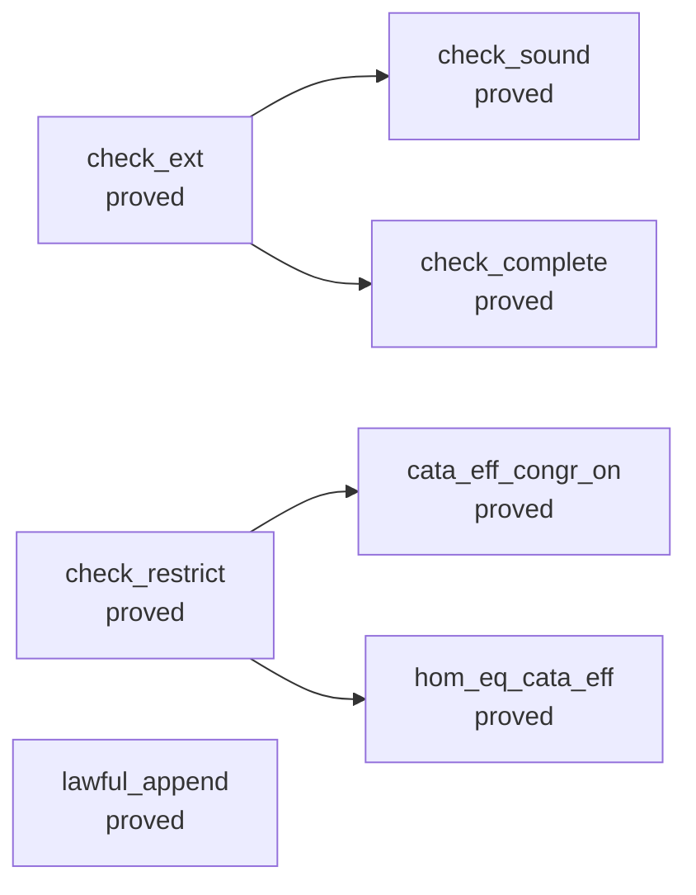

| Node | Status | Rests on | Nearest nodes | Lemmas | Definitions |
| --- | --- | --- | --- | --- | --- |
| `check_ext` | proved | — | `check_sound`, `check_complete` | 68 | 256 |
| `check_restrict` | proved | — | `cata_eff_congr_on`, `hom_eq_cata_eff` | 73 | 330 |
| `lawful_append` | proved | — | — | 40 | 142 |
| `check_sound` | proved | — | — | 136 | 263 |
| `check_complete` | proved | — | — | 69 | 266 |
| `cata_eff_congr_on` | proved | — | — | 65 | 73 |
| `hom_eq_cata_eff` | proved | — | — | 65 | 79 |

### R3: Data: the type language closed under records and variants as Ty growth

- Open: variants: the tag select over records landed (decisions row 195 (d)); catchTag's residual, the caught tag subtracted from the error column, waits on decisions row 130
- Open: recursive types are row 124 (open): nominal Σ_app declarations through Ty.app
- Open: error payloads: the carrier (decisions row 120, part E1) and the face (part E2: one Data.TaggedError class per tag, printed and read back) landed; open: catchTag's residual over records (decisions row 130), int and number fields (row 121; a number field is refused by name as unreadable), a field typed by another class (refused by name), a record update of a class instance (it answers a structural object), and a host row answering a payload (R6, parked)
- Open: int inhabited inside row 108's profile: ruled 2026-10-02 (decisions row 121), not landed; the admission's int scan still refuses it
- Open: the Schema and JSON images of app, null, undefined, number and bytes: unlowered or refused by name (decisions rows 121, 158, 160, 161)
- Open: equality at records: eq stays refused at records until a program compares them (decisions row 126)

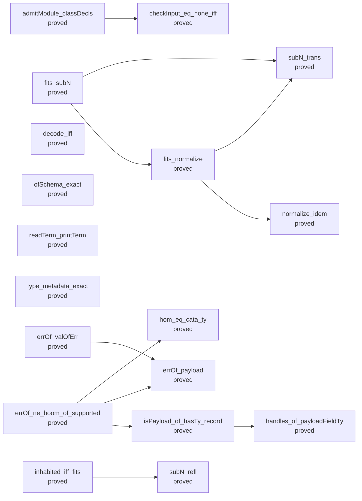

| Node | Status | Rests on | Nearest nodes | Lemmas | Definitions |
| --- | --- | --- | --- | --- | --- |
| `checkInput_eq_none_iff` | proved | — | — | 38 | 100 |
| `fits_normalize` | proved | — | `subN_trans`, `normalize_idem` | 264 | 225 |
| `fits_subN` | proved | — | `subN_trans`, `fits_normalize` | 247 | 225 |
| `inhabited_iff_fits` | proved | — | `subN_refl` | 155 | 325 |
| `hom_eq_cata_ty` | proved | — | — | 28 | 35 |
| `decode_iff` | proved | — | — | 185 | 296 |
| `ofSchema_exact` | proved | — | — | 41 | 144 |
| `readTerm_printTerm` | proved | — | — | 164 | 205 |
| `type_metadata_exact` | proved | — | — | 61 | 86 |
| `errOf_valOfErr` | proved | — | `errOf_payload` | 4 | 16 |
| `admitModule_classDecls` | proved | — | `checkInput_eq_none_iff` | 143 | 758 |
| `errOf_ne_boom_of_supported` | proved | — | `hom_eq_cata_ty`, `errOf_payload`, `isPayload_of_hasTy_record` | 230 | 230 |
| `errOf_payload` | proved | — | — | 8 | 15 |
| `isPayload_of_hasTy_record` | proved | — | `handles_of_payloadFieldTy` | 45 | 132 |
| `subN_trans` | proved | — | — | 96 | 53 |
| `normalize_idem` | proved | — | — | 77 | 51 |
| `subN_refl` | proved | — | — | 38 | 44 |
| `handles_of_payloadFieldTy` | proved | — | — | 44 | 135 |

### R4: State: the world types every cell at any type, with rows as templates

- Open: pool-profile-preserved (proposed claim; store-typing): along a run of the public operations the cell stays a member of its type and its state stays in the first profile; the model's half is profile_closed on six transitions; the cell's half is the seven typing statements of the cell and of the steps with step_keeps_cell, and each attempt statement of the operations gives the membership of the reply and of the stored value from the membership of the cell before the step; the operations are typed at every scope (use_types, make_types, close_answers), and make's type requires the scope; no statement says that a client writes the cell by the operations alone, none keeps the table injective along a run, and no goal states the run-level claim (decisions rows 267 to 269, 276)
- Open: the faces of Ref<A> and Deferred<A, E>, the type arguments' part: landed in the state plan's T5 for a binder term and for Deferred.make: a read-modify-write row's binder term is printed as a function of the cell's current value and read back (part A: printPerform, readPerform); Deferred.make<A, E>() is printed from the operation's own type arguments and read back at every instance whose types are readable (part B: Signature.typeArgsOf and withTypeArgs, printCall, readCall, LawfulTypeArgs; Classes.readTyChecked on Classes.ReadableTy), a bare Deferred.make() is refused by its spelling and never typed at a default, the native row declares no type argument of its own, and an operation's type arguments are program annotations (ScopedOp.typeArgs: raw formation, the integer scan and the module's class table read them; decisions row 212); read_print and read_exact keep their statements; open: Ref.make<A>, which needs an appended constructor (decisions rows 210 and 212); a type argument outside the readable types (a handle type, unknown, a class name: printed where it has a printed form, and refused at reading; int and number: read at nat); a list fold's stated accumulator type, which is printed and not read; and the instance's row in the other estates: the TypeScript profile and the OCaml metadata list Deferred.make once, at the face's instance, so a consumer that needs an instance's answer column derives it from the operation
- Open: the target half of handle-identity-laws (decisions row 229): the identity correspondence in each target's relation, in both directions: two handles have equal keys exactly when their host objects are one object; no goal states it, and the laws over Fits and the world's order are handle_identity_laws
- Open: semaphore-accounting-preserved (proposed claim; store-typing): along a run of the public operations the cell stays a member of its type and its state stays in the first profile; the model's half is profile_closed; the cell's half is the six typing statements of the steps with step_keeps_cell, and each attempt statement of the operations gives the membership of the reply and of the stored value from the membership of the cell before the step; no statement gives that first membership from the handles that the table names, and no goal states the run-level claim (decisions rows 260, 261, 265, 276)
- Open: atomic-attempt-isolation (proposed claim; store-typing and reactive-scheduling): an admitted atomic body's ordered dynamic reads and writes, the exact state that a failure or a retry restores, and no step of another fiber between its first access and its commit (decisions rows 80, 223; waits on the body profile's grammar and on row 226's budget or suspension)
- Open: the second half of scoped-body-substitution-boundary (residual-program-typing): for a later constructor that does bind a scope, the code after the scope runs only after it, and substitution neither captures it nor copies it into a child body (decisions rows 225, 227); no goal states it: the mask adds no scoped constructor, and its restore node's half is scoped_body_substitution_boundary

```mermaid
flowchart LR
  n0["order_refl<br/>proved"]
  n1["order_trans<br/>proved"]
  n2["refMake_extension<br/>proved"]
  n3["deferredMake_extension<br/>proved"]
  n4["memoBuild_extension<br/>proved"]
  n5["fold_typed_atomic_update<br/>proved"]
  n6["handle_identity_laws<br/>proved"]
  n7["saved_mask_image_membership<br/>proved"]
  n8["scoped_body_substitution_boundary<br/>proved"]
  n9["image_agrees<br/>proved"]
  n10["ascribe_untyped<br/>proved"]
  n11["step_keeps_cell<br/>proved"]
  n12["types_ascribe<br/>proved"]
  n13["closeStep_types<br/>proved"]
  n14["drainStep_types<br/>proved"]
  n15["initial_types<br/>proved"]
  n16["leaseStep_types<br/>proved"]
  n17["lease_enrols_iff<br/>proved"]
  n18["Pool.Model.profile_closed<br/>proved"]
  n19["returnStep_types<br/>proved"]
  n20["selectStep_types<br/>proved"]
  n21["Pool.Model.withdrawStep_types<br/>proved"]
  n22["close_answers<br/>proved"]
  n23["Pool.make_types<br/>proved"]
  n24["use_types<br/>proved"]
  n25["ascribe_scoped<br/>proved"]
  n26["matchArgsB_complete<br/>proved"]
  n27["matchArgsB_conservative<br/>proved"]
  n28["matchArgsB_least<br/>proved"]
  n29["matchArgsB_sound<br/>proved"]
  n30["matchArgsN_complete<br/>proved"]
  n31["matchArgsN_least<br/>proved"]
  n32["matchB_cell_fixed<br/>proved"]
  n33["matchB_complete<br/>proved"]
  n34["matchB_conservative<br/>proved"]
  n35["matchB_least<br/>proved"]
  n36["matchB_sound<br/>proved"]
  n37["matchN_congr<br/>proved"]
  n38["templateOK_of<br/>proved"]
  n39["perform_scoped_iff<br/>proved"]
  n40["matchTemplate_complete_anchored<br/>proved"]
  n41["mono<br/>proved"]
  n42["syncRow_typed<br/>proved"]
  n43["termMaps_of_typed<br/>proved"]
  n44["empty_typed<br/>proved"]
  n45["offerStep_typed<br/>proved"]
  n46["offerStep_types<br/>proved"]
  n47["pollStep_typed<br/>proved"]
  n48["pollStep_types<br/>proved"]
  n49["sizeStep_typed<br/>proved"]
  n50["takeStep_typed<br/>proved"]
  n51["Queue.Model.takeStep_types<br/>proved"]
  n52["withdrawOffer_typed<br/>proved"]
  n53["withdrawOffer_types<br/>proved"]
  n54["withdrawTake_typed<br/>proved"]
  n55["withdrawTake_types<br/>proved"]
  n56["bounded_types<br/>proved"]
  n57["offer_types<br/>proved"]
  n58["poll_types<br/>proved"]
  n59["size_types<br/>proved"]
  n60["Queue.take_types<br/>proved"]
  n61["empty_types<br/>proved"]
  n62["Semaphore.Model.profile_closed<br/>proved"]
  n63["releaseStep_types<br/>proved"]
  n64["takeIfAvailableStep_types<br/>proved"]
  n65["Semaphore.Model.takeStep_types<br/>proved"]
  n66["visitStep_types<br/>proved"]
  n67["Semaphore.Model.withdrawStep_types<br/>proved"]
  n68["Semaphore.make_types<br/>proved"]
  n69["release_types<br/>proved"]
  n70["takeIfAvailable_types<br/>proved"]
  n71["Semaphore.take_types<br/>proved"]
  n72["withPermitsIfAvailable_types<br/>proved"]
  n73["withPermits_types<br/>proved"]
  n74["atomic<br/>modulo"]
  n75["bounded<br/>goal"]
  n76["committed<br/>goal"]
  n77["counted<br/>goal"]
  n78["readTerm_printTerm<br/>proved"]
  n79["listOf_upper<br/>proved"]
  n80["fits_subN<br/>proved"]
  n81["fits_normalize<br/>proved"]
  n82["normalize_idem<br/>proved"]
  n83["lift_sound<br/>proved"]
  n84["subN_trans<br/>proved"]
  n85["causeInputError_upper<br/>proved"]
  n86["hom_eq_cata_ty<br/>proved"]
  n87["fits_mono<br/>proved"]
  n88["denotesTyped<br/>proved"]
  n89["lift_member<br/>proved"]
  n90["subN_refl<br/>proved"]
  n91["check_complete<br/>proved"]
  n92["check_sound<br/>proved"]
  n93["waitRetryAt_answers<br/>proved"]
  n94["mask_printed_form_profile<br/>proved"]
  n95["optionTy_option<br/>proved"]
  n96["protectedBy_has<br/>proved"]
  n97["errOf_payload<br/>proved"]
  n98["isPayload_of_hasTy_record<br/>proved"]
  n99["rowTy_instantiated_formed<br/>proved"]
  n100["sub_antisymm_canonical<br/>proved"]
  n101["unsuspended_runs<br/>proved"]
  n102["cleans_once<br/>goal"]
  n103["checkInput_eq_none_iff<br/>proved"]
  n104["list_eliminator<br/>proved"]
  n105["extend_upper<br/>proved"]
  n106["lift_transfer<br/>proved"]
  n107["cause_upper<br/>proved"]
  n108["cause_mono<br/>proved"]
  n109["UnionRule.lift_upper<br/>proved"]
  n110["subN_causeOf_causeUpper<br/>proved"]
  n111["subN_exitOf_causeUpper<br/>proved"]
  n112["extend_eq_some_iff<br/>proved"]
  n113["provideLayerArm<br/>proved"]
  n114["optionTy_upper<br/>proved"]
  n115["catchGuard_typed<br/>proved"]
  n116["onExit_typed<br/>proved"]
  n117["guardBind_typed<br/>proved"]
  n118["exitOf_upper<br/>proved"]
  n119["fits_scope_inv<br/>proved"]
  n120["fiberTy_upper<br/>proved"]
  n121["allGuard_typed<br/>proved"]
  n122["saved_mask_restoration<br/>proved"]
  n123["read_print<br/>proved"]
  n124["liftOne_member<br/>proved"]
  n125["handles_of_payloadFieldTy<br/>proved"]
  n126["run_agrees<br/>proved"]
  n127["subN_list_iff<br/>proved"]
  n128["extend_adjoint<br/>proved"]
  n129["joinAll_keeps<br/>proved"]
  n130["mapM_answer<br/>proved"]
  n131["subN_exitOf_iff<br/>proved"]
  n132["subN_causeOf_iff<br/>proved"]
  n133["le_joinAll<br/>proved"]
  n134["seq_typed<br/>proved"]
  n135["liftOne_some<br/>proved"]
  n136["option_eliminator<br/>proved"]
  n137["Eliminator.lift_upper<br/>proved"]
  n138["close_typed<br/>proved"]
  n139["exit_eliminator<br/>proved"]
  n140["fiber_eliminator<br/>proved"]
  n141["liftOne_eq<br/>proved"]
  n142["run_eq_meaning<br/>proved"]
  n143["adjoint<br/>proved"]
  n144["foldl_keeps<br/>proved"]
  n145["mapM_cons_eq_some<br/>proved"]
  n146["liftOne_eq_some_iff<br/>proved"]
  n147["subN_option_iff<br/>proved"]
  n148["subN_fiberOf_iff<br/>proved"]
  n149["Eliminator.lift_least<br/>proved"]
  n150["mapM_total<br/>proved"]
  n151["UnionRule.lift_least<br/>proved"]
  n152["mapM_source<br/>proved"]
  n153["joinAll_le<br/>proved"]
  n154["joinAll_all<br/>proved"]
  n155["foldl_all<br/>proved"]
  n5 --> n78
  n5 --> n0
  n5 --> n43
  n5 --> n79
  n5 --> n80
  n5 --> n81
  n5 --> n82
  n5 --> n83
  n5 --> n84
  n5 --> n85
  n5 --> n29
  n5 --> n86
  n6 --> n87
  n8 --> n88
  n8 --> n79
  n8 --> n80
  n8 --> n81
  n8 --> n82
  n8 --> n83
  n8 --> n84
  n8 --> n85
  n8 --> n29
  n8 --> n86
  n11 --> n5
  n12 --> n89
  n12 --> n82
  n13 --> n82
  n13 --> n89
  n14 --> n90
  n14 --> n89
  n14 --> n82
  n16 --> n89
  n16 --> n82
  n16 --> n90
  n19 --> n90
  n19 --> n89
  n19 --> n82
  n20 --> n82
  n20 --> n89
  n21 --> n89
  n21 --> n82
  n21 --> n90
  n22 --> n21
  n22 --> n91
  n22 --> n92
  n22 --> n14
  n22 --> n93
  n22 --> n94
  n22 --> n90
  n22 --> n89
  n22 --> n82
  n22 --> n95
  n22 --> n20
  n22 --> n13
  n23 --> n82
  n23 --> n91
  n23 --> n92
  n23 --> n22
  n23 --> n15
  n24 --> n91
  n24 --> n92
  n24 --> n90
  n24 --> n89
  n24 --> n82
  n24 --> n95
  n24 --> n20
  n24 --> n19
  n24 --> n21
  n24 --> n16
  n24 --> n93
  n24 --> n96
  n26 --> n82
  n26 --> n84
  n26 --> n90
  n27 --> n26
  n27 --> n82
  n27 --> n84
  n27 --> n90
  n28 --> n82
  n28 --> n84
  n28 --> n90
  n30 --> n82
  n30 --> n26
  n31 --> n82
  n31 --> n28
  n32 --> n36
  n33 --> n82
  n33 --> n84
  n33 --> n90
  n34 --> n33
  n34 --> n82
  n34 --> n84
  n34 --> n90
  n35 --> n82
  n35 --> n84
  n35 --> n90
  n40 --> n82
  n41 --> n1
  n42 --> n81
  n42 --> n84
  n42 --> n80
  n42 --> n43
  n42 --> n36
  n42 --> n86
  n42 --> n97
  n42 --> n98
  n42 --> n82
  n42 --> n90
  n43 --> n79
  n43 --> n80
  n43 --> n81
  n43 --> n82
  n43 --> n83
  n43 --> n84
  n43 --> n85
  n43 --> n29
  n43 --> n86
  n43 --> n87
  n45 --> n46
  n46 --> n82
  n46 --> n90
  n46 --> n89
  n47 --> n48
  n48 --> n82
  n48 --> n90
  n48 --> n89
  n49 --> n89
  n49 --> n82
  n50 --> n51
  n51 --> n82
  n51 --> n90
  n51 --> n89
  n52 --> n53
  n53 --> n82
  n53 --> n89
  n53 --> n90
  n54 --> n55
  n55 --> n82
  n55 --> n89
  n55 --> n90
  n56 --> n44
  n56 --> n91
  n56 --> n92
  n57 --> n53
  n57 --> n91
  n57 --> n92
  n57 --> n95
  n57 --> n89
  n57 --> n82
  n57 --> n90
  n57 --> n46
  n57 --> n99
  n57 --> n94
  n58 --> n91
  n58 --> n92
  n58 --> n89
  n58 --> n82
  n58 --> n90
  n58 --> n95
  n58 --> n48
  n59 --> n89
  n59 --> n82
  n59 --> n91
  n59 --> n92
  n60 --> n55
  n60 --> n91
  n60 --> n92
  n60 --> n95
  n60 --> n89
  n60 --> n82
  n60 --> n90
  n60 --> n51
  n60 --> n93
  n60 --> n94
  n63 --> n82
  n63 --> n89
  n64 --> n89
  n64 --> n82
  n64 --> n90
  n65 --> n89
  n65 --> n82
  n65 --> n90
  n66 --> n90
  n66 --> n89
  n66 --> n82
  n67 --> n89
  n67 --> n82
  n67 --> n90
  n68 --> n61
  n68 --> n91
  n68 --> n92
  n69 --> n91
  n69 --> n92
  n69 --> n82
  n69 --> n90
  n69 --> n89
  n69 --> n95
  n69 --> n66
  n69 --> n63
  n70 --> n64
  n70 --> n91
  n70 --> n92
  n71 --> n67
  n71 --> n91
  n71 --> n92
  n71 --> n65
  n71 --> n93
  n71 --> n94
  n72 --> n69
  n72 --> n92
  n72 --> n91
  n72 --> n82
  n72 --> n70
  n72 --> n96
  n72 --> n100
  n73 --> n69
  n73 --> n67
  n73 --> n91
  n73 --> n92
  n73 --> n65
  n73 --> n93
  n73 --> n96
  n74 --> n101
  n74 --> n102
  n74 --> n76
  n74 --> n77
  n74 --> n75
  n74 --> n103
  n75 --> n103
  n76 --> n103
  n77 --> n103
  n79 --> n104
  n79 --> n82
  n79 --> n84
  n79 --> n90
  n79 --> n105
  n80 --> n84
  n80 --> n81
  n81 --> n84
  n81 --> n82
  n83 --> n106
  n85 --> n107
  n85 --> n108
  n85 --> n82
  n85 --> n84
  n85 --> n90
  n85 --> n109
  n85 --> n110
  n85 --> n111
  n85 --> n112
  n88 --> n113
  n88 --> n79
  n88 --> n80
  n88 --> n81
  n88 --> n82
  n88 --> n83
  n88 --> n84
  n88 --> n85
  n88 --> n29
  n88 --> n86
  n88 --> n87
  n88 --> n114
  n88 --> n1
  n88 --> n90
  n88 --> n115
  n88 --> n116
  n88 --> n117
  n88 --> n118
  n88 --> n119
  n88 --> n120
  n88 --> n36
  n88 --> n42
  n88 --> n97
  n88 --> n98
  n88 --> n121
  n93 --> n91
  n93 --> n92
  n93 --> n95
  n93 --> n82
  n94 --> n122
  n94 --> n123
  n94 --> n92
  n94 --> n91
  n95 --> n124
  n96 --> n82
  n96 --> n92
  n96 --> n91
  n96 --> n94
  n98 --> n125
  n101 --> n126
  n102 --> n103
  n104 --> n127
  n104 --> n82
  n104 --> n84
  n104 --> n90
  n105 --> n128
  n106 --> n129
  n106 --> n130
  n107 --> n110
  n107 --> n111
  n108 --> n131
  n108 --> n110
  n108 --> n84
  n108 --> n132
  n109 --> n133
  n109 --> n84
  n109 --> n130
  n111 --> n84
  n111 --> n90
  n111 --> n131
  n113 --> n80
  n113 --> n0
  n113 --> n120
  n113 --> n86
  n113 --> n84
  n113 --> n81
  n113 --> n36
  n113 --> n42
  n113 --> n79
  n113 --> n82
  n113 --> n83
  n113 --> n85
  n113 --> n29
  n113 --> n97
  n113 --> n98
  n113 --> n1
  n113 --> n90
  n113 --> n116
  n113 --> n117
  n113 --> n87
  n113 --> n119
  n113 --> n134
  n113 --> n115
  n114 --> n135
  n114 --> n136
  n114 --> n82
  n114 --> n84
  n114 --> n90
  n114 --> n137
  n115 --> n80
  n115 --> n117
  n116 --> n80
  n116 --> n87
  n116 --> n115
  n116 --> n90
  n116 --> n117
  n116 --> n121
  n117 --> n138
  n118 --> n139
  n118 --> n82
  n118 --> n84
  n118 --> n90
  n118 --> n105
  n120 --> n140
  n120 --> n82
  n120 --> n84
  n120 --> n90
  n120 --> n105
  n121 --> n117
  n123 --> n78
  n124 --> n89
  n124 --> n141
  n126 --> n142
  n128 --> n135
  n128 --> n143
  n128 --> n112
  n129 --> n144
  n130 --> n145
  n133 --> n129
  n134 --> n90
  n134 --> n80
  n134 --> n117
  n135 --> n146
  n136 --> n147
  n136 --> n82
  n136 --> n84
  n136 --> n90
  n137 --> n90
  n137 --> n109
  n139 --> n131
  n139 --> n82
  n139 --> n84
  n139 --> n90
  n140 --> n148
  n140 --> n82
  n140 --> n84
  n140 --> n90
  n143 --> n149
  n143 --> n84
  n143 --> n150
  n143 --> n137
  n149 --> n151
  n150 --> n145
  n151 --> n84
  n151 --> n152
  n151 --> n153
  n152 --> n145
  n153 --> n154
  n154 --> n155
```

| Node | Status | Rests on | Nearest nodes | Lemmas | Definitions |
| --- | --- | --- | --- | --- | --- |
| `order_refl` | proved | — | — | 57 | 205 |
| `order_trans` | proved | — | — | 57 | 206 |
| `refMake_extension` | proved | — | — | 113 | 340 |
| `deferredMake_extension` | proved | — | — | 112 | 340 |
| `memoBuild_extension` | proved | — | — | 111 | 340 |
| `fold_typed_atomic_update` | proved | — | `readTerm_printTerm`, `order_refl`, `termMaps_of_typed`, `listOf_upper`, `fits_subN`, `fits_normalize`, `normalize_idem`, `lift_sound`, `subN_trans`, `causeInputError_upper`, `matchArgsB_sound`, `hom_eq_cata_ty` | 550 | 668 |
| `handle_identity_laws` | proved | — | `fits_mono` | 176 | 372 |
| `saved_mask_image_membership` | proved | — | — | 75 | 256 |
| `scoped_body_substitution_boundary` | proved | — | `denotesTyped`, `listOf_upper`, `fits_subN`, `fits_normalize`, `normalize_idem`, `lift_sound`, `subN_trans`, `causeInputError_upper`, `matchArgsB_sound`, `hom_eq_cata_ty` | 754 | 1122 |
| `image_agrees` | proved | — | — | 11 | 110 |
| `ascribe_untyped` | proved | — | — | 44 | 105 |
| `step_keeps_cell` | proved | — | `fold_typed_atomic_update` | 57 | 402 |
| `types_ascribe` | proved | — | `lift_member`, `normalize_idem` | 93 | 112 |
| `closeStep_types` | proved | — | `normalize_idem`, `lift_member` | 156 | 157 |
| `drainStep_types` | proved | — | `subN_refl`, `lift_member`, `normalize_idem` | 302 | 188 |
| `initial_types` | proved | — | — | 133 | 162 |
| `leaseStep_types` | proved | — | `lift_member`, `normalize_idem`, `subN_refl` | 341 | 195 |
| `lease_enrols_iff` | proved | — | — | 5 | 14 |
| `Pool.Model.profile_closed` | proved | — | — | 25 | 22 |
| `returnStep_types` | proved | — | `subN_refl`, `lift_member`, `normalize_idem` | 313 | 192 |
| `selectStep_types` | proved | — | `normalize_idem`, `lift_member` | 126 | 151 |
| `Pool.Model.withdrawStep_types` | proved | — | `lift_member`, `normalize_idem`, `subN_refl` | 284 | 183 |
| `close_answers` | proved | — | `Pool.Model.withdrawStep_types`, `check_complete`, `check_sound`, `drainStep_types`, `waitRetryAt_answers`, `mask_printed_form_profile`, `subN_refl`, `lift_member`, `normalize_idem`, `optionTy_option`, `selectStep_types`, `closeStep_types` | 259 | 444 |
| `Pool.make_types` | proved | — | `normalize_idem`, `check_complete`, `check_sound`, `close_answers`, `initial_types` | 243 | 452 |
| `use_types` | proved | — | `check_complete`, `check_sound`, `subN_refl`, `lift_member`, `normalize_idem`, `optionTy_option`, `selectStep_types`, `returnStep_types`, `Pool.Model.withdrawStep_types`, `leaseStep_types`, `waitRetryAt_answers`, `protectedBy_has` | 282 | 454 |
| `ascribe_scoped` | proved | — | — | 7 | 10 |
| `matchArgsB_complete` | proved | — | `normalize_idem`, `subN_trans`, `subN_refl` | 267 | 132 |
| `matchArgsB_conservative` | proved | — | `matchArgsB_complete`, `normalize_idem`, `subN_trans`, `subN_refl` | 233 | 94 |
| `matchArgsB_least` | proved | — | `normalize_idem`, `subN_trans`, `subN_refl` | 228 | 89 |
| `matchArgsB_sound` | proved | — | — | 38 | 60 |
| `matchArgsN_complete` | proved | — | `normalize_idem`, `matchArgsB_complete` | 63 | 55 |
| `matchArgsN_least` | proved | — | `normalize_idem`, `matchArgsB_least` | 64 | 68 |
| `matchB_cell_fixed` | proved | — | `matchB_sound` | 144 | 72 |
| `matchB_complete` | proved | — | `normalize_idem`, `subN_trans`, `subN_refl` | 266 | 130 |
| `matchB_conservative` | proved | — | `matchB_complete`, `normalize_idem`, `subN_trans`, `subN_refl` | 232 | 91 |
| `matchB_least` | proved | — | `normalize_idem`, `subN_trans`, `subN_refl` | 227 | 87 |
| `matchB_sound` | proved | — | — | 39 | 58 |
| `matchN_congr` | proved | — | — | 38 | 59 |
| `templateOK_of` | proved | — | — | 62 | 56 |
| `perform_scoped_iff` | proved | — | — | 0 | 73 |
| `matchTemplate_complete_anchored` | proved | — | `normalize_idem` | 233 | 124 |
| `mono` | proved | — | `order_trans` | 57 | 271 |
| `syncRow_typed` | proved | — | `fits_normalize`, `subN_trans`, `fits_subN`, `termMaps_of_typed`, `matchB_sound`, `hom_eq_cata_ty`, `errOf_payload`, `isPayload_of_hasTy_record`, `normalize_idem`, `subN_refl` | 394 | 713 |
| `termMaps_of_typed` | proved | — | `listOf_upper`, `fits_subN`, `fits_normalize`, `normalize_idem`, `lift_sound`, `subN_trans`, `causeInputError_upper`, `matchArgsB_sound`, `hom_eq_cata_ty`, `fits_mono` | 451 | 434 |
| `empty_typed` | proved | — | — | 56 | 149 |
| `offerStep_typed` | proved | — | `offerStep_types` | 43 | 166 |
| `offerStep_types` | proved | — | `normalize_idem`, `subN_refl`, `lift_member` | 309 | 177 |
| `pollStep_typed` | proved | — | `pollStep_types` | 43 | 172 |
| `pollStep_types` | proved | — | `normalize_idem`, `subN_refl`, `lift_member` | 317 | 190 |
| `sizeStep_typed` | proved | — | `lift_member`, `normalize_idem` | 93 | 157 |
| `takeStep_typed` | proved | — | `Queue.Model.takeStep_types` | 50 | 186 |
| `Queue.Model.takeStep_types` | proved | — | `normalize_idem`, `subN_refl`, `lift_member` | 352 | 204 |
| `withdrawOffer_typed` | proved | — | `withdrawOffer_types` | 50 | 169 |
| `withdrawOffer_types` | proved | — | `normalize_idem`, `lift_member`, `subN_refl` | 295 | 187 |
| `withdrawTake_typed` | proved | — | `withdrawTake_types` | 50 | 169 |
| `withdrawTake_types` | proved | — | `normalize_idem`, `lift_member`, `subN_refl` | 293 | 187 |
| `bounded_types` | proved | — | `empty_typed`, `check_complete`, `check_sound` | 86 | 336 |
| `offer_types` | proved | — | `withdrawOffer_types`, `check_complete`, `check_sound`, `optionTy_option`, `lift_member`, `normalize_idem`, `subN_refl`, `offerStep_types`, `rowTy_instantiated_formed`, `mask_printed_form_profile` | 260 | 434 |
| `poll_types` | proved | — | `check_complete`, `check_sound`, `lift_member`, `normalize_idem`, `subN_refl`, `optionTy_option`, `pollStep_types` | 253 | 411 |
| `size_types` | proved | — | `lift_member`, `normalize_idem`, `check_complete`, `check_sound` | 180 | 363 |
| `Queue.take_types` | proved | — | `withdrawTake_types`, `check_complete`, `check_sound`, `optionTy_option`, `lift_member`, `normalize_idem`, `subN_refl`, `Queue.Model.takeStep_types`, `waitRetryAt_answers`, `mask_printed_form_profile` | 254 | 449 |
| `empty_types` | proved | — | — | 65 | 143 |
| `Semaphore.Model.profile_closed` | proved | — | — | 13 | 18 |
| `releaseStep_types` | proved | — | `normalize_idem`, `lift_member` | 158 | 155 |
| `takeIfAvailableStep_types` | proved | — | `lift_member`, `normalize_idem`, `subN_refl` | 257 | 164 |
| `Semaphore.Model.takeStep_types` | proved | — | `lift_member`, `normalize_idem`, `subN_refl` | 314 | 188 |
| `visitStep_types` | proved | — | `subN_refl`, `lift_member`, `normalize_idem` | 310 | 188 |
| `Semaphore.Model.withdrawStep_types` | proved | — | `lift_member`, `normalize_idem`, `subN_refl` | 282 | 182 |
| `Semaphore.make_types` | proved | — | `empty_types`, `check_complete`, `check_sound` | 74 | 326 |
| `release_types` | proved | — | `check_complete`, `check_sound`, `normalize_idem`, `subN_refl`, `lift_member`, `optionTy_option`, `visitStep_types`, `releaseStep_types` | 292 | 420 |
| `takeIfAvailable_types` | proved | — | `takeIfAvailableStep_types`, `check_complete`, `check_sound` | 96 | 349 |
| `Semaphore.take_types` | proved | — | `Semaphore.Model.withdrawStep_types`, `check_complete`, `check_sound`, `Semaphore.Model.takeStep_types`, `waitRetryAt_answers`, `mask_printed_form_profile` | 144 | 414 |
| `withPermitsIfAvailable_types` | proved | — | `release_types`, `check_sound`, `check_complete`, `normalize_idem`, `takeIfAvailable_types`, `protectedBy_has`, `sub_antisymm_canonical` | 233 | 422 |
| `withPermits_types` | proved | — | `release_types`, `Semaphore.Model.withdrawStep_types`, `check_complete`, `check_sound`, `Semaphore.Model.takeStep_types`, `waitRetryAt_answers`, `protectedBy_has` | 138 | 425 |
| `atomic` | modulo | `bounded`, `cleans_once`, `committed`, `counted` | `unsuspended_runs`, `cleans_once`, `committed`, `counted`, `bounded`, `checkInput_eq_none_iff` | 86 | 1515 |
| `bounded` | goal | `bounded` | `checkInput_eq_none_iff` | 86 | 1477 |
| `committed` | goal | `committed` | `checkInput_eq_none_iff` | 86 | 1483 |
| `counted` | goal | `counted` | `checkInput_eq_none_iff` | 86 | 1484 |
| `readTerm_printTerm` | proved | — | — | 164 | 205 |
| `listOf_upper` | proved | — | `list_eliminator`, `normalize_idem`, `subN_trans`, `subN_refl`, `extend_upper` | 122 | 65 |
| `fits_subN` | proved | — | `subN_trans`, `fits_normalize` | 247 | 225 |
| `fits_normalize` | proved | — | `subN_trans`, `normalize_idem` | 264 | 225 |
| `normalize_idem` | proved | — | — | 77 | 51 |
| `lift_sound` | proved | — | `lift_transfer` | 41 | 51 |
| `subN_trans` | proved | — | — | 96 | 53 |
| `causeInputError_upper` | proved | — | `cause_upper`, `cause_mono`, `normalize_idem`, `subN_trans`, `subN_refl`, `UnionRule.lift_upper`, `subN_causeOf_causeUpper`, `subN_exitOf_causeUpper`, `extend_eq_some_iff` | 122 | 67 |
| `hom_eq_cata_ty` | proved | — | — | 28 | 35 |
| `fits_mono` | proved | — | — | 80 | 235 |
| `denotesTyped` | proved | — | `provideLayerArm`, `listOf_upper`, `fits_subN`, `fits_normalize`, `normalize_idem`, `lift_sound`, `subN_trans`, `causeInputError_upper`, `matchArgsB_sound`, `hom_eq_cata_ty`, `fits_mono`, `optionTy_upper`, `order_trans`, `subN_refl`, `catchGuard_typed`, `onExit_typed`, `guardBind_typed`, `exitOf_upper`, `fits_scope_inv`, `fiberTy_upper`, `matchB_sound`, `syncRow_typed`, `errOf_payload`, `isPayload_of_hasTy_record`, `allGuard_typed` | 780 | 902 |
| `lift_member` | proved | — | — | 62 | 54 |
| `subN_refl` | proved | — | — | 38 | 44 |
| `check_complete` | proved | — | — | 69 | 266 |
| `check_sound` | proved | — | — | 136 | 263 |
| `waitRetryAt_answers` | proved | — | `check_complete`, `check_sound`, `optionTy_option`, `normalize_idem` | 252 | 396 |
| `mask_printed_form_profile` | proved | — | `saved_mask_restoration`, `read_print`, `check_sound`, `check_complete` | 217 | 888 |
| `optionTy_option` | proved | — | `liftOne_member` | 69 | 60 |
| `protectedBy_has` | proved | — | `normalize_idem`, `check_sound`, `check_complete`, `mask_printed_form_profile` | 139 | 350 |
| `errOf_payload` | proved | — | — | 8 | 15 |
| `isPayload_of_hasTy_record` | proved | — | `handles_of_payloadFieldTy` | 45 | 132 |
| `rowTy_instantiated_formed` | proved | — | — | 55 | 116 |
| `sub_antisymm_canonical` | proved | — | — | 144 | 61 |
| `unsuspended_runs` | proved | — | `run_agrees` | 87 | 863 |
| `cleans_once` | goal | `cleans_once` | `checkInput_eq_none_iff` | 86 | 1476 |
| `checkInput_eq_none_iff` | proved | — | — | 38 | 100 |
| `list_eliminator` | proved | — | `subN_list_iff`, `normalize_idem`, `subN_trans`, `subN_refl` | 139 | 65 |
| `extend_upper` | proved | — | `extend_adjoint` | 38 | 52 |
| `lift_transfer` | proved | — | `joinAll_keeps`, `mapM_answer` | 62 | 55 |
| `cause_upper` | proved | — | `subN_causeOf_causeUpper`, `subN_exitOf_causeUpper` | 37 | 48 |
| `cause_mono` | proved | — | `subN_exitOf_iff`, `subN_causeOf_causeUpper`, `subN_trans`, `subN_causeOf_iff` | 118 | 56 |
| `UnionRule.lift_upper` | proved | — | `le_joinAll`, `subN_trans`, `mapM_answer` | 140 | 64 |
| `subN_causeOf_causeUpper` | proved | — | — | 117 | 54 |
| `subN_exitOf_causeUpper` | proved | — | `subN_trans`, `subN_refl`, `subN_exitOf_iff` | 117 | 56 |
| `extend_eq_some_iff` | proved | — | — | 37 | 50 |
| `provideLayerArm` | proved | — | `fits_subN`, `order_refl`, `fiberTy_upper`, `hom_eq_cata_ty`, `subN_trans`, `fits_normalize`, `matchB_sound`, `syncRow_typed`, `listOf_upper`, `normalize_idem`, `lift_sound`, `causeInputError_upper`, `matchArgsB_sound`, `errOf_payload`, `isPayload_of_hasTy_record`, `order_trans`, `subN_refl`, `onExit_typed`, `guardBind_typed`, `fits_mono`, `fits_scope_inv`, `seq_typed`, `catchGuard_typed` | 814 | 944 |
| `optionTy_upper` | proved | — | `liftOne_some`, `option_eliminator`, `normalize_idem`, `subN_trans`, `subN_refl`, `Eliminator.lift_upper` | 122 | 64 |
| `catchGuard_typed` | proved | — | `fits_subN`, `guardBind_typed` | 56 | 246 |
| `onExit_typed` | proved | — | `fits_subN`, `fits_mono`, `catchGuard_typed`, `subN_refl`, `guardBind_typed`, `allGuard_typed` | 90 | 680 |
| `guardBind_typed` | proved | — | `close_typed` | 54 | 256 |
| `exitOf_upper` | proved | — | `exit_eliminator`, `normalize_idem`, `subN_trans`, `subN_refl`, `extend_upper` | 128 | 68 |
| `fits_scope_inv` | proved | — | — | 54 | 200 |
| `fiberTy_upper` | proved | — | `fiber_eliminator`, `normalize_idem`, `subN_trans`, `subN_refl`, `extend_upper` | 128 | 68 |
| `allGuard_typed` | proved | — | `guardBind_typed` | 54 | 246 |
| `saved_mask_restoration` | proved | — | — | 99 | 753 |
| `read_print` | proved | — | `readTerm_printTerm` | 346 | 553 |
| `liftOne_member` | proved | — | `lift_member`, `liftOne_eq` | 62 | 55 |
| `handles_of_payloadFieldTy` | proved | — | — | 44 | 135 |
| `run_agrees` | proved | — | `run_eq_meaning` | 68 | 861 |
| `subN_list_iff` | proved | — | — | 43 | 48 |
| `extend_adjoint` | proved | — | `liftOne_some`, `adjoint`, `extend_eq_some_iff` | 39 | 52 |
| `joinAll_keeps` | proved | — | `foldl_keeps` | 0 | 2 |
| `mapM_answer` | proved | — | `mapM_cons_eq_some` | 0 | 0 |
| `subN_exitOf_iff` | proved | — | — | 43 | 48 |
| `subN_causeOf_iff` | proved | — | — | 43 | 48 |
| `le_joinAll` | proved | — | `joinAll_keeps` | 4 | 2 |
| `seq_typed` | proved | — | `subN_refl`, `fits_subN`, `guardBind_typed` | 58 | 249 |
| `liftOne_some` | proved | — | `liftOne_eq_some_iff` | 37 | 49 |
| `option_eliminator` | proved | — | `subN_option_iff`, `normalize_idem`, `subN_trans`, `subN_refl` | 139 | 65 |
| `Eliminator.lift_upper` | proved | — | `subN_refl`, `UnionRule.lift_upper` | 39 | 51 |
| `close_typed` | proved | — | — | 73 | 653 |
| `exit_eliminator` | proved | — | `subN_exitOf_iff`, `normalize_idem`, `subN_trans`, `subN_refl` | 145 | 67 |
| `fiber_eliminator` | proved | — | `subN_fiberOf_iff`, `normalize_idem`, `subN_trans`, `subN_refl` | 145 | 67 |
| `liftOne_eq` | proved | — | — | 37 | 48 |
| `run_eq_meaning` | proved | — | — | 310 | 906 |
| `adjoint` | proved | — | `Eliminator.lift_least`, `subN_trans`, `mapM_total`, `Eliminator.lift_upper` | 84 | 57 |
| `foldl_keeps` | proved | — | — | 0 | 1 |
| `mapM_cons_eq_some` | proved | — | — | 0 | 0 |
| `liftOne_eq_some_iff` | proved | — | — | 37 | 49 |
| `subN_option_iff` | proved | — | — | 43 | 48 |
| `subN_fiberOf_iff` | proved | — | — | 43 | 48 |
| `Eliminator.lift_least` | proved | — | `UnionRule.lift_least` | 39 | 51 |
| `mapM_total` | proved | — | `mapM_cons_eq_some` | 0 | 0 |
| `UnionRule.lift_least` | proved | — | `subN_trans`, `mapM_source`, `joinAll_le` | 82 | 57 |
| `mapM_source` | proved | — | `mapM_cons_eq_some` | 0 | 0 |
| `joinAll_le` | proved | — | `joinAll_all` | 2 | 3 |
| `joinAll_all` | proved | — | `foldl_all` | 0 | 2 |
| `foldl_all` | proved | — | — | 0 | 1 |

### R5: Services: the service table, layers and provision

- Open: lower_refines_build: the machine's build of a layer refines `build` (decisions row 147)
- Open: reference keys, Config, minted keys, and context validation at any runtime bridge (system map §8, R5)

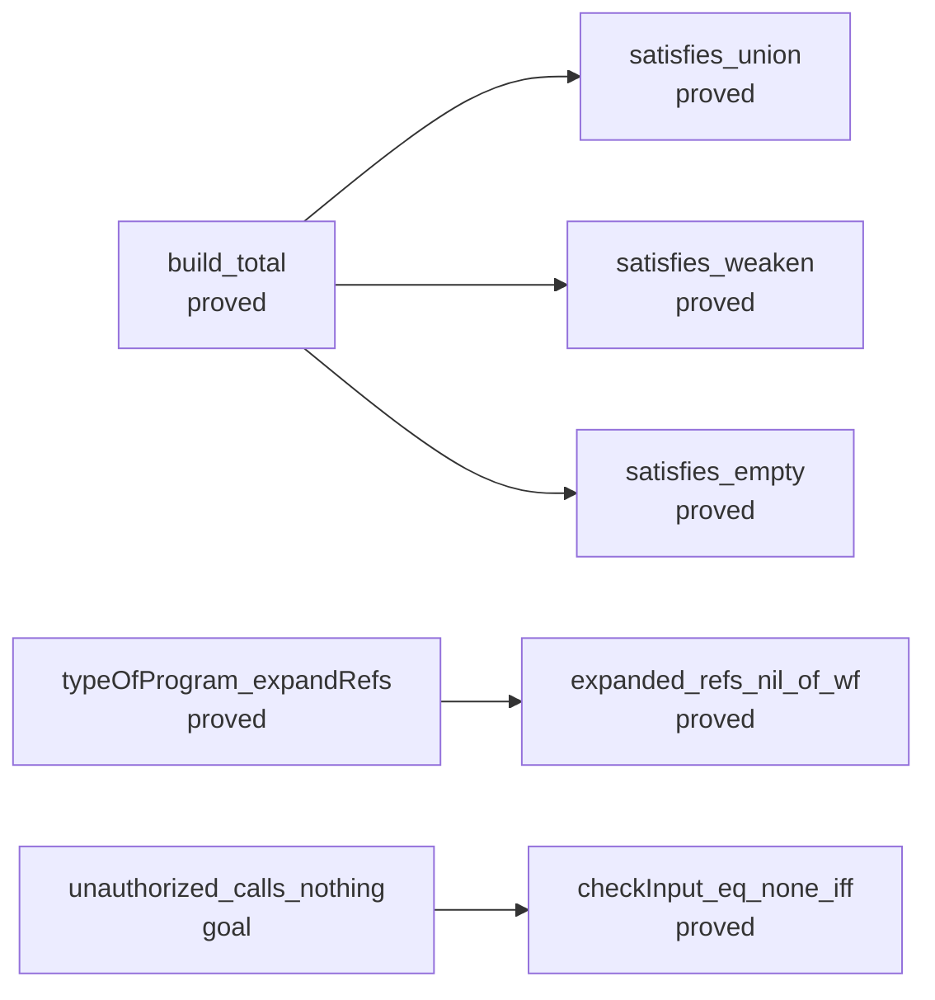

| Node | Status | Rests on | Nearest nodes | Lemmas | Definitions |
| --- | --- | --- | --- | --- | --- |
| `build_total` | proved | — | `satisfies_union`, `satisfies_weaken`, `satisfies_empty` | 173 | 288 |
| `expanded_refs_nil_of_wf` | proved | — | — | 19 | 106 |
| `typeOfProgram_expandRefs` | proved | — | `expanded_refs_nil_of_wf` | 58 | 348 |
| `unauthorized_calls_nothing` | goal | `unauthorized_calls_nothing` | `checkInput_eq_none_iff` | 85 | 1453 |
| `satisfies_union` | proved | — | — | 20 | 33 |
| `satisfies_weaken` | proved | — | — | 0 | 25 |
| `satisfies_empty` | proved | — | — | 2 | 26 |
| `checkInput_eq_none_iff` | proved | — | — | 38 | 100 |

### R6: The host: a lawful HostSpec, receipt and application, DI-57's table-aware reference

- Open: admit_sound's value half: executable admission implies the ghost AnswerOk on success values (waits on decisions row 97's handle declarations)
- Open: DI-57's table-aware reference relation: run_eq_ref holds at the empty table only (parked by the owner, 2026-09-30)
- Open: DI-69: the row table's meaning in code
- Open: H related to the machine: M6's premise is a predicate on tapes (decisions row 95), not a host relation
- Open: receipt and application on the keyed lifecycle, and their converse (host-boundary §4.5; decisions rows 98–100, parked by the owner, 2026-09-30)
- Open: a world extension meeting C5, a retirement edge, per-row cancellation, one root (DI-58, DI-65)
- Open: the public typed guarantee for programs using host services (decisions row 99)

```mermaid
flowchart LR
  n0["reachable_typed<br/>proved"]
  n1["preflight_success_prepared_fits<br/>proved"]
  n2["preflight_failure_noShapeDefect<br/>proved"]
  n3["handles_of_payloadFieldTy<br/>proved"]
  n4["applied_selects<br/>proved"]
  n5["control_retires<br/>proved"]
  n6["stale_never_applies<br/>goal"]
  n7["timeout<br/>modulo"]
  n8["workers<br/>modulo"]
  n9["receipt_inert<br/>proved"]
  n10["decision_preserves<br/>proved"]
  n11["load_typed<br/>proved"]
  n12["order_trans<br/>proved"]
  n13["order_refl<br/>proved"]
  n14["checkInput_eq_none_iff<br/>proved"]
  n15["cleanup_keeps<br/>goal"]
  n16["retries_declared<br/>goal"]
  n17["releases_once<br/>goal"]
  n18["fits_subN<br/>proved"]
  n19["subN_trans<br/>proved"]
  n20["configTyped_frame<br/>proved"]
  n21["fits_mono<br/>proved"]
  n22["hom_eq_cata_ty<br/>proved"]
  n23["wake_preserves<br/>proved"]
  n24["mono<br/>proved"]
  n25["close_typed<br/>proved"]
  n26["registrationDone_preserves<br/>proved"]
  n27["launch_preserves<br/>proved"]
  n28["guardBind_typed<br/>proved"]
  n29["deliver_preserves<br/>proved"]
  n30["loop_preserves<br/>proved"]
  n31["driveState_lift<br/>proved"]
  n32["denotesTyped<br/>proved"]
  n33["check_sound<br/>proved"]
  n34["check_complete<br/>proved"]
  n35["fits_normalize<br/>proved"]
  n36["completionStrong_await<br/>proved"]
  n37["subN_refl<br/>proved"]
  n38["catchGuard_typed<br/>proved"]
  n39["closeOrder_eq<br/>proved"]
  n40["fits_scope_inv<br/>proved"]
  n41["seq_typed<br/>proved"]
  n42["memoBuild_extension<br/>proved"]
  n43["deferredMake_extension<br/>proved"]
  n44["refMake_extension<br/>proved"]
  n45["listOf_upper<br/>proved"]
  n46["normalize_idem<br/>proved"]
  n47["lift_sound<br/>proved"]
  n48["causeInputError_upper<br/>proved"]
  n49["matchArgsB_sound<br/>proved"]
  n50["fiberTy_upper<br/>proved"]
  n51["matchB_sound<br/>proved"]
  n52["syncRow_typed<br/>proved"]
  n53["errOf_payload<br/>proved"]
  n54["isPayload_of_hasTy_record<br/>proved"]
  n55["allGuard_typed<br/>proved"]
  n56["provideLayerArm<br/>proved"]
  n57["optionTy_upper<br/>proved"]
  n58["onExit_typed<br/>proved"]
  n59["exitOf_upper<br/>proved"]
  n60["list_eliminator<br/>proved"]
  n61["extend_upper<br/>proved"]
  n62["lift_transfer<br/>proved"]
  n63["cause_upper<br/>proved"]
  n64["cause_mono<br/>proved"]
  n65["UnionRule.lift_upper<br/>proved"]
  n66["subN_causeOf_causeUpper<br/>proved"]
  n67["subN_exitOf_causeUpper<br/>proved"]
  n68["extend_eq_some_iff<br/>proved"]
  n69["fiber_eliminator<br/>proved"]
  n70["termMaps_of_typed<br/>proved"]
  n71["liftOne_some<br/>proved"]
  n72["option_eliminator<br/>proved"]
  n73["Eliminator.lift_upper<br/>proved"]
  n74["exit_eliminator<br/>proved"]
  n75["subN_list_iff<br/>proved"]
  n76["extend_adjoint<br/>proved"]
  n77["joinAll_keeps<br/>proved"]
  n78["mapM_answer<br/>proved"]
  n79["subN_exitOf_iff<br/>proved"]
  n80["subN_causeOf_iff<br/>proved"]
  n81["le_joinAll<br/>proved"]
  n82["subN_fiberOf_iff<br/>proved"]
  n83["liftOne_eq_some_iff<br/>proved"]
  n84["subN_option_iff<br/>proved"]
  n85["adjoint<br/>proved"]
  n86["foldl_keeps<br/>proved"]
  n87["mapM_cons_eq_some<br/>proved"]
  n88["Eliminator.lift_least<br/>proved"]
  n89["mapM_total<br/>proved"]
  n90["UnionRule.lift_least<br/>proved"]
  n91["mapM_source<br/>proved"]
  n92["joinAll_le<br/>proved"]
  n93["joinAll_all<br/>proved"]
  n94["foldl_all<br/>proved"]
  n0 --> n10
  n0 --> n11
  n0 --> n12
  n0 --> n13
  n6 --> n14
  n7 --> n15
  n7 --> n6
  n7 --> n16
  n7 --> n14
  n8 --> n17
  n8 --> n5
  n8 --> n4
  n8 --> n9
  n8 --> n14
  n10 --> n18
  n10 --> n13
  n10 --> n19
  n10 --> n20
  n10 --> n21
  n10 --> n22
  n10 --> n23
  n10 --> n12
  n10 --> n24
  n10 --> n25
  n10 --> n26
  n10 --> n27
  n10 --> n28
  n10 --> n29
  n10 --> n30
  n10 --> n31
  n11 --> n32
  n11 --> n33
  n11 --> n34
  n15 --> n14
  n16 --> n14
  n17 --> n14
  n18 --> n19
  n18 --> n35
  n20 --> n21
  n20 --> n12
  n20 --> n24
  n20 --> n22
  n23 --> n13
  n23 --> n20
  n23 --> n21
  n23 --> n36
  n23 --> n22
  n24 --> n12
  n26 --> n21
  n26 --> n25
  n26 --> n18
  n26 --> n13
  n27 --> n37
  n27 --> n18
  n27 --> n21
  n27 --> n12
  n27 --> n24
  n27 --> n13
  n28 --> n25
  n29 --> n13
  n29 --> n18
  n29 --> n21
  n29 --> n38
  n29 --> n37
  n29 --> n28
  n29 --> n39
  n29 --> n40
  n29 --> n12
  n29 --> n41
  n29 --> n24
  n29 --> n20
  n29 --> n22
  n29 --> n36
  n29 --> n42
  n29 --> n43
  n29 --> n44
  n29 --> n32
  n29 --> n45
  n29 --> n35
  n29 --> n46
  n29 --> n47
  n29 --> n19
  n29 --> n48
  n29 --> n49
  n29 --> n50
  n29 --> n51
  n29 --> n52
  n29 --> n53
  n29 --> n54
  n29 --> n55
  n29 --> n25
  n29 --> n56
  n29 --> n57
  n29 --> n58
  n29 --> n59
  n30 --> n13
  n30 --> n18
  n30 --> n21
  n30 --> n38
  n30 --> n37
  n30 --> n28
  n30 --> n39
  n30 --> n40
  n30 --> n12
  n30 --> n41
  n30 --> n24
  n30 --> n20
  n30 --> n22
  n30 --> n36
  n30 --> n42
  n30 --> n43
  n30 --> n44
  n30 --> n32
  n30 --> n45
  n30 --> n35
  n30 --> n46
  n30 --> n47
  n30 --> n19
  n30 --> n48
  n30 --> n49
  n30 --> n50
  n30 --> n51
  n30 --> n52
  n30 --> n53
  n30 --> n54
  n30 --> n55
  n30 --> n25
  n30 --> n56
  n30 --> n57
  n30 --> n58
  n30 --> n59
  n32 --> n56
  n32 --> n45
  n32 --> n18
  n32 --> n35
  n32 --> n46
  n32 --> n47
  n32 --> n19
  n32 --> n48
  n32 --> n49
  n32 --> n22
  n32 --> n21
  n32 --> n57
  n32 --> n12
  n32 --> n37
  n32 --> n38
  n32 --> n58
  n32 --> n28
  n32 --> n59
  n32 --> n40
  n32 --> n50
  n32 --> n51
  n32 --> n52
  n32 --> n53
  n32 --> n54
  n32 --> n55
  n35 --> n19
  n35 --> n46
  n36 --> n19
  n38 --> n18
  n38 --> n28
  n41 --> n37
  n41 --> n18
  n41 --> n28
  n45 --> n60
  n45 --> n46
  n45 --> n19
  n45 --> n37
  n45 --> n61
  n47 --> n62
  n48 --> n63
  n48 --> n64
  n48 --> n46
  n48 --> n19
  n48 --> n37
  n48 --> n65
  n48 --> n66
  n48 --> n67
  n48 --> n68
  n50 --> n69
  n50 --> n46
  n50 --> n19
  n50 --> n37
  n50 --> n61
  n52 --> n35
  n52 --> n19
  n52 --> n18
  n52 --> n70
  n52 --> n51
  n52 --> n22
  n52 --> n53
  n52 --> n54
  n52 --> n46
  n52 --> n37
  n54 --> n3
  n55 --> n28
  n56 --> n18
  n56 --> n13
  n56 --> n50
  n56 --> n22
  n56 --> n19
  n56 --> n35
  n56 --> n51
  n56 --> n52
  n56 --> n45
  n56 --> n46
  n56 --> n47
  n56 --> n48
  n56 --> n49
  n56 --> n53
  n56 --> n54
  n56 --> n12
  n56 --> n37
  n56 --> n58
  n56 --> n28
  n56 --> n21
  n56 --> n40
  n56 --> n41
  n56 --> n38
  n57 --> n71
  n57 --> n72
  n57 --> n46
  n57 --> n19
  n57 --> n37
  n57 --> n73
  n58 --> n18
  n58 --> n21
  n58 --> n38
  n58 --> n37
  n58 --> n28
  n58 --> n55
  n59 --> n74
  n59 --> n46
  n59 --> n19
  n59 --> n37
  n59 --> n61
  n60 --> n75
  n60 --> n46
  n60 --> n19
  n60 --> n37
  n61 --> n76
  n62 --> n77
  n62 --> n78
  n63 --> n66
  n63 --> n67
  n64 --> n79
  n64 --> n66
  n64 --> n19
  n64 --> n80
  n65 --> n81
  n65 --> n19
  n65 --> n78
  n67 --> n19
  n67 --> n37
  n67 --> n79
  n69 --> n82
  n69 --> n46
  n69 --> n19
  n69 --> n37
  n70 --> n45
  n70 --> n18
  n70 --> n35
  n70 --> n46
  n70 --> n47
  n70 --> n19
  n70 --> n48
  n70 --> n49
  n70 --> n22
  n70 --> n21
  n71 --> n83
  n72 --> n84
  n72 --> n46
  n72 --> n19
  n72 --> n37
  n73 --> n37
  n73 --> n65
  n74 --> n79
  n74 --> n46
  n74 --> n19
  n74 --> n37
  n76 --> n71
  n76 --> n85
  n76 --> n68
  n77 --> n86
  n78 --> n87
  n81 --> n77
  n85 --> n88
  n85 --> n19
  n85 --> n89
  n85 --> n73
  n88 --> n90
  n89 --> n87
  n90 --> n19
  n90 --> n91
  n90 --> n92
  n91 --> n87
  n92 --> n93
  n93 --> n94
```

| Node | Status | Rests on | Nearest nodes | Lemmas | Definitions |
| --- | --- | --- | --- | --- | --- |
| `reachable_typed` | proved | — | `decision_preserves`, `load_typed`, `order_trans`, `order_refl` | 87 | 1271 |
| `preflight_success_prepared_fits` | proved | — | — | 100 | 754 |
| `preflight_failure_noShapeDefect` | proved | — | — | 66 | 285 |
| `handles_of_payloadFieldTy` | proved | — | — | 44 | 135 |
| `applied_selects` | proved | — | — | 69 | 897 |
| `control_retires` | proved | — | — | 69 | 858 |
| `stale_never_applies` | goal | `stale_never_applies` | `checkInput_eq_none_iff` | 85 | 1480 |
| `timeout` | modulo | `cleanup_keeps`, `retries_declared`, `stale_never_applies` | `cleanup_keeps`, `stale_never_applies`, `retries_declared`, `checkInput_eq_none_iff` | 85 | 1489 |
| `workers` | modulo | `releases_once` | `releases_once`, `control_retires`, `applied_selects`, `receipt_inert`, `checkInput_eq_none_iff` | 85 | 1487 |
| `receipt_inert` | proved | — | — | 77 | 951 |
| `decision_preserves` | proved | — | `fits_subN`, `order_refl`, `subN_trans`, `configTyped_frame`, `fits_mono`, `hom_eq_cata_ty`, `wake_preserves`, `order_trans`, `mono`, `close_typed`, `registrationDone_preserves`, `launch_preserves`, `guardBind_typed`, `deliver_preserves`, `loop_preserves`, `driveState_lift` | 1055 | 1562 |
| `load_typed` | proved | — | `denotesTyped`, `check_sound`, `check_complete` | 108 | 1195 |
| `order_trans` | proved | — | — | 57 | 206 |
| `order_refl` | proved | — | — | 57 | 205 |
| `checkInput_eq_none_iff` | proved | — | — | 38 | 100 |
| `cleanup_keeps` | goal | `cleanup_keeps` | `checkInput_eq_none_iff` | 85 | 1475 |
| `retries_declared` | goal | `retries_declared` | `checkInput_eq_none_iff` | 85 | 1476 |
| `releases_once` | goal | `releases_once` | `checkInput_eq_none_iff` | 85 | 1483 |
| `fits_subN` | proved | — | `subN_trans`, `fits_normalize` | 247 | 225 |
| `subN_trans` | proved | — | — | 96 | 53 |
| `configTyped_frame` | proved | — | `fits_mono`, `order_trans`, `mono`, `hom_eq_cata_ty` | 337 | 1246 |
| `fits_mono` | proved | — | — | 80 | 235 |
| `hom_eq_cata_ty` | proved | — | — | 28 | 35 |
| `wake_preserves` | proved | — | `order_refl`, `configTyped_frame`, `fits_mono`, `completionStrong_await`, `hom_eq_cata_ty` | 239 | 1389 |
| `mono` | proved | — | `order_trans` | 57 | 271 |
| `close_typed` | proved | — | — | 73 | 653 |
| `registrationDone_preserves` | proved | — | `fits_mono`, `close_typed`, `fits_subN`, `order_refl` | 329 | 1353 |
| `launch_preserves` | proved | — | `subN_refl`, `fits_subN`, `fits_mono`, `order_trans`, `mono`, `order_refl` | 364 | 1372 |
| `guardBind_typed` | proved | — | `close_typed` | 54 | 256 |
| `deliver_preserves` | proved | — | `order_refl`, `fits_subN`, `fits_mono`, `catchGuard_typed`, `subN_refl`, `guardBind_typed`, `closeOrder_eq`, `fits_scope_inv`, `order_trans`, `seq_typed`, `mono`, `configTyped_frame`, `hom_eq_cata_ty`, `completionStrong_await`, `memoBuild_extension`, `deferredMake_extension`, `refMake_extension`, `denotesTyped`, `listOf_upper`, `fits_normalize`, `normalize_idem`, `lift_sound`, `subN_trans`, `causeInputError_upper`, `matchArgsB_sound`, `fiberTy_upper`, `matchB_sound`, `syncRow_typed`, `errOf_payload`, `isPayload_of_hasTy_record`, `allGuard_typed`, `close_typed`, `provideLayerArm`, `optionTy_upper`, `onExit_typed`, `exitOf_upper` | 1987 | 1608 |
| `loop_preserves` | proved | — | `order_refl`, `fits_subN`, `fits_mono`, `catchGuard_typed`, `subN_refl`, `guardBind_typed`, `closeOrder_eq`, `fits_scope_inv`, `order_trans`, `seq_typed`, `mono`, `configTyped_frame`, `hom_eq_cata_ty`, `completionStrong_await`, `memoBuild_extension`, `deferredMake_extension`, `refMake_extension`, `denotesTyped`, `listOf_upper`, `fits_normalize`, `normalize_idem`, `lift_sound`, `subN_trans`, `causeInputError_upper`, `matchArgsB_sound`, `fiberTy_upper`, `matchB_sound`, `syncRow_typed`, `errOf_payload`, `isPayload_of_hasTy_record`, `allGuard_typed`, `close_typed`, `provideLayerArm`, `optionTy_upper`, `onExit_typed`, `exitOf_upper` | 1994 | 1608 |
| `driveState_lift` | proved | — | — | 7 | 170 |
| `denotesTyped` | proved | — | `provideLayerArm`, `listOf_upper`, `fits_subN`, `fits_normalize`, `normalize_idem`, `lift_sound`, `subN_trans`, `causeInputError_upper`, `matchArgsB_sound`, `hom_eq_cata_ty`, `fits_mono`, `optionTy_upper`, `order_trans`, `subN_refl`, `catchGuard_typed`, `onExit_typed`, `guardBind_typed`, `exitOf_upper`, `fits_scope_inv`, `fiberTy_upper`, `matchB_sound`, `syncRow_typed`, `errOf_payload`, `isPayload_of_hasTy_record`, `allGuard_typed` | 780 | 902 |
| `check_sound` | proved | — | — | 136 | 263 |
| `check_complete` | proved | — | — | 69 | 266 |
| `fits_normalize` | proved | — | `subN_trans`, `normalize_idem` | 264 | 225 |
| `completionStrong_await` | proved | — | `subN_trans` | 250 | 238 |
| `subN_refl` | proved | — | — | 38 | 44 |
| `catchGuard_typed` | proved | — | `fits_subN`, `guardBind_typed` | 56 | 246 |
| `closeOrder_eq` | proved | — | — | 0 | 4 |
| `fits_scope_inv` | proved | — | — | 54 | 200 |
| `seq_typed` | proved | — | `subN_refl`, `fits_subN`, `guardBind_typed` | 58 | 249 |
| `memoBuild_extension` | proved | — | — | 111 | 340 |
| `deferredMake_extension` | proved | — | — | 112 | 340 |
| `refMake_extension` | proved | — | — | 113 | 340 |
| `listOf_upper` | proved | — | `list_eliminator`, `normalize_idem`, `subN_trans`, `subN_refl`, `extend_upper` | 122 | 65 |
| `normalize_idem` | proved | — | — | 77 | 51 |
| `lift_sound` | proved | — | `lift_transfer` | 41 | 51 |
| `causeInputError_upper` | proved | — | `cause_upper`, `cause_mono`, `normalize_idem`, `subN_trans`, `subN_refl`, `UnionRule.lift_upper`, `subN_causeOf_causeUpper`, `subN_exitOf_causeUpper`, `extend_eq_some_iff` | 122 | 67 |
| `matchArgsB_sound` | proved | — | — | 38 | 60 |
| `fiberTy_upper` | proved | — | `fiber_eliminator`, `normalize_idem`, `subN_trans`, `subN_refl`, `extend_upper` | 128 | 68 |
| `matchB_sound` | proved | — | — | 39 | 58 |
| `syncRow_typed` | proved | — | `fits_normalize`, `subN_trans`, `fits_subN`, `termMaps_of_typed`, `matchB_sound`, `hom_eq_cata_ty`, `errOf_payload`, `isPayload_of_hasTy_record`, `normalize_idem`, `subN_refl` | 394 | 713 |
| `errOf_payload` | proved | — | — | 8 | 15 |
| `isPayload_of_hasTy_record` | proved | — | `handles_of_payloadFieldTy` | 45 | 132 |
| `allGuard_typed` | proved | — | `guardBind_typed` | 54 | 246 |
| `provideLayerArm` | proved | — | `fits_subN`, `order_refl`, `fiberTy_upper`, `hom_eq_cata_ty`, `subN_trans`, `fits_normalize`, `matchB_sound`, `syncRow_typed`, `listOf_upper`, `normalize_idem`, `lift_sound`, `causeInputError_upper`, `matchArgsB_sound`, `errOf_payload`, `isPayload_of_hasTy_record`, `order_trans`, `subN_refl`, `onExit_typed`, `guardBind_typed`, `fits_mono`, `fits_scope_inv`, `seq_typed`, `catchGuard_typed` | 814 | 944 |
| `optionTy_upper` | proved | — | `liftOne_some`, `option_eliminator`, `normalize_idem`, `subN_trans`, `subN_refl`, `Eliminator.lift_upper` | 122 | 64 |
| `onExit_typed` | proved | — | `fits_subN`, `fits_mono`, `catchGuard_typed`, `subN_refl`, `guardBind_typed`, `allGuard_typed` | 90 | 680 |
| `exitOf_upper` | proved | — | `exit_eliminator`, `normalize_idem`, `subN_trans`, `subN_refl`, `extend_upper` | 128 | 68 |
| `list_eliminator` | proved | — | `subN_list_iff`, `normalize_idem`, `subN_trans`, `subN_refl` | 139 | 65 |
| `extend_upper` | proved | — | `extend_adjoint` | 38 | 52 |
| `lift_transfer` | proved | — | `joinAll_keeps`, `mapM_answer` | 62 | 55 |
| `cause_upper` | proved | — | `subN_causeOf_causeUpper`, `subN_exitOf_causeUpper` | 37 | 48 |
| `cause_mono` | proved | — | `subN_exitOf_iff`, `subN_causeOf_causeUpper`, `subN_trans`, `subN_causeOf_iff` | 118 | 56 |
| `UnionRule.lift_upper` | proved | — | `le_joinAll`, `subN_trans`, `mapM_answer` | 140 | 64 |
| `subN_causeOf_causeUpper` | proved | — | — | 117 | 54 |
| `subN_exitOf_causeUpper` | proved | — | `subN_trans`, `subN_refl`, `subN_exitOf_iff` | 117 | 56 |
| `extend_eq_some_iff` | proved | — | — | 37 | 50 |
| `fiber_eliminator` | proved | — | `subN_fiberOf_iff`, `normalize_idem`, `subN_trans`, `subN_refl` | 145 | 67 |
| `termMaps_of_typed` | proved | — | `listOf_upper`, `fits_subN`, `fits_normalize`, `normalize_idem`, `lift_sound`, `subN_trans`, `causeInputError_upper`, `matchArgsB_sound`, `hom_eq_cata_ty`, `fits_mono` | 451 | 434 |
| `liftOne_some` | proved | — | `liftOne_eq_some_iff` | 37 | 49 |
| `option_eliminator` | proved | — | `subN_option_iff`, `normalize_idem`, `subN_trans`, `subN_refl` | 139 | 65 |
| `Eliminator.lift_upper` | proved | — | `subN_refl`, `UnionRule.lift_upper` | 39 | 51 |
| `exit_eliminator` | proved | — | `subN_exitOf_iff`, `normalize_idem`, `subN_trans`, `subN_refl` | 145 | 67 |
| `subN_list_iff` | proved | — | — | 43 | 48 |
| `extend_adjoint` | proved | — | `liftOne_some`, `adjoint`, `extend_eq_some_iff` | 39 | 52 |
| `joinAll_keeps` | proved | — | `foldl_keeps` | 0 | 2 |
| `mapM_answer` | proved | — | `mapM_cons_eq_some` | 0 | 0 |
| `subN_exitOf_iff` | proved | — | — | 43 | 48 |
| `subN_causeOf_iff` | proved | — | — | 43 | 48 |
| `le_joinAll` | proved | — | `joinAll_keeps` | 4 | 2 |
| `subN_fiberOf_iff` | proved | — | — | 43 | 48 |
| `liftOne_eq_some_iff` | proved | — | — | 37 | 49 |
| `subN_option_iff` | proved | — | — | 43 | 48 |
| `adjoint` | proved | — | `Eliminator.lift_least`, `subN_trans`, `mapM_total`, `Eliminator.lift_upper` | 84 | 57 |
| `foldl_keeps` | proved | — | — | 0 | 1 |
| `mapM_cons_eq_some` | proved | — | — | 0 | 0 |
| `Eliminator.lift_least` | proved | — | `UnionRule.lift_least` | 39 | 51 |
| `mapM_total` | proved | — | `mapM_cons_eq_some` | 0 | 0 |
| `UnionRule.lift_least` | proved | — | `subN_trans`, `mapM_source`, `joinAll_le` | 82 | 57 |
| `mapM_source` | proved | — | `mapM_cons_eq_some` | 0 | 0 |
| `joinAll_le` | proved | — | `joinAll_all` | 2 | 3 |
| `joinAll_all` | proved | — | `foldl_all` | 0 | 2 |
| `foldl_all` | proved | — | — | 0 | 1 |

### R7: Retained behaviour: a resolved code entry is typed at its reference's type

- Open: resolve_typed: a resolved code entry is typed at its reference's type, with capture layout fixed at resolution and identity by allocation or structure (decisions row 82, open)
- Open: code-valued services with a capture law, R5's through R7 (decisions row 82)
- Open: the reserved contract of a retained behaviour: its entry, captures, invocation context and lifetime, designed now for the planned Cache, Pool and callback modules; the value form and its evaluator wait for the first of them (decisions row 234)
- Open: posted-body-entry-typed (proposed claim; residual-program-typing): a checked Eff body supplied at a posting site, with its resolved entry, typed lexical environment and selected service policy, stays typed under world extension (decisions rows 82, 225)

```mermaid
flowchart LR
```

| Node | Status | Rests on | Nearest nodes | Lemmas | Definitions |
| --- | --- | --- | --- | --- | --- |

### R8: Runs and faces as named connections: equal to the reference inside a profile, refused outside it

- Open: typed lowering open: what verified lowering means (decisions row 28); the OCaml engine is outside M7 until it is ruled
- Open: numbers open (decisions row 108): each face equal to the reference inside its bounded profile and refusing outside it, intermediates included (DI-56)
- Open: K2 holds on the readable domain; since the state plan's T5, part B, a loop's stated cursor type and an operation's type arguments read back through one checked type reader (Classes.readTyChecked, DI-91's fallback (a) in a checked form), and the domain excludes a stated type outside the readable types (Classes.ReadableTy: a collision such as int, a spelling with no reading such as a handle type) and every list fold that states its accumulator's type, which is printed and not read
- Open: one identity bijection across faces: the fiber identity carrier is ruled, not landed (DI-81)
- Open: the TypeScript face against rc.112: finite checks only, by the truth harness and by the keyed lane's runs of the scenarios' scripts on their printed modules (DI-49; decisions row 254); the truth harness compares each entry's exit with the same entry's, the fork run's and the sync run's apart; two Semaphore programs settle on two exits under their two entries, and the two faces give one exit on each; three Pool programs settle on two exits too, and their sync runs are pinned apart from the allocation order on the Lean face (lateSightsSync, harness/truth/Truth.lean) (Test/contracts/faces.contract.md, the amendments of 2026-10-06; decisions row 279)
- Open: the profile as data, named by each face's law (decisions row 79, R79.5)

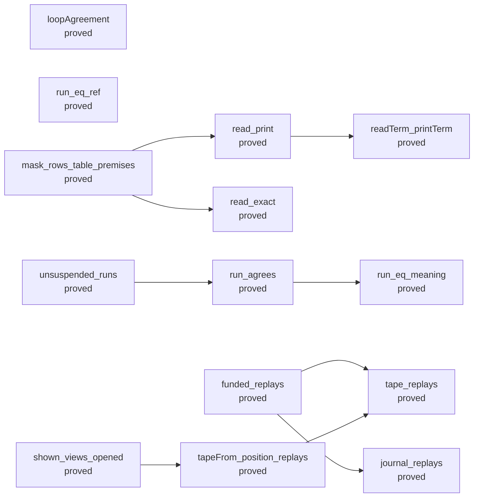

| Node | Status | Rests on | Nearest nodes | Lemmas | Definitions |
| --- | --- | --- | --- | --- | --- |
| `read_print` | proved | — | `readTerm_printTerm` | 346 | 553 |
| `read_exact` | proved | — | — | 249 | 501 |
| `run_eq_meaning` | proved | — | — | 310 | 906 |
| `loopAgreement` | proved | — | — | 339 | 917 |
| `run_eq_ref` | proved | — | — | 880 | 1059 |
| `mask_rows_table_premises` | proved | — | `read_exact`, `read_print` | 124 | 521 |
| `funded_replays` | proved | — | `journal_replays`, `tape_replays` | 71 | 979 |
| `tape_replays` | proved | — | — | 97 | 962 |
| `unsuspended_runs` | proved | — | `run_agrees` | 87 | 863 |
| `shown_views_opened` | proved | — | `tapeFrom_position_replays` | 74 | 1027 |
| `readTerm_printTerm` | proved | — | — | 164 | 205 |
| `journal_replays` | proved | — | — | 77 | 938 |
| `run_agrees` | proved | — | `run_eq_meaning` | 68 | 861 |
| `tapeFrom_position_replays` | proved | — | `tape_replays` | 76 | 961 |

### R9: Never goes wrong: M7a–c on M7Fragment (the empty host table, answer-free tapes)

- Open: part two: a saved frame transports missingService across a change in the requirement row (decisions row 117)

```mermaid
flowchart LR
  n0["m7_proved<br/>proved"]
  n1["m7_admitted<br/>proved"]
  n2["decision_preserves<br/>proved"]
  n3["loadsTyped<br/>proved"]
  n4["m7_of_ledger<br/>proved"]
  n5["lawfulSig_of_admitted<br/>proved"]
  n6["fits_subN<br/>proved"]
  n7["order_refl<br/>proved"]
  n8["subN_trans<br/>proved"]
  n9["configTyped_frame<br/>proved"]
  n10["fits_mono<br/>proved"]
  n11["hom_eq_cata_ty<br/>proved"]
  n12["wake_preserves<br/>proved"]
  n13["order_trans<br/>proved"]
  n14["mono<br/>proved"]
  n15["close_typed<br/>proved"]
  n16["registrationDone_preserves<br/>proved"]
  n17["launch_preserves<br/>proved"]
  n18["guardBind_typed<br/>proved"]
  n19["deliver_preserves<br/>proved"]
  n20["loop_preserves<br/>proved"]
  n21["driveState_lift<br/>proved"]
  n22["denotesTyped<br/>proved"]
  n23["check_sound<br/>proved"]
  n24["check_complete<br/>proved"]
  n25["admitSig_ok_iff<br/>proved"]
  n26["fits_normalize<br/>proved"]
  n27["completionStrong_await<br/>proved"]
  n28["subN_refl<br/>proved"]
  n29["catchGuard_typed<br/>proved"]
  n30["closeOrder_eq<br/>proved"]
  n31["fits_scope_inv<br/>proved"]
  n32["seq_typed<br/>proved"]
  n33["memoBuild_extension<br/>proved"]
  n34["deferredMake_extension<br/>proved"]
  n35["refMake_extension<br/>proved"]
  n36["listOf_upper<br/>proved"]
  n37["normalize_idem<br/>proved"]
  n38["lift_sound<br/>proved"]
  n39["causeInputError_upper<br/>proved"]
  n40["matchArgsB_sound<br/>proved"]
  n41["fiberTy_upper<br/>proved"]
  n42["matchB_sound<br/>proved"]
  n43["syncRow_typed<br/>proved"]
  n44["errOf_payload<br/>proved"]
  n45["isPayload_of_hasTy_record<br/>proved"]
  n46["allGuard_typed<br/>proved"]
  n47["provideLayerArm<br/>proved"]
  n48["optionTy_upper<br/>proved"]
  n49["onExit_typed<br/>proved"]
  n50["exitOf_upper<br/>proved"]
  n51["list_eliminator<br/>proved"]
  n52["extend_upper<br/>proved"]
  n53["lift_transfer<br/>proved"]
  n54["cause_upper<br/>proved"]
  n55["cause_mono<br/>proved"]
  n56["UnionRule.lift_upper<br/>proved"]
  n57["subN_causeOf_causeUpper<br/>proved"]
  n58["subN_exitOf_causeUpper<br/>proved"]
  n59["extend_eq_some_iff<br/>proved"]
  n60["fiber_eliminator<br/>proved"]
  n61["termMaps_of_typed<br/>proved"]
  n62["handles_of_payloadFieldTy<br/>proved"]
  n63["liftOne_some<br/>proved"]
  n64["option_eliminator<br/>proved"]
  n65["Eliminator.lift_upper<br/>proved"]
  n66["exit_eliminator<br/>proved"]
  n67["subN_list_iff<br/>proved"]
  n68["extend_adjoint<br/>proved"]
  n69["joinAll_keeps<br/>proved"]
  n70["mapM_answer<br/>proved"]
  n71["subN_exitOf_iff<br/>proved"]
  n72["subN_causeOf_iff<br/>proved"]
  n73["le_joinAll<br/>proved"]
  n74["subN_fiberOf_iff<br/>proved"]
  n75["liftOne_eq_some_iff<br/>proved"]
  n76["subN_option_iff<br/>proved"]
  n77["adjoint<br/>proved"]
  n78["foldl_keeps<br/>proved"]
  n79["mapM_cons_eq_some<br/>proved"]
  n80["Eliminator.lift_least<br/>proved"]
  n81["mapM_total<br/>proved"]
  n82["UnionRule.lift_least<br/>proved"]
  n83["mapM_source<br/>proved"]
  n84["joinAll_le<br/>proved"]
  n85["joinAll_all<br/>proved"]
  n86["foldl_all<br/>proved"]
  n0 --> n2
  n0 --> n3
  n0 --> n4
  n1 --> n0
  n1 --> n5
  n2 --> n6
  n2 --> n7
  n2 --> n8
  n2 --> n9
  n2 --> n10
  n2 --> n11
  n2 --> n12
  n2 --> n13
  n2 --> n14
  n2 --> n15
  n2 --> n16
  n2 --> n17
  n2 --> n18
  n2 --> n19
  n2 --> n20
  n2 --> n21
  n3 --> n22
  n3 --> n23
  n3 --> n24
  n4 --> n13
  n4 --> n7
  n5 --> n25
  n6 --> n8
  n6 --> n26
  n9 --> n10
  n9 --> n13
  n9 --> n14
  n9 --> n11
  n12 --> n7
  n12 --> n9
  n12 --> n10
  n12 --> n27
  n12 --> n11
  n14 --> n13
  n16 --> n10
  n16 --> n15
  n16 --> n6
  n16 --> n7
  n17 --> n28
  n17 --> n6
  n17 --> n10
  n17 --> n13
  n17 --> n14
  n17 --> n7
  n18 --> n15
  n19 --> n7
  n19 --> n6
  n19 --> n10
  n19 --> n29
  n19 --> n28
  n19 --> n18
  n19 --> n30
  n19 --> n31
  n19 --> n13
  n19 --> n32
  n19 --> n14
  n19 --> n9
  n19 --> n11
  n19 --> n27
  n19 --> n33
  n19 --> n34
  n19 --> n35
  n19 --> n22
  n19 --> n36
  n19 --> n26
  n19 --> n37
  n19 --> n38
  n19 --> n8
  n19 --> n39
  n19 --> n40
  n19 --> n41
  n19 --> n42
  n19 --> n43
  n19 --> n44
  n19 --> n45
  n19 --> n46
  n19 --> n15
  n19 --> n47
  n19 --> n48
  n19 --> n49
  n19 --> n50
  n20 --> n7
  n20 --> n6
  n20 --> n10
  n20 --> n29
  n20 --> n28
  n20 --> n18
  n20 --> n30
  n20 --> n31
  n20 --> n13
  n20 --> n32
  n20 --> n14
  n20 --> n9
  n20 --> n11
  n20 --> n27
  n20 --> n33
  n20 --> n34
  n20 --> n35
  n20 --> n22
  n20 --> n36
  n20 --> n26
  n20 --> n37
  n20 --> n38
  n20 --> n8
  n20 --> n39
  n20 --> n40
  n20 --> n41
  n20 --> n42
  n20 --> n43
  n20 --> n44
  n20 --> n45
  n20 --> n46
  n20 --> n15
  n20 --> n47
  n20 --> n48
  n20 --> n49
  n20 --> n50
  n22 --> n47
  n22 --> n36
  n22 --> n6
  n22 --> n26
  n22 --> n37
  n22 --> n38
  n22 --> n8
  n22 --> n39
  n22 --> n40
  n22 --> n11
  n22 --> n10
  n22 --> n48
  n22 --> n13
  n22 --> n28
  n22 --> n29
  n22 --> n49
  n22 --> n18
  n22 --> n50
  n22 --> n31
  n22 --> n41
  n22 --> n42
  n22 --> n43
  n22 --> n44
  n22 --> n45
  n22 --> n46
  n26 --> n8
  n26 --> n37
  n27 --> n8
  n29 --> n6
  n29 --> n18
  n32 --> n28
  n32 --> n6
  n32 --> n18
  n36 --> n51
  n36 --> n37
  n36 --> n8
  n36 --> n28
  n36 --> n52
  n38 --> n53
  n39 --> n54
  n39 --> n55
  n39 --> n37
  n39 --> n8
  n39 --> n28
  n39 --> n56
  n39 --> n57
  n39 --> n58
  n39 --> n59
  n41 --> n60
  n41 --> n37
  n41 --> n8
  n41 --> n28
  n41 --> n52
  n43 --> n26
  n43 --> n8
  n43 --> n6
  n43 --> n61
  n43 --> n42
  n43 --> n11
  n43 --> n44
  n43 --> n45
  n43 --> n37
  n43 --> n28
  n45 --> n62
  n46 --> n18
  n47 --> n6
  n47 --> n7
  n47 --> n41
  n47 --> n11
  n47 --> n8
  n47 --> n26
  n47 --> n42
  n47 --> n43
  n47 --> n36
  n47 --> n37
  n47 --> n38
  n47 --> n39
  n47 --> n40
  n47 --> n44
  n47 --> n45
  n47 --> n13
  n47 --> n28
  n47 --> n49
  n47 --> n18
  n47 --> n10
  n47 --> n31
  n47 --> n32
  n47 --> n29
  n48 --> n63
  n48 --> n64
  n48 --> n37
  n48 --> n8
  n48 --> n28
  n48 --> n65
  n49 --> n6
  n49 --> n10
  n49 --> n29
  n49 --> n28
  n49 --> n18
  n49 --> n46
  n50 --> n66
  n50 --> n37
  n50 --> n8
  n50 --> n28
  n50 --> n52
  n51 --> n67
  n51 --> n37
  n51 --> n8
  n51 --> n28
  n52 --> n68
  n53 --> n69
  n53 --> n70
  n54 --> n57
  n54 --> n58
  n55 --> n71
  n55 --> n57
  n55 --> n8
  n55 --> n72
  n56 --> n73
  n56 --> n8
  n56 --> n70
  n58 --> n8
  n58 --> n28
  n58 --> n71
  n60 --> n74
  n60 --> n37
  n60 --> n8
  n60 --> n28
  n61 --> n36
  n61 --> n6
  n61 --> n26
  n61 --> n37
  n61 --> n38
  n61 --> n8
  n61 --> n39
  n61 --> n40
  n61 --> n11
  n61 --> n10
  n63 --> n75
  n64 --> n76
  n64 --> n37
  n64 --> n8
  n64 --> n28
  n65 --> n28
  n65 --> n56
  n66 --> n71
  n66 --> n37
  n66 --> n8
  n66 --> n28
  n68 --> n63
  n68 --> n77
  n68 --> n59
  n69 --> n78
  n70 --> n79
  n73 --> n69
  n77 --> n80
  n77 --> n8
  n77 --> n81
  n77 --> n65
  n80 --> n82
  n81 --> n79
  n82 --> n8
  n82 --> n83
  n82 --> n84
  n83 --> n79
  n84 --> n85
  n85 --> n86
```

| Node | Status | Rests on | Nearest nodes | Lemmas | Definitions |
| --- | --- | --- | --- | --- | --- |
| `m7_proved` | proved | — | `decision_preserves`, `loadsTyped`, `m7_of_ledger` | 0 | 3 |
| `m7_admitted` | proved | — | `m7_proved`, `lawfulSig_of_admitted` | 55 | 408 |
| `decision_preserves` | proved | — | `fits_subN`, `order_refl`, `subN_trans`, `configTyped_frame`, `fits_mono`, `hom_eq_cata_ty`, `wake_preserves`, `order_trans`, `mono`, `close_typed`, `registrationDone_preserves`, `launch_preserves`, `guardBind_typed`, `deliver_preserves`, `loop_preserves`, `driveState_lift` | 1055 | 1562 |
| `loadsTyped` | proved | — | `denotesTyped`, `check_sound`, `check_complete` | 109 | 1197 |
| `m7_of_ledger` | proved | — | `order_trans`, `order_refl` | 922 | 1467 |
| `lawfulSig_of_admitted` | proved | — | `admitSig_ok_iff` | 41 | 148 |
| `fits_subN` | proved | — | `subN_trans`, `fits_normalize` | 247 | 225 |
| `order_refl` | proved | — | — | 57 | 205 |
| `subN_trans` | proved | — | — | 96 | 53 |
| `configTyped_frame` | proved | — | `fits_mono`, `order_trans`, `mono`, `hom_eq_cata_ty` | 337 | 1246 |
| `fits_mono` | proved | — | — | 80 | 235 |
| `hom_eq_cata_ty` | proved | — | — | 28 | 35 |
| `wake_preserves` | proved | — | `order_refl`, `configTyped_frame`, `fits_mono`, `completionStrong_await`, `hom_eq_cata_ty` | 239 | 1389 |
| `order_trans` | proved | — | — | 57 | 206 |
| `mono` | proved | — | `order_trans` | 57 | 271 |
| `close_typed` | proved | — | — | 73 | 653 |
| `registrationDone_preserves` | proved | — | `fits_mono`, `close_typed`, `fits_subN`, `order_refl` | 329 | 1353 |
| `launch_preserves` | proved | — | `subN_refl`, `fits_subN`, `fits_mono`, `order_trans`, `mono`, `order_refl` | 364 | 1372 |
| `guardBind_typed` | proved | — | `close_typed` | 54 | 256 |
| `deliver_preserves` | proved | — | `order_refl`, `fits_subN`, `fits_mono`, `catchGuard_typed`, `subN_refl`, `guardBind_typed`, `closeOrder_eq`, `fits_scope_inv`, `order_trans`, `seq_typed`, `mono`, `configTyped_frame`, `hom_eq_cata_ty`, `completionStrong_await`, `memoBuild_extension`, `deferredMake_extension`, `refMake_extension`, `denotesTyped`, `listOf_upper`, `fits_normalize`, `normalize_idem`, `lift_sound`, `subN_trans`, `causeInputError_upper`, `matchArgsB_sound`, `fiberTy_upper`, `matchB_sound`, `syncRow_typed`, `errOf_payload`, `isPayload_of_hasTy_record`, `allGuard_typed`, `close_typed`, `provideLayerArm`, `optionTy_upper`, `onExit_typed`, `exitOf_upper` | 1987 | 1608 |
| `loop_preserves` | proved | — | `order_refl`, `fits_subN`, `fits_mono`, `catchGuard_typed`, `subN_refl`, `guardBind_typed`, `closeOrder_eq`, `fits_scope_inv`, `order_trans`, `seq_typed`, `mono`, `configTyped_frame`, `hom_eq_cata_ty`, `completionStrong_await`, `memoBuild_extension`, `deferredMake_extension`, `refMake_extension`, `denotesTyped`, `listOf_upper`, `fits_normalize`, `normalize_idem`, `lift_sound`, `subN_trans`, `causeInputError_upper`, `matchArgsB_sound`, `fiberTy_upper`, `matchB_sound`, `syncRow_typed`, `errOf_payload`, `isPayload_of_hasTy_record`, `allGuard_typed`, `close_typed`, `provideLayerArm`, `optionTy_upper`, `onExit_typed`, `exitOf_upper` | 1994 | 1608 |
| `driveState_lift` | proved | — | — | 7 | 170 |
| `denotesTyped` | proved | — | `provideLayerArm`, `listOf_upper`, `fits_subN`, `fits_normalize`, `normalize_idem`, `lift_sound`, `subN_trans`, `causeInputError_upper`, `matchArgsB_sound`, `hom_eq_cata_ty`, `fits_mono`, `optionTy_upper`, `order_trans`, `subN_refl`, `catchGuard_typed`, `onExit_typed`, `guardBind_typed`, `exitOf_upper`, `fits_scope_inv`, `fiberTy_upper`, `matchB_sound`, `syncRow_typed`, `errOf_payload`, `isPayload_of_hasTy_record`, `allGuard_typed` | 780 | 902 |
| `check_sound` | proved | — | — | 136 | 263 |
| `check_complete` | proved | — | — | 69 | 266 |
| `admitSig_ok_iff` | proved | — | — | 44 | 147 |
| `fits_normalize` | proved | — | `subN_trans`, `normalize_idem` | 264 | 225 |
| `completionStrong_await` | proved | — | `subN_trans` | 250 | 238 |
| `subN_refl` | proved | — | — | 38 | 44 |
| `catchGuard_typed` | proved | — | `fits_subN`, `guardBind_typed` | 56 | 246 |
| `closeOrder_eq` | proved | — | — | 0 | 4 |
| `fits_scope_inv` | proved | — | — | 54 | 200 |
| `seq_typed` | proved | — | `subN_refl`, `fits_subN`, `guardBind_typed` | 58 | 249 |
| `memoBuild_extension` | proved | — | — | 111 | 340 |
| `deferredMake_extension` | proved | — | — | 112 | 340 |
| `refMake_extension` | proved | — | — | 113 | 340 |
| `listOf_upper` | proved | — | `list_eliminator`, `normalize_idem`, `subN_trans`, `subN_refl`, `extend_upper` | 122 | 65 |
| `normalize_idem` | proved | — | — | 77 | 51 |
| `lift_sound` | proved | — | `lift_transfer` | 41 | 51 |
| `causeInputError_upper` | proved | — | `cause_upper`, `cause_mono`, `normalize_idem`, `subN_trans`, `subN_refl`, `UnionRule.lift_upper`, `subN_causeOf_causeUpper`, `subN_exitOf_causeUpper`, `extend_eq_some_iff` | 122 | 67 |
| `matchArgsB_sound` | proved | — | — | 38 | 60 |
| `fiberTy_upper` | proved | — | `fiber_eliminator`, `normalize_idem`, `subN_trans`, `subN_refl`, `extend_upper` | 128 | 68 |
| `matchB_sound` | proved | — | — | 39 | 58 |
| `syncRow_typed` | proved | — | `fits_normalize`, `subN_trans`, `fits_subN`, `termMaps_of_typed`, `matchB_sound`, `hom_eq_cata_ty`, `errOf_payload`, `isPayload_of_hasTy_record`, `normalize_idem`, `subN_refl` | 394 | 713 |
| `errOf_payload` | proved | — | — | 8 | 15 |
| `isPayload_of_hasTy_record` | proved | — | `handles_of_payloadFieldTy` | 45 | 132 |
| `allGuard_typed` | proved | — | `guardBind_typed` | 54 | 246 |
| `provideLayerArm` | proved | — | `fits_subN`, `order_refl`, `fiberTy_upper`, `hom_eq_cata_ty`, `subN_trans`, `fits_normalize`, `matchB_sound`, `syncRow_typed`, `listOf_upper`, `normalize_idem`, `lift_sound`, `causeInputError_upper`, `matchArgsB_sound`, `errOf_payload`, `isPayload_of_hasTy_record`, `order_trans`, `subN_refl`, `onExit_typed`, `guardBind_typed`, `fits_mono`, `fits_scope_inv`, `seq_typed`, `catchGuard_typed` | 814 | 944 |
| `optionTy_upper` | proved | — | `liftOne_some`, `option_eliminator`, `normalize_idem`, `subN_trans`, `subN_refl`, `Eliminator.lift_upper` | 122 | 64 |
| `onExit_typed` | proved | — | `fits_subN`, `fits_mono`, `catchGuard_typed`, `subN_refl`, `guardBind_typed`, `allGuard_typed` | 90 | 680 |
| `exitOf_upper` | proved | — | `exit_eliminator`, `normalize_idem`, `subN_trans`, `subN_refl`, `extend_upper` | 128 | 68 |
| `list_eliminator` | proved | — | `subN_list_iff`, `normalize_idem`, `subN_trans`, `subN_refl` | 139 | 65 |
| `extend_upper` | proved | — | `extend_adjoint` | 38 | 52 |
| `lift_transfer` | proved | — | `joinAll_keeps`, `mapM_answer` | 62 | 55 |
| `cause_upper` | proved | — | `subN_causeOf_causeUpper`, `subN_exitOf_causeUpper` | 37 | 48 |
| `cause_mono` | proved | — | `subN_exitOf_iff`, `subN_causeOf_causeUpper`, `subN_trans`, `subN_causeOf_iff` | 118 | 56 |
| `UnionRule.lift_upper` | proved | — | `le_joinAll`, `subN_trans`, `mapM_answer` | 140 | 64 |
| `subN_causeOf_causeUpper` | proved | — | — | 117 | 54 |
| `subN_exitOf_causeUpper` | proved | — | `subN_trans`, `subN_refl`, `subN_exitOf_iff` | 117 | 56 |
| `extend_eq_some_iff` | proved | — | — | 37 | 50 |
| `fiber_eliminator` | proved | — | `subN_fiberOf_iff`, `normalize_idem`, `subN_trans`, `subN_refl` | 145 | 67 |
| `termMaps_of_typed` | proved | — | `listOf_upper`, `fits_subN`, `fits_normalize`, `normalize_idem`, `lift_sound`, `subN_trans`, `causeInputError_upper`, `matchArgsB_sound`, `hom_eq_cata_ty`, `fits_mono` | 451 | 434 |
| `handles_of_payloadFieldTy` | proved | — | — | 44 | 135 |
| `liftOne_some` | proved | — | `liftOne_eq_some_iff` | 37 | 49 |
| `option_eliminator` | proved | — | `subN_option_iff`, `normalize_idem`, `subN_trans`, `subN_refl` | 139 | 65 |
| `Eliminator.lift_upper` | proved | — | `subN_refl`, `UnionRule.lift_upper` | 39 | 51 |
| `exit_eliminator` | proved | — | `subN_exitOf_iff`, `normalize_idem`, `subN_trans`, `subN_refl` | 145 | 67 |
| `subN_list_iff` | proved | — | — | 43 | 48 |
| `extend_adjoint` | proved | — | `liftOne_some`, `adjoint`, `extend_eq_some_iff` | 39 | 52 |
| `joinAll_keeps` | proved | — | `foldl_keeps` | 0 | 2 |
| `mapM_answer` | proved | — | `mapM_cons_eq_some` | 0 | 0 |
| `subN_exitOf_iff` | proved | — | — | 43 | 48 |
| `subN_causeOf_iff` | proved | — | — | 43 | 48 |
| `le_joinAll` | proved | — | `joinAll_keeps` | 4 | 2 |
| `subN_fiberOf_iff` | proved | — | — | 43 | 48 |
| `liftOne_eq_some_iff` | proved | — | — | 37 | 49 |
| `subN_option_iff` | proved | — | — | 43 | 48 |
| `adjoint` | proved | — | `Eliminator.lift_least`, `subN_trans`, `mapM_total`, `Eliminator.lift_upper` | 84 | 57 |
| `foldl_keeps` | proved | — | — | 0 | 1 |
| `mapM_cons_eq_some` | proved | — | — | 0 | 0 |
| `Eliminator.lift_least` | proved | — | `UnionRule.lift_least` | 39 | 51 |
| `mapM_total` | proved | — | `mapM_cons_eq_some` | 0 | 0 |
| `UnionRule.lift_least` | proved | — | `subN_trans`, `mapM_source`, `joinAll_le` | 82 | 57 |
| `mapM_source` | proved | — | `mapM_cons_eq_some` | 0 | 0 |
| `joinAll_le` | proved | — | `joinAll_all` | 2 | 3 |
| `joinAll_all` | proved | — | `foldl_all` | 0 | 2 |
| `foldl_all` | proved | — | — | 0 | 1 |

### R10: Library code inherits theorems: a composed module's law is Agrees profile module expansion

- Open: pool-expansion-agrees (proposed claim; translation-simulation): Pool's expansion agrees with the first profile's public observation, under its premises on the callers, interruption, the close and the work budget; its parts on one atomic step are pool_steps_agree and the eleven attempt statements of the operations, each on every model state (lease_attempt, withdraw_attempt, return_attempt, select_attempt, close_attempt, drain_attempt, make_makes, and four at the names that the operation mints; the lease, the withdrawal and the closer's step take an injective table); the operations, the wake, the close and the refusal at a closed pool are library programs (src/Effect4/Modules/Pool/Ops.lean); the wrapper's run for the borrower and for the closer, the wake across helpers and the protected lease's run are not stated; finite controls: ten cases on the Lean machine, on the generated engine and on rc.112, one schedule each (Test/Program/PoolPublic.lean) (decisions rows 79, 226, 267 to 269, 276, 279)
- Open: a composed module's law, Agrees profile module expansion (decisions row 79, R79.5; DI-89)
- Open: no form has a behaviour law (DI-89)
- Open: the agreement half of mask-printed-form-profile (translation-simulation, serving R10 and R11): the compiled derived form against the named release's printed form, equal observation on a named observation under compatible decisions; the three operations more than the native mask are measured on the machine and on the target, not proved, and the cuts at the two checkpoints on the pin rest on Codex's runs; the expansion, the typing, the readability and the two checkpoints on the machine are mask_printed_form_profile (decisions rows 245, 246); no goal states the agreement
- Open: none of DI-89's named forms exists: retry, catchTag, forEach, all, Schedule over iterate, the option and result eliminators
- Open: per form: reader admission, a readable expansion (C8) and a stable identity (DI-89; the model probe's D9, unruled)
- Open: DI-39's six rows not landed
- Open: a composite's contract by a stuttering route (post-Phase C §11.4)
- Open: queue-expansion-agrees (proposed claim; translation-simulation): the Queue's expansion agrees with its application-signature clients on the Queue's profile, which defines the public requests, commits, replies, interruptions and terminations before it hides a private cell or a helper identity (decisions rows 79, 219 to 222, 230); its first application on one program is two planned goals, held_within_fed and fed_accounted (Test/Dogfood/Scenario/QueueWorkers.lean), with finite controls on the Lean machine, three engine runs and 25 host runs; no law of a whole run
- Open: semaphore-expansion-agrees (proposed claim; translation-simulation): Semaphore's expansion agrees with the first profile's public observation; it keeps the selected identities and the permit commits, with its premises on the wake's policy, the admitted callers, interruption and the work budget; its parts on one atomic step are semaphore-steps-agree and the nine attempt statements of the operations, each on every model state; the operations, the walk and the protected form are library programs (src/Effect4/Modules/Semaphore/Ops.lean); the wrapper's run, the walk across visits and the protected form's run are not stated (decisions rows 79, 226, 259 to 261, 276)
- Open: posted-wake-profile-agrees (proposed claim; translation-simulation): one producer's posted delivery, with its dispatch owner, priority, receiver and token, capture time, coalescing and cancellation, agrees with its module expansion; the Queue's producer is first (decisions rows 81, 220, 225; DB-13)
- Open: atomic-attempt-agreement (proposed claim; translation-simulation): the restricted transaction profile against the named release, with flat nesting, immutable payloads and explicit retry; then tx-choice-rollback-union for the retry-only alternative (decisions rows 80, 84, 223, 224)
- Open: fair composition of tickets that are enrolled apart is outside the first profile: the opposing-ticket cycle stays a refused case until an enrolment protocol resolves it (decisions row 223)

```mermaid
flowchart LR
  n0["andThenEffect_typed<br/>proved"]
  n1["andThenContinuation_typed<br/>proved"]
  n2["andThenThunk_typed<br/>proved"]
  n3["as_typed<br/>proved"]
  n4["asVoid_typed<br/>proved"]
  n5["tapContinuation_typed<br/>proved"]
  n6["tapEffect_typed<br/>proved"]
  n7["ensuring_typed<br/>proved"]
  n8["void_typed<br/>proved"]
  n9["die_typed<br/>proved"]
  n10["yieldKey_typed<br/>proved"]
  n11["matchCause_typed<br/>proved"]
  n12["matchCauseEffect_typed<br/>proved"]
  n13["yieldNow_typed<br/>proved"]
  n14["forkChildDefault_typed<br/>proved"]
  n15["forkDetachDefault_typed<br/>proved"]
  n16["forkInDefault_typed<br/>proved"]
  n17["forkScopedDefault_typed<br/>proved"]
  n18["releaseOne_typed<br/>proved"]
  n19["mask_printed_form_profile<br/>proved"]
  n20["cell_read<br/>proved"]
  n21["reads_ascribe<br/>proved"]
  n22["step_updates<br/>proved"]
  n23["closeStep_agrees<br/>proved"]
  n24["drainStep_agrees<br/>proved"]
  n25["leaseStep_agrees<br/>proved"]
  n26["pool_steps_agree<br/>proved"]
  n27["returnStep_agrees<br/>proved"]
  n28["selectStep_agrees<br/>proved"]
  n29["Pool.Model.withdrawStep_agrees<br/>proved"]
  n30["close_attempt<br/>proved"]
  n31["drain_attempt<br/>proved"]
  n32["drain_attempt_minted<br/>proved"]
  n33["lease_attempt<br/>proved"]
  n34["lease_attempt_minted<br/>proved"]
  n35["Pool.make_makes<br/>proved"]
  n36["return_attempt<br/>proved"]
  n37["return_attempt_minted<br/>proved"]
  n38["select_attempt<br/>proved"]
  n39["withdraw_attempt<br/>proved"]
  n40["withdraw_attempt_minted<br/>proved"]
  n41["tagHit_record<br/>proved"]
  n42["acceptLoop_length_le<br/>proved"]
  n43["first_profile_closed<br/>proved"]
  n44["offerStep_agrees<br/>proved"]
  n45["pollStep_agrees<br/>proved"]
  n46["positive_suspend_step_capacity<br/>proved"]
  n47["queue_steps_agree<br/>proved"]
  n48["sizeStep_agrees<br/>proved"]
  n49["Queue.Model.takeStep_agrees<br/>proved"]
  n50["withdrawOffer_agrees<br/>proved"]
  n51["withdrawTake_agrees<br/>proved"]
  n52["bounded_makes<br/>proved"]
  n53["offer_attempt<br/>proved"]
  n54["offer_attempt_minted<br/>proved"]
  n55["offer_withdrawal<br/>proved"]
  n56["offer_withdrawal_minted<br/>proved"]
  n57["poll_attempt<br/>proved"]
  n58["size_read<br/>proved"]
  n59["Queue.take_attempt<br/>proved"]
  n60["Queue.take_attempt_minted<br/>proved"]
  n61["Queue.take_withdrawal<br/>proved"]
  n62["Queue.take_withdrawal_minted<br/>proved"]
  n63["releaseStep_agrees<br/>proved"]
  n64["semaphore_steps_agree<br/>proved"]
  n65["takeIfAvailableStep_agrees<br/>proved"]
  n66["Semaphore.Model.takeStep_agrees<br/>proved"]
  n67["visitStep_agrees<br/>proved"]
  n68["Semaphore.Model.withdrawStep_agrees<br/>proved"]
  n69["Semaphore.make_makes<br/>proved"]
  n70["release_attempt<br/>proved"]
  n71["takeIfAvailable_attempt<br/>proved"]
  n72["Semaphore.take_attempt<br/>proved"]
  n73["Semaphore.take_attempt_minted<br/>proved"]
  n74["Semaphore.take_withdrawal<br/>proved"]
  n75["Semaphore.take_withdrawal_minted<br/>proved"]
  n76["visit_attempt<br/>proved"]
  n77["visit_attempt_minted<br/>proved"]
  n78["held_within_fed<br/>goal"]
  n79["queueWorkers<br/>modulo"]
  n80["infrastructure_escapes<br/>goal"]
  n81["routing<br/>modulo"]
  n82["tagIs_pair<br/>proved"]
  n83["retries_declared<br/>goal"]
  n84["check_sound<br/>proved"]
  n85["check_complete<br/>proved"]
  n86["normalize_idem<br/>proved"]
  n87["saved_mask_restoration<br/>proved"]
  n88["read_print<br/>proved"]
  n89["step_keeps_cell<br/>proved"]
  n90["closeStep_types<br/>proved"]
  n91["drainStep_types<br/>proved"]
  n92["leaseStep_types<br/>proved"]
  n93["returnStep_types<br/>proved"]
  n94["lift_member<br/>proved"]
  n95["selectStep_types<br/>proved"]
  n96["Pool.Model.withdrawStep_types<br/>proved"]
  n97["offerStep_types<br/>proved"]
  n98["withdrawOffer_types<br/>proved"]
  n99["pollStep_types<br/>proved"]
  n100["Queue.Model.takeStep_types<br/>proved"]
  n101["withdrawTake_types<br/>proved"]
  n102["releaseStep_types<br/>proved"]
  n103["takeIfAvailableStep_types<br/>proved"]
  n104["Semaphore.Model.takeStep_types<br/>proved"]
  n105["Semaphore.Model.withdrawStep_types<br/>proved"]
  n106["visitStep_types<br/>proved"]
  n107["checkInput_eq_none_iff<br/>proved"]
  n108["releases_once<br/>goal"]
  n109["queue_settled<br/>goal"]
  n110["fed_accounted<br/>goal"]
  n111["control_retires<br/>proved"]
  n112["applied_selects<br/>proved"]
  n113["receipt_inert<br/>proved"]
  n114["unauthorized_calls_nothing<br/>goal"]
  n115["readTerm_printTerm<br/>proved"]
  n116["fold_typed_atomic_update<br/>proved"]
  n117["subN_refl<br/>proved"]
  n118["order_refl<br/>proved"]
  n119["termMaps_of_typed<br/>proved"]
  n120["listOf_upper<br/>proved"]
  n121["fits_subN<br/>proved"]
  n122["fits_normalize<br/>proved"]
  n123["lift_sound<br/>proved"]
  n124["subN_trans<br/>proved"]
  n125["causeInputError_upper<br/>proved"]
  n126["matchArgsB_sound<br/>proved"]
  n127["hom_eq_cata_ty<br/>proved"]
  n128["fits_mono<br/>proved"]
  n129["list_eliminator<br/>proved"]
  n130["extend_upper<br/>proved"]
  n131["lift_transfer<br/>proved"]
  n132["cause_upper<br/>proved"]
  n133["cause_mono<br/>proved"]
  n134["UnionRule.lift_upper<br/>proved"]
  n135["subN_causeOf_causeUpper<br/>proved"]
  n136["subN_exitOf_causeUpper<br/>proved"]
  n137["extend_eq_some_iff<br/>proved"]
  n138["subN_list_iff<br/>proved"]
  n139["extend_adjoint<br/>proved"]
  n140["joinAll_keeps<br/>proved"]
  n141["mapM_answer<br/>proved"]
  n142["subN_exitOf_iff<br/>proved"]
  n143["subN_causeOf_iff<br/>proved"]
  n144["le_joinAll<br/>proved"]
  n145["liftOne_some<br/>proved"]
  n146["adjoint<br/>proved"]
  n147["foldl_keeps<br/>proved"]
  n148["mapM_cons_eq_some<br/>proved"]
  n149["liftOne_eq_some_iff<br/>proved"]
  n150["Eliminator.lift_least<br/>proved"]
  n151["mapM_total<br/>proved"]
  n152["Eliminator.lift_upper<br/>proved"]
  n153["UnionRule.lift_least<br/>proved"]
  n154["mapM_source<br/>proved"]
  n155["joinAll_le<br/>proved"]
  n156["joinAll_all<br/>proved"]
  n157["foldl_all<br/>proved"]
  n0 --> n84
  n0 --> n85
  n1 --> n84
  n1 --> n85
  n2 --> n0
  n3 --> n84
  n3 --> n85
  n4 --> n3
  n5 --> n86
  n5 --> n84
  n5 --> n85
  n6 --> n86
  n6 --> n84
  n6 --> n85
  n7 --> n84
  n7 --> n85
  n8 --> n85
  n8 --> n84
  n9 --> n85
  n9 --> n84
  n10 --> n85
  n10 --> n84
  n11 --> n84
  n11 --> n85
  n12 --> n84
  n12 --> n85
  n13 --> n85
  n13 --> n84
  n14 --> n84
  n14 --> n85
  n15 --> n84
  n15 --> n85
  n16 --> n84
  n16 --> n85
  n17 --> n84
  n17 --> n85
  n18 --> n84
  n18 --> n85
  n19 --> n87
  n19 --> n88
  n19 --> n84
  n19 --> n85
  n26 --> n24
  n26 --> n23
  n26 --> n29
  n26 --> n28
  n26 --> n27
  n26 --> n25
  n30 --> n89
  n30 --> n90
  n30 --> n22
  n30 --> n23
  n31 --> n89
  n31 --> n91
  n31 --> n22
  n31 --> n24
  n32 --> n31
  n33 --> n89
  n33 --> n92
  n33 --> n22
  n33 --> n25
  n34 --> n33
  n36 --> n89
  n36 --> n93
  n36 --> n22
  n36 --> n27
  n37 --> n94
  n37 --> n86
  n37 --> n36
  n38 --> n89
  n38 --> n95
  n38 --> n22
  n38 --> n28
  n39 --> n89
  n39 --> n96
  n39 --> n22
  n39 --> n29
  n40 --> n39
  n46 --> n42
  n47 --> n50
  n47 --> n51
  n47 --> n48
  n47 --> n45
  n47 --> n44
  n47 --> n49
  n53 --> n89
  n53 --> n97
  n53 --> n22
  n53 --> n44
  n54 --> n53
  n55 --> n89
  n55 --> n98
  n55 --> n22
  n55 --> n50
  n56 --> n55
  n57 --> n89
  n57 --> n99
  n57 --> n22
  n57 --> n45
  n58 --> n48
  n58 --> n20
  n59 --> n89
  n59 --> n100
  n59 --> n22
  n59 --> n49
  n60 --> n59
  n61 --> n89
  n61 --> n101
  n61 --> n22
  n61 --> n51
  n62 --> n61
  n64 --> n68
  n64 --> n67
  n64 --> n63
  n64 --> n65
  n64 --> n66
  n70 --> n89
  n70 --> n102
  n70 --> n22
  n70 --> n63
  n71 --> n89
  n71 --> n103
  n71 --> n22
  n71 --> n65
  n72 --> n89
  n72 --> n104
  n72 --> n22
  n72 --> n66
  n73 --> n72
  n74 --> n89
  n74 --> n105
  n74 --> n22
  n74 --> n68
  n75 --> n74
  n76 --> n89
  n76 --> n106
  n76 --> n22
  n76 --> n67
  n77 --> n76
  n78 --> n107
  n79 --> n108
  n79 --> n109
  n79 --> n110
  n79 --> n78
  n79 --> n111
  n79 --> n112
  n79 --> n113
  n79 --> n107
  n80 --> n107
  n81 --> n114
  n81 --> n80
  n81 --> n82
  n81 --> n107
  n83 --> n107
  n88 --> n115
  n89 --> n116
  n90 --> n86
  n90 --> n94
  n91 --> n117
  n91 --> n94
  n91 --> n86
  n92 --> n94
  n92 --> n86
  n92 --> n117
  n93 --> n117
  n93 --> n94
  n93 --> n86
  n95 --> n86
  n95 --> n94
  n96 --> n94
  n96 --> n86
  n96 --> n117
  n97 --> n86
  n97 --> n117
  n97 --> n94
  n98 --> n86
  n98 --> n94
  n98 --> n117
  n99 --> n86
  n99 --> n117
  n99 --> n94
  n100 --> n86
  n100 --> n117
  n100 --> n94
  n101 --> n86
  n101 --> n94
  n101 --> n117
  n102 --> n86
  n102 --> n94
  n103 --> n94
  n103 --> n86
  n103 --> n117
  n104 --> n94
  n104 --> n86
  n104 --> n117
  n105 --> n94
  n105 --> n86
  n105 --> n117
  n106 --> n117
  n106 --> n94
  n106 --> n86
  n108 --> n107
  n109 --> n107
  n110 --> n107
  n114 --> n107
  n116 --> n115
  n116 --> n118
  n116 --> n119
  n116 --> n120
  n116 --> n121
  n116 --> n122
  n116 --> n86
  n116 --> n123
  n116 --> n124
  n116 --> n125
  n116 --> n126
  n116 --> n127
  n119 --> n120
  n119 --> n121
  n119 --> n122
  n119 --> n86
  n119 --> n123
  n119 --> n124
  n119 --> n125
  n119 --> n126
  n119 --> n127
  n119 --> n128
  n120 --> n129
  n120 --> n86
  n120 --> n124
  n120 --> n117
  n120 --> n130
  n121 --> n124
  n121 --> n122
  n122 --> n124
  n122 --> n86
  n123 --> n131
  n125 --> n132
  n125 --> n133
  n125 --> n86
  n125 --> n124
  n125 --> n117
  n125 --> n134
  n125 --> n135
  n125 --> n136
  n125 --> n137
  n129 --> n138
  n129 --> n86
  n129 --> n124
  n129 --> n117
  n130 --> n139
  n131 --> n140
  n131 --> n141
  n132 --> n135
  n132 --> n136
  n133 --> n142
  n133 --> n135
  n133 --> n124
  n133 --> n143
  n134 --> n144
  n134 --> n124
  n134 --> n141
  n136 --> n124
  n136 --> n117
  n136 --> n142
  n139 --> n145
  n139 --> n146
  n139 --> n137
  n140 --> n147
  n141 --> n148
  n144 --> n140
  n145 --> n149
  n146 --> n150
  n146 --> n124
  n146 --> n151
  n146 --> n152
  n150 --> n153
  n151 --> n148
  n152 --> n117
  n152 --> n134
  n153 --> n124
  n153 --> n154
  n153 --> n155
  n154 --> n148
  n155 --> n156
  n156 --> n157
```

| Node | Status | Rests on | Nearest nodes | Lemmas | Definitions |
| --- | --- | --- | --- | --- | --- |
| `andThenEffect_typed` | proved | — | `check_sound`, `check_complete` | 78 | 286 |
| `andThenContinuation_typed` | proved | — | `check_sound`, `check_complete` | 58 | 272 |
| `andThenThunk_typed` | proved | — | `andThenEffect_typed` | 54 | 263 |
| `as_typed` | proved | — | `check_sound`, `check_complete` | 100 | 278 |
| `asVoid_typed` | proved | — | `as_typed` | 54 | 252 |
| `tapContinuation_typed` | proved | — | `normalize_idem`, `check_sound`, `check_complete` | 166 | 285 |
| `tapEffect_typed` | proved | — | `normalize_idem`, `check_sound`, `check_complete` | 185 | 299 |
| `ensuring_typed` | proved | — | `check_sound`, `check_complete` | 78 | 286 |
| `void_typed` | proved | — | `check_complete`, `check_sound` | 58 | 272 |
| `die_typed` | proved | — | `check_complete`, `check_sound` | 58 | 272 |
| `yieldKey_typed` | proved | — | `check_complete`, `check_sound` | 58 | 272 |
| `matchCause_typed` | proved | — | `check_sound`, `check_complete` | 60 | 273 |
| `matchCauseEffect_typed` | proved | — | `check_sound`, `check_complete` | 60 | 273 |
| `yieldNow_typed` | proved | — | `check_complete`, `check_sound` | 58 | 272 |
| `forkChildDefault_typed` | proved | — | `check_sound`, `check_complete` | 60 | 272 |
| `forkDetachDefault_typed` | proved | — | `check_sound`, `check_complete` | 60 | 272 |
| `forkInDefault_typed` | proved | — | `check_sound`, `check_complete` | 60 | 272 |
| `forkScopedDefault_typed` | proved | — | `check_sound`, `check_complete` | 60 | 272 |
| `releaseOne_typed` | proved | — | `check_sound`, `check_complete` | 81 | 286 |
| `mask_printed_form_profile` | proved | — | `saved_mask_restoration`, `read_print`, `check_sound`, `check_complete` | 217 | 888 |
| `cell_read` | proved | — | — | 10 | 200 |
| `reads_ascribe` | proved | — | — | 16 | 108 |
| `step_updates` | proved | — | — | 10 | 210 |
| `closeStep_agrees` | proved | — | — | 30 | 136 |
| `drainStep_agrees` | proved | — | — | 76 | 167 |
| `leaseStep_agrees` | proved | — | — | 106 | 178 |
| `pool_steps_agree` | proved | — | `drainStep_agrees`, `closeStep_agrees`, `Pool.Model.withdrawStep_agrees`, `selectStep_agrees`, `returnStep_agrees`, `leaseStep_agrees` | 9 | 198 |
| `returnStep_agrees` | proved | — | — | 81 | 166 |
| `selectStep_agrees` | proved | — | — | 25 | 131 |
| `Pool.Model.withdrawStep_agrees` | proved | — | — | 58 | 158 |
| `close_attempt` | proved | — | `step_keeps_cell`, `closeStep_types`, `step_updates`, `closeStep_agrees` | 64 | 451 |
| `drain_attempt` | proved | — | `step_keeps_cell`, `drainStep_types`, `step_updates`, `drainStep_agrees` | 66 | 465 |
| `drain_attempt_minted` | proved | — | `drain_attempt` | 78 | 356 |
| `lease_attempt` | proved | — | `step_keeps_cell`, `leaseStep_types`, `step_updates`, `leaseStep_agrees` | 72 | 477 |
| `lease_attempt_minted` | proved | — | `lease_attempt` | 78 | 356 |
| `Pool.make_makes` | proved | — | — | 36 | 242 |
| `return_attempt` | proved | — | `step_keeps_cell`, `returnStep_types`, `step_updates`, `returnStep_agrees` | 66 | 468 |
| `return_attempt_minted` | proved | — | `lift_member`, `normalize_idem`, `return_attempt` | 131 | 363 |
| `select_attempt` | proved | — | `step_keeps_cell`, `selectStep_types`, `step_updates`, `selectStep_agrees` | 64 | 446 |
| `withdraw_attempt` | proved | — | `step_keeps_cell`, `Pool.Model.withdrawStep_types`, `step_updates`, `Pool.Model.withdrawStep_agrees` | 66 | 458 |
| `withdraw_attempt_minted` | proved | — | `withdraw_attempt` | 76 | 356 |
| `tagHit_record` | proved | — | — | 47 | 135 |
| `acceptLoop_length_le` | proved | — | — | 0 | 6 |
| `first_profile_closed` | proved | — | — | 29 | 72 |
| `offerStep_agrees` | proved | — | — | 85 | 171 |
| `pollStep_agrees` | proved | — | — | 100 | 185 |
| `positive_suspend_step_capacity` | proved | — | `acceptLoop_length_le` | 17 | 70 |
| `queue_steps_agree` | proved | — | `withdrawOffer_agrees`, `withdrawTake_agrees`, `sizeStep_agrees`, `pollStep_agrees`, `offerStep_agrees`, `Queue.Model.takeStep_agrees` | 10 | 221 |
| `sizeStep_agrees` | proved | — | — | 20 | 131 |
| `Queue.Model.takeStep_agrees` | proved | — | — | 139 | 208 |
| `withdrawOffer_agrees` | proved | — | — | 83 | 174 |
| `withdrawTake_agrees` | proved | — | — | 80 | 174 |
| `bounded_makes` | proved | — | — | 22 | 238 |
| `offer_attempt` | proved | — | `step_keeps_cell`, `offerStep_types`, `step_updates`, `offerStep_agrees` | 65 | 482 |
| `offer_attempt_minted` | proved | — | `offer_attempt` | 78 | 356 |
| `offer_withdrawal` | proved | — | `step_keeps_cell`, `withdrawOffer_types`, `step_updates`, `withdrawOffer_agrees` | 66 | 473 |
| `offer_withdrawal_minted` | proved | — | `offer_withdrawal` | 76 | 356 |
| `poll_attempt` | proved | — | `step_keeps_cell`, `pollStep_types`, `step_updates`, `pollStep_agrees` | 66 | 483 |
| `size_read` | proved | — | `sizeStep_agrees`, `cell_read` | 13 | 238 |
| `Queue.take_attempt` | proved | — | `step_keeps_cell`, `Queue.Model.takeStep_types`, `step_updates`, `Queue.Model.takeStep_agrees` | 66 | 504 |
| `Queue.take_attempt_minted` | proved | — | `Queue.take_attempt` | 76 | 357 |
| `Queue.take_withdrawal` | proved | — | `step_keeps_cell`, `withdrawTake_types`, `step_updates`, `withdrawTake_agrees` | 66 | 473 |
| `Queue.take_withdrawal_minted` | proved | — | `Queue.take_withdrawal` | 76 | 356 |
| `releaseStep_agrees` | proved | — | — | 34 | 132 |
| `semaphore_steps_agree` | proved | — | `Semaphore.Model.withdrawStep_agrees`, `visitStep_agrees`, `releaseStep_agrees`, `takeIfAvailableStep_agrees`, `Semaphore.Model.takeStep_agrees` | 9 | 182 |
| `takeIfAvailableStep_agrees` | proved | — | — | 39 | 134 |
| `Semaphore.Model.takeStep_agrees` | proved | — | — | 85 | 164 |
| `visitStep_agrees` | proved | — | — | 85 | 161 |
| `Semaphore.Model.withdrawStep_agrees` | proved | — | — | 58 | 154 |
| `Semaphore.make_makes` | proved | — | — | 22 | 228 |
| `release_attempt` | proved | — | `step_keeps_cell`, `releaseStep_types`, `step_updates`, `releaseStep_agrees` | 64 | 446 |
| `takeIfAvailable_attempt` | proved | — | `step_keeps_cell`, `takeIfAvailableStep_types`, `step_updates`, `takeIfAvailableStep_agrees` | 64 | 446 |
| `Semaphore.take_attempt` | proved | — | `step_keeps_cell`, `Semaphore.Model.takeStep_types`, `step_updates`, `Semaphore.Model.takeStep_agrees` | 66 | 461 |
| `Semaphore.take_attempt_minted` | proved | — | `Semaphore.take_attempt` | 78 | 351 |
| `Semaphore.take_withdrawal` | proved | — | `step_keeps_cell`, `Semaphore.Model.withdrawStep_types`, `step_updates`, `Semaphore.Model.withdrawStep_agrees` | 66 | 453 |
| `Semaphore.take_withdrawal_minted` | proved | — | `Semaphore.take_withdrawal` | 76 | 351 |
| `visit_attempt` | proved | — | `step_keeps_cell`, `visitStep_types`, `step_updates`, `visitStep_agrees` | 72 | 462 |
| `visit_attempt_minted` | proved | — | `visit_attempt` | 97 | 358 |
| `held_within_fed` | goal | `held_within_fed` | `checkInput_eq_none_iff` | 87 | 1615 |
| `queueWorkers` | modulo | `fed_accounted`, `held_within_fed`, `queue_settled`, `releases_once` | `releases_once`, `queue_settled`, `fed_accounted`, `held_within_fed`, `control_retires`, `applied_selects`, `receipt_inert`, `checkInput_eq_none_iff` | 87 | 1638 |
| `infrastructure_escapes` | goal | `infrastructure_escapes` | `checkInput_eq_none_iff` | 85 | 1461 |
| `routing` | modulo | `infrastructure_escapes`, `unauthorized_calls_nothing` | `unauthorized_calls_nothing`, `infrastructure_escapes`, `tagIs_pair`, `checkInput_eq_none_iff` | 85 | 1463 |
| `tagIs_pair` | proved | — | — | 8 | 86 |
| `retries_declared` | goal | `retries_declared` | `checkInput_eq_none_iff` | 85 | 1476 |
| `check_sound` | proved | — | — | 136 | 263 |
| `check_complete` | proved | — | — | 69 | 266 |
| `normalize_idem` | proved | — | — | 77 | 51 |
| `saved_mask_restoration` | proved | — | — | 99 | 753 |
| `read_print` | proved | — | `readTerm_printTerm` | 346 | 553 |
| `step_keeps_cell` | proved | — | `fold_typed_atomic_update` | 57 | 402 |
| `closeStep_types` | proved | — | `normalize_idem`, `lift_member` | 156 | 157 |
| `drainStep_types` | proved | — | `subN_refl`, `lift_member`, `normalize_idem` | 302 | 188 |
| `leaseStep_types` | proved | — | `lift_member`, `normalize_idem`, `subN_refl` | 341 | 195 |
| `returnStep_types` | proved | — | `subN_refl`, `lift_member`, `normalize_idem` | 313 | 192 |
| `lift_member` | proved | — | — | 62 | 54 |
| `selectStep_types` | proved | — | `normalize_idem`, `lift_member` | 126 | 151 |
| `Pool.Model.withdrawStep_types` | proved | — | `lift_member`, `normalize_idem`, `subN_refl` | 284 | 183 |
| `offerStep_types` | proved | — | `normalize_idem`, `subN_refl`, `lift_member` | 309 | 177 |
| `withdrawOffer_types` | proved | — | `normalize_idem`, `lift_member`, `subN_refl` | 295 | 187 |
| `pollStep_types` | proved | — | `normalize_idem`, `subN_refl`, `lift_member` | 317 | 190 |
| `Queue.Model.takeStep_types` | proved | — | `normalize_idem`, `subN_refl`, `lift_member` | 352 | 204 |
| `withdrawTake_types` | proved | — | `normalize_idem`, `lift_member`, `subN_refl` | 293 | 187 |
| `releaseStep_types` | proved | — | `normalize_idem`, `lift_member` | 158 | 155 |
| `takeIfAvailableStep_types` | proved | — | `lift_member`, `normalize_idem`, `subN_refl` | 257 | 164 |
| `Semaphore.Model.takeStep_types` | proved | — | `lift_member`, `normalize_idem`, `subN_refl` | 314 | 188 |
| `Semaphore.Model.withdrawStep_types` | proved | — | `lift_member`, `normalize_idem`, `subN_refl` | 282 | 182 |
| `visitStep_types` | proved | — | `subN_refl`, `lift_member`, `normalize_idem` | 310 | 188 |
| `checkInput_eq_none_iff` | proved | — | — | 38 | 100 |
| `releases_once` | goal | `releases_once` | `checkInput_eq_none_iff` | 87 | 1606 |
| `queue_settled` | goal | `queue_settled` | `checkInput_eq_none_iff` | 87 | 1622 |
| `fed_accounted` | goal | `fed_accounted` | `checkInput_eq_none_iff` | 87 | 1622 |
| `control_retires` | proved | — | — | 69 | 858 |
| `applied_selects` | proved | — | — | 69 | 897 |
| `receipt_inert` | proved | — | — | 77 | 951 |
| `unauthorized_calls_nothing` | goal | `unauthorized_calls_nothing` | `checkInput_eq_none_iff` | 85 | 1453 |
| `readTerm_printTerm` | proved | — | — | 164 | 205 |
| `fold_typed_atomic_update` | proved | — | `readTerm_printTerm`, `order_refl`, `termMaps_of_typed`, `listOf_upper`, `fits_subN`, `fits_normalize`, `normalize_idem`, `lift_sound`, `subN_trans`, `causeInputError_upper`, `matchArgsB_sound`, `hom_eq_cata_ty` | 550 | 668 |
| `subN_refl` | proved | — | — | 38 | 44 |
| `order_refl` | proved | — | — | 57 | 205 |
| `termMaps_of_typed` | proved | — | `listOf_upper`, `fits_subN`, `fits_normalize`, `normalize_idem`, `lift_sound`, `subN_trans`, `causeInputError_upper`, `matchArgsB_sound`, `hom_eq_cata_ty`, `fits_mono` | 451 | 434 |
| `listOf_upper` | proved | — | `list_eliminator`, `normalize_idem`, `subN_trans`, `subN_refl`, `extend_upper` | 122 | 65 |
| `fits_subN` | proved | — | `subN_trans`, `fits_normalize` | 247 | 225 |
| `fits_normalize` | proved | — | `subN_trans`, `normalize_idem` | 264 | 225 |
| `lift_sound` | proved | — | `lift_transfer` | 41 | 51 |
| `subN_trans` | proved | — | — | 96 | 53 |
| `causeInputError_upper` | proved | — | `cause_upper`, `cause_mono`, `normalize_idem`, `subN_trans`, `subN_refl`, `UnionRule.lift_upper`, `subN_causeOf_causeUpper`, `subN_exitOf_causeUpper`, `extend_eq_some_iff` | 122 | 67 |
| `matchArgsB_sound` | proved | — | — | 38 | 60 |
| `hom_eq_cata_ty` | proved | — | — | 28 | 35 |
| `fits_mono` | proved | — | — | 80 | 235 |
| `list_eliminator` | proved | — | `subN_list_iff`, `normalize_idem`, `subN_trans`, `subN_refl` | 139 | 65 |
| `extend_upper` | proved | — | `extend_adjoint` | 38 | 52 |
| `lift_transfer` | proved | — | `joinAll_keeps`, `mapM_answer` | 62 | 55 |
| `cause_upper` | proved | — | `subN_causeOf_causeUpper`, `subN_exitOf_causeUpper` | 37 | 48 |
| `cause_mono` | proved | — | `subN_exitOf_iff`, `subN_causeOf_causeUpper`, `subN_trans`, `subN_causeOf_iff` | 118 | 56 |
| `UnionRule.lift_upper` | proved | — | `le_joinAll`, `subN_trans`, `mapM_answer` | 140 | 64 |
| `subN_causeOf_causeUpper` | proved | — | — | 117 | 54 |
| `subN_exitOf_causeUpper` | proved | — | `subN_trans`, `subN_refl`, `subN_exitOf_iff` | 117 | 56 |
| `extend_eq_some_iff` | proved | — | — | 37 | 50 |
| `subN_list_iff` | proved | — | — | 43 | 48 |
| `extend_adjoint` | proved | — | `liftOne_some`, `adjoint`, `extend_eq_some_iff` | 39 | 52 |
| `joinAll_keeps` | proved | — | `foldl_keeps` | 0 | 2 |
| `mapM_answer` | proved | — | `mapM_cons_eq_some` | 0 | 0 |
| `subN_exitOf_iff` | proved | — | — | 43 | 48 |
| `subN_causeOf_iff` | proved | — | — | 43 | 48 |
| `le_joinAll` | proved | — | `joinAll_keeps` | 4 | 2 |
| `liftOne_some` | proved | — | `liftOne_eq_some_iff` | 37 | 49 |
| `adjoint` | proved | — | `Eliminator.lift_least`, `subN_trans`, `mapM_total`, `Eliminator.lift_upper` | 84 | 57 |
| `foldl_keeps` | proved | — | — | 0 | 1 |
| `mapM_cons_eq_some` | proved | — | — | 0 | 0 |
| `liftOne_eq_some_iff` | proved | — | — | 37 | 49 |
| `Eliminator.lift_least` | proved | — | `UnionRule.lift_least` | 39 | 51 |
| `mapM_total` | proved | — | `mapM_cons_eq_some` | 0 | 0 |
| `Eliminator.lift_upper` | proved | — | `subN_refl`, `UnionRule.lift_upper` | 39 | 51 |
| `UnionRule.lift_least` | proved | — | `subN_trans`, `mapM_source`, `joinAll_le` | 82 | 57 |
| `mapM_source` | proved | — | `mapM_cons_eq_some` | 0 | 0 |
| `joinAll_le` | proved | — | `joinAll_all` | 2 | 3 |
| `joinAll_all` | proved | — | `foldl_all` | 0 | 2 |
| `foldl_all` | proved | — | — | 0 | 1 |

### R11: Resources are released: at most once per registration, exactly once in close order

- Open: pool-lease-return and pool-close-waits (proposed claims; scope-lifetime-finalization): a committed lease returns its item at most once, and exactly once where its exit ended; a lease that is refused at a closing pool commits nothing; the close ends only after every lease returned, and each item is then finalized once; the model's facts are giveBack_front, giveBack_once, close_refuses and drain_waits; the forms are stated, scoped and typed: use is the protected form over the lease's loop and the return, and the close is the wrapper over the closer's step, registered by make after the acquisitions (use_types, close_answers, make_types); their steps are return_attempt, close_attempt and drain_attempt; no goal states a clause, and each waits for the carrying fact of a region and for a finalizer's law of a run; finite controls: a lease in its own mask is lost under an interruption, a wait inside a mask of the form's making cannot be interrupted, the stand-in for the mask fails under a masked caller, and a close that does not wait finalizes an item that a borrower still holds (Test/Program/PoolTraces.lean, traces 4, 5 and 8; Test/Program/PoolPublic.lean, PP7) (decisions rows 222, 267, 268, 276, 279)
- Open: the whole run open: release at most once per registration, counted by identity (DB-07); its planned goals are three, one program each: Workers.releases_once, cleans_once and QueueWorkers.releases_once
- Open: the whole run open: exactly once in close order over closed scopes and structured regions, with a completed-cleanup receipt (DB-07, DI-65)
- Open: state retained at a frontier, open scopes closed only by an explicit abandon (the owner's ruling of 2026-09-07)
- Open: a scope a finished run leaves open is an observation, as in rc.112 (the model probe's D8, unruled per DB-07)
- Open: the carrying fact of a region (scope-lifetime-finalization, serving saved-mask-region-bracket): the stack shape above ++ below is kept along the fiber machine's evaluator arms and commands while the fiber is inside the region, until the command that ends it; the bracket takes the shape as a premise at the later cut; its statement elaborates and a finite probe on eight runs finds no counterexample (docs/research/2026-10-06-seat-BRACKET-carry.lean.txt); the frame machine's own step keeps the shape (step_under); no goal states it
- Open: semaphore-protected-permit (proposed claim; scope-lifetime-finalization): across every prefix of a run a committed activation of Semaphore's protected form releases at most once; an activation whose exit has completed through its cleanup has released exactly once, with enough work for the cleanup or a retained frontier; while the cleanup has not completed, the release obligation stays in the observation, and a frontier is no completed exit; the form is one mask over the take's loop, the hook and the body at the restore site (protectedBy), scoped and typed (protectedBy_has, withPermits_types); no goal states a clause, and each waits for the carrying fact of a region; finite controls: a take in its own mask loses its permit under an interruption, a wait inside a mask of the form's making cannot be interrupted, and the stand-in for the mask fails under a masked caller (Test/Program/SemaphoreTraces.lean, traces 4, 5 and 8); Pool's lease is the second user (decisions rows 222, 259, 276)
- Open: waiting-request-obligation-preserved (proposed claim; reactive-scheduling, serving R10 to R12): a selected request's notification stays in store debt, queued commands, dispatcher work or the receiver's accepted continuation until it is discharged; when cancellation wins and withdraws the request before consumption, the operation consumes nothing; a completed commit stays committed, even when the caller is interrupted before its continuation; an interruption that is only requested, and stays pending under a mask, withdraws nothing; an old token is inert after rearming (decisions rows 221, 222); the Queue model's half of its first clause is proved on the first profile (queue-first-step-invariant), and the wrapper's run stays open

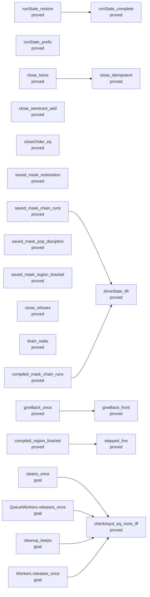

| Node | Status | Rests on | Nearest nodes | Lemmas | Definitions |
| --- | --- | --- | --- | --- | --- |
| `runState_complete` | proved | — | — | 0 | 15 |
| `runState_restore` | proved | — | `runState_complete` | 0 | 33 |
| `runState_prefix` | proved | — | — | 0 | 16 |
| `close_twice` | proved | — | `close_idempotent` | 1 | 15 |
| `close_reentrant_add` | proved | — | — | 2 | 11 |
| `closeOrder_eq` | proved | — | — | 0 | 4 |
| `saved_mask_restoration` | proved | — | — | 99 | 753 |
| `saved_mask_chain_runs` | proved | — | `driveState_lift` | 184 | 304 |
| `saved_mask_pop_discipline` | proved | — | — | 35 | 45 |
| `saved_mask_region_bracket` | proved | — | — | 67 | 77 |
| `close_refuses` | proved | — | — | 1 | 14 |
| `drain_waits` | proved | — | — | 5 | 12 |
| `giveBack_front` | proved | — | — | 3 | 12 |
| `giveBack_once` | proved | — | `giveBack_front` | 1 | 12 |
| `compiled_mask_chain_runs` | proved | — | `driveState_lift` | 234 | 836 |
| `compiled_region_bracket` | proved | — | `stepped_live` | 59 | 84 |
| `stepped_live` | proved | — | — | 66 | 573 |
| `cleans_once` | goal | `cleans_once` | `checkInput_eq_none_iff` | 86 | 1476 |
| `QueueWorkers.releases_once` | goal | `QueueWorkers.releases_once` | `checkInput_eq_none_iff` | 87 | 1606 |
| `cleanup_keeps` | goal | `cleanup_keeps` | `checkInput_eq_none_iff` | 85 | 1475 |
| `Workers.releases_once` | goal | `Workers.releases_once` | `checkInput_eq_none_iff` | 85 | 1483 |
| `close_idempotent` | proved | — | — | 1 | 15 |
| `driveState_lift` | proved | — | — | 7 | 170 |
| `checkInput_eq_none_iff` | proved | — | — | 38 | 100 |

### R12: Frontiers name what they await

- Open: pool-wake-selection (proposed claim; reactive-scheduling): the helper selects the first count waiters of the state that it finds, and it notifies exactly those, in order; the model's fact is select_takes_first, and one selection is one store step (select_attempt); the helper is a library program, one selection step and then each selected hint in order; the selection is by count, so the law takes the withdrawal as a premise: every entry of the waiters belongs to a request that still waits; finite controls: a selection at the post serves a waiter that left, and with no withdrawal the wake is lost (Test/Program/PoolPublic.lean, PP4; Test/Program/PoolTraces.lean, trace 2) (decisions rows 221, 267)
- Open: R12-c: liveness on infinite tapes under FairTape (waits on a ruling on infinite tapes)
- Open: stability over the allowed internal decisions, with a named progress observation (not stated)
- Open: divergence by compatible prefixes (DB-03; not stated)
- Open: driver-continuation-split and driver-suspension-keeps-typed (proposed claims; reactive-scheduling, extending drivestate-lift): a retained driver suspension keeps the commands, the remaining dispatcher tasks, the enclosing flush or clock phase and any atomic owner, and continuing it with budgets n and k equals one run with n + k; until then an owned operation runs under a proved embedded budget (decisions rows 84, 226); a finite control: at a reply application the command loop's leftover commands are not kept, and one run then stands at rest with no exit of the root (the run dropped of Test/Dogfood/Scenario/QueueWorkers.lean; one script at seven budgets)
- Open: embedded-budget-sufficient (proposed claim; reactive-scheduling, serving R10 and R12): the embedded budget of an owned operation covers its registration, its cleanup and its selected delivery, so no cut falls inside the operation; a cut inside is excluded and is no resumption (decisions rows 84, 226); no theorem states a sufficient budget; a finite control measures the least fuel of one helper's task at eight lengths of the receiver's continuation, and at one unit less the remaining work is lost and five later flushes do not end the root (Test/Program/QueueTraces.lean, Test/Program/SemaphoreTraces.lean and Test/Program/PoolTraces.lean, trace 7 of each; Pool's measures seven lengths); no bound is claimed; at a run the premise has one name, funded (src/Effect4/Run/Tape.lean), and funded_replays says what it gives; a journal's verdicts do not decide it
- Open: wait-registration-no-gap (proposed claim; reactive-scheduling): the decision to wait and the registration are one transition, so each eligible waiter is retrying or owns a notification (decisions rows 221, 223; finite controls in docs/research/2026-10-05-claude-lead/tx-probes/TxModel.lean); the Queue model's half is proved on the first profile (queue-first-step-invariant, queue-first-run-flags), and the wrapper's run stays open; an instance at rest on one program is the planned goal queue_settled (Test/Dogfood/Scenario/QueueWorkers.lean)
- Open: posted-task-decision-preserves (proposed claim; reactive-scheduling): a posted task keeps the typed state, with its execution identity, its owner, its receiver's token and a stale delivery (decisions row 225)
- Open: posted-wake-debt-progress and a module's request progress: separate claims under named fairness, body-progress and budget premises; dispatcher service (flush_fair) does not give them (decisions rows 220, 225, 230)

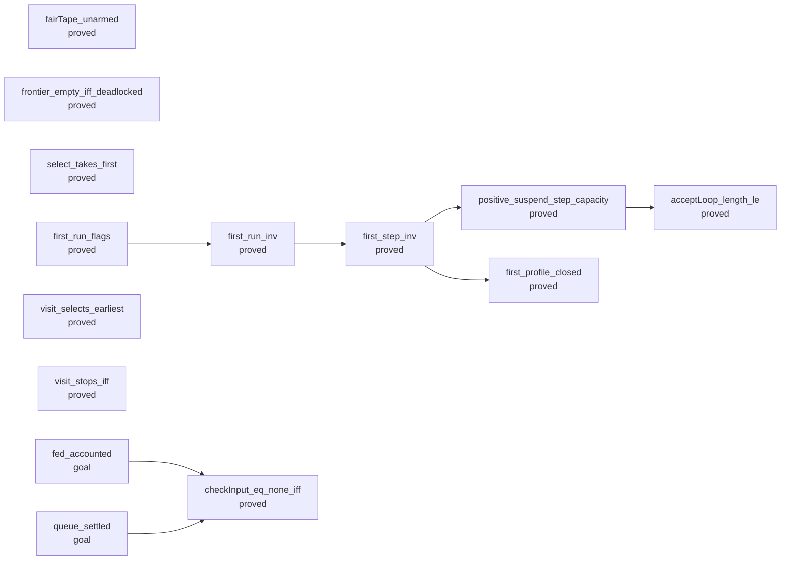

| Node | Status | Rests on | Nearest nodes | Lemmas | Definitions |
| --- | --- | --- | --- | --- | --- |
| `fairTape_unarmed` | proved | — | — | 3 | 285 |
| `frontier_empty_iff_deadlocked` | proved | — | — | 1 | 42 |
| `select_takes_first` | proved | — | — | 0 | 6 |
| `first_run_flags` | proved | — | `first_run_inv` | 6 | 72 |
| `first_run_inv` | proved | — | `first_step_inv` | 2 | 72 |
| `first_step_inv` | proved | — | `positive_suspend_step_capacity`, `first_profile_closed` | 57 | 74 |
| `visit_selects_earliest` | proved | — | — | 5 | 11 |
| `visit_stops_iff` | proved | — | — | 4 | 11 |
| `fed_accounted` | goal | `fed_accounted` | `checkInput_eq_none_iff` | 87 | 1622 |
| `queue_settled` | goal | `queue_settled` | `checkInput_eq_none_iff` | 87 | 1622 |
| `positive_suspend_step_capacity` | proved | — | `acceptLoop_length_le` | 17 | 70 |
| `first_profile_closed` | proved | — | — | 29 | 72 |
| `checkInput_eq_none_iff` | proved | — | — | 38 | 100 |
| `acceptLoop_length_le` | proved | — | — | 0 | 6 |

### R13: A run's inputs are data: equal recorded inputs give equal replay observations

- Open: load inputs, the environment snapshot and the seed: designed (the 2026-09-10 Config route B), not implemented (decisions rows 51, 83)
- Open: supplied values fit the admitted load requirements: restates M5 (loadsTyped, the retired ledger's typedState_load) when Config lands
- Open: the service half of the signature as a recorded input: Built carries the row table only (decisions row 21)
- Open: clock-unit-compatibility (proposed claim; translation-simulation): exact nanoseconds inside, with every recorded millisecond input kept in meaning by an explicit conversion; public nanosecond readings wait for the target's bigint contract (decisions rows 83, 231)

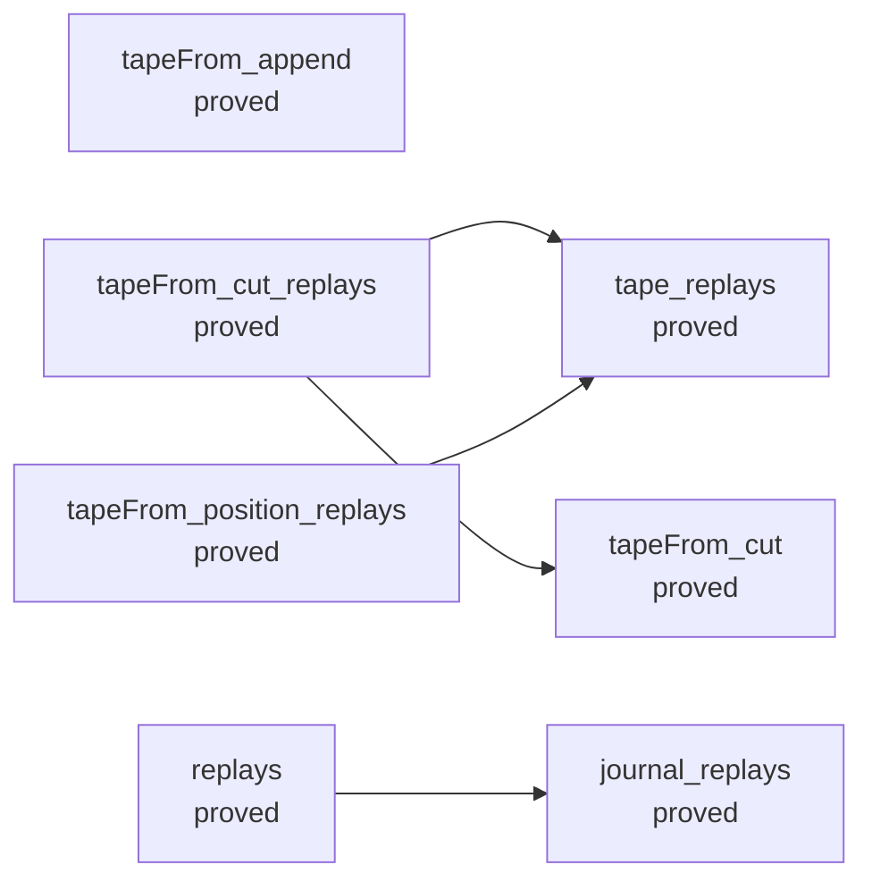

| Node | Status | Rests on | Nearest nodes | Lemmas | Definitions |
| --- | --- | --- | --- | --- | --- |
| `journal_replays` | proved | — | — | 77 | 938 |
| `tapeFrom_append` | proved | — | — | 75 | 954 |
| `tapeFrom_cut` | proved | — | — | 74 | 953 |
| `tapeFrom_cut_replays` | proved | — | `tape_replays`, `tapeFrom_cut` | 70 | 960 |
| `tapeFrom_position_replays` | proved | — | `tape_replays` | 76 | 961 |
| `replays` | proved | — | `journal_replays` | 82 | 965 |
| `tape_replays` | proved | — | — | 97 | 962 |

### R14: A sketch checks and explains its types: holes and the gap, graduality, the focus, minimal type slices and total marking

- Open: sketch-renumbering (proposed claim; initial-algebras-folds): a stored sketch is pinned to the row count of its application; when the application gains a row before the hole table, a map of positions renames the program's operations, each operation keeps its row, and the sketch keeps its type; no theorem states it, and Eff has no map on its operations today; a stale hole is not refused as such, since it reads the row that now stands at its position (two red controls, Test/Program/SketchControls.lean); at the authoring surface a hole is its row's spelling, and no position is stale; the consumer is an author who adds a host row while a sketch is open (docs/research/2026-10-06-seat-SKETCH-receipt.md, open obligation 1; decisions row 291)
- Open: sketch-admission (proposed claim; residual-program-typing): a located refusal for a sketch with its hole table: signature admission at the extended application, raw formation of each hole row, and closed columns; Sketch.check is the checker's answer and admits no sketch to a later stage; the checker types a hole whose declared answer repeats a record field, which raw formation refuses; the consumer is the first tool that stores a sketch (the receipt, open obligation 2); since the variable rule, strict formation of a hole row's raw column gives its closed column too (Formation.closed_of_formed)
- Open: column-graduality (proposed claim; context-requirements): under a hole row that declares the answer alone, omitting more gives the same answer, a smaller error and a smaller requirement, where each omitted address has no closed edge above it or its node's error is never; a closed edge is a place where a child's error enters a value type: the body of catchCause, catchIf, matchCause, onExit or exit, and the program of a fork; it is the one fact that a slice view of the error or of the requirement column owes (docs/research/2026-10-06-seat-LATTICE-receipt.md, section 7); read upward it is the completion of a type slice; with three declared columns an omission keeps the whole type where the focus's columns are closed, formed and in normal form (Sketch.check_omit); elsewhere the hole row is read in normal form, and an omission can change the type of the whole or be refused (the controls on a pair and on mapFromEntries, Test/Program/ReplaceControls.lean); a filling has no such premise; a finite census holds it at 4833 single omissions and 1033 whole masks of 201 programs, with none refused, and outside the premise 4 of 49 omissions are refused (docs/research/2026-10-06-seat-CENSUS-receipt.md, section 5.3); no goal states it; slice COLUMN
- Open: marking-agrees (proposed claim; initial-algebras-folds): a checker that marks each local failure answers on every program, its first mark is the located refusal of explain, it has no mark exactly where the program is admitted, and a marked program is admitted modulo its holes when each mark is read as a hole; the first three clauses are proved for the list of refusals of the address table (the claim address-table), which is slow; open: a mark after a refused sibling, where the table's entry is not reached, and the fourth clause; the natural form of the pass is the checker over a monad, which rewrites the 65 fields of the checker's algebra and each proof that unfolds one, so it gets its own design; one pass that answers every address is the same traversal: it checks each node once and records the environment and the type at each address, where the table costs up to one check of the program for each entry; the table stays as its specification (docs/research/2026-10-06-seat-TRACE-receipt.md, the section on the printer; decisions row 302); slice PASS
- Open: edit-frame (proposed claim; initial-algebras-folds): a filling of the focus's type, in the focus's environment, changes no entry of the address table outside the focus; tested on one example with its red control (Test/Program/TableControls.lean) and not stated; its proof would read NodeHasTy.replace_envAt at each sub-program on the way to an address, in both directions; the consumer is a tool that answers again after an edit; slice PASS (decisions row 302)
- Open: expected-type-slice (proposed claim; subtyping-algebra): each analysing rule of the checker has a minimal slice of its context that still expects the queried type: the row's declaration, the declared field, the cursor type; not stated
- Open: checker-monotone (proposed claim; subtyping-algebra): with every eliminator and every test by equality reading a union member by member and total at never, and with no loop that binds one parameter at two covariant places, a typed term stays typed at a smaller type under a pointwise smaller environment, and a program stays admitted at a smaller type when a child is replaced by a program of a smaller type; false today at the tests by equality, at a binder term under the term guard, at a converted rule under its guard and at a loop with no cursor annotation (seat GAP's probes); the match by bounds is landed, so the clauses on schemes and rows are gone, and its share at a template is proved (Bounds.matchArgsB_monotone; decisions row 303); the list rule, the exit rule, the option rule and the cause rule are converted (decisions row 304); it is the law of filling a hole at a smaller type and of the answer-only column slices, and the guarantee for an omission does not need it; its union groundwork is proved (union-rule-lift): each converted rule owes the three facts of UnionRule.Eliminator, a rule that reads two heads owes four member facts of an upper map, and the record rules owe UnionRule.Below; the fiber rule is converted (union-rule-extend), and under the guard the monotone law holds where the smaller target has at most one union member (Eliminator.extend_mono); a converted rule is not monotone at a proper union until the TypeScript printer writes the type arguments (candidate N, decisions rows 282, 285, 292, 293, 298)
- Open: gap-conservative, gap-necessary, gap-graduality and gap-exact-off-cells (proposed claims; subtyping-algebra, with R2 and R3 for the appended leaf): with one gap per hole, the gap check on a program with no gap is the checker; a program with holes that some hole table admits passes the gap check; an omission passes the gap check at a gap type that has the original's type as an instance; off invariant positions a program that passes the gap check is admitted by some hole table; at a cell the content converts by the rule with bounds, since the member-by-member rule accepts pairs with no witness; tested on finite models and not compiled (the study, sections 5.2, 5.5 and 5.6); the leaf Ty.gap is stage 6 of the study's plan, and the coordinator tells the owner before the append lands (decisions rows 282, 288); they replace the part gradual-checker
- Open: fill-by-term (proposed claim; translation-simulation): a reply of a term's value at a hole's frontier and the filled program have one observation; a data hole waits at a frontier as a host row does today, and a handler for a hole's operation waits for a consumer; designed and not compiled (the study, section 7)

```mermaid
flowchart LR
  n0["lattice_minimal<br/>proved"]
  n1["holes_conservative<br/>proved"]
  n2["sketch_weakening<br/>proved"]
  n3["hole_hasTy<br/>proved"]
  n4["replace<br/>proved"]
  n5["replace_envAt<br/>proved"]
  n6["check_closed<br/>proved"]
  n7["refusals_nil_iff<br/>proved"]
  n8["hasTy_extSlotEnv<br/>proved"]
  n9["max_assoc<br/>proved"]
  n10["max_comm<br/>proved"]
  n11["max_idem<br/>proved"]
  n12["max_le<br/>proved"]
  n13["max_mono<br/>proved"]
  n14["closed<br/>proved"]
  n15["matchArgsB_monotone<br/>proved"]
  n16["append<br/>proved"]
  n17["nil<br/>proved"]
  n18["push<br/>proved"]
  n19["closed_arms<br/>proved"]
  n20["actionAll_onRef<br/>proved"]
  n21["allTypes_append<br/>proved"]
  n22["allTypes_nil<br/>proved"]
  n23["allTypes_singleton<br/>proved"]
  n24["allTypes_zipIdx_map<br/>proved"]
  n25["annotationsAll_expandRefs<br/>proved"]
  n26["annotationsClosed_of_formed<br/>proved"]
  n27["annotations_closed<br/>proved"]
  n28["argsAnnotations_all<br/>proved"]
  n29["argumentAnnotations_all<br/>proved"]
  n30["causeAnnotations_all<br/>proved"]
  n31["closed_of_formed<br/>proved"]
  n32["closed_of_nodes<br/>proved"]
  n33["effAll_onRef<br/>proved"]
  n34["effsAll_onRef<br/>proved"]
  n35["forall_mem_none<br/>proved"]
  n36["forall_mem_some<br/>proved"]
  n37["formed_sites_iff<br/>proved"]
  n38["inputFormed_program<br/>proved"]
  n39["inputFormed_services<br/>proved"]
  n40["layerAll_of_layerAt<br/>proved"]
  n41["layerAll_onRef<br/>proved"]
  n42["layersAll_onRef<br/>proved"]
  n43["mem_nodes_field<br/>proved"]
  n44["mem_nodes_item<br/>proved"]
  n45["nodeAnnotations_all<br/>proved"]
  n46["optionTerm_all<br/>proved"]
  n47["programAnnotations_all<br/>proved"]
  n48["services_closed<br/>proved"]
  n49["stmtAll_onRef<br/>proved"]
  n50["stmtsAll_onRef<br/>proved"]
  n51["termAnnotations_all<br/>proved"]
  n52["closed_genAnswer<br/>proved"]
  n53["closed_joinAnswerT<br/>proved"]
  n54["closed_merge<br/>proved"]
  n55["closed_seq<br/>proved"]
  n56["cause_cases_of_below<br/>proved"]
  n57["cause_closed<br/>proved"]
  n58["cause_least<br/>proved"]
  n59["cause_monotone<br/>proved"]
  n60["cause_reads<br/>proved"]
  n61["cause_upper<br/>proved"]
  n62["exit_closed<br/>proved"]
  n63["exit_eliminator<br/>proved"]
  n64["exit_one<br/>proved"]
  n65["fiber_closed<br/>proved"]
  n66["fiber_eliminator<br/>proved"]
  n67["fiber_one<br/>proved"]
  n68["list_closed<br/>proved"]
  n69["list_eliminator<br/>proved"]
  n70["list_one<br/>proved"]
  n71["option_closed<br/>proved"]
  n72["option_eliminator<br/>proved"]
  n73["CustomScheme.closed_apply<br/>proved"]
  n74["Scheme.closed_apply<br/>proved"]
  n75["closed_monoApply<br/>proved"]
  n76["closed_projectProduct<br/>proved"]
  n77["closed_typeOf<br/>proved"]
  n78["spec_answersClosed<br/>proved"]
  n79["at_layers_nil<br/>proved"]
  n80["at_stmts_nil<br/>proved"]
  n81["exists_at_of_mem_foldList<br/>proved"]
  n82["foldList_cases<br/>proved"]
  n83["mem_foldList_iff<br/>proved"]
  n84["replaceAt_eff<br/>proved"]
  n85["sizeOf_child_lt<br/>proved"]
  n86["child_step<br/>proved"]
  n87["closed_check<br/>proved"]
  n88["closed_fieldOf<br/>proved"]
  n89["closed_fieldType<br/>proved"]
  n90["closed_setOf<br/>proved"]
  n91["closed_setType<br/>proved"]
  n92["closed_tagArms<br/>proved"]
  n93["withHoles_extends<br/>proved"]
  n94["withHoles_nil<br/>proved"]
  n95["withHoles_rowOf<br/>proved"]
  n96["withHoles_withHoles<br/>proved"]
  n97["check_fill<br/>proved"]
  n98["check_fill_focusAt<br/>proved"]
  n99["check_filled<br/>proved"]
  n100["Sketch.check_focusAt<br/>proved"]
  n101["check_more_holes<br/>proved"]
  n102["check_omit<br/>proved"]
  n103["check_omit_focusAt<br/>proved"]
  n104["check_program<br/>proved"]
  n105["fillAt_of_replaceAt<br/>proved"]
  n106["closed_project<br/>proved"]
  n107["closed_typeAt<br/>proved"]
  n108["closedSubst_infer<br/>proved"]
  n109["closedSubst_matchArgsB<br/>proved"]
  n110["closedSubst_matchTemplate<br/>proved"]
  n111["closedSubst_matchTemplateArgs<br/>proved"]
  n112["closed_cands<br/>proved"]
  n113["closed_diffTag<br/>proved"]
  n114["closed_instantiate<br/>proved"]
  n115["closed_joinCands<br/>proved"]
  n116["closed_payloadOf<br/>proved"]
  n117["closed_payloadTy<br/>proved"]
  n118["mem_of_lookup<br/>proved"]
  n119["subN_causeOf_iff<br/>proved"]
  n120["subN_exitOf_iff<br/>proved"]
  n121["subN_fiberOf_iff<br/>proved"]
  n122["subN_list_iff<br/>proved"]
  n123["subN_option_iff<br/>proved"]
  n124["adjoint<br/>proved"]
  n125["adjoint_le<br/>proved"]
  n126["extend_adjoint<br/>proved"]
  n127["extend_bot<br/>proved"]
  n128["extend_isSome_iff<br/>proved"]
  n129["extend_laws<br/>proved"]
  n130["extend_least<br/>proved"]
  n131["extend_liftOne<br/>proved"]
  n132["extend_mono<br/>proved"]
  n133["extend_upper<br/>proved"]
  n134["liftOne_answers<br/>proved"]
  n135["liftOne_isSome_iff<br/>proved"]
  n136["liftOne_mono<br/>proved"]
  n137["Eliminator.lift_least<br/>proved"]
  n138["Eliminator.lift_mono<br/>proved"]
  n139["Eliminator.lift_upper<br/>proved"]
  n140["monotone<br/>proved"]
  n141["lift_sound<br/>proved"]
  n142["below_of_upper<br/>proved"]
  n143["closed_join<br/>proved"]
  n144["extend_agrees<br/>proved"]
  n145["extend_closed<br/>proved"]
  n146["extend_closed_pair<br/>proved"]
  n147["extend_eq_some_iff<br/>proved"]
  n148["extend_never<br/>proved"]
  n149["extend_refused<br/>proved"]
  n150["extend_two<br/>proved"]
  n151["foldl_all<br/>proved"]
  n152["foldl_join_normalize<br/>proved"]
  n153["foldl_join_pair<br/>proved"]
  n154["foldl_join_pair_start<br/>proved"]
  n155["foldl_join_start<br/>proved"]
  n156["foldl_keeps<br/>proved"]
  n157["joinAll_all<br/>proved"]
  n158["joinAll_keeps<br/>proved"]
  n159["joinAll_le<br/>proved"]
  n160["joinAll_normalize<br/>proved"]
  n161["join_normalize_right<br/>proved"]
  n162["le_joinAll<br/>proved"]
  n163["liftOne_congr<br/>proved"]
  n164["liftOne_eq<br/>proved"]
  n165["liftOne_eq_some_iff<br/>proved"]
  n166["liftOne_member<br/>proved"]
  n167["liftOne_never<br/>proved"]
  n168["liftOne_some<br/>proved"]
  n169["liftOne_two<br/>proved"]
  n170["lift_all<br/>proved"]
  n171["lift_closed<br/>proved"]
  n172["lift_closed_pair<br/>proved"]
  n173["lift_congr<br/>proved"]
  n174["lift_laws<br/>proved"]
  n175["UnionRule.lift_least<br/>proved"]
  n176["lift_member<br/>proved"]
  n177["UnionRule.lift_mono<br/>proved"]
  n178["lift_never<br/>proved"]
  n179["lift_transfer<br/>proved"]
  n180["lift_union<br/>proved"]
  n181["lift_union_eq<br/>proved"]
  n182["lift_union_eq_of<br/>proved"]
  n183["lift_union_eq_of_antisymm<br/>proved"]
  n184["lift_union_eq_pair<br/>proved"]
  n185["lift_unique<br/>proved"]
  n186["lift_unique_pair<br/>proved"]
  n187["UnionRule.lift_upper<br/>proved"]
  n188["mapM_answer<br/>proved"]
  n189["mapM_cons_eq_some<br/>proved"]
  n190["mapM_source<br/>proved"]
  n191["mapM_total<br/>proved"]
  n192["members_union<br/>proved"]
  n193["normal_ofMembers<br/>proved"]
  n194["prod_antisymm<br/>proved"]
  n195["subN_iff_le<br/>proved"]
  n196["actionHasTy_closed<br/>proved"]
  n197["actionHasTy_replace<br/>proved"]
  n198["addresses_eff_head<br/>proved"]
  n199["addresses_eq_foldList<br/>proved"]
  n200["argTy_closed<br/>proved"]
  n201["argsTy_closed<br/>proved"]
  n202["causeInputError_causeOf<br/>proved"]
  n203["causeInputError_exitOf<br/>proved"]
  n204["causeInputError_upper<br/>proved"]
  n205["causeTy_closed<br/>proved"]
  n206["cause_mono<br/>proved"]
  n207["Program.check_focusAt<br/>proved"]
  n208["check_replace<br/>proved"]
  n209["check_replace_focusAt<br/>proved"]
  n210["closedSig_app<br/>proved"]
  n211["closedSig_native<br/>proved"]
  n212["closed_catchIfError<br/>proved"]
  n213["closed_causeInputError<br/>proved"]
  n214["closed_exitOf<br/>proved"]
  n215["closed_fiberTy<br/>proved"]
  n216["closed_getD<br/>proved"]
  n217["closed_joinAnswer<br/>proved"]
  n218["closed_listOf<br/>proved"]
  n219["closed_litArgTy<br/>proved"]
  n220["closed_nativeAtomTy<br/>proved"]
  n221["closed_nativeServiceTy<br/>proved"]
  n222["closed_optionTy<br/>proved"]
  n223["closed_rowTy<br/>proved"]
  n224["closed_serviceTy<br/>proved"]
  n225["effTy_map_of_hasTy<br/>proved"]
  n226["effsHasTy_closed<br/>proved"]
  n227["effsHasTy_replace<br/>proved"]
  n228["exitOf_exitOf<br/>proved"]
  n229["exitOf_upper<br/>proved"]
  n230["fiberTy_fiberOf<br/>proved"]
  n231["fiberTy_upper<br/>proved"]
  n232["focusAt_eq_some<br/>proved"]
  n233["focusAt_nil<br/>proved"]
  n234["focusAt_typed<br/>proved"]
  n235["foldMapAt_action_fuse<br/>proved"]
  n236["foldMapAt_eff_fuse<br/>proved"]
  n237["foldMapAt_effs_fuse<br/>proved"]
  n238["foldMapAt_layer_fuse<br/>proved"]
  n239["foldMapAt_layers_fuse<br/>proved"]
  n240["foldMapAt_stmt_fuse<br/>proved"]
  n241["foldMapAt_stmts_fuse<br/>proved"]
  n242["foldMapAt_term_fuse<br/>proved"]
  n243["foldMapAt_terms_fuse<br/>proved"]
  n244["hasTy_closed<br/>proved"]
  n245["hasTy_focusAt<br/>proved"]
  n246["hasTy_replace<br/>proved"]
  n247["hasTy_replace_focusAt<br/>proved"]
  n248["layerHasTy_closed<br/>proved"]
  n249["layerHasTy_replace<br/>proved"]
  n250["layersHasTy_closed<br/>proved"]
  n251["layersHasTy_cons<br/>proved"]
  n252["layersHasTy_replace<br/>proved"]
  n253["listOf_list<br/>proved"]
  n254["listOf_upper<br/>proved"]
  n255["mem_addresses_iff<br/>proved"]
  n256["optionTy_eq_normal<br/>proved"]
  n257["optionTy_option<br/>proved"]
  n258["optionTy_upper<br/>proved"]
  n259["refusals_head<br/>proved"]
  n260["refusals_of_hasTy<br/>proved"]
  n261["sketch_more_holes<br/>proved"]
  n262["sketch_reads_its_holes<br/>proved"]
  n263["stmtsHasTy_closed<br/>proved"]
  n264["stmtsHasTy_replace<br/>proved"]
  n265["subN_causeOf_causeUpper<br/>proved"]
  n266["subN_exitOf_causeUpper<br/>proved"]
  n267["table_head<br/>proved"]
  n268["table_result_refusal_none_of_hasTy<br/>proved"]
  n269["termTy_closed<br/>proved"]
  n270["typeOfProgram_closed<br/>proved"]
  n271["typeOfProgram_closed_app<br/>proved"]
  n272["yieldAt_addressYield<br/>proved"]
  n273["drop_le<br/>proved"]
  n274["drop_le_of_subset<br/>proved"]
  n275["exists_mem_subslices<br/>proved"]
  n276["failed_rest<br/>proved"]
  n277["failed_snoc<br/>proved"]
  n278["filter_mem_sublists<br/>proved"]
  n279["firstDrop_append<br/>proved"]
  n280["firstDrop_length<br/>proved"]
  n281["instIsPreorder<br/>proved"]
  n282["instLawfulOrderInf<br/>proved"]
  n283["instLawfulOrderSup<br/>proved"]
  n284["le_drop<br/>proved"]
  n285["le_of_mem_subslices<br/>proved"]
  n286["not_mem_drop<br/>proved"]
  n287["omitted_anti<br/>proved"]
  n288["omitted_full<br/>proved"]
  n289["omitted_subset<br/>proved"]
  n290["restart_append<br/>proved"]
  n291["restart_eq_sweep<br/>proved"]
  n292["restart_of_none<br/>proved"]
  n293["restart_of_some<br/>proved"]
  n294["sublists_subset<br/>proved"]
  n295["sweepAsked_length<br/>proved"]
  n296["sweepFreeAsked_sublist<br/>proved"]
  n297["sweepFree_congr<br/>proved"]
  n298["sweepFree_eq_sweep<br/>proved"]
  n299["sweep_congr<br/>proved"]
  n300["sweep_kept_needed<br/>proved"]
  n301["sweep_sublist<br/>proved"]
  n302["sweep_valid<br/>proved"]
  n303["keeps_above<br/>proved"]
  n304["needs<br/>proved"]
  n305["of_same_sites<br/>proved"]
  n306["contribution_le<br/>proved"]
  n307["contribution_lub<br/>proved"]
  n308["contribution_valid<br/>proved"]
  n309["decide_valid_up<br/>proved"]
  n310["descendTree_asks<br/>proved"]
  n311["descendTree_eq_descend<br/>proved"]
  n312["descendTree_minimal<br/>proved"]
  n313["descend_asks<br/>proved"]
  n314["descend_eq_restart<br/>proved"]
  n315["descend_le<br/>proved"]
  n316["descend_minimal<br/>proved"]
  n317["descend_sublist<br/>proved"]
  n318["descend_valid<br/>proved"]
  n319["exists_minimal_below<br/>proved"]
  n320["isMinimal_iff<br/>proved"]
  n321["minimal_iff_drop<br/>proved"]
  n322["minimal_refine<br/>proved"]
  n323["minimals_complete<br/>proved"]
  n324["minimals_sound<br/>proved"]
  n325["ofOmitted_full<br/>proved"]
  n326["parentOmitted_sound<br/>proved"]
  n327["valid_max<br/>proved"]
  n328["valid_refine<br/>proved"]
  n329["valid_up<br/>proved"]
  n330["check_restrict<br/>proved"]
  n331["normalize_idem<br/>proved"]
  n332["check_sound<br/>proved"]
  n333["check_complete<br/>proved"]
  n334["matchArgsB_least<br/>proved"]
  n335["matchArgsB_complete<br/>proved"]
  n336["matchArgsB_sound<br/>proved"]
  n337["subN_trans<br/>proved"]
  n338["subN_refl<br/>proved"]
  n339["replaceAt_spec<br/>proved"]
  n340["subN_equiv_iff<br/>proved"]
  n341["check_ext<br/>proved"]
  n342["cata_eff_congr_on<br/>proved"]
  n343["hom_eq_cata_eff<br/>proved"]
  n344["sub_antisymm_canonical<br/>proved"]
  n0 --> n327
  n0 --> n322
  n0 --> n316
  n0 --> n315
  n0 --> n319
  n1 --> n93
  n1 --> n330
  n2 --> n262
  n2 --> n261
  n3 --> n331
  n3 --> n95
  n4 --> n5
  n5 --> n86
  n6 --> n26
  n6 --> n332
  n6 --> n244
  n7 --> n332
  n7 --> n260
  n7 --> n259
  n8 --> n333
  n8 --> n332
  n9 --> n12
  n10 --> n12
  n11 --> n12
  n13 --> n12
  n14 --> n271
  n15 --> n334
  n15 --> n335
  n15 --> n336
  n18 --> n16
  n19 --> n92
  n19 --> n113
  n19 --> n117
  n19 --> n222
  n25 --> n33
  n25 --> n40
  n25 --> n47
  n26 --> n27
  n26 --> n47
  n27 --> n31
  n28 --> n21
  n28 --> n22
  n29 --> n36
  n29 --> n23
  n29 --> n35
  n29 --> n24
  n29 --> n46
  n29 --> n21
  n29 --> n30
  n29 --> n51
  n29 --> n22
  n30 --> n21
  n30 --> n46
  n30 --> n51
  n31 --> n37
  n31 --> n32
  n32 --> n44
  n32 --> n43
  n40 --> n45
  n40 --> n21
  n40 --> n238
  n45 --> n29
  n45 --> n28
  n46 --> n36
  n46 --> n51
  n46 --> n35
  n46 --> n22
  n47 --> n45
  n47 --> n21
  n47 --> n236
  n48 --> n31
  n51 --> n23
  n51 --> n22
  n51 --> n21
  n51 --> n242
  n52 --> n143
  n53 --> n143
  n54 --> n143
  n54 --> n53
  n55 --> n143
  n55 --> n53
  n58 --> n56
  n59 --> n60
  n59 --> n58
  n59 --> n61
  n59 --> n331
  n59 --> n337
  n59 --> n338
  n59 --> n142
  n60 --> n56
  n61 --> n265
  n61 --> n266
  n63 --> n120
  n63 --> n331
  n63 --> n337
  n63 --> n338
  n66 --> n121
  n66 --> n331
  n66 --> n337
  n66 --> n338
  n69 --> n122
  n69 --> n331
  n69 --> n337
  n69 --> n338
  n72 --> n123
  n72 --> n331
  n72 --> n337
  n72 --> n338
  n73 --> n213
  n73 --> n76
  n74 --> n73
  n74 --> n109
  n74 --> n114
  n74 --> n75
  n76 --> n143
  n77 --> n78
  n77 --> n74
  n81 --> n85
  n81 --> n82
  n83 --> n81
  n84 --> n339
  n86 --> n251
  n86 --> n79
  n86 --> n80
  n86 --> n225
  n89 --> n88
  n89 --> n171
  n91 --> n90
  n91 --> n171
  n97 --> n105
  n97 --> n93
  n97 --> n96
  n97 --> n208
  n98 --> n105
  n98 --> n209
  n98 --> n93
  n98 --> n96
  n99 --> n1
  n100 --> n207
  n101 --> n261
  n102 --> n333
  n102 --> n3
  n102 --> n97
  n103 --> n333
  n103 --> n98
  n103 --> n3
  n104 --> n94
  n106 --> n143
  n107 --> n106
  n109 --> n115
  n109 --> n112
  n110 --> n108
  n111 --> n110
  n114 --> n118
  n115 --> n143
  n117 --> n116
  n124 --> n137
  n124 --> n337
  n124 --> n191
  n124 --> n139
  n125 --> n124
  n125 --> n331
  n125 --> n337
  n125 --> n338
  n126 --> n168
  n126 --> n124
  n126 --> n147
  n127 --> n144
  n127 --> n148
  n128 --> n149
  n128 --> n144
  n128 --> n147
  n128 --> n135
  n129 --> n150
  n129 --> n126
  n129 --> n133
  n129 --> n127
  n129 --> n149
  n129 --> n144
  n130 --> n126
  n131 --> n133
  n131 --> n137
  n131 --> n168
  n131 --> n139
  n131 --> n130
  n131 --> n135
  n131 --> n128
  n131 --> n134
  n131 --> n147
  n132 --> n130
  n132 --> n128
  n132 --> n133
  n132 --> n337
  n133 --> n126
  n134 --> n137
  n134 --> n139
  n134 --> n338
  n134 --> n124
  n134 --> n165
  n135 --> n165
  n135 --> n124
  n136 --> n165
  n136 --> n168
  n136 --> n138
  n137 --> n175
  n138 --> n140
  n138 --> n177
  n139 --> n338
  n139 --> n187
  n140 --> n338
  n140 --> n142
  n141 --> n179
  n142 --> n337
  n144 --> n147
  n145 --> n168
  n145 --> n171
  n145 --> n147
  n146 --> n168
  n146 --> n172
  n146 --> n147
  n148 --> n167
  n148 --> n149
  n150 --> n169
  n150 --> n149
  n152 --> n331
  n154 --> n155
  n154 --> n153
  n155 --> n161
  n155 --> n331
  n157 --> n151
  n158 --> n156
  n159 --> n157
  n160 --> n152
  n161 --> n331
  n162 --> n158
  n163 --> n173
  n166 --> n176
  n166 --> n164
  n168 --> n165
  n170 --> n190
  n170 --> n157
  n171 --> n143
  n171 --> n170
  n172 --> n143
  n172 --> n170
  n174 --> n179
  n174 --> n177
  n174 --> n173
  n174 --> n176
  n174 --> n178
  n175 --> n337
  n175 --> n190
  n175 --> n159
  n177 --> n159
  n177 --> n162
  n177 --> n188
  n177 --> n191
  n179 --> n158
  n179 --> n188
  n180 --> n190
  n180 --> n159
  n180 --> n162
  n180 --> n188
  n180 --> n191
  n180 --> n192
  n181 --> n160
  n181 --> n331
  n181 --> n340
  n181 --> n182
  n181 --> n337
  n181 --> n338
  n182 --> n180
  n183 --> n182
  n184 --> n160
  n184 --> n331
  n184 --> n153
  n184 --> n340
  n184 --> n182
  n184 --> n337
  n184 --> n338
  n185 --> n331
  n185 --> n173
  n185 --> n155
  n185 --> n189
  n185 --> n193
  n186 --> n331
  n186 --> n173
  n186 --> n154
  n186 --> n189
  n186 --> n193
  n187 --> n162
  n187 --> n337
  n187 --> n188
  n188 --> n189
  n190 --> n189
  n191 --> n189
  n196 --> n17
  n196 --> n218
  n196 --> n54
  n196 --> n55
  n196 --> n215
  n196 --> n216
  n196 --> n16
  n196 --> n19
  n196 --> n212
  n196 --> n217
  n196 --> n52
  n196 --> n143
  n196 --> n18
  n196 --> n223
  n196 --> n205
  n196 --> n269
  n197 --> n4
  n200 --> n107
  n200 --> n91
  n200 --> n89
  n200 --> n31
  n200 --> n87
  n200 --> n219
  n201 --> n107
  n201 --> n91
  n201 --> n89
  n201 --> n31
  n201 --> n87
  n201 --> n219
  n202 --> n144
  n203 --> n144
  n204 --> n61
  n204 --> n206
  n204 --> n331
  n204 --> n337
  n204 --> n338
  n204 --> n187
  n204 --> n265
  n204 --> n266
  n204 --> n147
  n205 --> n143
  n205 --> n269
  n206 --> n120
  n206 --> n265
  n206 --> n337
  n206 --> n119
  n207 --> n332
  n207 --> n245
  n208 --> n84
  n208 --> n333
  n208 --> n332
  n208 --> n246
  n209 --> n332
  n209 --> n247
  n209 --> n333
  n209 --> n234
  n209 --> n84
  n210 --> n48
  n210 --> n224
  n210 --> n220
  n211 --> n221
  n211 --> n220
  n212 --> n143
  n213 --> n57
  n213 --> n145
  n214 --> n62
  n214 --> n146
  n215 --> n65
  n215 --> n146
  n217 --> n143
  n218 --> n68
  n218 --> n145
  n220 --> n77
  n222 --> n168
  n222 --> n71
  n222 --> n171
  n223 --> n31
  n225 --> n333
  n225 --> n332
  n226 --> n17
  n226 --> n218
  n226 --> n54
  n226 --> n55
  n226 --> n215
  n226 --> n216
  n226 --> n16
  n226 --> n19
  n226 --> n212
  n226 --> n217
  n226 --> n52
  n226 --> n143
  n226 --> n18
  n226 --> n223
  n226 --> n205
  n226 --> n269
  n227 --> n4
  n228 --> n144
  n229 --> n63
  n229 --> n331
  n229 --> n337
  n229 --> n338
  n229 --> n133
  n230 --> n144
  n231 --> n66
  n231 --> n331
  n231 --> n337
  n231 --> n338
  n231 --> n133
  n234 --> n332
  n234 --> n232
  n244 --> n17
  n244 --> n218
  n244 --> n54
  n244 --> n55
  n244 --> n215
  n244 --> n216
  n244 --> n16
  n244 --> n19
  n244 --> n212
  n244 --> n217
  n244 --> n52
  n244 --> n143
  n244 --> n18
  n244 --> n223
  n244 --> n205
  n244 --> n269
  n245 --> n333
  n245 --> n332
  n245 --> n232
  n245 --> n5
  n246 --> n4
  n247 --> n333
  n247 --> n332
  n247 --> n5
  n247 --> n232
  n248 --> n17
  n248 --> n218
  n248 --> n54
  n248 --> n55
  n248 --> n215
  n248 --> n216
  n248 --> n16
  n248 --> n19
  n248 --> n212
  n248 --> n217
  n248 --> n52
  n248 --> n143
  n248 --> n18
  n248 --> n223
  n248 --> n205
  n248 --> n269
  n249 --> n4
  n250 --> n17
  n250 --> n218
  n250 --> n54
  n250 --> n55
  n250 --> n215
  n250 --> n216
  n250 --> n16
  n250 --> n19
  n250 --> n212
  n250 --> n217
  n250 --> n52
  n250 --> n143
  n250 --> n18
  n250 --> n223
  n250 --> n205
  n250 --> n269
  n252 --> n4
  n253 --> n144
  n254 --> n69
  n254 --> n331
  n254 --> n337
  n254 --> n338
  n254 --> n133
  n255 --> n272
  n255 --> n83
  n255 --> n199
  n257 --> n166
  n258 --> n168
  n258 --> n72
  n258 --> n331
  n258 --> n337
  n258 --> n338
  n258 --> n139
  n259 --> n267
  n259 --> n332
  n259 --> n260
  n260 --> n268
  n261 --> n93
  n261 --> n341
  n261 --> n96
  n262 --> n93
  n262 --> n330
  n262 --> n96
  n263 --> n17
  n263 --> n218
  n263 --> n54
  n263 --> n55
  n263 --> n215
  n263 --> n216
  n263 --> n16
  n263 --> n19
  n263 --> n212
  n263 --> n217
  n263 --> n52
  n263 --> n143
  n263 --> n18
  n263 --> n223
  n263 --> n205
  n263 --> n269
  n264 --> n4
  n266 --> n337
  n266 --> n338
  n266 --> n120
  n267 --> n198
  n268 --> n332
  n268 --> n333
  n268 --> n232
  n268 --> n245
  n269 --> n200
  n270 --> n26
  n270 --> n25
  n270 --> n17
  n270 --> n332
  n270 --> n244
  n271 --> n38
  n271 --> n39
  n271 --> n210
  n271 --> n270
  n275 --> n278
  n285 --> n294
  n290 --> n277
  n290 --> n276
  n290 --> n293
  n290 --> n279
  n290 --> n292
  n290 --> n280
  n291 --> n290
  n292 --> n280
  n293 --> n280
  n296 --> n274
  n298 --> n274
  n300 --> n301
  n300 --> n274
  n303 --> n304
  n304 --> n321
  n305 --> n281
  n305 --> n329
  n307 --> n324
  n307 --> n323
  n308 --> n316
  n308 --> n315
  n308 --> n281
  n308 --> n307
  n308 --> n318
  n308 --> n329
  n309 --> n329
  n310 --> n297
  n310 --> n326
  n310 --> n309
  n310 --> n296
  n311 --> n326
  n311 --> n309
  n311 --> n298
  n312 --> n311
  n312 --> n316
  n313 --> n299
  n313 --> n295
  n314 --> n309
  n314 --> n291
  n314 --> n280
  n315 --> n317
  n316 --> n309
  n316 --> n300
  n316 --> n318
  n316 --> n321
  n317 --> n301
  n318 --> n302
  n319 --> n316
  n319 --> n315
  n320 --> n321
  n321 --> n284
  n321 --> n329
  n321 --> n273
  n321 --> n286
  n322 --> n328
  n322 --> n319
  n323 --> n305
  n323 --> n320
  n323 --> n275
  n324 --> n320
  n324 --> n285
  n325 --> n288
  n327 --> n283
  n327 --> n281
  n327 --> n329
  n330 --> n342
  n330 --> n343
  n334 --> n331
  n334 --> n337
  n334 --> n338
  n335 --> n331
  n335 --> n337
  n335 --> n338
  n340 --> n344
  n340 --> n331
  n341 --> n332
  n341 --> n333
```

| Node | Status | Rests on | Nearest nodes | Lemmas | Definitions |
| --- | --- | --- | --- | --- | --- |
| `lattice_minimal` | proved | — | `valid_max`, `minimal_refine`, `descend_minimal`, `descend_le`, `exists_minimal_below` | 0 | 9 |
| `holes_conservative` | proved | — | `withHoles_extends`, `check_restrict` | 38 | 220 |
| `sketch_weakening` | proved | — | `sketch_reads_its_holes`, `sketch_more_holes` | 54 | 382 |
| `hole_hasTy` | proved | — | `normalize_idem`, `withHoles_rowOf` | 84 | 227 |
| `replace` | proved | — | `replace_envAt` | 54 | 261 |
| `replace_envAt` | proved | — | `child_step` | 54 | 262 |
| `check_closed` | proved | — | `annotationsClosed_of_formed`, `check_sound`, `hasTy_closed` | 54 | 271 |
| `refusals_nil_iff` | proved | — | `check_sound`, `refusals_of_hasTy`, `refusals_head` | 58 | 307 |
| `hasTy_extSlotEnv` | proved | — | `check_complete`, `check_sound` | 58 | 259 |
| `max_assoc` | proved | — | `max_le` | 0 | 0 |
| `max_comm` | proved | — | `max_le` | 0 | 0 |
| `max_idem` | proved | — | `max_le` | 0 | 0 |
| `max_le` | proved | — | — | 0 | 0 |
| `max_mono` | proved | — | `max_le` | 0 | 0 |
| `closed` | proved | — | `typeOfProgram_closed_app` | 56 | 421 |
| `matchArgsB_monotone` | proved | — | `matchArgsB_least`, `matchArgsB_complete`, `matchArgsB_sound` | 98 | 69 |
| `append` | proved | — | — | 0 | 3 |
| `nil` | proved | — | — | 0 | 2 |
| `push` | proved | — | `append` | 0 | 3 |
| `closed_arms` | proved | — | `closed_tagArms`, `closed_diffTag`, `closed_payloadTy`, `closed_optionTy` | 59 | 70 |
| `actionAll_onRef` | proved | — | — | 0 | 112 |
| `allTypes_append` | proved | — | — | 0 | 1 |
| `allTypes_nil` | proved | — | — | 0 | 1 |
| `allTypes_singleton` | proved | — | — | 0 | 1 |
| `allTypes_zipIdx_map` | proved | — | — | 0 | 1 |
| `annotationsAll_expandRefs` | proved | — | `effAll_onRef`, `layerAll_of_layerAt`, `programAnnotations_all` | 0 | 123 |
| `annotationsClosed_of_formed` | proved | — | `annotations_closed`, `programAnnotations_all` | 37 | 109 |
| `annotations_closed` | proved | — | `closed_of_formed` | 37 | 86 |
| `argsAnnotations_all` | proved | — | `allTypes_append`, `allTypes_nil` | 0 | 16 |
| `argumentAnnotations_all` | proved | — | `forall_mem_some`, `allTypes_singleton`, `forall_mem_none`, `allTypes_zipIdx_map`, `optionTerm_all`, `allTypes_append`, `causeAnnotations_all`, `termAnnotations_all`, `allTypes_nil` | 0 | 19 |
| `causeAnnotations_all` | proved | — | `allTypes_append`, `optionTerm_all`, `termAnnotations_all` | 0 | 14 |
| `closed_of_formed` | proved | — | `formed_sites_iff`, `closed_of_nodes` | 37 | 61 |
| `closed_of_nodes` | proved | — | `mem_nodes_item`, `mem_nodes_field` | 3 | 7 |
| `effAll_onRef` | proved | — | — | 0 | 112 |
| `effsAll_onRef` | proved | — | — | 0 | 112 |
| `forall_mem_none` | proved | — | — | 0 | 0 |
| `forall_mem_some` | proved | — | — | 0 | 0 |
| `formed_sites_iff` | proved | — | — | 37 | 61 |
| `inputFormed_program` | proved | — | — | 37 | 93 |
| `inputFormed_services` | proved | — | — | 37 | 93 |
| `layerAll_of_layerAt` | proved | — | `nodeAnnotations_all`, `allTypes_append`, `foldMapAt_layer_fuse` | 3 | 52 |
| `layerAll_onRef` | proved | — | — | 0 | 112 |
| `layersAll_onRef` | proved | — | — | 0 | 112 |
| `mem_nodes_field` | proved | — | — | 0 | 4 |
| `mem_nodes_item` | proved | — | — | 0 | 3 |
| `nodeAnnotations_all` | proved | — | `argumentAnnotations_all`, `argsAnnotations_all` | 0 | 27 |
| `optionTerm_all` | proved | — | `forall_mem_some`, `termAnnotations_all`, `forall_mem_none`, `allTypes_nil` | 0 | 7 |
| `programAnnotations_all` | proved | — | `nodeAnnotations_all`, `allTypes_append`, `foldMapAt_eff_fuse` | 0 | 47 |
| `services_closed` | proved | — | `closed_of_formed` | 37 | 62 |
| `stmtAll_onRef` | proved | — | — | 0 | 112 |
| `stmtsAll_onRef` | proved | — | — | 0 | 112 |
| `termAnnotations_all` | proved | — | `allTypes_singleton`, `allTypes_nil`, `allTypes_append`, `foldMapAt_term_fuse` | 0 | 7 |
| `closed_genAnswer` | proved | — | `closed_join` | 37 | 51 |
| `closed_joinAnswerT` | proved | — | `closed_join` | 37 | 47 |
| `closed_merge` | proved | — | `closed_join`, `closed_joinAnswerT` | 54 | 75 |
| `closed_seq` | proved | — | `closed_join`, `closed_joinAnswerT` | 54 | 75 |
| `cause_cases_of_below` | proved | — | — | 129 | 61 |
| `cause_closed` | proved | — | — | 0 | 2 |
| `cause_least` | proved | — | `cause_cases_of_below` | 37 | 48 |
| `cause_monotone` | proved | — | `cause_reads`, `cause_least`, `cause_upper`, `normalize_idem`, `subN_trans`, `subN_refl`, `below_of_upper` | 122 | 61 |
| `cause_reads` | proved | — | `cause_cases_of_below` | 37 | 48 |
| `cause_upper` | proved | — | `subN_causeOf_causeUpper`, `subN_exitOf_causeUpper` | 37 | 48 |
| `exit_closed` | proved | — | — | 0 | 2 |
| `exit_eliminator` | proved | — | `subN_exitOf_iff`, `normalize_idem`, `subN_trans`, `subN_refl` | 145 | 67 |
| `exit_one` | proved | — | — | 37 | 45 |
| `fiber_closed` | proved | — | — | 0 | 2 |
| `fiber_eliminator` | proved | — | `subN_fiberOf_iff`, `normalize_idem`, `subN_trans`, `subN_refl` | 145 | 67 |
| `fiber_one` | proved | — | — | 37 | 45 |
| `list_closed` | proved | — | — | 0 | 2 |
| `list_eliminator` | proved | — | `subN_list_iff`, `normalize_idem`, `subN_trans`, `subN_refl` | 139 | 65 |
| `list_one` | proved | — | — | 37 | 45 |
| `option_closed` | proved | — | — | 0 | 2 |
| `option_eliminator` | proved | — | `subN_option_iff`, `normalize_idem`, `subN_trans`, `subN_refl` | 139 | 65 |
| `CustomScheme.closed_apply` | proved | — | `closed_causeInputError`, `closed_projectProduct` | 59 | 67 |
| `Scheme.closed_apply` | proved | — | `CustomScheme.closed_apply`, `closedSubst_matchArgsB`, `closed_instantiate`, `closed_monoApply` | 38 | 78 |
| `closed_monoApply` | proved | — | — | 15 | 25 |
| `closed_projectProduct` | proved | — | `closed_join` | 37 | 47 |
| `closed_typeOf` | proved | — | `spec_answersClosed`, `Scheme.closed_apply` | 38 | 80 |
| `spec_answersClosed` | proved | — | — | 0 | 4 |
| `at_layers_nil` | proved | — | — | 0 | 2 |
| `at_stmts_nil` | proved | — | — | 0 | 2 |
| `exists_at_of_mem_foldList` | proved | — | `sizeOf_child_lt`, `foldList_cases` | 0 | 19 |
| `foldList_cases` | proved | — | — | 0 | 17 |
| `mem_foldList_iff` | proved | — | `exists_at_of_mem_foldList` | 4 | 19 |
| `replaceAt_eff` | proved | — | `replaceAt_spec` | 2 | 5 |
| `sizeOf_child_lt` | proved | — | — | 0 | 3 |
| `child_step` | proved | — | `layersHasTy_cons`, `at_layers_nil`, `at_stmts_nil`, `effTy_map_of_hasTy` | 72 | 270 |
| `closed_check` | proved | — | — | 59 | 56 |
| `closed_fieldOf` | proved | — | — | 2 | 4 |
| `closed_fieldType` | proved | — | `closed_fieldOf`, `lift_closed` | 37 | 55 |
| `closed_setOf` | proved | — | — | 59 | 52 |
| `closed_setType` | proved | — | `closed_setOf`, `lift_closed` | 37 | 54 |
| `closed_tagArms` | proved | — | — | 59 | 55 |
| `withHoles_extends` | proved | — | — | 41 | 147 |
| `withHoles_nil` | proved | — | — | 0 | 4 |
| `withHoles_rowOf` | proved | — | — | 38 | 147 |
| `withHoles_withHoles` | proved | — | — | 0 | 4 |
| `check_fill` | proved | — | `fillAt_of_replaceAt`, `withHoles_extends`, `withHoles_withHoles`, `check_replace` | 54 | 321 |
| `check_fill_focusAt` | proved | — | `fillAt_of_replaceAt`, `check_replace_focusAt`, `withHoles_extends`, `withHoles_withHoles` | 54 | 330 |
| `check_filled` | proved | — | `holes_conservative` | 38 | 220 |
| `Sketch.check_focusAt` | proved | — | `Program.check_focusAt` | 54 | 317 |
| `check_more_holes` | proved | — | `sketch_more_holes` | 54 | 315 |
| `check_omit` | proved | — | `check_complete`, `hole_hasTy`, `check_fill` | 59 | 325 |
| `check_omit_focusAt` | proved | — | `check_complete`, `check_fill_focusAt`, `hole_hasTy` | 59 | 329 |
| `check_program` | proved | — | `withHoles_nil` | 54 | 315 |
| `fillAt_of_replaceAt` | proved | — | — | 0 | 9 |
| `closed_project` | proved | — | `closed_join` | 38 | 48 |
| `closed_typeAt` | proved | — | `closed_project` | 59 | 54 |
| `closedSubst_infer` | proved | — | — | 15 | 31 |
| `closedSubst_matchArgsB` | proved | — | `closed_joinCands`, `closed_cands` | 38 | 61 |
| `closedSubst_matchTemplate` | proved | — | `closedSubst_infer` | 37 | 50 |
| `closedSubst_matchTemplateArgs` | proved | — | `closedSubst_matchTemplate` | 37 | 51 |
| `closed_cands` | proved | — | — | 0 | 13 |
| `closed_diffTag` | proved | — | — | 3 | 6 |
| `closed_instantiate` | proved | — | `mem_of_lookup` | 5 | 8 |
| `closed_joinCands` | proved | — | `closed_join` | 37 | 47 |
| `closed_payloadOf` | proved | — | — | 0 | 3 |
| `closed_payloadTy` | proved | — | `closed_payloadOf` | 59 | 53 |
| `mem_of_lookup` | proved | — | — | 0 | 1 |
| `subN_causeOf_iff` | proved | — | — | 43 | 48 |
| `subN_exitOf_iff` | proved | — | — | 43 | 48 |
| `subN_fiberOf_iff` | proved | — | — | 43 | 48 |
| `subN_list_iff` | proved | — | — | 43 | 48 |
| `subN_option_iff` | proved | — | — | 43 | 48 |
| `adjoint` | proved | — | `Eliminator.lift_least`, `subN_trans`, `mapM_total`, `Eliminator.lift_upper` | 84 | 57 |
| `adjoint_le` | proved | — | `adjoint`, `normalize_idem`, `subN_trans`, `subN_refl` | 122 | 67 |
| `extend_adjoint` | proved | — | `liftOne_some`, `adjoint`, `extend_eq_some_iff` | 39 | 52 |
| `extend_bot` | proved | — | `extend_agrees`, `extend_never` | 41 | 52 |
| `extend_isSome_iff` | proved | — | `extend_refused`, `extend_agrees`, `extend_eq_some_iff`, `liftOne_isSome_iff` | 37 | 51 |
| `extend_laws` | proved | — | `extend_two`, `extend_adjoint`, `extend_upper`, `extend_bot`, `extend_refused`, `extend_agrees` | 37 | 52 |
| `extend_least` | proved | — | `extend_adjoint` | 37 | 52 |
| `extend_liftOne` | proved | — | `extend_upper`, `Eliminator.lift_least`, `liftOne_some`, `Eliminator.lift_upper`, `extend_least`, `liftOne_isSome_iff`, `extend_isSome_iff`, `liftOne_answers`, `extend_eq_some_iff` | 38 | 52 |
| `extend_mono` | proved | — | `extend_least`, `extend_isSome_iff`, `extend_upper`, `subN_trans` | 37 | 52 |
| `extend_upper` | proved | — | `extend_adjoint` | 38 | 52 |
| `liftOne_answers` | proved | — | `Eliminator.lift_least`, `Eliminator.lift_upper`, `subN_refl`, `adjoint`, `liftOne_eq_some_iff` | 39 | 51 |
| `liftOne_isSome_iff` | proved | — | `liftOne_eq_some_iff`, `adjoint` | 37 | 51 |
| `liftOne_mono` | proved | — | `liftOne_eq_some_iff`, `liftOne_some`, `Eliminator.lift_mono` | 37 | 51 |
| `Eliminator.lift_least` | proved | — | `UnionRule.lift_least` | 39 | 51 |
| `Eliminator.lift_mono` | proved | — | `monotone`, `UnionRule.lift_mono` | 37 | 49 |
| `Eliminator.lift_upper` | proved | — | `subN_refl`, `UnionRule.lift_upper` | 39 | 51 |
| `monotone` | proved | — | `subN_refl`, `below_of_upper` | 40 | 47 |
| `lift_sound` | proved | — | `lift_transfer` | 41 | 51 |
| `below_of_upper` | proved | — | `subN_trans` | 165 | 62 |
| `closed_join` | proved | — | — | 59 | 51 |
| `extend_agrees` | proved | — | `extend_eq_some_iff` | 37 | 50 |
| `extend_closed` | proved | — | `liftOne_some`, `lift_closed`, `extend_eq_some_iff` | 37 | 54 |
| `extend_closed_pair` | proved | — | `liftOne_some`, `lift_closed_pair`, `extend_eq_some_iff` | 37 | 55 |
| `extend_eq_some_iff` | proved | — | — | 37 | 50 |
| `extend_never` | proved | — | `liftOne_never`, `extend_refused` | 37 | 50 |
| `extend_refused` | proved | — | — | 37 | 50 |
| `extend_two` | proved | — | `liftOne_two`, `extend_refused` | 37 | 50 |
| `foldl_all` | proved | — | — | 0 | 1 |
| `foldl_join_normalize` | proved | — | `normalize_idem` | 38 | 45 |
| `foldl_join_pair` | proved | — | — | 37 | 49 |
| `foldl_join_pair_start` | proved | — | `foldl_join_start`, `foldl_join_pair` | 37 | 49 |
| `foldl_join_start` | proved | — | `join_normalize_right`, `normalize_idem` | 140 | 59 |
| `foldl_keeps` | proved | — | — | 0 | 1 |
| `joinAll_all` | proved | — | `foldl_all` | 0 | 2 |
| `joinAll_keeps` | proved | — | `foldl_keeps` | 0 | 2 |
| `joinAll_le` | proved | — | `joinAll_all` | 2 | 3 |
| `joinAll_normalize` | proved | — | `foldl_join_normalize` | 37 | 44 |
| `join_normalize_right` | proved | — | `normalize_idem` | 38 | 45 |
| `le_joinAll` | proved | — | `joinAll_keeps` | 4 | 2 |
| `liftOne_congr` | proved | — | `lift_congr` | 37 | 49 |
| `liftOne_eq` | proved | — | — | 37 | 48 |
| `liftOne_eq_some_iff` | proved | — | — | 37 | 49 |
| `liftOne_member` | proved | — | `lift_member`, `liftOne_eq` | 62 | 55 |
| `liftOne_never` | proved | — | — | 37 | 49 |
| `liftOne_some` | proved | — | `liftOne_eq_some_iff` | 37 | 49 |
| `liftOne_two` | proved | — | — | 37 | 48 |
| `lift_all` | proved | — | `mapM_source`, `joinAll_all` | 37 | 48 |
| `lift_closed` | proved | — | `closed_join`, `lift_all` | 75 | 60 |
| `lift_closed_pair` | proved | — | `closed_join`, `lift_all` | 75 | 61 |
| `lift_congr` | proved | — | — | 37 | 48 |
| `lift_laws` | proved | — | `lift_transfer`, `UnionRule.lift_mono`, `lift_congr`, `lift_member`, `lift_never` | 37 | 52 |
| `UnionRule.lift_least` | proved | — | `subN_trans`, `mapM_source`, `joinAll_le` | 82 | 57 |
| `lift_member` | proved | — | — | 62 | 54 |
| `UnionRule.lift_mono` | proved | — | `joinAll_le`, `le_joinAll`, `mapM_answer`, `mapM_total` | 126 | 65 |
| `lift_never` | proved | — | — | 37 | 48 |
| `lift_transfer` | proved | — | `joinAll_keeps`, `mapM_answer` | 62 | 55 |
| `lift_union` | proved | — | `mapM_source`, `joinAll_le`, `le_joinAll`, `mapM_answer`, `mapM_total`, `members_union` | 66 | 57 |
| `lift_union_eq` | proved | — | `joinAll_normalize`, `normalize_idem`, `subN_equiv_iff`, `lift_union_eq_of`, `subN_trans`, `subN_refl` | 122 | 62 |
| `lift_union_eq_of` | proved | — | `lift_union` | 37 | 51 |
| `lift_union_eq_of_antisymm` | proved | — | `lift_union_eq_of` | 15 | 29 |
| `lift_union_eq_pair` | proved | — | `joinAll_normalize`, `normalize_idem`, `foldl_join_pair`, `subN_equiv_iff`, `lift_union_eq_of`, `subN_trans`, `subN_refl` | 128 | 64 |
| `lift_unique` | proved | — | `normalize_idem`, `lift_congr`, `foldl_join_start`, `mapM_cons_eq_some`, `normal_ofMembers` | 70 | 57 |
| `lift_unique_pair` | proved | — | `normalize_idem`, `lift_congr`, `foldl_join_pair_start`, `mapM_cons_eq_some`, `normal_ofMembers` | 83 | 58 |
| `UnionRule.lift_upper` | proved | — | `le_joinAll`, `subN_trans`, `mapM_answer` | 140 | 64 |
| `mapM_answer` | proved | — | `mapM_cons_eq_some` | 0 | 0 |
| `mapM_cons_eq_some` | proved | — | — | 0 | 0 |
| `mapM_source` | proved | — | `mapM_cons_eq_some` | 0 | 0 |
| `mapM_total` | proved | — | `mapM_cons_eq_some` | 0 | 0 |
| `members_union` | proved | — | — | 111 | 54 |
| `normal_ofMembers` | proved | — | — | 47 | 40 |
| `prod_antisymm` | proved | — | — | 6 | 5 |
| `subN_iff_le` | proved | — | — | 37 | 45 |
| `actionHasTy_closed` | proved | — | `nil`, `closed_listOf`, `closed_merge`, `closed_seq`, `closed_fiberTy`, `closed_getD`, `append`, `closed_arms`, `closed_catchIfError`, `closed_joinAnswer`, `closed_genAnswer`, `closed_join`, `push`, `closed_rowTy`, `causeTy_closed`, `termTy_closed` | 55 | 259 |
| `actionHasTy_replace` | proved | — | `replace` | 0 | 7 |
| `addresses_eff_head` | proved | — | — | 0 | 8 |
| `addresses_eq_foldList` | proved | — | — | 0 | 17 |
| `argTy_closed` | proved | — | `closed_typeAt`, `closed_setType`, `closed_fieldType`, `closed_of_formed`, `closed_check`, `closed_litArgTy` | 41 | 104 |
| `argsTy_closed` | proved | — | `closed_typeAt`, `closed_setType`, `closed_fieldType`, `closed_of_formed`, `closed_check`, `closed_litArgTy` | 41 | 104 |
| `causeInputError_causeOf` | proved | — | `extend_agrees` | 37 | 47 |
| `causeInputError_exitOf` | proved | — | `extend_agrees` | 37 | 47 |
| `causeInputError_upper` | proved | — | `cause_upper`, `cause_mono`, `normalize_idem`, `subN_trans`, `subN_refl`, `UnionRule.lift_upper`, `subN_causeOf_causeUpper`, `subN_exitOf_causeUpper`, `extend_eq_some_iff` | 122 | 67 |
| `causeTy_closed` | proved | — | `closed_join`, `termTy_closed` | 38 | 108 |
| `cause_mono` | proved | — | `subN_exitOf_iff`, `subN_causeOf_causeUpper`, `subN_trans`, `subN_causeOf_iff` | 118 | 56 |
| `Program.check_focusAt` | proved | — | `check_sound`, `hasTy_focusAt` | 54 | 253 |
| `check_replace` | proved | — | `replaceAt_eff`, `check_complete`, `check_sound`, `hasTy_replace` | 54 | 255 |
| `check_replace_focusAt` | proved | — | `check_sound`, `hasTy_replace_focusAt`, `check_complete`, `focusAt_typed`, `replaceAt_eff` | 54 | 264 |
| `closedSig_app` | proved | — | `services_closed`, `closed_serviceTy`, `closed_nativeAtomTy` | 38 | 165 |
| `closedSig_native` | proved | — | `closed_nativeServiceTy`, `closed_nativeAtomTy` | 38 | 134 |
| `closed_catchIfError` | proved | — | `closed_join` | 38 | 59 |
| `closed_causeInputError` | proved | — | `cause_closed`, `extend_closed` | 37 | 55 |
| `closed_exitOf` | proved | — | `exit_closed`, `extend_closed_pair` | 37 | 56 |
| `closed_fiberTy` | proved | — | `fiber_closed`, `extend_closed_pair` | 37 | 56 |
| `closed_getD` | proved | — | — | 0 | 1 |
| `closed_joinAnswer` | proved | — | `closed_join` | 37 | 47 |
| `closed_listOf` | proved | — | `list_closed`, `extend_closed` | 37 | 55 |
| `closed_litArgTy` | proved | — | — | 0 | 2 |
| `closed_nativeAtomTy` | proved | — | `closed_typeOf` | 38 | 82 |
| `closed_nativeServiceTy` | proved | — | — | 0 | 22 |
| `closed_optionTy` | proved | — | `liftOne_some`, `option_closed`, `lift_closed` | 37 | 55 |
| `closed_rowTy` | proved | — | `closed_of_formed` | 77 | 125 |
| `closed_serviceTy` | proved | — | — | 0 | 25 |
| `effTy_map_of_hasTy` | proved | — | `check_complete`, `check_sound` | 58 | 252 |
| `effsHasTy_closed` | proved | — | `nil`, `closed_listOf`, `closed_merge`, `closed_seq`, `closed_fiberTy`, `closed_getD`, `append`, `closed_arms`, `closed_catchIfError`, `closed_joinAnswer`, `closed_genAnswer`, `closed_join`, `push`, `closed_rowTy`, `causeTy_closed`, `termTy_closed` | 55 | 259 |
| `effsHasTy_replace` | proved | — | `replace` | 0 | 7 |
| `exitOf_exitOf` | proved | — | `extend_agrees` | 37 | 50 |
| `exitOf_upper` | proved | — | `exit_eliminator`, `normalize_idem`, `subN_trans`, `subN_refl`, `extend_upper` | 128 | 68 |
| `fiberTy_fiberOf` | proved | — | `extend_agrees` | 37 | 50 |
| `fiberTy_upper` | proved | — | `fiber_eliminator`, `normalize_idem`, `subN_trans`, `subN_refl`, `extend_upper` | 128 | 68 |
| `focusAt_eq_some` | proved | — | — | 54 | 263 |
| `focusAt_nil` | proved | — | — | 54 | 259 |
| `focusAt_typed` | proved | — | `check_sound`, `focusAt_eq_some` | 56 | 262 |
| `foldMapAt_action_fuse` | proved | — | — | 0 | 15 |
| `foldMapAt_eff_fuse` | proved | — | — | 0 | 15 |
| `foldMapAt_effs_fuse` | proved | — | — | 0 | 15 |
| `foldMapAt_layer_fuse` | proved | — | — | 0 | 15 |
| `foldMapAt_layers_fuse` | proved | — | — | 0 | 15 |
| `foldMapAt_stmt_fuse` | proved | — | — | 0 | 15 |
| `foldMapAt_stmts_fuse` | proved | — | — | 0 | 15 |
| `foldMapAt_term_fuse` | proved | — | — | 0 | 5 |
| `foldMapAt_terms_fuse` | proved | — | — | 0 | 5 |
| `hasTy_closed` | proved | — | `nil`, `closed_listOf`, `closed_merge`, `closed_seq`, `closed_fiberTy`, `closed_getD`, `append`, `closed_arms`, `closed_catchIfError`, `closed_joinAnswer`, `closed_genAnswer`, `closed_join`, `push`, `closed_rowTy`, `causeTy_closed`, `termTy_closed` | 55 | 259 |
| `hasTy_focusAt` | proved | — | `check_complete`, `check_sound`, `focusAt_eq_some`, `replace_envAt` | 58 | 265 |
| `hasTy_replace` | proved | — | `replace` | 0 | 7 |
| `hasTy_replace_focusAt` | proved | — | `check_complete`, `check_sound`, `replace_envAt`, `focusAt_eq_some` | 58 | 268 |
| `layerHasTy_closed` | proved | — | `nil`, `closed_listOf`, `closed_merge`, `closed_seq`, `closed_fiberTy`, `closed_getD`, `append`, `closed_arms`, `closed_catchIfError`, `closed_joinAnswer`, `closed_genAnswer`, `closed_join`, `push`, `closed_rowTy`, `causeTy_closed`, `termTy_closed` | 55 | 259 |
| `layerHasTy_replace` | proved | — | `replace` | 0 | 7 |
| `layersHasTy_closed` | proved | — | `nil`, `closed_listOf`, `closed_merge`, `closed_seq`, `closed_fiberTy`, `closed_getD`, `append`, `closed_arms`, `closed_catchIfError`, `closed_joinAnswer`, `closed_genAnswer`, `closed_join`, `push`, `closed_rowTy`, `causeTy_closed`, `termTy_closed` | 55 | 259 |
| `layersHasTy_cons` | proved | — | — | 54 | 217 |
| `layersHasTy_replace` | proved | — | `replace` | 0 | 7 |
| `listOf_list` | proved | — | `extend_agrees` | 37 | 47 |
| `listOf_upper` | proved | — | `list_eliminator`, `normalize_idem`, `subN_trans`, `subN_refl`, `extend_upper` | 122 | 65 |
| `mem_addresses_iff` | proved | — | `yieldAt_addressYield`, `mem_foldList_iff`, `addresses_eq_foldList` | 0 | 20 |
| `optionTy_eq_normal` | proved | — | — | 83 | 60 |
| `optionTy_option` | proved | — | `liftOne_member` | 69 | 60 |
| `optionTy_upper` | proved | — | `liftOne_some`, `option_eliminator`, `normalize_idem`, `subN_trans`, `subN_refl`, `Eliminator.lift_upper` | 122 | 64 |
| `refusals_head` | proved | — | `table_head`, `check_sound`, `refusals_of_hasTy` | 58 | 307 |
| `refusals_of_hasTy` | proved | — | `table_result_refusal_none_of_hasTy` | 54 | 306 |
| `sketch_more_holes` | proved | — | `withHoles_extends`, `check_ext`, `withHoles_withHoles` | 54 | 312 |
| `sketch_reads_its_holes` | proved | — | `withHoles_extends`, `check_restrict`, `withHoles_withHoles` | 54 | 382 |
| `stmtsHasTy_closed` | proved | — | `nil`, `closed_listOf`, `closed_merge`, `closed_seq`, `closed_fiberTy`, `closed_getD`, `append`, `closed_arms`, `closed_catchIfError`, `closed_joinAnswer`, `closed_genAnswer`, `closed_join`, `push`, `closed_rowTy`, `causeTy_closed`, `termTy_closed` | 55 | 259 |
| `stmtsHasTy_replace` | proved | — | `replace` | 0 | 7 |
| `subN_causeOf_causeUpper` | proved | — | — | 117 | 54 |
| `subN_exitOf_causeUpper` | proved | — | `subN_trans`, `subN_refl`, `subN_exitOf_iff` | 117 | 56 |
| `table_head` | proved | — | `addresses_eff_head` | 54 | 267 |
| `table_result_refusal_none_of_hasTy` | proved | — | `check_sound`, `check_complete`, `focusAt_eq_some`, `hasTy_focusAt` | 56 | 275 |
| `termTy_closed` | proved | — | `argTy_closed` | 38 | 101 |
| `typeOfProgram_closed` | proved | — | `annotationsClosed_of_formed`, `annotationsAll_expandRefs`, `nil`, `check_sound`, `hasTy_closed` | 56 | 353 |
| `typeOfProgram_closed_app` | proved | — | `inputFormed_program`, `inputFormed_services`, `closedSig_app`, `typeOfProgram_closed` | 54 | 419 |
| `yieldAt_addressYield` | proved | — | — | 0 | 9 |
| `drop_le` | proved | — | — | 0 | 2 |
| `drop_le_of_subset` | proved | — | — | 0 | 2 |
| `exists_mem_subslices` | proved | — | `filter_mem_sublists` | 0 | 4 |
| `failed_rest` | proved | — | — | 12 | 13 |
| `failed_snoc` | proved | — | — | 0 | 1 |
| `filter_mem_sublists` | proved | — | — | 0 | 1 |
| `firstDrop_append` | proved | — | — | 0 | 2 |
| `firstDrop_length` | proved | — | — | 0 | 1 |
| `instIsPreorder` | proved | — | — | 0 | 2 |
| `instLawfulOrderInf` | proved | — | — | 0 | 3 |
| `instLawfulOrderSup` | proved | — | — | 0 | 3 |
| `le_drop` | proved | — | — | 0 | 2 |
| `le_of_mem_subslices` | proved | — | `sublists_subset` | 0 | 4 |
| `not_mem_drop` | proved | — | — | 0 | 2 |
| `omitted_anti` | proved | — | — | 0 | 3 |
| `omitted_full` | proved | — | — | 0 | 2 |
| `omitted_subset` | proved | — | — | 0 | 2 |
| `restart_append` | proved | — | `failed_snoc`, `failed_rest`, `restart_of_some`, `firstDrop_append`, `restart_of_none`, `firstDrop_length` | 0 | 6 |
| `restart_eq_sweep` | proved | — | `restart_append` | 0 | 2 |
| `restart_of_none` | proved | — | `firstDrop_length` | 0 | 2 |
| `restart_of_some` | proved | — | `firstDrop_length` | 0 | 2 |
| `sublists_subset` | proved | — | — | 0 | 1 |
| `sweepAsked_length` | proved | — | — | 0 | 2 |
| `sweepFreeAsked_sublist` | proved | — | `drop_le_of_subset` | 0 | 6 |
| `sweepFree_congr` | proved | — | — | 0 | 2 |
| `sweepFree_eq_sweep` | proved | — | `drop_le_of_subset` | 0 | 5 |
| `sweep_congr` | proved | — | — | 0 | 2 |
| `sweep_kept_needed` | proved | — | `sweep_sublist`, `drop_le_of_subset` | 14 | 14 |
| `sweep_sublist` | proved | — | — | 0 | 1 |
| `sweep_valid` | proved | — | — | 0 | 1 |
| `keeps_above` | proved | — | `needs` | 0 | 6 |
| `needs` | proved | — | `minimal_iff_drop` | 0 | 6 |
| `of_same_sites` | proved | — | `instIsPreorder`, `valid_up` | 0 | 5 |
| `contribution_le` | proved | — | — | 0 | 10 |
| `contribution_lub` | proved | — | `minimals_sound`, `minimals_complete` | 0 | 12 |
| `contribution_valid` | proved | — | `descend_minimal`, `descend_le`, `instIsPreorder`, `contribution_lub`, `descend_valid`, `valid_up` | 0 | 14 |
| `decide_valid_up` | proved | — | `valid_up` | 0 | 5 |
| `descendTree_asks` | proved | — | `sweepFree_congr`, `parentOmitted_sound`, `decide_valid_up`, `sweepFreeAsked_sublist` | 0 | 12 |
| `descendTree_eq_descend` | proved | — | `parentOmitted_sound`, `decide_valid_up`, `sweepFree_eq_sweep` | 0 | 8 |
| `descendTree_minimal` | proved | — | `descendTree_eq_descend`, `descend_minimal` | 0 | 12 |
| `descend_asks` | proved | — | `sweep_congr`, `sweepAsked_length` | 0 | 8 |
| `descend_eq_restart` | proved | — | `decide_valid_up`, `restart_eq_sweep`, `firstDrop_length` | 0 | 7 |
| `descend_le` | proved | — | `descend_sublist` | 0 | 6 |
| `descend_minimal` | proved | — | `decide_valid_up`, `sweep_kept_needed`, `descend_valid`, `minimal_iff_drop` | 0 | 9 |
| `descend_sublist` | proved | — | `sweep_sublist` | 0 | 4 |
| `descend_valid` | proved | — | `sweep_valid` | 0 | 6 |
| `exists_minimal_below` | proved | — | `descend_minimal`, `descend_le` | 0 | 8 |
| `isMinimal_iff` | proved | — | `minimal_iff_drop` | 0 | 8 |
| `minimal_iff_drop` | proved | — | `le_drop`, `valid_up`, `drop_le`, `not_mem_drop` | 0 | 6 |
| `minimal_refine` | proved | — | `valid_refine`, `exists_minimal_below` | 0 | 5 |
| `minimals_complete` | proved | — | `of_same_sites`, `isMinimal_iff`, `exists_mem_subslices` | 0 | 11 |
| `minimals_sound` | proved | — | `isMinimal_iff`, `le_of_mem_subslices` | 0 | 11 |
| `ofOmitted_full` | proved | — | `omitted_full` | 0 | 2 |
| `parentOmitted_sound` | proved | — | — | 0 | 6 |
| `valid_max` | proved | — | `instLawfulOrderSup`, `instIsPreorder`, `valid_up` | 0 | 5 |
| `valid_refine` | proved | — | — | 0 | 2 |
| `valid_up` | proved | — | — | 1 | 4 |
| `check_restrict` | proved | — | `cata_eff_congr_on`, `hom_eq_cata_eff` | 73 | 330 |
| `normalize_idem` | proved | — | — | 77 | 51 |
| `check_sound` | proved | — | — | 136 | 263 |
| `check_complete` | proved | — | — | 69 | 266 |
| `matchArgsB_least` | proved | — | `normalize_idem`, `subN_trans`, `subN_refl` | 228 | 89 |
| `matchArgsB_complete` | proved | — | `normalize_idem`, `subN_trans`, `subN_refl` | 267 | 132 |
| `matchArgsB_sound` | proved | — | — | 38 | 60 |
| `subN_trans` | proved | — | — | 96 | 53 |
| `subN_refl` | proved | — | — | 38 | 44 |
| `replaceAt_spec` | proved | — | — | 1 | 9 |
| `subN_equiv_iff` | proved | — | `sub_antisymm_canonical`, `normalize_idem` | 38 | 48 |
| `check_ext` | proved | — | `check_sound`, `check_complete` | 68 | 256 |
| `cata_eff_congr_on` | proved | — | — | 65 | 73 |
| `hom_eq_cata_eff` | proved | — | — | 65 | 79 |
| `sub_antisymm_canonical` | proved | — | — | 144 | 61 |

## Acceptance programs

The rc.112 probe programs as acceptance tests (decisions row 206; `Test/Dogfood/README.md`). Each row is the `stage` its battery declares, which a guard ties to the battery's own measurement, and the requirements it `waitsOn`. A slice that moves a program edits both.

| Program | Admitted | Answer | Printed | Read back | Refused parts | Waits on |
| --- | --- | --- | --- | --- | --- | --- |
| `P1HttpCache` | yes | differs | yes | yes | a Quote record in the key-value cache (typing: requestNotSubtype) | R3, R6, R7, R10 |
| `P2HandlerLayers` | yes | rc112 | yes | yes | AppConfig as a string service (serviceCarrier: signature none); CurrentUser as a record service (serviceCarrier: signature none); a number in a template string (typing: term) | R3, R5, R7, R10, R13 |
| `P3WorkerQueue` | yes | differs | yes | yes | the log's append at Ref<never[]> (typing: resultNotSubtype) | R3, R4, R10, R11 |
| `P4RateLimiter` | yes | rc112 | yes | yes | — | R10 |
| `P5LedgerService` | no | notRun | no | no | a signed number (admission) | R3, R4, R6, R7, R10 |

The programs each requirement keeps waiting:

- R3: `P1HttpCache`, `P2HandlerLayers`, `P3WorkerQueue`, `P5LedgerService`
- R4: `P3WorkerQueue`, `P5LedgerService`
- R5: `P2HandlerLayers`
- R6: `P1HttpCache`, `P5LedgerService`
- R7: `P1HttpCache`, `P2HandlerLayers`, `P5LedgerService`
- R10: `P1HttpCache`, `P2HandlerLayers`, `P3WorkerQueue`, `P4RateLimiter`, `P5LedgerService`
- R11: `P3WorkerQueue`
- R13: `P2HandlerLayers`
