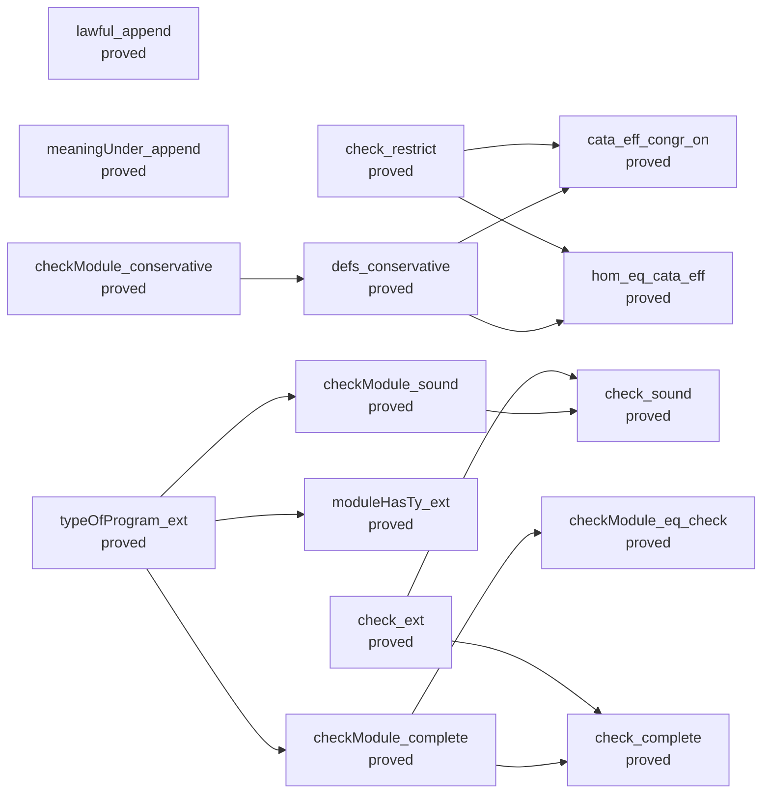
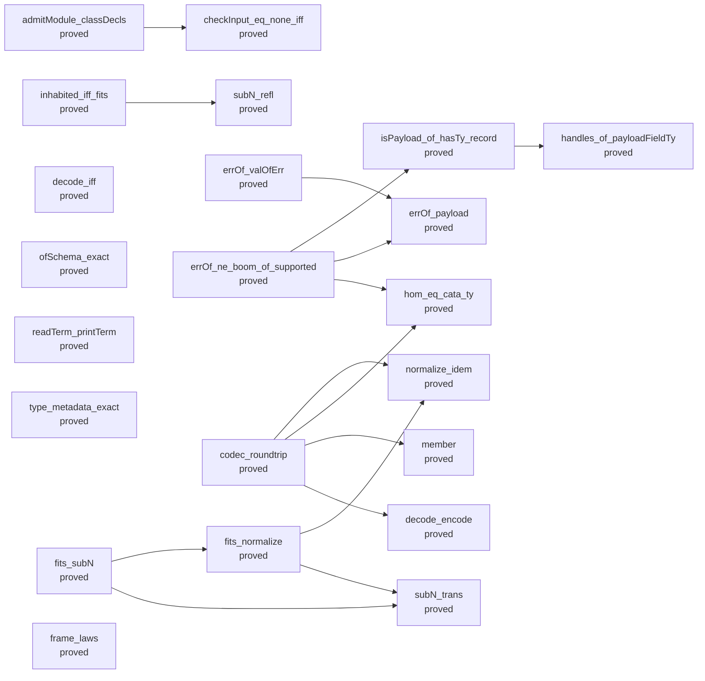
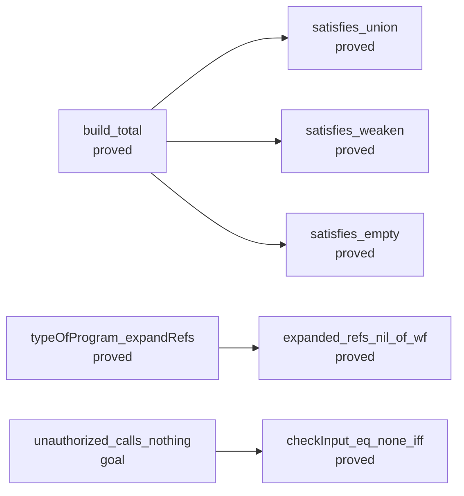
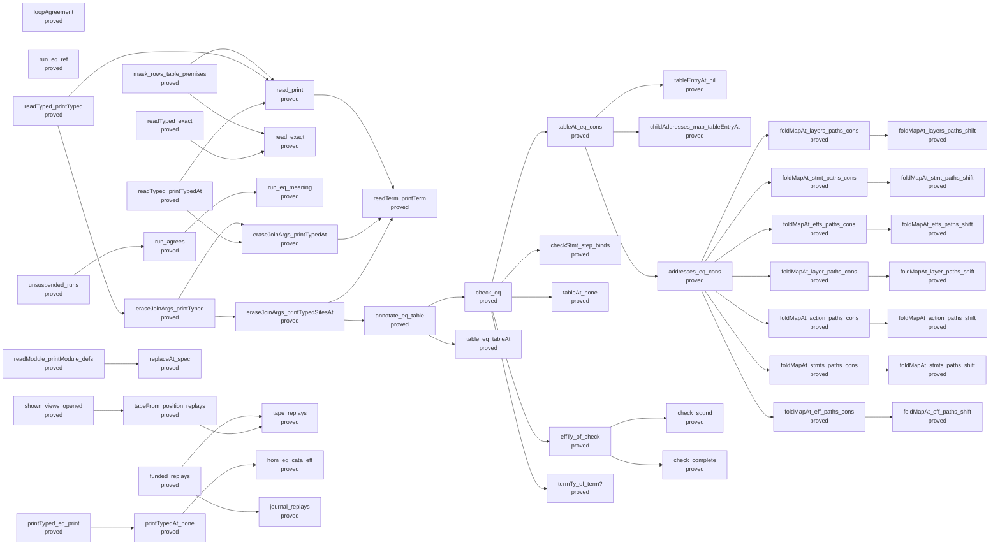
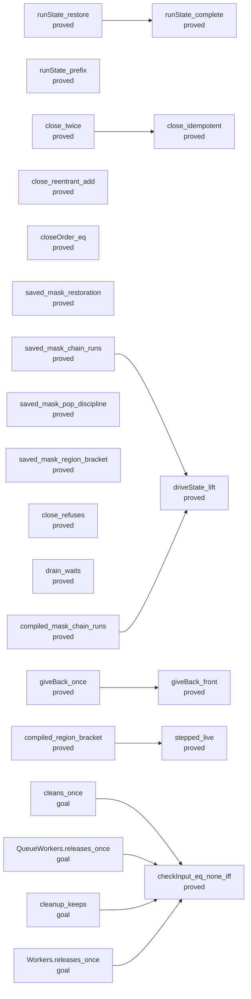
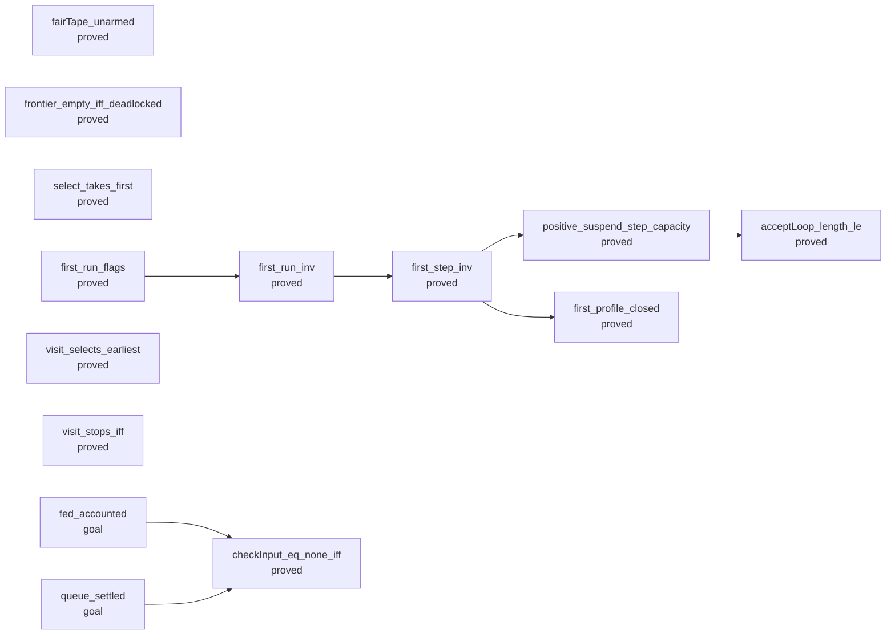
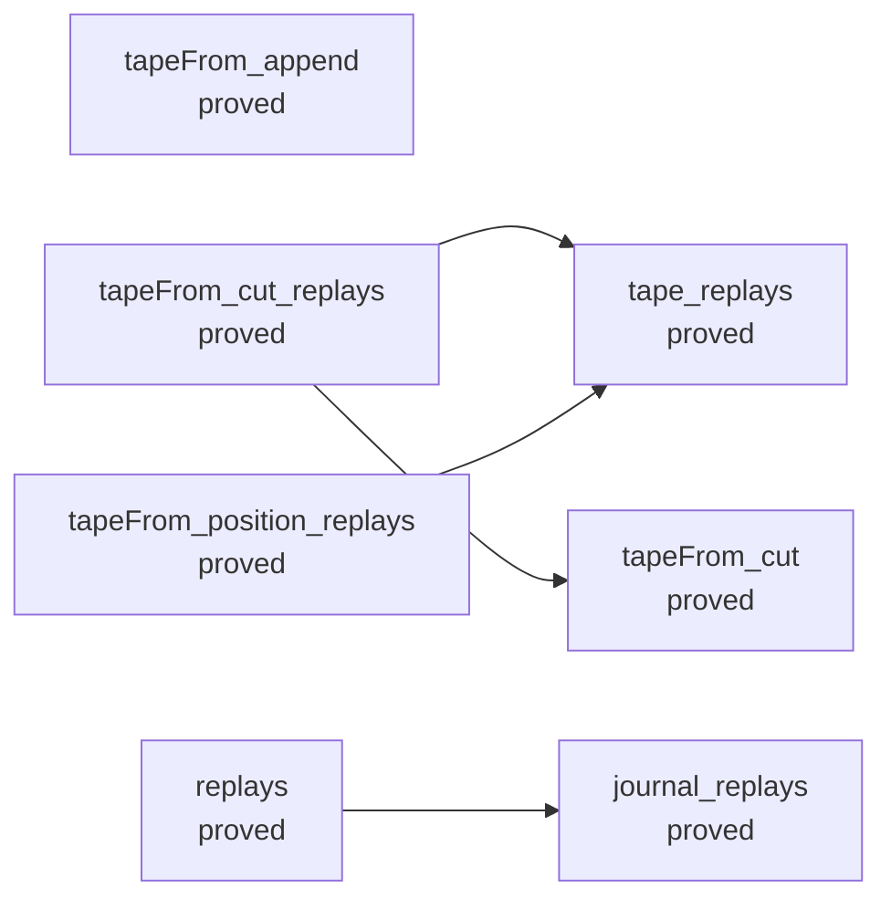

<!-- GENERATED by tools/Drivers/Semantics.lean (make gen-semantics); do not edit
format: effect4-semantics-report v6
command: make gen-semantics
inputs: tools/ProofGraph/Registry.lean, tools/Tools/Semantics.lean, tools/Drivers/Semantics.lean, tools/Tools/SemanticsDisplay.lean, src/Effect4/Laws/Auto/Semantics.lean, Test/Counterexamples/REGISTER.md, docs/core/decisions.md, lean-toolchain
-->
# Semantics evidence

Selected evidence only. English associations are authored; inherited placement is provisional. The semantic axiom ceiling is not a whole-library gate verdict.

## store-typing

Store Typing: World-indexed semantic value membership (Fits) and store typings

| Claim | Role | Status | Evidence | Evidence at the ceiling | Contested by |
| --- | --- | --- | --- | --- | --- |
| fits-mono | monotonicity | proved | Effect4.Program.Typed.fits_mono | yes |  |
| fits-subn | preservation | proved | Effect4.Program.Typed.fits_subN | yes |  |
| fits-normalize | compatibility | proved | Effect4.Program.Typed.fits_normalize | yes |  |
| fits-scope-inv | inversion | proved | Effect4.Program.Typed.fits_scope_inv | yes |  |
| term-maps-mono | monotonicity | proved | Effect4.Program.Typed.TermMaps.mono | yes |  |
| term-typed-maps | fundamentalProperty | proved | Effect4.Program.Typed.termMaps_of_typed | yes |  |
| fold-typed-atomic-update | compatibility | proved | Effect4.Program.Typed.fold_typed_atomic_update | yes |  |
| handle-identity-laws | canonicalForms | proved | Effect4.Program.Typed.handle_identity_laws | yes |  |
| saved-mask-image-membership | canonicalForms | proved | Effect4.Program.Typed.saved_mask_image_membership | yes |  |
| modeled-membership | compatibility | proved | Effect4.Schema.Model.member | yes |  |
| step-language-typed | compatibility | proved | Effect4.Modules.Step.typed | yes |  |
| store-safety | progress | absent | Machine safety is established by inductive configuration typing rather than operational progress (decisions row 139) | — |  |
| semaphore-profile-closed | preservation | proved | Effect4.Semaphore.Model.profile_closed | yes |  |
| waiting-wrapper-typed | compatibility | proved | Effect4.Modules.waitRetryAt_answers | yes |  |
| protected-form-typed | compatibility | proved | Effect4.Modules.protectedBy_has | yes |  |
| pool-use-typed | compatibility | proved | Effect4.Pool.use_types | yes |  |
| pool-make-typed | compatibility | proved | Effect4.Pool.make_types | yes |  |
| pool-close-typed | compatibility | proved | Effect4.Pool.close_answers | yes |  |
| pool-profile-closed | preservation | proved | Effect4.Pool.Model.profile_closed | yes |  |
| pool-lease-enrols | inversion | proved | Effect4.Pool.Model.lease_enrols_iff | yes |  |

### Printed statements

**fits-mono**

```lean
∀ {w w' : Effect4.Program.Typed.World},
  w.leHost w' →
    ∀ {ty : Effect4.Program.Ty} {v : Effect4.Machine.Val},
      Effect4.Program.Typed.Fits w v ty → Effect4.Program.Typed.Fits w' v ty
```

Literature: TAPL, §13.5, pp. 165–169 — proofTechnique

Literature: Ahmed2004, audit P1 — adaptedResult

**fits-subn**

```lean
∀ (w : Effect4.Program.Typed.World) {a b : Effect4.Program.Ty},
  Eq (a.subN b) Bool.true →
    ∀ (v : Effect4.Machine.Val), Effect4.Program.Typed.Fits w v a → Effect4.Program.Typed.Fits w v b
```

Literature: TAPL, §15.1, p. 181 — definitionUsed

**fits-normalize**

```lean
∀ (w : Effect4.Program.Typed.World) (t : Effect4.Program.Ty) (v : Effect4.Machine.Val),
  Iff (Effect4.Program.Typed.Fits w v t.normalize) (Effect4.Program.Typed.Fits w v t)
```

Literature: Castagna2024, audit P6 — adaptedResult

**fits-scope-inv**

```lean
∀ {w : Effect4.Program.Typed.World} {v : Effect4.Machine.Val},
  Effect4.Program.Typed.Fits w v Effect4.Program.Ty.scope →
    Exists fun sc =>
      And (Eq v (Effect4.Machine.Val.scopeHandle sc)) (Effect4.Program.Typed.ScopeLive w sc)
```

Literature: ATTAPL, ch. 3, pp. 87–136 — analogy

**term-maps-mono**

```lean
∀ {w w' : Effect4.Program.Typed.World} {f : Effect4.Program.Term} {env : List Effect4.Machine.Val}
  {A R : Effect4.Program.Ty},
  w.leHost w' →
    Effect4.Program.Typed.TermMaps w f env A R → Effect4.Program.Typed.TermMaps w' f env A R
```

Literature: Ahmed2004, audit P1 — adaptedResult

**term-typed-maps**

```lean
∀ {sig : Effect4.Program.Signature Effect4.Program.NativeOp},
  Eq sig.atomOf Effect4.Program.nativeAtomTy →
    ∀ {w : Effect4.Program.Typed.World} {tys : Effect4.Program.TyEnv}
      {env : List Effect4.Machine.Val},
      Effect4.Program.Typed.EnvTyped w tys env →
        ∀ {f : Effect4.Program.Term} {A R : Effect4.Program.Ty},
          Eq (Effect4.Program.termTy sig (instHAppendOfAppend.hAppend tys (List.cons A List.nil)) f)
              (Option.some R) →
            Effect4.Program.Typed.TermMaps w f env A R
```

Literature: Ahmed2004, audit P1 — adaptedResult

**fold-typed-atomic-update**

```lean
∀ (sig : Effect4.Program.Signature Effect4.Program.NativeOp),
  Effect4.Program.Typed.ListFoldRules sig
```

Literature: Ahmed2004, audit P1 — adaptedResult

**handle-identity-laws**

```lean
Effect4.Program.Typed.HandleIdentityLaws
```

Literature: Ahmed2004, audit P1 — analogy

**saved-mask-image-membership**

```lean
Effect4.Program.Typed.SavedMaskImage
```

**modeled-membership**

```lean
∀ (t : Effect4.Program.Ty),
  Eq (Effect4.Schema.Model.refusal t) Option.none →
    ∀ (x : Effect4.Schema.Model.Carrier t) (alloc : List String),
      Eq (Effect4.Program.Val.hasTy ((Effect4.Schema.Model.image t).toVal x) t alloc) Bool.true
```

**step-language-typed**

```lean
∀ {Γ : List Effect4.Program.Ty} {Op : Type} (sig : Effect4.Program.Signature Op),
  Eq sig.atomOf Effect4.Program.nativeAtomTy →
    ∀
      {src :
        {t : Effect4.Program.Ty} → Effect4.Modules.Input Γ t → Effect4.Program.Authoring.TermSrc}
      {env : Effect4.Program.Authoring.Env} {path : List Nat} {types : List Effect4.Program.Ty},
      (∀ {t : Effect4.Program.Ty} (x : Effect4.Modules.Input Γ t),
          Effect4.Modules.TypesEach sig (src x) env path types t) →
        ∀ {s : Effect4.Program.Ty} (e : Effect4.Modules.Step Γ s),
          e.Facts →
            autoParam (e.ScopeFacts env types.length) Effect4.Modules.Step.typed._auto_1 →
              Effect4.Modules.TypesEach sig (Effect4.Modules.Step.term (fun {t} => src) e) env path
                types s
```

Literature: TAPL, §13.5, pp. 165–169 — excludedFeature

**semaphore-profile-closed**

```lean
∀ (s : Effect4.Semaphore.Model.State) (op : Effect4.Semaphore.Model.Op),
  Effect4.Semaphore.Model.Profile s →
    Effect4.Semaphore.Model.Profile (Effect4.Semaphore.Model.step s op)
```

**waiting-wrapper-typed**

```lean
∀ {table : Effect4.Program.RowTable}
  {restore :
    Effect4.Program.Authoring.Src Effect4.Program.NativeOp →
      Effect4.Program.Authoring.Src Effect4.Program.NativeOp}
  {result : Effect4.Program.Ty} {ended : String} {w : Effect4.Modules.Waiter}
  {s : Effect4.Modules.TypedScope} {F : Effect4.Program.Ty},
  Eq result.normalize result →
    (∀ (t : Effect4.Modules.TypedScope)
        (inner : Effect4.Program.Authoring.Src Effect4.Program.NativeOp) (Y : Effect4.Program.Ty),
        s.Reaches t →
          Effect4.Modules.Answers (Effect4.Program.nativeSignature table) inner t Y →
            Effect4.Modules.Answers (Effect4.Program.nativeSignature table) (restore inner) t Y) →
      Effect4.Modules.Waiter.Typed table w s result F →
        Effect4.Modules.Answers (Effect4.Program.nativeSignature table)
          (Effect4.Modules.waitRetryAt restore result ended w) s result
```

**protected-form-typed**

```lean
∀ {table : Effect4.Program.RowTable}
  {acquire :
    (Effect4.Program.Authoring.Src Effect4.Program.NativeOp →
        Effect4.Program.Authoring.Src Effect4.Program.NativeOp) →
      Effect4.Program.Authoring.Src Effect4.Program.NativeOp}
  {release body :
    Effect4.Program.Authoring.TermSrc → Effect4.Program.Authoring.Src Effect4.Program.NativeOp}
  {s : Effect4.Modules.TypedScope} {G F : Effect4.Program.Ty} {b : Effect4.Program.EffTy},
  (∀
      (restore :
        Effect4.Program.Authoring.Src Effect4.Program.NativeOp →
          Effect4.Program.Authoring.Src Effect4.Program.NativeOp),
      (∀ (t : Effect4.Modules.TypedScope)
          (inner : Effect4.Program.Authoring.Src Effect4.Program.NativeOp) (Y : Effect4.Program.Ty),
          (s.push Effect4.Modules.Stem.restore Effect4.Program.Ty.maskRestore).Reaches t →
            Effect4.Modules.Answers (Effect4.Program.nativeSignature table) inner t Y →
              Effect4.Modules.Answers (Effect4.Program.nativeSignature table) (restore inner) t Y) →
        Effect4.Modules.Answers (Effect4.Program.nativeSignature table) (acquire restore)
          (s.push Effect4.Modules.Stem.restore Effect4.Program.Ty.maskRestore) G) →
    (∀ (got : Effect4.Program.Authoring.TermSrc),
        Effect4.Modules.Kept (Effect4.Program.nativeSignature table) got
            ((s.push Effect4.Modules.Stem.restore Effect4.Program.Ty.maskRestore).push
              Effect4.Modules.Stem.answer G)
            G →
          Effect4.Modules.Has (Effect4.Program.nativeSignature table) (body got)
            ((s.push Effect4.Modules.Stem.restore Effect4.Program.Ty.maskRestore).push
              Effect4.Modules.Stem.answer G)
            b) →
      (∀ (got : Effect4.Program.Authoring.TermSrc),
          Effect4.Modules.Kept (Effect4.Program.nativeSignature table) got
              ((s.push Effect4.Modules.Stem.restore Effect4.Program.Ty.maskRestore).push
                Effect4.Modules.Stem.answer G)
              G →
            Effect4.Modules.Answers (Effect4.Program.nativeSignature table) (release got)
              (((s.push Effect4.Modules.Stem.restore Effect4.Program.Ty.maskRestore).push
                    Effect4.Modules.Stem.answer G).push
                Effect4.Modules.Stem.exit (b.answer.exitOf b.error))
              F) →
        Effect4.Modules.Has (Effect4.Program.nativeSignature table)
          (Effect4.Modules.protectedBy acquire release body) s
          { answer := b.answer, error := b.error.normalize, requires := b.requires }
```

**pool-use-typed**

```lean
∀ {table : Effect4.Program.RowTable} {A : Effect4.Program.Ty},
  Effect4.Pool.Model.ResourceTy A →
    ∀ {pool : Effect4.Program.Authoring.TermSrc}
      {body :
        Effect4.Program.Authoring.TermSrc → Effect4.Program.Authoring.Src Effect4.Program.NativeOp}
      {s : Effect4.Modules.TypedScope} {b : Effect4.Program.EffTy},
      Effect4.Modules.Kept (Effect4.Program.nativeSignature table) pool s
          (Effect4.Pool.cellTy A).refOf →
        (∀ (t : Effect4.Modules.TypedScope) (r : Effect4.Program.Authoring.TermSrc),
            s.Reaches t →
              Effect4.Modules.Kept (Effect4.Program.nativeSignature table) r t A →
                Effect4.Modules.Has (Effect4.Program.nativeSignature table) (body r) t b) →
          Effect4.Modules.Has (Effect4.Program.nativeSignature table) (Effect4.Pool.use A pool body)
            s { answer := b.answer, error := b.error.normalize, requires := b.requires }
```

**pool-make-typed**

```lean
∀ {table : Effect4.Program.RowTable} {A : Effect4.Program.Ty},
  Effect4.Pool.Model.ResourceTy A →
    ∀ (size : Nat) (positive : instLTNat.lt 0 size)
      {acquire : Effect4.Program.Authoring.Src Effect4.Program.NativeOp}
      {s : Effect4.Modules.TypedScope} {a : Effect4.Program.EffTy},
      Eq a.answer A →
        (∀ (t : Effect4.Modules.TypedScope),
            s.Reaches t → Effect4.Modules.Has (Effect4.Program.nativeSignature table) acquire t a) →
          Effect4.Modules.Has (Effect4.Program.nativeSignature table)
            (Effect4.Pool.make A size acquire positive) s
            { answer := (Effect4.Pool.cellTy A).refOf, error := a.error.normalize,
              requires :=
                a.requires.union
                  (Effect4.Machine.Env.Requirement.single
                    (Effect4.Program.nativeSignature table).scopeKey) }
```

**pool-close-typed**

```lean
∀ {table : Effect4.Program.RowTable} {A : Effect4.Program.Ty},
  Effect4.Pool.Model.ResourceTy A →
    ∀ {pool : Effect4.Program.Authoring.TermSrc} {s : Effect4.Modules.TypedScope},
      Effect4.Modules.Kept (Effect4.Program.nativeSignature table) pool s
          (Effect4.Pool.cellTy A).refOf →
        Effect4.Modules.Answers (Effect4.Program.nativeSignature table) (Effect4.Pool.close pool) s
          Effect4.Program.Ty.unit
```

**pool-profile-closed**

```lean
∀ (s : Effect4.Pool.Model.State) (op : Effect4.Pool.Model.Op),
  Effect4.Pool.Model.Profile s → Effect4.Pool.Model.Profile (Effect4.Pool.Model.step s op)
```

**pool-lease-enrols**

```lean
∀ {s : Effect4.Pool.Model.State},
  Effect4.Pool.Model.Profile s →
    ∀ (id : Nat),
      Iff (List.instMembership.mem (Effect4.Pool.Model.lease s id).fst.waiters id)
        (And (Eq s.closing Bool.false)
          (∀ (it : Effect4.Pool.Model.Item),
            List.instMembership.mem s.items it → Eq it.borrowed Bool.true))
```

## residual-program-typing

Residual Program Typing: TypedProg, the protocol-indexed judgment on residual programs

| Claim | Role | Status | Evidence | Evidence at the ceiling | Contested by |
| --- | --- | --- | --- | --- | --- |
| instantiated-formation | compatibility | proved | Effect4.Program.rowTy_instantiated_formed | yes |  |
| seq-typed | compatibility | proved | Effect4.Program.Typed.seq_typed | yes |  |
| close-typed | preservation | proved | Effect4.Program.Typed.close_typed | yes |  |
| sound-at-app-signature | compatibility | proved | Effect4.Program.Denote.run_typed_app | yes |  |
| straight-meaning-typed | fundamentalProperty | proved | Effect4.Program.Denote.meaning_typed | yes |  |
| denote-typed | fundamentalProperty | proved | Effect4.Program.Typed.denotesTyped | yes | E4-TYPED-CE-020, E4-TYPED-CE-021, E4-TYPED-CE-022, E4-TYPED-CE-023, E4-TYPED-CE-031 |
| invocation-arm | fundamentalProperty | proved | Effect4.Program.Typed.call_arm | yes |  |
| rebuild-admission | compatibility | proved | Effect4.Program.Authoring.rebuild_spec | yes |  |
| denote-typed-layer-free | fundamentalProperty | proved | Effect4.Program.Typed.denotesTyped_of_layerFree | yes |  |
| load-typed-layer-free | preservation | proved | Effect4.Program.Typed.loadsTyped_of_layerFree | yes |  |
| provide-layer-arm | compatibility | proved | Effect4.Program.Typed.provideLayerArm | yes | E4-TYPED-CE-023, E4-TYPED-CE-031 |
| load-typed | preservation | proved | Effect4.Program.Typed.loadsTyped | yes |  |
| load-typed-checked | preservation | proved | Effect4.Program.Typed.load_typed | yes |  |
| bind-closed | compatibility | refuted | Test.Program.TypedProgBindRed.typedProg_not_bind_closed | yes |  |
| guard-bind-typed | compatibility | proved | Effect4.Program.Typed.guardBind_typed | yes |  |
| on-failure-typed | compatibility | proved | Effect4.Program.Typed.catchGuard_typed | yes |  |
| all-guard-typed | compatibility | proved | Effect4.Program.Typed.allGuard_typed | yes |  |
| on-exit-typed | compatibility | proved | Effect4.Program.Typed.onExit_typed | yes |  |
| scoped-body-substitution-boundary | compatibility | proved | Effect4.Program.Typed.scoped_body_substitution_boundary | yes |  |
| admitted-source-lawful | compatibility | proved | Effect4.Program.Typed.lawfulSig_of_admitted | yes | E4-TYPED-CE-041 |

### Printed statements

**instantiated-formation**

```lean
∀ {row : Effect4.Program.Row} {request : Effect4.Program.Ty} {use : Option Effect4.Program.TermUse}
  {ty : Effect4.Program.EffTy},
  Eq (Effect4.Program.rowTy row request use) (Option.some ty) →
    Exists fun σ =>
      Exists fun bindings =>
        And
          (Eq (Effect4.Program.Bounds.matchB List.nil row.request.normalize request.normalize)
            (Option.some σ))
          (And (Eq (Effect4.Program.bindTerm σ use) (Except.ok bindings))
            (Effect4.Program.Formation.Formed
              (Effect4.Program.Formation.instantiatedSites row bindings)))
```

**seq-typed**

```lean
∀ (root : Effect4.Program.Typed.ProgramSource) {w : Effect4.Program.Typed.World}
  {mid ty : Effect4.Program.EffTy} {a : Effect4.Program.Sched.RProgram}
  {k : Effect4.Machine.Val → Effect4.Program.Sched.RProgram},
  Effect4.Program.Typed.TypedProg root w mid a →
    (∀ (w' : Effect4.Program.Typed.World),
        w.leHost w' →
          ∀ (v : Effect4.Machine.Val),
            Effect4.Program.Typed.Fits w' v mid.answer →
              Effect4.Program.Typed.TypedProg root w' ty (k v)) →
      Eq mid.error ty.error →
        Effect4.Program.Typed.TypedProg root w ty
          (Effects.Program.bind
            (Effect4.Program.Sched.guardR Effect4.Program.Sched.GuardKind.onSuccess a)
            (Effect4.Program.Sched.seqR k))
```

Literature: ATTAPL, ch. 3, pp. 87–136 — adaptedResult

**close-typed**

```lean
∀ (root : Effect4.Program.Typed.ProgramSource) {w : Effect4.Program.Typed.World}
  {T : Effect4.Program.EffTy} {a : Effect4.Program.Sched.RProgram},
  Effect4.Program.Typed.TypedProg root w T a →
    ∀ (g : Effect4.Machine.ExitV → Effect4.Program.Sched.RProgram),
      Effect4.Program.Typed.TypedProg root w T
        (Effects.Program.bind a fun ex =>
          Effects.Program.vis (Sum.inr (Effect4.Program.Sched.FiberOp.unguard ex)) g)
```

Literature: deVilhenaPottier2021, audit P8 — proofTechnique

**sound-at-app-signature**

```lean
∀ (t : Effect4.Program.RowTable) (s : List (Prod Effect4.ServiceKey Effect4.Program.Ty)),
  (∀ (entry : Prod Effect4.ServiceKey Effect4.Program.Ty),
      List.instMembership.mem s entry → { rows := t }.FreshCode entry) →
    ∀ (e : Effect4.Program.NativeEff) (ty : Effect4.Program.EffTy) (fuel : Nat),
      Eq (Effect4.Program.Denote.Straight e) Bool.true →
        Eq (Effect4.Program.effTy { rows := t, services := s }.signature List.nil e)
            (Option.some ty) →
          instLENat.le (Effect4.Program.Agreement.depth e) fuel →
            instLENat.le (instHAdd.hAdd (instHMul.hMul 2 (Effect4.Program.Agreement.steps e)) 6)
                fuel →
              And (Eq (Effect4.Api.run e fuel).outcome Effect4.Api.Outcome.finished)
                (Exists fun ex =>
                  And (Eq (Effect4.Api.run e fuel).exit (Option.some ex))
                    (Effect4.Program.Denote.ExitHasTy ty.answer ty.error
                      (Effect4.Api.run e fuel).stores ex))
```

**straight-meaning-typed**

```lean
∀ (e : Effect4.Program.NativeEff) (t : Effect4.Program.EffTy),
  Eq (Effect4.Program.Denote.Straight e) Bool.true →
    Eq (Effect4.Program.effTy Effect4.Program.nativeSignature List.nil e) (Option.some t) →
      Effect4.Program.Denote.ExitHasTy t.answer t.error
        (Effect4.Program.Denote.meaning e List.nil Effect4.Machine.Stores.empty).snd
        (Effect4.Program.Denote.meaning e List.nil Effect4.Machine.Stores.empty).fst
```

**denote-typed**

```lean
∀ (root : Effect4.Program.Typed.ProgramSource), Effect4.Program.Typed.DenotesTyped root
```

Literature: XiaEtAl2020, audit P37 — definitionUsed

**invocation-arm**

```lean
∀ {root : Effect4.Program.Typed.ProgramSource} {w : Effect4.Program.Typed.World}
  {p : Effect4.Program.Point} {ty : Effect4.Program.EffTy} {k : Nat} {r : Effect4.Program.Term}
  {f : Nat},
  Eq p.fuel (instHAdd.hAdd f 1) →
    Eq ((Effect4.Program.Node.eff root.program).at_ p.path)
        (Option.some
          (Effect4.Program.Node.eff
            (Effect4.Program.Eff.perform (Effect4.Program.NativeOp.call k) r))) →
      Effect4.Program.Typed.PointTyped root w p ty →
        Eq w.serviceTy root.sig.serviceTy →
          Effect4.Program.Typed.BodiesTyped root →
            (∀ (c : Effect4.Program.NativeEff) (path : List Nat),
                Eq ((Effect4.Program.Node.eff root.program).at_ path)
                    (Option.some (Effect4.Program.Node.eff c)) →
                  Effect4.Program.Typed.ChildDenotes root f c path) →
              Effect4.Program.Typed.TypedProg root w ty
                (Effect4.Program.Sched.denoteR root.program
                  (Effect4.Program.Eff.perform (Effect4.Program.NativeOp.call k) r) p)
```

**rebuild-admission**

```lean
∀ {before after : Effect4.Api.Built} {candidate : Effect4.Api.Program},
  Eq (before.rebuild candidate) (Except.ok after) →
    And (Eq after.program candidate)
      (And (Eq after.table before.table) (Eq after.rowNames before.rowNames))
```

**denote-typed-layer-free**

```lean
∀ (root : Effect4.Program.Typed.ProgramSource),
  Effect4.Program.Typed.LayerFree root.program → Effect4.Program.Typed.DenotesTyped root
```

Literature: XiaEtAl2020, audit P37 — definitionUsed

**load-typed-layer-free**

```lean
∀ (root : Effect4.Program.Typed.ProgramSource) (rootTy : Effect4.Program.EffTy)
  (fuel compileFuel : Nat),
  Effect4.Program.Typed.LayerFree root.program →
    Effect4.Program.Typed.LoadsTyped root rootTy fuel compileFuel
```

**provide-layer-arm**

```lean
∀ (root : Effect4.Program.Typed.ProgramSource), Effect4.Program.Typed.ProvideLayerArm root
```

**load-typed**

```lean
∀ (root : Effect4.Program.Typed.ProgramSource) (rootTy : Effect4.Program.EffTy)
  (fuel compileFuel : Nat), Effect4.Program.Typed.LoadsTyped root rootTy fuel compileFuel
```

**load-typed-checked**

```lean
∀ (root : Effect4.Program.Typed.ProgramSource) (rootTy : Effect4.Program.EffTy)
  (fuel compileFuel : Nat),
  Eq (Effect4.Program.typeOfProgram root.sig.signature root.program) (Option.some rootTy) →
    Exists fun w =>
      Effect4.Program.Typed.MachineTyped root rootTy w
        (Effect4.Program.Sched.loadR root.program fuel compileFuel)
```

**bind-closed**

```lean
∀ (root : Effect4.Program.Typed.ProgramSource) (w : Effect4.Program.Typed.World),
  Exists fun mid =>
    Exists fun ty =>
      Exists fun p =>
        Exists fun k =>
          And (Effect4.Program.Typed.TypedProg root w mid p)
            (And
              (∀ (w' : Effect4.Program.Typed.World),
                w.leHost w' →
                  ∀ (ex : Effect4.Machine.ExitV),
                    Effect4.Program.Typed.ExitOk w' mid ex →
                      Effect4.Program.Typed.TypedProg root w' ty (k ex))
              (Not (Effect4.Program.Typed.TypedProg root w ty (Effects.Program.bind p k))))
```

Literature: deVilhenaPottier2021, audit P8 — excludedFeature

**guard-bind-typed**

```lean
∀ (root : Effect4.Program.Typed.ProgramSource) {w : Effect4.Program.Typed.World}
  {mid ty : Effect4.Program.EffTy} {kind : Effect4.Program.Sched.GuardKind}
  {a : Effect4.Program.Sched.RProgram} {K : Effect4.Machine.ExitV → Effect4.Program.Sched.RProgram},
  Effect4.Program.Typed.TypedProg root w mid a →
    (∀ (w' : Effect4.Program.Typed.World),
        w.leHost w' →
          ∀ (ex : Effect4.Machine.ExitV),
            Eq (kind.hasExitArm ex) Bool.true →
              Effect4.Program.Typed.ExitOk w' mid ex →
                Effect4.Program.Typed.TypedProg root w' ty (K ex)) →
      (∀ (w' : Effect4.Program.Typed.World),
          w.leHost w' →
            ∀ (ex : Effect4.Machine.ExitV),
              Effect4.Program.Typed.ExitOk w' mid ex →
                Eq (kind.hasExitArm ex) Bool.false → Effect4.Program.Typed.ExitOk w' ty ex) →
        Effect4.Program.Typed.TypedProg root w ty
          (Effects.Program.bind (Effect4.Program.Sched.guardR kind a) K)
```

**on-failure-typed**

```lean
∀ (root : Effect4.Program.Typed.ProgramSource) {w : Effect4.Program.Typed.World}
  {mid ty : Effect4.Program.EffTy} {a : Effect4.Program.Sched.RProgram}
  {K : Effect4.Machine.ExitV → Effect4.Program.Sched.RProgram},
  Effect4.Program.Typed.TypedProg root w mid a →
    Eq (mid.answer.subN ty.answer) Bool.true →
      (∀ (w' : Effect4.Program.Typed.World),
          w.leHost w' →
            ∀
              (c :
                Effect4.Cause Effect4.Machine.Err Effect4.Machine.Defect Effect4.FiberId
                  Effect4.Machine.Ann),
              Effect4.Program.Typed.ExitOk w' mid (Effect4.Exit.failure c) →
                Effect4.Program.Typed.TypedProg root w' ty (K (Effect4.Exit.failure c))) →
        Effect4.Program.Typed.TypedProg root w ty
          (Effects.Program.bind
            (Effect4.Program.Sched.guardR Effect4.Program.Sched.GuardKind.onFailure a) K)
```

**all-guard-typed**

```lean
∀ (root : Effect4.Program.Typed.ProgramSource) {w : Effect4.Program.Typed.World}
  {mid ty : Effect4.Program.EffTy} {kind : Effect4.Program.Sched.GuardKind},
  (∀ (ex : Effect4.Machine.ExitV), Eq (kind.hasExitArm ex) Bool.true) →
    ∀ {a : Effect4.Program.Sched.RProgram}
      {K : Effect4.Machine.ExitV → Effect4.Program.Sched.RProgram},
      Effect4.Program.Typed.TypedProg root w mid a →
        (∀ (w' : Effect4.Program.Typed.World),
            w.leHost w' →
              ∀ (ex : Effect4.Machine.ExitV),
                Effect4.Program.Typed.ExitOk w' mid ex →
                  Effect4.Program.Typed.TypedProg root w' ty (K ex)) →
          Effect4.Program.Typed.TypedProg root w ty
            (Effects.Program.bind (Effect4.Program.Sched.guardR kind a) K)
```

**on-exit-typed**

```lean
∀ (root : Effect4.Program.Typed.ProgramSource) {w : Effect4.Program.Typed.World}
  {b f ty : Effect4.Program.EffTy} {body : Effect4.Program.Sched.RProgram}
  {fin : Effect4.Machine.ExitV → Effect4.Program.Sched.RProgram} {flag : Bool},
  Eq (b.answer.subN ty.answer) Bool.true →
    Eq (b.error.subN ty.error) Bool.true →
      Eq (f.error.subN ty.error) Bool.true →
        Effect4.Program.Typed.TypedProg root w b body →
          (∀ (w' : Effect4.Program.Typed.World),
              w.leHost w' →
                ∀ (ex : Effect4.Machine.ExitV),
                  Effect4.Program.Typed.ExitOk w' b ex →
                    Effect4.Program.Typed.TypedProg root w' f (fin ex)) →
            Effect4.Program.Typed.TypedProg root w ty (Effect4.Program.Sched.onExitR body fin flag)
```

**scoped-body-substitution-boundary**

```lean
Effect4.Program.Typed.RestoreBodyBoundary
```

**admitted-source-lawful**

```lean
∀ {program : Effect4.Program.NativeEff} {app : Effect4.Program.SigApp}
  (a : Effect4.Program.AdmittedProgram program app), Effect4.Program.LawfulSig app
```

## scope-lifetime-finalization

Scope Lifetime & Finalization: Lifetimes, finalizer registration, and LIFO unwinding

| Claim | Role | Status | Evidence | Evidence at the ceiling | Contested by |
| --- | --- | --- | --- | --- | --- |
| close-idempotent | preservation | proved | Effect4.Scope.close_idempotent | yes |  |
| close-twice | preservation | proved | Effect4.Scope.close_twice | yes |  |
| close-order-eq | inversion | proved | Effect4.Scope.closeOrder_eq | yes |  |
| close-reentrant-add | preservation | proved | Effect4.Scope.close_reentrant_add | yes |  |
| close-seq-protocol | fundamentalProperty | proved | Test.Program.ProtocolPosts.CloseIter.closeSeq_protocol | yes |  |
| saved-mask-restoration | preservation | proved | Effect4.Program.Typed.saved_mask_restoration | yes |  |
| saved-mask-pop-discipline | preservation | proved | Effect4.Machine.saved_mask_pop_discipline | yes |  |
| saved-mask-chain-runs | preservation | proved | Effect4.Program.compiled_mask_chain_runs | yes |  |
| saved-mask-region-bracket | preservation | proved | Effect4.Program.compiled_region_bracket | yes |  |
| stepped-fiber-live | inversion | proved | Effect4.Program.stepped_live | yes |  |
| pool-return-front | inversion | proved | Effect4.Pool.Model.giveBack_front | yes |  |
| pool-return-once | inversion | proved | Effect4.Pool.Model.giveBack_once | yes |  |
| pool-close-refuses | inversion | proved | Effect4.Pool.Model.close_refuses | yes |  |
| pool-drain-waits | inversion | proved | Effect4.Pool.Model.drain_waits | yes |  |

### Printed statements

**close-idempotent**

```lean
∀ {κ φ : Type u} {β : Type v} {ε δ ι α : Type u}
  (run : φ → Effect4.Exit β ε δ ι α → Effect4.Exit Unit ε δ ι α)
  (self : Effect4.Scope κ φ β ε δ ι α) (exit : Effect4.Exit β ε δ ι α),
  Eq self.isClosed Bool.true →
    Eq (Effect4.Scope.close run self exit) { fst := self, snd := Effect4.Exit.void }
```

Literature: PFPL, ch. 28, §28.1, p. 261 — adaptedResult

**close-twice**

```lean
∀ {κ φ : Type u} {β : Type v} {ε δ ι α : Type u}
  (run : φ → Effect4.Exit β ε δ ι α → Effect4.Exit Unit ε δ ι α)
  (self : Effect4.Scope κ φ β ε δ ι α) (first second : Effect4.Exit β ε δ ι α),
  Eq (Effect4.Scope.close run (Effect4.Scope.close run self first).fst second)
    { fst := (Effect4.Scope.close run self first).fst, snd := Effect4.Exit.void }
```

**close-order-eq**

```lean
∀ {κ φ : Type u} {β : Type v} {ε δ ι α : Type u} (self : Effect4.Scope κ φ β ε δ ι α),
  Eq self.closeOrder (List.map Prod.snd self.finalizers).reverse
```

Literature: ATTAPL, ch. 3, pp. 87–136 — analogy

**close-reentrant-add**

```lean
∀ {κ φ : Type u} {β : Type v} {ε δ ι α : Type u} [inst : DecidableEq κ]
  (run : φ → Effect4.Exit β ε δ ι α → Effect4.Exit Unit ε δ ι α)
  (self : Effect4.Scope κ φ β ε δ ι α) (exit : Effect4.Exit β ε δ ι α) (key : κ) (finalizer : φ),
  Eq self.isClosed Bool.false →
    Eq (Effect4.Scope.addExit run (self.closeState exit) key finalizer)
      { fst := self.closeState exit, snd := run finalizer exit }
```

**close-seq-protocol**

```lean
∀ (root : Effect4.Program.Typed.ProgramSource) (ex : Effect4.Machine.ExitV)
  (remaining : List Effect4.Machine.FinName)
  (captured :
    List
      (Effect4.Reason Effect4.Machine.Err Effect4.Machine.Defect Effect4.FiberId
        Effect4.Machine.Ann))
  (w : Test.Program.ProtocolPosts.W),
  Test.Program.ProtocolPosts.CloseIter.CapturedOk captured →
    (∀ (w' : Effect4.Program.Typed.World),
        Effect4.Program.Typed.World.leHost w w' →
          ∀ (fin : Effect4.Machine.FinName),
            List.instMembership.mem remaining fin →
              Effect4.Program.Typed.TypedProg root w'
                (Effect4.Program.EffTy.pure Effect4.Program.Ty.unit)
                (Effect4.Program.Sched.denoteFin fin ex)) →
      Effect4.Program.Typed.IteratorProtocol root w
        (Effect4.Program.EffTy.pure (Effect4.Program.Ty.unit.exitOf Effect4.Program.Ty.never))
        (Effect4.Program.EffTy.pure Effect4.Program.Ty.unit)
        (Effect4.Program.EffName.store (Effect4.Machine.Name.closeSeq remaining ex captured))
```

Literature: deVilhenaPottier2021, audit P8 — adaptedResult

**saved-mask-restoration**

```lean
Effect4.Program.Typed.MaskRestoration
```

**saved-mask-pop-discipline**

```lean
∀ (ν σ : Type u) (β : Type v) (ε δ ι α : Type u) [inst : DecidableEq ε] [inst_1 : DecidableEq δ]
  [inst_2 : DecidableEq ι] [inst_3 : DecidableEq α], Effect4.Machine.MaskPopDiscipline ν σ β ε δ ι α
```

**saved-mask-chain-runs**

```lean
∀ (root : Effect4.Program.NativeEff) (table : Effect4.Program.RowTable) (fuel : Nat)
  (tape :
    List
      (Effect4.Machine.RunDecision Effect4.Program.EffName Effect4.Program.EffThunk
        Effect4.Machine.Val Effect4.Machine.Err Effect4.Machine.Defect Effect4.FiberId
        Effect4.Machine.Ann))
  (bases : List Bool)
  (m :
    Effect4.Machine.RunMachine Effect4.Program.EffName Effect4.Program.EffThunk Effect4.Machine.Val
      Effect4.Machine.Err Effect4.Machine.Defect Effect4.FiberId Effect4.Machine.Ann
      Effect4.Machine.Ctx Effect4.Machine.Stores),
  Effect4.Machine.MaskRuns bases m →
    Exists fun bases' =>
      And (bases.IsPrefix bases')
        (Effect4.Machine.MaskRuns bases'
          (Effect4.Machine.replayEval (Effect4.Program.interpOf root table) fuel tape m).machine)
```

**saved-mask-region-bracket**

```lean
∀ (p : Effect4.Program.NativeEff) (table : Effect4.Program.RowTable) {bases bases' : List Bool}
  {m m' : Effect4.Program.NativeMachine} {cmds cmds' : List Effect4.Program.Guard.NCmd},
  Effect4.Program.LoopCut p table bases m cmds →
    Effect4.Program.LoopCut p table bases' m' cmds' →
      bases.IsPrefix bases' →
        ∀ {c c' : Effect4.Program.Guard.NCmd},
          List.instMembership.mem cmds c →
            List.instMembership.mem cmds' c' →
              ∀ {id : Effect4.FiberId},
                Effect4.Machine.Steps id c →
                  Effect4.Machine.Steps id c' →
                    ∀ {f g : Effect4.Program.Guard.NFiber},
                      Eq (Effect4.Machine.RunMachine.fiber? m id) (Option.some f) →
                        Eq (Effect4.Machine.RunMachine.fiber? m' id) (Option.some g) →
                          ∀ {above : List Effect4.Program.NCode},
                            Eq
                                (g.frame
                                    (Effect4.Prim Effect4.Program.EffName Effect4.Program.EffThunk
                                      Effect4.Machine.Val Effect4.Machine.Err Effect4.Machine.Defect
                                      Effect4.FiberId Effect4.Machine.Ann)
                                    (Effect4.FrameFiber Effect4.Program.EffName
                                      Effect4.Program.EffThunk Effect4.Machine.Val
                                      Effect4.Machine.Err Effect4.Machine.Defect Effect4.FiberId
                                      Effect4.Machine.Ann)).stack
                                (instHAppendOfAppend.hAppend above
                                  (f.frame
                                      (Effect4.Prim Effect4.Program.EffName Effect4.Program.EffThunk
                                        Effect4.Machine.Val Effect4.Machine.Err
                                        Effect4.Machine.Defect Effect4.FiberId Effect4.Machine.Ann)
                                      (Effect4.FrameFiber Effect4.Program.EffName
                                        Effect4.Program.EffThunk Effect4.Machine.Val
                                        Effect4.Machine.Err Effect4.Machine.Defect Effect4.FiberId
                                        Effect4.Machine.Ann)).stack) →
                              ∀ (demand : Effect4.Arm) (skip : Bool)
                                (cause : Option Effect4.Machine.CauseV),
                                Eq
                                    (((g.frame
                                                (Effect4.Prim Effect4.Program.EffName
                                                  Effect4.Program.EffThunk Effect4.Machine.Val
                                                  Effect4.Machine.Err Effect4.Machine.Defect
                                                  Effect4.FiberId Effect4.Machine.Ann)
                                                (Effect4.FrameFiber Effect4.Program.EffName
                                                  Effect4.Program.EffThunk Effect4.Machine.Val
                                                  Effect4.Machine.Err Effect4.Machine.Defect
                                                  Effect4.FiberId Effect4.Machine.Ann)).own
                                            above).getCont
                                        demand skip cause).answer
                                    Effect4.ContAnswer.empty →
                                  (f.frame
                                        (Effect4.Prim Effect4.Program.EffName
                                          Effect4.Program.EffThunk Effect4.Machine.Val
                                          Effect4.Machine.Err Effect4.Machine.Defect Effect4.FiberId
                                          Effect4.Machine.Ann)
                                        (Effect4.FrameFiber Effect4.Program.EffName
                                          Effect4.Program.EffThunk Effect4.Machine.Val
                                          Effect4.Machine.Err Effect4.Machine.Defect Effect4.FiberId
                                          Effect4.Machine.Ann)).RegionEnds
                                    (g.frame
                                      (Effect4.Prim Effect4.Program.EffName Effect4.Program.EffThunk
                                        Effect4.Machine.Val Effect4.Machine.Err
                                        Effect4.Machine.Defect Effect4.FiberId Effect4.Machine.Ann)
                                      (Effect4.FrameFiber Effect4.Program.EffName
                                        Effect4.Program.EffThunk Effect4.Machine.Val
                                        Effect4.Machine.Err Effect4.Machine.Defect Effect4.FiberId
                                        Effect4.Machine.Ann))
                                    above demand skip cause
```

**stepped-fiber-live**

```lean
∀ (p : Effect4.Program.NativeEff) (table : Effect4.Program.RowTable)
  {m : Effect4.Program.NativeMachine} {cmds : List Effect4.Program.Guard.NCmd},
  Effect4.Program.Guard.GuardState m →
    Effect4.Program.Guard.GuardQueue p table m cmds →
      ∀ {c : Effect4.Program.Guard.NCmd},
        List.instMembership.mem cmds c →
          ∀ {id : Effect4.FiberId},
            Effect4.Machine.Steps id c →
              ∀ {f : Effect4.Program.Guard.NFiber},
                Eq (Effect4.Machine.RunMachine.fiber? m id) (Option.some f) →
                  Eq
                    (f.exit
                      (Effect4.Prim Effect4.Program.EffName Effect4.Program.EffThunk
                        Effect4.Machine.Val Effect4.Machine.Err Effect4.Machine.Defect
                        Effect4.FiberId Effect4.Machine.Ann)
                      (Effect4.FrameFiber Effect4.Program.EffName Effect4.Program.EffThunk
                        Effect4.Machine.Val Effect4.Machine.Err Effect4.Machine.Defect
                        Effect4.FiberId Effect4.Machine.Ann))
                    Option.none
```

**pool-return-front**

```lean
∀ {s : Effect4.Pool.Model.State} {i l : Nat},
  Eq (s.items.any fun x => x.heldBy i l) Bool.true →
    And (Eq (Effect4.Pool.Model.giveBack s i l).fst.available (List.cons i s.available))
      (And
        (Eq (Effect4.Pool.Model.giveBack s i l).snd
          { fst := Bool.true, snd := s.waiters.isEmpty.not })
        (And
          (Eq
            (List.map (fun it => { fst := it.stamp, snd := it.resource })
              (Effect4.Pool.Model.giveBack s i l).fst.items)
            (List.map (fun it => { fst := it.stamp, snd := it.resource }) s.items))
          (Eq ((Effect4.Pool.Model.giveBack s i l).fst.items.any fun x => x.heldBy i l)
            Bool.false)))
```

**pool-return-once**

```lean
∀ (s : Effect4.Pool.Model.State) (i l : Nat),
  Eq (Effect4.Pool.Model.giveBack (Effect4.Pool.Model.giveBack s i l).fst i l)
    { fst := (Effect4.Pool.Model.giveBack s i l).fst,
      snd := { fst := Bool.false, snd := Bool.false } }
```

**pool-close-refuses**

```lean
∀ (s : Effect4.Pool.Model.State),
  And (Eq (Effect4.Pool.Model.close s).fst.closing Bool.true)
    (And (Eq (Effect4.Pool.Model.close s).snd { fst := s.closing.not, snd := s.waiters.length })
      (∀ (id : Nat),
        Eq (Effect4.Pool.Model.lease (Effect4.Pool.Model.close s).fst id)
          { fst := Effect4.Pool.Model.withdraw (Effect4.Pool.Model.close s).fst id,
            snd := { fst := Bool.true, snd := Option.none } }))
```

**pool-drain-waits**

```lean
∀ (s : Effect4.Pool.Model.State) (id : Nat),
  And
    (Iff (Eq (Effect4.Pool.Model.drain s id).snd Bool.true)
      (Eq (Effect4.Pool.Model.leases s) List.nil))
    (And
      (Iff (List.instMembership.mem (Effect4.Pool.Model.drain s id).fst.waiters id)
        (Ne (Effect4.Pool.Model.leases s) List.nil))
      (Eq (Effect4.Pool.Model.drain s id).fst
        { items := s.items, available := s.available,
          waiters := (Effect4.Pool.Model.drain s id).fst.waiters, closing := s.closing,
          next := s.next }))
```

## reactive-scheduling

Reactive Scheduling: Multi-fiber execution, decision steps, and configuration invariants

| Claim | Role | Status | Evidence | Evidence at the ceiling | Contested by |
| --- | --- | --- | --- | --- | --- |
| machine-typed-not-halted | inversion | proved | Effect4.Program.Typed.machineTyped_not_halted | yes |  |
| flush-fair | fundamentalProperty | proved | Effect4.Machine.Scheduling.flush_fair | yes |  |
| step-loop-preserves | preservation | proved | Effect4.Program.Typed.loop_preserves | yes | E4-TYPED-CE-012, E4-TYPED-CE-025 |
| step-deliver-preserves | preservation | proved | Effect4.Program.Typed.deliver_preserves | yes | E4-TYPED-CE-025 |
| store-frame-typing | preservation | proved | Effect4.Program.Typed.configTyped_frame | yes |  |
| waiter-completion-typing | preservation | proved | Effect4.Program.Typed.completionStrong_await | yes |  |
| step-wake-preserves | preservation | proved | Effect4.Program.Typed.wake_preserves | yes | E4-TYPED-CE-026 |
| step-launch-preserves | preservation | proved | Effect4.Program.Typed.launch_preserves | yes | E4-TYPED-CE-029 |
| step-registration-done-preserves | preservation | proved | Effect4.Program.Typed.registrationDone_preserves | yes | E4-TYPED-CE-028 |
| drivestate-lift | simulation | proved | Effect4.Machine.Lift.driveState_lift | yes |  |
| typed-state-admitted | preservation | proved | Effect4.Program.Typed.reachable_typed | yes |  |
| run-work-selection | compatibility | proved | Effect4.Run.nextControl_spec | yes |  |
| scheduler-progress | progress | absent | Operational progress is an open obligation; machineTyped_not_halted provides an invariant consequence (stuck = none) without successor existence | — |  |
| fair-tape-drains-armed | adequacy | proved | Effect4.Machine.Scheduling.fairTape_unarmed | yes |  |
| frontier-names-work | inversion | proved | Effect4.Api.frontier_empty_iff_deadlocked | yes |  |
| decision-keeps-typed | preservation | proved | Effect4.Program.Typed.decision_preserves | yes |  |
| fair-scheduling | adequacy | absent | Weak fairness progress is open (R12; decisions row 86) | — |  |
| queue-step-capacity | preservation | proved | Effect4.Queue.Model.positive_suspend_step_capacity | yes |  |
| queue-first-profile-closed | preservation | proved | Effect4.Queue.Model.first_profile_closed | yes |  |
| semaphore-visit-selects-earliest | inversion | proved | Effect4.Semaphore.Model.visit_selects_earliest | yes |  |
| semaphore-visit-stops | inversion | proved | Effect4.Semaphore.Model.visit_stops_iff | yes |  |
| queue-first-step-invariant | preservation | proved | Effect4.Queue.Model.first_step_inv | yes |  |
| queue-first-run-flags | preservation | proved | Effect4.Queue.Model.first_run_flags | yes |  |
| pool-select-takes-first | inversion | proved | Effect4.Pool.Model.select_takes_first | yes |  |

### Printed statements

**machine-typed-not-halted**

```lean
∀ (root : Effect4.Program.Typed.ProgramSource) (rootTy : Effect4.Program.EffTy)
  (w : Effect4.Program.Typed.World) (m : Effect4.Program.Sched.RState)
  (why : Effect4.Machine.Stuck),
  Not (Effect4.Program.Typed.MachineTyped root rootTy w (Effect4.Machine.RunMachine.halt m why))
```

Literature: PFPL, ch. 28, §28.2, p. 263 — adaptedResult

**flush-fair**

```lean
∀ {ν σ : Type u} {β : Type v} {ε δ ι α χ : Type u} {St : Type (max u v)} [inst : DecidableEq ε]
  [inst_1 : DecidableEq δ] [inst_2 : DecidableEq ι] [inst_3 : DecidableEq α]
  (interp : Effect4.Machine.RunInterp ν σ β ε δ ι α χ St) (fuel rounds : Nat)
  (m : Effect4.Machine.RunMachine ν σ β ε δ ι α χ St),
  (m.armed (Effect4.Prim ν σ β ε δ ι α) (Effect4.FrameFiber ν σ β ε δ ι α)
        (Effect4.FrameEvent ν σ β ε δ ι α)).Nodup →
    Eq
        (Effect4.Machine.Scheduling.FlushReady interp fuel
          (m.armed (Effect4.Prim ν σ β ε δ ι α) (Effect4.FrameFiber ν σ β ε δ ι α)
              (Effect4.FrameEvent ν σ β ε δ ι α)).length
          m)
        Bool.true →
      instLENat.le
          (m.armed (Effect4.Prim ν σ β ε δ ι α) (Effect4.FrameFiber ν σ β ε δ ι α)
              (Effect4.FrameEvent ν σ β ε δ ι α)).length
          rounds →
        ∀ (owner : Effect4.FiberId),
          List.instMembership.mem
              (m.armed (Effect4.Prim ν σ β ε δ ι α) (Effect4.FrameFiber ν σ β ε δ ι α)
                (Effect4.FrameEvent ν σ β ε δ ι α))
              owner →
            Eq (Effect4.Machine.Scheduling.FiredWithin interp fuel rounds m owner) Bool.true
```

Literature: LynchVaandrager1995, audit C4 — proofTechnique

**step-loop-preserves**

```lean
∀ (root : Effect4.Program.Typed.ProgramSource) (rootTy : Effect4.Program.EffTy)
  (id : Effect4.FiberId) (y : Bool),
  Effect4.Program.Typed.StepPreserves root rootTy (Effect4.Machine.Cmd.loop id y)
```

Literature: WrightFelleisen1994, audit P36 — adaptedResult

**step-deliver-preserves**

```lean
∀ (root : Effect4.Program.Typed.ProgramSource) (rootTy : Effect4.Program.EffTy)
  (id : Effect4.FiberId) (y : Bool),
  Effect4.Program.Typed.StepPreserves root rootTy (Effect4.Machine.Cmd.deliver id y)
```

**store-frame-typing**

```lean
∀ {root : Effect4.Program.Typed.ProgramSource} {rootTy : Effect4.Program.EffTy}
  {w : Effect4.Program.Typed.World} {m : Effect4.Program.Sched.RState}
  {q : List Effect4.Program.Sched.RCmd},
  Effect4.Program.Typed.ConfigTyped root rootTy w m q →
    ∀ {s : Effect4.Machine.Stores},
      Effect4.Program.Typed.StoreFrame m.state s →
        s.WF →
          Effect4.Program.Typed.StoresOk (Effect4.Program.Typed.preds root)
              { ids := w.ids, state := s, Γ := w.Γ, «Π» := w.«Π», Ρ := w.Ρ, Θ := w.Θ,
                serviceTy := w.serviceTy }
              Effect4.Program.Typed.Expect.root s →
            List.instHasSubset.Subset
                (Effect4.Program.Guard.internalKeys
                  { fibers := m.fibers, races := m.races, nextId := m.nextId,
                    nextToken := m.nextToken, nextRace := m.nextRace,
                    middlewareInstalled := m.middlewareInstalled, armed := m.armed, state := s,
                    trace := m.trace, stuck := m.stuck, forks := m.forks })
                (Effect4.Program.Guard.internalKeys m) →
              (∀
                  (o :
                    Effect4.Machine.Owed
                      (Effect4.Machine.Completion Effect4.Machine.Val Effect4.Machine.Err
                        Effect4.Machine.Defect Effect4.FiberId Effect4.Machine.Ann)),
                  List.instMembership.mem
                      (s.deferreds.due
                        (Effect4.Machine.Completion Effect4.Machine.Val Effect4.Machine.Err
                          Effect4.Machine.Defect Effect4.FiberId Effect4.Machine.Ann))
                      o →
                    ∀ (owner : Effect4.FiberId) (priority : Nat),
                      Eq o.mode (Effect4.Machine.WakeMode.scheduled owner priority) →
                        Eq (Effect4.Machine.RunMachine.fiber? m owner).isSome Bool.true) →
                And
                  (w.leHost
                    { ids := w.ids, state := s, Γ := w.Γ, «Π» := w.«Π», Ρ := w.Ρ, Θ := w.Θ,
                      serviceTy := w.serviceTy })
                  (Effect4.Program.Typed.ConfigTyped root rootTy
                    { ids := w.ids, state := s, Γ := w.Γ, «Π» := w.«Π», Ρ := w.Ρ, Θ := w.Θ,
                      serviceTy := w.serviceTy }
                    { fibers := m.fibers, races := m.races, nextId := m.nextId,
                      nextToken := m.nextToken, nextRace := m.nextRace,
                      middlewareInstalled := m.middlewareInstalled, armed := m.armed, state := s,
                      trace := m.trace, stuck := m.stuck, forks := m.forks }
                    q)
```

Literature: deVilhenaPottier2021, §4.2.4 (frame rule); audit P8 — analogy

**waiter-completion-typing**

```lean
∀ {w : Effect4.Program.Typed.World} {a e : Effect4.Program.Ty} {ty : Effect4.Program.EffTy}
  {c :
    Effect4.Machine.Completion Effect4.Machine.Val Effect4.Machine.Err Effect4.Machine.Defect
      Effect4.FiberId Effect4.Machine.Ann},
  Effect4.Program.Typed.AwaitDemand a e ty →
    Effect4.Program.Typed.CompletionStrong w
        { answer := a, error := e, requires := Effect4.Machine.Env.Requirement.empty } c →
      Effect4.Program.Typed.CompletionStrong w ty c
```

Literature: deVilhenaPottier2021, §3.3 (protocol subsumption); audit P8 — proofTechnique

**step-wake-preserves**

```lean
∀ (root : Effect4.Program.Typed.ProgramSource) (rootTy : Effect4.Program.EffTy)
  (list : Effect4.Machine.WakeKey) (phase : Effect4.Machine.WakePhase),
  Effect4.Program.Typed.StepPreserves root rootTy (Effect4.Machine.Cmd.wake list phase)
```

Literature: LynchVaandrager1995, §6 (invariants); audit C4 — proofTechnique

**step-launch-preserves**

```lean
∀ (root : Effect4.Program.Typed.ProgramSource) (rootTy : Effect4.Program.EffTy) (raceId : Nat),
  Effect4.Program.Typed.StepPreserves root rootTy (Effect4.Machine.Cmd.launch raceId)
```

**step-registration-done-preserves**

```lean
∀ (root : Effect4.Program.Typed.ProgramSource) (rootTy : Effect4.Program.EffTy) (raceId : Nat)
  (yielding : Bool),
  Effect4.Program.Typed.StepPreserves root rootTy
    (Effect4.Machine.Cmd.registrationDone raceId yielding)
```

**drivestate-lift**

```lean
∀ {ν σ : Type u} {β : Type v} {ε δ ι α χ : Type u} {St : Type (max u v)} [inst : DecidableEq ε]
  [inst_1 : DecidableEq δ] [inst_2 : DecidableEq ι] [inst_3 : DecidableEq α]
  {κ φ η : Type (max u v)} [inst_4 : Effect4.Machine.FiberCore ν β ε δ ι α κ φ]
  [inst_5 : Effect4.Machine.FiberEvaluator ν σ β ε δ ι α χ St κ φ η] {W : Type w}
  (o : Effect4.Laws.Effects.WorldOrder W) (interp : Effect4.Machine.RunInterp ν σ β ε δ ι α χ St κ)
  (I :
    W →
      Effect4.Machine.RunMachine ν σ β ε δ ι α χ St κ φ η →
        List (Effect4.Machine.Cmd ν σ β ε δ ι α κ) → Prop),
  Effect4.Machine.Lift.StepKeeps o interp I →
    ∀ (fuel : Nat) (w : W) (m : Effect4.Machine.RunMachine ν σ β ε δ ι α χ St κ φ η)
      (cmds : List (Effect4.Machine.Cmd ν σ β ε δ ι α κ)),
      I w m cmds →
        Exists fun w' =>
          And (o.le w w')
            (I w' (Effect4.Machine.driveState interp fuel m cmds).fst
              (Effect4.Machine.driveState interp fuel m cmds).snd)
```

Literature: PFPL, ch. 28, pp. 261–268 — proofTechnique

**typed-state-admitted**

```lean
∀ (root : Effect4.Program.Typed.ProgramSource) (rootTy : Effect4.Program.EffTy) (fuel : Nat),
  Eq (Effect4.Program.typeOfProgram root.sig.signature root.program) (Option.some rootTy) →
    ∀ (tape : List Effect4.Api.Decision),
      Effect4.Program.Typed.AdmittedTape root rootTy fuel tape →
        Exists fun w =>
          Effect4.Program.Typed.MachineTyped root rootTy w
            (Effect4.Machine.ReplayResult.machine
              (Effect4.Program.Sched.replayR root.program fuel tape))
```

**run-work-selection**

```lean
∀ (s : Effect4.Run) (decision : Effect4.Api.Decision),
  Iff (Eq s.nextControl (Option.some decision))
    (And
      (Eq
        (s.machine.stuck
          (Effect4.Prim Effect4.Program.EffName Effect4.Program.EffThunk Effect4.Machine.Val
            Effect4.Machine.Err Effect4.Machine.Defect Effect4.FiberId Effect4.Machine.Ann)
          (Effect4.FrameFiber Effect4.Program.EffName Effect4.Program.EffThunk Effect4.Machine.Val
            Effect4.Machine.Err Effect4.Machine.Defect Effect4.FiberId Effect4.Machine.Ann)
          (Effect4.FrameEvent Effect4.Program.EffName Effect4.Program.EffThunk Effect4.Machine.Val
            Effect4.Machine.Err Effect4.Machine.Defect Effect4.FiberId Effect4.Machine.Ann))
        Option.none)
      (Or (And (Eq decision Effect4.Api.flush) (Ne s.work.queued List.nil))
        (Exists fun fiber =>
          And (Eq decision (Effect4.Machine.RunDecision.evaluate fiber))
            (And (Eq s.work.queued List.nil) (Eq s.work.runnable.head? (Option.some fiber))))))
```

**fair-tape-drains-armed**

```lean
∀ {ν σ : Type u} {β : Type v} {ε δ ι α χ : Type u} {St : Type (max u v)} [inst : DecidableEq ε]
  [inst_1 : DecidableEq δ] [inst_2 : DecidableEq ι] [inst_3 : DecidableEq α]
  (interp : Effect4.Machine.RunInterp ν σ β ε δ ι α χ St) (fuel : Nat)
  (m : Effect4.Machine.RunMachine ν σ β ε δ ι α χ St)
  (tape : List (Effect4.Machine.RunDecision ν σ β ε δ ι α)),
  Effect4.Machine.Scheduling.FairTape interp fuel m tape →
    Eq (Effect4.Machine.Suffices interp fuel tape m) Bool.true →
      Eq
          ((Effect4.Machine.replayEval interp fuel tape m).machine.stuck
            (Effect4.Prim ν σ β ε δ ι α) (Effect4.FrameFiber ν σ β ε δ ι α)
            (Effect4.FrameEvent ν σ β ε δ ι α))
          Option.none →
        Eq
          ((Effect4.Machine.replayEval interp fuel tape m).machine.armed
            (Effect4.Prim ν σ β ε δ ι α) (Effect4.FrameFiber ν σ β ε δ ι α)
            (Effect4.FrameEvent ν σ β ε δ ι α))
          List.nil
```

**frontier-names-work**

```lean
∀ (m : Effect4.Program.NativeMachine),
  Eq
      (m.stuck
        (Effect4.Prim Effect4.Program.EffName Effect4.Program.EffThunk Effect4.Machine.Val
          Effect4.Machine.Err Effect4.Machine.Defect Effect4.FiberId Effect4.Machine.Ann)
        (Effect4.FrameFiber Effect4.Program.EffName Effect4.Program.EffThunk Effect4.Machine.Val
          Effect4.Machine.Err Effect4.Machine.Defect Effect4.FiberId Effect4.Machine.Ann)
        (Effect4.FrameEvent Effect4.Program.EffName Effect4.Program.EffThunk Effect4.Machine.Val
          Effect4.Machine.Err Effect4.Machine.Defect Effect4.FiberId Effect4.Machine.Ann))
      Option.none →
    Eq (Effect4.Machine.RunMachine.finished m) Bool.false →
      Iff (Eq (Effect4.Api.frontierReasons Effect4.Machine.Exhaustion.tape m) List.nil)
        (Effect4.Api.Deadlocked m)
```

**decision-keeps-typed**

```lean
∀ (root : Effect4.Program.Typed.ProgramSource) (rootTy : Effect4.Program.EffTy) (fuel : Nat)
  (d : Effect4.Api.Decision), Effect4.Program.Typed.DecisionKeeps root rootTy fuel d
```

Literature: PFPL, chs. 39–41, pp. 371–406 — excludedFeature

**queue-step-capacity**

```lean
∀ (c : Nat) (s : Effect4.Queue.Model.State) (op : Effect4.Queue.Model.Op),
  instLTNat.lt 0 c →
    Eq s.capacity (Option.some c) →
      Eq s.strategy Effect4.Queue.Model.Strategy.suspend →
        instLENat.le s.messages.length c →
          have next := (Effect4.Queue.Model.step Effect4.Queue.Model.Fault.none { s := s } op).s;
          And (Eq next.capacity (Option.some c))
            (And (Eq next.strategy Effect4.Queue.Model.Strategy.suspend)
              (instLENat.le next.messages.length c))
```

**queue-first-profile-closed**

```lean
∀ (s : Effect4.Queue.Model.State) (op : Effect4.Queue.Model.Op),
  Effect4.Queue.Model.FirstProfile s →
    Eq (Effect4.Queue.Model.firstOp op) Bool.true →
      Effect4.Queue.Model.Requested s op →
        Effect4.Queue.Model.FirstProfile
          (Effect4.Queue.Model.step Effect4.Queue.Model.Fault.none { s := s } op).s
```

**semaphore-visit-selects-earliest**

```lean
∀ {s : Effect4.Semaphore.Model.State},
  Effect4.Semaphore.Model.Profile s →
    ∀ {cursor : Nat} {w : Effect4.Semaphore.Model.Waiter},
      Eq (Effect4.Semaphore.Model.visit s cursor).snd (Option.some w) →
        And (List.instMembership.mem s.waiters w)
          (And (instLENat.le cursor w.stamp)
            (And (instLENat.le w.need (Effect4.Semaphore.Model.free s))
              (And
                (∀ (u : Effect4.Semaphore.Model.Waiter),
                  List.instMembership.mem s.waiters u →
                    instLENat.le cursor u.stamp →
                      instLENat.le u.need (Effect4.Semaphore.Model.free s) →
                        instLENat.le w.stamp u.stamp)
                (Eq (Effect4.Semaphore.Model.visit s cursor).fst
                  { permits := s.permits, taken := s.taken, waiters := s.waiters.erase w,
                    next := s.next }))))
```

**semaphore-visit-stops**

```lean
∀ (s : Effect4.Semaphore.Model.State) (cursor : Nat),
  And
    (Iff (Eq (Effect4.Semaphore.Model.visit s cursor).snd Option.none)
      (Or (Eq (Effect4.Semaphore.Model.free s) 0)
        (∀ (u : Effect4.Semaphore.Model.Waiter),
          List.instMembership.mem s.waiters u →
            instLENat.le cursor u.stamp → instLTNat.lt (Effect4.Semaphore.Model.free s) u.need)))
    (Eq (Effect4.Semaphore.Model.visit s cursor).snd Option.none →
      Eq (Effect4.Semaphore.Model.visit s cursor).fst s)
```

**queue-first-step-invariant**

```lean
∀ (r : Effect4.Queue.Model.Run) (op : Effect4.Queue.Model.Op),
  Effect4.Queue.Model.FirstRunInv r →
    Eq (Effect4.Queue.Model.firstOp op) Bool.true →
      Effect4.Queue.Model.Requested r.s op →
        Effect4.Queue.Model.FirstRunInv
          (Effect4.Queue.Model.step Effect4.Queue.Model.Fault.none r op)
```

**queue-first-run-flags**

```lean
∀ (c : Nat) (ops : List Effect4.Queue.Model.Op),
  Effect4.Queue.Model.FirstOps { s := { capacity := Option.some (instHAdd.hAdd c 1) } } ops →
    And
      (Eq
        (List.foldl (Effect4.Queue.Model.step Effect4.Queue.Model.Fault.none)
            { s := { capacity := Option.some (instHAdd.hAdd c 1) } } ops).ok
        Bool.true)
      (Eq
        (List.foldl (Effect4.Queue.Model.step Effect4.Queue.Model.Fault.none)
            { s := { capacity := Option.some (instHAdd.hAdd c 1) } } ops).named
        Bool.true)
```

**pool-select-takes-first**

```lean
∀ (s : Effect4.Pool.Model.State) (count : Nat),
  And
    (Eq
      (instHAppendOfAppend.hAppend (Effect4.Pool.Model.select s count).snd
        (Effect4.Pool.Model.select s count).fst.waiters)
      s.waiters)
    (And (Eq (Effect4.Pool.Model.select s count).snd.length (instMinNat.min count s.waiters.length))
      (Eq (Effect4.Pool.Model.select s count).fst
        { items := s.items, available := s.available, waiters := List.drop count s.waiters,
          closing := s.closing, next := s.next }))
```

## exact-codecs

Exact Codecs: Invertible embeddings for JSON and Schema representations

| Claim | Role | Status | Evidence | Evidence at the ceiling | Contested by |
| --- | --- | --- | --- | --- | --- |
| type-metadata-exact | compatibility | proved | Effect4.Codegen.Metadata.type_metadata_exact | yes |  |
| decode-iff | decidability | proved | Effect4.Schema.decode_iff | yes |  |
| decode-encode | compatibility | proved | Effect4.Schema.decode_encode | yes |  |
| of-schema-exact | compatibility | proved | Effect4.Schema.Bridge.ofSchema_exact | yes |  |
| of-schema-schema | compatibility | proved | Effect4.Schema.Bridge.ofSchema_schema | yes |  |
| collection-term-print-read | compatibility | proved | Effect4.Program.readTerm_printTerm | yes |  |
| record-codec-layout | compatibility | proved | Effect4.Schema.decode_iff | yes |  |
| service-identifier-injective | compatibility | proved | Effect4.Program.keyIdentifier_injective | yes |  |
| error-payload-exact | compatibility | proved | Effect4.Program.errOf_valOfErr | yes |  |
| payload-class-decl-exact | compatibility | proved | Effect4.Codegen.admitModule_classDecls | yes |  |
| mask-rows-table-premises | compatibility | proved | Effect4.Program.mask_rows_table_premises | yes |  |
| typed-print-connector | compatibility | proved | Effect4.Program.printTyped_eq_print | yes |  |
| typed-print-erasure | compatibility | proved | Effect4.Codegen.eraseJoinArgs_printTyped | yes |  |
| typed-print-read | compatibility | proved | Effect4.Codegen.readTyped_printTyped | yes |  |
| module-defs-round-trip | compatibility | proved | Effect4.Program.readModule_printModule_defs | yes |  |
| modeled-codec | compatibility | proved | Effect4.Schema.Modeled.codec_roundtrip | yes |  |
| record-field-laws | compatibility | proved | Effect4.Schema.FieldRef.frame_laws | yes |  |

### Printed statements

**type-metadata-exact**

```lean
And
  (∀ (t : Effect4.Program.Ty),
    Eq (Effect4.Codegen.Metadata.readTy (Effect4.Codegen.Metadata.writeTy t)) (Option.some t))
  (∀ (e : TypeScript.Expr) (t : Effect4.Program.Ty),
    Eq (Effect4.Codegen.Metadata.readTy e) (Option.some t) →
      Eq (Effect4.Codegen.Metadata.writeTy t) e)
```

**decode-iff**

```lean
∀ {t : Effect4.Program.Ty} {j : Effect4.Json} {v : Effect4.Machine.Val},
  Iff (Eq (Effect4.Schema.decode t j) (Option.some v))
    (Exists fun j' =>
      And (Eq (Effect4.Schema.encode t v) (Option.some j'))
        (Eq (Effect4.Schema.Codec.normJ j') (Effect4.Schema.Codec.normJ j)))
```

Literature: RendelOstermann2010, audit P32 — definitionUsed

**decode-encode**

```lean
∀ {t : Effect4.Program.CTy} {v : Effect4.Machine.Val},
  Eq (Effect4.Program.Val.hasTy v t.toRaw) Bool.true →
    Eq (t.toRaw.isCodecValue v) Bool.true →
      Eq ((Effect4.Schema.encode t.toRaw v).bind (Effect4.Schema.decode t.toRaw)) (Option.some v)
```

Literature: FosterEtAl2007, audit P11 — adaptedResult

**of-schema-exact**

```lean
∀ (r : Effect4.Representation) (t : Effect4.Program.Ty),
  Eq (Effect4.Schema.Bridge.ofSchema r) (Option.some t) →
    Eq (Effect4.Schema.Bridge.normS r) (Effect4.Schema.Bridge.schema t)
```

Literature: RendelOstermann2010, audit P32 — adaptedResult

**of-schema-schema**

```lean
∀ (t : Effect4.Program.Ty),
  Eq t.closed Bool.true →
    Eq (Effect4.Schema.Bridge.reservedFree t) Bool.true →
      Eq (Effect4.Schema.Bridge.ofSchema (Effect4.Schema.Bridge.schema t)) (Option.some t)
```

**collection-term-print-read**

```lean
∀ {classes : Effect4.Codegen.Classes.Classes} {n : Nat} (t : Effect4.Program.Term),
  Eq (Effect4.Program.Term.scoped n t) Bool.true →
    Eq (Effect4.Program.Term.covers classes t) Bool.true →
      Eq t.unannotated Bool.true →
        Eq (Effect4.Program.readTerm classes n (Effect4.Program.printTerm n t)) (Except.ok t)
```

**record-codec-layout**

```lean
∀ {t : Effect4.Program.Ty} {j : Effect4.Json} {v : Effect4.Machine.Val},
  Iff (Eq (Effect4.Schema.decode t j) (Option.some v))
    (Exists fun j' =>
      And (Eq (Effect4.Schema.encode t v) (Option.some j'))
        (Eq (Effect4.Schema.Codec.normJ j') (Effect4.Schema.Codec.normJ j)))
```

**service-identifier-injective**

```lean
∀ (scopeKey : Effect4.ServiceKey), Function.Injective (Effect4.Program.keyIdentifier scopeKey)
```

**error-payload-exact**

```lean
∀ (e : Effect4.Machine.Err) (v : Effect4.Machine.Val),
  Eq (Effect4.Program.valOfErr e) (Option.some v) → Eq (Effect4.Program.errOf v) e
```

**payload-class-decl-exact**

```lean
∀ {table : Effect4.Program.RowTable} {name : String}
  {allowed : List Effect4.Codegen.Bindings.Origin} {ambient : List TypeScript.Import}
  {module : TypeScript.Module} {r : Effect4.Codegen.ModuleReading table name allowed ambient},
  Eq (Effect4.Codegen.admitModule name module table allowed ambient) (Except.ok r) →
    Eq (Effect4.Program.splitClasses module.decls).fst r.classDecls
```

**mask-rows-table-premises**

```lean
Effect4.Program.MaskRowsPremises
```

**typed-print-connector**

```lean
∀ {Op : Type} (s : Effect4.Program.Signature Op) (env0 : Effect4.Program.TyEnv)
  (p : Effect4.Program.Eff Op),
  Effect4.Program.NoJoin s env0 p →
    Eq (Effect4.Program.printTyped s env0 p) (Effect4.Program.print s (List.length env0) p)
```

**typed-print-erasure**

```lean
∀ {Op : Type} {classes : Effect4.Codegen.Classes.Classes} {sig : Effect4.Program.Signature Op}
  {spell : String → List String → Option Op},
  Effect4.Program.LawfulSpelling sig spell →
    ∀ {env0 : Effect4.Program.TyEnv} {e : Effect4.Program.Eff Op},
      Eq (Effect4.Program.Readable classes sig (List.length env0) e) Bool.true →
        ∀ {x : TypeScript.Expr},
          Eq (Effect4.Program.printTyped sig env0 e) (Except.ok x) →
            Eq (Effect4.Program.print sig (List.length env0) e)
              (Except.ok (Effect4.Codegen.eraseJoinArgs classes sig spell (List.length env0) x))
```

**typed-print-read**

```lean
∀ {Op : Type} {classes : Effect4.Codegen.Classes.Classes} {sig : Effect4.Program.Signature Op}
  {spell : String → List String → Option Op},
  Effect4.Program.LawfulSpelling sig spell →
    ∀ {env0 : Effect4.Program.TyEnv} {e : Effect4.Program.Eff Op},
      Eq (Effect4.Program.Readable classes sig (List.length env0) e) Bool.true →
        ∀ {x : TypeScript.Expr},
          Eq (Effect4.Program.printTyped sig env0 e) (Except.ok x) →
            Eq (Effect4.Codegen.readTyped classes sig spell (List.length env0) x) (Except.ok e)
```

**module-defs-round-trip**

```lean
∀ {Op : Type} {classes : Effect4.Codegen.Classes.Classes} {sig : Effect4.Program.Signature Op}
  {spell : String → List String → Option Op} {call : Nat → Op}
  {root main body : Effect4.Program.Eff Op} {defs : List Effect4.Program.DefDecl}
  {bodies : Effect4.Program.Effs Op}
  {history : List (Prod (List Nat) (Effect4.Program.LayerTerm Op))},
  Eq root.hoistAll (Except.ok { fst := main, snd := history }) →
    Eq main.block? (Option.some { fst := defs, snd := { fst := bodies, snd := body } }) →
      ∀ {classDecls : List TypeScript.ClassDecl},
        Eq (Effect4.Codegen.Classes.readClassDecls classDecls) (Option.some classes) →
          (∀ (d : Effect4.Program.DefDecl),
              List.instMembership.mem defs d → Eq d.readable Bool.true) →
            (∀ (b : Effect4.Program.Eff Op),
                List.instMembership.mem bodies.toList b →
                  Effect4.Program.ReadsBack classes (sig.withDefs defs)
                    (Effect4.Program.defsSpell call defs spell) 1 b.suspend) →
              Effect4.Program.ReadsBack classes (sig.withDefs defs)
                  (Effect4.Program.defsSpell call defs spell) 0 body →
                (∀ (entry : Prod (List Nat) (Effect4.Program.LayerTerm Op)),
                    List.instMembership.mem history entry →
                      Effect4.Program.LayerTerm.ReadsBack classes (sig.withDefs defs)
                        (Effect4.Program.defsSpell call defs spell) entry.snd) →
                  (∀ (entry : Prod (List Nat) (Effect4.Program.LayerTerm Op)),
                      List.instMembership.mem history entry →
                        Eq
                          (Effect4.Program.LayerTerm.readRefName
                            (Effect4.Program.LayerTerm.refName entry.fst))
                          (Option.some entry.fst)) →
                    ∀ {name : String} {ty : Effect4.Program.EffTy}
                      {decls : List TypeScript.ConstDecl},
                      Eq (Effect4.Program.printModule sig name ty root) (Except.ok decls) →
                        Eq
                          (Effect4.Program.readModule sig spell call
                            (instHAppendOfAppend.hAppend
                              (List.map TypeScript.Decl.classDecl classDecls)
                              (List.map TypeScript.Decl.const decls)))
                          (Except.ok root)
```

**modeled-codec**

```lean
∀ (α : Type) [m : Effect4.Schema.Modeled α] (a : α),
  Eq
      ((Effect4.Program.CTy.ofRaw (m.ty α)).toRaw.isCodecValue
        ((Effect4.Schema.Modeled.image α).toVal a))
      Bool.true →
    Eq
      (((Effect4.Schema.encode (Effect4.Program.CTy.ofRaw (m.ty α)).toRaw
                ((Effect4.Schema.Modeled.image α).toVal a)).bind
            (Effect4.Schema.decode (Effect4.Program.CTy.ofRaw (m.ty α)).toRaw)).bind
        (Effect4.Schema.Modeled.image α).ofVal)
      (Option.some a)
```

**record-field-laws**

```lean
∀ {L : Effect4.Schema.Model.Leaves} {fs : List (Prod String (Prod Bool Effect4.Program.Ty))}
  {t : Effect4.Program.Ty},
  Effect4.Field.Ascending Effect4.Field.bytesKey fs →
    ∀ (f : Effect4.Schema.FieldRef fs t)
      (x : Effect4.Schema.Model.CarrierAt L (Effect4.Program.Ty.record fs))
      (v : Effect4.Schema.Model.CarrierAt L t),
      And
        (Eq
          (Effect4.Machine.Record.read Bool.false
            ((Effect4.Schema.Model.imageAt L (Effect4.Program.Ty.record fs)).toVal x) f.name)
          (Option.some ((Effect4.Schema.Model.imageAt L t).toVal (f.get x))))
        (Eq
          (Effect4.Machine.Record.set
            ((Effect4.Schema.Model.imageAt L (Effect4.Program.Ty.record fs)).toVal x) f.name
            ((Effect4.Schema.Model.imageAt L t).toVal v))
          (Option.some
            ((Effect4.Schema.Model.imageAt L (Effect4.Program.Ty.record fs)).toVal (f.set x v))))
```

## subtyping-algebra

Subtyping Algebra: Preorder laws, normalization, and join-semilattice on CTy

| Claim | Role | Status | Evidence | Evidence at the ceiling | Contested by |
| --- | --- | --- | --- | --- | --- |
| raw-formation | decidability | proved | Effect4.Program.Formation.checkInput_eq_none_iff | yes |  |
| subn-refl | compatibility | proved | Effect4.Program.Ty.subN_refl | yes |  |
| subn-trans | transitivity | proved | Effect4.Program.Ty.subN_trans | yes |  |
| subn-equiv-iff | decidability | proved | Effect4.Program.Ty.subN_equiv_iff | yes |  |
| normalize-idem | compatibility | proved | Effect4.Program.Ty.normalize_idem | yes |  |
| sub-antisymm-canonical | antisymmetry | proved | Effect4.Program.Ty.sub_antisymm_canonical | yes |  |
| template-match-complete | decidability | proved | Effect4.Program.Bounds.matchB_complete | yes |  |
| slice-lattice-minimal | monotonicity | proved | Effect4.SliceView.lattice_minimal | yes |  |
| union-rule-lift | compatibility | proved | Effect4.Program.UnionRule.lift_laws | yes |  |
| union-rule-extend | compatibility | proved | Effect4.Program.UnionRule.Eliminator.extendAll_laws | yes |  |
| checked-types-closed | inversion | proved | Effect4.Program.check_closed | yes |  |

### Printed statements

**raw-formation**

```lean
∀ {Op : Type} [inst : Effect4.Program.ScopedOp Op] (program : Effect4.Program.Eff Op)
  (table : List Effect4.Program.Row)
  (services : optParam (List (Prod Effect4.ServiceKey Effect4.Program.Ty)) List.nil),
  Iff (Eq (Effect4.Program.Formation.checkInput program table services) Option.none)
    (Effect4.Program.Formation.InputFormed program table services)
```

**subn-refl**

```lean
∀ (a : Effect4.Program.Ty), Eq (a.subN a) Bool.true
```

Literature: TAPL, §15.2, p. 182 — definitionUsed

**subn-trans**

```lean
∀ {a b c : Effect4.Program.Ty},
  Eq (a.subN b) Bool.true → Eq (b.subN c) Bool.true → Eq (a.subN c) Bool.true
```

Literature: TAPL, §15.2, p. 182 — proofTechnique

**subn-equiv-iff**

```lean
∀ (a b : Effect4.Program.Ty),
  Iff (And (Eq (a.subN b) Bool.true) (Eq (b.subN a) Bool.true)) (Eq a.normalize b.normalize)
```

Literature: TAPL, §16.3, p. 218 — adaptedResult

**normalize-idem**

```lean
∀ (t : Effect4.Program.Ty), Eq t.normalize.normalize t.normalize
```

**sub-antisymm-canonical**

```lean
∀ (a b : Effect4.Program.CTy),
  Eq (a.toRaw.sub b.toRaw) Bool.true → Eq (b.toRaw.sub a.toRaw) Bool.true → Eq a b
```

Literature: Castagna2024, audit P6 — adaptedResult

**template-match-complete**

```lean
∀ (seed : Effect4.Program.Bounds.Subst) {t r : Effect4.Program.Ty},
  Effect4.Program.Bounds.TemplateOK t →
    r.Normal →
      ∀ {τ : Effect4.Program.Bounds.Subst},
        (∀ (j : Nat) (u : Effect4.Program.Ty),
            Eq (List.lookup j seed) (Option.some u) →
              Eq (Effect4.Program.Ty.instantiate τ (Effect4.Program.Ty.var j)).normalize
                u.normalize) →
          Eq (r.sub (Effect4.Program.Ty.instantiate τ t).normalize) Bool.true →
            Exists fun σ => Eq (Effect4.Program.Bounds.matchB seed t r) (Option.some σ)
```

**slice-lattice-minimal**

```lean
∀ {α : Type u} {T : Type v} [inst : LE T] [DecidableEq α] [Std.IsPreorder T]
  [inst_3 : DecidableLE T] [inst_4 : Max T] [Std.LawfulOrderSup T] (v : Effect4.SliceView α T),
  And
    (∀ {q : T} {s : Effect4.Slice α},
      v.Valid q s → Exists fun m => And (Effect4.Slice.instLE.le m s) (v.Minimal q m))
    (And
      (∀ {q : T} {s : Effect4.Slice α},
        v.Valid q s → And (Effect4.Slice.instLE.le (v.descend q s) s) (v.Minimal q (v.descend q s)))
      (And
        (∀ {q₁ q₂ : T} {m₂ : Effect4.Slice α},
          inst.le q₁ q₂ →
            v.Minimal q₂ m₂ →
              Exists fun m₁ => And (Effect4.Slice.instLE.le m₁ m₂) (v.Minimal q₁ m₁))
        (∀ {q₁ q₂ : T} {a b : Effect4.Slice α},
          v.Valid q₁ a →
            v.Valid q₂ b → v.Valid (inst_4.max q₁ q₂) (Effect4.Slice.instMax.max a b))))
```

**union-rule-lift**

```lean
∀ {α : Type} [inst : Effect4.Program.UnionRule.Answer α]
  [inst_1 : Effect4.Program.UnionRule.AnswerOrder α] (rule : Effect4.Program.Ty → Option α),
  And (Eq (Effect4.Program.UnionRule.lift rule Effect4.Program.Ty.never) (Option.some inst.bot))
    (And
      (∀ {t : Effect4.Program.Ty},
        t.Normal →
          Eq t.isMember Bool.true →
            Eq (Effect4.Program.UnionRule.lift rule t) (Option.map (inst.join inst.bot) (rule t)))
      (And
        (∀ {s t : Effect4.Program.Ty},
          Eq s.normalize t.normalize →
            Eq (Effect4.Program.UnionRule.lift rule s) (Effect4.Program.UnionRule.lift rule t))
        (And
          (Effect4.Program.UnionRule.Below rule rule →
            ∀ {s t : Effect4.Program.Ty} {b : α},
              Eq (s.subN t) Bool.true →
                Eq (Effect4.Program.UnionRule.lift rule t) (Option.some b) →
                  Exists fun a =>
                    And (Eq (Effect4.Program.UnionRule.lift rule s) (Option.some a))
                      (inst_1.le a b))
          (∀ {V : Type} {In : V → Effect4.Program.Ty → Prop} {P : V → α → Prop},
            (∀ {v : V} {t : Effect4.Program.Ty}, In v t → In v t.normalize) →
              (∀ {v : V} {t : Effect4.Program.Ty},
                  In v t → Exists fun m => And (List.instMembership.mem t.members m) (In v m)) →
                (∀ {v : V} (a b : α), P v a → P v (inst.join a b)) →
                  (∀ {v : V} (a b : α), P v b → P v (inst.join a b)) →
                    (∀ {m : Effect4.Program.Ty} {a : α} {v : V},
                        m.Normal →
                          Eq m.isMember Bool.true → Eq (rule m) (Option.some a) → In v m → P v a) →
                      ∀ {t : Effect4.Program.Ty} {a : α} {v : V},
                        Eq (Effect4.Program.UnionRule.lift rule t) (Option.some a) →
                          In v t → P v a))))
```

**union-rule-extend**

```lean
∀ {α : Type} [inst : Effect4.Program.UnionRule.Answer α]
  [inst_1 : Effect4.Program.UnionRule.AnswerOrder α] {rule : Effect4.Program.Ty → Option α}
  {C : α → Effect4.Program.Ty},
  Effect4.Program.UnionRule.Eliminator rule C →
    And
      (∀ {t : Effect4.Program.Ty} {a : α},
        Eq (rule t) (Option.some a) →
          Eq (Effect4.Program.UnionRule.extendAll rule t) (Option.some a))
      (And
        (∀ {t : Effect4.Program.Ty},
          Eq (rule t) Option.none →
            Eq (Effect4.Program.UnionRule.extendAll rule t) (Effect4.Program.UnionRule.lift rule t))
        (And
          (Exists fun a =>
            And
              (Eq (Effect4.Program.UnionRule.extendAll rule Effect4.Program.Ty.never)
                (Option.some a))
              (∀ (b : α), inst_1.le a b))
          (And
            (∀ {t : Effect4.Program.Ty} {a : α},
              Eq (Effect4.Program.UnionRule.extendAll rule t) (Option.some a) →
                And (Eq (t.subN (C a)) Bool.true)
                  (∀ (b : α), Iff (inst_1.le a b) (Eq (t.subN (C b)) Bool.true)))
            (∀ {t : Effect4.Program.Ty} {a : α},
              Eq (Effect4.Program.UnionRule.extend rule t) (Option.some a) →
                Eq (Effect4.Program.UnionRule.extendAll rule t) (Option.some a)))))
```

**checked-types-closed**

```lean
∀ {Op : Type} [inst : Effect4.Program.ScopedOp Op] (sig : Effect4.Program.Signature Op),
  Effect4.Program.ClosedSig sig →
    ∀ {env : Effect4.Program.TyEnv},
      (∀ (t : Effect4.Program.Ty), List.instMembership.mem env t → Eq t.closed Bool.true) →
        ∀ {p : List Nat} {e : Effect4.Program.Eff Op} {t : Effect4.Program.EffTy},
          Effect4.Program.Formation.Formed (Effect4.Program.Formation.programSites e) →
            Eq (Effect4.Program.Checker.check sig env p e) (Except.ok t) →
              And (Eq t.answer.closed Bool.true) (Eq t.error.closed Bool.true)
```

## initial-algebras-folds

Initial Algebras & Folds: Free syntax objects, catamorphisms, and fold uniqueness

| Claim | Role | Status | Evidence | Evidence at the ceiling | Contested by |
| --- | --- | --- | --- | --- | --- |
| hom-eq-cata-eff | fundamentalProperty | proved | Effect4.Program.hom_eq_cata_eff | yes |  |
| inhabited-iff-fits | decidability | proved | Effect4.Program.Typed.inhabited_iff_fits | yes |  |
| cata-eff-congr-on | compatibility | proved | Effect4.Program.cata_eff_congr_on | yes |  |
| addressed-replacement | compatibility | proved | Effect4.Program.Node.replaceAt_spec | yes |  |
| operation-data-scoped | decidability | proved | Effect4.Program.Eff.perform_scoped_iff | yes |  |
| reference-expansion-complete | substitution | proved | Effect4.Program.expanded_refs_nil_of_wf | yes |  |
| sketch-conservative | compatibility | proved | Effect4.Program.holes_conservative | yes |  |
| sketch-weakening | weakening | proved | Effect4.Program.sketch_weakening | yes |  |
| hole-rule | compatibility | proved | Effect4.Program.Sketch.hole_hasTy | yes |  |
| defs-conservative | compatibility | proved | Effect4.Program.defs_conservative | yes |  |
| invocation-rule | compatibility | proved | Effect4.Program.invoke_hasTy | yes |  |
| module-check | compatibility | proved | Effect4.Program.checkModule_sound | yes |  |
| typed-replacement | substitution | proved | Effect4.Program.NodeHasTy.replace | yes |  |
| focus-function | inversion | proved | Effect4.Program.NodeHasTy.replace_envAt | yes |  |
| address-table | compatibility | proved | Effect4.Program.refusals_nil_iff | yes |  |
| call-instance-address | inversion | proved | Effect4.Program.callAt_rowTy | yes |  |
| annotate-table | compatibility | proved | Effect4.Program.annotate_eq_table | yes |  |
| term-slot-environment | inversion | proved | Effect4.Program.hasTy_extSlotEnv | yes |  |

### Printed statements

**hom-eq-cata-eff**

```lean
∀ {Op : Type} {R : Effect4.Program.EffFam → Type u} {alg : Effect4.Program.EffAlgebra Op R}
  (hom : Effect4.Program.EffHom alg) (node : Effect4.Program.Eff Op),
  Eq (hom.f_eff node) (Effect4.Program.cata_eff alg node)
```

Literature: MeijerFokkingaPaterson1991, audit P24 — definitionUsed

Literature: Gibbons2002, audit P12 — proofTechnique

**inhabited-iff-fits**

```lean
∀ (t : Effect4.Program.Ty),
  Iff (Eq (Effect4.Program.inhabited t) Bool.true)
    (Exists fun w => Exists fun v => Effect4.Program.Typed.Fits w v t)
```

Literature: TAPL, §16.1, p. 210 — adaptedResult

**cata-eff-congr-on**

```lean
∀ {Op : Type} {R : Effect4.Program.EffFam → Type u} {alg₁ alg₂ : Effect4.Program.EffAlgebra Op R}
  {okOp : Op → Prop} {okKey : Effect4.ServiceKey → Prop},
  alg₁.AgreeOn alg₂ okOp okKey →
    ∀ (e : Effect4.Program.Eff Op),
      Effect4.Program.cata_eff (Effect4.Program.readsAlg okOp okKey) e →
        Eq (Effect4.Program.cata_eff alg₁ e) (Effect4.Program.cata_eff alg₂ e)
```

**addressed-replacement**

```lean
∀ {Op : Type} {node result replacement : Effect4.Program.Node Op} {path : List Nat},
  Eq (node.replaceAt path replacement) (Option.some result) →
    And (Eq (result.at_ path) (Option.some replacement))
      (And (Eq result.ctorIdx node.ctorIdx)
        (∀ (old : Effect4.Program.Node Op),
          Eq (node.at_ path) (Option.some old) → Eq (result.replaceAt path old) (Option.some node)))
```

**operation-data-scoped**

```lean
∀ {Op : Type} [inst : Effect4.Program.ScopedOp Op] (n : Nat) (op : Op) (arg : Effect4.Program.Term),
  Iff (Eq (Effect4.Program.Eff.scopedAt n (Effect4.Program.Eff.perform op arg)) Bool.true)
    (And (Eq (inst.scopedAt op n) Bool.true) (Eq (Effect4.Program.Term.scoped n arg) Bool.true))
```

**reference-expansion-complete**

```lean
∀ {Op : Type} (root : Effect4.Program.Eff Op),
  Eq root.layerRefsWF Bool.true →
    Eq (Effect4.Program.Eff.refSites List.nil root.expandRefs) List.nil
```

**sketch-conservative**

```lean
∀ (app : Effect4.Program.SigApp) (holes : Effect4.Program.RowTable) {e : Effect4.Program.NativeEff},
  Effect4.Program.SigProgram app.signature e →
    ∀ (env : Effect4.Program.TyEnv) (p : List Nat),
      Eq (Effect4.Program.Checker.check (app.withHoles holes).signature env p e)
        (Effect4.Program.Checker.check app.signature env p e)
```

**sketch-weakening**

```lean
∀ (app : Effect4.Program.SigApp) (holes more : Effect4.Program.RowTable),
  And
    (∀ {e : Effect4.Program.NativeEff} {env : Effect4.Program.TyEnv} {p : List Nat}
      {t : Effect4.Program.EffTy},
      Eq (Effect4.Program.Checker.check (app.withHoles holes).signature env p e) (Except.ok t) →
        Eq
          (Effect4.Program.Checker.check
            (app.withHoles (instHAppendOfAppend.hAppend holes more)).signature env p e)
          (Except.ok t))
    (∀ {e : Effect4.Program.NativeEff},
      Effect4.Program.SigProgram (app.withHoles holes).signature e →
        ∀ (env : Effect4.Program.TyEnv) (p : List Nat),
          Eq
            (Effect4.Program.Checker.check
              (app.withHoles (instHAppendOfAppend.hAppend holes more)).signature env p e)
            (Effect4.Program.Checker.check (app.withHoles holes).signature env p e))
```

**hole-rule**

```lean
∀ (app : Effect4.Program.SigApp) (holes : Effect4.Program.RowTable) (k : Nat) {name : String}
  {answer error : Effect4.Program.Ty} {requires : List Effect4.ServiceKey}
  (env : Effect4.Program.TyEnv),
  Eq (List.instGetElem?NatLtLength.getElem? holes k)
      (Option.some (Effect4.Program.Row.hole name answer error requires)) →
    Eq answer.closed Bool.true →
      Eq error.closed Bool.true →
        Effect4.Program.Formation.Formed
            (Effect4.Program.Formation.instantiatedSites
              (Effect4.Program.Row.hole name answer error requires).normalizeTypes List.nil) →
          Conform.Effect4.Typing.HasTy (app.withHoles holes).signature env
            (Effect4.Program.Sketch.hole app k)
            { answer := answer.normalize, error := error.normalize,
              requires := Effect4.Machine.Env.Requirement.ofList requires }
```

**defs-conservative**

```lean
∀ {Op : Type} (sig : Effect4.Program.Signature Op) (decls : List Effect4.Program.DefDecl)
  {e : Effect4.Program.Eff Op},
  Effect4.Program.NoInvocation sig e →
    ∀ (env : Effect4.Program.TyEnv) (p : List Nat),
      Eq (Effect4.Program.Checker.check (sig.withDefs decls) env p e)
        (Effect4.Program.Checker.check sig env p e)
```

**invocation-rule**

```lean
∀ {Op : Type} (sig : Effect4.Program.Signature Op) (decls : List Effect4.Program.DefDecl) {op : Op}
  {k : Nat} {d : Effect4.Program.DefDecl},
  Eq (sig.callOf op) (Option.some k) →
    Eq (List.instGetElem?NatLtLength.getElem? decls k) (Option.some d) →
      ∀ (env : Effect4.Program.TyEnv) (request : Effect4.Program.Term) (t : Effect4.Program.EffTy),
        Iff
          (Conform.Effect4.Typing.HasTy (sig.withDefs decls) env
            (Effect4.Program.Eff.perform op request) t)
          (Exists fun requestTy =>
            And (Eq (Effect4.Program.termTy sig env request) (Option.some requestTy))
              (Eq (Effect4.Program.rowTy d.row.normalizeTypes requestTy (sig.termUse env op))
                (Option.some t)))
```

**module-check**

```lean
∀ {Op : Type} (sig : Effect4.Program.Signature Op) (e : Effect4.Program.Eff Op)
  (t : Effect4.Program.EffTy),
  Eq (Effect4.Program.Checker.checkModule sig e) (Except.ok t) → Effect4.Program.ModuleHasTy sig e t
```

**typed-replacement**

```lean
∀ {Op : Type} {s : Effect4.Program.Signature Op} (path : List Nat) {n : Effect4.Program.Node Op}
  {τ : Effect4.Program.NodeTy Op} {q : Effect4.Program.Eff Op},
  Effect4.Program.NodeHasTy s n τ →
    Eq (n.at_ path) (Option.some (Effect4.Program.Node.eff q)) →
      Exists fun env =>
        Exists fun t =>
          And (Conform.Effect4.Typing.HasTy s env q t)
            (∀ {s' : Effect4.Program.Signature Op} {q' : Effect4.Program.Eff Op}
              {n' : Effect4.Program.Node Op},
              Effect4.Program.SigExtends s s' →
                Conform.Effect4.Typing.HasTy s' env q' t →
                  Eq (n.replaceAt path (Effect4.Program.Node.eff q')) (Option.some n') →
                    Effect4.Program.NodeHasTy s' n' τ)
```

**focus-function**

```lean
∀ {Op : Type} {s : Effect4.Program.Signature Op} (path : List Nat) {n : Effect4.Program.Node Op}
  {τ : Effect4.Program.NodeTy Op} {q : Effect4.Program.Eff Op},
  Effect4.Program.NodeHasTy s n τ →
    Eq (n.at_ path) (Option.some (Effect4.Program.Node.eff q)) →
      Exists fun env =>
        Exists fun t =>
          And
            (Eq (Effect4.Program.Node.envAt s τ.env n path)
              (Option.some (Effect4.Program.NodeEnv.env env)))
            (And (Conform.Effect4.Typing.HasTy s env q t)
              (∀ {s' : Effect4.Program.Signature Op} {q' : Effect4.Program.Eff Op}
                {n' : Effect4.Program.Node Op},
                Effect4.Program.SigExtends s s' →
                  Conform.Effect4.Typing.HasTy s' env q' t →
                    Eq (n.replaceAt path (Effect4.Program.Node.eff q')) (Option.some n') →
                      Effect4.Program.NodeHasTy s' n' τ))
```

**address-table**

```lean
∀ {Op : Type} (s : Effect4.Program.Signature Op) (env0 : Effect4.Program.TyEnv)
  (p : Effect4.Program.Eff Op),
  Iff (Eq (Effect4.Program.refusals s env0 p) List.nil)
    (Eq (Effect4.Program.effTy s env0 p).isSome Bool.true)
```

**call-instance-address**

```lean
∀ {Op : Type} {s : Effect4.Program.Signature Op} {env0 : Effect4.Program.TyEnv}
  {p : Effect4.Program.Eff Op} {path : List Nat} {c : Effect4.Program.CallInstance Op},
  Eq (Effect4.Program.callAt s env0 p path) (Option.some c) →
    Exists fun request =>
      Exists fun env =>
        Exists fun t =>
          And
            (Eq ((Effect4.Program.Node.eff p).at_ path)
              (Option.some (Effect4.Program.Node.eff (Effect4.Program.Eff.perform c.op request))))
            (And
              (Eq
                (Effect4.Program.Node.envAt s (Effect4.Program.NodeEnv.env env0)
                  (Effect4.Program.Node.eff p) path)
                (Option.some (Effect4.Program.NodeEnv.env env)))
              (And (Eq (Effect4.Program.termTy s env request) (Option.some c.request))
                (And
                  (Eq (Effect4.Program.rowTy (s.rowOf c.op) c.request (s.termUse env c.op))
                    (Option.some t))
                  (And (Eq t.answer c.answer)
                    (And (Eq t.error c.error)
                      (Eq
                        (Effect4.Program.rowBindings (s.rowOf c.op) c.request (s.termUse env c.op))
                        (Option.some c.bindings)))))))
```

**annotate-table**

```lean
∀ {Op : Type} (s : Effect4.Program.Signature Op) (env0 : Effect4.Program.TyEnv)
  (p : Effect4.Program.Eff Op),
  Eq (Effect4.Program.annotate s env0 p) (Effect4.Program.table s env0 p)
```

**term-slot-environment**

```lean
∀ {Op : Type} {s : Effect4.Program.Signature Op} {env : Effect4.Program.TyEnv}
  {p : Effect4.Program.Eff Op} {T : Effect4.Program.EffTy},
  Conform.Effect4.Typing.HasTy s env p T →
    ∀ {slot : Effect4.Program.ExtSlot} {t : Effect4.Program.Term},
      Eq (Effect4.Program.Node.extSlotTerm s (Effect4.Program.Node.eff p) slot) (Option.some t) →
        Exists fun env' =>
          Exists fun ty =>
            And
              (Eq (Effect4.Program.Node.extSlotEnv s env (Effect4.Program.Node.eff p) slot)
                (Option.some env'))
              (Eq (Effect4.Program.termTy s env' t) (Option.some ty))
```

## context-requirements

Context Requirements: Graded coeffects, requirement rows, and layer discharge

| Claim | Role | Status | Evidence | Evidence at the ceiling | Contested by |
| --- | --- | --- | --- | --- | --- |
| satisfies-empty | compatibility | proved | Effect4.Machine.Env.Context.satisfies_empty | yes |  |
| satisfies-single | inversion | proved | Effect4.Machine.Env.Context.satisfies_single | yes |  |
| satisfies-union | compatibility | proved | Effect4.Machine.Env.Context.satisfies_union | yes |  |
| satisfies-weaken | weakening | proved | Effect4.Machine.Env.Context.satisfies_weaken | yes |  |
| emission-requirements-complete | compatibility | proved | Effect4.Codegen.ModuleEmission.annotation_complete | yes |  |
| provide-discharges | preservation | proved | Effect4.Program.Provision.LayerTy.provide_discharges | yes |  |
| provide-closed | fundamentalProperty | proved | Effect4.Program.Provision.LayerTy.provide_closed | yes |  |
| build-total | progress | proved | Effect4.Program.Provision.build_total | yes |  |

### Printed statements

**satisfies-empty**

```lean
∀ {U : Effect4.ServiceUniverse} (self : Effect4.Machine.Env.Context U),
  self.Satisfies Effect4.Machine.Env.Requirement.empty
```

Literature: PetricekOrchardMycroft2014, audit C8 — analogy

**satisfies-single**

```lean
∀ {U : Effect4.ServiceUniverse} (self : Effect4.Machine.Env.Context U) (key : Effect4.ServiceKey),
  Iff (self.Satisfies (Effect4.Machine.Env.Requirement.single key))
    (Eq (self.get? key).isSome Bool.true)
```

**satisfies-union**

```lean
∀ {U : Effect4.ServiceUniverse} (self : Effect4.Machine.Env.Context U)
  (r s : Effect4.Machine.Env.Requirement),
  Iff (self.Satisfies (r.union s)) (And (self.Satisfies r) (self.Satisfies s))
```

**satisfies-weaken**

```lean
∀ {U : Effect4.ServiceUniverse} (self : Effect4.Machine.Env.Context U)
  {r s : Effect4.Machine.Env.Requirement},
  self.Satisfies s → Effect4.Row.Subset r s → self.Satisfies r
```

**emission-requirements-complete**

```lean
∀ {program : Effect4.Program.NativeEff} {table : Effect4.Program.RowTable} {name : String}
  (emission : Effect4.Codegen.ModuleEmission program table name),
  Exists fun layers =>
    Exists fun main =>
      Exists fun body =>
        Exists fun answer =>
          Exists fun error =>
            And
              (Eq emission.declarations
                (instHAppendOfAppend.hAppend layers (List.cons main List.nil)))
              (And
                (Eq
                  (Effect4.Program.printDecl name emission.typing.ty body
                    Effect4.Program.nativeScopeKey)
                  (Except.ok main))
                (Eq main.type
                  (Option.some
                    (TypeScript.TypeRef.name (List.cons "Effect" (List.cons "Effect" List.nil))
                      (List.cons answer
                        (List.cons error
                          (List.cons
                            (Effect4.Program.requirementType Effect4.Program.nativeScopeKey
                              emission.typing.ty.requires)
                            List.nil)))))))
```

**provide-discharges**

```lean
∀ (s t : Effect4.Program.LayerTy) (key : Effect4.ServiceKey),
  Effect4.Row.instMembership.mem t.out key →
    Not (Effect4.Row.instMembership.mem t.requires key) →
      Not (Effect4.Row.instMembership.mem (s.provide t).requires key)
```

Literature: Leijen2014, audit P22 — adaptedResult

**provide-closed**

```lean
∀ (s t : Effect4.Program.LayerTy),
  t.Closed → Effect4.Row.Subset s.requires t.out → (s.provide t).Closed
```

**build-total**

```lean
∀ {Op : Type} (sig : Effect4.Program.Signature Op) (sem : Effect4.Program.Provision.LeafSem Op),
  Effect4.Program.Provision.LeafSem.Typed sig sem →
    ∀ (l : Effect4.Program.LayerTerm Op) (t : Effect4.Program.LayerTy)
      (ctx : Effect4.Machine.Env.Ctx),
      Eq (Effect4.Program.layerTy sig l) (Option.some t) →
        Effect4.Machine.Env.Context.Satisfies ctx t.requires →
          Exists fun out =>
            And (Eq (Effect4.Program.Provision.build sem l ctx) (Option.some out))
              (Effect4.Machine.Env.Context.Satisfies out t.out)
```

## host-session-protocol

Host Session Protocol: Session automaton, external reply ingestion, and boundary capabilities

| Claim | Role | Status | Evidence | Evidence at the ceiling | Contested by |
| --- | --- | --- | --- | --- | --- |
| allows-answer | preservation | proved | Effect4.Run.allows_answer | yes |  |
| reply-commute | compatibility | proved | Effect4.Api.HostSession.reply_commute | yes |  |
| session-success-prepared-membership | preservation | proved | Effect4.Api.HostSession.preflight_success_prepared_fits | yes |  |
| reply-at-call-instance | preservation | proved | Effect4.Program.instance_prepared_success | yes |  |
| block-call-instance | preservation | proved | Effect4.Program.checkModule_programCallAt | yes |  |
| session-failure-shape-free | preservation | proved | Effect4.Api.HostSession.preflight_failure_noShapeDefect | yes | E4-HOST-CE-008 |
| frontier-awaithost | inversion | proved | Effect4.Api.observe_awaitingAsync_iff | yes |  |
| host-progress | progress | assumed | Host session progress is subject to external driver execution; outside closed runtime | — |  |

### Printed statements

**allows-answer**

```lean
∀ (key : Effect4.Api.HostSession.Key) (target : Effect4.Api.HostProtocol.State),
  Eq
    (Effect4.Api.HostProtocol.allows Effect4.Api.HostProtocol.State.awaitingAsync
      (Effect4.Api.HostProtocol.Label.answer key) target)
    Bool.true
```

Literature: Wadler2012, audit P35 — adaptedResult

**reply-commute**

```lean
∀ {program : Effect4.Api.Program} {table : Effect4.Program.RowTable}
  (s : Effect4.Api.HostSession.Session program table) (a b : Effect4.Api.HostSession.Reply),
  Ne a.key b.key →
    Eq (Effect4.Api.HostSession.submit s a).phase Effect4.Api.HostSession.Phase.preflight →
      Eq (Effect4.Api.HostSession.submit s b).phase Effect4.Api.HostSession.Phase.preflight →
        Eq (Effect4.Api.HostSession.submit (Effect4.Api.HostSession.submit s a).session b).session
          (Effect4.Api.HostSession.submit (Effect4.Api.HostSession.submit s b).session a).session
```

Literature: LynchVaandrager1995, audit C4 — analogy

**session-success-prepared-membership**

```lean
∀ {program : Effect4.Api.Program} {table : Effect4.Program.RowTable}
  (s : Effect4.Api.HostSession.Session program table) (reply : Effect4.Api.HostSession.Reply)
  (decision : Effect4.Program.NativeDecision) (value : Effect4.Machine.Val),
  Eq
      (s.machine.stuck
        (Effect4.Prim Effect4.Program.EffName Effect4.Program.EffThunk Effect4.Machine.Val
          Effect4.Machine.Err Effect4.Machine.Defect Effect4.FiberId Effect4.Machine.Ann)
        (Effect4.FrameFiber Effect4.Program.EffName Effect4.Program.EffThunk Effect4.Machine.Val
          Effect4.Machine.Err Effect4.Machine.Defect Effect4.FiberId Effect4.Machine.Ann)
        (Effect4.FrameEvent Effect4.Program.EffName Effect4.Program.EffThunk Effect4.Machine.Val
          Effect4.Machine.Err Effect4.Machine.Defect Effect4.FiberId Effect4.Machine.Ann))
      Option.none →
    Eq reply.completion (Effect4.Machine.Completion.ofExit (Effect4.Exit.success value)) →
      Eq (Effect4.Api.HostSession.preflight s reply) (Except.ok decision) →
        Or (Effect4.Api.HostSession.PreparedSuccess s reply decision)
          (Effect4.Api.HostSession.InstanceSuccess s reply decision)
```

**reply-at-call-instance**

```lean
∀ (program : Effect4.Program.NativeEff) (table : Effect4.Program.RowTable)
  (instanceAt : List Nat → Option (Effect4.Program.CallInstance Effect4.Program.NativeOp))
  (m : Effect4.Program.NativeMachine) (r : Effect4.Program.RecordedReply)
  (value : Effect4.Machine.Val),
  Eq
      (m.stuck
        (Effect4.Prim Effect4.Program.EffName Effect4.Program.EffThunk Effect4.Machine.Val
          Effect4.Machine.Err Effect4.Machine.Defect Effect4.FiberId Effect4.Machine.Ann)
        (Effect4.FrameFiber Effect4.Program.EffName Effect4.Program.EffThunk Effect4.Machine.Val
          Effect4.Machine.Err Effect4.Machine.Defect Effect4.FiberId Effect4.Machine.Ann)
        (Effect4.FrameEvent Effect4.Program.EffName Effect4.Program.EffThunk Effect4.Machine.Val
          Effect4.Machine.Err Effect4.Machine.Defect Effect4.FiberId Effect4.Machine.Ann))
      Option.none →
    Eq r.completion (Effect4.Machine.Completion.ofExit (Effect4.Exit.success value)) →
      Effect4.Program.InstanceEnvelope table instanceAt m r →
        Exists fun origin =>
          Exists fun c =>
            And (Eq (Effect4.Program.originOf m r.fiber r.token) (Option.some origin))
              (And (Eq (instanceAt origin) (Option.some c))
                (And (Eq c.op r.op)
                  (And
                    (Eq
                      (Effect4.Program.Val.hasTy value c.answer
                        (m.state
                              (Effect4.Prim Effect4.Program.EffName Effect4.Program.EffThunk
                                Effect4.Machine.Val Effect4.Machine.Err Effect4.Machine.Defect
                                Effect4.FiberId Effect4.Machine.Ann)
                              (Effect4.FrameFiber Effect4.Program.EffName Effect4.Program.EffThunk
                                Effect4.Machine.Val Effect4.Machine.Err Effect4.Machine.Defect
                                Effect4.FiberId Effect4.Machine.Ann)
                              (Effect4.FrameEvent Effect4.Program.EffName Effect4.Program.EffThunk
                                Effect4.Machine.Val Effect4.Machine.Err Effect4.Machine.Defect
                                Effect4.FiberId Effect4.Machine.Ann)).externals.allocated)
                      Bool.true)
                    (And (Eq (Effect4.Store.Val.handles value) List.nil)
                      (Eq
                        (Effect4.Machine.prepareAsyncAnswer (Effect4.Program.interpOf program table)
                          m r.fiber r.token r.completion)
                        {
                          fst :=
                            m.state
                              (Effect4.Prim Effect4.Program.EffName Effect4.Program.EffThunk
                                Effect4.Machine.Val Effect4.Machine.Err Effect4.Machine.Defect
                                Effect4.FiberId Effect4.Machine.Ann)
                              (Effect4.FrameFiber Effect4.Program.EffName Effect4.Program.EffThunk
                                Effect4.Machine.Val Effect4.Machine.Err Effect4.Machine.Defect
                                Effect4.FiberId Effect4.Machine.Ann)
                              (Effect4.FrameEvent Effect4.Program.EffName Effect4.Program.EffThunk
                                Effect4.Machine.Val Effect4.Machine.Err Effect4.Machine.Defect
                                Effect4.FiberId Effect4.Machine.Ann),
                          snd := Effect4.Prim.success value })))))
```

**block-call-instance**

```lean
∀ {Op : Type} {s : Effect4.Program.Signature Op} {p : Effect4.Program.Eff Op}
  {T : Effect4.Program.EffTy} {path : List Nat} {op : Op} {request : Effect4.Program.Term},
  Eq (Effect4.Program.Checker.checkModule s p) (Except.ok T) →
    Eq ((Effect4.Program.Node.eff p).at_ path)
        (Option.some (Effect4.Program.Node.eff (Effect4.Program.Eff.perform op request))) →
      Exists fun c =>
        And (Eq (Effect4.Program.programCallAt s List.nil p path) (Option.some c)) (Eq c.op op)
```

**session-failure-shape-free**

```lean
∀ {program : Effect4.Api.Program} {table : Effect4.Program.RowTable}
  (s : Effect4.Api.HostSession.Session program table) (reply : Effect4.Api.HostSession.Reply)
  (decision : Effect4.Program.NativeDecision) (c : Effect4.Machine.CauseV),
  Eq reply.completion (Effect4.Machine.Completion.ofExit (Effect4.Exit.failure c)) →
    Eq (Effect4.Api.HostSession.preflight s reply) (Except.ok decision) →
      ∀ (ty : Effect4.Program.EffTy),
        Effect4.Program.Typed.NoShapeDefect ty (Effect4.Exit.failure c)
```

**frontier-awaithost**

```lean
∀ (why : Effect4.Machine.Exhaustion) (m : Effect4.Program.NativeMachine),
  Iff (Eq (Effect4.Api.HostProtocol.observe m) Effect4.Api.HostProtocol.State.awaitingAsync)
    (Exists fun key =>
      List.instMembership.mem (Effect4.Api.frontierReasons why m)
        (Effect4.Api.FrontierReason.awaitHost key))
```

## translation-simulation

Translation & Simulation: Semantic preservation, replay relations, and capstone M7

| Claim | Role | Status | Evidence | Evidence at the ceiling | Contested by |
| --- | --- | --- | --- | --- | --- |
| run-eq-meaning | simulation | proved | Effect4.Program.Agreement.run_eq_meaning | yes |  |
| loop-agreement | simulation | proved | Effect4.Program.Agreement.loopAgreement | yes |  |
| run-eq-ref | simulation | proved | Effect4.Program.Sched.run_eq_ref | yes |  |
| profile-plus-exact | compatibility | proved | Effect4.Program.intAddIn_eq_some_iff | yes |  |
| rows-denotation-straight | compatibility | proved | Effect4.Program.Denote.denoteRows_straight | yes |  |
| rows-denotation-append | compatibility | proved | Effect4.Program.Denote.meaningUnder_append | yes |  |
| rows-denotation-reference | compatibility | proved | Effect4.Program.Sched.denoteR_straightRows | yes |  |
| run-eq-ref-table | simulation | wanted | Effect4.Program.Sched.run_eq_ref_table | yes |  |
| run-eq-ref-table-no-preload | simulation | proved | Effect4.Program.Sched.run_eq_ref_table_noPreload | yes |  |
| session-eq-ref | simulation | proved | Effect4.Run.session_eq_ref | yes |  |
| rows-denotation-session | simulation | wanted | Effect4.Run.denoteRows_eq_session | yes |  |
| m7-route | fundamentalProperty | proved | Effect4.Program.Typed.m7_of_ledger | yes |  |
| m7-exits-typed | adequacy | proved | Effect4.Program.Typed.m7_proved | yes |  |
| m7-stores-typed | adequacy | proved | Effect4.Program.Typed.m7_proved | yes |  |
| m7-never-halts | progress | proved | Effect4.Program.Typed.m7_proved | yes |  |
| m7-admitted | fundamentalProperty | proved | Effect4.Program.Typed.m7_admitted | yes |  |
| m7-exit-handles-valid | preservation | proved | Effect4.Program.Typed.exitHandles_valid | yes |  |
| obs-typed-admitted | adequacy | proved | Effect4.Program.Typed.obs_typed | yes |  |
| m7-results-exit-hasty | adequacy | proved | Effect4.Program.Typed.exits_hasTy | yes |  |
| replay-externals | preservation | proved | Effect4.Program.Sched.replay_externals | yes |  |
| run-controls-replay | simulation | proved | Effect4.Run.play_controls_eq_replay | yes |  |
| run-tape-replay | simulation | proved | Effect4.Run.tape_replays | yes |  |
| funded-run-replay | simulation | proved | Effect4.Run.funded_replays | yes |  |
| journal-position-replay | simulation | proved | Effect4.Run.tapeFrom_position_replays | yes |  |
| pool-steps-agree | simulation | proved | Effect4.Pool.Model.pool_steps_agree | yes |  |
| queue-steps-agree | simulation | proved | Effect4.Queue.Model.queue_steps_agree | yes |  |
| semaphore-steps-agree | simulation | proved | Effect4.Semaphore.Model.semaphore_steps_agree | yes |  |
| straight-composition-agreement | simulation | proved | Effect4.Program.Denote.StraightEq.run_agrees | yes |  |
| mask-printed-form-profile | compatibility | proved | Effect4.Program.mask_printed_form_profile | yes |  |
| step-language-sound | simulation | proved | Effect4.Modules.Step.sound | yes |  |
| step-frame | preservation | proved | Effect4.Modules.Step.frame | yes |  |
| latch-steps-agree | simulation | proved | Effect4.Latch.Model.latch_steps_agree | yes |  |
| latch-registration-agrees | simulation | proved | Effect4.Latch.Model.latch_registration_agrees | yes |  |
| ref-steps-agree | simulation | proved | Effect4.Ref.ref_steps_agree | yes |  |

### Printed statements

**run-eq-meaning**

```lean
∀ (e : Effect4.Program.NativeEff) (fuel : Nat),
  Eq (Effect4.Program.Denote.Straight e) Bool.true →
    instLENat.le (Effect4.Program.Agreement.depth e) fuel →
      instLENat.le (instHAdd.hAdd (instHMul.hMul 2 (Effect4.Program.Agreement.steps e)) 6) fuel →
        And (Eq (Effect4.Api.run e fuel).outcome Effect4.Api.Outcome.finished)
          (And
            (Eq (Effect4.Api.run e fuel).exit
              (Option.some
                (Effect4.Program.Denote.meaning e List.nil Effect4.Machine.Stores.empty).fst))
            (Eq (Effect4.Api.run e fuel).stores
              (Effect4.Program.Denote.meaning e List.nil Effect4.Machine.Stores.empty).snd))
```

Literature: Leroy2009, audit C10 — analogy

**loop-agreement**

```lean
∀ (e : Effect4.Program.NativeEff),
  Eq (Effect4.Program.Denote.Looped e) Bool.true → Effect4.Program.Agreement.LoopAgreement e
```

**run-eq-ref**

```lean
∀ (e : Effect4.Program.NativeEff) (fuel : Nat) (tape : List Effect4.Api.Decision),
  And
    (Eq (Effect4.Api.replay e fuel tape).outcome
      (Effect4.Program.Sched.classify (Effect4.Program.Sched.replayR e fuel tape)))
    (Eq (Effect4.Machine.obs (Effect4.Api.replay e fuel tape).machine)
      (Effect4.Program.Sched.obsR
        (Effect4.Machine.ReplayResult.machine (Effect4.Program.Sched.replayR e fuel tape))))
```

Literature: LynchVaandrager1995, audit C4 — proofTechnique

**profile-plus-exact**

```lean
∀ (bound : Nat) (x y v : Effect4.Machine.Val),
  Eq (Effect4.Program.Within bound x) Bool.true →
    Eq (Effect4.Program.Within bound y) Bool.true →
      Iff (Eq (Effect4.Program.intAddIn bound x y) (Option.some v))
        (And (Eq (Effect4.Program.intAdd x y) (Option.some v))
          (Eq (Effect4.Program.Within bound v) Bool.true))
```

**rows-denotation-straight**

```lean
∀ (table : Effect4.Program.RowTable) (e : Effect4.Program.NativeEff)
  (env : List Effect4.Machine.Val),
  Eq (Effect4.Program.Denote.Straight e) Bool.true →
    Eq (Effect4.Program.Denote.denoteRows table e env) (Effect4.Program.Denote.denote e env).inl
```

**rows-denotation-append**

```lean
∀ {σ : Type} (table ext : Effect4.Program.RowTable)
  (host :
    Effects.Handler (Effect4.Program.Denote.RowSig (instHAppendOfAppend.hAppend table ext))
      (StateT σ Option))
  (e : Effect4.Program.NativeEff) (env : List Effect4.Machine.Val) (s : Effect4.Machine.Stores)
  (state : σ),
  Eq (Effect4.Program.Denote.StraightRows table e) Bool.true →
    Eq (Effect4.Program.Denote.meaningUnder host e env s state)
      (Effect4.Program.Denote.meaningUnder (Effect4.Program.Denote.restrictRows table ext host) e
        env s state)
```

**rows-denotation-reference**

```lean
∀ (root : Effect4.Program.NativeEff) (table : Effect4.Program.RowTable)
  (e : Effect4.Program.NativeEff) (p : Effect4.Program.Point),
  Eq (Effect4.Program.Denote.StraightRows table e) Bool.true →
    instLENat.le (Effect4.Program.Sched.depthRows e) p.fuel →
      Eq (Effect4.Program.Sched.eraseControl (Effect4.Program.Sched.denoteR root e p))
        (Effects.interpret (Effect4.Program.Sched.toRef table)
          (Effect4.Program.Denote.denoteRows table e p.env))
```

**run-eq-ref-table**

```lean
Effect4.Program.Sched.RunEqRefTable
```

**run-eq-ref-table-no-preload**

```lean
∀ (e : Effect4.Program.NativeEff) (table : Effect4.Program.RowTable) (fuel : Nat)
  (tape : List Effect4.Api.Decision) (compileFuel : Nat),
  And
    (Eq (Effect4.Api.replay e fuel tape List.nil table compileFuel).outcome
      (Effect4.Program.Sched.classify
        (Effect4.Program.Sched.replayR e fuel tape compileFuel table)))
    (Eq (Effect4.Machine.obs (Effect4.Api.replay e fuel tape List.nil table compileFuel).machine)
      (Effect4.Program.Sched.obsR
        (Effect4.Machine.ReplayResult.machine
          (Effect4.Program.Sched.replayR e fuel tape compileFuel table))))
```

**session-eq-ref**

```lean
Effect4.Program.Sched.SessionEqRef
```

**rows-denotation-session**

```lean
Effect4.Run.DenoteRowsEqSession Effect4.Program.Denote.StraightRows
```

**m7-route**

```lean
∀ (root : Effect4.Program.Typed.ProgramSource) (rootTy : Effect4.Program.EffTy) (fuel : Nat)
  (tape : List Effect4.Api.Decision),
  Effect4.Program.Typed.LoadsTyped root rootTy fuel fuel →
    (∀ (d : Effect4.Api.Decision), Effect4.Program.Typed.DecisionKeeps root rootTy fuel d) →
      And (Effect4.Program.Typed.M7Exits root rootTy fuel tape)
        (And (Effect4.Program.Typed.M7Stores root rootTy fuel tape)
          (Effect4.Program.Typed.M7NoHalt root rootTy fuel tape))
```

Literature: WrightFelleisen1994, audit P36 — analogy

**m7-exits-typed**

```lean
∀ (root : Effect4.Program.Typed.ProgramSource) (rootTy : Effect4.Program.EffTy) (fuel : Nat)
  (tape : List Effect4.Api.Decision),
  And (Effect4.Program.Typed.M7Exits root rootTy fuel tape)
    (And (Effect4.Program.Typed.M7Stores root rootTy fuel tape)
      (Effect4.Program.Typed.M7NoHalt root rootTy fuel tape))
```

Literature: WrightFelleisen1994, audit P36 — analogy

**m7-stores-typed**

```lean
∀ (root : Effect4.Program.Typed.ProgramSource) (rootTy : Effect4.Program.EffTy) (fuel : Nat)
  (tape : List Effect4.Api.Decision),
  And (Effect4.Program.Typed.M7Exits root rootTy fuel tape)
    (And (Effect4.Program.Typed.M7Stores root rootTy fuel tape)
      (Effect4.Program.Typed.M7NoHalt root rootTy fuel tape))
```

**m7-never-halts**

```lean
∀ (root : Effect4.Program.Typed.ProgramSource) (rootTy : Effect4.Program.EffTy) (fuel : Nat)
  (tape : List Effect4.Api.Decision),
  And (Effect4.Program.Typed.M7Exits root rootTy fuel tape)
    (And (Effect4.Program.Typed.M7Stores root rootTy fuel tape)
      (Effect4.Program.Typed.M7NoHalt root rootTy fuel tape))
```

**m7-admitted**

```lean
∀ {program : Effect4.Program.NativeEff} {app : Effect4.Program.SigApp}
  (a : Effect4.Program.AdmittedProgram program app),
  Eq app.rows List.nil →
    ∀ (fuel : Nat) (tape : List Effect4.Api.Decision),
      Eq a.ty.requires Effect4.Machine.Env.Requirement.empty →
        (∀ (d : Effect4.Api.Decision),
            List.instMembership.mem tape d → Effect4.Program.Typed.NoHostAnswer d) →
          And (Effect4.Program.Typed.M7Exits a.source a.ty fuel tape)
            (And (Effect4.Program.Typed.M7Stores a.source a.ty fuel tape)
              (Effect4.Program.Typed.M7NoHalt a.source a.ty fuel tape))
```

**m7-exit-handles-valid**

```lean
∀ (root : Effect4.Program.Typed.ProgramSource) (rootTy : Effect4.Program.EffTy) (fuel : Nat)
  (m : Effect4.Program.Sched.RState), Effect4.Program.Typed.ExitHandlesValid root rootTy fuel m
```

**obs-typed-admitted**

```lean
∀ (root : Effect4.Program.Typed.ProgramSource) (rootTy : Effect4.Program.EffTy) (fuel : Nat)
  (tape : List Effect4.Api.Decision),
  Eq (Effect4.Program.typeOfProgram root.sig.signature root.program) (Option.some rootTy) →
    Effect4.Program.Typed.AdmittedTape root rootTy fuel tape →
      Exists fun w =>
        And
          (Effect4.Program.Typed.MachineTyped root rootTy w
            (Effect4.Machine.ReplayResult.machine
              (Effect4.Program.Sched.replayR root.program fuel tape)))
          (And
            (Effect4.Program.Typed.ExitsFit rootTy w
              (Effect4.Machine.obs (Effect4.Api.replay root.program fuel tape).machine))
            (And
              (Effect4.Program.Typed.StoresFit root w
                (Effect4.Machine.obs (Effect4.Api.replay root.program fuel tape).machine).stores)
              (Eq
                ((Effect4.Api.replay root.program fuel tape).machine.stuck
                  (Effect4.Prim Effect4.Program.EffName Effect4.Program.EffThunk Effect4.Machine.Val
                    Effect4.Machine.Err Effect4.Machine.Defect Effect4.FiberId Effect4.Machine.Ann)
                  (Effect4.FrameFiber Effect4.Program.EffName Effect4.Program.EffThunk
                    Effect4.Machine.Val Effect4.Machine.Err Effect4.Machine.Defect Effect4.FiberId
                    Effect4.Machine.Ann)
                  (Effect4.FrameEvent Effect4.Program.EffName Effect4.Program.EffThunk
                    Effect4.Machine.Val Effect4.Machine.Err Effect4.Machine.Defect Effect4.FiberId
                    Effect4.Machine.Ann))
                Option.none)))
```

**m7-results-exit-hasty**

```lean
∀ (root : Effect4.Program.Typed.ProgramSource) (rootTy : Effect4.Program.EffTy) (fuel : Nat)
  (tape : List Effect4.Api.Decision),
  Eq (Effect4.Program.typeOfProgram root.sig.signature root.program) (Option.some rootTy) →
    Effect4.Program.Typed.AdmittedTape root rootTy fuel tape →
      Exists fun Γ =>
        And (Eq (Γ Effect4.Api.root) (Option.some rootTy))
          (∀ (id : Effect4.FiberId) (ex : Effect4.Machine.ExitV),
            List.instMembership.mem
                (Effect4.Machine.obs (Effect4.Api.replay root.program fuel tape).machine).exits
                { fst := id, snd := Option.some ex } →
              Exists fun ty =>
                And (Eq (Γ id) (Option.some ty))
                  (Effect4.Program.Denote.ExitHasTy ty.answer ty.error
                    (Effect4.Machine.obs (Effect4.Api.replay root.program fuel tape).machine).stores
                    ex))
```

**replay-externals**

```lean
∀ (e : Effect4.Program.NativeEff) (fuel : Nat) (tape : List Effect4.Api.Decision),
  Eq
    ((Effect4.Api.replay e fuel tape).machine.state
          (Effect4.Prim Effect4.Program.EffName Effect4.Program.EffThunk Effect4.Machine.Val
            Effect4.Machine.Err Effect4.Machine.Defect Effect4.FiberId Effect4.Machine.Ann)
          (Effect4.FrameFiber Effect4.Program.EffName Effect4.Program.EffThunk Effect4.Machine.Val
            Effect4.Machine.Err Effect4.Machine.Defect Effect4.FiberId Effect4.Machine.Ann)
          (Effect4.FrameEvent Effect4.Program.EffName Effect4.Program.EffThunk Effect4.Machine.Val
            Effect4.Machine.Err Effect4.Machine.Defect Effect4.FiberId
            Effect4.Machine.Ann)).externals.allocated
    List.nil
```

**run-controls-replay**

```lean
∀ (s : Effect4.Run) (tape : List Effect4.Api.Decision),
  Eq (s.play (Effect4.Rows.tape tape)).phases
      (instHAppendOfAppend.hAppend s.phases
        (List.replicate tape.length Effect4.Api.HostSession.Phase.progressed)) →
    Eq (s.play (Effect4.Rows.tape tape)).machine
      (Effect4.Run.machineOf
        (Effect4.Run.replayFrom s.built.program s.built.table s.budget.fuel tape s.machine))
```

**run-tape-replay**

```lean
Effect4.Run.TapeReplays
```

**funded-run-replay**

```lean
∀ (s : Effect4.Run),
  s.Reached →
    Eq s.funded Bool.true →
      Eq s.machine
        (Effect4.Run.machineOf
          (Effect4.Run.replayFrom s.built.program s.built.table s.budget.fuel s.tapeOf
            (Effect4.Api.load s.built.program s.budget.compileFuel)))
```

**journal-position-replay**

```lean
∀ (s : Effect4.Run) (rows : List Effect4.Api.Runner.Command) (i : Nat)
  (position : Effect4.Run.Position),
  Eq (List.instGetElem?NatLtLength.getElem? (s.tapeFrom rows).fst i) (Option.some position) →
    Eq position.after.machine
      (Effect4.Run.machineOf
        (Effect4.Run.replayFrom s.built.program s.built.table s.budget.fuel
          (List.map (fun x => x.decision) (List.take (instHAdd.hAdd i 1) (s.tapeFrom rows).fst))
          s.machine))
```

**pool-steps-agree**

```lean
Effect4.Pool.Model.StepsAgree
```

**queue-steps-agree**

```lean
Effect4.Queue.Model.StepsAgree
```

**semaphore-steps-agree**

```lean
Effect4.Semaphore.Model.StepsAgree
```

**straight-composition-agreement**

```lean
∀ {a b : Effect4.Program.NativeEff},
  Effect4.Program.Denote.StraightEq a b →
    ∀ (fa fb : Nat),
      instLENat.le (Effect4.Program.Agreement.depth a) fa →
        instLENat.le (instHAdd.hAdd (instHMul.hMul 2 (Effect4.Program.Agreement.steps a)) 6) fa →
          instLENat.le (Effect4.Program.Agreement.depth b) fb →
            instLENat.le (instHAdd.hAdd (instHMul.hMul 2 (Effect4.Program.Agreement.steps b)) 6)
                fb →
              And (Eq (Effect4.Api.run a fa).outcome Effect4.Api.Outcome.finished)
                (And (Eq (Effect4.Api.run b fb).outcome Effect4.Api.Outcome.finished)
                  (And (Eq (Effect4.Api.run a fa).exit (Effect4.Api.run b fb).exit)
                    (Eq (Effect4.Api.run a fa).stores (Effect4.Api.run b fb).stores)))
```

**mask-printed-form-profile**

```lean
Effect4.Program.MaskFormProfile
```

**step-language-sound**

```lean
∀ {Γ : List Effect4.Program.Ty} (L : Effect4.Schema.Model.Leaves) (vs : Effect4.Modules.Inputs L Γ)
  {src : {t : Effect4.Program.Ty} → Effect4.Modules.Input Γ t → Effect4.Program.Authoring.TermSrc}
  {env : Effect4.Program.Authoring.Env} {path : List Nat} {vals : List Effect4.Store.Val},
  (∀ {t : Effect4.Program.Ty} (x : Effect4.Modules.Input Γ t),
      Effect4.Modules.Reads (src x) env path vals
        ((Effect4.Schema.Model.imageAt L t).toVal (x.get vs))) →
    ∀ {s : Effect4.Program.Ty} (e : Effect4.Modules.Step Γ s),
      Eq e.canonical Bool.true →
        autoParam (e.ScopeFacts env vals.length) Effect4.Modules.Step.sound._auto_1 →
          autoParam (Effect4.Modules.Step.IdentityFacts L e) Effect4.Modules.Step.sound._auto_3 →
            Effect4.Modules.Reads (Effect4.Modules.Step.term (fun {t} => src) e) env path vals
              ((Effect4.Schema.Model.imageAt L s).toVal (Effect4.Modules.Step.eval L vs e))
```

**step-frame**

```lean
∀ {Γ : List Effect4.Program.Ty} (L : Effect4.Schema.Model.Leaves) (vs : Effect4.Modules.Inputs L Γ)
  {fs : List (Prod String (Prod Bool Effect4.Program.Ty))}
  (x : Effect4.Modules.Input Γ (Effect4.Program.Ty.record fs)) {t : Effect4.Program.Ty}
  (g : Effect4.Schema.FieldRef fs t) (e : Effect4.Modules.Step Γ (Effect4.Program.Ty.record fs)),
  Eq e.spine (Option.some x.index) →
    Not (List.instMembership.mem e.writes g.name) →
      Eq (g.get (Effect4.Modules.Step.eval L vs e)) (g.get (x.get vs))
```

**latch-steps-agree**

```lean
Effect4.Latch.Model.StepsAgree
```

**latch-registration-agrees**

```lean
Effect4.Latch.Model.RegistrationAgree
```

**ref-steps-agree**

```lean
Effect4.Ref.StepsAgree
```

## Register context

These are authored links to historical attacks. Read each full row: a leading status word may coexist with a later repair. It does not by itself refute the currently printed proposition. Source: [counterexample register](../Test/Counterexamples/REGISTER.md).

**denote-typed: E4-TYPED-CE-020**

```text
| `E4-TYPED-CE-020` | REPAIRED 2026-10-01 (seat D2, merged `aabb1b5e`: `DenotesTyped` takes row 170's premise `layerRefsWF`, discharged at the load by `layerRefsWF_of_typeOf`); SEEDED 2026-10-01 (seat D2) | `DenotesTyped` is false at a root whose layer reference targets a reference | Codex's candidate (`docs/research/2026-10-01-landing/codex-second-eyes/2016-d1-review.md`): three `provideLayer`s of `Test.Program.TypedSplit.key` with unit bodies, the last `.ref [1,0,0]` to `.ref [0,0]`; the point `[1,1]` is `PointTyped` at `pure unit` through `Eff.expandIn`, the run's `.ref` arm answers `badShapeExit` (reading, not compiled) | decisions row 170: the premise `layerRefsWF` on `DenotesTyped`, discharged at the load from `typeOfProgram` |
```

**denote-typed: E4-TYPED-CE-021**

```text
| `E4-TYPED-CE-021` | REPAIRED 2026-10-01 (seat D2, merged `aabb1b5e`: `PointTyped` carries the completed view, row 175 (a)); SEEDED 2026-10-01 (seat D2) | `DenotesTyped` is false at a point whose completed view holds an exit the world refuses, because `PointTyped` never reads `point.completed` | seat D2's witness: the corpus program `awaitFiber.value`, point `[1]`, env `[fiber 1]`, completed `[(1, success "x")]`, world `Γ 1 = pure nat`; `PointTyped` at `pure (exitOf nat never)`, the denotation `.pure (success (exitOk "x"))` refused | decisions row 175 (ruled): `PointTyped` carries the completed view |
```

**denote-typed: E4-TYPED-CE-022**

```text
| `E4-TYPED-CE-022` | REPAIRED 2026-10-01 (seat D2, merged `aabb1b5e`: `DenotesTyped` ranges over worlds whose service table is the source's, row 175); SEEDED 2026-10-01 (seat D2) | `DenotesTyped` is false at a world whose service table differs from the checker's | seat D2's witness: `.service ⟨4,4⟩` (native carrier `nat`) at a world with `serviceTy := fun _ => none` and a context holding `str "x"` under the key | decisions row 175 (ruled): `DenotesTyped` ranges over worlds whose service table is the source's |
```

**denote-typed: E4-TYPED-CE-023**

```text
| `E4-TYPED-CE-023` | REPAIRED 2026-10-02 (seat L: built layers answer the fiber-context image, decisions row 176 (b), `f8571cf0`, merged `9a2b7651`; the layer family's arm proved at every source, `provideLayerArm`, `8c9464b6`, merged `71b1c9c1`); SEEDED 2026-10-02 (seat L, `c1c05314`, merged `3f9c2a77`; D2's reserved id) | `DenotesTyped` holds at a typed `provideLayer` point whose memo lookup hits | `memoSrc`, `provideLayer (effect K (succeed 7)) false (succeed unit)` checked at `pure unit`: the hit answers a fiber-context image, which fits `Ty.context` and which the build's reader `Env.decode` refuses, so `addCurrentMemoMapR` answers `badShapeExit`; `old_memo_refuted : ¬ DenotesTyped memoSrc`, kernel-checked at `c1c05314` over the old helpers (`Test/Program/LayerDenotation.lean`; the history control `hit_image_refused_old` stays) | decisions row 176 (b) (ruled): a build answers `builtContext`, every reader is `Val.context?`; row 187 types the memo rows so a guard keeps the hit's type |
```

**denote-typed: E4-TYPED-CE-031**

```text
| `E4-TYPED-CE-031` | REPAIRED 2026-10-02 (seat L, L1 `569d3d69`, merged `71b1c9c1`: `orDie` resolves its inner layer on both machines, `resolveLayerWith` and `denoteLayerWith`'s `orDie` arm; the controls `orDie_runs`, `chain_runs` and their reference twins); SEEDED 2026-10-02 (seat L, `c1c05314`, merged `3f9c2a77`) | `ProvideLayerArm` and `DenotesTyped` hold at a well-formed program with a layer reference under `orDie` | `orDieSrc`: `layerRefsWF` admits `orDie (ref t)` and the checker types the expansion, where the reference is its target's term, while the run compiled `orDie`'s inner term directly, the wrong shape at every fuel; `orDie_arm_refuted : ¬ ProvideLayerArm orDieSrc`, `orDie_denotes_refuted`, kernel-checked at `c1c05314` over the old arms | decisions row 185 (owner, 2026-10-02): `orDie` builds its inner layer as it resolves (`Layer.ts:3327-3328`, `self.build(memoMap, scope)`) |
```

**provide-layer-arm: E4-TYPED-CE-023**

```text
| `E4-TYPED-CE-023` | REPAIRED 2026-10-02 (seat L: built layers answer the fiber-context image, decisions row 176 (b), `f8571cf0`, merged `9a2b7651`; the layer family's arm proved at every source, `provideLayerArm`, `8c9464b6`, merged `71b1c9c1`); SEEDED 2026-10-02 (seat L, `c1c05314`, merged `3f9c2a77`; D2's reserved id) | `DenotesTyped` holds at a typed `provideLayer` point whose memo lookup hits | `memoSrc`, `provideLayer (effect K (succeed 7)) false (succeed unit)` checked at `pure unit`: the hit answers a fiber-context image, which fits `Ty.context` and which the build's reader `Env.decode` refuses, so `addCurrentMemoMapR` answers `badShapeExit`; `old_memo_refuted : ¬ DenotesTyped memoSrc`, kernel-checked at `c1c05314` over the old helpers (`Test/Program/LayerDenotation.lean`; the history control `hit_image_refused_old` stays) | decisions row 176 (b) (ruled): a build answers `builtContext`, every reader is `Val.context?`; row 187 types the memo rows so a guard keeps the hit's type |
```

**provide-layer-arm: E4-TYPED-CE-031**

```text
| `E4-TYPED-CE-031` | REPAIRED 2026-10-02 (seat L, L1 `569d3d69`, merged `71b1c9c1`: `orDie` resolves its inner layer on both machines, `resolveLayerWith` and `denoteLayerWith`'s `orDie` arm; the controls `orDie_runs`, `chain_runs` and their reference twins); SEEDED 2026-10-02 (seat L, `c1c05314`, merged `3f9c2a77`) | `ProvideLayerArm` and `DenotesTyped` hold at a well-formed program with a layer reference under `orDie` | `orDieSrc`: `layerRefsWF` admits `orDie (ref t)` and the checker types the expansion, where the reference is its target's term, while the run compiled `orDie`'s inner term directly, the wrong shape at every fuel; `orDie_arm_refuted : ¬ ProvideLayerArm orDieSrc`, `orDie_denotes_refuted`, kernel-checked at `c1c05314` over the old arms | decisions row 185 (owner, 2026-10-02): `orDie` builds its inner layer as it resolves (`Layer.ts:3327-3328`, `self.build(memoMap, scope)`) |
```

**bind-closed: E4-TYPED-CE-030**

```text
| `E4-TYPED-CE-030` | REPAIRED 2026-10-01 (seat D2, merged `aabb1b5e`: every guard shape has its compatibility lemma); SEEDED 2026-10-01 (coordinator; the red controls landed with decisions row 148, in the battery under the gate's ceiling) | `TypedProg` is closed under bind: a program typed at `mid` and a continuation typed at `ty` at every later world on every exit `ExitOk` admits at `mid` make a sequence typed at `ty` | `Test/Program/TypedProgBindRed.lean`: `typedProg_not_bind_closed` (`:32`; a closing marker's exit must fit the current type), `bind_not_typed` and `guard_bind_not_closed` (a first program whose only closing marker sits inside a guard body does not bind either); green control `seq_sample` | no bind rule: M5 sequences per construct (`seq_typed`, `src/Effect4/Laws/Program/Typed/Seq.lean:59`, with `close_typed`); the `onFailure`, `all` and `onExit` shapes beside it, landed by seat D2 (`catchGuard_typed`, `allGuard_typed`, `onExit_typed`, the general `guardBind_typed`; decisions row 148) |
```

**step-loop-preserves: E4-TYPED-CE-012**

```text
| `E4-TYPED-CE-012` | REPAIRED 2026-10-01 (seat B, `074f03ff`); SEEDED 2026-10-01 | Saved stacks transport along world growth (`M6Ledger.step_loop` as declared) | `Test/Program/FramesNotKripke.lean`: `stackAccepts_not_mono`, `step_loop_refuted`, `hookLawsX_old`, `output_typed_one_world` (historical, over `Old.*`); `bad_not_kripke_initial`, `bad_not_kripke_by_transport`, `hookLawsX_refused` (the closed judgment refuses the frame); `output_not_kripke` (wrapping at the frame, refuted); `evaluate_keeps`, `step_loop_good`, `good_stack_transports` (green); at the union (seat I, `4a08dd1b`, `6a477f47`): `step_loop_refuted` compiles over `Old.*`, `step_loop_good` is restated over `I` (`good_config`, `afterGood_config`), the laws are `M3bWorld`'s (`M6Stack` deleted) | seat B: `FrameAccepts`'s arms and the hook protocols (`IteratorProtocol`, `LoopProtocol`, the async finalizer clause) quantified over later worlds; the walk restated over Kripke stacks; `savedOk_mono`, `stackAccepts_mono`, `typedProg_mono` in `M3bWorld` |
```

**step-loop-preserves: E4-TYPED-CE-025**

```text
| `E4-TYPED-CE-025` | REPAIRED 2026-10-03 (row 134 (b), the waiter column `MachineWide.waiters`; the refuted goals `M6Ledger.step_loop` and `step_deliver` are proved over it: `loop_preserves`, `deliver_preserves`, `Typed/Commands/Clauses/All.lean`, `053aa3d9`, `[propext, Quot.sound]`); SEEDED 2026-10-01 (seat D3, `5789df56`, merged `7d50cfe6`; kernel-checked at `[propext, Quot.sound]`) | `StepPreserves` for `loop` and `deliver` is false: completing a Deferred owes its waiters the completion at tokens no clause relates to the cell | `docs/research/2026-10-01-landing/seat-D3/probes/LoopDeliver.lean`: `loop_false`, `deliver_false` | row 134 (b): a waiter column in `J` (ruled; seat D5) |
```

**step-deliver-preserves: E4-TYPED-CE-025**

```text
| `E4-TYPED-CE-025` | REPAIRED 2026-10-03 (row 134 (b), the waiter column `MachineWide.waiters`; the refuted goals `M6Ledger.step_loop` and `step_deliver` are proved over it: `loop_preserves`, `deliver_preserves`, `Typed/Commands/Clauses/All.lean`, `053aa3d9`, `[propext, Quot.sound]`); SEEDED 2026-10-01 (seat D3, `5789df56`, merged `7d50cfe6`; kernel-checked at `[propext, Quot.sound]`) | `StepPreserves` for `loop` and `deliver` is false: completing a Deferred owes its waiters the completion at tokens no clause relates to the cell | `docs/research/2026-10-01-landing/seat-D3/probes/LoopDeliver.lean`: `loop_false`, `deliver_false` | row 134 (b): a waiter column in `J` (ruled; seat D5) |
```

**step-wake-preserves: E4-TYPED-CE-026**

```text
| `E4-TYPED-CE-026` | REPAIRED 2026-10-02 (row 134 (b), `a7294954`; general `wake_preserves`, `a8767806`; Codex lead control battery; `[propext, Quot.sound]`) | Historically `StepPreserves` for `wake` was false: a batch could owe a completion at the wrong waiter type. `WorldValid.waiters` now relates every pending/batched waiter to its cell's columns; the actual wake step is proved. | Historical refutation unchanged: `docs/research/2026-10-01-landing/seat-D3/probes/Wake.lean`, `wake_false`. Current controls: `Test/Program/WaiterColumn.lean`, `natWorld_refused`, `config_typed`, `result_typed`, `result_due`, `uncompleted_rejoins`, `repeated_wake_no_new_due`; missing cells are inert, Deferred stamps remain deliberately ignored. | row 134 (b); general invariant theorem plus bounded reference-machine controls, not progress or host/target execution |
```

**step-launch-preserves: E4-TYPED-CE-029**

```text
| `E4-TYPED-CE-029` | REPAIRED 2026-10-03 (row 134 (e), fresh-bounded fiber ids; the refuted goal `M6Ledger.step_launch` is proved over it: `launch_preserves`, `Typed/Commands/Launch.lean`); SEEDED 2026-10-01 (seat D3, `5789df56`, merged `7d50cfe6`; kernel-checked at `[propext, Quot.sound]`) | `StepPreserves` for `launch` is false: a race's live set may name the next fiber id | `docs/research/2026-10-01-landing/seat-D3/probes/Races.lean`: `Launch.launch_false` | row 134 (e): fresh-bounded fiber ids (ruled; seat D5) |
```

**step-registration-done-preserves: E4-TYPED-CE-028**

```text
| `E4-TYPED-CE-028` | REPAIRED 2026-10-02 (row 134(d), `a7294954`; general `registrationDone_preserves` and Codex lead control battery; `[propext, Quot.sound]`) | Historically `StepPreserves` for `registrationDone` was false: a stored countdown observer on the race's key read the park's `void` record. Stored and queued observer exclusion now supports the unchanged command theorem. | Historical refutation unchanged: `docs/research/2026-10-01-landing/seat-D3/probes/Races.lean`, `Registration.registrationDone_false`. Current controls: `Test/Program/RegistrationColumn.lean`, `historical_scheduler_refused`, `historical_config_refused`, `only_countdown_removed`, `config_typed`, `result_typed`, `parked`, `registration_flag_cleared`, `historical_parked`. | row 134(d); the number-typed token is unchanged, only the countdown is removed in the positive control. General configuration preservation plus finite machine controls; no reachability, progress, fairness or host/target claim. |
```

**session-failure-shape-free: E4-HOST-CE-008**

```text
| `E4-HOST-CE-008` | REPAIRED 2026-10-03 (decisions row 191: `admit` and `externalAdmits` refuse a host failure carrying `badName` or `notImplemented`, `Refusal.reservedDefect`; `preflight_failure_noShapeDefect`, `Laws/Api/HostSession.lean`, `[propext, Quot.sound]`); SEEDED 2026-10-03 (Codex, `docs/research/2026-10-03-session-work/t4-audit.lean`; registered by Claude) | Executable admission is at least as strict as the typed exit judgment on failures: `admit = none` on a failing reply gives `CompletionStrong`, the failure half of `admit_sound` (T4) | `Test/Counterexamples/Machine/Runtime/HostReservedDefect.lean`: the session accepted `die badName` (`preflight` returned the answer decision, `admit` no refusal, `externalAdmits` true) while `ExitOk` refuses it at every world (`NoShapeDefect`, row 152) | Admission refuses the two reserved defects before reading the error column, on the decision path and the oracle path; ordinary defects and interrupts stay admitted at every error column. The value half of admission (row 97) is unchanged. |
```

**admitted-source-lawful: E4-TYPED-CE-041**

```text
| `E4-TYPED-CE-041` | REPAIRED 2026-10-04 (seat S, branch `seat/sigapp`: decisions row 21's slice, step 2; `lawfulSig_of_admitted` has no premise, `[propext, Quot.sound]`); SEEDED 2026-10-04 (Claude, the Σ_app slice survey; kernel-checked by `decide +kernel`) | A program the API admits denotes a lawful source: `AdmittedProgram program table` implies `LawfulSig ⟨table, []⟩`, the premise of M5–M7 (`ProgramSource.lawful`) | `Test/Counterexamples/Program/AdmissionUnserved.lean`, one witness per clause the API did not check: a row requiring the key at service code 30, which no built-in carrier serves, performed by the program; a row whose answer mentions an unbound parameter; a parameter under a union head. Each was admitted by `admitProgram` and refused by `admitSig`. Repaired: `admitProgram` refuses each with the refusal `admitSig` gives (`refused`: `.signature (.unservedKey 0 appKey)`; `refused_unscoped`: `.signature (.row 0 .notWellScoped)`; `refused_union`: `.signature (.row 0 (.templateNotAdmissible "request"))`; `decide +kernel`), `not_lawful` stays, and each old acceptance is a red control under `#guard_msgs (error)`; the green controls admit clause 1's program once the application declares the key's carrier (`admitted_served`) and type a read of the declared service at its carrier (`admitted_reads_declared`, against `refused_reads_undeclared`) | decisions row 21's slice, step 2 (`docs/research/2026-10-04-claude-lead/sigapp-slice-plan.md`): program admission runs the signature's located refusal (`admitSig`, `src/Effect4/Program/SigApp.lean`) at `AdmittedProgram program app`, whose certificate holds `admitSig app = .ok ()`; the bridge `lawfulSig_of_admitted` is `admitSig_ok_iff` read off that field, and the premise `AdmissionGap` is deleted |
```

## Applicability decisions

| Concept | Row | Who | Excluded |
| --- | --- | --- | --- |
| store-typing | 163 | owner | function values and closures in Val: Fits contains no arrow clause |
| store-typing | 96 | owner | raw subtyping in handle arms: comparisons use Equiv under Ty.subN |
| store-typing | 156 | owner | dangling scope handles: ScopeLive presence required at Ty.scope |
| residual-program-typing | 163 | owner | stored function values and closures: stored Eff syntax uses first-order program trees, while proof-side RProgram carries Lean function continuations at visible operations |
| residual-program-typing | 117 | owner | open root requirement rows: M5, M6c and M7 take the premise rootTy.requires = empty |
| residual-program-typing | 148 | coordinator | general bind closure: sequencing is proved per construct via compatibility lemmas |
| scope-lifetime-finalization | 156 | owner | closure or exit of absent scopes: ScopeLive required |
| scope-lifetime-finalization | 152 | owner | badName and notImplemented defect transmission during close walk |
| reactive-scheduling | 106 | owner | unbounded token indices: QueueOk enforces GuardState.keysBelow |
| reactive-scheduling | 107 | owner | defect-bearing exit boundaries: ExitOk requires NoShapeDefect |
| reactive-scheduling | 134 | owner | untyped timer and race columns in configuration typing |
| exact-codecs | 128 | owner | arbitrary syntactic equality: embeddings are exact modulo normJ and normS |
| exact-codecs | 179 | coordinator | unconditional metadata preservation: normS erases only nine approved keys |
| subtyping-algebra | 137 | owner | raw subtyping for checker comparisons: subN normalizes both sides first |
| subtyping-algebra | 163 | owner | arrow subtyping: Ty contains no function constructor |
| initial-algebras-folds | 127 | owner | recursive-type unfolding in inhabited: inhabited is a fold over finite syntax |
| context-requirements | 117 | owner | open root requirement rows: M5, M6c and M7 require rootTy.requires = empty |
| context-requirements | 104 | owner | lexical environment capture in layers: layers build at closed points |
| context-requirements | 105 | owner | mismatched layer values: layer value must fit declared service type |
| host-session-protocol | 122 | owner | in-engine boundary decoding: Decision 12 adopts Route A typed membership |
| host-session-protocol | 97 | owner | internal handle kinds at host boundary: cells, promises, fibers, scopes refused |
| translation-simulation | 138 | owner | non-empty host tables in M7: M7 is stated strictly on M7Fragment with root.table = [] |
| translation-simulation | 95 | owner | host answers on decision tapes: M6 and M7 quantify over answer-free tapes |
| translation-simulation | 117 | owner | open requirement rows: M7Fragment enforces rootTy.requires = empty |

## Placement

theorems of the registry's concept-named modules; auxiliary names and planned goals excluded

Tagged: 278; inherited (provisional): 2300; unplaced: 0.

## Plan

The requirements and their nodes. A node is a planned goal (a theorem whose body is `sorry`, declared by `proof_goal`) or a theorem a requirement names. Its status is derived from its proof, with goals as leaves (`tools/ProofGraph/Plan.lean`, decisions row 203): goal, modulo (proved from the goals it rests on), or proved. An edge goes from a node to the nodes its proof reaches first.

A requirement's nodes are its top nodes, named by the registry, and the declarations placed at it (`@[semantics "concept" (requirement := Rn)]`, decisions row 207). A requirement is proved when every node is proved and no open part remains. An open part is one not yet stated as a goal.

| Requirement | Status | Top nodes | Placed nodes | Next goals |
| --- | --- | --- | --- | --- |
| R1 | open | `check_sound` (proved), `check_complete` (proved), `admitSig_ok_iff` (proved), `meaning_typed_app` (proved), `run_typed_app` (proved), `meaningB_typed_app` (proved), `reachable_typed_admitted` (proved) | `checkModule_complete` (proved), `checkModule_sound` (proved), `invoke_hasTy` (proved) | — |
| R2 | open | `check_ext` (proved), `check_restrict` (proved), `lawful_append` (proved), `meaningUnder_append` (proved) | `checkModule_conservative` (proved), `checkModule_eq_check` (proved), `defs_conservative` (proved), `moduleHasTy_ext` (proved), `typeOfProgram_ext` (proved) | — |
| R3 | open | `checkInput_eq_none_iff` (proved), `fits_normalize` (proved), `fits_subN` (proved), `inhabited_iff_fits` (proved), `hom_eq_cata_ty` (proved), `decode_iff` (proved), `ofSchema_exact` (proved), `readTerm_printTerm` (proved), `type_metadata_exact` (proved), `errOf_valOfErr` (proved) | `admitModule_classDecls` (proved), `errOf_ne_boom_of_supported` (proved), `errOf_payload` (proved), `isPayload_of_hasTy_record` (proved), `frame_laws` (proved), `member` (proved), `codec_roundtrip` (proved) | — |
| R4 | open | `order_refl` (proved), `order_trans` (proved), `refMake_extension` (proved), `deferredMake_extension` (proved), `memoBuild_extension` (proved), `fold_typed_atomic_update` (proved), `handle_identity_laws` (proved), `saved_mask_image_membership` (proved), `scoped_body_substitution_boundary` (proved) | `awaitStep_types` (proved), `Latch.Model.closeStep_types` (proved), `flushStep_types` (proved), `initialStep_types` (proved), `isOpenStep_types` (proved), `wakeStep_types` (proved), `Latch.Model.withdrawStep_types` (proved), `image_agrees` (proved), `typed` (proved), `ascribe_untyped` (proved), `step_keeps_cell` (proved), `types_ascribe` (proved), `Pool.Model.closeStep_types` (proved), `drainStep_types` (proved), `initial_types` (proved), `leaseStep_types` (proved), `lease_enrols_iff` (proved), `Pool.Model.profile_closed` (proved), `returnStep_types` (proved), `selectStep_types` (proved), `Pool.Model.withdrawStep_types` (proved), `close_answers` (proved), `Pool.make_types` (proved), `use_types` (proved), `ascribe_scoped` (proved), `args` (proved), `head` (proved), `above_args` (proved), `above_prod` (proved), `admits_normalize` (proved), `below_args` (proved), `candsFields_eq` (proved), `candsItems_eq` (proved), `candsList_below` (proved), `candsList_cons` (proved), `candsList_nil` (proved), `cands_args` (proved), `cands_below` (proved), `cands_mem_members` (proved), `cands_union_right` (proved), `cands_var` (proved), `comp_co` (proved), `comp_inv` (proved), `comp_ne_contra` (proved), `covers` (proved), `instance_shape` (proved), `instantiate_solve` (proved), `joinCands_least` (proved), `joinCands_upper` (proved), `join_eq_left_of_subN` (proved), `join_eq_right_of_subN` (proved), `lookup_added` (proved), `lookup_solve_seed` (proved), `lowers_cons` (proved), `matchArgsB_append` (proved), `matchArgsB_complete` (proved), `matchArgsB_cons_nil` (proved), `matchArgsB_ite` (proved), `matchArgsB_least` (proved), `matchArgsB_list_var_nat` (proved), `matchArgsB_one_var` (proved), `matchArgsB_sound` (proved), `matchArgsB_two_vars` (proved), `matchArgsN_complete` (proved), `matchArgsN_least` (proved), `matchB_cell_fixed` (proved), `matchB_complete` (proved), `matchB_least` (proved), `matchB_modify_use` (proved), `matchB_one_var` (proved), `matchB_refOf_var` (proved), `matchB_sound` (proved), `matchN_congr` (proved), `mem_lowers` (proved), `mem_varsOf_args` (proved), `mem_zip_map_right` (proved), `mem_zip_self_map` (proved), `noAppFields_eq_all` (proved), `noAppItems_eq_all` (proved), `noApp_args` (proved), `prod_left_cands` (proved), `prod_member_left` (proved), `prod_member_right` (proved), `prod_or_not` (proved), `prod_right_cands` (proved), `recovers` (proved), `solve_between` (proved), `subN_join_least` (proved), `subN_never` (proved), `templateOK_of` (proved), `perform_scoped_iff` (proved), `mono` (proved), `fold_typed_atomic_update` (proved), `handle_identity_laws` (proved), `saved_mask_image_membership` (proved), `scoped_body_substitution_boundary` (proved), `syncRow_typed` (proved), `termMaps_of_typed` (proved), `ascribe_formed_for_steps` (proved), `empty_typed` (proved), `message_nodes_for_steps` (proved), `offerStep_typed` (proved), `offerStep_types` (proved), `offer_nodes_for_steps` (proved), `pollStep_typed` (proved), `pollStep_types` (proved), `sizeStep_typed` (proved), `takeStep_typed` (proved), `Queue.Model.takeStep_types` (proved), `withdrawOffer_typed` (proved), `withdrawOffer_types` (proved), `withdrawTake_typed` (proved), `withdrawTake_types` (proved), `bounded_types` (proved), `offer_types` (proved), `poll_types` (proved), `size_types` (proved), `Queue.take_types` (proved), `modify_callback_answers` (proved), `empty_types` (proved), `Semaphore.Model.profile_closed` (proved), `releaseStep_types` (proved), `takeIfAvailableStep_types` (proved), `Semaphore.Model.takeStep_types` (proved), `visitStep_types` (proved), `Semaphore.Model.withdrawStep_types` (proved), `Semaphore.make_types` (proved), `release_types` (proved), `takeIfAvailable_types` (proved), `Semaphore.take_types` (proved), `withPermitsIfAvailable_types` (proved), `withPermits_types` (proved), `atomic` (modulo), `bounded` (goal), `committed` (goal), `counted` (goal) | `bounded`, `cleans_once`, `committed`, `counted` |
| R5 | open | `build_total` (proved) | `expanded_refs_nil_of_wf` (proved), `typeOfProgram_expandRefs` (proved), `unauthorized_calls_nothing` (goal) | `unauthorized_calls_nothing` |
| R6 | open | `reachable_typed` (proved), `preflight_success_prepared_fits` (proved), `preflight_failure_noShapeDefect` (proved), `instance_prepared_success` (proved), `origin_addresses_call` (proved), `reached_callInstance` (proved), `session_eq_ref` (proved) | `bodyAt` (proved), `partAt_at` (proved), `partAt_of_hasTy` (proved), `bodyAt_at` (proved), `run_eq_ref_table` (goal), `run_eq_ref_table_noPreload` (proved), `checkModule_programCallAt` (proved), `handles_of_payloadFieldTy` (proved), `hasTy_callAt` (proved), `lookup_programCalls` (proved), `moduleHasTy_programCallAt` (proved), `programCallAt_rowTy` (proved), `applied_selects` (proved), `control_retires` (proved), `denoteRows_eq_session` (goal), `session_eq_ref` (proved), `stale_never_applies` (goal), `timeout` (modulo), `workers` (modulo), `receipt_inert` (proved) | `run_eq_ref_table`, `denoteRows_eq_session`, `stale_never_applies`, `cleanup_keeps`, `retries_declared`, `releases_once` |
| R7 | open | — | — | — |
| R8 | open | `read_print` (proved), `read_exact` (proved), `run_eq_meaning` (proved), `loopAgreement` (proved), `run_eq_ref` (proved), `mask_rows_table_premises` (proved), `printTyped_eq_print` (proved) | `printTypedAt_none` (proved), `eraseJoinArgs_printTyped` (proved), `eraseJoinArgs_printTypedAt` (proved), `eraseJoinArgs_printTypedSitesAt` (proved), `readTyped_exact` (proved), `readTyped_printTyped` (proved), `readTyped_printTypedAt` (proved), `mask_rows_table_premises` (proved), `printTyped_eq_print` (proved), `readModule_printModule_defs` (proved), `funded_replays` (proved), `tape_replays` (proved), `unsuspended_runs` (proved), `shown_views_opened` (proved) | — |
| R9 | open | `m7_proved` (proved), `m7_admitted` (proved) | — | — |
| R10 | open | `andThenEffect_typed` (proved), `andThenContinuation_typed` (proved), `andThenThunk_typed` (proved), `as_typed` (proved), `asVoid_typed` (proved), `tapContinuation_typed` (proved), `tapEffect_typed` (proved), `ensuring_typed` (proved), `void_typed` (proved), `die_typed` (proved), `yieldKey_typed` (proved), `matchCause_typed` (proved), `matchCauseEffect_typed` (proved), `yieldNow_typed` (proved), `forkChildDefault_typed` (proved), `forkDetachDefault_typed` (proved), `forkInDefault_typed` (proved), `forkScopedDefault_typed` (proved), `releaseOne_typed` (proved), `mask_printed_form_profile` (proved) | `awaitStep_agrees` (proved), `Latch.Model.closeStep_agrees` (proved), `flushStep_agrees` (proved), `initialStep_agrees` (proved), `isOpenStep_agrees` (proved), `latch_registration_agrees` (proved), `latch_steps_agree` (proved), `wakeStep_agrees` (proved), `Latch.Model.withdrawStep_agrees` (proved), `frame` (proved), `sound` (proved), `cell_read` (proved), `reads_ascribe` (proved), `step_updates` (proved), `Pool.Model.closeStep_agrees` (proved), `drainStep_agrees` (proved), `leaseStep_agrees` (proved), `pool_steps_agree` (proved), `returnStep_agrees` (proved), `selectStep_agrees` (proved), `Pool.Model.withdrawStep_agrees` (proved), `close_attempt` (proved), `drain_attempt` (proved), `drain_attempt_minted` (proved), `lease_attempt` (proved), `lease_attempt_minted` (proved), `Pool.make_makes` (proved), `return_attempt` (proved), `return_attempt_minted` (proved), `select_attempt` (proved), `withdraw_attempt` (proved), `withdraw_attempt_minted` (proved), `tagHit_record` (proved), `mask_printed_form_profile` (proved), `acceptLoop_length_le` (proved), `first_profile_closed` (proved), `offerStep_agrees` (proved), `pollStep_agrees` (proved), `positive_suspend_step_capacity` (proved), `queue_steps_agree` (proved), `sizeStep_agrees` (proved), `Queue.Model.takeStep_agrees` (proved), `withdrawOffer_agrees` (proved), `withdrawTake_agrees` (proved), `bounded_makes` (proved), `offer_attempt` (proved), `offer_attempt_minted` (proved), `offer_withdrawal` (proved), `offer_withdrawal_minted` (proved), `poll_attempt` (proved), `size_read` (proved), `Queue.take_attempt` (proved), `Queue.take_attempt_minted` (proved), `Queue.take_withdrawal` (proved), `Queue.take_withdrawal_minted` (proved), `decode_modifySome` (proved), `decode_option` (proved), `encode_getD` (proved), `getAndSet_agrees` (proved), `getAndUpdateSome_agrees` (proved), `getAndUpdate_agrees` (proved), `get_agrees` (proved), `kernel_agrees` (proved), `make_agrees` (proved), `modifySome_agrees` (proved), `modify_agrees` (proved), `modify_callback_agrees` (proved), `ref_steps_agree` (proved), `setAndGet_agrees` (proved), `set_agrees` (proved), `updateAndGet_agrees` (proved), `updateSomeAndGet_agrees` (proved), `updateSome_agrees` (proved), `update_agrees` (proved), `releaseStep_agrees` (proved), `semaphore_steps_agree` (proved), `takeIfAvailableStep_agrees` (proved), `Semaphore.Model.takeStep_agrees` (proved), `visitStep_agrees` (proved), `Semaphore.Model.withdrawStep_agrees` (proved), `Semaphore.make_makes` (proved), `release_attempt` (proved), `takeIfAvailable_attempt` (proved), `Semaphore.take_attempt` (proved), `Semaphore.take_attempt_minted` (proved), `Semaphore.take_withdrawal` (proved), `Semaphore.take_withdrawal_minted` (proved), `visit_attempt` (proved), `visit_attempt_minted` (proved), `held_within_fed` (goal), `queueWorkers` (modulo), `infrastructure_escapes` (goal), `routing` (modulo), `tagIs_pair` (proved), `retries_declared` (goal) | `held_within_fed`, `fed_accounted`, `queue_settled`, `releases_once`, `infrastructure_escapes`, `unauthorized_calls_nothing`, `retries_declared` |
| R11 | open | `runState_complete` (proved), `runState_restore` (proved), `runState_prefix` (proved), `close_twice` (proved), `close_reentrant_add` (proved), `closeOrder_eq` (proved), `saved_mask_restoration` (proved) | `saved_mask_chain_runs` (proved), `saved_mask_pop_discipline` (proved), `saved_mask_region_bracket` (proved), `close_refuses` (proved), `drain_waits` (proved), `giveBack_front` (proved), `giveBack_once` (proved), `saved_mask_restoration` (proved), `compiled_mask_chain_runs` (proved), `compiled_region_bracket` (proved), `stepped_live` (proved), `cleans_once` (goal), `QueueWorkers.releases_once` (goal), `cleanup_keeps` (goal), `Workers.releases_once` (goal) | `cleans_once`, `QueueWorkers.releases_once`, `cleanup_keeps`, `Workers.releases_once` |
| R12 | open | `fairTape_unarmed` (proved), `frontier_empty_iff_deadlocked` (proved) | `select_takes_first` (proved), `first_run_flags` (proved), `first_run_inv` (proved), `first_step_inv` (proved), `visit_selects_earliest` (proved), `visit_stops_iff` (proved), `fed_accounted` (goal), `queue_settled` (goal) | `fed_accounted`, `queue_settled` |
| R13 | open | `journal_replays` (proved) | `tapeFrom_append` (proved), `tapeFrom_cut` (proved), `tapeFrom_cut_replays` (proved), `tapeFrom_position_replays` (proved), `replays` (proved) | — |
| R14 | open | `lattice_minimal` (proved), `holes_conservative` (proved), `sketch_weakening` (proved), `hole_hasTy` (proved), `NodeHasTy.replace` (proved), `replace_envAt` (proved), `check_closed` (proved), `refusals_nil_iff` (proved), `hasTy_extSlotEnv` (proved), `callAt_rowTy` (proved), `annotate_eq_table` (proved) | `max_assoc` (proved), `max_comm` (proved), `max_idem` (proved), `max_le` (proved), `max_mono` (proved), `closed` (proved), `checkAction_eq` (proved), `checkEffs_eq` (proved), `checkLayer_eq` (proved), `checkLayers_eq` (proved), `checkStmt_eq` (proved), `checkStmts_eq` (proved), `check_eq` (proved), `BodiesHasTy.replace` (proved), `matchArgsB_monotone` (proved), `checkStmt_step_binds` (proved), `append` (proved), `nil` (proved), `push` (proved), `closed_arms` (proved), `partAt_resig` (proved), `actionAll_onRef` (proved), `allTypes_append` (proved), `allTypes_nil` (proved), `allTypes_singleton` (proved), `allTypes_zipIdx_map` (proved), `annotationsAll_expandRefs` (proved), `annotationsClosed_of_formed` (proved), `annotations_closed` (proved), `argsAnnotations_all` (proved), `argumentAnnotations_all` (proved), `causeAnnotations_all` (proved), `closed_of_formed` (proved), `closed_of_nodes` (proved), `declAnnotations_all` (proved), `effAll_onRef` (proved), `effsAll_onRef` (proved), `forall_mem_none` (proved), `forall_mem_some` (proved), `formed_sites_iff` (proved), `inputFormed_program` (proved), `inputFormed_services` (proved), `layerAll_of_layerAt` (proved), `layerAll_onRef` (proved), `layersAll_onRef` (proved), `mem_nodes_field` (proved), `mem_nodes_item` (proved), `nodeAnnotations_all` (proved), `optionTerm_all` (proved), `programAnnotations_all` (proved), `services_closed` (proved), `stmtAll_onRef` (proved), `stmtsAll_onRef` (proved), `termAnnotations_all` (proved), `closed_genAnswer` (proved), `closed_joinAnswerT` (proved), `closed_merge` (proved), `closed_seq` (proved), `cause_cases_of_below` (proved), `cause_closed` (proved), `cause_least` (proved), `cause_monotone` (proved), `cause_reads` (proved), `cause_upper` (proved), `exit_closed` (proved), `exit_eliminator` (proved), `exit_one` (proved), `fiber_closed` (proved), `fiber_eliminator` (proved), `fiber_one` (proved), `list_closed` (proved), `list_eliminator` (proved), `list_one` (proved), `option_closed` (proved), `option_eliminator` (proved), `CustomScheme.closed_apply` (proved), `Scheme.closed_apply` (proved), `closed_monoApply` (proved), `closed_projectProduct` (proved), `closed_typeOf` (proved), `spec_answersClosed` (proved), `addresses_eq_cons` (proved), `at_layers_nil` (proved), `at_stmts_nil` (proved), `exists_at_of_mem_foldList` (proved), `foldList_cases` (proved), `mem_foldList_iff` (proved), `replaceAt_eff` (proved), `sizeOf_child_lt` (proved), `child_step` (proved), `NodeHasTy.replace` (proved), `replace_envAt` (proved), `bodyAt_resig` (proved), `bodyAt_sig` (proved), `closed_check` (proved), `closed_fieldOf` (proved), `closed_fieldType` (proved), `closed_setOf` (proved), `closed_setType` (proved), `closed_tagArms` (proved), `withHoles_extends` (proved), `withHoles_nil` (proved), `withHoles_rowOf` (proved), `withHoles_withHoles` (proved), `extends_withDefs` (proved), `check_fill` (proved), `check_fill_focusAt` (proved), `check_filled` (proved), `Sketch.check_focusAt` (proved), `check_more_holes` (proved), `check_omit` (proved), `check_omit_focusAt` (proved), `check_program` (proved), `fillAt_of_replaceAt` (proved), `Sketch.focusAt_nil` (proved), `hole_hasTy` (proved), `sigAt_extends` (proved), `sigAt_nil` (proved), `sigAt_part` (proved), `closed_project` (proved), `closed_typeAt` (proved), `closedSubst_matchArgsB` (proved), `closed_cands` (proved), `closed_diffTag` (proved), `closed_instantiate` (proved), `closed_joinCands` (proved), `closed_payloadOf` (proved), `closed_payloadTy` (proved), `mem_of_lookup` (proved), `subN_causeOf_iff` (proved), `subN_exitOf_iff` (proved), `subN_fiberOf_iff` (proved), `subN_list_iff` (proved), `subN_option_iff` (proved), `adjoint` (proved), `adjoint_le` (proved), `extendAll_adjoint` (proved), `extendAll_bot` (proved), `extendAll_isSome_iff` (proved), `extendAll_laws` (proved), `extendAll_least` (proved), `extendAll_lift` (proved), `extendAll_mono` (proved), `extendAll_upper` (proved), `extend_adjoint` (proved), `extend_bot` (proved), `extend_isSome_iff` (proved), `extend_laws` (proved), `extend_least` (proved), `extend_liftOne` (proved), `extend_mono` (proved), `extend_upper` (proved), `liftOne_answers` (proved), `liftOne_isSome_iff` (proved), `liftOne_mono` (proved), `Eliminator.lift_least` (proved), `Eliminator.lift_mono` (proved), `Eliminator.lift_upper` (proved), `monotone` (proved), `lift_sound` (proved), `below_of_upper` (proved), `closed_join` (proved), `extendAll_agrees` (proved), `extendAll_closed` (proved), `extendAll_closed_pair` (proved), `extendAll_eq_some_iff` (proved), `extendAll_never` (proved), `extendAll_of_extend` (proved), `extendAll_refused` (proved), `extend_agrees` (proved), `extend_closed` (proved), `extend_closed_pair` (proved), `extend_eq_some_iff` (proved), `extend_never` (proved), `extend_refused` (proved), `extend_two` (proved), `foldl_all` (proved), `foldl_join_normalize` (proved), `foldl_join_pair` (proved), `foldl_join_pair_start` (proved), `foldl_join_start` (proved), `foldl_keeps` (proved), `joinAll_all` (proved), `joinAll_keeps` (proved), `joinAll_le` (proved), `joinAll_normalize` (proved), `join_normalize_right` (proved), `le_joinAll` (proved), `liftOne_congr` (proved), `liftOne_eq` (proved), `liftOne_eq_some_iff` (proved), `liftOne_member` (proved), `liftOne_never` (proved), `liftOne_some` (proved), `liftOne_two` (proved), `lift_all` (proved), `lift_closed` (proved), `lift_closed_pair` (proved), `lift_congr` (proved), `lift_laws` (proved), `UnionRule.lift_least` (proved), `lift_member` (proved), `UnionRule.lift_mono` (proved), `lift_never` (proved), `lift_transfer` (proved), `lift_union` (proved), `lift_union_eq` (proved), `lift_union_eq_of` (proved), `lift_union_eq_of_antisymm` (proved), `lift_union_eq_pair` (proved), `lift_unique` (proved), `lift_unique_pair` (proved), `UnionRule.lift_upper` (proved), `mapM_answer` (proved), `mapM_cons_eq_some` (proved), `mapM_source` (proved), `mapM_total` (proved), `members_union` (proved), `normal_ofMembers` (proved), `prod_antisymm` (proved), `subN_iff_le` (proved), `actionHasTy_closed` (proved), `actionHasTy_replace` (proved), `addresses_eff_head` (proved), `addresses_eq_foldList` (proved), `annotate_eq_table` (proved), `argTy_closed` (proved), `argsTy_closed` (proved), `callAt_rowTy` (proved), `causeInputError_causeOf` (proved), `causeInputError_exitOf` (proved), `causeInputError_upper` (proved), `causeTy_closed` (proved), `cause_mono` (proved), `checkModule_ext` (proved), `checkModule_programFocusAt` (proved), `checkModule_replace_programFocusAt` (proved), `checkRow_rowBindings` (proved), `check_closed` (proved), `Program.check_focusAt` (proved), `check_replace` (proved), `check_replace_focusAt` (proved), `childAddresses_map_tableEntryAt` (proved), `closedSig_app` (proved), `closedSig_native` (proved), `closed_catchIfError` (proved), `closed_causeInputError` (proved), `closed_exitOf` (proved), `closed_fiberTy` (proved), `closed_getD` (proved), `closed_joinAnswer` (proved), `closed_listOf` (proved), `closed_litArgTy` (proved), `closed_nativeAtomTy` (proved), `closed_nativeServiceTy` (proved), `closed_optionTy` (proved), `closed_rowTy` (proved), `closed_serviceTy` (proved), `effTy_map_of_hasTy` (proved), `effTy_of_check` (proved), `effsHasTy_closed` (proved), `effsHasTy_replace` (proved), `exitOf_exitOf` (proved), `exitOf_upper` (proved), `fiberTy_fiberOf` (proved), `fiberTy_upper` (proved), `focusAt_eq_some` (proved), `Program.focusAt_nil` (proved), `focusAt_typed` (proved), `foldMapAt_action_fuse` (proved), `foldMapAt_action_paths_cons` (proved), `foldMapAt_action_paths_shift` (proved), `foldMapAt_eff_fuse` (proved), `foldMapAt_eff_paths_cons` (proved), `foldMapAt_eff_paths_shift` (proved), `foldMapAt_effs_fuse` (proved), `foldMapAt_effs_paths_cons` (proved), `foldMapAt_effs_paths_shift` (proved), `foldMapAt_layer_fuse` (proved), `foldMapAt_layer_paths_cons` (proved), `foldMapAt_layer_paths_shift` (proved), `foldMapAt_layers_fuse` (proved), `foldMapAt_layers_paths_cons` (proved), `foldMapAt_layers_paths_shift` (proved), `foldMapAt_stmt_fuse` (proved), `foldMapAt_stmt_paths_cons` (proved), `foldMapAt_stmt_paths_shift` (proved), `foldMapAt_stmts_fuse` (proved), `foldMapAt_stmts_paths_cons` (proved), `foldMapAt_stmts_paths_shift` (proved), `foldMapAt_term_fuse` (proved), `foldMapAt_terms_fuse` (proved), `hasTy_closed` (proved), `hasTy_extSlotEnv` (proved), `hasTy_focusAt` (proved), `hasTy_replace` (proved), `hasTy_replace_focusAt` (proved), `holes_conservative` (proved), `layerHasTy_closed` (proved), `layerHasTy_replace` (proved), `layersHasTy_closed` (proved), `layersHasTy_cons` (proved), `layersHasTy_replace` (proved), `listOf_list` (proved), `listOf_upper` (proved), `mem_addresses_iff` (proved), `moduleHasTy_programFocusAt` (proved), `moduleHasTy_replace_programFocusAt` (proved), `optionTy_eq_normal` (proved), `optionTy_option` (proved), `optionTy_upper` (proved), `refusals_head` (proved), `refusals_nil_iff` (proved), `refusals_of_hasTy` (proved), `sketch_more_holes` (proved), `sketch_reads_its_holes` (proved), `sketch_weakening` (proved), `stmtsHasTy_closed` (proved), `stmtsHasTy_replace` (proved), `subN_causeOf_causeUpper` (proved), `subN_exitOf_causeUpper` (proved), `tableAt_eq_cons` (proved), `tableAt_none` (proved), `tableEntryAt_nil` (proved), `table_eq_tableAt` (proved), `table_head` (proved), `table_result_refusal_none_of_hasTy` (proved), `termTy_closed` (proved), `termTy_of_term?` (proved), `typeOfProgram_closed` (proved), `typeOfProgram_closed_app` (proved), `yieldAt_addressYield` (proved), `drop_le` (proved), `drop_le_of_subset` (proved), `exists_mem_subslices` (proved), `failed_rest` (proved), `failed_snoc` (proved), `filter_mem_sublists` (proved), `firstDrop_append` (proved), `firstDrop_length` (proved), `instIsPreorder` (proved), `instLawfulOrderInf` (proved), `instLawfulOrderSup` (proved), `le_drop` (proved), `le_of_mem_subslices` (proved), `not_mem_drop` (proved), `omitted_anti` (proved), `omitted_full` (proved), `omitted_subset` (proved), `restart_append` (proved), `restart_eq_sweep` (proved), `restart_of_none` (proved), `restart_of_some` (proved), `sublists_subset` (proved), `sweepAsked_length` (proved), `sweepFreeAsked_sublist` (proved), `sweepFree_congr` (proved), `sweepFree_eq_sweep` (proved), `sweep_congr` (proved), `sweep_kept_needed` (proved), `sweep_sublist` (proved), `sweep_valid` (proved), `keeps_above` (proved), `needs` (proved), `of_same_sites` (proved), `contribution_le` (proved), `contribution_lub` (proved), `contribution_valid` (proved), `decide_valid_up` (proved), `descendTree_asks` (proved), `descendTree_eq_descend` (proved), `descendTree_minimal` (proved), `descend_asks` (proved), `descend_eq_restart` (proved), `descend_le` (proved), `descend_minimal` (proved), `descend_sublist` (proved), `descend_valid` (proved), `exists_minimal_below` (proved), `isMinimal_iff` (proved), `lattice_minimal` (proved), `minimal_iff_drop` (proved), `minimal_refine` (proved), `minimals_complete` (proved), `minimals_sound` (proved), `ofOmitted_full` (proved), `parentOmitted_sound` (proved), `valid_max` (proved), `valid_refine` (proved), `valid_up` (proved), `except_error_bind` (proved), `except_ok_bind` (proved), `except_pure` (proved) | — |

**Next goals** (16): `bounded`, `cleans_once`, `committed`, `counted`, `unauthorized_calls_nothing`, `run_eq_ref_table`, `denoteRows_eq_session`, `stale_never_applies`, `cleanup_keeps`, `retries_declared`, `Workers.releases_once`, `held_within_fed`, `fed_accounted`, `queue_settled`, `QueueWorkers.releases_once`, `infrastructure_escapes`

**Open parts, with no planned goal** (86): not triaged 36; worded as a proposed claim 24; waits on a ruling 14; needs a definition 7; after other work 5

### R1: The signature is a parameter: one located refusal admits Σ_app, and every milestone statement takes it

- Open, not triaged: program admission at declared services is reached by tests only: authoring, Built, the session and Run.open admit at the table's own signature ⟨table, []⟩, and code generation's admission check is at nativeSignature table (decisions row 21; the slice plan's steps 3 and 4, docs/research/2026-10-04-claude-lead/sigapp-slice-plan.md)
- Open, not triaged: the faces (22 lines) pinned to the built-in signature: Laws/Codegen/Admit, Laws/Codegen/Checked and Laws/Api/ModuleReadable take nativeSignature table (the Σ_app slice; C7, conditional on decisions row 115)
- Open, not triaged: meaning, loop and run soundness at service declarations that rebind a code: restored 2026-10-04 at fresh codes only (SoundAnySignature.lean)
- Open, waits on a ruling (decisions row 118: waits on a program that needs one): structured service carriers: LawfulSig admits flat carriers only (decisions row 118, open: waits on a program that needs one)

```mermaid
flowchart LR
  n4c593752["check_sound<br/>proved"]
  n5a230c5["check_complete<br/>proved"]
  n3e313df6["admitSig_ok_iff<br/>proved"]
  n955afc45["meaning_typed_app<br/>proved"]
  nbc478f90["run_typed_app<br/>proved"]
  n52c5717b["meaningB_typed_app<br/>proved"]
  n264c79d8["reachable_typed_admitted<br/>proved"]
  nb45e257a["checkModule_complete<br/>proved"]
  nf68b98e1["checkModule_sound<br/>proved"]
  n8b7e46d5["invoke_hasTy<br/>proved"]
  n2443b382["check_restrict<br/>proved"]
  ne12bb422["meaning_typed<br/>proved"]
  ndb047873["run_eq_meaning<br/>proved"]
  nd518fc14["order_refl<br/>proved"]
  n356196cb["fits_mono<br/>proved"]
  n13d3cdb0["hom_eq_cata_ty<br/>proved"]
  n5354aa50["deferredMake_extension<br/>proved"]
  n111be189["refMake_extension<br/>proved"]
  n84b920d["syncRow_typed<br/>proved"]
  nb1d18964["listOf_upper<br/>proved"]
  ne59d24c0["fits_subN<br/>proved"]
  n8f1a9253["fits_normalize<br/>proved"]
  n9d9c3800["normalize_idem<br/>proved"]
  nd7502c71["lift_sound<br/>proved"]
  na46bd7a0["subN_trans<br/>proved"]
  na9a83faf["causeInputError_upper<br/>proved"]
  n117b8479["matchArgsB_sound<br/>proved"]
  n30801347["subN_refl<br/>proved"]
  n6e2bceb9["optionTy_upper<br/>proved"]
  n1d9fd8ec["errOf_payload<br/>proved"]
  ncc4bbe09["isPayload_of_hasTy_record<br/>proved"]
  n780c81c2["order_trans<br/>proved"]
  ndb1eccf7["reachable_typed<br/>proved"]
  ne2ea226b["lawfulSig_of_admitted<br/>proved"]
  n39739397["checkModule_eq_check<br/>proved"]
  nbe6db31e["cata_eff_congr_on<br/>proved"]
  n8ec132e6["hom_eq_cata_eff<br/>proved"]
  n47c566cf["termMaps_of_typed<br/>proved"]
  n61142815["matchB_sound<br/>proved"]
  nb7e36fe7["list_eliminator<br/>proved"]
  n4d8d98f9["extendAll_upper<br/>proved"]
  naec23ea["lift_transfer<br/>proved"]
  n9654818b["cause_upper<br/>proved"]
  nb5567e01["cause_mono<br/>proved"]
  n114108f2["UnionRule.lift_upper<br/>proved"]
  n7e36d237["subN_causeOf_causeUpper<br/>proved"]
  n73f94cef["subN_exitOf_causeUpper<br/>proved"]
  n34dc851c["extendAll_eq_some_iff<br/>proved"]
  nea656e8a["option_eliminator<br/>proved"]
  n3116cb45["Eliminator.lift_upper<br/>proved"]
  n4dc056f1["handles_of_payloadFieldTy<br/>proved"]
  n3c088e91["decision_preserves<br/>proved"]
  n409a8630["load_typed<br/>proved"]
  nb34c18f4["lookup_solve_seed<br/>proved"]
  n7d8b7e08["subN_list_iff<br/>proved"]
  n2880dc63["extendAll_adjoint<br/>proved"]
  n2845d645["joinAll_keeps<br/>proved"]
  n456df141["mapM_answer<br/>proved"]
  n63bff6e8["subN_exitOf_iff<br/>proved"]
  nb2017fdb["subN_causeOf_iff<br/>proved"]
  nb87e7711["le_joinAll<br/>proved"]
  n66fcfcc5["subN_option_iff<br/>proved"]
  nedf42a6b["configTyped_frame<br/>proved"]
  n46a44215["wake_preserves<br/>proved"]
  n218454b["mono<br/>proved"]
  n78df438d["close_typed<br/>proved"]
  na18dddac["registrationDone_preserves<br/>proved"]
  n711b772["launch_preserves<br/>proved"]
  n8a1c93b9["guardBind_typed<br/>proved"]
  ne0728e61["deliver_preserves<br/>proved"]
  nfe3c01d["loop_preserves<br/>proved"]
  n98a6b109["driveState_lift<br/>proved"]
  n9f38eb40["denotesTyped<br/>proved"]
  n6ba51779["adjoint<br/>proved"]
  n7eee858b["foldl_keeps<br/>proved"]
  nc079dfb9["mapM_cons_eq_some<br/>proved"]
  nf37f8a3a["completionStrong_await<br/>proved"]
  nd5186648["catchGuard_typed<br/>proved"]
  n75164370["closeOrder_eq<br/>proved"]
  nd0b1e6c2["fits_scope_inv<br/>proved"]
  n19f8d2c3["seq_typed<br/>proved"]
  n6bd84948["memoBuild_extension<br/>proved"]
  n21101f84["fiberTy_upper<br/>proved"]
  n7ed81d5a["allGuard_typed<br/>proved"]
  n3b97d876["provideLayerArm<br/>proved"]
  n13b13874["onExit_typed<br/>proved"]
  nab1a404e["exitOf_upper<br/>proved"]
  n1de99ffb["call_arm<br/>proved"]
  nc2028fa["Eliminator.lift_least<br/>proved"]
  nb022323["mapM_total<br/>proved"]
  na4cdc076["fiber_eliminator<br/>proved"]
  nd5c70e5c["exit_eliminator<br/>proved"]
  n67d2d3e7["UnionRule.lift_least<br/>proved"]
  n9d427e32["subN_fiberOf_iff<br/>proved"]
  n43297f29["mapM_source<br/>proved"]
  na4c1cd9a["joinAll_le<br/>proved"]
  n43fc945a["joinAll_all<br/>proved"]
  n4a9fe48e["foldl_all<br/>proved"]
  n955afc45 --> n2443b382
  n955afc45 --> ne12bb422
  nbc478f90 --> n2443b382
  nbc478f90 --> ne12bb422
  nbc478f90 --> ndb047873
  n52c5717b --> n2443b382
  n52c5717b --> nd518fc14
  n52c5717b --> n356196cb
  n52c5717b --> n13d3cdb0
  n52c5717b --> n5354aa50
  n52c5717b --> n111be189
  n52c5717b --> n84b920d
  n52c5717b --> nb1d18964
  n52c5717b --> ne59d24c0
  n52c5717b --> n8f1a9253
  n52c5717b --> n9d9c3800
  n52c5717b --> nd7502c71
  n52c5717b --> na46bd7a0
  n52c5717b --> na9a83faf
  n52c5717b --> n117b8479
  n52c5717b --> n4c593752
  n52c5717b --> n5a230c5
  n52c5717b --> n30801347
  n52c5717b --> n6e2bceb9
  n52c5717b --> n1d9fd8ec
  n52c5717b --> ncc4bbe09
  n52c5717b --> n780c81c2
  n264c79d8 --> ndb1eccf7
  n264c79d8 --> ne2ea226b
  nb45e257a --> n39739397
  nb45e257a --> n5a230c5
  nf68b98e1 --> n4c593752
  n2443b382 --> nbe6db31e
  n2443b382 --> n8ec132e6
  ne12bb422 --> nd518fc14
  ne12bb422 --> n356196cb
  ne12bb422 --> n13d3cdb0
  ne12bb422 --> n5354aa50
  ne12bb422 --> n111be189
  ne12bb422 --> n84b920d
  ne12bb422 --> nb1d18964
  ne12bb422 --> ne59d24c0
  ne12bb422 --> n8f1a9253
  ne12bb422 --> n9d9c3800
  ne12bb422 --> nd7502c71
  ne12bb422 --> na46bd7a0
  ne12bb422 --> na9a83faf
  ne12bb422 --> n117b8479
  ne12bb422 --> n4c593752
  ne12bb422 --> n5a230c5
  ne12bb422 --> n30801347
  ne12bb422 --> n6e2bceb9
  ne12bb422 --> n1d9fd8ec
  ne12bb422 --> ncc4bbe09
  ne12bb422 --> n780c81c2
  n84b920d --> n8f1a9253
  n84b920d --> na46bd7a0
  n84b920d --> ne59d24c0
  n84b920d --> n47c566cf
  n84b920d --> n61142815
  n84b920d --> n13d3cdb0
  n84b920d --> n1d9fd8ec
  n84b920d --> ncc4bbe09
  n84b920d --> n9d9c3800
  n84b920d --> n30801347
  nb1d18964 --> nb7e36fe7
  nb1d18964 --> n9d9c3800
  nb1d18964 --> na46bd7a0
  nb1d18964 --> n30801347
  nb1d18964 --> n4d8d98f9
  ne59d24c0 --> na46bd7a0
  ne59d24c0 --> n8f1a9253
  n8f1a9253 --> na46bd7a0
  n8f1a9253 --> n9d9c3800
  nd7502c71 --> naec23ea
  na9a83faf --> n9654818b
  na9a83faf --> nb5567e01
  na9a83faf --> n9d9c3800
  na9a83faf --> na46bd7a0
  na9a83faf --> n30801347
  na9a83faf --> n114108f2
  na9a83faf --> n7e36d237
  na9a83faf --> n73f94cef
  na9a83faf --> n34dc851c
  n6e2bceb9 --> nea656e8a
  n6e2bceb9 --> n9d9c3800
  n6e2bceb9 --> na46bd7a0
  n6e2bceb9 --> n30801347
  n6e2bceb9 --> n3116cb45
  ncc4bbe09 --> n4dc056f1
  ndb1eccf7 --> n3c088e91
  ndb1eccf7 --> n409a8630
  ndb1eccf7 --> n780c81c2
  ndb1eccf7 --> nd518fc14
  ne2ea226b --> n3e313df6
  n47c566cf --> nb1d18964
  n47c566cf --> ne59d24c0
  n47c566cf --> n8f1a9253
  n47c566cf --> n9d9c3800
  n47c566cf --> nd7502c71
  n47c566cf --> na46bd7a0
  n47c566cf --> na9a83faf
  n47c566cf --> n117b8479
  n47c566cf --> n13d3cdb0
  n47c566cf --> n356196cb
  n61142815 --> nb34c18f4
  nb7e36fe7 --> n7d8b7e08
  nb7e36fe7 --> n9d9c3800
  nb7e36fe7 --> na46bd7a0
  nb7e36fe7 --> n30801347
  n4d8d98f9 --> n2880dc63
  naec23ea --> n2845d645
  naec23ea --> n456df141
  n9654818b --> n7e36d237
  n9654818b --> n73f94cef
  nb5567e01 --> n63bff6e8
  nb5567e01 --> n7e36d237
  nb5567e01 --> na46bd7a0
  nb5567e01 --> nb2017fdb
  n114108f2 --> nb87e7711
  n114108f2 --> na46bd7a0
  n114108f2 --> n456df141
  n73f94cef --> na46bd7a0
  n73f94cef --> n30801347
  n73f94cef --> n63bff6e8
  nea656e8a --> n66fcfcc5
  nea656e8a --> n9d9c3800
  nea656e8a --> na46bd7a0
  nea656e8a --> n30801347
  n3116cb45 --> n30801347
  n3116cb45 --> n114108f2
  n3c088e91 --> ne59d24c0
  n3c088e91 --> nd518fc14
  n3c088e91 --> na46bd7a0
  n3c088e91 --> nedf42a6b
  n3c088e91 --> n356196cb
  n3c088e91 --> n13d3cdb0
  n3c088e91 --> n46a44215
  n3c088e91 --> n780c81c2
  n3c088e91 --> n218454b
  n3c088e91 --> n78df438d
  n3c088e91 --> na18dddac
  n3c088e91 --> n711b772
  n3c088e91 --> n8a1c93b9
  n3c088e91 --> ne0728e61
  n3c088e91 --> nfe3c01d
  n3c088e91 --> n98a6b109
  n409a8630 --> n9f38eb40
  n409a8630 --> n39739397
  n409a8630 --> n5a230c5
  n409a8630 --> nf68b98e1
  n2880dc63 --> n6ba51779
  n2880dc63 --> n34dc851c
  n2845d645 --> n7eee858b
  n456df141 --> nc079dfb9
  nb87e7711 --> n2845d645
  nedf42a6b --> n356196cb
  nedf42a6b --> n780c81c2
  nedf42a6b --> n218454b
  nedf42a6b --> n13d3cdb0
  n46a44215 --> nd518fc14
  n46a44215 --> nedf42a6b
  n46a44215 --> n356196cb
  n46a44215 --> nf37f8a3a
  n46a44215 --> n13d3cdb0
  n218454b --> n780c81c2
  na18dddac --> n356196cb
  na18dddac --> n78df438d
  na18dddac --> ne59d24c0
  na18dddac --> nd518fc14
  n711b772 --> n30801347
  n711b772 --> ne59d24c0
  n711b772 --> n356196cb
  n711b772 --> n780c81c2
  n711b772 --> n218454b
  n711b772 --> nd518fc14
  n8a1c93b9 --> n78df438d
  ne0728e61 --> nd518fc14
  ne0728e61 --> ne59d24c0
  ne0728e61 --> n356196cb
  ne0728e61 --> nd5186648
  ne0728e61 --> n30801347
  ne0728e61 --> n8a1c93b9
  ne0728e61 --> n75164370
  ne0728e61 --> nd0b1e6c2
  ne0728e61 --> n780c81c2
  ne0728e61 --> n19f8d2c3
  ne0728e61 --> n218454b
  ne0728e61 --> nedf42a6b
  ne0728e61 --> n13d3cdb0
  ne0728e61 --> nf37f8a3a
  ne0728e61 --> n6bd84948
  ne0728e61 --> n5354aa50
  ne0728e61 --> n111be189
  ne0728e61 --> n9f38eb40
  ne0728e61 --> nb1d18964
  ne0728e61 --> n8f1a9253
  ne0728e61 --> n9d9c3800
  ne0728e61 --> nd7502c71
  ne0728e61 --> na46bd7a0
  ne0728e61 --> na9a83faf
  ne0728e61 --> n117b8479
  ne0728e61 --> n21101f84
  ne0728e61 --> n61142815
  ne0728e61 --> n84b920d
  ne0728e61 --> n1d9fd8ec
  ne0728e61 --> ncc4bbe09
  ne0728e61 --> n7ed81d5a
  ne0728e61 --> n78df438d
  ne0728e61 --> n3b97d876
  ne0728e61 --> n6e2bceb9
  ne0728e61 --> n13b13874
  ne0728e61 --> nab1a404e
  ne0728e61 --> n1de99ffb
  nfe3c01d --> nd518fc14
  nfe3c01d --> ne59d24c0
  nfe3c01d --> n356196cb
  nfe3c01d --> nd5186648
  nfe3c01d --> n30801347
  nfe3c01d --> n8a1c93b9
  nfe3c01d --> n75164370
  nfe3c01d --> nd0b1e6c2
  nfe3c01d --> n780c81c2
  nfe3c01d --> n19f8d2c3
  nfe3c01d --> n218454b
  nfe3c01d --> nedf42a6b
  nfe3c01d --> n13d3cdb0
  nfe3c01d --> nf37f8a3a
  nfe3c01d --> n6bd84948
  nfe3c01d --> n5354aa50
  nfe3c01d --> n111be189
  nfe3c01d --> n9f38eb40
  nfe3c01d --> nb1d18964
  nfe3c01d --> n8f1a9253
  nfe3c01d --> n9d9c3800
  nfe3c01d --> nd7502c71
  nfe3c01d --> na46bd7a0
  nfe3c01d --> na9a83faf
  nfe3c01d --> n117b8479
  nfe3c01d --> n21101f84
  nfe3c01d --> n61142815
  nfe3c01d --> n84b920d
  nfe3c01d --> n1d9fd8ec
  nfe3c01d --> ncc4bbe09
  nfe3c01d --> n7ed81d5a
  nfe3c01d --> n78df438d
  nfe3c01d --> n3b97d876
  nfe3c01d --> n6e2bceb9
  nfe3c01d --> n13b13874
  nfe3c01d --> nab1a404e
  nfe3c01d --> n1de99ffb
  n9f38eb40 --> n3b97d876
  n9f38eb40 --> ne59d24c0
  n9f38eb40 --> nb1d18964
  n9f38eb40 --> n8f1a9253
  n9f38eb40 --> n9d9c3800
  n9f38eb40 --> nd7502c71
  n9f38eb40 --> na46bd7a0
  n9f38eb40 --> na9a83faf
  n9f38eb40 --> n117b8479
  n9f38eb40 --> n13d3cdb0
  n9f38eb40 --> n356196cb
  n9f38eb40 --> n6e2bceb9
  n9f38eb40 --> n780c81c2
  n9f38eb40 --> n30801347
  n9f38eb40 --> nd5186648
  n9f38eb40 --> n13b13874
  n9f38eb40 --> n8a1c93b9
  n9f38eb40 --> nab1a404e
  n9f38eb40 --> nd0b1e6c2
  n9f38eb40 --> n21101f84
  n9f38eb40 --> n61142815
  n9f38eb40 --> n84b920d
  n9f38eb40 --> n1d9fd8ec
  n9f38eb40 --> ncc4bbe09
  n9f38eb40 --> n7ed81d5a
  n9f38eb40 --> n1de99ffb
  n6ba51779 --> nc2028fa
  n6ba51779 --> na46bd7a0
  n6ba51779 --> nb022323
  n6ba51779 --> n3116cb45
  nf37f8a3a --> na46bd7a0
  nd5186648 --> ne59d24c0
  nd5186648 --> n8a1c93b9
  n19f8d2c3 --> n30801347
  n19f8d2c3 --> ne59d24c0
  n19f8d2c3 --> n8a1c93b9
  n21101f84 --> na4cdc076
  n21101f84 --> n9d9c3800
  n21101f84 --> na46bd7a0
  n21101f84 --> n30801347
  n21101f84 --> n4d8d98f9
  n7ed81d5a --> n8a1c93b9
  n3b97d876 --> ne59d24c0
  n3b97d876 --> nd518fc14
  n3b97d876 --> n21101f84
  n3b97d876 --> n13d3cdb0
  n3b97d876 --> na46bd7a0
  n3b97d876 --> n8f1a9253
  n3b97d876 --> n61142815
  n3b97d876 --> n84b920d
  n3b97d876 --> nb1d18964
  n3b97d876 --> n9d9c3800
  n3b97d876 --> nd7502c71
  n3b97d876 --> na9a83faf
  n3b97d876 --> n117b8479
  n3b97d876 --> n1d9fd8ec
  n3b97d876 --> ncc4bbe09
  n3b97d876 --> n780c81c2
  n3b97d876 --> n30801347
  n3b97d876 --> n13b13874
  n3b97d876 --> n8a1c93b9
  n3b97d876 --> n356196cb
  n3b97d876 --> nd0b1e6c2
  n3b97d876 --> n19f8d2c3
  n3b97d876 --> nd5186648
  n13b13874 --> ne59d24c0
  n13b13874 --> n356196cb
  n13b13874 --> nd5186648
  n13b13874 --> n30801347
  n13b13874 --> n8a1c93b9
  n13b13874 --> n7ed81d5a
  nab1a404e --> nd5c70e5c
  nab1a404e --> n9d9c3800
  nab1a404e --> na46bd7a0
  nab1a404e --> n30801347
  nab1a404e --> n4d8d98f9
  n1de99ffb --> n356196cb
  n1de99ffb --> ne59d24c0
  n1de99ffb --> n9d9c3800
  n1de99ffb --> n780c81c2
  n1de99ffb --> nb1d18964
  n1de99ffb --> n8f1a9253
  n1de99ffb --> nd7502c71
  n1de99ffb --> na46bd7a0
  n1de99ffb --> na9a83faf
  n1de99ffb --> n117b8479
  n1de99ffb --> n13d3cdb0
  nc2028fa --> n67d2d3e7
  nb022323 --> nc079dfb9
  na4cdc076 --> n9d427e32
  na4cdc076 --> n9d9c3800
  na4cdc076 --> na46bd7a0
  na4cdc076 --> n30801347
  nd5c70e5c --> n63bff6e8
  nd5c70e5c --> n9d9c3800
  nd5c70e5c --> na46bd7a0
  nd5c70e5c --> n30801347
  n67d2d3e7 --> na46bd7a0
  n67d2d3e7 --> n43297f29
  n67d2d3e7 --> na4c1cd9a
  n43297f29 --> nc079dfb9
  na4c1cd9a --> n43fc945a
  n43fc945a --> n4a9fe48e
```



| Node | Status | Rests on | Nearest nodes |
| --- | --- | --- | --- |
| `check_sound` | proved | — | — |
| `check_complete` | proved | — | — |
| `admitSig_ok_iff` | proved | — | — |
| `meaning_typed_app` | proved | — | `check_restrict`, `meaning_typed` |
| `run_typed_app` | proved | — | `check_restrict`, `meaning_typed`, `run_eq_meaning` |
| `meaningB_typed_app` | proved | — | `check_restrict`, `order_refl`, `fits_mono`, `hom_eq_cata_ty`, `deferredMake_extension`, `refMake_extension`, `syncRow_typed`, `listOf_upper`, `fits_subN`, `fits_normalize`, `normalize_idem`, `lift_sound`, `subN_trans`, `causeInputError_upper`, `matchArgsB_sound`, `check_sound`, `check_complete`, `subN_refl`, `optionTy_upper`, `errOf_payload`, `isPayload_of_hasTy_record`, `order_trans` |
| `reachable_typed_admitted` | proved | — | `reachable_typed`, `lawfulSig_of_admitted` |
| `checkModule_complete` | proved | — | `checkModule_eq_check`, `check_complete` |
| `checkModule_sound` | proved | — | `check_sound` |
| `invoke_hasTy` | proved | — | — |
| `check_restrict` | proved | — | `cata_eff_congr_on`, `hom_eq_cata_eff` |
| `meaning_typed` | proved | — | `order_refl`, `fits_mono`, `hom_eq_cata_ty`, `deferredMake_extension`, `refMake_extension`, `syncRow_typed`, `listOf_upper`, `fits_subN`, `fits_normalize`, `normalize_idem`, `lift_sound`, `subN_trans`, `causeInputError_upper`, `matchArgsB_sound`, `check_sound`, `check_complete`, `subN_refl`, `optionTy_upper`, `errOf_payload`, `isPayload_of_hasTy_record`, `order_trans` |
| `run_eq_meaning` | proved | — | — |
| `order_refl` | proved | — | — |
| `fits_mono` | proved | — | — |
| `hom_eq_cata_ty` | proved | — | — |
| `deferredMake_extension` | proved | — | — |
| `refMake_extension` | proved | — | — |
| `syncRow_typed` | proved | — | `fits_normalize`, `subN_trans`, `fits_subN`, `termMaps_of_typed`, `matchB_sound`, `hom_eq_cata_ty`, `errOf_payload`, `isPayload_of_hasTy_record`, `normalize_idem`, `subN_refl` |
| `listOf_upper` | proved | — | `list_eliminator`, `normalize_idem`, `subN_trans`, `subN_refl`, `extendAll_upper` |
| `fits_subN` | proved | — | `subN_trans`, `fits_normalize` |
| `fits_normalize` | proved | — | `subN_trans`, `normalize_idem` |
| `normalize_idem` | proved | — | — |
| `lift_sound` | proved | — | `lift_transfer` |
| `subN_trans` | proved | — | — |
| `causeInputError_upper` | proved | — | `cause_upper`, `cause_mono`, `normalize_idem`, `subN_trans`, `subN_refl`, `UnionRule.lift_upper`, `subN_causeOf_causeUpper`, `subN_exitOf_causeUpper`, `extendAll_eq_some_iff` |
| `matchArgsB_sound` | proved | — | — |
| `subN_refl` | proved | — | — |
| `optionTy_upper` | proved | — | `option_eliminator`, `normalize_idem`, `subN_trans`, `subN_refl`, `Eliminator.lift_upper` |
| `errOf_payload` | proved | — | — |
| `isPayload_of_hasTy_record` | proved | — | `handles_of_payloadFieldTy` |
| `order_trans` | proved | — | — |
| `reachable_typed` | proved | — | `decision_preserves`, `load_typed`, `order_trans`, `order_refl` |
| `lawfulSig_of_admitted` | proved | — | `admitSig_ok_iff` |
| `checkModule_eq_check` | proved | — | — |
| `cata_eff_congr_on` | proved | — | — |
| `hom_eq_cata_eff` | proved | — | — |
| `termMaps_of_typed` | proved | — | `listOf_upper`, `fits_subN`, `fits_normalize`, `normalize_idem`, `lift_sound`, `subN_trans`, `causeInputError_upper`, `matchArgsB_sound`, `hom_eq_cata_ty`, `fits_mono` |
| `matchB_sound` | proved | — | `lookup_solve_seed` |
| `list_eliminator` | proved | — | `subN_list_iff`, `normalize_idem`, `subN_trans`, `subN_refl` |
| `extendAll_upper` | proved | — | `extendAll_adjoint` |
| `lift_transfer` | proved | — | `joinAll_keeps`, `mapM_answer` |
| `cause_upper` | proved | — | `subN_causeOf_causeUpper`, `subN_exitOf_causeUpper` |
| `cause_mono` | proved | — | `subN_exitOf_iff`, `subN_causeOf_causeUpper`, `subN_trans`, `subN_causeOf_iff` |
| `UnionRule.lift_upper` | proved | — | `le_joinAll`, `subN_trans`, `mapM_answer` |
| `subN_causeOf_causeUpper` | proved | — | — |
| `subN_exitOf_causeUpper` | proved | — | `subN_trans`, `subN_refl`, `subN_exitOf_iff` |
| `extendAll_eq_some_iff` | proved | — | — |
| `option_eliminator` | proved | — | `subN_option_iff`, `normalize_idem`, `subN_trans`, `subN_refl` |
| `Eliminator.lift_upper` | proved | — | `subN_refl`, `UnionRule.lift_upper` |
| `handles_of_payloadFieldTy` | proved | — | — |
| `decision_preserves` | proved | — | `fits_subN`, `order_refl`, `subN_trans`, `configTyped_frame`, `fits_mono`, `hom_eq_cata_ty`, `wake_preserves`, `order_trans`, `mono`, `close_typed`, `registrationDone_preserves`, `launch_preserves`, `guardBind_typed`, `deliver_preserves`, `loop_preserves`, `driveState_lift` |
| `load_typed` | proved | — | `denotesTyped`, `checkModule_eq_check`, `check_complete`, `checkModule_sound` |
| `lookup_solve_seed` | proved | — | — |
| `subN_list_iff` | proved | — | — |
| `extendAll_adjoint` | proved | — | `adjoint`, `extendAll_eq_some_iff` |
| `joinAll_keeps` | proved | — | `foldl_keeps` |
| `mapM_answer` | proved | — | `mapM_cons_eq_some` |
| `subN_exitOf_iff` | proved | — | — |
| `subN_causeOf_iff` | proved | — | — |
| `le_joinAll` | proved | — | `joinAll_keeps` |
| `subN_option_iff` | proved | — | — |
| `configTyped_frame` | proved | — | `fits_mono`, `order_trans`, `mono`, `hom_eq_cata_ty` |
| `wake_preserves` | proved | — | `order_refl`, `configTyped_frame`, `fits_mono`, `completionStrong_await`, `hom_eq_cata_ty` |
| `mono` | proved | — | `order_trans` |
| `close_typed` | proved | — | — |
| `registrationDone_preserves` | proved | — | `fits_mono`, `close_typed`, `fits_subN`, `order_refl` |
| `launch_preserves` | proved | — | `subN_refl`, `fits_subN`, `fits_mono`, `order_trans`, `mono`, `order_refl` |
| `guardBind_typed` | proved | — | `close_typed` |
| `deliver_preserves` | proved | — | `order_refl`, `fits_subN`, `fits_mono`, `catchGuard_typed`, `subN_refl`, `guardBind_typed`, `closeOrder_eq`, `fits_scope_inv`, `order_trans`, `seq_typed`, `mono`, `configTyped_frame`, `hom_eq_cata_ty`, `completionStrong_await`, `memoBuild_extension`, `deferredMake_extension`, `refMake_extension`, `denotesTyped`, `listOf_upper`, `fits_normalize`, `normalize_idem`, `lift_sound`, `subN_trans`, `causeInputError_upper`, `matchArgsB_sound`, `fiberTy_upper`, `matchB_sound`, `syncRow_typed`, `errOf_payload`, `isPayload_of_hasTy_record`, `allGuard_typed`, `close_typed`, `provideLayerArm`, `optionTy_upper`, `onExit_typed`, `exitOf_upper`, `call_arm` |
| `loop_preserves` | proved | — | `order_refl`, `fits_subN`, `fits_mono`, `catchGuard_typed`, `subN_refl`, `guardBind_typed`, `closeOrder_eq`, `fits_scope_inv`, `order_trans`, `seq_typed`, `mono`, `configTyped_frame`, `hom_eq_cata_ty`, `completionStrong_await`, `memoBuild_extension`, `deferredMake_extension`, `refMake_extension`, `denotesTyped`, `listOf_upper`, `fits_normalize`, `normalize_idem`, `lift_sound`, `subN_trans`, `causeInputError_upper`, `matchArgsB_sound`, `fiberTy_upper`, `matchB_sound`, `syncRow_typed`, `errOf_payload`, `isPayload_of_hasTy_record`, `allGuard_typed`, `close_typed`, `provideLayerArm`, `optionTy_upper`, `onExit_typed`, `exitOf_upper`, `call_arm` |
| `driveState_lift` | proved | — | — |
| `denotesTyped` | proved | — | `provideLayerArm`, `fits_subN`, `listOf_upper`, `fits_normalize`, `normalize_idem`, `lift_sound`, `subN_trans`, `causeInputError_upper`, `matchArgsB_sound`, `hom_eq_cata_ty`, `fits_mono`, `optionTy_upper`, `order_trans`, `subN_refl`, `catchGuard_typed`, `onExit_typed`, `guardBind_typed`, `exitOf_upper`, `fits_scope_inv`, `fiberTy_upper`, `matchB_sound`, `syncRow_typed`, `errOf_payload`, `isPayload_of_hasTy_record`, `allGuard_typed`, `call_arm` |
| `adjoint` | proved | — | `Eliminator.lift_least`, `subN_trans`, `mapM_total`, `Eliminator.lift_upper` |
| `foldl_keeps` | proved | — | — |
| `mapM_cons_eq_some` | proved | — | — |
| `completionStrong_await` | proved | — | `subN_trans` |
| `catchGuard_typed` | proved | — | `fits_subN`, `guardBind_typed` |
| `closeOrder_eq` | proved | — | — |
| `fits_scope_inv` | proved | — | — |
| `seq_typed` | proved | — | `subN_refl`, `fits_subN`, `guardBind_typed` |
| `memoBuild_extension` | proved | — | — |
| `fiberTy_upper` | proved | — | `fiber_eliminator`, `normalize_idem`, `subN_trans`, `subN_refl`, `extendAll_upper` |
| `allGuard_typed` | proved | — | `guardBind_typed` |
| `provideLayerArm` | proved | — | `fits_subN`, `order_refl`, `fiberTy_upper`, `hom_eq_cata_ty`, `subN_trans`, `fits_normalize`, `matchB_sound`, `syncRow_typed`, `listOf_upper`, `normalize_idem`, `lift_sound`, `causeInputError_upper`, `matchArgsB_sound`, `errOf_payload`, `isPayload_of_hasTy_record`, `order_trans`, `subN_refl`, `onExit_typed`, `guardBind_typed`, `fits_mono`, `fits_scope_inv`, `seq_typed`, `catchGuard_typed` |
| `onExit_typed` | proved | — | `fits_subN`, `fits_mono`, `catchGuard_typed`, `subN_refl`, `guardBind_typed`, `allGuard_typed` |
| `exitOf_upper` | proved | — | `exit_eliminator`, `normalize_idem`, `subN_trans`, `subN_refl`, `extendAll_upper` |
| `call_arm` | proved | — | `fits_mono`, `fits_subN`, `normalize_idem`, `order_trans`, `listOf_upper`, `fits_normalize`, `lift_sound`, `subN_trans`, `causeInputError_upper`, `matchArgsB_sound`, `hom_eq_cata_ty` |
| `Eliminator.lift_least` | proved | — | `UnionRule.lift_least` |
| `mapM_total` | proved | — | `mapM_cons_eq_some` |
| `fiber_eliminator` | proved | — | `subN_fiberOf_iff`, `normalize_idem`, `subN_trans`, `subN_refl` |
| `exit_eliminator` | proved | — | `subN_exitOf_iff`, `normalize_idem`, `subN_trans`, `subN_refl` |
| `UnionRule.lift_least` | proved | — | `subN_trans`, `mapM_source`, `joinAll_le` |
| `subN_fiberOf_iff` | proved | — | — |
| `mapM_source` | proved | — | `mapM_cons_eq_some` |
| `joinAll_le` | proved | — | `joinAll_all` |
| `joinAll_all` | proved | — | `foldl_all` |
| `foldl_all` | proved | — | — |

### R2: Extension is conservative: C1–C8 over DI-47's relation on Σ_app

- Open, not triaged: C2 for host rows outside the fragment StraightRows: operational; on the fragment it is meaningUnder_append (decisions row 313)
- Open, not triaged: C4 for TypedProg (the generic judgment is proved both ways)
- Open, not triaged: C5: the world projection with its back condition (its red controls are proved)
- Open, not triaged: C7: conditional on decisions row 115
- Open, not triaged: C8: per form



| Node | Status | Rests on | Nearest nodes |
| --- | --- | --- | --- |
| `check_ext` | proved | — | `check_sound`, `check_complete` |
| `check_restrict` | proved | — | `cata_eff_congr_on`, `hom_eq_cata_eff` |
| `lawful_append` | proved | — | — |
| `meaningUnder_append` | proved | — | — |
| `checkModule_conservative` | proved | — | `defs_conservative` |
| `checkModule_eq_check` | proved | — | — |
| `defs_conservative` | proved | — | `cata_eff_congr_on`, `hom_eq_cata_eff` |
| `moduleHasTy_ext` | proved | — | — |
| `typeOfProgram_ext` | proved | — | `checkModule_sound`, `moduleHasTy_ext`, `checkModule_complete` |
| `check_sound` | proved | — | — |
| `check_complete` | proved | — | — |
| `cata_eff_congr_on` | proved | — | — |
| `hom_eq_cata_eff` | proved | — | — |
| `checkModule_sound` | proved | — | `check_sound` |
| `checkModule_complete` | proved | — | `checkModule_eq_check`, `check_complete` |

### R3: Data: the type language closed under records and variants as Ty growth

- Open, not triaged: variants: the tag select over records landed (decisions row 195 (d)); catchTag's residual, the caught tag subtracted from the error column, waits on decisions row 130
- Open, waits on a ruling (decisions row 124: recursive types as declarations of the application): recursive types are row 124 (open): nominal Σ_app declarations through Ty.app
- Open, not triaged: error payloads: the carrier (decisions row 120, part E1) and the face (part E2: one Data.TaggedError class per tag, printed and read back) landed; open: catchTag's residual over records (decisions row 130), int and number fields (row 121; a number field is refused by name as unreadable), a field typed by another class (refused by name), a record update of a class instance (it answers a structural object), and a host row answering a payload (R6, parked)
- Open, waits on a ruling (decisions row 108: the owner places the numbers slice; row 121 is ruled): int inhabited inside row 108's profile: ruled 2026-10-02 (decisions row 121); carried since decisions row 317, which removes the admission's int scan; the JSON wires since row 316; the computing rows (plus, minus, and lt and eq at int) since row 319; the Lean judgment and OCaml profile bound landed in row 321, and the TypeScript prelude refusal landed in row 322; the host truth record and comparison of an outside-profile result remain open (slice 7)
- Open, not triaged: the Schema and JSON images of app, null, undefined, number and bytes: unlowered or refused by name (decisions rows 121, 158, 160, 161)
- Open, after other work (a program that compares records (decisions row 126)): equality at records: eq stays refused at records until a program compares them (decisions row 126)



| Node | Status | Rests on | Nearest nodes |
| --- | --- | --- | --- |
| `checkInput_eq_none_iff` | proved | — | — |
| `fits_normalize` | proved | — | `subN_trans`, `normalize_idem` |
| `fits_subN` | proved | — | `subN_trans`, `fits_normalize` |
| `inhabited_iff_fits` | proved | — | `subN_refl` |
| `hom_eq_cata_ty` | proved | — | — |
| `decode_iff` | proved | — | — |
| `ofSchema_exact` | proved | — | — |
| `readTerm_printTerm` | proved | — | — |
| `type_metadata_exact` | proved | — | — |
| `errOf_valOfErr` | proved | — | `errOf_payload` |
| `admitModule_classDecls` | proved | — | `checkInput_eq_none_iff` |
| `errOf_ne_boom_of_supported` | proved | — | `hom_eq_cata_ty`, `errOf_payload`, `isPayload_of_hasTy_record` |
| `errOf_payload` | proved | — | — |
| `isPayload_of_hasTy_record` | proved | — | `handles_of_payloadFieldTy` |
| `frame_laws` | proved | — | — |
| `member` | proved | — | — |
| `codec_roundtrip` | proved | — | `decode_encode`, `member`, `hom_eq_cata_ty`, `normalize_idem` |
| `subN_trans` | proved | — | — |
| `normalize_idem` | proved | — | — |
| `subN_refl` | proved | — | — |
| `handles_of_payloadFieldTy` | proved | — | — |
| `decode_encode` | proved | — | — |

### R4: State: the world types every cell at any type, with rows as templates

- Open, worded as a proposed claim: pool-profile-preserved (proposed claim; store-typing): along a run of the public operations the cell stays a member of its type and its state stays in the first profile; the model's half is profile_closed on six transitions; the cell's half is the seven typing statements of the cell and of the steps with step_keeps_cell, and each attempt statement of the operations gives the membership of the reply and of the stored value from the membership of the cell before the step; the operations are typed at every scope (use_types, make_types, close_answers), and make's type requires the scope; no statement says that a client writes the cell by the operations alone, none keeps the table injective along a run, and no goal states the run-level claim (decisions rows 267 to 269, 276)
- Open, not triaged: the faces of Ref<A> and Deferred<A, E>, the type arguments' part: landed in the state plan's T5 for a binder term and for Deferred.make: a read-modify-write row's binder term is printed as a function of the cell's current value and read back (part A: printPerform, readPerform); Deferred.make<A, E>() is printed from the operation's own type arguments and read back at every instance whose types are readable (part B: Signature.typeArgsOf and withTypeArgs, printCall, readCall, LawfulTypeArgs; Classes.readTyChecked on Classes.ReadableTy), a bare Deferred.make() is refused by its spelling and never typed at a default, the native row declares no type argument of its own, and an operation's type arguments are program annotations (ScopedOp.typeArgs: raw formation, the integer scan and the module's class table read them; decisions row 212); read_print and read_exact keep their statements; open: Ref.make<A>, which needs an appended constructor (decisions rows 210 and 212); a type argument outside the readable types (a handle type, unknown, a class name: printed where it has a printed form, and refused at reading; int and number: read at nat); a list fold's stated accumulator type, which is printed and not read; and the instance's row in the other estates: the TypeScript profile and the OCaml metadata list Deferred.make once, at the face's instance, so a consumer that needs an instance's answer column derives it from the operation
- Open, not triaged: the target half of handle-identity-laws (decisions row 229): the identity correspondence in each target's relation, in both directions: two handles have equal keys exactly when their host objects are one object; no goal states it, and the laws over Fits and the world's order are handle_identity_laws
- Open, worded as a proposed claim: semaphore-accounting-preserved (proposed claim; store-typing): along a run of the public operations the cell stays a member of its type and its state stays in the first profile; the model's half is profile_closed; the cell's half is the six typing statements of the steps with step_keeps_cell, and each attempt statement of the operations gives the membership of the reply and of the stored value from the membership of the cell before the step; no statement gives that first membership from the handles that the table names, and no goal states the run-level claim (decisions rows 260, 261, 265, 276)
- Open, worded as a proposed claim: atomic-attempt-isolation (proposed claim; store-typing and reactive-scheduling): an admitted atomic body's ordered dynamic reads and writes, the exact state that a failure or a retry restores, and no step of another fiber between its first access and its commit (decisions rows 80, 223; waits on the body profile's grammar and on row 226's budget or suspension)
- Open, not triaged: the second half of scoped-body-substitution-boundary (residual-program-typing): for a later constructor that does bind a scope, the code after the scope runs only after it, and substitution neither captures it nor copies it into a child body (decisions rows 225, 227); no goal states it: the mask adds no scoped constructor, and its restore node's half is scoped_body_substitution_boundary

```mermaid
flowchart LR
  nd518fc14["order_refl<br/>proved"]
  n780c81c2["order_trans<br/>proved"]
  n111be189["refMake_extension<br/>proved"]
  n5354aa50["deferredMake_extension<br/>proved"]
  n6bd84948["memoBuild_extension<br/>proved"]
  n3dcef4e1["fold_typed_atomic_update<br/>proved"]
  n2e9060b1["handle_identity_laws<br/>proved"]
  n307d7dff["saved_mask_image_membership<br/>proved"]
  ne1e97db2["scoped_body_substitution_boundary<br/>proved"]
  n101c7022["awaitStep_types<br/>proved"]
  n7202553f["Latch.Model.closeStep_types<br/>proved"]
  nd6d60385["flushStep_types<br/>proved"]
  n3f4bdfbd["initialStep_types<br/>proved"]
  nff05418d["isOpenStep_types<br/>proved"]
  n20c6e3f1["wakeStep_types<br/>proved"]
  n874a38a1["Latch.Model.withdrawStep_types<br/>proved"]
  ndf9ebce3["image_agrees<br/>proved"]
  n13252170["typed<br/>proved"]
  nf8f79588["ascribe_untyped<br/>proved"]
  n1d6899d4["step_keeps_cell<br/>proved"]
  n8f1ba887["types_ascribe<br/>proved"]
  n4199963a["Pool.Model.closeStep_types<br/>proved"]
  n2da125c7["drainStep_types<br/>proved"]
  n6b1fbdcc["initial_types<br/>proved"]
  nd4357bf7["leaseStep_types<br/>proved"]
  n60143da1["lease_enrols_iff<br/>proved"]
  n8952bc52["Pool.Model.profile_closed<br/>proved"]
  na2afa07["returnStep_types<br/>proved"]
  nd3017c17["selectStep_types<br/>proved"]
  n43518a11["Pool.Model.withdrawStep_types<br/>proved"]
  naaa85ae["close_answers<br/>proved"]
  nfbf3a177["Pool.make_types<br/>proved"]
  n9cdab61["use_types<br/>proved"]
  n7c79678["ascribe_scoped<br/>proved"]
  nddfc7d78["args<br/>proved"]
  n96452833["head<br/>proved"]
  n638d3a47["above_args<br/>proved"]
  n72e4952f["above_prod<br/>proved"]
  n9dd3e529["admits_normalize<br/>proved"]
  n6d67fcb5["below_args<br/>proved"]
  n97a4b8aa["candsFields_eq<br/>proved"]
  n1c89fe59["candsItems_eq<br/>proved"]
  n376be49d["candsList_below<br/>proved"]
  n37ec5c66["candsList_cons<br/>proved"]
  n45342617["candsList_nil<br/>proved"]
  nb949a6e5["cands_args<br/>proved"]
  na514d544["cands_below<br/>proved"]
  n453dde45["cands_mem_members<br/>proved"]
  n527181f6["cands_union_right<br/>proved"]
  naeca2a53["cands_var<br/>proved"]
  n5e5f647f["comp_co<br/>proved"]
  ne0ed10bf["comp_inv<br/>proved"]
  n3b2c9f2f["comp_ne_contra<br/>proved"]
  n88a158ea["covers<br/>proved"]
  ne07fdf37["instance_shape<br/>proved"]
  n28752554["instantiate_solve<br/>proved"]
  n4671e5d2["joinCands_least<br/>proved"]
  n6092d960["joinCands_upper<br/>proved"]
  n8ec7b1f2["join_eq_left_of_subN<br/>proved"]
  n4e3a2f96["join_eq_right_of_subN<br/>proved"]
  n32c76c48["lookup_added<br/>proved"]
  nb34c18f4["lookup_solve_seed<br/>proved"]
  n46544f7a["lowers_cons<br/>proved"]
  n7e40391d["matchArgsB_append<br/>proved"]
  n8769a70b["matchArgsB_complete<br/>proved"]
  ndfcba2ef["matchArgsB_cons_nil<br/>proved"]
  n39aa965d["matchArgsB_ite<br/>proved"]
  n512e7f95["matchArgsB_least<br/>proved"]
  nc884daa0["matchArgsB_list_var_nat<br/>proved"]
  n619ebf2["matchArgsB_one_var<br/>proved"]
  n117b8479["matchArgsB_sound<br/>proved"]
  nf281f073["matchArgsB_two_vars<br/>proved"]
  n41c2c9e2["matchArgsN_complete<br/>proved"]
  n86b2dc27["matchArgsN_least<br/>proved"]
  n40f68dcb["matchB_cell_fixed<br/>proved"]
  n6c0d5534["matchB_complete<br/>proved"]
  ndc31934f["matchB_least<br/>proved"]
  n20a11100["matchB_modify_use<br/>proved"]
  nf8deecd5["matchB_one_var<br/>proved"]
  nb5fad4be["matchB_refOf_var<br/>proved"]
  n61142815["matchB_sound<br/>proved"]
  n1bd3dd4d["matchN_congr<br/>proved"]
  n44a2603["mem_lowers<br/>proved"]
  n244a9793["mem_varsOf_args<br/>proved"]
  nefade9a8["mem_zip_map_right<br/>proved"]
  n5d9d62a["mem_zip_self_map<br/>proved"]
  n495dfb8d["noAppFields_eq_all<br/>proved"]
  ncdfdb3dd["noAppItems_eq_all<br/>proved"]
  n761b90cb["noApp_args<br/>proved"]
  n1e8f0c7d["prod_left_cands<br/>proved"]
  n24c780a["prod_member_left<br/>proved"]
  na4fd3742["prod_member_right<br/>proved"]
  n8b4b6830["prod_or_not<br/>proved"]
  nac29393a["prod_right_cands<br/>proved"]
  n319dd415["recovers<br/>proved"]
  ncbd97dc["solve_between<br/>proved"]
  ndd2870dc["subN_join_least<br/>proved"]
  ndd979abd["subN_never<br/>proved"]
  n8a260c45["templateOK_of<br/>proved"]
  n54de7a8b["perform_scoped_iff<br/>proved"]
  n218454b["mono<br/>proved"]
  n84b920d["syncRow_typed<br/>proved"]
  n47c566cf["termMaps_of_typed<br/>proved"]
  n3c6000a["ascribe_formed_for_steps<br/>proved"]
  n1d58e932["empty_typed<br/>proved"]
  n31727f3a["message_nodes_for_steps<br/>proved"]
  n49f0b09e["offerStep_typed<br/>proved"]
  ne679048d["offerStep_types<br/>proved"]
  n44ebd47a["offer_nodes_for_steps<br/>proved"]
  n14b1efd6["pollStep_typed<br/>proved"]
  nbc3a4a82["pollStep_types<br/>proved"]
  n4adc579b["sizeStep_typed<br/>proved"]
  nad072b3["takeStep_typed<br/>proved"]
  n220c7819["Queue.Model.takeStep_types<br/>proved"]
  n8df32d79["withdrawOffer_typed<br/>proved"]
  n52f9ec46["withdrawOffer_types<br/>proved"]
  nfca2164b["withdrawTake_typed<br/>proved"]
  need44981["withdrawTake_types<br/>proved"]
  n7eb0d3ac["bounded_types<br/>proved"]
  na4ffc49c["offer_types<br/>proved"]
  n9a3abb79["poll_types<br/>proved"]
  ncfef4ab8["size_types<br/>proved"]
  n36fb273d["Queue.take_types<br/>proved"]
  n66de3d82["modify_callback_answers<br/>proved"]
  nf51e705d["empty_types<br/>proved"]
  n4f262388["Semaphore.Model.profile_closed<br/>proved"]
  nf637a973["releaseStep_types<br/>proved"]
  n1b84f31e["takeIfAvailableStep_types<br/>proved"]
  n444e65a0["Semaphore.Model.takeStep_types<br/>proved"]
  ne1f0a7b1["visitStep_types<br/>proved"]
  n3719903["Semaphore.Model.withdrawStep_types<br/>proved"]
  nc2a11e28["Semaphore.make_types<br/>proved"]
  nb58b2958["release_types<br/>proved"]
  n472f163f["takeIfAvailable_types<br/>proved"]
  n620d6385["Semaphore.take_types<br/>proved"]
  n3aa07f55["withPermitsIfAvailable_types<br/>proved"]
  nf304e1ce["withPermits_types<br/>proved"]
  n3a22ce0["atomic<br/>modulo"]
  n3c2e55a6["bounded<br/>goal"]
  n654693b0["committed<br/>goal"]
  nc4870ec3["counted<br/>goal"]
  n88fa115a["readTerm_printTerm<br/>proved"]
  nb1d18964["listOf_upper<br/>proved"]
  ne59d24c0["fits_subN<br/>proved"]
  n8f1a9253["fits_normalize<br/>proved"]
  n9d9c3800["normalize_idem<br/>proved"]
  nd7502c71["lift_sound<br/>proved"]
  na46bd7a0["subN_trans<br/>proved"]
  na9a83faf["causeInputError_upper<br/>proved"]
  n13d3cdb0["hom_eq_cata_ty<br/>proved"]
  n356196cb["fits_mono<br/>proved"]
  n9f38eb40["denotesTyped<br/>proved"]
  n30801347["subN_refl<br/>proved"]
  nfd024981["lift_member<br/>proved"]
  n5a230c5["check_complete<br/>proved"]
  n4c593752["check_sound<br/>proved"]
  n93643f1d["waitRetryAt_answers<br/>proved"]
  n57a2038a["mask_printed_form_profile<br/>proved"]
  n4a3c5276["optionTy_option<br/>proved"]
  nbde5e201["protectedBy_has<br/>proved"]
  n1d9fd8ec["errOf_payload<br/>proved"]
  ncc4bbe09["isPayload_of_hasTy_record<br/>proved"]
  nfa6c81d6["rowTy_instantiated_formed<br/>proved"]
  ndfcf43b["sub_antisymm_canonical<br/>proved"]
  n341b9e67["unsuspended_runs<br/>proved"]
  ndd2e7c4e["cleans_once<br/>goal"]
  n35e40e98["checkInput_eq_none_iff<br/>proved"]
  nb7e36fe7["list_eliminator<br/>proved"]
  n4d8d98f9["extendAll_upper<br/>proved"]
  naec23ea["lift_transfer<br/>proved"]
  n9654818b["cause_upper<br/>proved"]
  nb5567e01["cause_mono<br/>proved"]
  n114108f2["UnionRule.lift_upper<br/>proved"]
  n7e36d237["subN_causeOf_causeUpper<br/>proved"]
  n73f94cef["subN_exitOf_causeUpper<br/>proved"]
  n34dc851c["extendAll_eq_some_iff<br/>proved"]
  n3b97d876["provideLayerArm<br/>proved"]
  n6e2bceb9["optionTy_upper<br/>proved"]
  nd5186648["catchGuard_typed<br/>proved"]
  n13b13874["onExit_typed<br/>proved"]
  n8a1c93b9["guardBind_typed<br/>proved"]
  nab1a404e["exitOf_upper<br/>proved"]
  nd0b1e6c2["fits_scope_inv<br/>proved"]
  n21101f84["fiberTy_upper<br/>proved"]
  n7ed81d5a["allGuard_typed<br/>proved"]
  n1de99ffb["call_arm<br/>proved"]
  n647a6c6f["saved_mask_restoration<br/>proved"]
  n410cd578["read_print<br/>proved"]
  n4dc056f1["handles_of_payloadFieldTy<br/>proved"]
  n948511f1["run_agrees<br/>proved"]
  n7d8b7e08["subN_list_iff<br/>proved"]
  n2880dc63["extendAll_adjoint<br/>proved"]
  n2845d645["joinAll_keeps<br/>proved"]
  n456df141["mapM_answer<br/>proved"]
  n63bff6e8["subN_exitOf_iff<br/>proved"]
  nb2017fdb["subN_causeOf_iff<br/>proved"]
  nb87e7711["le_joinAll<br/>proved"]
  n19f8d2c3["seq_typed<br/>proved"]
  nea656e8a["option_eliminator<br/>proved"]
  n3116cb45["Eliminator.lift_upper<br/>proved"]
  n78df438d["close_typed<br/>proved"]
  nd5c70e5c["exit_eliminator<br/>proved"]
  na4cdc076["fiber_eliminator<br/>proved"]
  ndb047873["run_eq_meaning<br/>proved"]
  n6ba51779["adjoint<br/>proved"]
  n7eee858b["foldl_keeps<br/>proved"]
  nc079dfb9["mapM_cons_eq_some<br/>proved"]
  n66fcfcc5["subN_option_iff<br/>proved"]
  n9d427e32["subN_fiberOf_iff<br/>proved"]
  nc2028fa["Eliminator.lift_least<br/>proved"]
  nb022323["mapM_total<br/>proved"]
  n67d2d3e7["UnionRule.lift_least<br/>proved"]
  n43297f29["mapM_source<br/>proved"]
  na4c1cd9a["joinAll_le<br/>proved"]
  n43fc945a["joinAll_all<br/>proved"]
  n4a9fe48e["foldl_all<br/>proved"]
  n3dcef4e1 --> n88fa115a
  n3dcef4e1 --> nd518fc14
  n3dcef4e1 --> n47c566cf
  n3dcef4e1 --> nb1d18964
  n3dcef4e1 --> ne59d24c0
  n3dcef4e1 --> n8f1a9253
  n3dcef4e1 --> n9d9c3800
  n3dcef4e1 --> nd7502c71
  n3dcef4e1 --> na46bd7a0
  n3dcef4e1 --> na9a83faf
  n3dcef4e1 --> n117b8479
  n3dcef4e1 --> n13d3cdb0
  n2e9060b1 --> n356196cb
  ne1e97db2 --> n9f38eb40
  ne1e97db2 --> ne59d24c0
  ne1e97db2 --> nb1d18964
  ne1e97db2 --> n8f1a9253
  ne1e97db2 --> n9d9c3800
  ne1e97db2 --> nd7502c71
  ne1e97db2 --> na46bd7a0
  ne1e97db2 --> na9a83faf
  ne1e97db2 --> n117b8479
  ne1e97db2 --> n13d3cdb0
  n101c7022 --> n13252170
  n7202553f --> n13252170
  nd6d60385 --> n13252170
  n3f4bdfbd --> n13252170
  nff05418d --> n13252170
  n20c6e3f1 --> n13252170
  n874a38a1 --> n13252170
  n13252170 --> n45342617
  n13252170 --> naeca2a53
  n13252170 --> n37ec5c66
  n13252170 --> n8f1ba887
  n13252170 --> n9d9c3800
  n13252170 --> n30801347
  n13252170 --> nc884daa0
  n13252170 --> n7e40391d
  n13252170 --> ndfcba2ef
  n13252170 --> nfd024981
  n13252170 --> n619ebf2
  n13252170 --> nf281f073
  n13252170 --> n4e3a2f96
  n13252170 --> n39aa965d
  n1d6899d4 --> n3dcef4e1
  n8f1ba887 --> nfd024981
  n8f1ba887 --> n9d9c3800
  n4199963a --> n13252170
  n2da125c7 --> n13252170
  n6b1fbdcc --> ndfcba2ef
  n6b1fbdcc --> n7e40391d
  nd4357bf7 --> n13252170
  na2afa07 --> n13252170
  nd3017c17 --> n13252170
  n43518a11 --> n13252170
  naaa85ae --> n43518a11
  naaa85ae --> n5a230c5
  naaa85ae --> n4c593752
  naaa85ae --> n2da125c7
  naaa85ae --> n20a11100
  naaa85ae --> nb5fad4be
  naaa85ae --> n93643f1d
  naaa85ae --> n57a2038a
  naaa85ae --> n30801347
  naaa85ae --> nfd024981
  naaa85ae --> n9d9c3800
  naaa85ae --> nf281f073
  naaa85ae --> nc884daa0
  naaa85ae --> n4a3c5276
  naaa85ae --> nd3017c17
  naaa85ae --> n4199963a
  nfbf3a177 --> n9d9c3800
  nfbf3a177 --> n5a230c5
  nfbf3a177 --> n4c593752
  nfbf3a177 --> naaa85ae
  nfbf3a177 --> n6b1fbdcc
  nfbf3a177 --> nf8deecd5
  n9cdab61 --> n5a230c5
  n9cdab61 --> n4c593752
  n9cdab61 --> n30801347
  n9cdab61 --> nfd024981
  n9cdab61 --> n9d9c3800
  n9cdab61 --> nf281f073
  n9cdab61 --> nc884daa0
  n9cdab61 --> n4a3c5276
  n9cdab61 --> nd3017c17
  n9cdab61 --> n20a11100
  n9cdab61 --> nb5fad4be
  n9cdab61 --> na2afa07
  n9cdab61 --> n43518a11
  n9cdab61 --> nd4357bf7
  n9cdab61 --> n93643f1d
  n9cdab61 --> nbde5e201
  nddfc7d78 --> n761b90cb
  n638d3a47 --> nefade9a8
  n638d3a47 --> ne07fdf37
  n9dd3e529 --> n9d9c3800
  n376be49d --> na514d544
  nb949a6e5 --> n1c89fe59
  nb949a6e5 --> n97a4b8aa
  nb949a6e5 --> ne0ed10bf
  nb949a6e5 --> n5e5f647f
  na514d544 --> nddfc7d78
  na514d544 --> n3b2c9f2f
  na514d544 --> nb949a6e5
  na514d544 --> n6d67fcb5
  na514d544 --> n527181f6
  na514d544 --> n453dde45
  na514d544 --> n96452833
  na514d544 --> naeca2a53
  n453dde45 --> n527181f6
  n3b2c9f2f --> ne0ed10bf
  n3b2c9f2f --> n5e5f647f
  n88a158ea --> n638d3a47
  n88a158ea --> n72e4952f
  n88a158ea --> n8b4b6830
  n88a158ea --> n319dd415
  n88a158ea --> nb949a6e5
  n88a158ea --> nddfc7d78
  n88a158ea --> n6d67fcb5
  n88a158ea --> n527181f6
  n88a158ea --> n96452833
  n88a158ea --> naeca2a53
  n28752554 --> n32c76c48
  n4671e5d2 --> ndd2870dc
  n4671e5d2 --> ndd979abd
  n6092d960 --> n9d9c3800
  n6092d960 --> na46bd7a0
  n6092d960 --> n30801347
  n8ec7b1f2 --> n4e3a2f96
  n4e3a2f96 --> n9d9c3800
  n4e3a2f96 --> n30801347
  n4e3a2f96 --> ndd2870dc
  n32c76c48 --> n46544f7a
  n7e40391d --> n45342617
  n7e40391d --> naeca2a53
  n7e40391d --> n37ec5c66
  n8769a70b --> n88a158ea
  n8769a70b --> n376be49d
  n8769a70b --> ncbd97dc
  ndfcba2ef --> n45342617
  ndfcba2ef --> naeca2a53
  ndfcba2ef --> n37ec5c66
  n39aa965d --> n9d9c3800
  n39aa965d --> n45342617
  n39aa965d --> naeca2a53
  n39aa965d --> n37ec5c66
  n512e7f95 --> n376be49d
  n512e7f95 --> ncbd97dc
  nc884daa0 --> n45342617
  nc884daa0 --> naeca2a53
  nc884daa0 --> n37ec5c66
  n619ebf2 --> naeca2a53
  n619ebf2 --> n45342617
  n619ebf2 --> n37ec5c66
  nf281f073 --> n45342617
  nf281f073 --> naeca2a53
  nf281f073 --> n37ec5c66
  n41c2c9e2 --> n9dd3e529
  n41c2c9e2 --> n8769a70b
  n86b2dc27 --> n9dd3e529
  n86b2dc27 --> n512e7f95
  n40f68dcb --> n61142815
  n6c0d5534 --> n88a158ea
  n6c0d5534 --> na514d544
  n6c0d5534 --> ncbd97dc
  ndc31934f --> na514d544
  ndc31934f --> ncbd97dc
  n20a11100 --> naeca2a53
  nf8deecd5 --> naeca2a53
  nb5fad4be --> naeca2a53
  nb5fad4be --> ne0ed10bf
  n61142815 --> nb34c18f4
  n761b90cb --> ncdfdb3dd
  n761b90cb --> n495dfb8d
  n1e8f0c7d --> n96452833
  n1e8f0c7d --> nddfc7d78
  n1e8f0c7d --> naeca2a53
  n1e8f0c7d --> n453dde45
  n1e8f0c7d --> n24c780a
  nac29393a --> n96452833
  nac29393a --> nddfc7d78
  nac29393a --> naeca2a53
  nac29393a --> n453dde45
  nac29393a --> na4fd3742
  n319dd415 --> n5d9d62a
  n319dd415 --> nb949a6e5
  n319dd415 --> ne07fdf37
  n319dd415 --> n244a9793
  n319dd415 --> nac29393a
  n319dd415 --> n1e8f0c7d
  n319dd415 --> nddfc7d78
  n319dd415 --> n8b4b6830
  n319dd415 --> n96452833
  n319dd415 --> naeca2a53
  ncbd97dc --> n6092d960
  ncbd97dc --> nb34c18f4
  ncbd97dc --> n44a2603
  ncbd97dc --> n4671e5d2
  ncbd97dc --> n28752554
  ndd2870dc --> n9d9c3800
  n218454b --> n780c81c2
  n84b920d --> n8f1a9253
  n84b920d --> na46bd7a0
  n84b920d --> ne59d24c0
  n84b920d --> n47c566cf
  n84b920d --> n61142815
  n84b920d --> n13d3cdb0
  n84b920d --> n1d9fd8ec
  n84b920d --> ncc4bbe09
  n84b920d --> n9d9c3800
  n84b920d --> n30801347
  n47c566cf --> nb1d18964
  n47c566cf --> ne59d24c0
  n47c566cf --> n8f1a9253
  n47c566cf --> n9d9c3800
  n47c566cf --> nd7502c71
  n47c566cf --> na46bd7a0
  n47c566cf --> na9a83faf
  n47c566cf --> n117b8479
  n47c566cf --> n13d3cdb0
  n47c566cf --> n356196cb
  n49f0b09e --> ne679048d
  ne679048d --> n44ebd47a
  ne679048d --> n31727f3a
  ne679048d --> n3c6000a
  ne679048d --> n13252170
  n44ebd47a --> n31727f3a
  n14b1efd6 --> nbc3a4a82
  nbc3a4a82 --> n44ebd47a
  nbc3a4a82 --> n31727f3a
  nbc3a4a82 --> n3c6000a
  nbc3a4a82 --> n13252170
  n4adc579b --> n13252170
  nad072b3 --> n220c7819
  n220c7819 --> n44ebd47a
  n220c7819 --> n31727f3a
  n220c7819 --> n3c6000a
  n220c7819 --> n13252170
  n8df32d79 --> n52f9ec46
  n52f9ec46 --> n13252170
  nfca2164b --> need44981
  need44981 --> n13252170
  n7eb0d3ac --> n1d58e932
  n7eb0d3ac --> n44ebd47a
  n7eb0d3ac --> n31727f3a
  n7eb0d3ac --> nf8deecd5
  n7eb0d3ac --> n5a230c5
  n7eb0d3ac --> n4c593752
  na4ffc49c --> n52f9ec46
  na4ffc49c --> n5a230c5
  na4ffc49c --> n4c593752
  na4ffc49c --> n4a3c5276
  na4ffc49c --> nfd024981
  na4ffc49c --> n9d9c3800
  na4ffc49c --> n30801347
  na4ffc49c --> nf281f073
  na4ffc49c --> nc884daa0
  na4ffc49c --> ne679048d
  na4ffc49c --> n20a11100
  na4ffc49c --> nb5fad4be
  na4ffc49c --> nfa6c81d6
  na4ffc49c --> n57a2038a
  na4ffc49c --> n44ebd47a
  na4ffc49c --> n31727f3a
  n9a3abb79 --> n5a230c5
  n9a3abb79 --> n4c593752
  n9a3abb79 --> nfd024981
  n9a3abb79 --> n9d9c3800
  n9a3abb79 --> n30801347
  n9a3abb79 --> nf281f073
  n9a3abb79 --> nc884daa0
  n9a3abb79 --> n4a3c5276
  n9a3abb79 --> nbc3a4a82
  n9a3abb79 --> n44ebd47a
  n9a3abb79 --> n31727f3a
  n9a3abb79 --> n20a11100
  n9a3abb79 --> nb5fad4be
  ncfef4ab8 --> nfd024981
  ncfef4ab8 --> n9d9c3800
  ncfef4ab8 --> n5a230c5
  ncfef4ab8 --> n4c593752
  ncfef4ab8 --> n44ebd47a
  ncfef4ab8 --> n31727f3a
  ncfef4ab8 --> nb5fad4be
  n36fb273d --> need44981
  n36fb273d --> n5a230c5
  n36fb273d --> n4c593752
  n36fb273d --> n4a3c5276
  n36fb273d --> nfd024981
  n36fb273d --> n9d9c3800
  n36fb273d --> n30801347
  n36fb273d --> nf281f073
  n36fb273d --> nc884daa0
  n36fb273d --> n220c7819
  n36fb273d --> n44ebd47a
  n36fb273d --> n31727f3a
  n36fb273d --> n20a11100
  n36fb273d --> nb5fad4be
  n36fb273d --> n93643f1d
  n36fb273d --> n57a2038a
  n66de3d82 --> n13252170
  n66de3d82 --> n5a230c5
  n66de3d82 --> n4c593752
  n66de3d82 --> n20a11100
  n66de3d82 --> nb5fad4be
  nf637a973 --> n13252170
  n1b84f31e --> n13252170
  n444e65a0 --> n13252170
  ne1f0a7b1 --> n13252170
  n3719903 --> n13252170
  nc2a11e28 --> nf51e705d
  nc2a11e28 --> nf8deecd5
  nc2a11e28 --> n5a230c5
  nc2a11e28 --> n4c593752
  nb58b2958 --> n5a230c5
  nb58b2958 --> n4c593752
  nb58b2958 --> n9d9c3800
  nb58b2958 --> n30801347
  nb58b2958 --> nfd024981
  nb58b2958 --> nf281f073
  nb58b2958 --> n4a3c5276
  nb58b2958 --> ne1f0a7b1
  nb58b2958 --> n20a11100
  nb58b2958 --> nb5fad4be
  nb58b2958 --> n619ebf2
  nb58b2958 --> nf637a973
  n472f163f --> n1b84f31e
  n472f163f --> n5a230c5
  n472f163f --> n4c593752
  n472f163f --> n20a11100
  n472f163f --> nb5fad4be
  n620d6385 --> n3719903
  n620d6385 --> n5a230c5
  n620d6385 --> n4c593752
  n620d6385 --> n444e65a0
  n620d6385 --> n20a11100
  n620d6385 --> nb5fad4be
  n620d6385 --> n93643f1d
  n620d6385 --> n57a2038a
  n3aa07f55 --> nb58b2958
  n3aa07f55 --> n4c593752
  n3aa07f55 --> n5a230c5
  n3aa07f55 --> n9d9c3800
  n3aa07f55 --> n619ebf2
  n3aa07f55 --> n472f163f
  n3aa07f55 --> nbde5e201
  n3aa07f55 --> ndfcf43b
  nf304e1ce --> nb58b2958
  nf304e1ce --> n3719903
  nf304e1ce --> n5a230c5
  nf304e1ce --> n4c593752
  nf304e1ce --> n444e65a0
  nf304e1ce --> n20a11100
  nf304e1ce --> nb5fad4be
  nf304e1ce --> n93643f1d
  nf304e1ce --> nbde5e201
  n3a22ce0 --> n341b9e67
  n3a22ce0 --> ndd2e7c4e
  n3a22ce0 --> n654693b0
  n3a22ce0 --> nc4870ec3
  n3a22ce0 --> n3c2e55a6
  n3a22ce0 --> n35e40e98
  n3c2e55a6 --> n35e40e98
  n654693b0 --> n35e40e98
  nc4870ec3 --> n35e40e98
  nb1d18964 --> nb7e36fe7
  nb1d18964 --> n9d9c3800
  nb1d18964 --> na46bd7a0
  nb1d18964 --> n30801347
  nb1d18964 --> n4d8d98f9
  ne59d24c0 --> na46bd7a0
  ne59d24c0 --> n8f1a9253
  n8f1a9253 --> na46bd7a0
  n8f1a9253 --> n9d9c3800
  nd7502c71 --> naec23ea
  na9a83faf --> n9654818b
  na9a83faf --> nb5567e01
  na9a83faf --> n9d9c3800
  na9a83faf --> na46bd7a0
  na9a83faf --> n30801347
  na9a83faf --> n114108f2
  na9a83faf --> n7e36d237
  na9a83faf --> n73f94cef
  na9a83faf --> n34dc851c
  n9f38eb40 --> n3b97d876
  n9f38eb40 --> ne59d24c0
  n9f38eb40 --> nb1d18964
  n9f38eb40 --> n8f1a9253
  n9f38eb40 --> n9d9c3800
  n9f38eb40 --> nd7502c71
  n9f38eb40 --> na46bd7a0
  n9f38eb40 --> na9a83faf
  n9f38eb40 --> n117b8479
  n9f38eb40 --> n13d3cdb0
  n9f38eb40 --> n356196cb
  n9f38eb40 --> n6e2bceb9
  n9f38eb40 --> n780c81c2
  n9f38eb40 --> n30801347
  n9f38eb40 --> nd5186648
  n9f38eb40 --> n13b13874
  n9f38eb40 --> n8a1c93b9
  n9f38eb40 --> nab1a404e
  n9f38eb40 --> nd0b1e6c2
  n9f38eb40 --> n21101f84
  n9f38eb40 --> n61142815
  n9f38eb40 --> n84b920d
  n9f38eb40 --> n1d9fd8ec
  n9f38eb40 --> ncc4bbe09
  n9f38eb40 --> n7ed81d5a
  n9f38eb40 --> n1de99ffb
  n93643f1d --> n5a230c5
  n93643f1d --> n4c593752
  n93643f1d --> n4a3c5276
  n93643f1d --> n9d9c3800
  n93643f1d --> n619ebf2
  n57a2038a --> n647a6c6f
  n57a2038a --> n410cd578
  n57a2038a --> n4c593752
  n57a2038a --> n5a230c5
  n4a3c5276 --> nfd024981
  nbde5e201 --> n9d9c3800
  nbde5e201 --> n4c593752
  nbde5e201 --> n5a230c5
  nbde5e201 --> n57a2038a
  ncc4bbe09 --> n4dc056f1
  n341b9e67 --> n948511f1
  ndd2e7c4e --> n35e40e98
  nb7e36fe7 --> n7d8b7e08
  nb7e36fe7 --> n9d9c3800
  nb7e36fe7 --> na46bd7a0
  nb7e36fe7 --> n30801347
  n4d8d98f9 --> n2880dc63
  naec23ea --> n2845d645
  naec23ea --> n456df141
  n9654818b --> n7e36d237
  n9654818b --> n73f94cef
  nb5567e01 --> n63bff6e8
  nb5567e01 --> n7e36d237
  nb5567e01 --> na46bd7a0
  nb5567e01 --> nb2017fdb
  n114108f2 --> nb87e7711
  n114108f2 --> na46bd7a0
  n114108f2 --> n456df141
  n73f94cef --> na46bd7a0
  n73f94cef --> n30801347
  n73f94cef --> n63bff6e8
  n3b97d876 --> ne59d24c0
  n3b97d876 --> nd518fc14
  n3b97d876 --> n21101f84
  n3b97d876 --> n13d3cdb0
  n3b97d876 --> na46bd7a0
  n3b97d876 --> n8f1a9253
  n3b97d876 --> n61142815
  n3b97d876 --> n84b920d
  n3b97d876 --> nb1d18964
  n3b97d876 --> n9d9c3800
  n3b97d876 --> nd7502c71
  n3b97d876 --> na9a83faf
  n3b97d876 --> n117b8479
  n3b97d876 --> n1d9fd8ec
  n3b97d876 --> ncc4bbe09
  n3b97d876 --> n780c81c2
  n3b97d876 --> n30801347
  n3b97d876 --> n13b13874
  n3b97d876 --> n8a1c93b9
  n3b97d876 --> n356196cb
  n3b97d876 --> nd0b1e6c2
  n3b97d876 --> n19f8d2c3
  n3b97d876 --> nd5186648
  n6e2bceb9 --> nea656e8a
  n6e2bceb9 --> n9d9c3800
  n6e2bceb9 --> na46bd7a0
  n6e2bceb9 --> n30801347
  n6e2bceb9 --> n3116cb45
  nd5186648 --> ne59d24c0
  nd5186648 --> n8a1c93b9
  n13b13874 --> ne59d24c0
  n13b13874 --> n356196cb
  n13b13874 --> nd5186648
  n13b13874 --> n30801347
  n13b13874 --> n8a1c93b9
  n13b13874 --> n7ed81d5a
  n8a1c93b9 --> n78df438d
  nab1a404e --> nd5c70e5c
  nab1a404e --> n9d9c3800
  nab1a404e --> na46bd7a0
  nab1a404e --> n30801347
  nab1a404e --> n4d8d98f9
  n21101f84 --> na4cdc076
  n21101f84 --> n9d9c3800
  n21101f84 --> na46bd7a0
  n21101f84 --> n30801347
  n21101f84 --> n4d8d98f9
  n7ed81d5a --> n8a1c93b9
  n1de99ffb --> n356196cb
  n1de99ffb --> ne59d24c0
  n1de99ffb --> n9d9c3800
  n1de99ffb --> n780c81c2
  n1de99ffb --> nb1d18964
  n1de99ffb --> n8f1a9253
  n1de99ffb --> nd7502c71
  n1de99ffb --> na46bd7a0
  n1de99ffb --> na9a83faf
  n1de99ffb --> n117b8479
  n1de99ffb --> n13d3cdb0
  n410cd578 --> n88fa115a
  n948511f1 --> ndb047873
  n2880dc63 --> n6ba51779
  n2880dc63 --> n34dc851c
  n2845d645 --> n7eee858b
  n456df141 --> nc079dfb9
  nb87e7711 --> n2845d645
  n19f8d2c3 --> n30801347
  n19f8d2c3 --> ne59d24c0
  n19f8d2c3 --> n8a1c93b9
  nea656e8a --> n66fcfcc5
  nea656e8a --> n9d9c3800
  nea656e8a --> na46bd7a0
  nea656e8a --> n30801347
  n3116cb45 --> n30801347
  n3116cb45 --> n114108f2
  nd5c70e5c --> n63bff6e8
  nd5c70e5c --> n9d9c3800
  nd5c70e5c --> na46bd7a0
  nd5c70e5c --> n30801347
  na4cdc076 --> n9d427e32
  na4cdc076 --> n9d9c3800
  na4cdc076 --> na46bd7a0
  na4cdc076 --> n30801347
  n6ba51779 --> nc2028fa
  n6ba51779 --> na46bd7a0
  n6ba51779 --> nb022323
  n6ba51779 --> n3116cb45
  nc2028fa --> n67d2d3e7
  nb022323 --> nc079dfb9
  n67d2d3e7 --> na46bd7a0
  n67d2d3e7 --> n43297f29
  n67d2d3e7 --> na4c1cd9a
  n43297f29 --> nc079dfb9
  na4c1cd9a --> n43fc945a
  n43fc945a --> n4a9fe48e
```

| Node | Status | Rests on | Nearest nodes |
| --- | --- | --- | --- |
| `order_refl` | proved | — | — |
| `order_trans` | proved | — | — |
| `refMake_extension` | proved | — | — |
| `deferredMake_extension` | proved | — | — |
| `memoBuild_extension` | proved | — | — |
| `fold_typed_atomic_update` | proved | — | `readTerm_printTerm`, `order_refl`, `termMaps_of_typed`, `listOf_upper`, `fits_subN`, `fits_normalize`, `normalize_idem`, `lift_sound`, `subN_trans`, `causeInputError_upper`, `matchArgsB_sound`, `hom_eq_cata_ty` |
| `handle_identity_laws` | proved | — | `fits_mono` |
| `saved_mask_image_membership` | proved | — | — |
| `scoped_body_substitution_boundary` | proved | — | `denotesTyped`, `fits_subN`, `listOf_upper`, `fits_normalize`, `normalize_idem`, `lift_sound`, `subN_trans`, `causeInputError_upper`, `matchArgsB_sound`, `hom_eq_cata_ty` |
| `awaitStep_types` | proved | — | `typed` |
| `Latch.Model.closeStep_types` | proved | — | `typed` |
| `flushStep_types` | proved | — | `typed` |
| `initialStep_types` | proved | — | `typed` |
| `isOpenStep_types` | proved | — | `typed` |
| `wakeStep_types` | proved | — | `typed` |
| `Latch.Model.withdrawStep_types` | proved | — | `typed` |
| `image_agrees` | proved | — | — |
| `typed` | proved | — | `candsList_nil`, `cands_var`, `candsList_cons`, `types_ascribe`, `normalize_idem`, `subN_refl`, `matchArgsB_list_var_nat`, `matchArgsB_append`, `matchArgsB_cons_nil`, `lift_member`, `matchArgsB_one_var`, `matchArgsB_two_vars`, `join_eq_right_of_subN`, `matchArgsB_ite` |
| `ascribe_untyped` | proved | — | — |
| `step_keeps_cell` | proved | — | `fold_typed_atomic_update` |
| `types_ascribe` | proved | — | `lift_member`, `normalize_idem` |
| `Pool.Model.closeStep_types` | proved | — | `typed` |
| `drainStep_types` | proved | — | `typed` |
| `initial_types` | proved | — | `matchArgsB_cons_nil`, `matchArgsB_append` |
| `leaseStep_types` | proved | — | `typed` |
| `lease_enrols_iff` | proved | — | — |
| `Pool.Model.profile_closed` | proved | — | — |
| `returnStep_types` | proved | — | `typed` |
| `selectStep_types` | proved | — | `typed` |
| `Pool.Model.withdrawStep_types` | proved | — | `typed` |
| `close_answers` | proved | — | `Pool.Model.withdrawStep_types`, `check_complete`, `check_sound`, `drainStep_types`, `matchB_modify_use`, `matchB_refOf_var`, `waitRetryAt_answers`, `mask_printed_form_profile`, `subN_refl`, `lift_member`, `normalize_idem`, `matchArgsB_two_vars`, `matchArgsB_list_var_nat`, `optionTy_option`, `selectStep_types`, `Pool.Model.closeStep_types` |
| `Pool.make_types` | proved | — | `normalize_idem`, `check_complete`, `check_sound`, `close_answers`, `initial_types`, `matchB_one_var` |
| `use_types` | proved | — | `check_complete`, `check_sound`, `subN_refl`, `lift_member`, `normalize_idem`, `matchArgsB_two_vars`, `matchArgsB_list_var_nat`, `optionTy_option`, `selectStep_types`, `matchB_modify_use`, `matchB_refOf_var`, `returnStep_types`, `Pool.Model.withdrawStep_types`, `leaseStep_types`, `waitRetryAt_answers`, `protectedBy_has` |
| `ascribe_scoped` | proved | — | — |
| `args` | proved | — | `noApp_args` |
| `head` | proved | — | — |
| `above_args` | proved | — | `mem_zip_map_right`, `instance_shape` |
| `above_prod` | proved | — | — |
| `admits_normalize` | proved | — | `normalize_idem` |
| `below_args` | proved | — | — |
| `candsFields_eq` | proved | — | — |
| `candsItems_eq` | proved | — | — |
| `candsList_below` | proved | — | `cands_below` |
| `candsList_cons` | proved | — | — |
| `candsList_nil` | proved | — | — |
| `cands_args` | proved | — | `candsItems_eq`, `candsFields_eq`, `comp_inv`, `comp_co` |
| `cands_below` | proved | — | `args`, `comp_ne_contra`, `cands_args`, `below_args`, `cands_union_right`, `cands_mem_members`, `head`, `cands_var` |
| `cands_mem_members` | proved | — | `cands_union_right` |
| `cands_union_right` | proved | — | — |
| `cands_var` | proved | — | — |
| `comp_co` | proved | — | — |
| `comp_inv` | proved | — | — |
| `comp_ne_contra` | proved | — | `comp_inv`, `comp_co` |
| `covers` | proved | — | `above_args`, `above_prod`, `prod_or_not`, `recovers`, `cands_args`, `args`, `below_args`, `cands_union_right`, `head`, `cands_var` |
| `instance_shape` | proved | — | — |
| `instantiate_solve` | proved | — | `lookup_added` |
| `joinCands_least` | proved | — | `subN_join_least`, `subN_never` |
| `joinCands_upper` | proved | — | `normalize_idem`, `subN_trans`, `subN_refl` |
| `join_eq_left_of_subN` | proved | — | `join_eq_right_of_subN` |
| `join_eq_right_of_subN` | proved | — | `normalize_idem`, `subN_refl`, `subN_join_least` |
| `lookup_added` | proved | — | `lowers_cons` |
| `lookup_solve_seed` | proved | — | — |
| `lowers_cons` | proved | — | — |
| `matchArgsB_append` | proved | — | `candsList_nil`, `cands_var`, `candsList_cons` |
| `matchArgsB_complete` | proved | — | `covers`, `candsList_below`, `solve_between` |
| `matchArgsB_cons_nil` | proved | — | `candsList_nil`, `cands_var`, `candsList_cons` |
| `matchArgsB_ite` | proved | — | `normalize_idem`, `candsList_nil`, `cands_var`, `candsList_cons` |
| `matchArgsB_least` | proved | — | `candsList_below`, `solve_between` |
| `matchArgsB_list_var_nat` | proved | — | `candsList_nil`, `cands_var`, `candsList_cons` |
| `matchArgsB_one_var` | proved | — | `cands_var`, `candsList_nil`, `candsList_cons` |
| `matchArgsB_sound` | proved | — | — |
| `matchArgsB_two_vars` | proved | — | `candsList_nil`, `cands_var`, `candsList_cons` |
| `matchArgsN_complete` | proved | — | `admits_normalize`, `matchArgsB_complete` |
| `matchArgsN_least` | proved | — | `admits_normalize`, `matchArgsB_least` |
| `matchB_cell_fixed` | proved | — | `matchB_sound` |
| `matchB_complete` | proved | — | `covers`, `cands_below`, `solve_between` |
| `matchB_least` | proved | — | `cands_below`, `solve_between` |
| `matchB_modify_use` | proved | — | `cands_var` |
| `matchB_one_var` | proved | — | `cands_var` |
| `matchB_refOf_var` | proved | — | `cands_var`, `comp_inv` |
| `matchB_sound` | proved | — | `lookup_solve_seed` |
| `matchN_congr` | proved | — | — |
| `mem_lowers` | proved | — | — |
| `mem_varsOf_args` | proved | — | — |
| `mem_zip_map_right` | proved | — | — |
| `mem_zip_self_map` | proved | — | — |
| `noAppFields_eq_all` | proved | — | — |
| `noAppItems_eq_all` | proved | — | — |
| `noApp_args` | proved | — | `noAppItems_eq_all`, `noAppFields_eq_all` |
| `prod_left_cands` | proved | — | `head`, `args`, `cands_var`, `cands_mem_members`, `prod_member_left` |
| `prod_member_left` | proved | — | — |
| `prod_member_right` | proved | — | — |
| `prod_or_not` | proved | — | — |
| `prod_right_cands` | proved | — | `head`, `args`, `cands_var`, `cands_mem_members`, `prod_member_right` |
| `recovers` | proved | — | `mem_zip_self_map`, `cands_args`, `instance_shape`, `mem_varsOf_args`, `prod_right_cands`, `prod_left_cands`, `args`, `prod_or_not`, `head`, `cands_var` |
| `solve_between` | proved | — | `joinCands_upper`, `lookup_solve_seed`, `mem_lowers`, `joinCands_least`, `instantiate_solve` |
| `subN_join_least` | proved | — | `normalize_idem` |
| `subN_never` | proved | — | — |
| `templateOK_of` | proved | — | — |
| `perform_scoped_iff` | proved | — | — |
| `mono` | proved | — | `order_trans` |
| `syncRow_typed` | proved | — | `fits_normalize`, `subN_trans`, `fits_subN`, `termMaps_of_typed`, `matchB_sound`, `hom_eq_cata_ty`, `errOf_payload`, `isPayload_of_hasTy_record`, `normalize_idem`, `subN_refl` |
| `termMaps_of_typed` | proved | — | `listOf_upper`, `fits_subN`, `fits_normalize`, `normalize_idem`, `lift_sound`, `subN_trans`, `causeInputError_upper`, `matchArgsB_sound`, `hom_eq_cata_ty`, `fits_mono` |
| `ascribe_formed_for_steps` | proved | — | — |
| `empty_typed` | proved | — | — |
| `message_nodes_for_steps` | proved | — | — |
| `offerStep_typed` | proved | — | `offerStep_types` |
| `offerStep_types` | proved | — | `offer_nodes_for_steps`, `message_nodes_for_steps`, `ascribe_formed_for_steps`, `typed` |
| `offer_nodes_for_steps` | proved | — | `message_nodes_for_steps` |
| `pollStep_typed` | proved | — | `pollStep_types` |
| `pollStep_types` | proved | — | `offer_nodes_for_steps`, `message_nodes_for_steps`, `ascribe_formed_for_steps`, `typed` |
| `sizeStep_typed` | proved | — | `typed` |
| `takeStep_typed` | proved | — | `Queue.Model.takeStep_types` |
| `Queue.Model.takeStep_types` | proved | — | `offer_nodes_for_steps`, `message_nodes_for_steps`, `ascribe_formed_for_steps`, `typed` |
| `withdrawOffer_typed` | proved | — | `withdrawOffer_types` |
| `withdrawOffer_types` | proved | — | `typed` |
| `withdrawTake_typed` | proved | — | `withdrawTake_types` |
| `withdrawTake_types` | proved | — | `typed` |
| `bounded_types` | proved | — | `empty_typed`, `offer_nodes_for_steps`, `message_nodes_for_steps`, `matchB_one_var`, `check_complete`, `check_sound` |
| `offer_types` | proved | — | `withdrawOffer_types`, `check_complete`, `check_sound`, `optionTy_option`, `lift_member`, `normalize_idem`, `subN_refl`, `matchArgsB_two_vars`, `matchArgsB_list_var_nat`, `offerStep_types`, `matchB_modify_use`, `matchB_refOf_var`, `rowTy_instantiated_formed`, `mask_printed_form_profile`, `offer_nodes_for_steps`, `message_nodes_for_steps` |
| `poll_types` | proved | — | `check_complete`, `check_sound`, `lift_member`, `normalize_idem`, `subN_refl`, `matchArgsB_two_vars`, `matchArgsB_list_var_nat`, `optionTy_option`, `pollStep_types`, `offer_nodes_for_steps`, `message_nodes_for_steps`, `matchB_modify_use`, `matchB_refOf_var` |
| `size_types` | proved | — | `lift_member`, `normalize_idem`, `check_complete`, `check_sound`, `offer_nodes_for_steps`, `message_nodes_for_steps`, `matchB_refOf_var` |
| `Queue.take_types` | proved | — | `withdrawTake_types`, `check_complete`, `check_sound`, `optionTy_option`, `lift_member`, `normalize_idem`, `subN_refl`, `matchArgsB_two_vars`, `matchArgsB_list_var_nat`, `Queue.Model.takeStep_types`, `offer_nodes_for_steps`, `message_nodes_for_steps`, `matchB_modify_use`, `matchB_refOf_var`, `waitRetryAt_answers`, `mask_printed_form_profile` |
| `modify_callback_answers` | proved | — | `typed`, `check_complete`, `check_sound`, `matchB_modify_use`, `matchB_refOf_var` |
| `empty_types` | proved | — | — |
| `Semaphore.Model.profile_closed` | proved | — | — |
| `releaseStep_types` | proved | — | `typed` |
| `takeIfAvailableStep_types` | proved | — | `typed` |
| `Semaphore.Model.takeStep_types` | proved | — | `typed` |
| `visitStep_types` | proved | — | `typed` |
| `Semaphore.Model.withdrawStep_types` | proved | — | `typed` |
| `Semaphore.make_types` | proved | — | `empty_types`, `matchB_one_var`, `check_complete`, `check_sound` |
| `release_types` | proved | — | `check_complete`, `check_sound`, `normalize_idem`, `subN_refl`, `lift_member`, `matchArgsB_two_vars`, `optionTy_option`, `visitStep_types`, `matchB_modify_use`, `matchB_refOf_var`, `matchArgsB_one_var`, `releaseStep_types` |
| `takeIfAvailable_types` | proved | — | `takeIfAvailableStep_types`, `check_complete`, `check_sound`, `matchB_modify_use`, `matchB_refOf_var` |
| `Semaphore.take_types` | proved | — | `Semaphore.Model.withdrawStep_types`, `check_complete`, `check_sound`, `Semaphore.Model.takeStep_types`, `matchB_modify_use`, `matchB_refOf_var`, `waitRetryAt_answers`, `mask_printed_form_profile` |
| `withPermitsIfAvailable_types` | proved | — | `release_types`, `check_sound`, `check_complete`, `normalize_idem`, `matchArgsB_one_var`, `takeIfAvailable_types`, `protectedBy_has`, `sub_antisymm_canonical` |
| `withPermits_types` | proved | — | `release_types`, `Semaphore.Model.withdrawStep_types`, `check_complete`, `check_sound`, `Semaphore.Model.takeStep_types`, `matchB_modify_use`, `matchB_refOf_var`, `waitRetryAt_answers`, `protectedBy_has` |
| `atomic` | modulo | `bounded`, `cleans_once`, `committed`, `counted` | `unsuspended_runs`, `cleans_once`, `committed`, `counted`, `bounded`, `checkInput_eq_none_iff` |
| `bounded` | goal | `bounded` | `checkInput_eq_none_iff` |
| `committed` | goal | `committed` | `checkInput_eq_none_iff` |
| `counted` | goal | `counted` | `checkInput_eq_none_iff` |
| `readTerm_printTerm` | proved | — | — |
| `listOf_upper` | proved | — | `list_eliminator`, `normalize_idem`, `subN_trans`, `subN_refl`, `extendAll_upper` |
| `fits_subN` | proved | — | `subN_trans`, `fits_normalize` |
| `fits_normalize` | proved | — | `subN_trans`, `normalize_idem` |
| `normalize_idem` | proved | — | — |
| `lift_sound` | proved | — | `lift_transfer` |
| `subN_trans` | proved | — | — |
| `causeInputError_upper` | proved | — | `cause_upper`, `cause_mono`, `normalize_idem`, `subN_trans`, `subN_refl`, `UnionRule.lift_upper`, `subN_causeOf_causeUpper`, `subN_exitOf_causeUpper`, `extendAll_eq_some_iff` |
| `hom_eq_cata_ty` | proved | — | — |
| `fits_mono` | proved | — | — |
| `denotesTyped` | proved | — | `provideLayerArm`, `fits_subN`, `listOf_upper`, `fits_normalize`, `normalize_idem`, `lift_sound`, `subN_trans`, `causeInputError_upper`, `matchArgsB_sound`, `hom_eq_cata_ty`, `fits_mono`, `optionTy_upper`, `order_trans`, `subN_refl`, `catchGuard_typed`, `onExit_typed`, `guardBind_typed`, `exitOf_upper`, `fits_scope_inv`, `fiberTy_upper`, `matchB_sound`, `syncRow_typed`, `errOf_payload`, `isPayload_of_hasTy_record`, `allGuard_typed`, `call_arm` |
| `subN_refl` | proved | — | — |
| `lift_member` | proved | — | — |
| `check_complete` | proved | — | — |
| `check_sound` | proved | — | — |
| `waitRetryAt_answers` | proved | — | `check_complete`, `check_sound`, `optionTy_option`, `normalize_idem`, `matchArgsB_one_var` |
| `mask_printed_form_profile` | proved | — | `saved_mask_restoration`, `read_print`, `check_sound`, `check_complete` |
| `optionTy_option` | proved | — | `lift_member` |
| `protectedBy_has` | proved | — | `normalize_idem`, `check_sound`, `check_complete`, `mask_printed_form_profile` |
| `errOf_payload` | proved | — | — |
| `isPayload_of_hasTy_record` | proved | — | `handles_of_payloadFieldTy` |
| `rowTy_instantiated_formed` | proved | — | — |
| `sub_antisymm_canonical` | proved | — | — |
| `unsuspended_runs` | proved | — | `run_agrees` |
| `cleans_once` | goal | `cleans_once` | `checkInput_eq_none_iff` |
| `checkInput_eq_none_iff` | proved | — | — |
| `list_eliminator` | proved | — | `subN_list_iff`, `normalize_idem`, `subN_trans`, `subN_refl` |
| `extendAll_upper` | proved | — | `extendAll_adjoint` |
| `lift_transfer` | proved | — | `joinAll_keeps`, `mapM_answer` |
| `cause_upper` | proved | — | `subN_causeOf_causeUpper`, `subN_exitOf_causeUpper` |
| `cause_mono` | proved | — | `subN_exitOf_iff`, `subN_causeOf_causeUpper`, `subN_trans`, `subN_causeOf_iff` |
| `UnionRule.lift_upper` | proved | — | `le_joinAll`, `subN_trans`, `mapM_answer` |
| `subN_causeOf_causeUpper` | proved | — | — |
| `subN_exitOf_causeUpper` | proved | — | `subN_trans`, `subN_refl`, `subN_exitOf_iff` |
| `extendAll_eq_some_iff` | proved | — | — |
| `provideLayerArm` | proved | — | `fits_subN`, `order_refl`, `fiberTy_upper`, `hom_eq_cata_ty`, `subN_trans`, `fits_normalize`, `matchB_sound`, `syncRow_typed`, `listOf_upper`, `normalize_idem`, `lift_sound`, `causeInputError_upper`, `matchArgsB_sound`, `errOf_payload`, `isPayload_of_hasTy_record`, `order_trans`, `subN_refl`, `onExit_typed`, `guardBind_typed`, `fits_mono`, `fits_scope_inv`, `seq_typed`, `catchGuard_typed` |
| `optionTy_upper` | proved | — | `option_eliminator`, `normalize_idem`, `subN_trans`, `subN_refl`, `Eliminator.lift_upper` |
| `catchGuard_typed` | proved | — | `fits_subN`, `guardBind_typed` |
| `onExit_typed` | proved | — | `fits_subN`, `fits_mono`, `catchGuard_typed`, `subN_refl`, `guardBind_typed`, `allGuard_typed` |
| `guardBind_typed` | proved | — | `close_typed` |
| `exitOf_upper` | proved | — | `exit_eliminator`, `normalize_idem`, `subN_trans`, `subN_refl`, `extendAll_upper` |
| `fits_scope_inv` | proved | — | — |
| `fiberTy_upper` | proved | — | `fiber_eliminator`, `normalize_idem`, `subN_trans`, `subN_refl`, `extendAll_upper` |
| `allGuard_typed` | proved | — | `guardBind_typed` |
| `call_arm` | proved | — | `fits_mono`, `fits_subN`, `normalize_idem`, `order_trans`, `listOf_upper`, `fits_normalize`, `lift_sound`, `subN_trans`, `causeInputError_upper`, `matchArgsB_sound`, `hom_eq_cata_ty` |
| `saved_mask_restoration` | proved | — | — |
| `read_print` | proved | — | `readTerm_printTerm` |
| `handles_of_payloadFieldTy` | proved | — | — |
| `run_agrees` | proved | — | `run_eq_meaning` |
| `subN_list_iff` | proved | — | — |
| `extendAll_adjoint` | proved | — | `adjoint`, `extendAll_eq_some_iff` |
| `joinAll_keeps` | proved | — | `foldl_keeps` |
| `mapM_answer` | proved | — | `mapM_cons_eq_some` |
| `subN_exitOf_iff` | proved | — | — |
| `subN_causeOf_iff` | proved | — | — |
| `le_joinAll` | proved | — | `joinAll_keeps` |
| `seq_typed` | proved | — | `subN_refl`, `fits_subN`, `guardBind_typed` |
| `option_eliminator` | proved | — | `subN_option_iff`, `normalize_idem`, `subN_trans`, `subN_refl` |
| `Eliminator.lift_upper` | proved | — | `subN_refl`, `UnionRule.lift_upper` |
| `close_typed` | proved | — | — |
| `exit_eliminator` | proved | — | `subN_exitOf_iff`, `normalize_idem`, `subN_trans`, `subN_refl` |
| `fiber_eliminator` | proved | — | `subN_fiberOf_iff`, `normalize_idem`, `subN_trans`, `subN_refl` |
| `run_eq_meaning` | proved | — | — |
| `adjoint` | proved | — | `Eliminator.lift_least`, `subN_trans`, `mapM_total`, `Eliminator.lift_upper` |
| `foldl_keeps` | proved | — | — |
| `mapM_cons_eq_some` | proved | — | — |
| `subN_option_iff` | proved | — | — |
| `subN_fiberOf_iff` | proved | — | — |
| `Eliminator.lift_least` | proved | — | `UnionRule.lift_least` |
| `mapM_total` | proved | — | `mapM_cons_eq_some` |
| `UnionRule.lift_least` | proved | — | `subN_trans`, `mapM_source`, `joinAll_le` |
| `mapM_source` | proved | — | `mapM_cons_eq_some` |
| `joinAll_le` | proved | — | `joinAll_all` |
| `joinAll_all` | proved | — | `foldl_all` |
| `foldl_all` | proved | — | — |

### R5: Services: the service table, layers and provision

- Open, not triaged: lower_refines_build: the machine's build of a layer refines `build` (decisions row 147)
- Open, not triaged: reference keys, Config, minted keys, and context validation at any runtime bridge (system map §8, R5)



| Node | Status | Rests on | Nearest nodes |
| --- | --- | --- | --- |
| `build_total` | proved | — | `satisfies_union`, `satisfies_weaken`, `satisfies_empty` |
| `expanded_refs_nil_of_wf` | proved | — | — |
| `typeOfProgram_expandRefs` | proved | — | `expanded_refs_nil_of_wf` |
| `unauthorized_calls_nothing` | goal | `unauthorized_calls_nothing` | `checkInput_eq_none_iff` |
| `satisfies_union` | proved | — | — |
| `satisfies_weaken` | proved | — | — |
| `satisfies_empty` | proved | — | — |
| `checkInput_eq_none_iff` | proved | — | — |

### R6: The host: a lawful HostSpec, receipt and application, DI-57's table-aware reference

- Open, waits on a ruling (decisions row 97: the handle declarations, parked by the owner on 2026-09-30): admit_sound's value half: executable admission implies the ghost AnswerOk on success values (waits on decisions row 97's handle declarations)
- Open, waits on a ruling (DI-23: the preloaded answers are deleted): the raw agreement with preloaded answers, the rest of the planned goal run_eq_ref_table (slice H6b): no consumer on the spine; session_eq_ref reads run_eq_ref_table_noPreload (decisions row 314)
- Open, needs a definition (the host as a relation between the machine's calls and its answers (`HostSpec`), in place of a predicate on tapes): H related to the machine: M6's premise is a predicate on tapes (decisions row 95), not a host relation
- Open, waits on a ruling (decisions rows 98 to 100: the typed replay route, when the guarantee is claimed, host resources): receipt and application on the keyed lifecycle, and their converse (host-boundary §4.5; decisions rows 98–100, parked by the owner, 2026-09-30)
- Open, not triaged: a world extension meeting C5, a retirement edge, per-row cancellation, one root (DI-58, DI-65)
- Open, after other work (the table-aware reference and the reply correspondence above; decisions row 99 says when it is claimed): the public typed guarantee for programs using host services (decisions row 99)
- Open, worded as a proposed claim: expansion-keeps-call (proposed claim; host-session-protocol): the expansion of a program's layer references keeps a call at its address, so the instance that the session reads on the expanded program is the checker's answer at the call that ran; origin_addresses_call proves the address on the program itself, and a finite evaluation reads the instance (Test/Api/TypedReplies.lean) (decisions row 323)
- Open, worded as a proposed claim: replay-at-call-instance (proposed claim; host-session-protocol): the checked replay of a tape (replayCheckedFrom, Api.replay) and the OCaml engine still admit a reply at the row's own columns alone, so a tape that a session recorded with an answer admitted at its call's instance is refused there (decisions row 323)

```mermaid
flowchart LR
  ndb1eccf7["reachable_typed<br/>proved"]
  ne902449e["preflight_success_prepared_fits<br/>proved"]
  nf74076ea["preflight_failure_noShapeDefect<br/>proved"]
  n18e8f48d["instance_prepared_success<br/>proved"]
  nfb374cef["origin_addresses_call<br/>proved"]
  n900a3143["reached_callInstance<br/>proved"]
  nc03c8cac["session_eq_ref<br/>proved"]
  n37a040a7["bodyAt<br/>proved"]
  n42ab45ca["partAt_at<br/>proved"]
  n6de917e3["partAt_of_hasTy<br/>proved"]
  n14be035f["bodyAt_at<br/>proved"]
  nef2c2e1["run_eq_ref_table<br/>goal"]
  nb3167bb3["run_eq_ref_table_noPreload<br/>proved"]
  nd3841c0e["checkModule_programCallAt<br/>proved"]
  n4dc056f1["handles_of_payloadFieldTy<br/>proved"]
  n629ffd98["hasTy_callAt<br/>proved"]
  na07a20d8["lookup_programCalls<br/>proved"]
  ne242169a["moduleHasTy_programCallAt<br/>proved"]
  n41d79352["programCallAt_rowTy<br/>proved"]
  n4090e218["applied_selects<br/>proved"]
  n6b7dccf6["control_retires<br/>proved"]
  ne9e063db["denoteRows_eq_session<br/>goal"]
  nd5a4d39e["stale_never_applies<br/>goal"]
  n3c14c17c["timeout<br/>modulo"]
  nab1d86f1["workers<br/>modulo"]
  nff400a67["receipt_inert<br/>proved"]
  n3c088e91["decision_preserves<br/>proved"]
  n409a8630["load_typed<br/>proved"]
  n780c81c2["order_trans<br/>proved"]
  nd518fc14["order_refl<br/>proved"]
  nc0798bf4["funded_replays<br/>proved"]
  nc91d9978["journal_replays<br/>proved"]
  nf68b98e1["checkModule_sound<br/>proved"]
  n7bb00e3b["checkRow_rowBindings<br/>proved"]
  nb1d1993["focusAt_typed<br/>proved"]
  n44468c14["hasTy_focusAt<br/>proved"]
  n38d8c6ad["mem_addresses_iff<br/>proved"]
  nded34831["callAt_rowTy<br/>proved"]
  n35e40e98["checkInput_eq_none_iff<br/>proved"]
  n39a1fa51["cleanup_keeps<br/>goal"]
  nd940e89c["retries_declared<br/>goal"]
  nab946567["releases_once<br/>goal"]
  ne59d24c0["fits_subN<br/>proved"]
  na46bd7a0["subN_trans<br/>proved"]
  nedf42a6b["configTyped_frame<br/>proved"]
  n356196cb["fits_mono<br/>proved"]
  n13d3cdb0["hom_eq_cata_ty<br/>proved"]
  n46a44215["wake_preserves<br/>proved"]
  n218454b["mono<br/>proved"]
  n78df438d["close_typed<br/>proved"]
  na18dddac["registrationDone_preserves<br/>proved"]
  n711b772["launch_preserves<br/>proved"]
  n8a1c93b9["guardBind_typed<br/>proved"]
  ne0728e61["deliver_preserves<br/>proved"]
  nfe3c01d["loop_preserves<br/>proved"]
  n98a6b109["driveState_lift<br/>proved"]
  n9f38eb40["denotesTyped<br/>proved"]
  n39739397["checkModule_eq_check<br/>proved"]
  n5a230c5["check_complete<br/>proved"]
  n12fd91bf["tape_replays<br/>proved"]
  n4c593752["check_sound<br/>proved"]
  nc2f645e6["focusAt_eq_some<br/>proved"]
  na67188f4["replace_envAt<br/>proved"]
  nb1b6d23f["yieldAt_addressYield<br/>proved"]
  ndd05ddcb["mem_foldList_iff<br/>proved"]
  nac649e50["addresses_eq_foldList<br/>proved"]
  n8f1a9253["fits_normalize<br/>proved"]
  nf37f8a3a["completionStrong_await<br/>proved"]
  n30801347["subN_refl<br/>proved"]
  nd5186648["catchGuard_typed<br/>proved"]
  n75164370["closeOrder_eq<br/>proved"]
  nd0b1e6c2["fits_scope_inv<br/>proved"]
  n19f8d2c3["seq_typed<br/>proved"]
  n6bd84948["memoBuild_extension<br/>proved"]
  n5354aa50["deferredMake_extension<br/>proved"]
  n111be189["refMake_extension<br/>proved"]
  nb1d18964["listOf_upper<br/>proved"]
  n9d9c3800["normalize_idem<br/>proved"]
  nd7502c71["lift_sound<br/>proved"]
  na9a83faf["causeInputError_upper<br/>proved"]
  n117b8479["matchArgsB_sound<br/>proved"]
  n21101f84["fiberTy_upper<br/>proved"]
  n61142815["matchB_sound<br/>proved"]
  n84b920d["syncRow_typed<br/>proved"]
  n1d9fd8ec["errOf_payload<br/>proved"]
  ncc4bbe09["isPayload_of_hasTy_record<br/>proved"]
  n7ed81d5a["allGuard_typed<br/>proved"]
  n3b97d876["provideLayerArm<br/>proved"]
  n6e2bceb9["optionTy_upper<br/>proved"]
  n13b13874["onExit_typed<br/>proved"]
  nab1a404e["exitOf_upper<br/>proved"]
  n1de99ffb["call_arm<br/>proved"]
  n1b38f984["child_step<br/>proved"]
  na411c04e["exists_at_of_mem_foldList<br/>proved"]
  nb7e36fe7["list_eliminator<br/>proved"]
  n4d8d98f9["extendAll_upper<br/>proved"]
  naec23ea["lift_transfer<br/>proved"]
  n9654818b["cause_upper<br/>proved"]
  nb5567e01["cause_mono<br/>proved"]
  n114108f2["UnionRule.lift_upper<br/>proved"]
  n7e36d237["subN_causeOf_causeUpper<br/>proved"]
  n73f94cef["subN_exitOf_causeUpper<br/>proved"]
  n34dc851c["extendAll_eq_some_iff<br/>proved"]
  na4cdc076["fiber_eliminator<br/>proved"]
  nb34c18f4["lookup_solve_seed<br/>proved"]
  n47c566cf["termMaps_of_typed<br/>proved"]
  nea656e8a["option_eliminator<br/>proved"]
  n3116cb45["Eliminator.lift_upper<br/>proved"]
  nd5c70e5c["exit_eliminator<br/>proved"]
  n840bc0c5["layersHasTy_cons<br/>proved"]
  ndc60f971["at_layers_nil<br/>proved"]
  n4ec31205["at_stmts_nil<br/>proved"]
  na8380f2d["effTy_map_of_hasTy<br/>proved"]
  n91691787["sizeOf_child_lt<br/>proved"]
  n3cce0c67["foldList_cases<br/>proved"]
  n7d8b7e08["subN_list_iff<br/>proved"]
  n2880dc63["extendAll_adjoint<br/>proved"]
  n2845d645["joinAll_keeps<br/>proved"]
  n456df141["mapM_answer<br/>proved"]
  n63bff6e8["subN_exitOf_iff<br/>proved"]
  nb2017fdb["subN_causeOf_iff<br/>proved"]
  nb87e7711["le_joinAll<br/>proved"]
  n9d427e32["subN_fiberOf_iff<br/>proved"]
  n66fcfcc5["subN_option_iff<br/>proved"]
  n6ba51779["adjoint<br/>proved"]
  n7eee858b["foldl_keeps<br/>proved"]
  nc079dfb9["mapM_cons_eq_some<br/>proved"]
  nc2028fa["Eliminator.lift_least<br/>proved"]
  nb022323["mapM_total<br/>proved"]
  n67d2d3e7["UnionRule.lift_least<br/>proved"]
  n43297f29["mapM_source<br/>proved"]
  na4c1cd9a["joinAll_le<br/>proved"]
  n43fc945a["joinAll_all<br/>proved"]
  n4a9fe48e["foldl_all<br/>proved"]
  ndb1eccf7 --> n3c088e91
  ndb1eccf7 --> n409a8630
  ndb1eccf7 --> n780c81c2
  ndb1eccf7 --> nd518fc14
  ne902449e --> n18e8f48d
  nfb374cef --> nc0798bf4
  n900a3143 --> na07a20d8
  nc03c8cac --> nb3167bb3
  nc03c8cac --> nc91d9978
  nc03c8cac --> nc0798bf4
  n42ab45ca --> n14be035f
  nd3841c0e --> nf68b98e1
  nd3841c0e --> ne242169a
  n629ffd98 --> n7bb00e3b
  n629ffd98 --> nb1d1993
  n629ffd98 --> n44468c14
  na07a20d8 --> n38d8c6ad
  na07a20d8 --> n41d79352
  ne242169a --> n6de917e3
  ne242169a --> n629ffd98
  ne242169a --> n37a040a7
  n41d79352 --> n42ab45ca
  n41d79352 --> nded34831
  nd5a4d39e --> n35e40e98
  n3c14c17c --> n39a1fa51
  n3c14c17c --> nd5a4d39e
  n3c14c17c --> nd940e89c
  n3c14c17c --> n35e40e98
  nab1d86f1 --> nab946567
  nab1d86f1 --> n6b7dccf6
  nab1d86f1 --> n4090e218
  nab1d86f1 --> nff400a67
  nab1d86f1 --> n35e40e98
  n3c088e91 --> ne59d24c0
  n3c088e91 --> nd518fc14
  n3c088e91 --> na46bd7a0
  n3c088e91 --> nedf42a6b
  n3c088e91 --> n356196cb
  n3c088e91 --> n13d3cdb0
  n3c088e91 --> n46a44215
  n3c088e91 --> n780c81c2
  n3c088e91 --> n218454b
  n3c088e91 --> n78df438d
  n3c088e91 --> na18dddac
  n3c088e91 --> n711b772
  n3c088e91 --> n8a1c93b9
  n3c088e91 --> ne0728e61
  n3c088e91 --> nfe3c01d
  n3c088e91 --> n98a6b109
  n409a8630 --> n9f38eb40
  n409a8630 --> n39739397
  n409a8630 --> n5a230c5
  n409a8630 --> nf68b98e1
  nc0798bf4 --> nc91d9978
  nc0798bf4 --> n12fd91bf
  nf68b98e1 --> n4c593752
  nb1d1993 --> n4c593752
  nb1d1993 --> nc2f645e6
  n44468c14 --> n5a230c5
  n44468c14 --> n4c593752
  n44468c14 --> nc2f645e6
  n44468c14 --> na67188f4
  n38d8c6ad --> nb1b6d23f
  n38d8c6ad --> ndd05ddcb
  n38d8c6ad --> nac649e50
  nded34831 --> n4c593752
  nded34831 --> nc2f645e6
  n39a1fa51 --> n35e40e98
  nd940e89c --> n35e40e98
  nab946567 --> n35e40e98
  ne59d24c0 --> na46bd7a0
  ne59d24c0 --> n8f1a9253
  nedf42a6b --> n356196cb
  nedf42a6b --> n780c81c2
  nedf42a6b --> n218454b
  nedf42a6b --> n13d3cdb0
  n46a44215 --> nd518fc14
  n46a44215 --> nedf42a6b
  n46a44215 --> n356196cb
  n46a44215 --> nf37f8a3a
  n46a44215 --> n13d3cdb0
  n218454b --> n780c81c2
  na18dddac --> n356196cb
  na18dddac --> n78df438d
  na18dddac --> ne59d24c0
  na18dddac --> nd518fc14
  n711b772 --> n30801347
  n711b772 --> ne59d24c0
  n711b772 --> n356196cb
  n711b772 --> n780c81c2
  n711b772 --> n218454b
  n711b772 --> nd518fc14
  n8a1c93b9 --> n78df438d
  ne0728e61 --> nd518fc14
  ne0728e61 --> ne59d24c0
  ne0728e61 --> n356196cb
  ne0728e61 --> nd5186648
  ne0728e61 --> n30801347
  ne0728e61 --> n8a1c93b9
  ne0728e61 --> n75164370
  ne0728e61 --> nd0b1e6c2
  ne0728e61 --> n780c81c2
  ne0728e61 --> n19f8d2c3
  ne0728e61 --> n218454b
  ne0728e61 --> nedf42a6b
  ne0728e61 --> n13d3cdb0
  ne0728e61 --> nf37f8a3a
  ne0728e61 --> n6bd84948
  ne0728e61 --> n5354aa50
  ne0728e61 --> n111be189
  ne0728e61 --> n9f38eb40
  ne0728e61 --> nb1d18964
  ne0728e61 --> n8f1a9253
  ne0728e61 --> n9d9c3800
  ne0728e61 --> nd7502c71
  ne0728e61 --> na46bd7a0
  ne0728e61 --> na9a83faf
  ne0728e61 --> n117b8479
  ne0728e61 --> n21101f84
  ne0728e61 --> n61142815
  ne0728e61 --> n84b920d
  ne0728e61 --> n1d9fd8ec
  ne0728e61 --> ncc4bbe09
  ne0728e61 --> n7ed81d5a
  ne0728e61 --> n78df438d
  ne0728e61 --> n3b97d876
  ne0728e61 --> n6e2bceb9
  ne0728e61 --> n13b13874
  ne0728e61 --> nab1a404e
  ne0728e61 --> n1de99ffb
  nfe3c01d --> nd518fc14
  nfe3c01d --> ne59d24c0
  nfe3c01d --> n356196cb
  nfe3c01d --> nd5186648
  nfe3c01d --> n30801347
  nfe3c01d --> n8a1c93b9
  nfe3c01d --> n75164370
  nfe3c01d --> nd0b1e6c2
  nfe3c01d --> n780c81c2
  nfe3c01d --> n19f8d2c3
  nfe3c01d --> n218454b
  nfe3c01d --> nedf42a6b
  nfe3c01d --> n13d3cdb0
  nfe3c01d --> nf37f8a3a
  nfe3c01d --> n6bd84948
  nfe3c01d --> n5354aa50
  nfe3c01d --> n111be189
  nfe3c01d --> n9f38eb40
  nfe3c01d --> nb1d18964
  nfe3c01d --> n8f1a9253
  nfe3c01d --> n9d9c3800
  nfe3c01d --> nd7502c71
  nfe3c01d --> na46bd7a0
  nfe3c01d --> na9a83faf
  nfe3c01d --> n117b8479
  nfe3c01d --> n21101f84
  nfe3c01d --> n61142815
  nfe3c01d --> n84b920d
  nfe3c01d --> n1d9fd8ec
  nfe3c01d --> ncc4bbe09
  nfe3c01d --> n7ed81d5a
  nfe3c01d --> n78df438d
  nfe3c01d --> n3b97d876
  nfe3c01d --> n6e2bceb9
  nfe3c01d --> n13b13874
  nfe3c01d --> nab1a404e
  nfe3c01d --> n1de99ffb
  n9f38eb40 --> n3b97d876
  n9f38eb40 --> ne59d24c0
  n9f38eb40 --> nb1d18964
  n9f38eb40 --> n8f1a9253
  n9f38eb40 --> n9d9c3800
  n9f38eb40 --> nd7502c71
  n9f38eb40 --> na46bd7a0
  n9f38eb40 --> na9a83faf
  n9f38eb40 --> n117b8479
  n9f38eb40 --> n13d3cdb0
  n9f38eb40 --> n356196cb
  n9f38eb40 --> n6e2bceb9
  n9f38eb40 --> n780c81c2
  n9f38eb40 --> n30801347
  n9f38eb40 --> nd5186648
  n9f38eb40 --> n13b13874
  n9f38eb40 --> n8a1c93b9
  n9f38eb40 --> nab1a404e
  n9f38eb40 --> nd0b1e6c2
  n9f38eb40 --> n21101f84
  n9f38eb40 --> n61142815
  n9f38eb40 --> n84b920d
  n9f38eb40 --> n1d9fd8ec
  n9f38eb40 --> ncc4bbe09
  n9f38eb40 --> n7ed81d5a
  n9f38eb40 --> n1de99ffb
  na67188f4 --> n1b38f984
  ndd05ddcb --> na411c04e
  n8f1a9253 --> na46bd7a0
  n8f1a9253 --> n9d9c3800
  nf37f8a3a --> na46bd7a0
  nd5186648 --> ne59d24c0
  nd5186648 --> n8a1c93b9
  n19f8d2c3 --> n30801347
  n19f8d2c3 --> ne59d24c0
  n19f8d2c3 --> n8a1c93b9
  nb1d18964 --> nb7e36fe7
  nb1d18964 --> n9d9c3800
  nb1d18964 --> na46bd7a0
  nb1d18964 --> n30801347
  nb1d18964 --> n4d8d98f9
  nd7502c71 --> naec23ea
  na9a83faf --> n9654818b
  na9a83faf --> nb5567e01
  na9a83faf --> n9d9c3800
  na9a83faf --> na46bd7a0
  na9a83faf --> n30801347
  na9a83faf --> n114108f2
  na9a83faf --> n7e36d237
  na9a83faf --> n73f94cef
  na9a83faf --> n34dc851c
  n21101f84 --> na4cdc076
  n21101f84 --> n9d9c3800
  n21101f84 --> na46bd7a0
  n21101f84 --> n30801347
  n21101f84 --> n4d8d98f9
  n61142815 --> nb34c18f4
  n84b920d --> n8f1a9253
  n84b920d --> na46bd7a0
  n84b920d --> ne59d24c0
  n84b920d --> n47c566cf
  n84b920d --> n61142815
  n84b920d --> n13d3cdb0
  n84b920d --> n1d9fd8ec
  n84b920d --> ncc4bbe09
  n84b920d --> n9d9c3800
  n84b920d --> n30801347
  ncc4bbe09 --> n4dc056f1
  n7ed81d5a --> n8a1c93b9
  n3b97d876 --> ne59d24c0
  n3b97d876 --> nd518fc14
  n3b97d876 --> n21101f84
  n3b97d876 --> n13d3cdb0
  n3b97d876 --> na46bd7a0
  n3b97d876 --> n8f1a9253
  n3b97d876 --> n61142815
  n3b97d876 --> n84b920d
  n3b97d876 --> nb1d18964
  n3b97d876 --> n9d9c3800
  n3b97d876 --> nd7502c71
  n3b97d876 --> na9a83faf
  n3b97d876 --> n117b8479
  n3b97d876 --> n1d9fd8ec
  n3b97d876 --> ncc4bbe09
  n3b97d876 --> n780c81c2
  n3b97d876 --> n30801347
  n3b97d876 --> n13b13874
  n3b97d876 --> n8a1c93b9
  n3b97d876 --> n356196cb
  n3b97d876 --> nd0b1e6c2
  n3b97d876 --> n19f8d2c3
  n3b97d876 --> nd5186648
  n6e2bceb9 --> nea656e8a
  n6e2bceb9 --> n9d9c3800
  n6e2bceb9 --> na46bd7a0
  n6e2bceb9 --> n30801347
  n6e2bceb9 --> n3116cb45
  n13b13874 --> ne59d24c0
  n13b13874 --> n356196cb
  n13b13874 --> nd5186648
  n13b13874 --> n30801347
  n13b13874 --> n8a1c93b9
  n13b13874 --> n7ed81d5a
  nab1a404e --> nd5c70e5c
  nab1a404e --> n9d9c3800
  nab1a404e --> na46bd7a0
  nab1a404e --> n30801347
  nab1a404e --> n4d8d98f9
  n1de99ffb --> n356196cb
  n1de99ffb --> ne59d24c0
  n1de99ffb --> n9d9c3800
  n1de99ffb --> n780c81c2
  n1de99ffb --> nb1d18964
  n1de99ffb --> n8f1a9253
  n1de99ffb --> nd7502c71
  n1de99ffb --> na46bd7a0
  n1de99ffb --> na9a83faf
  n1de99ffb --> n117b8479
  n1de99ffb --> n13d3cdb0
  n1b38f984 --> n840bc0c5
  n1b38f984 --> ndc60f971
  n1b38f984 --> n4ec31205
  n1b38f984 --> na8380f2d
  na411c04e --> n91691787
  na411c04e --> n3cce0c67
  nb7e36fe7 --> n7d8b7e08
  nb7e36fe7 --> n9d9c3800
  nb7e36fe7 --> na46bd7a0
  nb7e36fe7 --> n30801347
  n4d8d98f9 --> n2880dc63
  naec23ea --> n2845d645
  naec23ea --> n456df141
  n9654818b --> n7e36d237
  n9654818b --> n73f94cef
  nb5567e01 --> n63bff6e8
  nb5567e01 --> n7e36d237
  nb5567e01 --> na46bd7a0
  nb5567e01 --> nb2017fdb
  n114108f2 --> nb87e7711
  n114108f2 --> na46bd7a0
  n114108f2 --> n456df141
  n73f94cef --> na46bd7a0
  n73f94cef --> n30801347
  n73f94cef --> n63bff6e8
  na4cdc076 --> n9d427e32
  na4cdc076 --> n9d9c3800
  na4cdc076 --> na46bd7a0
  na4cdc076 --> n30801347
  n47c566cf --> nb1d18964
  n47c566cf --> ne59d24c0
  n47c566cf --> n8f1a9253
  n47c566cf --> n9d9c3800
  n47c566cf --> nd7502c71
  n47c566cf --> na46bd7a0
  n47c566cf --> na9a83faf
  n47c566cf --> n117b8479
  n47c566cf --> n13d3cdb0
  n47c566cf --> n356196cb
  nea656e8a --> n66fcfcc5
  nea656e8a --> n9d9c3800
  nea656e8a --> na46bd7a0
  nea656e8a --> n30801347
  n3116cb45 --> n30801347
  n3116cb45 --> n114108f2
  nd5c70e5c --> n63bff6e8
  nd5c70e5c --> n9d9c3800
  nd5c70e5c --> na46bd7a0
  nd5c70e5c --> n30801347
  na8380f2d --> n5a230c5
  na8380f2d --> n4c593752
  n2880dc63 --> n6ba51779
  n2880dc63 --> n34dc851c
  n2845d645 --> n7eee858b
  n456df141 --> nc079dfb9
  nb87e7711 --> n2845d645
  n6ba51779 --> nc2028fa
  n6ba51779 --> na46bd7a0
  n6ba51779 --> nb022323
  n6ba51779 --> n3116cb45
  nc2028fa --> n67d2d3e7
  nb022323 --> nc079dfb9
  n67d2d3e7 --> na46bd7a0
  n67d2d3e7 --> n43297f29
  n67d2d3e7 --> na4c1cd9a
  n43297f29 --> nc079dfb9
  na4c1cd9a --> n43fc945a
  n43fc945a --> n4a9fe48e
```



| Node | Status | Rests on | Nearest nodes |
| --- | --- | --- | --- |
| `reachable_typed` | proved | — | `decision_preserves`, `load_typed`, `order_trans`, `order_refl` |
| `preflight_success_prepared_fits` | proved | — | `instance_prepared_success` |
| `preflight_failure_noShapeDefect` | proved | — | — |
| `instance_prepared_success` | proved | — | — |
| `origin_addresses_call` | proved | — | `funded_replays` |
| `reached_callInstance` | proved | — | `lookup_programCalls` |
| `session_eq_ref` | proved | — | `run_eq_ref_table_noPreload`, `journal_replays`, `funded_replays` |
| `bodyAt` | proved | — | — |
| `partAt_at` | proved | — | `bodyAt_at` |
| `partAt_of_hasTy` | proved | — | — |
| `bodyAt_at` | proved | — | — |
| `run_eq_ref_table` | goal | `run_eq_ref_table` | — |
| `run_eq_ref_table_noPreload` | proved | — | — |
| `checkModule_programCallAt` | proved | — | `checkModule_sound`, `moduleHasTy_programCallAt` |
| `handles_of_payloadFieldTy` | proved | — | — |
| `hasTy_callAt` | proved | — | `checkRow_rowBindings`, `focusAt_typed`, `hasTy_focusAt` |
| `lookup_programCalls` | proved | — | `mem_addresses_iff`, `programCallAt_rowTy` |
| `moduleHasTy_programCallAt` | proved | — | `partAt_of_hasTy`, `hasTy_callAt`, `bodyAt` |
| `programCallAt_rowTy` | proved | — | `partAt_at`, `callAt_rowTy` |
| `applied_selects` | proved | — | — |
| `control_retires` | proved | — | — |
| `denoteRows_eq_session` | goal | `denoteRows_eq_session` | — |
| `stale_never_applies` | goal | `stale_never_applies` | `checkInput_eq_none_iff` |
| `timeout` | modulo | `cleanup_keeps`, `retries_declared`, `stale_never_applies` | `cleanup_keeps`, `stale_never_applies`, `retries_declared`, `checkInput_eq_none_iff` |
| `workers` | modulo | `releases_once` | `releases_once`, `control_retires`, `applied_selects`, `receipt_inert`, `checkInput_eq_none_iff` |
| `receipt_inert` | proved | — | — |
| `decision_preserves` | proved | — | `fits_subN`, `order_refl`, `subN_trans`, `configTyped_frame`, `fits_mono`, `hom_eq_cata_ty`, `wake_preserves`, `order_trans`, `mono`, `close_typed`, `registrationDone_preserves`, `launch_preserves`, `guardBind_typed`, `deliver_preserves`, `loop_preserves`, `driveState_lift` |
| `load_typed` | proved | — | `denotesTyped`, `checkModule_eq_check`, `check_complete`, `checkModule_sound` |
| `order_trans` | proved | — | — |
| `order_refl` | proved | — | — |
| `funded_replays` | proved | — | `journal_replays`, `tape_replays` |
| `journal_replays` | proved | — | — |
| `checkModule_sound` | proved | — | `check_sound` |
| `checkRow_rowBindings` | proved | — | — |
| `focusAt_typed` | proved | — | `check_sound`, `focusAt_eq_some` |
| `hasTy_focusAt` | proved | — | `check_complete`, `check_sound`, `focusAt_eq_some`, `replace_envAt` |
| `mem_addresses_iff` | proved | — | `yieldAt_addressYield`, `mem_foldList_iff`, `addresses_eq_foldList` |
| `callAt_rowTy` | proved | — | `check_sound`, `focusAt_eq_some` |
| `checkInput_eq_none_iff` | proved | — | — |
| `cleanup_keeps` | goal | `cleanup_keeps` | `checkInput_eq_none_iff` |
| `retries_declared` | goal | `retries_declared` | `checkInput_eq_none_iff` |
| `releases_once` | goal | `releases_once` | `checkInput_eq_none_iff` |
| `fits_subN` | proved | — | `subN_trans`, `fits_normalize` |
| `subN_trans` | proved | — | — |
| `configTyped_frame` | proved | — | `fits_mono`, `order_trans`, `mono`, `hom_eq_cata_ty` |
| `fits_mono` | proved | — | — |
| `hom_eq_cata_ty` | proved | — | — |
| `wake_preserves` | proved | — | `order_refl`, `configTyped_frame`, `fits_mono`, `completionStrong_await`, `hom_eq_cata_ty` |
| `mono` | proved | — | `order_trans` |
| `close_typed` | proved | — | — |
| `registrationDone_preserves` | proved | — | `fits_mono`, `close_typed`, `fits_subN`, `order_refl` |
| `launch_preserves` | proved | — | `subN_refl`, `fits_subN`, `fits_mono`, `order_trans`, `mono`, `order_refl` |
| `guardBind_typed` | proved | — | `close_typed` |
| `deliver_preserves` | proved | — | `order_refl`, `fits_subN`, `fits_mono`, `catchGuard_typed`, `subN_refl`, `guardBind_typed`, `closeOrder_eq`, `fits_scope_inv`, `order_trans`, `seq_typed`, `mono`, `configTyped_frame`, `hom_eq_cata_ty`, `completionStrong_await`, `memoBuild_extension`, `deferredMake_extension`, `refMake_extension`, `denotesTyped`, `listOf_upper`, `fits_normalize`, `normalize_idem`, `lift_sound`, `subN_trans`, `causeInputError_upper`, `matchArgsB_sound`, `fiberTy_upper`, `matchB_sound`, `syncRow_typed`, `errOf_payload`, `isPayload_of_hasTy_record`, `allGuard_typed`, `close_typed`, `provideLayerArm`, `optionTy_upper`, `onExit_typed`, `exitOf_upper`, `call_arm` |
| `loop_preserves` | proved | — | `order_refl`, `fits_subN`, `fits_mono`, `catchGuard_typed`, `subN_refl`, `guardBind_typed`, `closeOrder_eq`, `fits_scope_inv`, `order_trans`, `seq_typed`, `mono`, `configTyped_frame`, `hom_eq_cata_ty`, `completionStrong_await`, `memoBuild_extension`, `deferredMake_extension`, `refMake_extension`, `denotesTyped`, `listOf_upper`, `fits_normalize`, `normalize_idem`, `lift_sound`, `subN_trans`, `causeInputError_upper`, `matchArgsB_sound`, `fiberTy_upper`, `matchB_sound`, `syncRow_typed`, `errOf_payload`, `isPayload_of_hasTy_record`, `allGuard_typed`, `close_typed`, `provideLayerArm`, `optionTy_upper`, `onExit_typed`, `exitOf_upper`, `call_arm` |
| `driveState_lift` | proved | — | — |
| `denotesTyped` | proved | — | `provideLayerArm`, `fits_subN`, `listOf_upper`, `fits_normalize`, `normalize_idem`, `lift_sound`, `subN_trans`, `causeInputError_upper`, `matchArgsB_sound`, `hom_eq_cata_ty`, `fits_mono`, `optionTy_upper`, `order_trans`, `subN_refl`, `catchGuard_typed`, `onExit_typed`, `guardBind_typed`, `exitOf_upper`, `fits_scope_inv`, `fiberTy_upper`, `matchB_sound`, `syncRow_typed`, `errOf_payload`, `isPayload_of_hasTy_record`, `allGuard_typed`, `call_arm` |
| `checkModule_eq_check` | proved | — | — |
| `check_complete` | proved | — | — |
| `tape_replays` | proved | — | — |
| `check_sound` | proved | — | — |
| `focusAt_eq_some` | proved | — | — |
| `replace_envAt` | proved | — | `child_step` |
| `yieldAt_addressYield` | proved | — | — |
| `mem_foldList_iff` | proved | — | `exists_at_of_mem_foldList` |
| `addresses_eq_foldList` | proved | — | — |
| `fits_normalize` | proved | — | `subN_trans`, `normalize_idem` |
| `completionStrong_await` | proved | — | `subN_trans` |
| `subN_refl` | proved | — | — |
| `catchGuard_typed` | proved | — | `fits_subN`, `guardBind_typed` |
| `closeOrder_eq` | proved | — | — |
| `fits_scope_inv` | proved | — | — |
| `seq_typed` | proved | — | `subN_refl`, `fits_subN`, `guardBind_typed` |
| `memoBuild_extension` | proved | — | — |
| `deferredMake_extension` | proved | — | — |
| `refMake_extension` | proved | — | — |
| `listOf_upper` | proved | — | `list_eliminator`, `normalize_idem`, `subN_trans`, `subN_refl`, `extendAll_upper` |
| `normalize_idem` | proved | — | — |
| `lift_sound` | proved | — | `lift_transfer` |
| `causeInputError_upper` | proved | — | `cause_upper`, `cause_mono`, `normalize_idem`, `subN_trans`, `subN_refl`, `UnionRule.lift_upper`, `subN_causeOf_causeUpper`, `subN_exitOf_causeUpper`, `extendAll_eq_some_iff` |
| `matchArgsB_sound` | proved | — | — |
| `fiberTy_upper` | proved | — | `fiber_eliminator`, `normalize_idem`, `subN_trans`, `subN_refl`, `extendAll_upper` |
| `matchB_sound` | proved | — | `lookup_solve_seed` |
| `syncRow_typed` | proved | — | `fits_normalize`, `subN_trans`, `fits_subN`, `termMaps_of_typed`, `matchB_sound`, `hom_eq_cata_ty`, `errOf_payload`, `isPayload_of_hasTy_record`, `normalize_idem`, `subN_refl` |
| `errOf_payload` | proved | — | — |
| `isPayload_of_hasTy_record` | proved | — | `handles_of_payloadFieldTy` |
| `allGuard_typed` | proved | — | `guardBind_typed` |
| `provideLayerArm` | proved | — | `fits_subN`, `order_refl`, `fiberTy_upper`, `hom_eq_cata_ty`, `subN_trans`, `fits_normalize`, `matchB_sound`, `syncRow_typed`, `listOf_upper`, `normalize_idem`, `lift_sound`, `causeInputError_upper`, `matchArgsB_sound`, `errOf_payload`, `isPayload_of_hasTy_record`, `order_trans`, `subN_refl`, `onExit_typed`, `guardBind_typed`, `fits_mono`, `fits_scope_inv`, `seq_typed`, `catchGuard_typed` |
| `optionTy_upper` | proved | — | `option_eliminator`, `normalize_idem`, `subN_trans`, `subN_refl`, `Eliminator.lift_upper` |
| `onExit_typed` | proved | — | `fits_subN`, `fits_mono`, `catchGuard_typed`, `subN_refl`, `guardBind_typed`, `allGuard_typed` |
| `exitOf_upper` | proved | — | `exit_eliminator`, `normalize_idem`, `subN_trans`, `subN_refl`, `extendAll_upper` |
| `call_arm` | proved | — | `fits_mono`, `fits_subN`, `normalize_idem`, `order_trans`, `listOf_upper`, `fits_normalize`, `lift_sound`, `subN_trans`, `causeInputError_upper`, `matchArgsB_sound`, `hom_eq_cata_ty` |
| `child_step` | proved | — | `layersHasTy_cons`, `at_layers_nil`, `at_stmts_nil`, `effTy_map_of_hasTy` |
| `exists_at_of_mem_foldList` | proved | — | `sizeOf_child_lt`, `foldList_cases` |
| `list_eliminator` | proved | — | `subN_list_iff`, `normalize_idem`, `subN_trans`, `subN_refl` |
| `extendAll_upper` | proved | — | `extendAll_adjoint` |
| `lift_transfer` | proved | — | `joinAll_keeps`, `mapM_answer` |
| `cause_upper` | proved | — | `subN_causeOf_causeUpper`, `subN_exitOf_causeUpper` |
| `cause_mono` | proved | — | `subN_exitOf_iff`, `subN_causeOf_causeUpper`, `subN_trans`, `subN_causeOf_iff` |
| `UnionRule.lift_upper` | proved | — | `le_joinAll`, `subN_trans`, `mapM_answer` |
| `subN_causeOf_causeUpper` | proved | — | — |
| `subN_exitOf_causeUpper` | proved | — | `subN_trans`, `subN_refl`, `subN_exitOf_iff` |
| `extendAll_eq_some_iff` | proved | — | — |
| `fiber_eliminator` | proved | — | `subN_fiberOf_iff`, `normalize_idem`, `subN_trans`, `subN_refl` |
| `lookup_solve_seed` | proved | — | — |
| `termMaps_of_typed` | proved | — | `listOf_upper`, `fits_subN`, `fits_normalize`, `normalize_idem`, `lift_sound`, `subN_trans`, `causeInputError_upper`, `matchArgsB_sound`, `hom_eq_cata_ty`, `fits_mono` |
| `option_eliminator` | proved | — | `subN_option_iff`, `normalize_idem`, `subN_trans`, `subN_refl` |
| `Eliminator.lift_upper` | proved | — | `subN_refl`, `UnionRule.lift_upper` |
| `exit_eliminator` | proved | — | `subN_exitOf_iff`, `normalize_idem`, `subN_trans`, `subN_refl` |
| `layersHasTy_cons` | proved | — | — |
| `at_layers_nil` | proved | — | — |
| `at_stmts_nil` | proved | — | — |
| `effTy_map_of_hasTy` | proved | — | `check_complete`, `check_sound` |
| `sizeOf_child_lt` | proved | — | — |
| `foldList_cases` | proved | — | — |
| `subN_list_iff` | proved | — | — |
| `extendAll_adjoint` | proved | — | `adjoint`, `extendAll_eq_some_iff` |
| `joinAll_keeps` | proved | — | `foldl_keeps` |
| `mapM_answer` | proved | — | `mapM_cons_eq_some` |
| `subN_exitOf_iff` | proved | — | — |
| `subN_causeOf_iff` | proved | — | — |
| `le_joinAll` | proved | — | `joinAll_keeps` |
| `subN_fiberOf_iff` | proved | — | — |
| `subN_option_iff` | proved | — | — |
| `adjoint` | proved | — | `Eliminator.lift_least`, `subN_trans`, `mapM_total`, `Eliminator.lift_upper` |
| `foldl_keeps` | proved | — | — |
| `mapM_cons_eq_some` | proved | — | — |
| `Eliminator.lift_least` | proved | — | `UnionRule.lift_least` |
| `mapM_total` | proved | — | `mapM_cons_eq_some` |
| `UnionRule.lift_least` | proved | — | `subN_trans`, `mapM_source`, `joinAll_le` |
| `mapM_source` | proved | — | `mapM_cons_eq_some` |
| `joinAll_le` | proved | — | `joinAll_all` |
| `joinAll_all` | proved | — | `foldl_all` |
| `foldl_all` | proved | — | — |

### R7: Retained behaviour: a resolved code entry is typed at its reference's type

- Open, waits on a ruling (decisions row 82: typed behaviour values): resolve_typed: a resolved code entry is typed at its reference's type, with capture layout fixed at resolution and identity by allocation or structure (decisions row 82, open)
- Open, waits on a ruling (decisions row 82: typed behaviour values): code-valued services with a capture law, R5's through R7 (decisions row 82)
- Open, not triaged: the reserved contract of a retained behaviour: its entry, captures, invocation context and lifetime, designed now for the planned Cache, Pool and callback modules; the value form and its evaluator wait for the first of them (decisions row 234)
- Open, worded as a proposed claim: posted-body-entry-typed (proposed claim; residual-program-typing): a checked Eff body supplied at a posting site, with its resolved entry, typed lexical environment and selected service policy, stays typed under world extension (decisions rows 82, 225)

```mermaid
flowchart LR
```

| Node | Status | Rests on | Nearest nodes |
| --- | --- | --- | --- |

### R8: Runs and faces as named connections: equal to the reference inside a profile, refused outside it

- Open, waits on a ruling (decisions row 28: what verified lowering means): typed lowering open: what verified lowering means (decisions row 28); the OCaml engine is outside M7 until it is ruled
- Open, waits on a ruling (decisions row 108: the owner places the numbers slice): numbers open (decisions row 108): each face equal to the reference inside its bounded profile and refusing outside it, intermediates included (DI-56)
- Open, not triaged: K2 holds on the readable domain; since the state plan's T5, part B, a loop's stated cursor type and an operation's type arguments read back through one checked type reader (Classes.readTyChecked, DI-91's fallback (a) in a checked form), and the domain excludes a stated type outside the readable types (Classes.ReadableTy: a collision such as int, a spelling with no reading such as a handle type) and every list fold that states its accumulator's type, which is printed and not read
- Open, after other work (the fiber identity carrier of DI-81, ruled and not landed): one identity bijection across faces: the fiber identity carrier is ruled, not landed (DI-81)
- Open, not triaged: the TypeScript face against rc.112: finite checks only, by the truth harness and by the keyed lane's runs of the scenarios' scripts on their printed modules (DI-49; decisions row 254); the truth harness compares each entry's exit with the same entry's, the fork run's and the sync run's apart; two Semaphore programs settle on two exits under their two entries, and the two faces give one exit on each; three Pool programs settle on two exits too, and their sync runs are pinned apart from the allocation order on the Lean face (lateSightsSync, harness/truth/Truth.lean) (Test/contracts/faces.contract.md, the amendments of 2026-10-06; decisions row 279)
- Open, not triaged: the profile as data, named by each face's law (decisions row 79, R79.5)



| Node | Status | Rests on | Nearest nodes |
| --- | --- | --- | --- |
| `read_print` | proved | — | `readTerm_printTerm` |
| `read_exact` | proved | — | — |
| `run_eq_meaning` | proved | — | — |
| `loopAgreement` | proved | — | — |
| `run_eq_ref` | proved | — | — |
| `mask_rows_table_premises` | proved | — | `read_exact`, `read_print` |
| `printTyped_eq_print` | proved | — | `printTypedAt_none` |
| `printTypedAt_none` | proved | — | `hom_eq_cata_eff` |
| `eraseJoinArgs_printTyped` | proved | — | `eraseJoinArgs_printTypedSitesAt`, `eraseJoinArgs_printTypedAt` |
| `eraseJoinArgs_printTypedAt` | proved | — | `readTerm_printTerm` |
| `eraseJoinArgs_printTypedSitesAt` | proved | — | `annotate_eq_table`, `readTerm_printTerm` |
| `readTyped_exact` | proved | — | `read_exact` |
| `readTyped_printTyped` | proved | — | `eraseJoinArgs_printTyped`, `read_print` |
| `readTyped_printTypedAt` | proved | — | `eraseJoinArgs_printTypedAt`, `read_print` |
| `readModule_printModule_defs` | proved | — | `replaceAt_spec` |
| `funded_replays` | proved | — | `journal_replays`, `tape_replays` |
| `tape_replays` | proved | — | — |
| `unsuspended_runs` | proved | — | `run_agrees` |
| `shown_views_opened` | proved | — | `tapeFrom_position_replays` |
| `readTerm_printTerm` | proved | — | — |
| `hom_eq_cata_eff` | proved | — | — |
| `annotate_eq_table` | proved | — | `check_eq`, `table_eq_tableAt` |
| `replaceAt_spec` | proved | — | — |
| `journal_replays` | proved | — | — |
| `run_agrees` | proved | — | `run_eq_meaning` |
| `tapeFrom_position_replays` | proved | — | `tape_replays` |
| `check_eq` | proved | — | `tableAt_eq_cons`, `checkStmt_step_binds`, `tableAt_none`, `effTy_of_check`, `termTy_of_term?` |
| `table_eq_tableAt` | proved | — | — |
| `tableAt_eq_cons` | proved | — | `tableEntryAt_nil`, `childAddresses_map_tableEntryAt`, `addresses_eq_cons` |
| `checkStmt_step_binds` | proved | — | — |
| `tableAt_none` | proved | — | — |
| `effTy_of_check` | proved | — | `check_sound`, `check_complete` |
| `termTy_of_term?` | proved | — | — |
| `tableEntryAt_nil` | proved | — | — |
| `childAddresses_map_tableEntryAt` | proved | — | — |
| `addresses_eq_cons` | proved | — | `foldMapAt_layers_paths_cons`, `foldMapAt_stmt_paths_cons`, `foldMapAt_effs_paths_cons`, `foldMapAt_layer_paths_cons`, `foldMapAt_action_paths_cons`, `foldMapAt_stmts_paths_cons`, `foldMapAt_eff_paths_cons` |
| `check_sound` | proved | — | — |
| `check_complete` | proved | — | — |
| `foldMapAt_layers_paths_cons` | proved | — | `foldMapAt_layers_paths_shift` |
| `foldMapAt_stmt_paths_cons` | proved | — | `foldMapAt_stmt_paths_shift` |
| `foldMapAt_effs_paths_cons` | proved | — | `foldMapAt_effs_paths_shift` |
| `foldMapAt_layer_paths_cons` | proved | — | `foldMapAt_layer_paths_shift` |
| `foldMapAt_action_paths_cons` | proved | — | `foldMapAt_action_paths_shift` |
| `foldMapAt_stmts_paths_cons` | proved | — | `foldMapAt_stmts_paths_shift` |
| `foldMapAt_eff_paths_cons` | proved | — | `foldMapAt_eff_paths_shift` |
| `foldMapAt_layers_paths_shift` | proved | — | — |
| `foldMapAt_stmt_paths_shift` | proved | — | — |
| `foldMapAt_effs_paths_shift` | proved | — | — |
| `foldMapAt_layer_paths_shift` | proved | — | — |
| `foldMapAt_action_paths_shift` | proved | — | — |
| `foldMapAt_stmts_paths_shift` | proved | — | — |
| `foldMapAt_eff_paths_shift` | proved | — | — |

### R9: Never goes wrong: M7a–c on M7Fragment (the empty host table, answer-free tapes)

- Open, waits on a ruling (decisions row 117: the frame contract, designed first): part two: a saved frame transports missingService across a change in the requirement row (decisions row 117)

```mermaid
flowchart LR
  nc7989e59["m7_proved<br/>proved"]
  n1d7eded2["m7_admitted<br/>proved"]
  n3c088e91["decision_preserves<br/>proved"]
  nc27f8391["loadsTyped<br/>proved"]
  n31790fbc["m7_of_ledger<br/>proved"]
  ne2ea226b["lawfulSig_of_admitted<br/>proved"]
  ne59d24c0["fits_subN<br/>proved"]
  nd518fc14["order_refl<br/>proved"]
  na46bd7a0["subN_trans<br/>proved"]
  nedf42a6b["configTyped_frame<br/>proved"]
  n356196cb["fits_mono<br/>proved"]
  n13d3cdb0["hom_eq_cata_ty<br/>proved"]
  n46a44215["wake_preserves<br/>proved"]
  n780c81c2["order_trans<br/>proved"]
  n218454b["mono<br/>proved"]
  n78df438d["close_typed<br/>proved"]
  na18dddac["registrationDone_preserves<br/>proved"]
  n711b772["launch_preserves<br/>proved"]
  n8a1c93b9["guardBind_typed<br/>proved"]
  ne0728e61["deliver_preserves<br/>proved"]
  nfe3c01d["loop_preserves<br/>proved"]
  n98a6b109["driveState_lift<br/>proved"]
  n9f38eb40["denotesTyped<br/>proved"]
  n39739397["checkModule_eq_check<br/>proved"]
  n5a230c5["check_complete<br/>proved"]
  nf68b98e1["checkModule_sound<br/>proved"]
  n3e313df6["admitSig_ok_iff<br/>proved"]
  n8f1a9253["fits_normalize<br/>proved"]
  nf37f8a3a["completionStrong_await<br/>proved"]
  n30801347["subN_refl<br/>proved"]
  nd5186648["catchGuard_typed<br/>proved"]
  n75164370["closeOrder_eq<br/>proved"]
  nd0b1e6c2["fits_scope_inv<br/>proved"]
  n19f8d2c3["seq_typed<br/>proved"]
  n6bd84948["memoBuild_extension<br/>proved"]
  n5354aa50["deferredMake_extension<br/>proved"]
  n111be189["refMake_extension<br/>proved"]
  nb1d18964["listOf_upper<br/>proved"]
  n9d9c3800["normalize_idem<br/>proved"]
  nd7502c71["lift_sound<br/>proved"]
  na9a83faf["causeInputError_upper<br/>proved"]
  n117b8479["matchArgsB_sound<br/>proved"]
  n21101f84["fiberTy_upper<br/>proved"]
  n61142815["matchB_sound<br/>proved"]
  n84b920d["syncRow_typed<br/>proved"]
  n1d9fd8ec["errOf_payload<br/>proved"]
  ncc4bbe09["isPayload_of_hasTy_record<br/>proved"]
  n7ed81d5a["allGuard_typed<br/>proved"]
  n3b97d876["provideLayerArm<br/>proved"]
  n6e2bceb9["optionTy_upper<br/>proved"]
  n13b13874["onExit_typed<br/>proved"]
  nab1a404e["exitOf_upper<br/>proved"]
  n1de99ffb["call_arm<br/>proved"]
  n4c593752["check_sound<br/>proved"]
  nb7e36fe7["list_eliminator<br/>proved"]
  n4d8d98f9["extendAll_upper<br/>proved"]
  naec23ea["lift_transfer<br/>proved"]
  n9654818b["cause_upper<br/>proved"]
  nb5567e01["cause_mono<br/>proved"]
  n114108f2["UnionRule.lift_upper<br/>proved"]
  n7e36d237["subN_causeOf_causeUpper<br/>proved"]
  n73f94cef["subN_exitOf_causeUpper<br/>proved"]
  n34dc851c["extendAll_eq_some_iff<br/>proved"]
  na4cdc076["fiber_eliminator<br/>proved"]
  nb34c18f4["lookup_solve_seed<br/>proved"]
  n47c566cf["termMaps_of_typed<br/>proved"]
  n4dc056f1["handles_of_payloadFieldTy<br/>proved"]
  nea656e8a["option_eliminator<br/>proved"]
  n3116cb45["Eliminator.lift_upper<br/>proved"]
  nd5c70e5c["exit_eliminator<br/>proved"]
  n7d8b7e08["subN_list_iff<br/>proved"]
  n2880dc63["extendAll_adjoint<br/>proved"]
  n2845d645["joinAll_keeps<br/>proved"]
  n456df141["mapM_answer<br/>proved"]
  n63bff6e8["subN_exitOf_iff<br/>proved"]
  nb2017fdb["subN_causeOf_iff<br/>proved"]
  nb87e7711["le_joinAll<br/>proved"]
  n9d427e32["subN_fiberOf_iff<br/>proved"]
  n66fcfcc5["subN_option_iff<br/>proved"]
  n6ba51779["adjoint<br/>proved"]
  n7eee858b["foldl_keeps<br/>proved"]
  nc079dfb9["mapM_cons_eq_some<br/>proved"]
  nc2028fa["Eliminator.lift_least<br/>proved"]
  nb022323["mapM_total<br/>proved"]
  n67d2d3e7["UnionRule.lift_least<br/>proved"]
  n43297f29["mapM_source<br/>proved"]
  na4c1cd9a["joinAll_le<br/>proved"]
  n43fc945a["joinAll_all<br/>proved"]
  n4a9fe48e["foldl_all<br/>proved"]
  nc7989e59 --> n3c088e91
  nc7989e59 --> nc27f8391
  nc7989e59 --> n31790fbc
  n1d7eded2 --> nc7989e59
  n1d7eded2 --> ne2ea226b
  n3c088e91 --> ne59d24c0
  n3c088e91 --> nd518fc14
  n3c088e91 --> na46bd7a0
  n3c088e91 --> nedf42a6b
  n3c088e91 --> n356196cb
  n3c088e91 --> n13d3cdb0
  n3c088e91 --> n46a44215
  n3c088e91 --> n780c81c2
  n3c088e91 --> n218454b
  n3c088e91 --> n78df438d
  n3c088e91 --> na18dddac
  n3c088e91 --> n711b772
  n3c088e91 --> n8a1c93b9
  n3c088e91 --> ne0728e61
  n3c088e91 --> nfe3c01d
  n3c088e91 --> n98a6b109
  nc27f8391 --> n9f38eb40
  nc27f8391 --> n39739397
  nc27f8391 --> n5a230c5
  nc27f8391 --> nf68b98e1
  n31790fbc --> n780c81c2
  n31790fbc --> nd518fc14
  ne2ea226b --> n3e313df6
  ne59d24c0 --> na46bd7a0
  ne59d24c0 --> n8f1a9253
  nedf42a6b --> n356196cb
  nedf42a6b --> n780c81c2
  nedf42a6b --> n218454b
  nedf42a6b --> n13d3cdb0
  n46a44215 --> nd518fc14
  n46a44215 --> nedf42a6b
  n46a44215 --> n356196cb
  n46a44215 --> nf37f8a3a
  n46a44215 --> n13d3cdb0
  n218454b --> n780c81c2
  na18dddac --> n356196cb
  na18dddac --> n78df438d
  na18dddac --> ne59d24c0
  na18dddac --> nd518fc14
  n711b772 --> n30801347
  n711b772 --> ne59d24c0
  n711b772 --> n356196cb
  n711b772 --> n780c81c2
  n711b772 --> n218454b
  n711b772 --> nd518fc14
  n8a1c93b9 --> n78df438d
  ne0728e61 --> nd518fc14
  ne0728e61 --> ne59d24c0
  ne0728e61 --> n356196cb
  ne0728e61 --> nd5186648
  ne0728e61 --> n30801347
  ne0728e61 --> n8a1c93b9
  ne0728e61 --> n75164370
  ne0728e61 --> nd0b1e6c2
  ne0728e61 --> n780c81c2
  ne0728e61 --> n19f8d2c3
  ne0728e61 --> n218454b
  ne0728e61 --> nedf42a6b
  ne0728e61 --> n13d3cdb0
  ne0728e61 --> nf37f8a3a
  ne0728e61 --> n6bd84948
  ne0728e61 --> n5354aa50
  ne0728e61 --> n111be189
  ne0728e61 --> n9f38eb40
  ne0728e61 --> nb1d18964
  ne0728e61 --> n8f1a9253
  ne0728e61 --> n9d9c3800
  ne0728e61 --> nd7502c71
  ne0728e61 --> na46bd7a0
  ne0728e61 --> na9a83faf
  ne0728e61 --> n117b8479
  ne0728e61 --> n21101f84
  ne0728e61 --> n61142815
  ne0728e61 --> n84b920d
  ne0728e61 --> n1d9fd8ec
  ne0728e61 --> ncc4bbe09
  ne0728e61 --> n7ed81d5a
  ne0728e61 --> n78df438d
  ne0728e61 --> n3b97d876
  ne0728e61 --> n6e2bceb9
  ne0728e61 --> n13b13874
  ne0728e61 --> nab1a404e
  ne0728e61 --> n1de99ffb
  nfe3c01d --> nd518fc14
  nfe3c01d --> ne59d24c0
  nfe3c01d --> n356196cb
  nfe3c01d --> nd5186648
  nfe3c01d --> n30801347
  nfe3c01d --> n8a1c93b9
  nfe3c01d --> n75164370
  nfe3c01d --> nd0b1e6c2
  nfe3c01d --> n780c81c2
  nfe3c01d --> n19f8d2c3
  nfe3c01d --> n218454b
  nfe3c01d --> nedf42a6b
  nfe3c01d --> n13d3cdb0
  nfe3c01d --> nf37f8a3a
  nfe3c01d --> n6bd84948
  nfe3c01d --> n5354aa50
  nfe3c01d --> n111be189
  nfe3c01d --> n9f38eb40
  nfe3c01d --> nb1d18964
  nfe3c01d --> n8f1a9253
  nfe3c01d --> n9d9c3800
  nfe3c01d --> nd7502c71
  nfe3c01d --> na46bd7a0
  nfe3c01d --> na9a83faf
  nfe3c01d --> n117b8479
  nfe3c01d --> n21101f84
  nfe3c01d --> n61142815
  nfe3c01d --> n84b920d
  nfe3c01d --> n1d9fd8ec
  nfe3c01d --> ncc4bbe09
  nfe3c01d --> n7ed81d5a
  nfe3c01d --> n78df438d
  nfe3c01d --> n3b97d876
  nfe3c01d --> n6e2bceb9
  nfe3c01d --> n13b13874
  nfe3c01d --> nab1a404e
  nfe3c01d --> n1de99ffb
  n9f38eb40 --> n3b97d876
  n9f38eb40 --> ne59d24c0
  n9f38eb40 --> nb1d18964
  n9f38eb40 --> n8f1a9253
  n9f38eb40 --> n9d9c3800
  n9f38eb40 --> nd7502c71
  n9f38eb40 --> na46bd7a0
  n9f38eb40 --> na9a83faf
  n9f38eb40 --> n117b8479
  n9f38eb40 --> n13d3cdb0
  n9f38eb40 --> n356196cb
  n9f38eb40 --> n6e2bceb9
  n9f38eb40 --> n780c81c2
  n9f38eb40 --> n30801347
  n9f38eb40 --> nd5186648
  n9f38eb40 --> n13b13874
  n9f38eb40 --> n8a1c93b9
  n9f38eb40 --> nab1a404e
  n9f38eb40 --> nd0b1e6c2
  n9f38eb40 --> n21101f84
  n9f38eb40 --> n61142815
  n9f38eb40 --> n84b920d
  n9f38eb40 --> n1d9fd8ec
  n9f38eb40 --> ncc4bbe09
  n9f38eb40 --> n7ed81d5a
  n9f38eb40 --> n1de99ffb
  nf68b98e1 --> n4c593752
  n8f1a9253 --> na46bd7a0
  n8f1a9253 --> n9d9c3800
  nf37f8a3a --> na46bd7a0
  nd5186648 --> ne59d24c0
  nd5186648 --> n8a1c93b9
  n19f8d2c3 --> n30801347
  n19f8d2c3 --> ne59d24c0
  n19f8d2c3 --> n8a1c93b9
  nb1d18964 --> nb7e36fe7
  nb1d18964 --> n9d9c3800
  nb1d18964 --> na46bd7a0
  nb1d18964 --> n30801347
  nb1d18964 --> n4d8d98f9
  nd7502c71 --> naec23ea
  na9a83faf --> n9654818b
  na9a83faf --> nb5567e01
  na9a83faf --> n9d9c3800
  na9a83faf --> na46bd7a0
  na9a83faf --> n30801347
  na9a83faf --> n114108f2
  na9a83faf --> n7e36d237
  na9a83faf --> n73f94cef
  na9a83faf --> n34dc851c
  n21101f84 --> na4cdc076
  n21101f84 --> n9d9c3800
  n21101f84 --> na46bd7a0
  n21101f84 --> n30801347
  n21101f84 --> n4d8d98f9
  n61142815 --> nb34c18f4
  n84b920d --> n8f1a9253
  n84b920d --> na46bd7a0
  n84b920d --> ne59d24c0
  n84b920d --> n47c566cf
  n84b920d --> n61142815
  n84b920d --> n13d3cdb0
  n84b920d --> n1d9fd8ec
  n84b920d --> ncc4bbe09
  n84b920d --> n9d9c3800
  n84b920d --> n30801347
  ncc4bbe09 --> n4dc056f1
  n7ed81d5a --> n8a1c93b9
  n3b97d876 --> ne59d24c0
  n3b97d876 --> nd518fc14
  n3b97d876 --> n21101f84
  n3b97d876 --> n13d3cdb0
  n3b97d876 --> na46bd7a0
  n3b97d876 --> n8f1a9253
  n3b97d876 --> n61142815
  n3b97d876 --> n84b920d
  n3b97d876 --> nb1d18964
  n3b97d876 --> n9d9c3800
  n3b97d876 --> nd7502c71
  n3b97d876 --> na9a83faf
  n3b97d876 --> n117b8479
  n3b97d876 --> n1d9fd8ec
  n3b97d876 --> ncc4bbe09
  n3b97d876 --> n780c81c2
  n3b97d876 --> n30801347
  n3b97d876 --> n13b13874
  n3b97d876 --> n8a1c93b9
  n3b97d876 --> n356196cb
  n3b97d876 --> nd0b1e6c2
  n3b97d876 --> n19f8d2c3
  n3b97d876 --> nd5186648
  n6e2bceb9 --> nea656e8a
  n6e2bceb9 --> n9d9c3800
  n6e2bceb9 --> na46bd7a0
  n6e2bceb9 --> n30801347
  n6e2bceb9 --> n3116cb45
  n13b13874 --> ne59d24c0
  n13b13874 --> n356196cb
  n13b13874 --> nd5186648
  n13b13874 --> n30801347
  n13b13874 --> n8a1c93b9
  n13b13874 --> n7ed81d5a
  nab1a404e --> nd5c70e5c
  nab1a404e --> n9d9c3800
  nab1a404e --> na46bd7a0
  nab1a404e --> n30801347
  nab1a404e --> n4d8d98f9
  n1de99ffb --> n356196cb
  n1de99ffb --> ne59d24c0
  n1de99ffb --> n9d9c3800
  n1de99ffb --> n780c81c2
  n1de99ffb --> nb1d18964
  n1de99ffb --> n8f1a9253
  n1de99ffb --> nd7502c71
  n1de99ffb --> na46bd7a0
  n1de99ffb --> na9a83faf
  n1de99ffb --> n117b8479
  n1de99ffb --> n13d3cdb0
  nb7e36fe7 --> n7d8b7e08
  nb7e36fe7 --> n9d9c3800
  nb7e36fe7 --> na46bd7a0
  nb7e36fe7 --> n30801347
  n4d8d98f9 --> n2880dc63
  naec23ea --> n2845d645
  naec23ea --> n456df141
  n9654818b --> n7e36d237
  n9654818b --> n73f94cef
  nb5567e01 --> n63bff6e8
  nb5567e01 --> n7e36d237
  nb5567e01 --> na46bd7a0
  nb5567e01 --> nb2017fdb
  n114108f2 --> nb87e7711
  n114108f2 --> na46bd7a0
  n114108f2 --> n456df141
  n73f94cef --> na46bd7a0
  n73f94cef --> n30801347
  n73f94cef --> n63bff6e8
  na4cdc076 --> n9d427e32
  na4cdc076 --> n9d9c3800
  na4cdc076 --> na46bd7a0
  na4cdc076 --> n30801347
  n47c566cf --> nb1d18964
  n47c566cf --> ne59d24c0
  n47c566cf --> n8f1a9253
  n47c566cf --> n9d9c3800
  n47c566cf --> nd7502c71
  n47c566cf --> na46bd7a0
  n47c566cf --> na9a83faf
  n47c566cf --> n117b8479
  n47c566cf --> n13d3cdb0
  n47c566cf --> n356196cb
  nea656e8a --> n66fcfcc5
  nea656e8a --> n9d9c3800
  nea656e8a --> na46bd7a0
  nea656e8a --> n30801347
  n3116cb45 --> n30801347
  n3116cb45 --> n114108f2
  nd5c70e5c --> n63bff6e8
  nd5c70e5c --> n9d9c3800
  nd5c70e5c --> na46bd7a0
  nd5c70e5c --> n30801347
  n2880dc63 --> n6ba51779
  n2880dc63 --> n34dc851c
  n2845d645 --> n7eee858b
  n456df141 --> nc079dfb9
  nb87e7711 --> n2845d645
  n6ba51779 --> nc2028fa
  n6ba51779 --> na46bd7a0
  n6ba51779 --> nb022323
  n6ba51779 --> n3116cb45
  nc2028fa --> n67d2d3e7
  nb022323 --> nc079dfb9
  n67d2d3e7 --> na46bd7a0
  n67d2d3e7 --> n43297f29
  n67d2d3e7 --> na4c1cd9a
  n43297f29 --> nc079dfb9
  na4c1cd9a --> n43fc945a
  n43fc945a --> n4a9fe48e
```



| Node | Status | Rests on | Nearest nodes |
| --- | --- | --- | --- |
| `m7_proved` | proved | — | `decision_preserves`, `loadsTyped`, `m7_of_ledger` |
| `m7_admitted` | proved | — | `m7_proved`, `lawfulSig_of_admitted` |
| `decision_preserves` | proved | — | `fits_subN`, `order_refl`, `subN_trans`, `configTyped_frame`, `fits_mono`, `hom_eq_cata_ty`, `wake_preserves`, `order_trans`, `mono`, `close_typed`, `registrationDone_preserves`, `launch_preserves`, `guardBind_typed`, `deliver_preserves`, `loop_preserves`, `driveState_lift` |
| `loadsTyped` | proved | — | `denotesTyped`, `checkModule_eq_check`, `check_complete`, `checkModule_sound` |
| `m7_of_ledger` | proved | — | `order_trans`, `order_refl` |
| `lawfulSig_of_admitted` | proved | — | `admitSig_ok_iff` |
| `fits_subN` | proved | — | `subN_trans`, `fits_normalize` |
| `order_refl` | proved | — | — |
| `subN_trans` | proved | — | — |
| `configTyped_frame` | proved | — | `fits_mono`, `order_trans`, `mono`, `hom_eq_cata_ty` |
| `fits_mono` | proved | — | — |
| `hom_eq_cata_ty` | proved | — | — |
| `wake_preserves` | proved | — | `order_refl`, `configTyped_frame`, `fits_mono`, `completionStrong_await`, `hom_eq_cata_ty` |
| `order_trans` | proved | — | — |
| `mono` | proved | — | `order_trans` |
| `close_typed` | proved | — | — |
| `registrationDone_preserves` | proved | — | `fits_mono`, `close_typed`, `fits_subN`, `order_refl` |
| `launch_preserves` | proved | — | `subN_refl`, `fits_subN`, `fits_mono`, `order_trans`, `mono`, `order_refl` |
| `guardBind_typed` | proved | — | `close_typed` |
| `deliver_preserves` | proved | — | `order_refl`, `fits_subN`, `fits_mono`, `catchGuard_typed`, `subN_refl`, `guardBind_typed`, `closeOrder_eq`, `fits_scope_inv`, `order_trans`, `seq_typed`, `mono`, `configTyped_frame`, `hom_eq_cata_ty`, `completionStrong_await`, `memoBuild_extension`, `deferredMake_extension`, `refMake_extension`, `denotesTyped`, `listOf_upper`, `fits_normalize`, `normalize_idem`, `lift_sound`, `subN_trans`, `causeInputError_upper`, `matchArgsB_sound`, `fiberTy_upper`, `matchB_sound`, `syncRow_typed`, `errOf_payload`, `isPayload_of_hasTy_record`, `allGuard_typed`, `close_typed`, `provideLayerArm`, `optionTy_upper`, `onExit_typed`, `exitOf_upper`, `call_arm` |
| `loop_preserves` | proved | — | `order_refl`, `fits_subN`, `fits_mono`, `catchGuard_typed`, `subN_refl`, `guardBind_typed`, `closeOrder_eq`, `fits_scope_inv`, `order_trans`, `seq_typed`, `mono`, `configTyped_frame`, `hom_eq_cata_ty`, `completionStrong_await`, `memoBuild_extension`, `deferredMake_extension`, `refMake_extension`, `denotesTyped`, `listOf_upper`, `fits_normalize`, `normalize_idem`, `lift_sound`, `subN_trans`, `causeInputError_upper`, `matchArgsB_sound`, `fiberTy_upper`, `matchB_sound`, `syncRow_typed`, `errOf_payload`, `isPayload_of_hasTy_record`, `allGuard_typed`, `close_typed`, `provideLayerArm`, `optionTy_upper`, `onExit_typed`, `exitOf_upper`, `call_arm` |
| `driveState_lift` | proved | — | — |
| `denotesTyped` | proved | — | `provideLayerArm`, `fits_subN`, `listOf_upper`, `fits_normalize`, `normalize_idem`, `lift_sound`, `subN_trans`, `causeInputError_upper`, `matchArgsB_sound`, `hom_eq_cata_ty`, `fits_mono`, `optionTy_upper`, `order_trans`, `subN_refl`, `catchGuard_typed`, `onExit_typed`, `guardBind_typed`, `exitOf_upper`, `fits_scope_inv`, `fiberTy_upper`, `matchB_sound`, `syncRow_typed`, `errOf_payload`, `isPayload_of_hasTy_record`, `allGuard_typed`, `call_arm` |
| `checkModule_eq_check` | proved | — | — |
| `check_complete` | proved | — | — |
| `checkModule_sound` | proved | — | `check_sound` |
| `admitSig_ok_iff` | proved | — | — |
| `fits_normalize` | proved | — | `subN_trans`, `normalize_idem` |
| `completionStrong_await` | proved | — | `subN_trans` |
| `subN_refl` | proved | — | — |
| `catchGuard_typed` | proved | — | `fits_subN`, `guardBind_typed` |
| `closeOrder_eq` | proved | — | — |
| `fits_scope_inv` | proved | — | — |
| `seq_typed` | proved | — | `subN_refl`, `fits_subN`, `guardBind_typed` |
| `memoBuild_extension` | proved | — | — |
| `deferredMake_extension` | proved | — | — |
| `refMake_extension` | proved | — | — |
| `listOf_upper` | proved | — | `list_eliminator`, `normalize_idem`, `subN_trans`, `subN_refl`, `extendAll_upper` |
| `normalize_idem` | proved | — | — |
| `lift_sound` | proved | — | `lift_transfer` |
| `causeInputError_upper` | proved | — | `cause_upper`, `cause_mono`, `normalize_idem`, `subN_trans`, `subN_refl`, `UnionRule.lift_upper`, `subN_causeOf_causeUpper`, `subN_exitOf_causeUpper`, `extendAll_eq_some_iff` |
| `matchArgsB_sound` | proved | — | — |
| `fiberTy_upper` | proved | — | `fiber_eliminator`, `normalize_idem`, `subN_trans`, `subN_refl`, `extendAll_upper` |
| `matchB_sound` | proved | — | `lookup_solve_seed` |
| `syncRow_typed` | proved | — | `fits_normalize`, `subN_trans`, `fits_subN`, `termMaps_of_typed`, `matchB_sound`, `hom_eq_cata_ty`, `errOf_payload`, `isPayload_of_hasTy_record`, `normalize_idem`, `subN_refl` |
| `errOf_payload` | proved | — | — |
| `isPayload_of_hasTy_record` | proved | — | `handles_of_payloadFieldTy` |
| `allGuard_typed` | proved | — | `guardBind_typed` |
| `provideLayerArm` | proved | — | `fits_subN`, `order_refl`, `fiberTy_upper`, `hom_eq_cata_ty`, `subN_trans`, `fits_normalize`, `matchB_sound`, `syncRow_typed`, `listOf_upper`, `normalize_idem`, `lift_sound`, `causeInputError_upper`, `matchArgsB_sound`, `errOf_payload`, `isPayload_of_hasTy_record`, `order_trans`, `subN_refl`, `onExit_typed`, `guardBind_typed`, `fits_mono`, `fits_scope_inv`, `seq_typed`, `catchGuard_typed` |
| `optionTy_upper` | proved | — | `option_eliminator`, `normalize_idem`, `subN_trans`, `subN_refl`, `Eliminator.lift_upper` |
| `onExit_typed` | proved | — | `fits_subN`, `fits_mono`, `catchGuard_typed`, `subN_refl`, `guardBind_typed`, `allGuard_typed` |
| `exitOf_upper` | proved | — | `exit_eliminator`, `normalize_idem`, `subN_trans`, `subN_refl`, `extendAll_upper` |
| `call_arm` | proved | — | `fits_mono`, `fits_subN`, `normalize_idem`, `order_trans`, `listOf_upper`, `fits_normalize`, `lift_sound`, `subN_trans`, `causeInputError_upper`, `matchArgsB_sound`, `hom_eq_cata_ty` |
| `check_sound` | proved | — | — |
| `list_eliminator` | proved | — | `subN_list_iff`, `normalize_idem`, `subN_trans`, `subN_refl` |
| `extendAll_upper` | proved | — | `extendAll_adjoint` |
| `lift_transfer` | proved | — | `joinAll_keeps`, `mapM_answer` |
| `cause_upper` | proved | — | `subN_causeOf_causeUpper`, `subN_exitOf_causeUpper` |
| `cause_mono` | proved | — | `subN_exitOf_iff`, `subN_causeOf_causeUpper`, `subN_trans`, `subN_causeOf_iff` |
| `UnionRule.lift_upper` | proved | — | `le_joinAll`, `subN_trans`, `mapM_answer` |
| `subN_causeOf_causeUpper` | proved | — | — |
| `subN_exitOf_causeUpper` | proved | — | `subN_trans`, `subN_refl`, `subN_exitOf_iff` |
| `extendAll_eq_some_iff` | proved | — | — |
| `fiber_eliminator` | proved | — | `subN_fiberOf_iff`, `normalize_idem`, `subN_trans`, `subN_refl` |
| `lookup_solve_seed` | proved | — | — |
| `termMaps_of_typed` | proved | — | `listOf_upper`, `fits_subN`, `fits_normalize`, `normalize_idem`, `lift_sound`, `subN_trans`, `causeInputError_upper`, `matchArgsB_sound`, `hom_eq_cata_ty`, `fits_mono` |
| `handles_of_payloadFieldTy` | proved | — | — |
| `option_eliminator` | proved | — | `subN_option_iff`, `normalize_idem`, `subN_trans`, `subN_refl` |
| `Eliminator.lift_upper` | proved | — | `subN_refl`, `UnionRule.lift_upper` |
| `exit_eliminator` | proved | — | `subN_exitOf_iff`, `normalize_idem`, `subN_trans`, `subN_refl` |
| `subN_list_iff` | proved | — | — |
| `extendAll_adjoint` | proved | — | `adjoint`, `extendAll_eq_some_iff` |
| `joinAll_keeps` | proved | — | `foldl_keeps` |
| `mapM_answer` | proved | — | `mapM_cons_eq_some` |
| `subN_exitOf_iff` | proved | — | — |
| `subN_causeOf_iff` | proved | — | — |
| `le_joinAll` | proved | — | `joinAll_keeps` |
| `subN_fiberOf_iff` | proved | — | — |
| `subN_option_iff` | proved | — | — |
| `adjoint` | proved | — | `Eliminator.lift_least`, `subN_trans`, `mapM_total`, `Eliminator.lift_upper` |
| `foldl_keeps` | proved | — | — |
| `mapM_cons_eq_some` | proved | — | — |
| `Eliminator.lift_least` | proved | — | `UnionRule.lift_least` |
| `mapM_total` | proved | — | `mapM_cons_eq_some` |
| `UnionRule.lift_least` | proved | — | `subN_trans`, `mapM_source`, `joinAll_le` |
| `mapM_source` | proved | — | `mapM_cons_eq_some` |
| `joinAll_le` | proved | — | `joinAll_all` |
| `joinAll_all` | proved | — | `foldl_all` |
| `foldl_all` | proved | — | — |

### R10: Library code inherits theorems: a composed module's law is Agrees profile module expansion

- Open, worded as a proposed claim: pool-expansion-agrees (proposed claim; translation-simulation): Pool's expansion agrees with the first profile's public observation, under its premises on the callers, interruption, the close and the work budget; its parts on one atomic step are pool_steps_agree and the eleven attempt statements of the operations, each on every model state (lease_attempt, withdraw_attempt, return_attempt, select_attempt, close_attempt, drain_attempt, make_makes, and four at the names that the operation mints; the lease, the withdrawal and the closer's step take an injective table); the operations, the wake, the close and the refusal at a closed pool are library programs (src/Effect4/Library/Pool/Ops.lean); the wrapper's run for the borrower and for the closer, the wake across helpers and the protected lease's run are not stated; finite controls: ten cases on the Lean machine, on the generated engine and on rc.112, one schedule each (Test/Program/PoolPublic.lean) (decisions rows 79, 226, 267 to 269, 276, 279)
- Open, not triaged: a composed module's law, Agrees profile module expansion (decisions row 79, R79.5; DI-89)
- Open, not triaged: no form has a behaviour law (DI-89)
- Open, not triaged: the agreement half of mask-printed-form-profile (translation-simulation, serving R10 and R11): the compiled derived form against the named release's printed form, equal observation on a named observation under compatible decisions; the three operations more than the native mask are measured on the machine and on the target, not proved, and the cuts at the two checkpoints on the pin rest on Codex's runs; the expansion, the typing, the readability and the two checkpoints on the machine are mask_printed_form_profile (decisions rows 245, 246); no goal states the agreement
- Open, not triaged: none of DI-89's named forms exists: retry, catchTag, forEach, all, Schedule over iterate, the option and result eliminators
- Open, waits on a ruling (the model probe's D9, not ruled (DI-89)): per form: reader admission, a readable expansion (C8) and a stable identity (DI-89; the model probe's D9, unruled)
- Open, not triaged: DI-39's six rows not landed
- Open, not triaged: a composite's contract by a stuttering route (post-Phase C §11.4)
- Open, worded as a proposed claim: queue-expansion-agrees (proposed claim; translation-simulation): the Queue's expansion agrees with its application-signature clients on the Queue's profile, which defines the public requests, commits, replies, interruptions and terminations before it hides a private cell or a helper identity (decisions rows 79, 219 to 222, 230); its first application on one program is two planned goals, held_within_fed and fed_accounted (Test/Dogfood/Scenario/QueueWorkers.lean), with finite controls on the Lean machine, three engine runs and 25 host runs; no law of a whole run
- Open, worded as a proposed claim: semaphore-expansion-agrees (proposed claim; translation-simulation): Semaphore's expansion agrees with the first profile's public observation; it keeps the selected identities and the permit commits, with its premises on the wake's policy, the admitted callers, interruption and the work budget; its parts on one atomic step are semaphore-steps-agree and the nine attempt statements of the operations, each on every model state; the operations, the walk and the protected form are library programs (src/Effect4/Library/Semaphore/Ops.lean); the wrapper's run, the walk across visits and the protected form's run are not stated (decisions rows 79, 226, 259 to 261, 276)
- Open, worded as a proposed claim: posted-wake-profile-agrees (proposed claim; translation-simulation): one producer's posted delivery, with its dispatch owner, priority, receiver and token, capture time, coalescing and cancellation, agrees with its module expansion; the Queue's producer is first (decisions rows 81, 220, 225; DB-13)
- Open, worded as a proposed claim: atomic-attempt-agreement (proposed claim; translation-simulation): the restricted transaction profile against the named release, with flat nesting, immutable payloads and explicit retry; then tx-choice-rollback-union for the retry-only alternative (decisions rows 80, 84, 223, 224)
- Open, not triaged: fair composition of tickets that are enrolled apart is outside the first profile: the opposing-ticket cycle stays a refused case until an enrolment protocol resolves it (decisions row 223)

```mermaid
flowchart LR
  n49e7ca01["andThenEffect_typed<br/>proved"]
  na53ff531["andThenContinuation_typed<br/>proved"]
  n6d2da10f["andThenThunk_typed<br/>proved"]
  naae79840["as_typed<br/>proved"]
  nb2eef1d3["asVoid_typed<br/>proved"]
  na793db28["tapContinuation_typed<br/>proved"]
  n47b464bf["tapEffect_typed<br/>proved"]
  n3f765c3["ensuring_typed<br/>proved"]
  na6a385d5["void_typed<br/>proved"]
  n8b6381bd["die_typed<br/>proved"]
  n6330a2cd["yieldKey_typed<br/>proved"]
  nb0a31bad["matchCause_typed<br/>proved"]
  nb8497e1d["matchCauseEffect_typed<br/>proved"]
  nc614aee6["yieldNow_typed<br/>proved"]
  n8d43f29b["forkChildDefault_typed<br/>proved"]
  n35b6d7e4["forkDetachDefault_typed<br/>proved"]
  nd435154a["forkInDefault_typed<br/>proved"]
  n40c8fbae["forkScopedDefault_typed<br/>proved"]
  n1000a6bc["releaseOne_typed<br/>proved"]
  n57a2038a["mask_printed_form_profile<br/>proved"]
  n4c48bf8f["awaitStep_agrees<br/>proved"]
  n79ad2ab3["Latch.Model.closeStep_agrees<br/>proved"]
  nca39cfff["flushStep_agrees<br/>proved"]
  na01fa564["initialStep_agrees<br/>proved"]
  nbcaff8b4["isOpenStep_agrees<br/>proved"]
  n63af311["latch_registration_agrees<br/>proved"]
  ne7274010["latch_steps_agree<br/>proved"]
  n1c1842cf["wakeStep_agrees<br/>proved"]
  n3c858a9d["Latch.Model.withdrawStep_agrees<br/>proved"]
  n20c77be1["frame<br/>proved"]
  n222f870["sound<br/>proved"]
  n5a76cb71["cell_read<br/>proved"]
  n132c7627["reads_ascribe<br/>proved"]
  ndcf14aa9["step_updates<br/>proved"]
  n27dc87b4["Pool.Model.closeStep_agrees<br/>proved"]
  n439dbd38["drainStep_agrees<br/>proved"]
  n900b9df7["leaseStep_agrees<br/>proved"]
  na2d50c4b["pool_steps_agree<br/>proved"]
  n32da42a7["returnStep_agrees<br/>proved"]
  n2c322069["selectStep_agrees<br/>proved"]
  ndf2226c["Pool.Model.withdrawStep_agrees<br/>proved"]
  n7c43a69["close_attempt<br/>proved"]
  n62b51349["drain_attempt<br/>proved"]
  nbb56dbb8["drain_attempt_minted<br/>proved"]
  nafc5df74["lease_attempt<br/>proved"]
  nc2691bae["lease_attempt_minted<br/>proved"]
  nebec47e6["Pool.make_makes<br/>proved"]
  n896d2f81["return_attempt<br/>proved"]
  nb938bcb["return_attempt_minted<br/>proved"]
  n8ca324e4["select_attempt<br/>proved"]
  na6d7ce6b["withdraw_attempt<br/>proved"]
  ne958e863["withdraw_attempt_minted<br/>proved"]
  nfa4832e5["tagHit_record<br/>proved"]
  naf6b0a61["acceptLoop_length_le<br/>proved"]
  n91ec4f0a["first_profile_closed<br/>proved"]
  n13ab6332["offerStep_agrees<br/>proved"]
  n5d1df839["pollStep_agrees<br/>proved"]
  nf5604f02["positive_suspend_step_capacity<br/>proved"]
  ncba70ee2["queue_steps_agree<br/>proved"]
  nf5ca868b["sizeStep_agrees<br/>proved"]
  n8c917c4b["Queue.Model.takeStep_agrees<br/>proved"]
  nbcd1b9a6["withdrawOffer_agrees<br/>proved"]
  n5794d2d7["withdrawTake_agrees<br/>proved"]
  naf82c67c["bounded_makes<br/>proved"]
  n20a4e57e["offer_attempt<br/>proved"]
  n18ac4854["offer_attempt_minted<br/>proved"]
  nc8852651["offer_withdrawal<br/>proved"]
  n18d30727["offer_withdrawal_minted<br/>proved"]
  na78bedb1["poll_attempt<br/>proved"]
  nd778fbd4["size_read<br/>proved"]
  n55d6026e["Queue.take_attempt<br/>proved"]
  n29c821a4["Queue.take_attempt_minted<br/>proved"]
  nc8eb47fa["Queue.take_withdrawal<br/>proved"]
  n2e96e4f7["Queue.take_withdrawal_minted<br/>proved"]
  n7f5819e7["decode_modifySome<br/>proved"]
  n667086b4["decode_option<br/>proved"]
  n28fb4031["encode_getD<br/>proved"]
  n6c669434["getAndSet_agrees<br/>proved"]
  nb70fe4dd["getAndUpdateSome_agrees<br/>proved"]
  n3dba3a10["getAndUpdate_agrees<br/>proved"]
  nc6d782a6["get_agrees<br/>proved"]
  n76db794d["kernel_agrees<br/>proved"]
  nd3348d7d["make_agrees<br/>proved"]
  n3c467600["modifySome_agrees<br/>proved"]
  n6f36a55e["modify_agrees<br/>proved"]
  n111b5e23["modify_callback_agrees<br/>proved"]
  n87dadec8["ref_steps_agree<br/>proved"]
  nb3c54641["setAndGet_agrees<br/>proved"]
  nead2db52["set_agrees<br/>proved"]
  n746c27e0["updateAndGet_agrees<br/>proved"]
  n8f854f50["updateSomeAndGet_agrees<br/>proved"]
  n8651c8cf["updateSome_agrees<br/>proved"]
  nb59f0ea2["update_agrees<br/>proved"]
  nf0c6f7f6["releaseStep_agrees<br/>proved"]
  nbe20057d["semaphore_steps_agree<br/>proved"]
  n65c3b263["takeIfAvailableStep_agrees<br/>proved"]
  n20437821["Semaphore.Model.takeStep_agrees<br/>proved"]
  nb4f5b5e9["visitStep_agrees<br/>proved"]
  n923911e["Semaphore.Model.withdrawStep_agrees<br/>proved"]
  nf903968d["Semaphore.make_makes<br/>proved"]
  nc008f5ef["release_attempt<br/>proved"]
  na71807a0["takeIfAvailable_attempt<br/>proved"]
  n7ae00f88["Semaphore.take_attempt<br/>proved"]
  nf6a174e0["Semaphore.take_attempt_minted<br/>proved"]
  nbdeadc7a["Semaphore.take_withdrawal<br/>proved"]
  nd78731e6["Semaphore.take_withdrawal_minted<br/>proved"]
  nd95a9389["visit_attempt<br/>proved"]
  n71ca7b5f["visit_attempt_minted<br/>proved"]
  n408c7f0c["held_within_fed<br/>goal"]
  nde202b3e["queueWorkers<br/>modulo"]
  n9c9bc16b["infrastructure_escapes<br/>goal"]
  na6276ac0["routing<br/>modulo"]
  n646438e7["tagIs_pair<br/>proved"]
  nd940e89c["retries_declared<br/>goal"]
  n4c593752["check_sound<br/>proved"]
  n5a230c5["check_complete<br/>proved"]
  n9d9c3800["normalize_idem<br/>proved"]
  n647a6c6f["saved_mask_restoration<br/>proved"]
  n410cd578["read_print<br/>proved"]
  n1d6899d4["step_keeps_cell<br/>proved"]
  n4199963a["closeStep_types<br/>proved"]
  n2da125c7["drainStep_types<br/>proved"]
  nd4357bf7["leaseStep_types<br/>proved"]
  na2afa07["returnStep_types<br/>proved"]
  nfd024981["lift_member<br/>proved"]
  nd3017c17["selectStep_types<br/>proved"]
  n43518a11["Pool.Model.withdrawStep_types<br/>proved"]
  ne679048d["offerStep_types<br/>proved"]
  n52f9ec46["withdrawOffer_types<br/>proved"]
  nbc3a4a82["pollStep_types<br/>proved"]
  n220c7819["Queue.Model.takeStep_types<br/>proved"]
  need44981["withdrawTake_types<br/>proved"]
  nf637a973["releaseStep_types<br/>proved"]
  n1b84f31e["takeIfAvailableStep_types<br/>proved"]
  n444e65a0["Semaphore.Model.takeStep_types<br/>proved"]
  n3719903["Semaphore.Model.withdrawStep_types<br/>proved"]
  ne1f0a7b1["visitStep_types<br/>proved"]
  n35e40e98["checkInput_eq_none_iff<br/>proved"]
  n3498687f["releases_once<br/>goal"]
  n865f0198["queue_settled<br/>goal"]
  n45d35c57["fed_accounted<br/>goal"]
  n6b7dccf6["control_retires<br/>proved"]
  n4090e218["applied_selects<br/>proved"]
  nff400a67["receipt_inert<br/>proved"]
  n79d4d7fe["unauthorized_calls_nothing<br/>goal"]
  n88fa115a["readTerm_printTerm<br/>proved"]
  n3dcef4e1["fold_typed_atomic_update<br/>proved"]
  n13252170["typed<br/>proved"]
  n44ebd47a["offer_nodes_for_steps<br/>proved"]
  n31727f3a["message_nodes_for_steps<br/>proved"]
  n3c6000a["ascribe_formed_for_steps<br/>proved"]
  nd518fc14["order_refl<br/>proved"]
  n47c566cf["termMaps_of_typed<br/>proved"]
  nb1d18964["listOf_upper<br/>proved"]
  ne59d24c0["fits_subN<br/>proved"]
  n8f1a9253["fits_normalize<br/>proved"]
  nd7502c71["lift_sound<br/>proved"]
  na46bd7a0["subN_trans<br/>proved"]
  na9a83faf["causeInputError_upper<br/>proved"]
  n117b8479["matchArgsB_sound<br/>proved"]
  n13d3cdb0["hom_eq_cata_ty<br/>proved"]
  n45342617["candsList_nil<br/>proved"]
  naeca2a53["cands_var<br/>proved"]
  n37ec5c66["candsList_cons<br/>proved"]
  n8f1ba887["types_ascribe<br/>proved"]
  n30801347["subN_refl<br/>proved"]
  nc884daa0["matchArgsB_list_var_nat<br/>proved"]
  n7e40391d["matchArgsB_append<br/>proved"]
  ndfcba2ef["matchArgsB_cons_nil<br/>proved"]
  n619ebf2["matchArgsB_one_var<br/>proved"]
  nf281f073["matchArgsB_two_vars<br/>proved"]
  n4e3a2f96["join_eq_right_of_subN<br/>proved"]
  n39aa965d["matchArgsB_ite<br/>proved"]
  n356196cb["fits_mono<br/>proved"]
  nb7e36fe7["list_eliminator<br/>proved"]
  n4d8d98f9["extendAll_upper<br/>proved"]
  naec23ea["lift_transfer<br/>proved"]
  n9654818b["cause_upper<br/>proved"]
  nb5567e01["cause_mono<br/>proved"]
  n114108f2["UnionRule.lift_upper<br/>proved"]
  n7e36d237["subN_causeOf_causeUpper<br/>proved"]
  n73f94cef["subN_exitOf_causeUpper<br/>proved"]
  n34dc851c["extendAll_eq_some_iff<br/>proved"]
  ndd2870dc["subN_join_least<br/>proved"]
  n7d8b7e08["subN_list_iff<br/>proved"]
  n2880dc63["extendAll_adjoint<br/>proved"]
  n2845d645["joinAll_keeps<br/>proved"]
  n456df141["mapM_answer<br/>proved"]
  n63bff6e8["subN_exitOf_iff<br/>proved"]
  nb2017fdb["subN_causeOf_iff<br/>proved"]
  nb87e7711["le_joinAll<br/>proved"]
  n6ba51779["adjoint<br/>proved"]
  n7eee858b["foldl_keeps<br/>proved"]
  nc079dfb9["mapM_cons_eq_some<br/>proved"]
  nc2028fa["Eliminator.lift_least<br/>proved"]
  nb022323["mapM_total<br/>proved"]
  n3116cb45["Eliminator.lift_upper<br/>proved"]
  n67d2d3e7["UnionRule.lift_least<br/>proved"]
  n43297f29["mapM_source<br/>proved"]
  na4c1cd9a["joinAll_le<br/>proved"]
  n43fc945a["joinAll_all<br/>proved"]
  n4a9fe48e["foldl_all<br/>proved"]
  n49e7ca01 --> n4c593752
  n49e7ca01 --> n5a230c5
  na53ff531 --> n4c593752
  na53ff531 --> n5a230c5
  n6d2da10f --> n49e7ca01
  naae79840 --> n4c593752
  naae79840 --> n5a230c5
  nb2eef1d3 --> naae79840
  na793db28 --> n9d9c3800
  na793db28 --> n4c593752
  na793db28 --> n5a230c5
  n47b464bf --> n9d9c3800
  n47b464bf --> n4c593752
  n47b464bf --> n5a230c5
  n3f765c3 --> n4c593752
  n3f765c3 --> n5a230c5
  na6a385d5 --> n5a230c5
  na6a385d5 --> n4c593752
  n8b6381bd --> n5a230c5
  n8b6381bd --> n4c593752
  n6330a2cd --> n5a230c5
  n6330a2cd --> n4c593752
  nb0a31bad --> n4c593752
  nb0a31bad --> n5a230c5
  nb8497e1d --> n4c593752
  nb8497e1d --> n5a230c5
  nc614aee6 --> n5a230c5
  nc614aee6 --> n4c593752
  n8d43f29b --> n4c593752
  n8d43f29b --> n5a230c5
  n35b6d7e4 --> n4c593752
  n35b6d7e4 --> n5a230c5
  nd435154a --> n4c593752
  nd435154a --> n5a230c5
  n40c8fbae --> n4c593752
  n40c8fbae --> n5a230c5
  n1000a6bc --> n4c593752
  n1000a6bc --> n5a230c5
  n57a2038a --> n647a6c6f
  n57a2038a --> n410cd578
  n57a2038a --> n4c593752
  n57a2038a --> n5a230c5
  n4c48bf8f --> n222f870
  n79ad2ab3 --> n222f870
  nca39cfff --> n222f870
  na01fa564 --> n222f870
  nbcaff8b4 --> n222f870
  n63af311 --> n3c858a9d
  n63af311 --> n4c48bf8f
  n63af311 --> na01fa564
  ne7274010 --> n79ad2ab3
  ne7274010 --> nca39cfff
  ne7274010 --> n1c1842cf
  ne7274010 --> nbcaff8b4
  n1c1842cf --> n222f870
  n3c858a9d --> n222f870
  n222f870 --> n132c7627
  n27dc87b4 --> n222f870
  n439dbd38 --> n222f870
  n900b9df7 --> n222f870
  na2d50c4b --> n439dbd38
  na2d50c4b --> n27dc87b4
  na2d50c4b --> ndf2226c
  na2d50c4b --> n2c322069
  na2d50c4b --> n32da42a7
  na2d50c4b --> n900b9df7
  n32da42a7 --> n222f870
  n2c322069 --> n222f870
  ndf2226c --> n222f870
  n7c43a69 --> n1d6899d4
  n7c43a69 --> n4199963a
  n7c43a69 --> ndcf14aa9
  n7c43a69 --> n27dc87b4
  n62b51349 --> n1d6899d4
  n62b51349 --> n2da125c7
  n62b51349 --> ndcf14aa9
  n62b51349 --> n439dbd38
  nbb56dbb8 --> n62b51349
  nafc5df74 --> n1d6899d4
  nafc5df74 --> nd4357bf7
  nafc5df74 --> ndcf14aa9
  nafc5df74 --> n900b9df7
  nc2691bae --> nafc5df74
  n896d2f81 --> n1d6899d4
  n896d2f81 --> na2afa07
  n896d2f81 --> ndcf14aa9
  n896d2f81 --> n32da42a7
  nb938bcb --> nfd024981
  nb938bcb --> n9d9c3800
  nb938bcb --> n896d2f81
  n8ca324e4 --> n1d6899d4
  n8ca324e4 --> nd3017c17
  n8ca324e4 --> ndcf14aa9
  n8ca324e4 --> n2c322069
  na6d7ce6b --> n1d6899d4
  na6d7ce6b --> n43518a11
  na6d7ce6b --> ndcf14aa9
  na6d7ce6b --> ndf2226c
  ne958e863 --> na6d7ce6b
  n13ab6332 --> n222f870
  n5d1df839 --> n222f870
  nf5604f02 --> naf6b0a61
  ncba70ee2 --> nbcd1b9a6
  ncba70ee2 --> n5794d2d7
  ncba70ee2 --> nf5ca868b
  ncba70ee2 --> n5d1df839
  ncba70ee2 --> n13ab6332
  ncba70ee2 --> n8c917c4b
  nf5ca868b --> n222f870
  n8c917c4b --> n222f870
  nbcd1b9a6 --> n222f870
  n5794d2d7 --> n222f870
  n20a4e57e --> n1d6899d4
  n20a4e57e --> ne679048d
  n20a4e57e --> ndcf14aa9
  n20a4e57e --> n13ab6332
  n18ac4854 --> n20a4e57e
  nc8852651 --> n1d6899d4
  nc8852651 --> n52f9ec46
  nc8852651 --> ndcf14aa9
  nc8852651 --> nbcd1b9a6
  n18d30727 --> nc8852651
  na78bedb1 --> n1d6899d4
  na78bedb1 --> nbc3a4a82
  na78bedb1 --> ndcf14aa9
  na78bedb1 --> n5d1df839
  nd778fbd4 --> nf5ca868b
  nd778fbd4 --> n5a76cb71
  n55d6026e --> n1d6899d4
  n55d6026e --> n220c7819
  n55d6026e --> ndcf14aa9
  n55d6026e --> n8c917c4b
  n29c821a4 --> n55d6026e
  nc8eb47fa --> n1d6899d4
  nc8eb47fa --> need44981
  nc8eb47fa --> ndcf14aa9
  nc8eb47fa --> n5794d2d7
  n2e96e4f7 --> nc8eb47fa
  n6c669434 --> n76db794d
  nb70fe4dd --> n667086b4
  nb70fe4dd --> n76db794d
  n3dba3a10 --> n76db794d
  nc6d782a6 --> n76db794d
  n3c467600 --> n28fb4031
  n3c467600 --> n7f5819e7
  n3c467600 --> n76db794d
  n6f36a55e --> n76db794d
  n111b5e23 --> n6f36a55e
  n111b5e23 --> n222f870
  n87dadec8 --> n3c467600
  n87dadec8 --> n6f36a55e
  n87dadec8 --> n8f854f50
  n87dadec8 --> nb70fe4dd
  n87dadec8 --> n8651c8cf
  n87dadec8 --> n746c27e0
  n87dadec8 --> n3dba3a10
  n87dadec8 --> nb59f0ea2
  n87dadec8 --> nb3c54641
  n87dadec8 --> n6c669434
  n87dadec8 --> nead2db52
  n87dadec8 --> nc6d782a6
  n87dadec8 --> nd3348d7d
  nb3c54641 --> n76db794d
  nead2db52 --> n76db794d
  n746c27e0 --> n76db794d
  n8f854f50 --> n28fb4031
  n8f854f50 --> n667086b4
  n8f854f50 --> n76db794d
  n8651c8cf --> n667086b4
  n8651c8cf --> n76db794d
  nb59f0ea2 --> n76db794d
  nf0c6f7f6 --> n222f870
  nbe20057d --> n923911e
  nbe20057d --> nb4f5b5e9
  nbe20057d --> nf0c6f7f6
  nbe20057d --> n65c3b263
  nbe20057d --> n20437821
  n65c3b263 --> n222f870
  n20437821 --> n222f870
  nb4f5b5e9 --> n222f870
  n923911e --> n222f870
  nc008f5ef --> n1d6899d4
  nc008f5ef --> nf637a973
  nc008f5ef --> ndcf14aa9
  nc008f5ef --> nf0c6f7f6
  na71807a0 --> n1d6899d4
  na71807a0 --> n1b84f31e
  na71807a0 --> ndcf14aa9
  na71807a0 --> n65c3b263
  n7ae00f88 --> n1d6899d4
  n7ae00f88 --> n444e65a0
  n7ae00f88 --> ndcf14aa9
  n7ae00f88 --> n20437821
  nf6a174e0 --> n7ae00f88
  nbdeadc7a --> n1d6899d4
  nbdeadc7a --> n3719903
  nbdeadc7a --> ndcf14aa9
  nbdeadc7a --> n923911e
  nd78731e6 --> nbdeadc7a
  nd95a9389 --> n1d6899d4
  nd95a9389 --> ne1f0a7b1
  nd95a9389 --> ndcf14aa9
  nd95a9389 --> nb4f5b5e9
  n71ca7b5f --> nd95a9389
  n408c7f0c --> n35e40e98
  nde202b3e --> n3498687f
  nde202b3e --> n865f0198
  nde202b3e --> n45d35c57
  nde202b3e --> n408c7f0c
  nde202b3e --> n6b7dccf6
  nde202b3e --> n4090e218
  nde202b3e --> nff400a67
  nde202b3e --> n35e40e98
  n9c9bc16b --> n35e40e98
  na6276ac0 --> n79d4d7fe
  na6276ac0 --> n9c9bc16b
  na6276ac0 --> n646438e7
  na6276ac0 --> n35e40e98
  nd940e89c --> n35e40e98
  n410cd578 --> n88fa115a
  n1d6899d4 --> n3dcef4e1
  n4199963a --> n13252170
  n2da125c7 --> n13252170
  nd4357bf7 --> n13252170
  na2afa07 --> n13252170
  nd3017c17 --> n13252170
  n43518a11 --> n13252170
  ne679048d --> n44ebd47a
  ne679048d --> n31727f3a
  ne679048d --> n3c6000a
  ne679048d --> n13252170
  n52f9ec46 --> n13252170
  nbc3a4a82 --> n44ebd47a
  nbc3a4a82 --> n31727f3a
  nbc3a4a82 --> n3c6000a
  nbc3a4a82 --> n13252170
  n220c7819 --> n44ebd47a
  n220c7819 --> n31727f3a
  n220c7819 --> n3c6000a
  n220c7819 --> n13252170
  need44981 --> n13252170
  nf637a973 --> n13252170
  n1b84f31e --> n13252170
  n444e65a0 --> n13252170
  n3719903 --> n13252170
  ne1f0a7b1 --> n13252170
  n3498687f --> n35e40e98
  n865f0198 --> n35e40e98
  n45d35c57 --> n35e40e98
  n79d4d7fe --> n35e40e98
  n3dcef4e1 --> n88fa115a
  n3dcef4e1 --> nd518fc14
  n3dcef4e1 --> n47c566cf
  n3dcef4e1 --> nb1d18964
  n3dcef4e1 --> ne59d24c0
  n3dcef4e1 --> n8f1a9253
  n3dcef4e1 --> n9d9c3800
  n3dcef4e1 --> nd7502c71
  n3dcef4e1 --> na46bd7a0
  n3dcef4e1 --> na9a83faf
  n3dcef4e1 --> n117b8479
  n3dcef4e1 --> n13d3cdb0
  n13252170 --> n45342617
  n13252170 --> naeca2a53
  n13252170 --> n37ec5c66
  n13252170 --> n8f1ba887
  n13252170 --> n9d9c3800
  n13252170 --> n30801347
  n13252170 --> nc884daa0
  n13252170 --> n7e40391d
  n13252170 --> ndfcba2ef
  n13252170 --> nfd024981
  n13252170 --> n619ebf2
  n13252170 --> nf281f073
  n13252170 --> n4e3a2f96
  n13252170 --> n39aa965d
  n44ebd47a --> n31727f3a
  n47c566cf --> nb1d18964
  n47c566cf --> ne59d24c0
  n47c566cf --> n8f1a9253
  n47c566cf --> n9d9c3800
  n47c566cf --> nd7502c71
  n47c566cf --> na46bd7a0
  n47c566cf --> na9a83faf
  n47c566cf --> n117b8479
  n47c566cf --> n13d3cdb0
  n47c566cf --> n356196cb
  nb1d18964 --> nb7e36fe7
  nb1d18964 --> n9d9c3800
  nb1d18964 --> na46bd7a0
  nb1d18964 --> n30801347
  nb1d18964 --> n4d8d98f9
  ne59d24c0 --> na46bd7a0
  ne59d24c0 --> n8f1a9253
  n8f1a9253 --> na46bd7a0
  n8f1a9253 --> n9d9c3800
  nd7502c71 --> naec23ea
  na9a83faf --> n9654818b
  na9a83faf --> nb5567e01
  na9a83faf --> n9d9c3800
  na9a83faf --> na46bd7a0
  na9a83faf --> n30801347
  na9a83faf --> n114108f2
  na9a83faf --> n7e36d237
  na9a83faf --> n73f94cef
  na9a83faf --> n34dc851c
  n8f1ba887 --> nfd024981
  n8f1ba887 --> n9d9c3800
  nc884daa0 --> n45342617
  nc884daa0 --> naeca2a53
  nc884daa0 --> n37ec5c66
  n7e40391d --> n45342617
  n7e40391d --> naeca2a53
  n7e40391d --> n37ec5c66
  ndfcba2ef --> n45342617
  ndfcba2ef --> naeca2a53
  ndfcba2ef --> n37ec5c66
  n619ebf2 --> naeca2a53
  n619ebf2 --> n45342617
  n619ebf2 --> n37ec5c66
  nf281f073 --> n45342617
  nf281f073 --> naeca2a53
  nf281f073 --> n37ec5c66
  n4e3a2f96 --> n9d9c3800
  n4e3a2f96 --> n30801347
  n4e3a2f96 --> ndd2870dc
  n39aa965d --> n9d9c3800
  n39aa965d --> n45342617
  n39aa965d --> naeca2a53
  n39aa965d --> n37ec5c66
  nb7e36fe7 --> n7d8b7e08
  nb7e36fe7 --> n9d9c3800
  nb7e36fe7 --> na46bd7a0
  nb7e36fe7 --> n30801347
  n4d8d98f9 --> n2880dc63
  naec23ea --> n2845d645
  naec23ea --> n456df141
  n9654818b --> n7e36d237
  n9654818b --> n73f94cef
  nb5567e01 --> n63bff6e8
  nb5567e01 --> n7e36d237
  nb5567e01 --> na46bd7a0
  nb5567e01 --> nb2017fdb
  n114108f2 --> nb87e7711
  n114108f2 --> na46bd7a0
  n114108f2 --> n456df141
  n73f94cef --> na46bd7a0
  n73f94cef --> n30801347
  n73f94cef --> n63bff6e8
  ndd2870dc --> n9d9c3800
  n2880dc63 --> n6ba51779
  n2880dc63 --> n34dc851c
  n2845d645 --> n7eee858b
  n456df141 --> nc079dfb9
  nb87e7711 --> n2845d645
  n6ba51779 --> nc2028fa
  n6ba51779 --> na46bd7a0
  n6ba51779 --> nb022323
  n6ba51779 --> n3116cb45
  nc2028fa --> n67d2d3e7
  nb022323 --> nc079dfb9
  n3116cb45 --> n30801347
  n3116cb45 --> n114108f2
  n67d2d3e7 --> na46bd7a0
  n67d2d3e7 --> n43297f29
  n67d2d3e7 --> na4c1cd9a
  n43297f29 --> nc079dfb9
  na4c1cd9a --> n43fc945a
  n43fc945a --> n4a9fe48e
```

| Node | Status | Rests on | Nearest nodes |
| --- | --- | --- | --- |
| `andThenEffect_typed` | proved | — | `check_sound`, `check_complete` |
| `andThenContinuation_typed` | proved | — | `check_sound`, `check_complete` |
| `andThenThunk_typed` | proved | — | `andThenEffect_typed` |
| `as_typed` | proved | — | `check_sound`, `check_complete` |
| `asVoid_typed` | proved | — | `as_typed` |
| `tapContinuation_typed` | proved | — | `normalize_idem`, `check_sound`, `check_complete` |
| `tapEffect_typed` | proved | — | `normalize_idem`, `check_sound`, `check_complete` |
| `ensuring_typed` | proved | — | `check_sound`, `check_complete` |
| `void_typed` | proved | — | `check_complete`, `check_sound` |
| `die_typed` | proved | — | `check_complete`, `check_sound` |
| `yieldKey_typed` | proved | — | `check_complete`, `check_sound` |
| `matchCause_typed` | proved | — | `check_sound`, `check_complete` |
| `matchCauseEffect_typed` | proved | — | `check_sound`, `check_complete` |
| `yieldNow_typed` | proved | — | `check_complete`, `check_sound` |
| `forkChildDefault_typed` | proved | — | `check_sound`, `check_complete` |
| `forkDetachDefault_typed` | proved | — | `check_sound`, `check_complete` |
| `forkInDefault_typed` | proved | — | `check_sound`, `check_complete` |
| `forkScopedDefault_typed` | proved | — | `check_sound`, `check_complete` |
| `releaseOne_typed` | proved | — | `check_sound`, `check_complete` |
| `mask_printed_form_profile` | proved | — | `saved_mask_restoration`, `read_print`, `check_sound`, `check_complete` |
| `awaitStep_agrees` | proved | — | `sound` |
| `Latch.Model.closeStep_agrees` | proved | — | `sound` |
| `flushStep_agrees` | proved | — | `sound` |
| `initialStep_agrees` | proved | — | `sound` |
| `isOpenStep_agrees` | proved | — | `sound` |
| `latch_registration_agrees` | proved | — | `Latch.Model.withdrawStep_agrees`, `awaitStep_agrees`, `initialStep_agrees` |
| `latch_steps_agree` | proved | — | `Latch.Model.closeStep_agrees`, `flushStep_agrees`, `wakeStep_agrees`, `isOpenStep_agrees` |
| `wakeStep_agrees` | proved | — | `sound` |
| `Latch.Model.withdrawStep_agrees` | proved | — | `sound` |
| `frame` | proved | — | — |
| `sound` | proved | — | `reads_ascribe` |
| `cell_read` | proved | — | — |
| `reads_ascribe` | proved | — | — |
| `step_updates` | proved | — | — |
| `Pool.Model.closeStep_agrees` | proved | — | `sound` |
| `drainStep_agrees` | proved | — | `sound` |
| `leaseStep_agrees` | proved | — | `sound` |
| `pool_steps_agree` | proved | — | `drainStep_agrees`, `Pool.Model.closeStep_agrees`, `Pool.Model.withdrawStep_agrees`, `selectStep_agrees`, `returnStep_agrees`, `leaseStep_agrees` |
| `returnStep_agrees` | proved | — | `sound` |
| `selectStep_agrees` | proved | — | `sound` |
| `Pool.Model.withdrawStep_agrees` | proved | — | `sound` |
| `close_attempt` | proved | — | `step_keeps_cell`, `closeStep_types`, `step_updates`, `Pool.Model.closeStep_agrees` |
| `drain_attempt` | proved | — | `step_keeps_cell`, `drainStep_types`, `step_updates`, `drainStep_agrees` |
| `drain_attempt_minted` | proved | — | `drain_attempt` |
| `lease_attempt` | proved | — | `step_keeps_cell`, `leaseStep_types`, `step_updates`, `leaseStep_agrees` |
| `lease_attempt_minted` | proved | — | `lease_attempt` |
| `Pool.make_makes` | proved | — | — |
| `return_attempt` | proved | — | `step_keeps_cell`, `returnStep_types`, `step_updates`, `returnStep_agrees` |
| `return_attempt_minted` | proved | — | `lift_member`, `normalize_idem`, `return_attempt` |
| `select_attempt` | proved | — | `step_keeps_cell`, `selectStep_types`, `step_updates`, `selectStep_agrees` |
| `withdraw_attempt` | proved | — | `step_keeps_cell`, `Pool.Model.withdrawStep_types`, `step_updates`, `Pool.Model.withdrawStep_agrees` |
| `withdraw_attempt_minted` | proved | — | `withdraw_attempt` |
| `tagHit_record` | proved | — | — |
| `acceptLoop_length_le` | proved | — | — |
| `first_profile_closed` | proved | — | — |
| `offerStep_agrees` | proved | — | `sound` |
| `pollStep_agrees` | proved | — | `sound` |
| `positive_suspend_step_capacity` | proved | — | `acceptLoop_length_le` |
| `queue_steps_agree` | proved | — | `withdrawOffer_agrees`, `withdrawTake_agrees`, `sizeStep_agrees`, `pollStep_agrees`, `offerStep_agrees`, `Queue.Model.takeStep_agrees` |
| `sizeStep_agrees` | proved | — | `sound` |
| `Queue.Model.takeStep_agrees` | proved | — | `sound` |
| `withdrawOffer_agrees` | proved | — | `sound` |
| `withdrawTake_agrees` | proved | — | `sound` |
| `bounded_makes` | proved | — | — |
| `offer_attempt` | proved | — | `step_keeps_cell`, `offerStep_types`, `step_updates`, `offerStep_agrees` |
| `offer_attempt_minted` | proved | — | `offer_attempt` |
| `offer_withdrawal` | proved | — | `step_keeps_cell`, `withdrawOffer_types`, `step_updates`, `withdrawOffer_agrees` |
| `offer_withdrawal_minted` | proved | — | `offer_withdrawal` |
| `poll_attempt` | proved | — | `step_keeps_cell`, `pollStep_types`, `step_updates`, `pollStep_agrees` |
| `size_read` | proved | — | `sizeStep_agrees`, `cell_read` |
| `Queue.take_attempt` | proved | — | `step_keeps_cell`, `Queue.Model.takeStep_types`, `step_updates`, `Queue.Model.takeStep_agrees` |
| `Queue.take_attempt_minted` | proved | — | `Queue.take_attempt` |
| `Queue.take_withdrawal` | proved | — | `step_keeps_cell`, `withdrawTake_types`, `step_updates`, `withdrawTake_agrees` |
| `Queue.take_withdrawal_minted` | proved | — | `Queue.take_withdrawal` |
| `decode_modifySome` | proved | — | — |
| `decode_option` | proved | — | — |
| `encode_getD` | proved | — | — |
| `getAndSet_agrees` | proved | — | `kernel_agrees` |
| `getAndUpdateSome_agrees` | proved | — | `decode_option`, `kernel_agrees` |
| `getAndUpdate_agrees` | proved | — | `kernel_agrees` |
| `get_agrees` | proved | — | `kernel_agrees` |
| `kernel_agrees` | proved | — | — |
| `make_agrees` | proved | — | — |
| `modifySome_agrees` | proved | — | `encode_getD`, `decode_modifySome`, `kernel_agrees` |
| `modify_agrees` | proved | — | `kernel_agrees` |
| `modify_callback_agrees` | proved | — | `modify_agrees`, `sound` |
| `ref_steps_agree` | proved | — | `modifySome_agrees`, `modify_agrees`, `updateSomeAndGet_agrees`, `getAndUpdateSome_agrees`, `updateSome_agrees`, `updateAndGet_agrees`, `getAndUpdate_agrees`, `update_agrees`, `setAndGet_agrees`, `getAndSet_agrees`, `set_agrees`, `get_agrees`, `make_agrees` |
| `setAndGet_agrees` | proved | — | `kernel_agrees` |
| `set_agrees` | proved | — | `kernel_agrees` |
| `updateAndGet_agrees` | proved | — | `kernel_agrees` |
| `updateSomeAndGet_agrees` | proved | — | `encode_getD`, `decode_option`, `kernel_agrees` |
| `updateSome_agrees` | proved | — | `decode_option`, `kernel_agrees` |
| `update_agrees` | proved | — | `kernel_agrees` |
| `releaseStep_agrees` | proved | — | `sound` |
| `semaphore_steps_agree` | proved | — | `Semaphore.Model.withdrawStep_agrees`, `visitStep_agrees`, `releaseStep_agrees`, `takeIfAvailableStep_agrees`, `Semaphore.Model.takeStep_agrees` |
| `takeIfAvailableStep_agrees` | proved | — | `sound` |
| `Semaphore.Model.takeStep_agrees` | proved | — | `sound` |
| `visitStep_agrees` | proved | — | `sound` |
| `Semaphore.Model.withdrawStep_agrees` | proved | — | `sound` |
| `Semaphore.make_makes` | proved | — | — |
| `release_attempt` | proved | — | `step_keeps_cell`, `releaseStep_types`, `step_updates`, `releaseStep_agrees` |
| `takeIfAvailable_attempt` | proved | — | `step_keeps_cell`, `takeIfAvailableStep_types`, `step_updates`, `takeIfAvailableStep_agrees` |
| `Semaphore.take_attempt` | proved | — | `step_keeps_cell`, `Semaphore.Model.takeStep_types`, `step_updates`, `Semaphore.Model.takeStep_agrees` |
| `Semaphore.take_attempt_minted` | proved | — | `Semaphore.take_attempt` |
| `Semaphore.take_withdrawal` | proved | — | `step_keeps_cell`, `Semaphore.Model.withdrawStep_types`, `step_updates`, `Semaphore.Model.withdrawStep_agrees` |
| `Semaphore.take_withdrawal_minted` | proved | — | `Semaphore.take_withdrawal` |
| `visit_attempt` | proved | — | `step_keeps_cell`, `visitStep_types`, `step_updates`, `visitStep_agrees` |
| `visit_attempt_minted` | proved | — | `visit_attempt` |
| `held_within_fed` | goal | `held_within_fed` | `checkInput_eq_none_iff` |
| `queueWorkers` | modulo | `fed_accounted`, `held_within_fed`, `queue_settled`, `releases_once` | `releases_once`, `queue_settled`, `fed_accounted`, `held_within_fed`, `control_retires`, `applied_selects`, `receipt_inert`, `checkInput_eq_none_iff` |
| `infrastructure_escapes` | goal | `infrastructure_escapes` | `checkInput_eq_none_iff` |
| `routing` | modulo | `infrastructure_escapes`, `unauthorized_calls_nothing` | `unauthorized_calls_nothing`, `infrastructure_escapes`, `tagIs_pair`, `checkInput_eq_none_iff` |
| `tagIs_pair` | proved | — | — |
| `retries_declared` | goal | `retries_declared` | `checkInput_eq_none_iff` |
| `check_sound` | proved | — | — |
| `check_complete` | proved | — | — |
| `normalize_idem` | proved | — | — |
| `saved_mask_restoration` | proved | — | — |
| `read_print` | proved | — | `readTerm_printTerm` |
| `step_keeps_cell` | proved | — | `fold_typed_atomic_update` |
| `closeStep_types` | proved | — | `typed` |
| `drainStep_types` | proved | — | `typed` |
| `leaseStep_types` | proved | — | `typed` |
| `returnStep_types` | proved | — | `typed` |
| `lift_member` | proved | — | — |
| `selectStep_types` | proved | — | `typed` |
| `Pool.Model.withdrawStep_types` | proved | — | `typed` |
| `offerStep_types` | proved | — | `offer_nodes_for_steps`, `message_nodes_for_steps`, `ascribe_formed_for_steps`, `typed` |
| `withdrawOffer_types` | proved | — | `typed` |
| `pollStep_types` | proved | — | `offer_nodes_for_steps`, `message_nodes_for_steps`, `ascribe_formed_for_steps`, `typed` |
| `Queue.Model.takeStep_types` | proved | — | `offer_nodes_for_steps`, `message_nodes_for_steps`, `ascribe_formed_for_steps`, `typed` |
| `withdrawTake_types` | proved | — | `typed` |
| `releaseStep_types` | proved | — | `typed` |
| `takeIfAvailableStep_types` | proved | — | `typed` |
| `Semaphore.Model.takeStep_types` | proved | — | `typed` |
| `Semaphore.Model.withdrawStep_types` | proved | — | `typed` |
| `visitStep_types` | proved | — | `typed` |
| `checkInput_eq_none_iff` | proved | — | — |
| `releases_once` | goal | `releases_once` | `checkInput_eq_none_iff` |
| `queue_settled` | goal | `queue_settled` | `checkInput_eq_none_iff` |
| `fed_accounted` | goal | `fed_accounted` | `checkInput_eq_none_iff` |
| `control_retires` | proved | — | — |
| `applied_selects` | proved | — | — |
| `receipt_inert` | proved | — | — |
| `unauthorized_calls_nothing` | goal | `unauthorized_calls_nothing` | `checkInput_eq_none_iff` |
| `readTerm_printTerm` | proved | — | — |
| `fold_typed_atomic_update` | proved | — | `readTerm_printTerm`, `order_refl`, `termMaps_of_typed`, `listOf_upper`, `fits_subN`, `fits_normalize`, `normalize_idem`, `lift_sound`, `subN_trans`, `causeInputError_upper`, `matchArgsB_sound`, `hom_eq_cata_ty` |
| `typed` | proved | — | `candsList_nil`, `cands_var`, `candsList_cons`, `types_ascribe`, `normalize_idem`, `subN_refl`, `matchArgsB_list_var_nat`, `matchArgsB_append`, `matchArgsB_cons_nil`, `lift_member`, `matchArgsB_one_var`, `matchArgsB_two_vars`, `join_eq_right_of_subN`, `matchArgsB_ite` |
| `offer_nodes_for_steps` | proved | — | `message_nodes_for_steps` |
| `message_nodes_for_steps` | proved | — | — |
| `ascribe_formed_for_steps` | proved | — | — |
| `order_refl` | proved | — | — |
| `termMaps_of_typed` | proved | — | `listOf_upper`, `fits_subN`, `fits_normalize`, `normalize_idem`, `lift_sound`, `subN_trans`, `causeInputError_upper`, `matchArgsB_sound`, `hom_eq_cata_ty`, `fits_mono` |
| `listOf_upper` | proved | — | `list_eliminator`, `normalize_idem`, `subN_trans`, `subN_refl`, `extendAll_upper` |
| `fits_subN` | proved | — | `subN_trans`, `fits_normalize` |
| `fits_normalize` | proved | — | `subN_trans`, `normalize_idem` |
| `lift_sound` | proved | — | `lift_transfer` |
| `subN_trans` | proved | — | — |
| `causeInputError_upper` | proved | — | `cause_upper`, `cause_mono`, `normalize_idem`, `subN_trans`, `subN_refl`, `UnionRule.lift_upper`, `subN_causeOf_causeUpper`, `subN_exitOf_causeUpper`, `extendAll_eq_some_iff` |
| `matchArgsB_sound` | proved | — | — |
| `hom_eq_cata_ty` | proved | — | — |
| `candsList_nil` | proved | — | — |
| `cands_var` | proved | — | — |
| `candsList_cons` | proved | — | — |
| `types_ascribe` | proved | — | `lift_member`, `normalize_idem` |
| `subN_refl` | proved | — | — |
| `matchArgsB_list_var_nat` | proved | — | `candsList_nil`, `cands_var`, `candsList_cons` |
| `matchArgsB_append` | proved | — | `candsList_nil`, `cands_var`, `candsList_cons` |
| `matchArgsB_cons_nil` | proved | — | `candsList_nil`, `cands_var`, `candsList_cons` |
| `matchArgsB_one_var` | proved | — | `cands_var`, `candsList_nil`, `candsList_cons` |
| `matchArgsB_two_vars` | proved | — | `candsList_nil`, `cands_var`, `candsList_cons` |
| `join_eq_right_of_subN` | proved | — | `normalize_idem`, `subN_refl`, `subN_join_least` |
| `matchArgsB_ite` | proved | — | `normalize_idem`, `candsList_nil`, `cands_var`, `candsList_cons` |
| `fits_mono` | proved | — | — |
| `list_eliminator` | proved | — | `subN_list_iff`, `normalize_idem`, `subN_trans`, `subN_refl` |
| `extendAll_upper` | proved | — | `extendAll_adjoint` |
| `lift_transfer` | proved | — | `joinAll_keeps`, `mapM_answer` |
| `cause_upper` | proved | — | `subN_causeOf_causeUpper`, `subN_exitOf_causeUpper` |
| `cause_mono` | proved | — | `subN_exitOf_iff`, `subN_causeOf_causeUpper`, `subN_trans`, `subN_causeOf_iff` |
| `UnionRule.lift_upper` | proved | — | `le_joinAll`, `subN_trans`, `mapM_answer` |
| `subN_causeOf_causeUpper` | proved | — | — |
| `subN_exitOf_causeUpper` | proved | — | `subN_trans`, `subN_refl`, `subN_exitOf_iff` |
| `extendAll_eq_some_iff` | proved | — | — |
| `subN_join_least` | proved | — | `normalize_idem` |
| `subN_list_iff` | proved | — | — |
| `extendAll_adjoint` | proved | — | `adjoint`, `extendAll_eq_some_iff` |
| `joinAll_keeps` | proved | — | `foldl_keeps` |
| `mapM_answer` | proved | — | `mapM_cons_eq_some` |
| `subN_exitOf_iff` | proved | — | — |
| `subN_causeOf_iff` | proved | — | — |
| `le_joinAll` | proved | — | `joinAll_keeps` |
| `adjoint` | proved | — | `Eliminator.lift_least`, `subN_trans`, `mapM_total`, `Eliminator.lift_upper` |
| `foldl_keeps` | proved | — | — |
| `mapM_cons_eq_some` | proved | — | — |
| `Eliminator.lift_least` | proved | — | `UnionRule.lift_least` |
| `mapM_total` | proved | — | `mapM_cons_eq_some` |
| `Eliminator.lift_upper` | proved | — | `subN_refl`, `UnionRule.lift_upper` |
| `UnionRule.lift_least` | proved | — | `subN_trans`, `mapM_source`, `joinAll_le` |
| `mapM_source` | proved | — | `mapM_cons_eq_some` |
| `joinAll_le` | proved | — | `joinAll_all` |
| `joinAll_all` | proved | — | `foldl_all` |
| `foldl_all` | proved | — | — |

### R11: Resources are released: at most once per registration, exactly once in close order

- Open, worded as a proposed claim: pool-lease-return and pool-close-waits (proposed claims; scope-lifetime-finalization): a committed lease returns its item at most once, and exactly once where its exit ended; a lease that is refused at a closing pool commits nothing; the close ends only after every lease returned, and each item is then finalized once; the model's facts are giveBack_front, giveBack_once, close_refuses and drain_waits; the forms are stated, scoped and typed: use is the protected form over the lease's loop and the return, and the close is the wrapper over the closer's step, registered by make after the acquisitions (use_types, close_answers, make_types); their steps are return_attempt, close_attempt and drain_attempt; no goal states a clause, and each waits for the carrying fact of a region and for a finalizer's law of a run; finite controls: a lease in its own mask is lost under an interruption, a wait inside a mask of the form's making cannot be interrupted, the stand-in for the mask fails under a masked caller, and a close that does not wait finalizes an item that a borrower still holds (Test/Program/PoolTraces.lean, traces 4, 5 and 8; Test/Program/PoolPublic.lean, PP7) (decisions rows 222, 267, 268, 276, 279)
- Open, not triaged: the whole run open: release at most once per registration, counted by identity (DB-07); its planned goals are three, one program each: Workers.releases_once, cleans_once and QueueWorkers.releases_once
- Open, not triaged: the whole run open: exactly once in close order over closed scopes and structured regions, with a completed-cleanup receipt (DB-07, DI-65)
- Open, not triaged: state retained at a frontier, open scopes closed only by an explicit abandon (the owner's ruling of 2026-09-07)
- Open, waits on a ruling (the model probe's D8, not ruled (DB-07)): a scope a finished run leaves open is an observation, as in rc.112 (the model probe's D8, unruled per DB-07)
- Open, not triaged: the carrying fact of a region (scope-lifetime-finalization, serving saved-mask-region-bracket): the stack shape above ++ below is kept along the fiber machine's evaluator arms and commands while the fiber is inside the region, until the command that ends it; the bracket takes the shape as a premise at the later cut; its statement elaborates and a finite probe on eight runs finds no counterexample (docs/research/2026-10-06-seat-BRACKET-carry.lean.txt); the frame machine's own step keeps the shape (step_under); no goal states it
- Open, worded as a proposed claim: semaphore-protected-permit (proposed claim; scope-lifetime-finalization): across every prefix of a run a committed activation of Semaphore's protected form releases at most once; an activation whose exit has completed through its cleanup has released exactly once, with enough work for the cleanup or a retained frontier; while the cleanup has not completed, the release obligation stays in the observation, and a frontier is no completed exit; the form is one mask over the take's loop, the hook and the body at the restore site (protectedBy), scoped and typed (protectedBy_has, withPermits_types); no goal states a clause, and each waits for the carrying fact of a region; finite controls: a take in its own mask loses its permit under an interruption, a wait inside a mask of the form's making cannot be interrupted, and the stand-in for the mask fails under a masked caller (Test/Program/SemaphoreTraces.lean, traces 4, 5 and 8); Pool's lease is the second user (decisions rows 222, 259, 276)
- Open, worded as a proposed claim: waiting-request-obligation-preserved (proposed claim; reactive-scheduling, serving R10 to R12): a selected request's notification stays in store debt, queued commands, dispatcher work or the receiver's accepted continuation until it is discharged; when cancellation wins and withdraws the request before consumption, the operation consumes nothing; a completed commit stays committed, even when the caller is interrupted before its continuation; an interruption that is only requested, and stays pending under a mask, withdraws nothing; an old token is inert after rearming (decisions rows 221, 222); the Queue model's half of its first clause is proved on the first profile (queue-first-step-invariant), and the wrapper's run stays open



| Node | Status | Rests on | Nearest nodes |
| --- | --- | --- | --- |
| `runState_complete` | proved | — | — |
| `runState_restore` | proved | — | `runState_complete` |
| `runState_prefix` | proved | — | — |
| `close_twice` | proved | — | `close_idempotent` |
| `close_reentrant_add` | proved | — | — |
| `closeOrder_eq` | proved | — | — |
| `saved_mask_restoration` | proved | — | — |
| `saved_mask_chain_runs` | proved | — | `driveState_lift` |
| `saved_mask_pop_discipline` | proved | — | — |
| `saved_mask_region_bracket` | proved | — | — |
| `close_refuses` | proved | — | — |
| `drain_waits` | proved | — | — |
| `giveBack_front` | proved | — | — |
| `giveBack_once` | proved | — | `giveBack_front` |
| `compiled_mask_chain_runs` | proved | — | `driveState_lift` |
| `compiled_region_bracket` | proved | — | `stepped_live` |
| `stepped_live` | proved | — | — |
| `cleans_once` | goal | `cleans_once` | `checkInput_eq_none_iff` |
| `QueueWorkers.releases_once` | goal | `QueueWorkers.releases_once` | `checkInput_eq_none_iff` |
| `cleanup_keeps` | goal | `cleanup_keeps` | `checkInput_eq_none_iff` |
| `Workers.releases_once` | goal | `Workers.releases_once` | `checkInput_eq_none_iff` |
| `close_idempotent` | proved | — | — |
| `driveState_lift` | proved | — | — |
| `checkInput_eq_none_iff` | proved | — | — |

### R12: Frontiers name what they await

- Open, worded as a proposed claim: pool-wake-selection (proposed claim; reactive-scheduling): the helper selects the first count waiters of the state that it finds, and it notifies exactly those, in order; the model's fact is select_takes_first, and one selection is one store step (select_attempt); the helper is a library program, one selection step and then each selected hint in order; the selection is by count, so the law takes the withdrawal as a premise: every entry of the waiters belongs to a request that still waits; finite controls: a selection at the post serves a waiter that left, and with no withdrawal the wake is lost (Test/Program/PoolPublic.lean, PP4; Test/Program/PoolTraces.lean, trace 2) (decisions rows 221, 267)
- Open, waits on a ruling (a ruling on infinite tapes): R12-c: liveness on infinite tapes under FairTape (waits on a ruling on infinite tapes)
- Open, not triaged: stability over the allowed internal decisions, with a named progress observation (not stated)
- Open, not triaged: divergence by compatible prefixes (DB-03; not stated)
- Open, worded as a proposed claim: driver-continuation-split and driver-suspension-keeps-typed (proposed claims; reactive-scheduling, extending drivestate-lift): a retained driver suspension keeps the commands, the remaining dispatcher tasks, the enclosing flush or clock phase and any atomic owner, and continuing it with budgets n and k equals one run with n + k; until then an owned operation runs under a proved embedded budget (decisions rows 84, 226); a finite control: at a reply application the command loop's leftover commands are not kept, and one run then stands at rest with no exit of the root (the run dropped of Test/Dogfood/Scenario/QueueWorkers.lean; one script at seven budgets)
- Open, worded as a proposed claim: embedded-budget-sufficient (proposed claim; reactive-scheduling, serving R10 and R12): the embedded budget of an owned operation covers its registration, its cleanup and its selected delivery, so no cut falls inside the operation; a cut inside is excluded and is no resumption (decisions rows 84, 226); no theorem states a sufficient budget; a finite control measures the least fuel of one helper's task at eight lengths of the receiver's continuation, and at one unit less the remaining work is lost and five later flushes do not end the root (Test/Program/QueueTraces.lean, Test/Program/SemaphoreTraces.lean and Test/Program/PoolTraces.lean, trace 7 of each; Pool's measures seven lengths); no bound is claimed; at a run the premise has one name, funded (src/Effect4/Run/Tape.lean), and funded_replays says what it gives; a journal's verdicts do not decide it
- Open, worded as a proposed claim: wait-registration-no-gap (proposed claim; reactive-scheduling): the decision to wait and the registration are one transition, so each eligible waiter is retrying or owns a notification (decisions rows 221, 223; finite controls in docs/research/2026-10-05-claude-lead/tx-probes/TxModel.lean); the Queue model's half is proved on the first profile (queue-first-step-invariant, queue-first-run-flags), and the wrapper's run stays open; an instance at rest on one program is the planned goal queue_settled (Test/Dogfood/Scenario/QueueWorkers.lean)
- Open, worded as a proposed claim: posted-task-decision-preserves (proposed claim; reactive-scheduling): a posted task keeps the typed state, with its execution identity, its owner, its receiver's token and a stale delivery (decisions row 225)
- Open, not triaged: posted-wake-debt-progress and a module's request progress: separate claims under named fairness, body-progress and budget premises; dispatcher service (flush_fair) does not give them (decisions rows 220, 225, 230)



| Node | Status | Rests on | Nearest nodes |
| --- | --- | --- | --- |
| `fairTape_unarmed` | proved | — | — |
| `frontier_empty_iff_deadlocked` | proved | — | — |
| `select_takes_first` | proved | — | — |
| `first_run_flags` | proved | — | `first_run_inv` |
| `first_run_inv` | proved | — | `first_step_inv` |
| `first_step_inv` | proved | — | `positive_suspend_step_capacity`, `first_profile_closed` |
| `visit_selects_earliest` | proved | — | — |
| `visit_stops_iff` | proved | — | — |
| `fed_accounted` | goal | `fed_accounted` | `checkInput_eq_none_iff` |
| `queue_settled` | goal | `queue_settled` | `checkInput_eq_none_iff` |
| `positive_suspend_step_capacity` | proved | — | `acceptLoop_length_le` |
| `first_profile_closed` | proved | — | — |
| `checkInput_eq_none_iff` | proved | — | — |
| `acceptLoop_length_le` | proved | — | — |

### R13: A run's inputs are data: equal recorded inputs give equal replay observations

- Open, after other work (Config, route B: designed and not implemented (decisions rows 51 and 83)): load inputs, the environment snapshot and the seed: designed (the 2026-09-10 Config route B), not implemented (decisions rows 51, 83)
- Open, after other work (Config, route B: it restates the typed load when Config lands): supplied values fit the admitted load requirements: restates M5 (loadsTyped, the retired ledger's typedState_load) when Config lands
- Open, not triaged: the service half of the signature as a recorded input: Built carries the row table only (decisions row 21)
- Open, worded as a proposed claim: clock-unit-compatibility (proposed claim; translation-simulation): exact nanoseconds inside, with every recorded millisecond input kept in meaning by an explicit conversion; public nanosecond readings wait for the target's bigint contract (decisions rows 83, 231)



| Node | Status | Rests on | Nearest nodes |
| --- | --- | --- | --- |
| `journal_replays` | proved | — | — |
| `tapeFrom_append` | proved | — | — |
| `tapeFrom_cut` | proved | — | — |
| `tapeFrom_cut_replays` | proved | — | `tape_replays`, `tapeFrom_cut` |
| `tapeFrom_position_replays` | proved | — | `tape_replays` |
| `replays` | proved | — | `journal_replays` |
| `tape_replays` | proved | — | — |

### R14: A sketch checks and explains its types: holes and the gap, graduality, the focus, minimal type slices and total marking

- Open, needs a definition (the map of positions of a stored sketch): sketch-renumbering (proposed claim; initial-algebras-folds): a stored sketch is pinned to the row count of its application; when the application gains a row before the hole table, a map of positions renames the program's operations, each operation keeps its row, and the sketch keeps its type; no theorem states it, and Eff has no map on its operations today; a stale hole is not refused as such, since it reads the row that now stands at its position (two red controls, Test/Program/SketchControls.lean); at the authoring surface a hole is its row's spelling, and no position is stale; the consumer is an author who adds a host row while a sketch is open (docs/research/2026-10-06-seat-SKETCH-receipt.md, open obligation 1; decisions row 291)
- Open, needs a definition (the admission of a sketch with its hole table, with a located refusal): sketch-admission (proposed claim; residual-program-typing): a located refusal for a sketch with its hole table: signature admission at the extended application, raw formation of each hole row, and closed columns; Sketch.check is the checker's answer and admits no sketch to a later stage; the checker types a hole whose declared answer repeats a record field, which raw formation refuses; the consumer is the first tool that stores a sketch (the receipt, open obligation 2); since the variable rule, strict formation of a hole row's raw column gives its closed column too (Formation.closed_of_formed)
- Open, worded as a proposed claim: column-graduality (proposed claim; context-requirements): under a hole row that declares the answer alone, omitting more gives the same answer, a smaller error and a smaller requirement, where each omitted address has no closed edge above it or its node's error is never; a closed edge is a place where a child's error enters a value type: the body of catchCause, catchIf, matchCause, onExit or exit, and the program of a fork; it is the one fact that a slice view of the error or of the requirement column owes (docs/research/2026-10-06-seat-LATTICE-receipt.md, section 7); read upward it is the completion of a type slice; with three declared columns an omission keeps the whole type where the focus's columns are closed, formed and in normal form (Sketch.check_omit); elsewhere the hole row is read in normal form, and an omission can change the type of the whole or be refused (the controls on a pair and on mapFromEntries, Test/Program/ReplaceControls.lean); a filling has no such premise; a finite census holds it at 4833 single omissions and 1033 whole masks of 201 programs, with none refused, and outside the premise 4 of 49 omissions are refused (docs/research/2026-10-06-seat-CENSUS-receipt.md, section 5.3); no goal states it; slice COLUMN
- Open, worded as a proposed claim: marking-agrees (proposed claim; initial-algebras-folds): a checker that marks each local failure answers on every program, its first mark is the located refusal of explain, it has no mark exactly where the program is admitted, and a marked program is admitted modulo its holes when each mark is read as a hole; the first three clauses are proved for the list of refusals of the address table (the claim address-table), which is slow; open: a mark after a refused sibling, where the table's entry is not reached, and the fourth clause; the natural form of the pass is the checker over a monad, which rewrites the 65 fields of the checker's algebra and each proof that unfolds one, so it gets its own design; the one pass that answers every address is landed (annotate, the claim annotate-table), with the table as its specification; a marking pass is that traversal with a mark where it refuses (docs/research/2026-10-06-seat-TRACE-receipt.md, the section on the printer; decisions rows 302, 324); slice PASS
- Open, worded as a proposed claim: edit-frame (proposed claim; initial-algebras-folds): a filling of the focus's type, in the focus's environment, changes no entry of the address table outside the focus; tested on one example with its red control (Test/Program/TableControls.lean) and not stated; its proof would read NodeHasTy.replace_envAt at each sub-program on the way to an address, in both directions; the consumer is a tool that answers again after an edit; slice PASS (decisions row 302)
- Open, needs a definition (the expected type that an analysing rule passes to a part, as a function): expected-type-slice (proposed claim; subtyping-algebra): each analysing rule of the checker has a minimal slice of its context that still expects the queried type: the row's declaration, the declared field, the cursor type; not stated
- Open, worded as a proposed claim: checker-monotone (proposed claim; subtyping-algebra): with every eliminator and every test by equality reading a union member by member and total at never, and with no loop that binds one parameter at two covariant places, a typed term stays typed at a smaller type under a pointwise smaller environment, and a program stays admitted at a smaller type when a child is replaced by a program of a smaller type; false today at the tests by equality and at a loop with no cursor annotation (seat GAP's probes); the term guard and the guards of the converted rules are gone (slice UNGUARD, slice P2b); the match by bounds is landed, so the clauses on schemes and rows are gone, and its share at a template is proved (Bounds.matchArgsB_monotone; decisions row 303); the list rule, the exit rule, the option rule and the cause rule are converted (decisions row 304); it is the law of filling a hole at a smaller type and of the answer-only column slices, and the guarantee for an omission does not need it; its union groundwork is proved (union-rule-lift): each converted rule owes the three facts of UnionRule.Eliminator, a rule that reads two heads owes four member facts of an upper map, and the record rules owe UnionRule.Below; the fiber rule is converted (union-rule-extend), and a converted rule's full fallback is monotone at every smaller type (Eliminator.extendAll_mono); the TypeScript printer writes the type arguments at a join (typed-print-connector); open: the proof over the whole checker (candidate N, decisions rows 282, 285, 292, 293, 298)
- Open, needs a definition (the gap as a leaf of `Ty` (slice GAPLEAF)): gap-conservative, gap-necessary, gap-graduality and gap-exact-off-cells (proposed claims; subtyping-algebra, with R2 and R3 for the appended leaf): with one gap per hole, the gap check on a program with no gap is the checker; a program with holes that some hole table admits passes the gap check; an omission passes the gap check at a gap type that has the original's type as an instance; off invariant positions a program that passes the gap check is admitted by some hole table; at a cell the content converts by the rule with bounds, since the member-by-member rule accepts pairs with no witness; tested on finite models and not compiled (the study, sections 5.2, 5.5 and 5.6); the leaf Ty.gap is stage 6 of the study's plan, and the coordinator tells the owner before the append lands (decisions rows 282, 288); they replace the part gradual-checker
- Open, needs a definition (a data hole that waits at a frontier and takes a reply): fill-by-term (proposed claim; translation-simulation): a reply of a term's value at a hole's frontier and the filled program have one observation; a data hole waits at a frontier as a host row does today, and a handler for a hole's operation waits for a consumer; designed and not compiled (the study, section 7)
- Open, needs a definition (a canonical codec of a sketch with its hole table): sketch-wire (no claim worded yet; initial-algebras-folds): a sketch has no wire format, so a request of the query function carries no hole table and the program that an omission answers cannot be sent back (decisions row 305, point 3); found by the pass over the open parts on 2026-10-07

```mermaid
flowchart LR
  n55584df0["lattice_minimal<br/>proved"]
  nf9d2dbf9["holes_conservative<br/>proved"]
  n729cc29b["sketch_weakening<br/>proved"]
  n2ac4a9d4["hole_hasTy<br/>proved"]
  n298104a1["NodeHasTy.replace<br/>proved"]
  na67188f4["replace_envAt<br/>proved"]
  n2c42cc06["check_closed<br/>proved"]
  nd155b033["refusals_nil_iff<br/>proved"]
  na287df6d["hasTy_extSlotEnv<br/>proved"]
  nded34831["callAt_rowTy<br/>proved"]
  n56edc971["annotate_eq_table<br/>proved"]
  n9edc41b7["max_assoc<br/>proved"]
  nf3f0ab99["max_comm<br/>proved"]
  n7877e017["max_idem<br/>proved"]
  n856e9e09["max_le<br/>proved"]
  nb023a45e["max_mono<br/>proved"]
  na437c7d2["closed<br/>proved"]
  nfde46702["checkAction_eq<br/>proved"]
  n977458ab["checkEffs_eq<br/>proved"]
  n68985dd5["checkLayer_eq<br/>proved"]
  naa49518d["checkLayers_eq<br/>proved"]
  n8b89e295["checkStmt_eq<br/>proved"]
  n6dd6d11c["checkStmts_eq<br/>proved"]
  n5152adc0["check_eq<br/>proved"]
  n4a4bfd7a["BodiesHasTy.replace<br/>proved"]
  n6ea604b9["matchArgsB_monotone<br/>proved"]
  nb277ceb8["checkStmt_step_binds<br/>proved"]
  nd7fd88df["append<br/>proved"]
  n4489f8b["nil<br/>proved"]
  nb0bb9a1b["push<br/>proved"]
  n435548b8["closed_arms<br/>proved"]
  nbaf491f["partAt_resig<br/>proved"]
  nb5e1ca06["actionAll_onRef<br/>proved"]
  nebf21c9b["allTypes_append<br/>proved"]
  n3f8ad97c["allTypes_nil<br/>proved"]
  nb4aaacf5["allTypes_singleton<br/>proved"]
  nfd34bc0["allTypes_zipIdx_map<br/>proved"]
  na8ef3301["annotationsAll_expandRefs<br/>proved"]
  n562bc40e["annotationsClosed_of_formed<br/>proved"]
  n18d6856c["annotations_closed<br/>proved"]
  nf1bb8d23["argsAnnotations_all<br/>proved"]
  n1cd84ed3["argumentAnnotations_all<br/>proved"]
  n8c84cd16["causeAnnotations_all<br/>proved"]
  n594dbf9f["closed_of_formed<br/>proved"]
  nf781cecc["closed_of_nodes<br/>proved"]
  n6a714387["declAnnotations_all<br/>proved"]
  nca6c7346["effAll_onRef<br/>proved"]
  n2c9252f2["effsAll_onRef<br/>proved"]
  n48ad2c52["forall_mem_none<br/>proved"]
  ncecc20e7["forall_mem_some<br/>proved"]
  n23b192a2["formed_sites_iff<br/>proved"]
  n11802836["inputFormed_program<br/>proved"]
  nf66ce043["inputFormed_services<br/>proved"]
  n5b452938["layerAll_of_layerAt<br/>proved"]
  nde78ed78["layerAll_onRef<br/>proved"]
  nc76990a["layersAll_onRef<br/>proved"]
  n521def3d["mem_nodes_field<br/>proved"]
  na3cb3487["mem_nodes_item<br/>proved"]
  n7acc1940["nodeAnnotations_all<br/>proved"]
  na5a348a6["optionTerm_all<br/>proved"]
  n746474ff["programAnnotations_all<br/>proved"]
  n17ef5398["services_closed<br/>proved"]
  nadb42f52["stmtAll_onRef<br/>proved"]
  n68d5cdcd["stmtsAll_onRef<br/>proved"]
  n8b63f539["termAnnotations_all<br/>proved"]
  ne6d0a000["closed_genAnswer<br/>proved"]
  n8e5bfb52["closed_joinAnswerT<br/>proved"]
  n9624a5e2["closed_merge<br/>proved"]
  n8a595fc9["closed_seq<br/>proved"]
  naf1e3b7d["cause_cases_of_below<br/>proved"]
  nb315e526["cause_closed<br/>proved"]
  na833184a["cause_least<br/>proved"]
  n188a72c3["cause_monotone<br/>proved"]
  n5cf26d66["cause_reads<br/>proved"]
  n9654818b["cause_upper<br/>proved"]
  nfbf8d1ce["exit_closed<br/>proved"]
  nd5c70e5c["exit_eliminator<br/>proved"]
  nbd9c4229["exit_one<br/>proved"]
  n7d99c4a6["fiber_closed<br/>proved"]
  na4cdc076["fiber_eliminator<br/>proved"]
  nf13b56b8["fiber_one<br/>proved"]
  n6b1269da["list_closed<br/>proved"]
  nb7e36fe7["list_eliminator<br/>proved"]
  n1ffe608c["list_one<br/>proved"]
  nde7df1ad["option_closed<br/>proved"]
  nea656e8a["option_eliminator<br/>proved"]
  n4e1b6e3e["CustomScheme.closed_apply<br/>proved"]
  nfb9f8f77["Scheme.closed_apply<br/>proved"]
  nc689c7f0["closed_monoApply<br/>proved"]
  n45db3d5f["closed_projectProduct<br/>proved"]
  na1e7532["closed_typeOf<br/>proved"]
  nf4440bf["spec_answersClosed<br/>proved"]
  n4ed98e90["addresses_eq_cons<br/>proved"]
  ndc60f971["at_layers_nil<br/>proved"]
  n4ec31205["at_stmts_nil<br/>proved"]
  na411c04e["exists_at_of_mem_foldList<br/>proved"]
  n3cce0c67["foldList_cases<br/>proved"]
  ndd05ddcb["mem_foldList_iff<br/>proved"]
  n3cedb448["replaceAt_eff<br/>proved"]
  n91691787["sizeOf_child_lt<br/>proved"]
  n1b38f984["child_step<br/>proved"]
  na0561cd6["bodyAt_resig<br/>proved"]
  nb625dbc4["bodyAt_sig<br/>proved"]
  nc236b313["closed_check<br/>proved"]
  nae27eb3b["closed_fieldOf<br/>proved"]
  nf51fd308["closed_fieldType<br/>proved"]
  n4fe94ce8["closed_setOf<br/>proved"]
  n842d2971["closed_setType<br/>proved"]
  n8def2209["closed_tagArms<br/>proved"]
  n9c308665["withHoles_extends<br/>proved"]
  n8b622345["withHoles_nil<br/>proved"]
  n87242e59["withHoles_rowOf<br/>proved"]
  nb78c7674["withHoles_withHoles<br/>proved"]
  nd81f4085["extends_withDefs<br/>proved"]
  n7f4a45c6["check_fill<br/>proved"]
  n85733cc1["check_fill_focusAt<br/>proved"]
  n10dc706e["check_filled<br/>proved"]
  n644ff3ef["Sketch.check_focusAt<br/>proved"]
  n87076c7e["check_more_holes<br/>proved"]
  n989ecb1b["check_omit<br/>proved"]
  n1509b27b["check_omit_focusAt<br/>proved"]
  n35314480["check_program<br/>proved"]
  na71afa55["fillAt_of_replaceAt<br/>proved"]
  n66641611["Sketch.focusAt_nil<br/>proved"]
  n9c0536ca["sigAt_extends<br/>proved"]
  ne4f979["sigAt_nil<br/>proved"]
  n102fbac9["sigAt_part<br/>proved"]
  naef9fffd["closed_project<br/>proved"]
  n3b627199["closed_typeAt<br/>proved"]
  n4e283f13["closedSubst_matchArgsB<br/>proved"]
  n26a4a07e["closed_cands<br/>proved"]
  n79119722["closed_diffTag<br/>proved"]
  ndd67d4e5["closed_instantiate<br/>proved"]
  n87f4fc9d["closed_joinCands<br/>proved"]
  na7eccaf1["closed_payloadOf<br/>proved"]
  n3a47823b["closed_payloadTy<br/>proved"]
  nca04f9f0["mem_of_lookup<br/>proved"]
  nb2017fdb["subN_causeOf_iff<br/>proved"]
  n63bff6e8["subN_exitOf_iff<br/>proved"]
  n9d427e32["subN_fiberOf_iff<br/>proved"]
  n7d8b7e08["subN_list_iff<br/>proved"]
  n66fcfcc5["subN_option_iff<br/>proved"]
  n6ba51779["adjoint<br/>proved"]
  nf96eb785["adjoint_le<br/>proved"]
  n2880dc63["extendAll_adjoint<br/>proved"]
  n764c4fab["extendAll_bot<br/>proved"]
  na2b3f3["extendAll_isSome_iff<br/>proved"]
  n5d16826["extendAll_laws<br/>proved"]
  n5fa715ef["extendAll_least<br/>proved"]
  nb46c56d6["extendAll_lift<br/>proved"]
  n1bee01f1["extendAll_mono<br/>proved"]
  n4d8d98f9["extendAll_upper<br/>proved"]
  n1f867841["extend_adjoint<br/>proved"]
  nff97f55["extend_bot<br/>proved"]
  n776b47e5["extend_isSome_iff<br/>proved"]
  nf2925ff3["extend_laws<br/>proved"]
  n887f3a8a["extend_least<br/>proved"]
  n8bdc4005["extend_liftOne<br/>proved"]
  nb2db14ee["extend_mono<br/>proved"]
  nb4130016["extend_upper<br/>proved"]
  n641c3ad9["liftOne_answers<br/>proved"]
  n9011f77b["liftOne_isSome_iff<br/>proved"]
  nd05818fc["liftOne_mono<br/>proved"]
  nc2028fa["Eliminator.lift_least<br/>proved"]
  n8062fb70["Eliminator.lift_mono<br/>proved"]
  n3116cb45["Eliminator.lift_upper<br/>proved"]
  n983db75c["monotone<br/>proved"]
  nd7502c71["lift_sound<br/>proved"]
  n34e1c36e["below_of_upper<br/>proved"]
  n4905bbf9["closed_join<br/>proved"]
  nca6b68af["extendAll_agrees<br/>proved"]
  n2f70938f["extendAll_closed<br/>proved"]
  n5379db03["extendAll_closed_pair<br/>proved"]
  n34dc851c["extendAll_eq_some_iff<br/>proved"]
  n2e1dd0a8["extendAll_never<br/>proved"]
  n286840e9["extendAll_of_extend<br/>proved"]
  nacdeb106["extendAll_refused<br/>proved"]
  n887aef10["extend_agrees<br/>proved"]
  n4d901b07["extend_closed<br/>proved"]
  ne506305["extend_closed_pair<br/>proved"]
  n8a264f4["extend_eq_some_iff<br/>proved"]
  n18291c71["extend_never<br/>proved"]
  ne622974b["extend_refused<br/>proved"]
  nf5f05976["extend_two<br/>proved"]
  n4a9fe48e["foldl_all<br/>proved"]
  n26020076["foldl_join_normalize<br/>proved"]
  nfdce7818["foldl_join_pair<br/>proved"]
  n6ff8c4fb["foldl_join_pair_start<br/>proved"]
  n876ffd93["foldl_join_start<br/>proved"]
  n7eee858b["foldl_keeps<br/>proved"]
  n43fc945a["joinAll_all<br/>proved"]
  n2845d645["joinAll_keeps<br/>proved"]
  na4c1cd9a["joinAll_le<br/>proved"]
  n1c215468["joinAll_normalize<br/>proved"]
  nbe0428cb["join_normalize_right<br/>proved"]
  nb87e7711["le_joinAll<br/>proved"]
  n4657a9a9["liftOne_congr<br/>proved"]
  n8fa0af17["liftOne_eq<br/>proved"]
  n5c1b6cac["liftOne_eq_some_iff<br/>proved"]
  nb18646ad["liftOne_member<br/>proved"]
  nfcfb3e28["liftOne_never<br/>proved"]
  ned74e390["liftOne_some<br/>proved"]
  nc7b29154["liftOne_two<br/>proved"]
  nfb7cb44f["lift_all<br/>proved"]
  n3a755dc3["lift_closed<br/>proved"]
  n4fe3f73a["lift_closed_pair<br/>proved"]
  nfb85ff38["lift_congr<br/>proved"]
  n9e403bb1["lift_laws<br/>proved"]
  n67d2d3e7["UnionRule.lift_least<br/>proved"]
  nfd024981["lift_member<br/>proved"]
  n32b1ab11["UnionRule.lift_mono<br/>proved"]
  nfe79b383["lift_never<br/>proved"]
  naec23ea["lift_transfer<br/>proved"]
  n5b4a6e02["lift_union<br/>proved"]
  n1f5b38fd["lift_union_eq<br/>proved"]
  n6093b0aa["lift_union_eq_of<br/>proved"]
  n7666c7f8["lift_union_eq_of_antisymm<br/>proved"]
  nbca98ff8["lift_union_eq_pair<br/>proved"]
  nf1249375["lift_unique<br/>proved"]
  nd5c55c8e["lift_unique_pair<br/>proved"]
  n114108f2["UnionRule.lift_upper<br/>proved"]
  n456df141["mapM_answer<br/>proved"]
  nc079dfb9["mapM_cons_eq_some<br/>proved"]
  n43297f29["mapM_source<br/>proved"]
  nb022323["mapM_total<br/>proved"]
  n2a86b9cf["members_union<br/>proved"]
  nce95f41f["normal_ofMembers<br/>proved"]
  n1a6ce6bd["prod_antisymm<br/>proved"]
  n811301ed["subN_iff_le<br/>proved"]
  nbf03dc3a["actionHasTy_closed<br/>proved"]
  n776e7553["actionHasTy_replace<br/>proved"]
  n3f21aba3["addresses_eff_head<br/>proved"]
  nac649e50["addresses_eq_foldList<br/>proved"]
  nab65b6b8["argTy_closed<br/>proved"]
  n5f8b1438["argsTy_closed<br/>proved"]
  n9ed3e21f["causeInputError_causeOf<br/>proved"]
  nc459891a["causeInputError_exitOf<br/>proved"]
  na9a83faf["causeInputError_upper<br/>proved"]
  ne155bed2["causeTy_closed<br/>proved"]
  nb5567e01["cause_mono<br/>proved"]
  n12a1fd8e["checkModule_ext<br/>proved"]
  n9b038b1a["checkModule_programFocusAt<br/>proved"]
  nd6e6b5b5["checkModule_replace_programFocusAt<br/>proved"]
  n7bb00e3b["checkRow_rowBindings<br/>proved"]
  n11227d3a["Program.check_focusAt<br/>proved"]
  ndf7efd3d["check_replace<br/>proved"]
  ne68e2507["check_replace_focusAt<br/>proved"]
  ndad5590c["childAddresses_map_tableEntryAt<br/>proved"]
  n7d7061cc["closedSig_app<br/>proved"]
  nb39899f8["closedSig_native<br/>proved"]
  n7ed9e09e["closed_catchIfError<br/>proved"]
  nb64fb6ea["closed_causeInputError<br/>proved"]
  n8804217a["closed_exitOf<br/>proved"]
  n862b9393["closed_fiberTy<br/>proved"]
  nec3dbb67["closed_getD<br/>proved"]
  na582a466["closed_joinAnswer<br/>proved"]
  nefd16bce["closed_listOf<br/>proved"]
  n73abbd73["closed_litArgTy<br/>proved"]
  n2d4c1c74["closed_nativeAtomTy<br/>proved"]
  neb0fab85["closed_nativeServiceTy<br/>proved"]
  n1e47fab["closed_optionTy<br/>proved"]
  nb45f7477["closed_rowTy<br/>proved"]
  nd14051e5["closed_serviceTy<br/>proved"]
  na8380f2d["effTy_map_of_hasTy<br/>proved"]
  n26b0be35["effTy_of_check<br/>proved"]
  n585567eb["effsHasTy_closed<br/>proved"]
  n784e2b09["effsHasTy_replace<br/>proved"]
  nb36c828e["exitOf_exitOf<br/>proved"]
  nab1a404e["exitOf_upper<br/>proved"]
  nfe2c1f7a["fiberTy_fiberOf<br/>proved"]
  n21101f84["fiberTy_upper<br/>proved"]
  nc2f645e6["focusAt_eq_some<br/>proved"]
  n549faefb["Program.focusAt_nil<br/>proved"]
  nb1d1993["focusAt_typed<br/>proved"]
  n97964090["foldMapAt_action_fuse<br/>proved"]
  n97bb4d34["foldMapAt_action_paths_cons<br/>proved"]
  ne29734e1["foldMapAt_action_paths_shift<br/>proved"]
  n8573328d["foldMapAt_eff_fuse<br/>proved"]
  n483b4919["foldMapAt_eff_paths_cons<br/>proved"]
  n7f1c8c2c["foldMapAt_eff_paths_shift<br/>proved"]
  n57aeca4a["foldMapAt_effs_fuse<br/>proved"]
  ndf3201b0["foldMapAt_effs_paths_cons<br/>proved"]
  n353cc50a["foldMapAt_effs_paths_shift<br/>proved"]
  nf1b51a2e["foldMapAt_layer_fuse<br/>proved"]
  ncc0c907c["foldMapAt_layer_paths_cons<br/>proved"]
  n86a7fcf1["foldMapAt_layer_paths_shift<br/>proved"]
  nea924bfd["foldMapAt_layers_fuse<br/>proved"]
  ndd70b0df["foldMapAt_layers_paths_cons<br/>proved"]
  naac6f659["foldMapAt_layers_paths_shift<br/>proved"]
  n1db71882["foldMapAt_stmt_fuse<br/>proved"]
  ncba4777["foldMapAt_stmt_paths_cons<br/>proved"]
  n2bc07597["foldMapAt_stmt_paths_shift<br/>proved"]
  n9c1592d5["foldMapAt_stmts_fuse<br/>proved"]
  n8bc689b1["foldMapAt_stmts_paths_cons<br/>proved"]
  n126e811f["foldMapAt_stmts_paths_shift<br/>proved"]
  n4a497bb9["foldMapAt_term_fuse<br/>proved"]
  n8780c516["foldMapAt_terms_fuse<br/>proved"]
  n28da80ea["hasTy_closed<br/>proved"]
  n44468c14["hasTy_focusAt<br/>proved"]
  nb7eada38["hasTy_replace<br/>proved"]
  ne91d5fbf["hasTy_replace_focusAt<br/>proved"]
  na6a1c0fb["layerHasTy_closed<br/>proved"]
  n314b160a["layerHasTy_replace<br/>proved"]
  nf1073907["layersHasTy_closed<br/>proved"]
  n840bc0c5["layersHasTy_cons<br/>proved"]
  n9aceed26["layersHasTy_replace<br/>proved"]
  n5606ba1c["listOf_list<br/>proved"]
  nb1d18964["listOf_upper<br/>proved"]
  n38d8c6ad["mem_addresses_iff<br/>proved"]
  n34cbc6ea["moduleHasTy_programFocusAt<br/>proved"]
  n949ae45b["moduleHasTy_replace_programFocusAt<br/>proved"]
  ne5313ff5["optionTy_eq_normal<br/>proved"]
  n4a3c5276["optionTy_option<br/>proved"]
  n6e2bceb9["optionTy_upper<br/>proved"]
  n5bf295ba["refusals_head<br/>proved"]
  nb2dbd8a3["refusals_of_hasTy<br/>proved"]
  nd4b0458a["sketch_more_holes<br/>proved"]
  nadbe65f0["sketch_reads_its_holes<br/>proved"]
  n4739b22c["stmtsHasTy_closed<br/>proved"]
  n264019a1["stmtsHasTy_replace<br/>proved"]
  n7e36d237["subN_causeOf_causeUpper<br/>proved"]
  n73f94cef["subN_exitOf_causeUpper<br/>proved"]
  ne6d475bd["tableAt_eq_cons<br/>proved"]
  n6ee43dfd["tableAt_none<br/>proved"]
  n2d07ed3a["tableEntryAt_nil<br/>proved"]
  n974a1675["table_eq_tableAt<br/>proved"]
  n962cf896["table_head<br/>proved"]
  n465abf3["table_result_refusal_none_of_hasTy<br/>proved"]
  n1ae65159["termTy_closed<br/>proved"]
  n5cb7d87b["termTy_of_term?<br/>proved"]
  n570e7f5a["typeOfProgram_closed<br/>proved"]
  n2573470e["typeOfProgram_closed_app<br/>proved"]
  nb1b6d23f["yieldAt_addressYield<br/>proved"]
  ned7a5fe9["drop_le<br/>proved"]
  n8936eb2a["drop_le_of_subset<br/>proved"]
  n2ad0cdfd["exists_mem_subslices<br/>proved"]
  n17b58d76["failed_rest<br/>proved"]
  n2e97287a["failed_snoc<br/>proved"]
  nec0301fd["filter_mem_sublists<br/>proved"]
  n5e7646ae["firstDrop_append<br/>proved"]
  nca6a83d1["firstDrop_length<br/>proved"]
  n93437685["instIsPreorder<br/>proved"]
  n4ba7742a["instLawfulOrderInf<br/>proved"]
  n6d6d4fd7["instLawfulOrderSup<br/>proved"]
  n981d7de4["le_drop<br/>proved"]
  n73ce61da["le_of_mem_subslices<br/>proved"]
  na809319["not_mem_drop<br/>proved"]
  nbe77e0eb["omitted_anti<br/>proved"]
  nde024122["omitted_full<br/>proved"]
  n35cd8e6e["omitted_subset<br/>proved"]
  ndbc7308e["restart_append<br/>proved"]
  nbc070625["restart_eq_sweep<br/>proved"]
  n2a8bd52["restart_of_none<br/>proved"]
  nbedc27c7["restart_of_some<br/>proved"]
  n8ce11d85["sublists_subset<br/>proved"]
  n5a919cf6["sweepAsked_length<br/>proved"]
  n94397bac["sweepFreeAsked_sublist<br/>proved"]
  n5c3492["sweepFree_congr<br/>proved"]
  n35dde322["sweepFree_eq_sweep<br/>proved"]
  nbf7c53dd["sweep_congr<br/>proved"]
  n890e269["sweep_kept_needed<br/>proved"]
  na7fbc32d["sweep_sublist<br/>proved"]
  ncc552de0["sweep_valid<br/>proved"]
  nae73b0a7["keeps_above<br/>proved"]
  n2620502b["needs<br/>proved"]
  n72d5ee7c["of_same_sites<br/>proved"]
  n9dfa1dea["contribution_le<br/>proved"]
  nbe47013f["contribution_lub<br/>proved"]
  ned5d80e6["contribution_valid<br/>proved"]
  na4233681["decide_valid_up<br/>proved"]
  n7c630854["descendTree_asks<br/>proved"]
  n17b01e59["descendTree_eq_descend<br/>proved"]
  nde7c9922["descendTree_minimal<br/>proved"]
  n7f44dd8d["descend_asks<br/>proved"]
  n9c53aff2["descend_eq_restart<br/>proved"]
  nca090f7b["descend_le<br/>proved"]
  na0ed39b6["descend_minimal<br/>proved"]
  n982e91f9["descend_sublist<br/>proved"]
  n4cbf2f37["descend_valid<br/>proved"]
  n9b296b02["exists_minimal_below<br/>proved"]
  n4fc32a87["isMinimal_iff<br/>proved"]
  nf848b285["minimal_iff_drop<br/>proved"]
  n360eac83["minimal_refine<br/>proved"]
  n1707f0b3["minimals_complete<br/>proved"]
  nb60b271e["minimals_sound<br/>proved"]
  nca57449d["ofOmitted_full<br/>proved"]
  n58c387ea["parentOmitted_sound<br/>proved"]
  n1a1f7e36["valid_max<br/>proved"]
  nb11501bc["valid_refine<br/>proved"]
  n72781bf9["valid_up<br/>proved"]
  na3117cc3["except_error_bind<br/>proved"]
  nf98a8c13["except_ok_bind<br/>proved"]
  n8fde09c0["except_pure<br/>proved"]
  n2443b382["check_restrict<br/>proved"]
  n9d9c3800["normalize_idem<br/>proved"]
  n4c593752["check_sound<br/>proved"]
  n5a230c5["check_complete<br/>proved"]
  n512e7f95["matchArgsB_least<br/>proved"]
  n8769a70b["matchArgsB_complete<br/>proved"]
  n117b8479["matchArgsB_sound<br/>proved"]
  na46bd7a0["subN_trans<br/>proved"]
  n30801347["subN_refl<br/>proved"]
  ndf4cbc08["replaceAt_spec<br/>proved"]
  n39739397["checkModule_eq_check<br/>proved"]
  ne7743baf["subN_equiv_iff<br/>proved"]
  nf68b98e1["checkModule_sound<br/>proved"]
  n6b5389fd["moduleHasTy_ext<br/>proved"]
  nb45e257a["checkModule_complete<br/>proved"]
  n6de917e3["partAt_of_hasTy<br/>proved"]
  n37a040a7["bodyAt<br/>proved"]
  n8e60bcb6["check_ext<br/>proved"]
  nbe6db31e["cata_eff_congr_on<br/>proved"]
  n8ec132e6["hom_eq_cata_eff<br/>proved"]
  n376be49d["candsList_below<br/>proved"]
  ncbd97dc["solve_between<br/>proved"]
  n88a158ea["covers<br/>proved"]
  ndfcf43b["sub_antisymm_canonical<br/>proved"]
  na514d544["cands_below<br/>proved"]
  n6092d960["joinCands_upper<br/>proved"]
  nb34c18f4["lookup_solve_seed<br/>proved"]
  n44a2603["mem_lowers<br/>proved"]
  n4671e5d2["joinCands_least<br/>proved"]
  n28752554["instantiate_solve<br/>proved"]
  n638d3a47["above_args<br/>proved"]
  n72e4952f["above_prod<br/>proved"]
  n8b4b6830["prod_or_not<br/>proved"]
  n319dd415["recovers<br/>proved"]
  nb949a6e5["cands_args<br/>proved"]
  nddfc7d78["args<br/>proved"]
  n6d67fcb5["below_args<br/>proved"]
  n527181f6["cands_union_right<br/>proved"]
  n96452833["head<br/>proved"]
  naeca2a53["cands_var<br/>proved"]
  n3b2c9f2f["comp_ne_contra<br/>proved"]
  n453dde45["cands_mem_members<br/>proved"]
  ndd2870dc["subN_join_least<br/>proved"]
  ndd979abd["subN_never<br/>proved"]
  n32c76c48["lookup_added<br/>proved"]
  nefade9a8["mem_zip_map_right<br/>proved"]
  ne07fdf37["instance_shape<br/>proved"]
  n5d9d62a["mem_zip_self_map<br/>proved"]
  n244a9793["mem_varsOf_args<br/>proved"]
  nac29393a["prod_right_cands<br/>proved"]
  n1e8f0c7d["prod_left_cands<br/>proved"]
  n1c89fe59["candsItems_eq<br/>proved"]
  n97a4b8aa["candsFields_eq<br/>proved"]
  ne0ed10bf["comp_inv<br/>proved"]
  n5e5f647f["comp_co<br/>proved"]
  n761b90cb["noApp_args<br/>proved"]
  n46544f7a["lowers_cons<br/>proved"]
  na4fd3742["prod_member_right<br/>proved"]
  n24c780a["prod_member_left<br/>proved"]
  ncdfdb3dd["noAppItems_eq_all<br/>proved"]
  n495dfb8d["noAppFields_eq_all<br/>proved"]
  n55584df0 --> n1a1f7e36
  n55584df0 --> n360eac83
  n55584df0 --> na0ed39b6
  n55584df0 --> nca090f7b
  n55584df0 --> n9b296b02
  nf9d2dbf9 --> n9c308665
  nf9d2dbf9 --> n2443b382
  n729cc29b --> nadbe65f0
  n729cc29b --> nd4b0458a
  n2ac4a9d4 --> n9d9c3800
  n2ac4a9d4 --> n87242e59
  n298104a1 --> na67188f4
  na67188f4 --> n1b38f984
  n2c42cc06 --> n562bc40e
  n2c42cc06 --> n4c593752
  n2c42cc06 --> n28da80ea
  nd155b033 --> n4c593752
  nd155b033 --> nb2dbd8a3
  nd155b033 --> n5bf295ba
  na287df6d --> n5a230c5
  na287df6d --> n4c593752
  nded34831 --> n4c593752
  nded34831 --> nc2f645e6
  n56edc971 --> n5152adc0
  n56edc971 --> n974a1675
  n9edc41b7 --> n856e9e09
  nf3f0ab99 --> n856e9e09
  n7877e017 --> n856e9e09
  nb023a45e --> n856e9e09
  na437c7d2 --> n2573470e
  nfde46702 --> ne6d475bd
  nfde46702 --> nb277ceb8
  nfde46702 --> n6ee43dfd
  nfde46702 --> n26b0be35
  nfde46702 --> n5cb7d87b
  n977458ab --> ne6d475bd
  n977458ab --> nb277ceb8
  n977458ab --> n6ee43dfd
  n977458ab --> n26b0be35
  n977458ab --> n5cb7d87b
  n68985dd5 --> ne6d475bd
  n68985dd5 --> nb277ceb8
  n68985dd5 --> n6ee43dfd
  n68985dd5 --> n26b0be35
  n68985dd5 --> n5cb7d87b
  naa49518d --> ne6d475bd
  naa49518d --> nb277ceb8
  naa49518d --> n6ee43dfd
  naa49518d --> n26b0be35
  naa49518d --> n5cb7d87b
  n8b89e295 --> ne6d475bd
  n8b89e295 --> nb277ceb8
  n8b89e295 --> n6ee43dfd
  n8b89e295 --> n26b0be35
  n8b89e295 --> n5cb7d87b
  n6dd6d11c --> ne6d475bd
  n6dd6d11c --> nb277ceb8
  n6dd6d11c --> n6ee43dfd
  n6dd6d11c --> n26b0be35
  n6dd6d11c --> n5cb7d87b
  n5152adc0 --> ne6d475bd
  n5152adc0 --> nb277ceb8
  n5152adc0 --> n6ee43dfd
  n5152adc0 --> n26b0be35
  n5152adc0 --> n5cb7d87b
  n4a4bfd7a --> ne91d5fbf
  n4a4bfd7a --> nb1d1993
  n4a4bfd7a --> n3cedb448
  n6ea604b9 --> n512e7f95
  n6ea604b9 --> n8769a70b
  n6ea604b9 --> n117b8479
  nb0bb9a1b --> nd7fd88df
  n435548b8 --> n8def2209
  n435548b8 --> n79119722
  n435548b8 --> n3a47823b
  n435548b8 --> n1e47fab
  nbaf491f --> na0561cd6
  na8ef3301 --> nca6c7346
  na8ef3301 --> n5b452938
  na8ef3301 --> n746474ff
  n562bc40e --> n18d6856c
  n562bc40e --> n746474ff
  n18d6856c --> n594dbf9f
  nf1bb8d23 --> nebf21c9b
  nf1bb8d23 --> n3f8ad97c
  n1cd84ed3 --> n6a714387
  n1cd84ed3 --> ncecc20e7
  n1cd84ed3 --> nb4aaacf5
  n1cd84ed3 --> n48ad2c52
  n1cd84ed3 --> nfd34bc0
  n1cd84ed3 --> na5a348a6
  n1cd84ed3 --> nebf21c9b
  n1cd84ed3 --> n8c84cd16
  n1cd84ed3 --> n8b63f539
  n1cd84ed3 --> n3f8ad97c
  n8c84cd16 --> nebf21c9b
  n8c84cd16 --> na5a348a6
  n8c84cd16 --> n8b63f539
  n594dbf9f --> n23b192a2
  n594dbf9f --> nf781cecc
  nf781cecc --> na3cb3487
  nf781cecc --> n521def3d
  n5b452938 --> n7acc1940
  n5b452938 --> nebf21c9b
  n5b452938 --> nf1b51a2e
  n7acc1940 --> n1cd84ed3
  n7acc1940 --> nf1bb8d23
  na5a348a6 --> ncecc20e7
  na5a348a6 --> n8b63f539
  na5a348a6 --> n48ad2c52
  na5a348a6 --> n3f8ad97c
  n746474ff --> n7acc1940
  n746474ff --> nebf21c9b
  n746474ff --> n8573328d
  n17ef5398 --> n594dbf9f
  n8b63f539 --> nb4aaacf5
  n8b63f539 --> n3f8ad97c
  n8b63f539 --> nebf21c9b
  n8b63f539 --> n4a497bb9
  ne6d0a000 --> n4905bbf9
  n8e5bfb52 --> n4905bbf9
  n9624a5e2 --> n4905bbf9
  n9624a5e2 --> n8e5bfb52
  n8a595fc9 --> n4905bbf9
  n8a595fc9 --> n8e5bfb52
  na833184a --> naf1e3b7d
  n188a72c3 --> n5cf26d66
  n188a72c3 --> na833184a
  n188a72c3 --> n9654818b
  n188a72c3 --> n9d9c3800
  n188a72c3 --> na46bd7a0
  n188a72c3 --> n30801347
  n188a72c3 --> n34e1c36e
  n5cf26d66 --> naf1e3b7d
  n9654818b --> n7e36d237
  n9654818b --> n73f94cef
  nd5c70e5c --> n63bff6e8
  nd5c70e5c --> n9d9c3800
  nd5c70e5c --> na46bd7a0
  nd5c70e5c --> n30801347
  na4cdc076 --> n9d427e32
  na4cdc076 --> n9d9c3800
  na4cdc076 --> na46bd7a0
  na4cdc076 --> n30801347
  nb7e36fe7 --> n7d8b7e08
  nb7e36fe7 --> n9d9c3800
  nb7e36fe7 --> na46bd7a0
  nb7e36fe7 --> n30801347
  nea656e8a --> n66fcfcc5
  nea656e8a --> n9d9c3800
  nea656e8a --> na46bd7a0
  nea656e8a --> n30801347
  n4e1b6e3e --> nb64fb6ea
  n4e1b6e3e --> n45db3d5f
  nfb9f8f77 --> n4e1b6e3e
  nfb9f8f77 --> n4e283f13
  nfb9f8f77 --> ndd67d4e5
  nfb9f8f77 --> nc689c7f0
  n45db3d5f --> n4905bbf9
  na1e7532 --> nf4440bf
  na1e7532 --> nfb9f8f77
  n4ed98e90 --> ndd70b0df
  n4ed98e90 --> ncba4777
  n4ed98e90 --> ndf3201b0
  n4ed98e90 --> ncc0c907c
  n4ed98e90 --> n97bb4d34
  n4ed98e90 --> n8bc689b1
  n4ed98e90 --> n483b4919
  na411c04e --> n91691787
  na411c04e --> n3cce0c67
  ndd05ddcb --> na411c04e
  n3cedb448 --> ndf4cbc08
  n1b38f984 --> n840bc0c5
  n1b38f984 --> ndc60f971
  n1b38f984 --> n4ec31205
  n1b38f984 --> na8380f2d
  nf51fd308 --> nae27eb3b
  nf51fd308 --> n3a755dc3
  n842d2971 --> n4fe94ce8
  n842d2971 --> n3a755dc3
  n7f4a45c6 --> n85733cc1
  n7f4a45c6 --> nb1d1993
  n7f4a45c6 --> n102fbac9
  n7f4a45c6 --> n39739397
  n7f4a45c6 --> n4c593752
  n7f4a45c6 --> n5a230c5
  n7f4a45c6 --> ne4f979
  n7f4a45c6 --> n66641611
  n7f4a45c6 --> n644ff3ef
  n85733cc1 --> n102fbac9
  n85733cc1 --> nd6e6b5b5
  n85733cc1 --> nbaf491f
  n85733cc1 --> n5a230c5
  n85733cc1 --> n39739397
  n85733cc1 --> na71afa55
  n85733cc1 --> ne4f979
  n85733cc1 --> n4c593752
  n85733cc1 --> n66641611
  n85733cc1 --> n9c308665
  n85733cc1 --> nb78c7674
  n10dc706e --> nf9d2dbf9
  n10dc706e --> n39739397
  n644ff3ef --> n9b038b1a
  n644ff3ef --> n66641611
  n87076c7e --> n9c308665
  n87076c7e --> n12a1fd8e
  n87076c7e --> nb78c7674
  n989ecb1b --> n9c0536ca
  n989ecb1b --> n5a230c5
  n989ecb1b --> n2ac4a9d4
  n989ecb1b --> n7f4a45c6
  n1509b27b --> n9c0536ca
  n1509b27b --> n5a230c5
  n1509b27b --> n85733cc1
  n1509b27b --> n2ac4a9d4
  n35314480 --> n8b622345
  n9c0536ca --> nd81f4085
  n9c0536ca --> nb625dbc4
  naef9fffd --> n4905bbf9
  n3b627199 --> naef9fffd
  n4e283f13 --> n87f4fc9d
  n4e283f13 --> n26a4a07e
  ndd67d4e5 --> nca04f9f0
  n87f4fc9d --> n4905bbf9
  n3a47823b --> na7eccaf1
  n6ba51779 --> nc2028fa
  n6ba51779 --> na46bd7a0
  n6ba51779 --> nb022323
  n6ba51779 --> n3116cb45
  nf96eb785 --> n6ba51779
  nf96eb785 --> n9d9c3800
  nf96eb785 --> na46bd7a0
  nf96eb785 --> n30801347
  n2880dc63 --> n6ba51779
  n2880dc63 --> n34dc851c
  n764c4fab --> nca6b68af
  n764c4fab --> n2e1dd0a8
  na2b3f3 --> nca6b68af
  na2b3f3 --> n34dc851c
  na2b3f3 --> n6ba51779
  na2b3f3 --> n4d8d98f9
  n5d16826 --> n286840e9
  n5d16826 --> n2880dc63
  n5d16826 --> n4d8d98f9
  n5d16826 --> n764c4fab
  n5d16826 --> nacdeb106
  n5d16826 --> nca6b68af
  n5fa715ef --> n2880dc63
  nb46c56d6 --> nc2028fa
  nb46c56d6 --> n3116cb45
  nb46c56d6 --> n5fa715ef
  nb46c56d6 --> n4d8d98f9
  nb46c56d6 --> n6ba51779
  n1bee01f1 --> n5fa715ef
  n1bee01f1 --> na2b3f3
  n1bee01f1 --> n4d8d98f9
  n1bee01f1 --> na46bd7a0
  n4d8d98f9 --> n2880dc63
  n1f867841 --> ned74e390
  n1f867841 --> n6ba51779
  n1f867841 --> n8a264f4
  nff97f55 --> n887aef10
  nff97f55 --> n18291c71
  n776b47e5 --> ne622974b
  n776b47e5 --> n887aef10
  n776b47e5 --> n8a264f4
  n776b47e5 --> n9011f77b
  nf2925ff3 --> nf5f05976
  nf2925ff3 --> n1f867841
  nf2925ff3 --> nb4130016
  nf2925ff3 --> nff97f55
  nf2925ff3 --> ne622974b
  nf2925ff3 --> n887aef10
  n887f3a8a --> n1f867841
  n8bdc4005 --> nb4130016
  n8bdc4005 --> nc2028fa
  n8bdc4005 --> ned74e390
  n8bdc4005 --> n3116cb45
  n8bdc4005 --> n887f3a8a
  n8bdc4005 --> n9011f77b
  n8bdc4005 --> n776b47e5
  n8bdc4005 --> n641c3ad9
  n8bdc4005 --> n8a264f4
  nb2db14ee --> n887f3a8a
  nb2db14ee --> n776b47e5
  nb2db14ee --> nb4130016
  nb2db14ee --> na46bd7a0
  nb4130016 --> n1f867841
  n641c3ad9 --> nc2028fa
  n641c3ad9 --> n3116cb45
  n641c3ad9 --> n30801347
  n641c3ad9 --> n6ba51779
  n641c3ad9 --> n5c1b6cac
  n9011f77b --> n5c1b6cac
  n9011f77b --> n6ba51779
  nd05818fc --> n5c1b6cac
  nd05818fc --> ned74e390
  nd05818fc --> n8062fb70
  nc2028fa --> n67d2d3e7
  n8062fb70 --> n983db75c
  n8062fb70 --> n32b1ab11
  n3116cb45 --> n30801347
  n3116cb45 --> n114108f2
  n983db75c --> n30801347
  n983db75c --> n34e1c36e
  nd7502c71 --> naec23ea
  n34e1c36e --> na46bd7a0
  nca6b68af --> n34dc851c
  n2f70938f --> n3a755dc3
  n2f70938f --> n34dc851c
  n5379db03 --> n4fe3f73a
  n5379db03 --> n34dc851c
  n2e1dd0a8 --> nfe79b383
  n2e1dd0a8 --> nacdeb106
  n286840e9 --> ned74e390
  n286840e9 --> n34dc851c
  n286840e9 --> nca6b68af
  n286840e9 --> n8a264f4
  n887aef10 --> n8a264f4
  n4d901b07 --> ned74e390
  n4d901b07 --> n3a755dc3
  n4d901b07 --> n8a264f4
  ne506305 --> ned74e390
  ne506305 --> n4fe3f73a
  ne506305 --> n8a264f4
  n18291c71 --> nfcfb3e28
  n18291c71 --> ne622974b
  nf5f05976 --> nc7b29154
  nf5f05976 --> ne622974b
  n26020076 --> n9d9c3800
  n6ff8c4fb --> n876ffd93
  n6ff8c4fb --> nfdce7818
  n876ffd93 --> nbe0428cb
  n876ffd93 --> n9d9c3800
  n43fc945a --> n4a9fe48e
  n2845d645 --> n7eee858b
  na4c1cd9a --> n43fc945a
  n1c215468 --> n26020076
  nbe0428cb --> n9d9c3800
  nb87e7711 --> n2845d645
  n4657a9a9 --> nfb85ff38
  nb18646ad --> nfd024981
  nb18646ad --> n8fa0af17
  ned74e390 --> n5c1b6cac
  nfb7cb44f --> n43297f29
  nfb7cb44f --> n43fc945a
  n3a755dc3 --> n4905bbf9
  n3a755dc3 --> nfb7cb44f
  n4fe3f73a --> n4905bbf9
  n4fe3f73a --> nfb7cb44f
  n9e403bb1 --> naec23ea
  n9e403bb1 --> n32b1ab11
  n9e403bb1 --> nfb85ff38
  n9e403bb1 --> nfd024981
  n9e403bb1 --> nfe79b383
  n67d2d3e7 --> na46bd7a0
  n67d2d3e7 --> n43297f29
  n67d2d3e7 --> na4c1cd9a
  n32b1ab11 --> na4c1cd9a
  n32b1ab11 --> nb87e7711
  n32b1ab11 --> n456df141
  n32b1ab11 --> nb022323
  naec23ea --> n2845d645
  naec23ea --> n456df141
  n5b4a6e02 --> n43297f29
  n5b4a6e02 --> na4c1cd9a
  n5b4a6e02 --> nb87e7711
  n5b4a6e02 --> n456df141
  n5b4a6e02 --> nb022323
  n5b4a6e02 --> n2a86b9cf
  n1f5b38fd --> n1c215468
  n1f5b38fd --> n9d9c3800
  n1f5b38fd --> ne7743baf
  n1f5b38fd --> n6093b0aa
  n1f5b38fd --> na46bd7a0
  n1f5b38fd --> n30801347
  n6093b0aa --> n5b4a6e02
  n7666c7f8 --> n6093b0aa
  nbca98ff8 --> n1c215468
  nbca98ff8 --> n9d9c3800
  nbca98ff8 --> nfdce7818
  nbca98ff8 --> ne7743baf
  nbca98ff8 --> n6093b0aa
  nbca98ff8 --> na46bd7a0
  nbca98ff8 --> n30801347
  nf1249375 --> n9d9c3800
  nf1249375 --> nfb85ff38
  nf1249375 --> n876ffd93
  nf1249375 --> nc079dfb9
  nf1249375 --> nce95f41f
  nd5c55c8e --> n9d9c3800
  nd5c55c8e --> nfb85ff38
  nd5c55c8e --> n6ff8c4fb
  nd5c55c8e --> nc079dfb9
  nd5c55c8e --> nce95f41f
  n114108f2 --> nb87e7711
  n114108f2 --> na46bd7a0
  n114108f2 --> n456df141
  n456df141 --> nc079dfb9
  n43297f29 --> nc079dfb9
  nb022323 --> nc079dfb9
  nbf03dc3a --> n4489f8b
  nbf03dc3a --> nefd16bce
  nbf03dc3a --> n9624a5e2
  nbf03dc3a --> n8a595fc9
  nbf03dc3a --> n862b9393
  nbf03dc3a --> nec3dbb67
  nbf03dc3a --> nd7fd88df
  nbf03dc3a --> n435548b8
  nbf03dc3a --> n7ed9e09e
  nbf03dc3a --> na582a466
  nbf03dc3a --> ne6d0a000
  nbf03dc3a --> n4905bbf9
  nbf03dc3a --> nb0bb9a1b
  nbf03dc3a --> nb45f7477
  nbf03dc3a --> ne155bed2
  nbf03dc3a --> n1ae65159
  n776e7553 --> n298104a1
  nab65b6b8 --> n3b627199
  nab65b6b8 --> n842d2971
  nab65b6b8 --> nf51fd308
  nab65b6b8 --> n594dbf9f
  nab65b6b8 --> nc236b313
  nab65b6b8 --> n73abbd73
  n5f8b1438 --> n3b627199
  n5f8b1438 --> n842d2971
  n5f8b1438 --> nf51fd308
  n5f8b1438 --> n594dbf9f
  n5f8b1438 --> nc236b313
  n5f8b1438 --> n73abbd73
  n9ed3e21f --> nca6b68af
  nc459891a --> nca6b68af
  na9a83faf --> n9654818b
  na9a83faf --> nb5567e01
  na9a83faf --> n9d9c3800
  na9a83faf --> na46bd7a0
  na9a83faf --> n30801347
  na9a83faf --> n114108f2
  na9a83faf --> n7e36d237
  na9a83faf --> n73f94cef
  na9a83faf --> n34dc851c
  ne155bed2 --> n4905bbf9
  ne155bed2 --> n1ae65159
  nb5567e01 --> n63bff6e8
  nb5567e01 --> n7e36d237
  nb5567e01 --> na46bd7a0
  nb5567e01 --> nb2017fdb
  n12a1fd8e --> nf68b98e1
  n12a1fd8e --> n6b5389fd
  n12a1fd8e --> nb45e257a
  n9b038b1a --> nf68b98e1
  n9b038b1a --> n34cbc6ea
  nd6e6b5b5 --> nb45e257a
  nd6e6b5b5 --> n4c593752
  nd6e6b5b5 --> nf68b98e1
  nd6e6b5b5 --> n949ae45b
  n11227d3a --> n4c593752
  n11227d3a --> n44468c14
  ndf7efd3d --> n3cedb448
  ndf7efd3d --> n5a230c5
  ndf7efd3d --> n4c593752
  ndf7efd3d --> nb7eada38
  ne68e2507 --> n4c593752
  ne68e2507 --> ne91d5fbf
  ne68e2507 --> n5a230c5
  ne68e2507 --> nb1d1993
  ne68e2507 --> n3cedb448
  n7d7061cc --> n17ef5398
  n7d7061cc --> nd14051e5
  n7d7061cc --> n2d4c1c74
  nb39899f8 --> neb0fab85
  nb39899f8 --> n2d4c1c74
  n7ed9e09e --> n4905bbf9
  nb64fb6ea --> nb315e526
  nb64fb6ea --> n2f70938f
  n8804217a --> nfbf8d1ce
  n8804217a --> n5379db03
  n862b9393 --> n7d99c4a6
  n862b9393 --> n5379db03
  na582a466 --> n4905bbf9
  nefd16bce --> n6b1269da
  nefd16bce --> n2f70938f
  n2d4c1c74 --> na1e7532
  n1e47fab --> nde7df1ad
  n1e47fab --> n3a755dc3
  nb45f7477 --> n594dbf9f
  na8380f2d --> n5a230c5
  na8380f2d --> n4c593752
  n26b0be35 --> n4c593752
  n26b0be35 --> n5a230c5
  n585567eb --> n4489f8b
  n585567eb --> nefd16bce
  n585567eb --> n9624a5e2
  n585567eb --> n8a595fc9
  n585567eb --> n862b9393
  n585567eb --> nec3dbb67
  n585567eb --> nd7fd88df
  n585567eb --> n435548b8
  n585567eb --> n7ed9e09e
  n585567eb --> na582a466
  n585567eb --> ne6d0a000
  n585567eb --> n4905bbf9
  n585567eb --> nb0bb9a1b
  n585567eb --> nb45f7477
  n585567eb --> ne155bed2
  n585567eb --> n1ae65159
  n784e2b09 --> n298104a1
  nb36c828e --> nca6b68af
  nab1a404e --> nd5c70e5c
  nab1a404e --> n9d9c3800
  nab1a404e --> na46bd7a0
  nab1a404e --> n30801347
  nab1a404e --> n4d8d98f9
  nfe2c1f7a --> nca6b68af
  n21101f84 --> na4cdc076
  n21101f84 --> n9d9c3800
  n21101f84 --> na46bd7a0
  n21101f84 --> n30801347
  n21101f84 --> n4d8d98f9
  nb1d1993 --> n4c593752
  nb1d1993 --> nc2f645e6
  n97bb4d34 --> ne29734e1
  n483b4919 --> n7f1c8c2c
  ndf3201b0 --> n353cc50a
  ncc0c907c --> n86a7fcf1
  ndd70b0df --> naac6f659
  ncba4777 --> n2bc07597
  n8bc689b1 --> n126e811f
  n28da80ea --> n4489f8b
  n28da80ea --> nefd16bce
  n28da80ea --> n9624a5e2
  n28da80ea --> n8a595fc9
  n28da80ea --> n862b9393
  n28da80ea --> nec3dbb67
  n28da80ea --> nd7fd88df
  n28da80ea --> n435548b8
  n28da80ea --> n7ed9e09e
  n28da80ea --> na582a466
  n28da80ea --> ne6d0a000
  n28da80ea --> n4905bbf9
  n28da80ea --> nb0bb9a1b
  n28da80ea --> nb45f7477
  n28da80ea --> ne155bed2
  n28da80ea --> n1ae65159
  n44468c14 --> n5a230c5
  n44468c14 --> n4c593752
  n44468c14 --> nc2f645e6
  n44468c14 --> na67188f4
  nb7eada38 --> n298104a1
  ne91d5fbf --> n5a230c5
  ne91d5fbf --> n4c593752
  ne91d5fbf --> na67188f4
  ne91d5fbf --> nc2f645e6
  na6a1c0fb --> n4489f8b
  na6a1c0fb --> nefd16bce
  na6a1c0fb --> n9624a5e2
  na6a1c0fb --> n8a595fc9
  na6a1c0fb --> n862b9393
  na6a1c0fb --> nec3dbb67
  na6a1c0fb --> nd7fd88df
  na6a1c0fb --> n435548b8
  na6a1c0fb --> n7ed9e09e
  na6a1c0fb --> na582a466
  na6a1c0fb --> ne6d0a000
  na6a1c0fb --> n4905bbf9
  na6a1c0fb --> nb0bb9a1b
  na6a1c0fb --> nb45f7477
  na6a1c0fb --> ne155bed2
  na6a1c0fb --> n1ae65159
  n314b160a --> n298104a1
  nf1073907 --> n4489f8b
  nf1073907 --> nefd16bce
  nf1073907 --> n9624a5e2
  nf1073907 --> n8a595fc9
  nf1073907 --> n862b9393
  nf1073907 --> nec3dbb67
  nf1073907 --> nd7fd88df
  nf1073907 --> n435548b8
  nf1073907 --> n7ed9e09e
  nf1073907 --> na582a466
  nf1073907 --> ne6d0a000
  nf1073907 --> n4905bbf9
  nf1073907 --> nb0bb9a1b
  nf1073907 --> nb45f7477
  nf1073907 --> ne155bed2
  nf1073907 --> n1ae65159
  n9aceed26 --> n298104a1
  n5606ba1c --> nca6b68af
  nb1d18964 --> nb7e36fe7
  nb1d18964 --> n9d9c3800
  nb1d18964 --> na46bd7a0
  nb1d18964 --> n30801347
  nb1d18964 --> n4d8d98f9
  n38d8c6ad --> nb1b6d23f
  n38d8c6ad --> ndd05ddcb
  n38d8c6ad --> nac649e50
  n34cbc6ea --> n6de917e3
  n34cbc6ea --> n44468c14
  n34cbc6ea --> n37a040a7
  n949ae45b --> n6de917e3
  n949ae45b --> ne91d5fbf
  n949ae45b --> nb1d1993
  n949ae45b --> n3cedb448
  n949ae45b --> n4a4bfd7a
  n949ae45b --> nb625dbc4
  ne5313ff5 --> n8fa0af17
  n4a3c5276 --> nfd024981
  n6e2bceb9 --> nea656e8a
  n6e2bceb9 --> n9d9c3800
  n6e2bceb9 --> na46bd7a0
  n6e2bceb9 --> n30801347
  n6e2bceb9 --> n3116cb45
  n5bf295ba --> n962cf896
  n5bf295ba --> n4c593752
  n5bf295ba --> nb2dbd8a3
  nb2dbd8a3 --> n465abf3
  nd4b0458a --> n9c308665
  nd4b0458a --> n8e60bcb6
  nd4b0458a --> nb78c7674
  nadbe65f0 --> n9c308665
  nadbe65f0 --> n2443b382
  nadbe65f0 --> nb78c7674
  n4739b22c --> n4489f8b
  n4739b22c --> nefd16bce
  n4739b22c --> n9624a5e2
  n4739b22c --> n8a595fc9
  n4739b22c --> n862b9393
  n4739b22c --> nec3dbb67
  n4739b22c --> nd7fd88df
  n4739b22c --> n435548b8
  n4739b22c --> n7ed9e09e
  n4739b22c --> na582a466
  n4739b22c --> ne6d0a000
  n4739b22c --> n4905bbf9
  n4739b22c --> nb0bb9a1b
  n4739b22c --> nb45f7477
  n4739b22c --> ne155bed2
  n4739b22c --> n1ae65159
  n264019a1 --> n298104a1
  n73f94cef --> na46bd7a0
  n73f94cef --> n30801347
  n73f94cef --> n63bff6e8
  ne6d475bd --> n2d07ed3a
  ne6d475bd --> ndad5590c
  ne6d475bd --> n4ed98e90
  n962cf896 --> n3f21aba3
  n465abf3 --> n4c593752
  n465abf3 --> n5a230c5
  n465abf3 --> nc2f645e6
  n465abf3 --> n44468c14
  n1ae65159 --> nab65b6b8
  n570e7f5a --> n4489f8b
  n570e7f5a --> n28da80ea
  n570e7f5a --> nf68b98e1
  n570e7f5a --> n562bc40e
  n570e7f5a --> na8ef3301
  n2573470e --> n11802836
  n2573470e --> nf66ce043
  n2573470e --> n7d7061cc
  n2573470e --> n570e7f5a
  n2ad0cdfd --> nec0301fd
  n73ce61da --> n8ce11d85
  ndbc7308e --> n2e97287a
  ndbc7308e --> n17b58d76
  ndbc7308e --> nbedc27c7
  ndbc7308e --> n5e7646ae
  ndbc7308e --> n2a8bd52
  ndbc7308e --> nca6a83d1
  nbc070625 --> ndbc7308e
  n2a8bd52 --> nca6a83d1
  nbedc27c7 --> nca6a83d1
  n94397bac --> n8936eb2a
  n35dde322 --> n8936eb2a
  n890e269 --> na7fbc32d
  n890e269 --> n8936eb2a
  nae73b0a7 --> n2620502b
  n2620502b --> nf848b285
  n72d5ee7c --> n93437685
  n72d5ee7c --> n72781bf9
  nbe47013f --> nb60b271e
  nbe47013f --> n1707f0b3
  ned5d80e6 --> na0ed39b6
  ned5d80e6 --> nca090f7b
  ned5d80e6 --> n93437685
  ned5d80e6 --> nbe47013f
  ned5d80e6 --> n4cbf2f37
  ned5d80e6 --> n72781bf9
  na4233681 --> n72781bf9
  n7c630854 --> n5c3492
  n7c630854 --> n58c387ea
  n7c630854 --> na4233681
  n7c630854 --> n94397bac
  n17b01e59 --> n58c387ea
  n17b01e59 --> na4233681
  n17b01e59 --> n35dde322
  nde7c9922 --> n17b01e59
  nde7c9922 --> na0ed39b6
  n7f44dd8d --> nbf7c53dd
  n7f44dd8d --> n5a919cf6
  n9c53aff2 --> na4233681
  n9c53aff2 --> nbc070625
  n9c53aff2 --> nca6a83d1
  nca090f7b --> n982e91f9
  na0ed39b6 --> na4233681
  na0ed39b6 --> n890e269
  na0ed39b6 --> n4cbf2f37
  na0ed39b6 --> nf848b285
  n982e91f9 --> na7fbc32d
  n4cbf2f37 --> ncc552de0
  n9b296b02 --> na0ed39b6
  n9b296b02 --> nca090f7b
  n4fc32a87 --> nf848b285
  nf848b285 --> n981d7de4
  nf848b285 --> n72781bf9
  nf848b285 --> ned7a5fe9
  nf848b285 --> na809319
  n360eac83 --> nb11501bc
  n360eac83 --> n9b296b02
  n1707f0b3 --> n72d5ee7c
  n1707f0b3 --> n4fc32a87
  n1707f0b3 --> n2ad0cdfd
  nb60b271e --> n4fc32a87
  nb60b271e --> n73ce61da
  nca57449d --> nde024122
  n1a1f7e36 --> n6d6d4fd7
  n1a1f7e36 --> n93437685
  n1a1f7e36 --> n72781bf9
  n2443b382 --> nbe6db31e
  n2443b382 --> n8ec132e6
  n512e7f95 --> n376be49d
  n512e7f95 --> ncbd97dc
  n8769a70b --> n88a158ea
  n8769a70b --> n376be49d
  n8769a70b --> ncbd97dc
  ne7743baf --> ndfcf43b
  ne7743baf --> n9d9c3800
  nf68b98e1 --> n4c593752
  nb45e257a --> n39739397
  nb45e257a --> n5a230c5
  n8e60bcb6 --> n4c593752
  n8e60bcb6 --> n5a230c5
  n376be49d --> na514d544
  ncbd97dc --> n6092d960
  ncbd97dc --> nb34c18f4
  ncbd97dc --> n44a2603
  ncbd97dc --> n4671e5d2
  ncbd97dc --> n28752554
  n88a158ea --> n638d3a47
  n88a158ea --> n72e4952f
  n88a158ea --> n8b4b6830
  n88a158ea --> n319dd415
  n88a158ea --> nb949a6e5
  n88a158ea --> nddfc7d78
  n88a158ea --> n6d67fcb5
  n88a158ea --> n527181f6
  n88a158ea --> n96452833
  n88a158ea --> naeca2a53
  na514d544 --> nddfc7d78
  na514d544 --> n3b2c9f2f
  na514d544 --> nb949a6e5
  na514d544 --> n6d67fcb5
  na514d544 --> n527181f6
  na514d544 --> n453dde45
  na514d544 --> n96452833
  na514d544 --> naeca2a53
  n6092d960 --> n9d9c3800
  n6092d960 --> na46bd7a0
  n6092d960 --> n30801347
  n4671e5d2 --> ndd2870dc
  n4671e5d2 --> ndd979abd
  n28752554 --> n32c76c48
  n638d3a47 --> nefade9a8
  n638d3a47 --> ne07fdf37
  n319dd415 --> n5d9d62a
  n319dd415 --> nb949a6e5
  n319dd415 --> ne07fdf37
  n319dd415 --> n244a9793
  n319dd415 --> nac29393a
  n319dd415 --> n1e8f0c7d
  n319dd415 --> nddfc7d78
  n319dd415 --> n8b4b6830
  n319dd415 --> n96452833
  n319dd415 --> naeca2a53
  nb949a6e5 --> n1c89fe59
  nb949a6e5 --> n97a4b8aa
  nb949a6e5 --> ne0ed10bf
  nb949a6e5 --> n5e5f647f
  nddfc7d78 --> n761b90cb
  n3b2c9f2f --> ne0ed10bf
  n3b2c9f2f --> n5e5f647f
  n453dde45 --> n527181f6
  ndd2870dc --> n9d9c3800
  n32c76c48 --> n46544f7a
  nac29393a --> n96452833
  nac29393a --> nddfc7d78
  nac29393a --> naeca2a53
  nac29393a --> n453dde45
  nac29393a --> na4fd3742
  n1e8f0c7d --> n96452833
  n1e8f0c7d --> nddfc7d78
  n1e8f0c7d --> naeca2a53
  n1e8f0c7d --> n453dde45
  n1e8f0c7d --> n24c780a
  n761b90cb --> ncdfdb3dd
  n761b90cb --> n495dfb8d
```

| Node | Status | Rests on | Nearest nodes |
| --- | --- | --- | --- |
| `lattice_minimal` | proved | — | `valid_max`, `minimal_refine`, `descend_minimal`, `descend_le`, `exists_minimal_below` |
| `holes_conservative` | proved | — | `withHoles_extends`, `check_restrict` |
| `sketch_weakening` | proved | — | `sketch_reads_its_holes`, `sketch_more_holes` |
| `hole_hasTy` | proved | — | `normalize_idem`, `withHoles_rowOf` |
| `NodeHasTy.replace` | proved | — | `replace_envAt` |
| `replace_envAt` | proved | — | `child_step` |
| `check_closed` | proved | — | `annotationsClosed_of_formed`, `check_sound`, `hasTy_closed` |
| `refusals_nil_iff` | proved | — | `check_sound`, `refusals_of_hasTy`, `refusals_head` |
| `hasTy_extSlotEnv` | proved | — | `check_complete`, `check_sound` |
| `callAt_rowTy` | proved | — | `check_sound`, `focusAt_eq_some` |
| `annotate_eq_table` | proved | — | `check_eq`, `table_eq_tableAt` |
| `max_assoc` | proved | — | `max_le` |
| `max_comm` | proved | — | `max_le` |
| `max_idem` | proved | — | `max_le` |
| `max_le` | proved | — | — |
| `max_mono` | proved | — | `max_le` |
| `closed` | proved | — | `typeOfProgram_closed_app` |
| `checkAction_eq` | proved | — | `tableAt_eq_cons`, `checkStmt_step_binds`, `tableAt_none`, `effTy_of_check`, `termTy_of_term?` |
| `checkEffs_eq` | proved | — | `tableAt_eq_cons`, `checkStmt_step_binds`, `tableAt_none`, `effTy_of_check`, `termTy_of_term?` |
| `checkLayer_eq` | proved | — | `tableAt_eq_cons`, `checkStmt_step_binds`, `tableAt_none`, `effTy_of_check`, `termTy_of_term?` |
| `checkLayers_eq` | proved | — | `tableAt_eq_cons`, `checkStmt_step_binds`, `tableAt_none`, `effTy_of_check`, `termTy_of_term?` |
| `checkStmt_eq` | proved | — | `tableAt_eq_cons`, `checkStmt_step_binds`, `tableAt_none`, `effTy_of_check`, `termTy_of_term?` |
| `checkStmts_eq` | proved | — | `tableAt_eq_cons`, `checkStmt_step_binds`, `tableAt_none`, `effTy_of_check`, `termTy_of_term?` |
| `check_eq` | proved | — | `tableAt_eq_cons`, `checkStmt_step_binds`, `tableAt_none`, `effTy_of_check`, `termTy_of_term?` |
| `BodiesHasTy.replace` | proved | — | `hasTy_replace_focusAt`, `focusAt_typed`, `replaceAt_eff` |
| `matchArgsB_monotone` | proved | — | `matchArgsB_least`, `matchArgsB_complete`, `matchArgsB_sound` |
| `checkStmt_step_binds` | proved | — | — |
| `append` | proved | — | — |
| `nil` | proved | — | — |
| `push` | proved | — | `append` |
| `closed_arms` | proved | — | `closed_tagArms`, `closed_diffTag`, `closed_payloadTy`, `closed_optionTy` |
| `partAt_resig` | proved | — | `bodyAt_resig` |
| `actionAll_onRef` | proved | — | — |
| `allTypes_append` | proved | — | — |
| `allTypes_nil` | proved | — | — |
| `allTypes_singleton` | proved | — | — |
| `allTypes_zipIdx_map` | proved | — | — |
| `annotationsAll_expandRefs` | proved | — | `effAll_onRef`, `layerAll_of_layerAt`, `programAnnotations_all` |
| `annotationsClosed_of_formed` | proved | — | `annotations_closed`, `programAnnotations_all` |
| `annotations_closed` | proved | — | `closed_of_formed` |
| `argsAnnotations_all` | proved | — | `allTypes_append`, `allTypes_nil` |
| `argumentAnnotations_all` | proved | — | `declAnnotations_all`, `forall_mem_some`, `allTypes_singleton`, `forall_mem_none`, `allTypes_zipIdx_map`, `optionTerm_all`, `allTypes_append`, `causeAnnotations_all`, `termAnnotations_all`, `allTypes_nil` |
| `causeAnnotations_all` | proved | — | `allTypes_append`, `optionTerm_all`, `termAnnotations_all` |
| `closed_of_formed` | proved | — | `formed_sites_iff`, `closed_of_nodes` |
| `closed_of_nodes` | proved | — | `mem_nodes_item`, `mem_nodes_field` |
| `declAnnotations_all` | proved | — | — |
| `effAll_onRef` | proved | — | — |
| `effsAll_onRef` | proved | — | — |
| `forall_mem_none` | proved | — | — |
| `forall_mem_some` | proved | — | — |
| `formed_sites_iff` | proved | — | — |
| `inputFormed_program` | proved | — | — |
| `inputFormed_services` | proved | — | — |
| `layerAll_of_layerAt` | proved | — | `nodeAnnotations_all`, `allTypes_append`, `foldMapAt_layer_fuse` |
| `layerAll_onRef` | proved | — | — |
| `layersAll_onRef` | proved | — | — |
| `mem_nodes_field` | proved | — | — |
| `mem_nodes_item` | proved | — | — |
| `nodeAnnotations_all` | proved | — | `argumentAnnotations_all`, `argsAnnotations_all` |
| `optionTerm_all` | proved | — | `forall_mem_some`, `termAnnotations_all`, `forall_mem_none`, `allTypes_nil` |
| `programAnnotations_all` | proved | — | `nodeAnnotations_all`, `allTypes_append`, `foldMapAt_eff_fuse` |
| `services_closed` | proved | — | `closed_of_formed` |
| `stmtAll_onRef` | proved | — | — |
| `stmtsAll_onRef` | proved | — | — |
| `termAnnotations_all` | proved | — | `allTypes_singleton`, `allTypes_nil`, `allTypes_append`, `foldMapAt_term_fuse` |
| `closed_genAnswer` | proved | — | `closed_join` |
| `closed_joinAnswerT` | proved | — | `closed_join` |
| `closed_merge` | proved | — | `closed_join`, `closed_joinAnswerT` |
| `closed_seq` | proved | — | `closed_join`, `closed_joinAnswerT` |
| `cause_cases_of_below` | proved | — | — |
| `cause_closed` | proved | — | — |
| `cause_least` | proved | — | `cause_cases_of_below` |
| `cause_monotone` | proved | — | `cause_reads`, `cause_least`, `cause_upper`, `normalize_idem`, `subN_trans`, `subN_refl`, `below_of_upper` |
| `cause_reads` | proved | — | `cause_cases_of_below` |
| `cause_upper` | proved | — | `subN_causeOf_causeUpper`, `subN_exitOf_causeUpper` |
| `exit_closed` | proved | — | — |
| `exit_eliminator` | proved | — | `subN_exitOf_iff`, `normalize_idem`, `subN_trans`, `subN_refl` |
| `exit_one` | proved | — | — |
| `fiber_closed` | proved | — | — |
| `fiber_eliminator` | proved | — | `subN_fiberOf_iff`, `normalize_idem`, `subN_trans`, `subN_refl` |
| `fiber_one` | proved | — | — |
| `list_closed` | proved | — | — |
| `list_eliminator` | proved | — | `subN_list_iff`, `normalize_idem`, `subN_trans`, `subN_refl` |
| `list_one` | proved | — | — |
| `option_closed` | proved | — | — |
| `option_eliminator` | proved | — | `subN_option_iff`, `normalize_idem`, `subN_trans`, `subN_refl` |
| `CustomScheme.closed_apply` | proved | — | `closed_causeInputError`, `closed_projectProduct` |
| `Scheme.closed_apply` | proved | — | `CustomScheme.closed_apply`, `closedSubst_matchArgsB`, `closed_instantiate`, `closed_monoApply` |
| `closed_monoApply` | proved | — | — |
| `closed_projectProduct` | proved | — | `closed_join` |
| `closed_typeOf` | proved | — | `spec_answersClosed`, `Scheme.closed_apply` |
| `spec_answersClosed` | proved | — | — |
| `addresses_eq_cons` | proved | — | `foldMapAt_layers_paths_cons`, `foldMapAt_stmt_paths_cons`, `foldMapAt_effs_paths_cons`, `foldMapAt_layer_paths_cons`, `foldMapAt_action_paths_cons`, `foldMapAt_stmts_paths_cons`, `foldMapAt_eff_paths_cons` |
| `at_layers_nil` | proved | — | — |
| `at_stmts_nil` | proved | — | — |
| `exists_at_of_mem_foldList` | proved | — | `sizeOf_child_lt`, `foldList_cases` |
| `foldList_cases` | proved | — | — |
| `mem_foldList_iff` | proved | — | `exists_at_of_mem_foldList` |
| `replaceAt_eff` | proved | — | `replaceAt_spec` |
| `sizeOf_child_lt` | proved | — | — |
| `child_step` | proved | — | `layersHasTy_cons`, `at_layers_nil`, `at_stmts_nil`, `effTy_map_of_hasTy` |
| `bodyAt_resig` | proved | — | — |
| `bodyAt_sig` | proved | — | — |
| `closed_check` | proved | — | — |
| `closed_fieldOf` | proved | — | — |
| `closed_fieldType` | proved | — | `closed_fieldOf`, `lift_closed` |
| `closed_setOf` | proved | — | — |
| `closed_setType` | proved | — | `closed_setOf`, `lift_closed` |
| `closed_tagArms` | proved | — | — |
| `withHoles_extends` | proved | — | — |
| `withHoles_nil` | proved | — | — |
| `withHoles_rowOf` | proved | — | — |
| `withHoles_withHoles` | proved | — | — |
| `extends_withDefs` | proved | — | — |
| `check_fill` | proved | — | `check_fill_focusAt`, `focusAt_typed`, `sigAt_part`, `checkModule_eq_check`, `check_sound`, `check_complete`, `sigAt_nil`, `Sketch.focusAt_nil`, `Sketch.check_focusAt` |
| `check_fill_focusAt` | proved | — | `sigAt_part`, `checkModule_replace_programFocusAt`, `partAt_resig`, `check_complete`, `checkModule_eq_check`, `fillAt_of_replaceAt`, `sigAt_nil`, `check_sound`, `Sketch.focusAt_nil`, `withHoles_extends`, `withHoles_withHoles` |
| `check_filled` | proved | — | `holes_conservative`, `checkModule_eq_check` |
| `Sketch.check_focusAt` | proved | — | `checkModule_programFocusAt`, `Sketch.focusAt_nil` |
| `check_more_holes` | proved | — | `withHoles_extends`, `checkModule_ext`, `withHoles_withHoles` |
| `check_omit` | proved | — | `sigAt_extends`, `check_complete`, `hole_hasTy`, `check_fill` |
| `check_omit_focusAt` | proved | — | `sigAt_extends`, `check_complete`, `check_fill_focusAt`, `hole_hasTy` |
| `check_program` | proved | — | `withHoles_nil` |
| `fillAt_of_replaceAt` | proved | — | — |
| `Sketch.focusAt_nil` | proved | — | — |
| `sigAt_extends` | proved | — | `extends_withDefs`, `bodyAt_sig` |
| `sigAt_nil` | proved | — | — |
| `sigAt_part` | proved | — | — |
| `closed_project` | proved | — | `closed_join` |
| `closed_typeAt` | proved | — | `closed_project` |
| `closedSubst_matchArgsB` | proved | — | `closed_joinCands`, `closed_cands` |
| `closed_cands` | proved | — | — |
| `closed_diffTag` | proved | — | — |
| `closed_instantiate` | proved | — | `mem_of_lookup` |
| `closed_joinCands` | proved | — | `closed_join` |
| `closed_payloadOf` | proved | — | — |
| `closed_payloadTy` | proved | — | `closed_payloadOf` |
| `mem_of_lookup` | proved | — | — |
| `subN_causeOf_iff` | proved | — | — |
| `subN_exitOf_iff` | proved | — | — |
| `subN_fiberOf_iff` | proved | — | — |
| `subN_list_iff` | proved | — | — |
| `subN_option_iff` | proved | — | — |
| `adjoint` | proved | — | `Eliminator.lift_least`, `subN_trans`, `mapM_total`, `Eliminator.lift_upper` |
| `adjoint_le` | proved | — | `adjoint`, `normalize_idem`, `subN_trans`, `subN_refl` |
| `extendAll_adjoint` | proved | — | `adjoint`, `extendAll_eq_some_iff` |
| `extendAll_bot` | proved | — | `extendAll_agrees`, `extendAll_never` |
| `extendAll_isSome_iff` | proved | — | `extendAll_agrees`, `extendAll_eq_some_iff`, `adjoint`, `extendAll_upper` |
| `extendAll_laws` | proved | — | `extendAll_of_extend`, `extendAll_adjoint`, `extendAll_upper`, `extendAll_bot`, `extendAll_refused`, `extendAll_agrees` |
| `extendAll_least` | proved | — | `extendAll_adjoint` |
| `extendAll_lift` | proved | — | `Eliminator.lift_least`, `Eliminator.lift_upper`, `extendAll_least`, `extendAll_upper`, `adjoint` |
| `extendAll_mono` | proved | — | `extendAll_least`, `extendAll_isSome_iff`, `extendAll_upper`, `subN_trans` |
| `extendAll_upper` | proved | — | `extendAll_adjoint` |
| `extend_adjoint` | proved | — | `liftOne_some`, `adjoint`, `extend_eq_some_iff` |
| `extend_bot` | proved | — | `extend_agrees`, `extend_never` |
| `extend_isSome_iff` | proved | — | `extend_refused`, `extend_agrees`, `extend_eq_some_iff`, `liftOne_isSome_iff` |
| `extend_laws` | proved | — | `extend_two`, `extend_adjoint`, `extend_upper`, `extend_bot`, `extend_refused`, `extend_agrees` |
| `extend_least` | proved | — | `extend_adjoint` |
| `extend_liftOne` | proved | — | `extend_upper`, `Eliminator.lift_least`, `liftOne_some`, `Eliminator.lift_upper`, `extend_least`, `liftOne_isSome_iff`, `extend_isSome_iff`, `liftOne_answers`, `extend_eq_some_iff` |
| `extend_mono` | proved | — | `extend_least`, `extend_isSome_iff`, `extend_upper`, `subN_trans` |
| `extend_upper` | proved | — | `extend_adjoint` |
| `liftOne_answers` | proved | — | `Eliminator.lift_least`, `Eliminator.lift_upper`, `subN_refl`, `adjoint`, `liftOne_eq_some_iff` |
| `liftOne_isSome_iff` | proved | — | `liftOne_eq_some_iff`, `adjoint` |
| `liftOne_mono` | proved | — | `liftOne_eq_some_iff`, `liftOne_some`, `Eliminator.lift_mono` |
| `Eliminator.lift_least` | proved | — | `UnionRule.lift_least` |
| `Eliminator.lift_mono` | proved | — | `monotone`, `UnionRule.lift_mono` |
| `Eliminator.lift_upper` | proved | — | `subN_refl`, `UnionRule.lift_upper` |
| `monotone` | proved | — | `subN_refl`, `below_of_upper` |
| `lift_sound` | proved | — | `lift_transfer` |
| `below_of_upper` | proved | — | `subN_trans` |
| `closed_join` | proved | — | — |
| `extendAll_agrees` | proved | — | `extendAll_eq_some_iff` |
| `extendAll_closed` | proved | — | `lift_closed`, `extendAll_eq_some_iff` |
| `extendAll_closed_pair` | proved | — | `lift_closed_pair`, `extendAll_eq_some_iff` |
| `extendAll_eq_some_iff` | proved | — | — |
| `extendAll_never` | proved | — | `lift_never`, `extendAll_refused` |
| `extendAll_of_extend` | proved | — | `liftOne_some`, `extendAll_eq_some_iff`, `extendAll_agrees`, `extend_eq_some_iff` |
| `extendAll_refused` | proved | — | — |
| `extend_agrees` | proved | — | `extend_eq_some_iff` |
| `extend_closed` | proved | — | `liftOne_some`, `lift_closed`, `extend_eq_some_iff` |
| `extend_closed_pair` | proved | — | `liftOne_some`, `lift_closed_pair`, `extend_eq_some_iff` |
| `extend_eq_some_iff` | proved | — | — |
| `extend_never` | proved | — | `liftOne_never`, `extend_refused` |
| `extend_refused` | proved | — | — |
| `extend_two` | proved | — | `liftOne_two`, `extend_refused` |
| `foldl_all` | proved | — | — |
| `foldl_join_normalize` | proved | — | `normalize_idem` |
| `foldl_join_pair` | proved | — | — |
| `foldl_join_pair_start` | proved | — | `foldl_join_start`, `foldl_join_pair` |
| `foldl_join_start` | proved | — | `join_normalize_right`, `normalize_idem` |
| `foldl_keeps` | proved | — | — |
| `joinAll_all` | proved | — | `foldl_all` |
| `joinAll_keeps` | proved | — | `foldl_keeps` |
| `joinAll_le` | proved | — | `joinAll_all` |
| `joinAll_normalize` | proved | — | `foldl_join_normalize` |
| `join_normalize_right` | proved | — | `normalize_idem` |
| `le_joinAll` | proved | — | `joinAll_keeps` |
| `liftOne_congr` | proved | — | `lift_congr` |
| `liftOne_eq` | proved | — | — |
| `liftOne_eq_some_iff` | proved | — | — |
| `liftOne_member` | proved | — | `lift_member`, `liftOne_eq` |
| `liftOne_never` | proved | — | — |
| `liftOne_some` | proved | — | `liftOne_eq_some_iff` |
| `liftOne_two` | proved | — | — |
| `lift_all` | proved | — | `mapM_source`, `joinAll_all` |
| `lift_closed` | proved | — | `closed_join`, `lift_all` |
| `lift_closed_pair` | proved | — | `closed_join`, `lift_all` |
| `lift_congr` | proved | — | — |
| `lift_laws` | proved | — | `lift_transfer`, `UnionRule.lift_mono`, `lift_congr`, `lift_member`, `lift_never` |
| `UnionRule.lift_least` | proved | — | `subN_trans`, `mapM_source`, `joinAll_le` |
| `lift_member` | proved | — | — |
| `UnionRule.lift_mono` | proved | — | `joinAll_le`, `le_joinAll`, `mapM_answer`, `mapM_total` |
| `lift_never` | proved | — | — |
| `lift_transfer` | proved | — | `joinAll_keeps`, `mapM_answer` |
| `lift_union` | proved | — | `mapM_source`, `joinAll_le`, `le_joinAll`, `mapM_answer`, `mapM_total`, `members_union` |
| `lift_union_eq` | proved | — | `joinAll_normalize`, `normalize_idem`, `subN_equiv_iff`, `lift_union_eq_of`, `subN_trans`, `subN_refl` |
| `lift_union_eq_of` | proved | — | `lift_union` |
| `lift_union_eq_of_antisymm` | proved | — | `lift_union_eq_of` |
| `lift_union_eq_pair` | proved | — | `joinAll_normalize`, `normalize_idem`, `foldl_join_pair`, `subN_equiv_iff`, `lift_union_eq_of`, `subN_trans`, `subN_refl` |
| `lift_unique` | proved | — | `normalize_idem`, `lift_congr`, `foldl_join_start`, `mapM_cons_eq_some`, `normal_ofMembers` |
| `lift_unique_pair` | proved | — | `normalize_idem`, `lift_congr`, `foldl_join_pair_start`, `mapM_cons_eq_some`, `normal_ofMembers` |
| `UnionRule.lift_upper` | proved | — | `le_joinAll`, `subN_trans`, `mapM_answer` |
| `mapM_answer` | proved | — | `mapM_cons_eq_some` |
| `mapM_cons_eq_some` | proved | — | — |
| `mapM_source` | proved | — | `mapM_cons_eq_some` |
| `mapM_total` | proved | — | `mapM_cons_eq_some` |
| `members_union` | proved | — | — |
| `normal_ofMembers` | proved | — | — |
| `prod_antisymm` | proved | — | — |
| `subN_iff_le` | proved | — | — |
| `actionHasTy_closed` | proved | — | `nil`, `closed_listOf`, `closed_merge`, `closed_seq`, `closed_fiberTy`, `closed_getD`, `append`, `closed_arms`, `closed_catchIfError`, `closed_joinAnswer`, `closed_genAnswer`, `closed_join`, `push`, `closed_rowTy`, `causeTy_closed`, `termTy_closed` |
| `actionHasTy_replace` | proved | — | `NodeHasTy.replace` |
| `addresses_eff_head` | proved | — | — |
| `addresses_eq_foldList` | proved | — | — |
| `argTy_closed` | proved | — | `closed_typeAt`, `closed_setType`, `closed_fieldType`, `closed_of_formed`, `closed_check`, `closed_litArgTy` |
| `argsTy_closed` | proved | — | `closed_typeAt`, `closed_setType`, `closed_fieldType`, `closed_of_formed`, `closed_check`, `closed_litArgTy` |
| `causeInputError_causeOf` | proved | — | `extendAll_agrees` |
| `causeInputError_exitOf` | proved | — | `extendAll_agrees` |
| `causeInputError_upper` | proved | — | `cause_upper`, `cause_mono`, `normalize_idem`, `subN_trans`, `subN_refl`, `UnionRule.lift_upper`, `subN_causeOf_causeUpper`, `subN_exitOf_causeUpper`, `extendAll_eq_some_iff` |
| `causeTy_closed` | proved | — | `closed_join`, `termTy_closed` |
| `cause_mono` | proved | — | `subN_exitOf_iff`, `subN_causeOf_causeUpper`, `subN_trans`, `subN_causeOf_iff` |
| `checkModule_ext` | proved | — | `checkModule_sound`, `moduleHasTy_ext`, `checkModule_complete` |
| `checkModule_programFocusAt` | proved | — | `checkModule_sound`, `moduleHasTy_programFocusAt` |
| `checkModule_replace_programFocusAt` | proved | — | `checkModule_complete`, `check_sound`, `checkModule_sound`, `moduleHasTy_replace_programFocusAt` |
| `checkRow_rowBindings` | proved | — | — |
| `Program.check_focusAt` | proved | — | `check_sound`, `hasTy_focusAt` |
| `check_replace` | proved | — | `replaceAt_eff`, `check_complete`, `check_sound`, `hasTy_replace` |
| `check_replace_focusAt` | proved | — | `check_sound`, `hasTy_replace_focusAt`, `check_complete`, `focusAt_typed`, `replaceAt_eff` |
| `childAddresses_map_tableEntryAt` | proved | — | — |
| `closedSig_app` | proved | — | `services_closed`, `closed_serviceTy`, `closed_nativeAtomTy` |
| `closedSig_native` | proved | — | `closed_nativeServiceTy`, `closed_nativeAtomTy` |
| `closed_catchIfError` | proved | — | `closed_join` |
| `closed_causeInputError` | proved | — | `cause_closed`, `extendAll_closed` |
| `closed_exitOf` | proved | — | `exit_closed`, `extendAll_closed_pair` |
| `closed_fiberTy` | proved | — | `fiber_closed`, `extendAll_closed_pair` |
| `closed_getD` | proved | — | — |
| `closed_joinAnswer` | proved | — | `closed_join` |
| `closed_listOf` | proved | — | `list_closed`, `extendAll_closed` |
| `closed_litArgTy` | proved | — | — |
| `closed_nativeAtomTy` | proved | — | `closed_typeOf` |
| `closed_nativeServiceTy` | proved | — | — |
| `closed_optionTy` | proved | — | `option_closed`, `lift_closed` |
| `closed_rowTy` | proved | — | `closed_of_formed` |
| `closed_serviceTy` | proved | — | — |
| `effTy_map_of_hasTy` | proved | — | `check_complete`, `check_sound` |
| `effTy_of_check` | proved | — | `check_sound`, `check_complete` |
| `effsHasTy_closed` | proved | — | `nil`, `closed_listOf`, `closed_merge`, `closed_seq`, `closed_fiberTy`, `closed_getD`, `append`, `closed_arms`, `closed_catchIfError`, `closed_joinAnswer`, `closed_genAnswer`, `closed_join`, `push`, `closed_rowTy`, `causeTy_closed`, `termTy_closed` |
| `effsHasTy_replace` | proved | — | `NodeHasTy.replace` |
| `exitOf_exitOf` | proved | — | `extendAll_agrees` |
| `exitOf_upper` | proved | — | `exit_eliminator`, `normalize_idem`, `subN_trans`, `subN_refl`, `extendAll_upper` |
| `fiberTy_fiberOf` | proved | — | `extendAll_agrees` |
| `fiberTy_upper` | proved | — | `fiber_eliminator`, `normalize_idem`, `subN_trans`, `subN_refl`, `extendAll_upper` |
| `focusAt_eq_some` | proved | — | — |
| `Program.focusAt_nil` | proved | — | — |
| `focusAt_typed` | proved | — | `check_sound`, `focusAt_eq_some` |
| `foldMapAt_action_fuse` | proved | — | — |
| `foldMapAt_action_paths_cons` | proved | — | `foldMapAt_action_paths_shift` |
| `foldMapAt_action_paths_shift` | proved | — | — |
| `foldMapAt_eff_fuse` | proved | — | — |
| `foldMapAt_eff_paths_cons` | proved | — | `foldMapAt_eff_paths_shift` |
| `foldMapAt_eff_paths_shift` | proved | — | — |
| `foldMapAt_effs_fuse` | proved | — | — |
| `foldMapAt_effs_paths_cons` | proved | — | `foldMapAt_effs_paths_shift` |
| `foldMapAt_effs_paths_shift` | proved | — | — |
| `foldMapAt_layer_fuse` | proved | — | — |
| `foldMapAt_layer_paths_cons` | proved | — | `foldMapAt_layer_paths_shift` |
| `foldMapAt_layer_paths_shift` | proved | — | — |
| `foldMapAt_layers_fuse` | proved | — | — |
| `foldMapAt_layers_paths_cons` | proved | — | `foldMapAt_layers_paths_shift` |
| `foldMapAt_layers_paths_shift` | proved | — | — |
| `foldMapAt_stmt_fuse` | proved | — | — |
| `foldMapAt_stmt_paths_cons` | proved | — | `foldMapAt_stmt_paths_shift` |
| `foldMapAt_stmt_paths_shift` | proved | — | — |
| `foldMapAt_stmts_fuse` | proved | — | — |
| `foldMapAt_stmts_paths_cons` | proved | — | `foldMapAt_stmts_paths_shift` |
| `foldMapAt_stmts_paths_shift` | proved | — | — |
| `foldMapAt_term_fuse` | proved | — | — |
| `foldMapAt_terms_fuse` | proved | — | — |
| `hasTy_closed` | proved | — | `nil`, `closed_listOf`, `closed_merge`, `closed_seq`, `closed_fiberTy`, `closed_getD`, `append`, `closed_arms`, `closed_catchIfError`, `closed_joinAnswer`, `closed_genAnswer`, `closed_join`, `push`, `closed_rowTy`, `causeTy_closed`, `termTy_closed` |
| `hasTy_focusAt` | proved | — | `check_complete`, `check_sound`, `focusAt_eq_some`, `replace_envAt` |
| `hasTy_replace` | proved | — | `NodeHasTy.replace` |
| `hasTy_replace_focusAt` | proved | — | `check_complete`, `check_sound`, `replace_envAt`, `focusAt_eq_some` |
| `layerHasTy_closed` | proved | — | `nil`, `closed_listOf`, `closed_merge`, `closed_seq`, `closed_fiberTy`, `closed_getD`, `append`, `closed_arms`, `closed_catchIfError`, `closed_joinAnswer`, `closed_genAnswer`, `closed_join`, `push`, `closed_rowTy`, `causeTy_closed`, `termTy_closed` |
| `layerHasTy_replace` | proved | — | `NodeHasTy.replace` |
| `layersHasTy_closed` | proved | — | `nil`, `closed_listOf`, `closed_merge`, `closed_seq`, `closed_fiberTy`, `closed_getD`, `append`, `closed_arms`, `closed_catchIfError`, `closed_joinAnswer`, `closed_genAnswer`, `closed_join`, `push`, `closed_rowTy`, `causeTy_closed`, `termTy_closed` |
| `layersHasTy_cons` | proved | — | — |
| `layersHasTy_replace` | proved | — | `NodeHasTy.replace` |
| `listOf_list` | proved | — | `extendAll_agrees` |
| `listOf_upper` | proved | — | `list_eliminator`, `normalize_idem`, `subN_trans`, `subN_refl`, `extendAll_upper` |
| `mem_addresses_iff` | proved | — | `yieldAt_addressYield`, `mem_foldList_iff`, `addresses_eq_foldList` |
| `moduleHasTy_programFocusAt` | proved | — | `partAt_of_hasTy`, `hasTy_focusAt`, `bodyAt` |
| `moduleHasTy_replace_programFocusAt` | proved | — | `partAt_of_hasTy`, `hasTy_replace_focusAt`, `focusAt_typed`, `replaceAt_eff`, `BodiesHasTy.replace`, `bodyAt_sig` |
| `optionTy_eq_normal` | proved | — | `liftOne_eq` |
| `optionTy_option` | proved | — | `lift_member` |
| `optionTy_upper` | proved | — | `option_eliminator`, `normalize_idem`, `subN_trans`, `subN_refl`, `Eliminator.lift_upper` |
| `refusals_head` | proved | — | `table_head`, `check_sound`, `refusals_of_hasTy` |
| `refusals_of_hasTy` | proved | — | `table_result_refusal_none_of_hasTy` |
| `sketch_more_holes` | proved | — | `withHoles_extends`, `check_ext`, `withHoles_withHoles` |
| `sketch_reads_its_holes` | proved | — | `withHoles_extends`, `check_restrict`, `withHoles_withHoles` |
| `stmtsHasTy_closed` | proved | — | `nil`, `closed_listOf`, `closed_merge`, `closed_seq`, `closed_fiberTy`, `closed_getD`, `append`, `closed_arms`, `closed_catchIfError`, `closed_joinAnswer`, `closed_genAnswer`, `closed_join`, `push`, `closed_rowTy`, `causeTy_closed`, `termTy_closed` |
| `stmtsHasTy_replace` | proved | — | `NodeHasTy.replace` |
| `subN_causeOf_causeUpper` | proved | — | — |
| `subN_exitOf_causeUpper` | proved | — | `subN_trans`, `subN_refl`, `subN_exitOf_iff` |
| `tableAt_eq_cons` | proved | — | `tableEntryAt_nil`, `childAddresses_map_tableEntryAt`, `addresses_eq_cons` |
| `tableAt_none` | proved | — | — |
| `tableEntryAt_nil` | proved | — | — |
| `table_eq_tableAt` | proved | — | — |
| `table_head` | proved | — | `addresses_eff_head` |
| `table_result_refusal_none_of_hasTy` | proved | — | `check_sound`, `check_complete`, `focusAt_eq_some`, `hasTy_focusAt` |
| `termTy_closed` | proved | — | `argTy_closed` |
| `termTy_of_term?` | proved | — | — |
| `typeOfProgram_closed` | proved | — | `nil`, `hasTy_closed`, `checkModule_sound`, `annotationsClosed_of_formed`, `annotationsAll_expandRefs` |
| `typeOfProgram_closed_app` | proved | — | `inputFormed_program`, `inputFormed_services`, `closedSig_app`, `typeOfProgram_closed` |
| `yieldAt_addressYield` | proved | — | — |
| `drop_le` | proved | — | — |
| `drop_le_of_subset` | proved | — | — |
| `exists_mem_subslices` | proved | — | `filter_mem_sublists` |
| `failed_rest` | proved | — | — |
| `failed_snoc` | proved | — | — |
| `filter_mem_sublists` | proved | — | — |
| `firstDrop_append` | proved | — | — |
| `firstDrop_length` | proved | — | — |
| `instIsPreorder` | proved | — | — |
| `instLawfulOrderInf` | proved | — | — |
| `instLawfulOrderSup` | proved | — | — |
| `le_drop` | proved | — | — |
| `le_of_mem_subslices` | proved | — | `sublists_subset` |
| `not_mem_drop` | proved | — | — |
| `omitted_anti` | proved | — | — |
| `omitted_full` | proved | — | — |
| `omitted_subset` | proved | — | — |
| `restart_append` | proved | — | `failed_snoc`, `failed_rest`, `restart_of_some`, `firstDrop_append`, `restart_of_none`, `firstDrop_length` |
| `restart_eq_sweep` | proved | — | `restart_append` |
| `restart_of_none` | proved | — | `firstDrop_length` |
| `restart_of_some` | proved | — | `firstDrop_length` |
| `sublists_subset` | proved | — | — |
| `sweepAsked_length` | proved | — | — |
| `sweepFreeAsked_sublist` | proved | — | `drop_le_of_subset` |
| `sweepFree_congr` | proved | — | — |
| `sweepFree_eq_sweep` | proved | — | `drop_le_of_subset` |
| `sweep_congr` | proved | — | — |
| `sweep_kept_needed` | proved | — | `sweep_sublist`, `drop_le_of_subset` |
| `sweep_sublist` | proved | — | — |
| `sweep_valid` | proved | — | — |
| `keeps_above` | proved | — | `needs` |
| `needs` | proved | — | `minimal_iff_drop` |
| `of_same_sites` | proved | — | `instIsPreorder`, `valid_up` |
| `contribution_le` | proved | — | — |
| `contribution_lub` | proved | — | `minimals_sound`, `minimals_complete` |
| `contribution_valid` | proved | — | `descend_minimal`, `descend_le`, `instIsPreorder`, `contribution_lub`, `descend_valid`, `valid_up` |
| `decide_valid_up` | proved | — | `valid_up` |
| `descendTree_asks` | proved | — | `sweepFree_congr`, `parentOmitted_sound`, `decide_valid_up`, `sweepFreeAsked_sublist` |
| `descendTree_eq_descend` | proved | — | `parentOmitted_sound`, `decide_valid_up`, `sweepFree_eq_sweep` |
| `descendTree_minimal` | proved | — | `descendTree_eq_descend`, `descend_minimal` |
| `descend_asks` | proved | — | `sweep_congr`, `sweepAsked_length` |
| `descend_eq_restart` | proved | — | `decide_valid_up`, `restart_eq_sweep`, `firstDrop_length` |
| `descend_le` | proved | — | `descend_sublist` |
| `descend_minimal` | proved | — | `decide_valid_up`, `sweep_kept_needed`, `descend_valid`, `minimal_iff_drop` |
| `descend_sublist` | proved | — | `sweep_sublist` |
| `descend_valid` | proved | — | `sweep_valid` |
| `exists_minimal_below` | proved | — | `descend_minimal`, `descend_le` |
| `isMinimal_iff` | proved | — | `minimal_iff_drop` |
| `minimal_iff_drop` | proved | — | `le_drop`, `valid_up`, `drop_le`, `not_mem_drop` |
| `minimal_refine` | proved | — | `valid_refine`, `exists_minimal_below` |
| `minimals_complete` | proved | — | `of_same_sites`, `isMinimal_iff`, `exists_mem_subslices` |
| `minimals_sound` | proved | — | `isMinimal_iff`, `le_of_mem_subslices` |
| `ofOmitted_full` | proved | — | `omitted_full` |
| `parentOmitted_sound` | proved | — | — |
| `valid_max` | proved | — | `instLawfulOrderSup`, `instIsPreorder`, `valid_up` |
| `valid_refine` | proved | — | — |
| `valid_up` | proved | — | — |
| `except_error_bind` | proved | — | — |
| `except_ok_bind` | proved | — | — |
| `except_pure` | proved | — | — |
| `check_restrict` | proved | — | `cata_eff_congr_on`, `hom_eq_cata_eff` |
| `normalize_idem` | proved | — | — |
| `check_sound` | proved | — | — |
| `check_complete` | proved | — | — |
| `matchArgsB_least` | proved | — | `candsList_below`, `solve_between` |
| `matchArgsB_complete` | proved | — | `covers`, `candsList_below`, `solve_between` |
| `matchArgsB_sound` | proved | — | — |
| `subN_trans` | proved | — | — |
| `subN_refl` | proved | — | — |
| `replaceAt_spec` | proved | — | — |
| `checkModule_eq_check` | proved | — | — |
| `subN_equiv_iff` | proved | — | `sub_antisymm_canonical`, `normalize_idem` |
| `checkModule_sound` | proved | — | `check_sound` |
| `moduleHasTy_ext` | proved | — | — |
| `checkModule_complete` | proved | — | `checkModule_eq_check`, `check_complete` |
| `partAt_of_hasTy` | proved | — | — |
| `bodyAt` | proved | — | — |
| `check_ext` | proved | — | `check_sound`, `check_complete` |
| `cata_eff_congr_on` | proved | — | — |
| `hom_eq_cata_eff` | proved | — | — |
| `candsList_below` | proved | — | `cands_below` |
| `solve_between` | proved | — | `joinCands_upper`, `lookup_solve_seed`, `mem_lowers`, `joinCands_least`, `instantiate_solve` |
| `covers` | proved | — | `above_args`, `above_prod`, `prod_or_not`, `recovers`, `cands_args`, `args`, `below_args`, `cands_union_right`, `head`, `cands_var` |
| `sub_antisymm_canonical` | proved | — | — |
| `cands_below` | proved | — | `args`, `comp_ne_contra`, `cands_args`, `below_args`, `cands_union_right`, `cands_mem_members`, `head`, `cands_var` |
| `joinCands_upper` | proved | — | `normalize_idem`, `subN_trans`, `subN_refl` |
| `lookup_solve_seed` | proved | — | — |
| `mem_lowers` | proved | — | — |
| `joinCands_least` | proved | — | `subN_join_least`, `subN_never` |
| `instantiate_solve` | proved | — | `lookup_added` |
| `above_args` | proved | — | `mem_zip_map_right`, `instance_shape` |
| `above_prod` | proved | — | — |
| `prod_or_not` | proved | — | — |
| `recovers` | proved | — | `mem_zip_self_map`, `cands_args`, `instance_shape`, `mem_varsOf_args`, `prod_right_cands`, `prod_left_cands`, `args`, `prod_or_not`, `head`, `cands_var` |
| `cands_args` | proved | — | `candsItems_eq`, `candsFields_eq`, `comp_inv`, `comp_co` |
| `args` | proved | — | `noApp_args` |
| `below_args` | proved | — | — |
| `cands_union_right` | proved | — | — |
| `head` | proved | — | — |
| `cands_var` | proved | — | — |
| `comp_ne_contra` | proved | — | `comp_inv`, `comp_co` |
| `cands_mem_members` | proved | — | `cands_union_right` |
| `subN_join_least` | proved | — | `normalize_idem` |
| `subN_never` | proved | — | — |
| `lookup_added` | proved | — | `lowers_cons` |
| `mem_zip_map_right` | proved | — | — |
| `instance_shape` | proved | — | — |
| `mem_zip_self_map` | proved | — | — |
| `mem_varsOf_args` | proved | — | — |
| `prod_right_cands` | proved | — | `head`, `args`, `cands_var`, `cands_mem_members`, `prod_member_right` |
| `prod_left_cands` | proved | — | `head`, `args`, `cands_var`, `cands_mem_members`, `prod_member_left` |
| `candsItems_eq` | proved | — | — |
| `candsFields_eq` | proved | — | — |
| `comp_inv` | proved | — | — |
| `comp_co` | proved | — | — |
| `noApp_args` | proved | — | `noAppItems_eq_all`, `noAppFields_eq_all` |
| `lowers_cons` | proved | — | — |
| `prod_member_right` | proved | — | — |
| `prod_member_left` | proved | — | — |
| `noAppItems_eq_all` | proved | — | — |
| `noAppFields_eq_all` | proved | — | — |

## Acceptance programs

The rc.112 probe programs as acceptance tests (decisions row 206; `Test/Dogfood/README.md`). Each row is the `stage` its battery declares, which a guard ties to the battery's own measurement, and the requirements it `waitsOn`. A slice that moves a program edits both.

| Program | Admitted | Answer | Printed | Read back | Refused parts | Waits on |
| --- | --- | --- | --- | --- | --- | --- |
| `P1HttpCache` | yes | differs | yes | yes | a Quote record in the key-value cache (typing: requestNotSubtype) | R3, R6, R7, R10 |
| `P2HandlerLayers` | yes | rc112 | yes | yes | AppConfig as a string service (serviceCarrier: signature none); CurrentUser as a record service (serviceCarrier: signature none); a number in a template string (typing: term) | R3, R5, R7, R10, R13 |
| `P3WorkerQueue` | yes | differs | yes | yes | the log's append at Ref<never[]> (typing: resultNotSubtype) | R3, R4, R10, R11 |
| `P4RateLimiter` | yes | rc112 | yes | yes | — | R10 |
| `P5LedgerService` | no | notRun | no | no | — | R3, R4, R6, R7, R10 |

The programs each requirement keeps waiting:

- R3: `P1HttpCache`, `P2HandlerLayers`, `P3WorkerQueue`, `P5LedgerService`
- R4: `P3WorkerQueue`, `P5LedgerService`
- R5: `P2HandlerLayers`
- R6: `P1HttpCache`, `P5LedgerService`
- R7: `P1HttpCache`, `P2HandlerLayers`, `P5LedgerService`
- R10: `P1HttpCache`, `P2HandlerLayers`, `P3WorkerQueue`, `P4RateLimiter`, `P5LedgerService`
- R11: `P3WorkerQueue`
- R13: `P2HandlerLayers`
