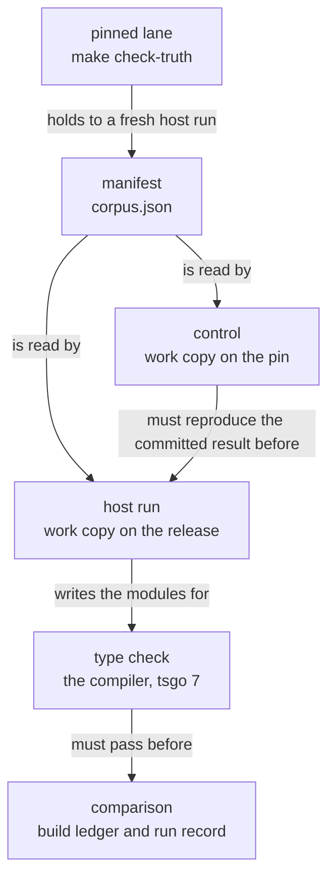

# The release lane: the truth harness on effect@4.0.1

This note owns the release lane. `make check-truth-release` runs it, and its program is
`scripts/check-truth-release.py`.

Decisions row 248 moves the pin from `effect@4.0.0-rc.112` to `effect@4.0.1` in increments.
Until the last increment lands, the lane checks the machine against both versions. One file,
the build ledger, says what each comparison must give.

## Words

| Word | Meaning here |
| --- | --- |
| build | One published version of the `effect` package that a host run loads |
| pin | The build that the tree transcribes: `effect@4.0.0-rc.112` |
| release | The build that the pin moves to: `effect@4.0.1` |
| install | A `node_modules` directory that holds one build |
| driver | The package `@effect/sql-sqlite-bun` of one build |
| compiler | tsgo 7: the package `@typescript/native-preview` at the version that `ts/eff/package.json` pins |
| manifest | `harness/truth/corpus.json`: the machine's exit and schedule for each program of the truth lane |
| runner | `harness/truth/run-truth.ts`: it runs each program on one build and compares three fields |
| work copy | A copy of the harness sources under `.lake/truth-release/`, linked to one install |
| build ledger | `harness/truth/build-ledger.tsv`: each program's expected agreement with each build |
| ledger line | The line of one program in the build ledger |
| entry | The value of one ledger line for one build and one field |
| run record | `harness/truth/build-ledger.run.json`: what the host run that wrote the entries ran on |

## What the lane runs

The diagram shows the order of the lane's steps. It claims no agreement of any program.



1. **The pinned lane runs first.** `make check-truth` holds the manifest, the result, the
   modules and the tapes to a fresh host run on the pin.
2. **The lane makes a work copy for each build.** It copies the runner, the sources that
   `harness/truth/tsconfig.json` names, and every file that they import.
3. **The control runs the pin through its work copy.** Its `result.json`, `result.md`, modules
   and tapes must equal the committed files byte for byte.
4. **The host run executes the runner on the release.** It reads the committed manifest, so
   Lean does not run again.
5. **The compiler type-checks each work copy** against the declarations of its own install.
6. **The lane compares both builds** with the build ledger and the run record.

The work copy differs from the committed sources in two places only:

- **The moved entry points.** The release has no `unstable/` folder. The lane rewrites each
  import from one table, `RELEASE_ENTRY_POINTS` (`scripts/lib/truth_host.py`). It checks every
  pair of the table against both installs.
- **The driver.** When the install has no driver, the import of `@effect/sql-sqlite-bun` becomes
  a stub. The lane does not run a program whose module names the prelude's `Sql`. A program
  that reaches the stub dies there, and the lane fails.

The committed `prelude.ts` and the committed modules do not change. The modules that the
release runs must equal the committed modules byte for byte, and the lane refuses any other.
When the lane does not run a program, it gives the runner the manifest without that program.

## The build ledger

The build ledger has one ledger line for each program of the manifest, in the manifest's
order. A line has six entries, one for each build and each field. It has two more columns,
`reason` and `slice`.

The three fields are the runner's:

- `exit`: the exit of the entry point that the machine's verdict names;
- `schedule`: the schedule of the fork entry point, without its `scheduled` rows;
- `sync`: the exit of `runSyncExit`.

| Entry | Meaning |
| --- | --- |
| `yes` | The machine and the build agree on the field |
| `no: <difference>` | They differ, and the text is the difference |
| `not-run` | The lane did not run the program on this build |
| `n/a` | The runner gives no verdict on the field |

The rules of the comparison:

- **Each entry is judged alone.** A known difference in one field excuses no other field.
- **A missing observation is neither agreement nor disagreement.** A program that the lane did
  not run is `not-run`. A field that the runner's result lacks is `n/a`. Neither equals `yes`.
- **A result must name each program that the lane selected.** The lane refuses a result with a
  program too few or too many.
- **A `no` holds its difference.** For an exit it holds both exits. For a schedule it holds the
  edit that turns the machine's schedule into the host's. A difference that changes shape
  leaves its line.
- **The seat that changes a line writes its `reason` and its `slice`.** Both are empty exactly
  when all six entries are `yes`. Otherwise `reason` says why in a few words, and `slice` names
  the owner.
- **`slice` opens with a slice of the migration plan,** `M0` to `M8`, or with `driver`. The
  plan is `docs/research/2026-10-05-claude-lead/migration-plan.md`.
- **A tape must not move.** The manifest replays the committed tape of a program. If the
  release records another tape, the lane fails, because that comparison is void.

A program that leaves its line fails the lane with one finding. The finding names the
program, the build, the field and both values:

```text
FAIL truth-release: pProvideMerge: 4.0.1 exit: the ledger says "yes", observed "no: machine success 2, host success 3"
```

A passing lane prints each entry that is not `yes`, with its `slice` and its `reason`. Its last
line counts the programs that agree with both builds, with one build only, and with neither.

The run record says what the host run that wrote the entries ran on. For each build it holds
the `effect` version, the driver, the bun version, the compiler version, and the digests of
the modules and the tapes. It also holds the SHA-256 of the manifest. The lane refuses a host
run on anything else, as the pinned lane refuses a drifted `result.json`.

The digest of a set of files is one SHA-256. It reads each file in name order: the name, a
zero byte, the file's bytes and a zero byte. For the pin's modules:

```sh
cd harness/truth/generated
for f in $(ls *.ts | LC_ALL=C sort); do printf '%s\0' "$f"; cat "$f"; printf '\0'; done | shasum -a 256
```

## How to point the lane at an install

The lane accepts the release only where `EFFECT4_RELEASE_NODE_MODULES` names it. The variable
has no default, and the lane installs and downloads nothing. It starts bun with `--no-install`.

The install must hold three things:

- `effect@4.0.1`;
- the compiler, at the pinned version;
- the types that `harness/truth/tsconfig.json` names (`@types/bun` and what it imports).

The install may hold the driver at `4.0.1`. The lane refuses a driver of any other version.
Put the driver and `effect` in one real install. Do not link the driver from another directory.
Under bun a linked package resolves its imports from its real path. A linked driver therefore
does not find `effect` (a finite probe on bun 1.4.2, 2026-10-05).

No tracked recipe installs the release yet. To assemble an install from directories that a
machine already has:

1. Make a folder, and name it `R`.
2. Link a directory that holds the `effect@4.0.1` package as `R/effect`.
3. Link `@typescript`, `@types`, `bun-types` and `undici-types` from the pin's install into `R`.
4. Set `EFFECT4_RELEASE_NODE_MODULES` to `R`.
5. Run `make check-truth-release`.

```sh
P="$PWD/ts/eff/node_modules"          # the pin's install
E=<a directory that holds the effect@4.0.1 package>
R=<a new folder>/node_modules
mkdir -p "$R"
ln -s "$E" "$R/effect"
for name in @typescript @types bun-types undici-types; do ln -s "$P/$name" "$R/$name"; done
export EFFECT4_RELEASE_NODE_MODULES="$R"
make check-truth-release
```

On 2026-10-05 seat M0 linked bun's cache copy, `~/.bun/install/cache/effect@4.0.1@@@1`. Its
`src` folder equals `vendor/effect-4.0.1/src` (tested by `diff -rq`).

## How to change the ledger

Change the ledger when the manifest or the printed program modules change, and when a slice
turns a program toward the release.

1. Make the pinned lane pass on the changed tree. `make gen-truth` writes its files, and
   `make check-truth` checks them.
2. Run `make gen-truth-ledger`. It writes the entries and the run record from a fresh host run.
3. Read the diff of both files.
4. Write `reason` and `slice` for each line that has an entry other than `yes`.
5. Run `make check-truth-release`.

`make gen-truth-ledger` keeps the hand columns of each line that still needs them. It empties
them on a line whose six entries are `yes`.

After a failed run, three files show what the lane saw:

- `.lake/truth-release/observed.tsv`: the ledger as that host run would write it;
- `.lake/truth-release/run.json`: the run record, with the paths of the installs;
- `.lake/truth-release/release/harness/truth/result.md`: the runner's own table.

## What the lane does not establish

- **The evidence is tested, not proved.** The lane is a finite host run and a finite compiler
  run over the programs of the manifest. A `yes` is the agreement of one field on that run.
- **The runner's table names the pin.** Its header and its notes say "rc.112" on every build.
  Read the lane's own findings for the build.
- **A program that is `not-run` has no observation on the release.** It is also outside the
  release's type check.
- **The lane checks that a `reason` is present.** It does not check that the reason is true.
- **The pinned lane does not read the ledger.** Its own rule still refuses every unsigned
  disagreement with the pin. The release lane compares the pin's entries with the committed
  `result.json`.
- **The control covers the copy, not the two rewrites.** The pin's work copy has no rewritten
  import and no stub.
- **The generated corpus is outside the lane.** `make check-corpus` runs it on the pin only.
- **The lane is tested on macOS only.** On 2026-10-05 no run covered the Windows branch of
  `link_install` (`scripts/lib/truth_host.py`).
