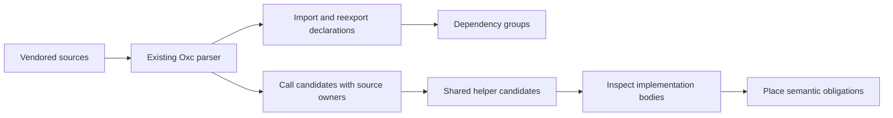

# Effect module survey

Use the vendored sources to find shared implementations before proposing shared semantics.
This tool reads syntax through the existing `ts/eff/ingest/oxc.ts` parser entry.
It creates no program representation and changes no library source.

## Run

Use the repository's Bun installation and existing `ts/eff` dependencies.

```sh
bun test tools/ModuleSurvey/survey.test.mjs
bun tools/ModuleSurvey/survey.mjs vendor/effect-4.0.1/src /tmp/effect-module-survey.json /tmp/effect-module-summary.json
```

The full report records every module, dependency declaration, direct call candidate and unresolved call candidate.
The summary retains source hashes, dependency groups, selected module details and shared helper candidates.
It also records the parser version, parser entry hash, survey hash and full report hash.
Both outputs are deterministic for the same sources, parser and runtime.
Malformed source refuses the whole report.

## Read the result



Value edges exclude explicitly type-only declarations.
They retain mixed imports, side-effect imports and value reexports.
They do not establish which imports survive compilation.
Dependency cycles remain groups.

Direct call candidates resolve imported spellings and top-level local declarations.
Owners identify top-level declarations or class methods.
The walk accounts for lexical shadowing, computed keys, destructured defaults and parameter defaults.
A later local export remains separate from a declaration's `directlyExported` flag.

Unresolved candidates remain visible.
The survey resolves no dynamic dispatch, callback target, local alias, nested helper target, execution order or behavior.
Nested function bodies retain their enclosing declaration's owner.
Shared helper frequency identifies bodies to inspect; it does not rank semantic primitives.

## Consumers

The module catalogue uses dependency groups to plan small implementation slices.
Reviewers inspect helper bodies and connect repeated behavior to existing proof obligations.
The module form's implementation map remains a separate consumer under decisions rows 331 and 335.
A source dependency alone proves no implementation agreement.
It establishes no claim about runtime coverage or the presence of every requested module operation.
